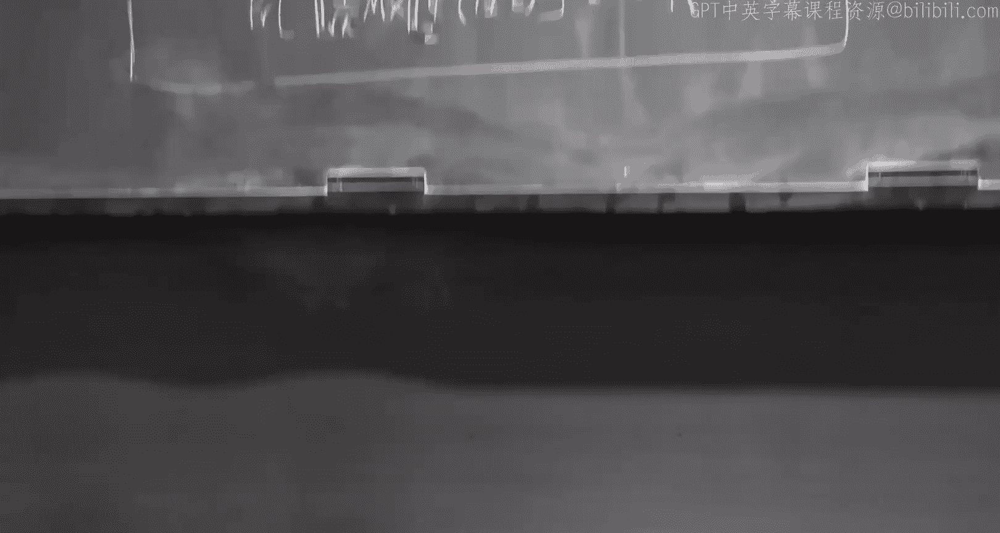
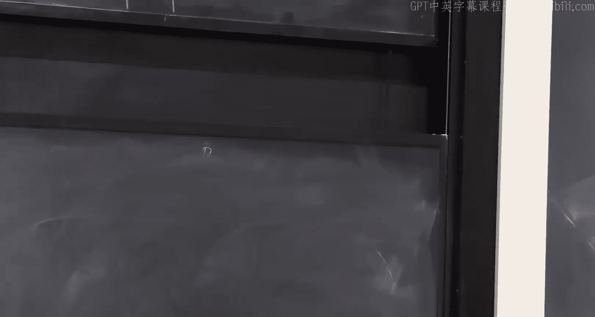
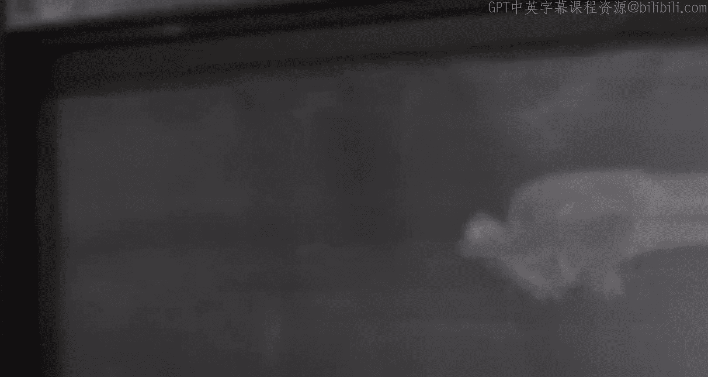
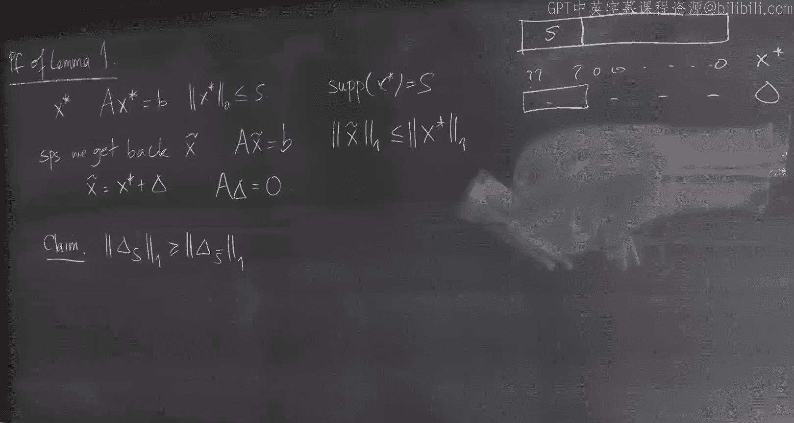

# 13：降维与压缩感知

在本节课中，我们将学习降维技术，特别是Johnson-Lindenstrauss引理，并探讨其一个令人印象深刻的应用——压缩感知。我们将看到，一旦证明了这样的降维结果，几乎可以“免费”获得其他有趣的算法思想。

## 回顾：Johnson-Lindenstrauss引理

上一节我们开始讨论降维，并提到了Johnson-Lindenstrauss引理。该引理指出，给定D维空间中的n个点（D非常大），存在一个映射，可以将这些点从D维降至 `O(log n / ε²)` 维，同时以高概率保持所有点对之间的距离，误差在 `(1 ± ε)` 因子内。

这与奇异值分解（SVD）不同，SVD在某种意义上是保持系统的“能量”，而Johnson-Lindenstrauss引理是保持所有成对距离。

## 构造与证明思路

该引理的构造出奇地简单。它是一个随机化算法，核心是构造一个矩阵 `M`。

**构造**：
*   矩阵 `M` 是一个 `k × d` 的矩阵，其中每个条目 `M_ij` 都是独立的标准高斯随机变量。
*   映射 `f` 定义为：`f(x) = (1/√k) * M * x`。

**主要断言**：
对于任意固定的单位向量 `x`，其映射后的长度平方（即 `||f(x)||²`）以高概率被保持。

由于映射是线性的，我们可以将此断言应用于所有点对的差向量（适当缩放后），然后通过并集界限（union bound）即可证明Johnson-Lindenstrauss引理。因此，证明的重心在于证明上述断言。

### 直观理解

我们想将高维空间中的点投影到一个随机选择的k维子空间上。如何均匀随机地选择一个k维子空间？

一种方法是：先随机选取一个单位向量作为第一个基向量，然后在与第一个向量正交的空间中随机选取第二个向量，依此类推。然而，在高维空间中，如果我们只是独立地随机选取单位向量，它们几乎就是正交的。这是因为在高维球面上，绝大多数质量都集中在任何“赤道”附近的狭窄带状区域中。

因此，我们可以近似地通过独立选取高斯随机向量（其方向是球对称的）来构建这个“几乎正交”的基。矩阵 `M` 的每一行就对应这样一个基向量。缩放因子 `1/√k` 是为了归一化。

## 从降维到压缩感知

现在，我们来看一个由降维思想衍生出的强大应用——压缩感知。其核心思想是：如果一个信号是稀疏的，那么可以用非常少的测量值来恢复它。

### 问题设定

假设有一个未知的向量 `x ∈ R^n`。我们可以进行测量：每次提供一个向量 `a`，得到内积结果 `a·x`。我们的目标是通过尽可能少的测量来确定 `x`。

一个简单的方法是使用单位向量进行测量（例如 `a1 = (1,0,...,0)`，`a2 = (0,1,...,0)` 等），这需要 `n` 次测量。但如果已知 `x` 是稀疏的，即其非零元素的数量 `||x||_0 ≤ s`（`s` 远小于 `n`），我们能否用远少于 `n` 次的测量来恢复它？

### 关键思路：约束等距性（RIP）

以下是解决问题的关键思路和步骤：

**第一步：构造测量矩阵**
我们不再使用单位向量，而是使用一个精心设计的矩阵 `A`（称为感知矩阵）的行作为测量向量。设 `A` 有 `m` 行（即 `m` 次测量），`n` 列。测量结果 `b = A * x`。

**第二步：利用稀疏性求解**
我们想从 `b = A * x` 中恢复稀疏的 `x`。直接最小化 `||x||_0`（非零元素个数）是一个NP难问题。一个巧妙的松弛方法是改为最小化 `||x||_1`（L1范数）。这个方法被称为**基追踪（Basis Pursuit）**。

**第三步：理论保证**
那么，什么条件下，最小化L1范数会得到与最小化L0范数相同的解（即真实的稀疏信号）？答案与感知矩阵 `A` 的一个性质有关，称为**约束等距性（Restricted Isometry Property， RIP）**。

**定义（RIP性质）**：
矩阵 `A` 满足 `(s, ε)`-RIP，如果对于所有最多有 `s` 个非零元素的向量 `x`，都有：
`(1 - ε) ||x||² ≤ ||A x||² ≤ (1 + ε) ||x||²`
这意味着 `A` 近似保持所有 `s`-稀疏向量的长度。

**定理（Donoho等人）**：
如果感知矩阵 `A` 满足 `(3s, ε)`-RIP 性质（其中 `ε` 足够小，例如小于1/10），那么通过求解基追踪问题（最小化 `||x||_1` 且满足 `A x = b`）可以精确恢复任何 `s`-稀疏的信号 `x`。

**第四步：如何获得RIP矩阵？**
令人惊喜的是，我们熟悉的Johnson-Lindenstrauss型矩阵恰好满足RIP！具体来说：
*   令 `A` 为一个 `m × n` 的随机矩阵，其每个条目独立地服从高斯分布 `N(0, 1/m)` 或等概率的 `{+1/√m, -1/√m}`。
*   如果测量次数 `m` 满足 `m = O(s log(n/s))`，那么以高概率，矩阵 `A` 满足 `(s, ε)`-RIP 性质。

### 证明概览（L1最小化等价于L0最小化）

假设真实的稀疏信号是 `x*`，测量结果为 `b = A x*`。设通过基追踪得到的解为 `x̃`，满足 `A x̃ = b` 且 `||x̃||_1 ≤ ||x*||_1`（因为 `x*` 也是一个可行解）。

定义误差向量 `δ = x̃ - x*`，则有 `A δ = 0`。

证明的核心思路是分析 `δ` 的结构：
1.  由于 `||x̃||_1 ≤ ||x*||_1`，可以推导出误差 `δ` 在 `x*` 的支撑集 `S` 之外的部分（`δ_{S^c}`）的L1范数，被 `S` 内的部分（`δ_S`）的L1范数所控制。
2.  利用 `A δ = 0` 和矩阵 `A` 的RIP性质（特别是对 `3s`-稀疏向量的等距性），可以证明 `δ` 的能量（L2范数）必须主要集中在其最大的 `3s` 个分量上。
3.  结合上述两点，最终可以推导出 `δ` 必须为零向量，即 `x̃ = x*`。这就证明了基追踪能精确恢复稀疏信号。

关于随机矩阵满足RIP的证明，其思路与Johnson-Lindenstrauss引理的证明类似：对所有可能的 `s`-稀疏向量支撑集进行并集界限，然后在每个固定的支撑集上，利用随机投影保持子空间中向量长度的概率结论。

## 总结

本节课我们一起学习了：
1.  **Johnson-Lindenstrauss引理**：通过随机高斯投影，可以将高维数据大幅降维并近乎完美地保持距离结构。其证明依赖于随机向量在高维空间中的几何性质（如几乎正交性）和概率集中不等式。
2.  **压缩感知**：作为降维思想的一个深刻应用，它表明稀疏信号可以用远少于信号长度的测量值来恢复。关键步骤是使用满足RIP性质的随机矩阵进行测量，并通过求解L1范数最小化问题（一个线性规划）来重构信号。
3.  **理论连接**：随机高斯/伯努利矩阵同时是Johnson-Lindenstrauss变换和压缩感知中理想感知矩阵的实例，这体现了不同领域间数学工具的统一与优美。

从数据降维到信号采集，这些概念展示了随机化和高维几何在现代算法设计中的强大力量。