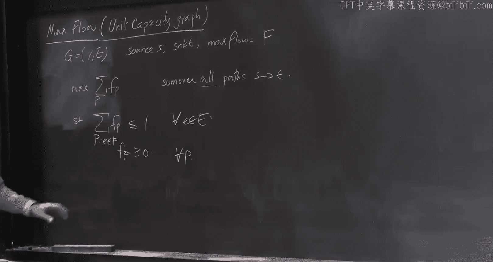
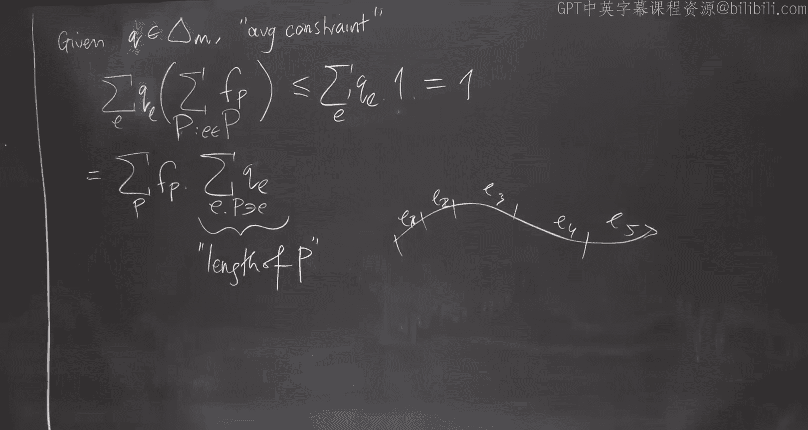
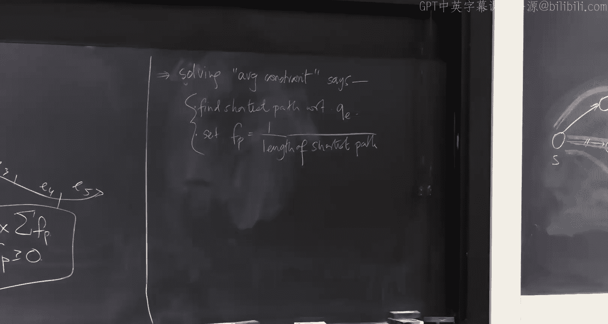

# 18：使用专家算法求解线性规划

在本节课中，我们将学习如何使用专家算法（特别是乘性权重算法或Hedge算法）来求解线性规划问题。这是一种简单但功能强大的方法，尤其适用于寻找近似解。

## 概述

我们将从一个已知的Hedge算法保证开始，然后展示如何将其应用于求解线性规划。核心思想是将线性规划的每个约束视为一个“专家”，通过迭代调整对每个约束的重视程度（概率权重），最终找到一个近似最优且近似可行的解。

---


## Hedge算法回顾

上一节我们介绍了Hedge算法的基本框架。本节中，我们来看看我们将作为黑盒使用的具体定理形式。

**Hedge算法保证**：固定一个误差参数 ε。对于任何取值范围在 [-ρ, ρ] 内的收益向量，只要运行时间 `t` 至少为 `Ω(ρ² log(N) / ε²)`（其中 N 是专家数量），Hedge算法确保对于任何专家 `i`，其平均收益满足以下关系：
```
平均收益(Hedge) ≥ (1 - ε) * 平均收益(专家 i) - O(ε)
```
这意味着，只要运行足够长的时间，Hedge获得的平均收益可以与任何专家（包括最佳专家）的收益相媲美，最多只有乘性和加性的微小损失。

**关键点**：
*   运行时间与收益向量的尺度 `ρ` 的平方成正比。
*   运行时间与专家数量 `N` 的对数成正比。
*   运行时间与误差参数 `ε` 的平方成反比。

这种对 `ε` 的依赖（`1/ε²`）在需要精确解时效率不高，但对于许多近似求解的场景已经足够好。

---

## 将线性规划转化为专家问题

现在，我们来看看如何将线性规划问题嵌入到专家框架中。

我们考虑如下形式的线性规划：
```
最大化： cᵀx
约束条件： Ax ≤ b
          x ≥ 0
```
其中 `A` 是一个 `m × n` 的矩阵（`m` 个约束，`n` 个变量），`b` 是 `m` 维向量，`c` 是 `n` 维向量。我们假设该线性规划是可行的。

**我们的目标**是找到一个解 `x̂`，使得：
1.  **目标值优越**：`cᵀx̂ ≥ cᵀx*`，其中 `x*` 是任意可行解（实际上我们会得到超优解）。
2.  **近似可行**：`A x̂ ≤ b + ε * 1`（即每个约束最多被违反 `ε` 个单位）。

我们将设计一个算法，其运行时间与 `ρ² / ε²` 相关，其中 `ρ` 被称为线性规划的“宽度”。

---


## 算法描述

上一节我们设定了目标，本节中我们来看看具体的算法步骤。


算法流程如下：


1.  **初始化专家**：为线性规划的每一个约束（共 `m` 个）创建一个专家。初始化一个概率分布 `p₁`，通常是均匀分布（每个专家权重为 `1/m`）。
2.  **迭代过程**（对于 `t = 1` 到 `T`）：
    a.  **构建平均约束**：使用当前的概率分布 `p_t` 对 `m` 个约束进行加权平均。
        定义平均约束向量：`αᵀ = p_tᵀ A`
        定义平均右侧值：`β = p_tᵀ b`
    b.  **求解子问题**：求解一个仅包含这个平均约束的简化线性规划：
        ```
        最大化： cᵀx
        约束条件： αᵀx ≤ β
                 x ≥ 0
        ```
        设其解为 `x_t`。这是一个单约束问题，通常很容易求解。
    c.  **计算收益向量**：计算解 `x_t` 对每个原始约束的违反程度。
        对于第 `i` 个专家（约束），其收益定义为：
        ```
        g_t[i] = (b_i - A_i x_t) / ρ
        ```
        其中 `A_i` 是矩阵 `A` 的第 `i` 行。`ρ` 是一个尺度因子，用于确保收益落在 `[-1, 1]` 范围内。收益为正表示约束被违反（`A_i x_t > b_i`），算法会因此增加该约束的权重。
    d.  **更新专家权重**：将收益向量 `g_t` 输入 Hedge 算法，获得更新后的概率分布 `p_{t+1}`。
3.  **输出**：运行 `T` 轮后，输出所有 `x_t` 的平均值作为最终解：`x̂ = (1/T) Σ x_t`。


**直观理解**：算法不断调整对各约束的重视程度。如果一个约束被频繁违反，其权重（概率）会增加，使得后续迭代中，平均约束更倾向于惩罚该约束，从而迫使算法寻找能更好满足该约束的解。



---



## 算法分析

我们已经描述了算法流程，现在来分析它为何能达到我们的目标。

设 `x*` 是原线性规划的一个可行解。

**1. 证明目标值优越**：
由于 `x*` 对每个原始约束都可行，因此它对于任何加权平均约束 `αᵀx ≤ β` 也是可行的。在每一步 `t`，我们求解的是在平均约束下最大化 `cᵀx` 的问题，而 `x*` 是该问题的一个可行解，因此有：
```
cᵀx_t ≥ cᵀx*
```
对所有 `t` 取平均，立即得到：
```
cᵀx̂ ≥ cᵀx*
```
**2. 证明近似可行**：
我们需要证明对于每个约束 `i`，有 `A_i x̂ ≤ b_i + O(ε)`。
考虑 Hedge 算法的保证。对于第 `i` 个专家，经过 `T` 轮后，其平均收益满足：
```
(1/T) Σ g_t[i] ≥ (1-ε) * (某个基准) - O(ε)
```
经过推导（具体过程涉及将收益定义代入并利用平均约束的可行性），这个不等式可以转化为：
```
A_i x̂ - b_i ≤ O(ε) * ρ
```
通过设置 `ρ` 和 `ε` 的关系，我们可以得到 `A_i x̂ ≤ b_i + O(ε)` 的形式。

**运行时间**：根据 Hedge 的保证，我们需要 `T = Ω(ρ² log(m) / ε²)` 轮迭代。因此，总运行时间取决于子问题求解的复杂度乘以 `T`。

**关键参数——宽度 `ρ`**：`ρ` 需要是收益向量 `g_t` 各分量的绝对值的上界。这通常取决于子问题解 `x_t` 的“规模”。如果 `x_t` 可能非常大，导致约束被严重违反，那么 `ρ` 就很大，算法需要更多轮迭代。因此，**宽度 `ρ` 不仅取决于线性规划本身，还取决于我们求解平均约束子问题的方法**。



---

## 应用实例：最大流问题

理论分析表明宽度 `ρ` 至关重要。本节中我们通过最大流问题来看一个具体例子，并探讨如何通过巧妙求解子问题来控制宽度。

考虑一个单位容量的有向图 `G=(V,E)` 上的最大流问题。我们可以将其写成一个线性规划，其中变量 `f_p` 对应每一条从源点 `s` 到汇点 `t` 的路径 `p`：
```
最大化： Σ f_p
约束条件： 对于每条边 e， Σ_{p: e ∈ p} f_p ≤ 1
          f_p ≥ 0
```
这个线性规划有指数级变量（所有路径）和 `m` 个约束（每条边一个）。

**应用我们的算法**：
*   **专家**：每条边对应一个专家。
*   **平均约束**：给定边上的概率分布 `q`（代表权重），平均约束为：
    ```
    Σ_p f_p * (路径 p 在权重 q 下的长度) ≤ 1
    ```
    其中路径长度是路径上所有边的权重 `q_e` 之和。
*   **求解子问题**：我们需要在 `Σ_p f_p * len_q(p) ≤ 1` 且 `f_p ≥ 0` 的条件下，最大化 `Σ_p f_p`。这个单约束问题的解非常直接：**将所有流量 `F` 都发送到当前权重 `q` 下最短的 `s-t` 路径上**。即，找到最短路径 `P*`，令 `f_{P*} = 1 / len_q(P*)`，其他 `f_p=0`。
*   **收益与更新**：收益与边的拥堵程度相关。发送流量后，该最短路径上的边变得拥堵，Hedge 算法会增加这些边的权重，使得后续迭代中，算法可能选择其他更“空闲”的路径。

**初始算法的宽度问题**：在这种简单实现中，每一步都将所有流量压到一条边上，可能导致某些边的流量 violation 很高。在最坏情况下，宽度 `ρ` 可能与最大流值 `F` 同阶，而 `F` 最大可达 `O(m)`，导致总运行时间高达 `O(m³)`，这并不高效。

---

## 改进：通过电气流降低宽度

上一节的例子暴露了宽度可能很大的问题。本节中我们看看如何通过改变子问题的求解方式来显著降低宽度。

核心思想是：**不要将所有流量塞到一条路径上，而是将流量“分散”到许多路径上**，使得没有单条边承载过大的流量。这样，每一步对任何单个约束的违反程度都会降低，从而减小宽度 `ρ`。

对于**无向图**上的最大流问题，一个巧妙的方法是使用**电气流**（Electrical Flow）来求解平均约束子问题。
*   **电气流定义**：将图中的每条边视为一个单位电阻，在源点 `s` 和汇点 `t` 之间施加 1 伏特的电压差，根据电路定律计算出的电流分布就是一种自然的 `s-t` 流。
*   **优良性质**：
    1.  **分散性**：电气流遵循最小能量耗散原理（能量 = Σ_e (流_e)² * 电阻），这天然地倾向于让流量分散到多条并行路径上，避免在单条边上集中过高电流。
    2.  **可快速计算**：计算电气流等价于求解一个图拉普拉斯（Laplacian）线性系统 `Lφ = b`，其中 `b` 在 `s` 处为 +1，在 `t` 处为 -1。近年来已有算法可以在近线性时间 `O~(m)` 内近似求解此类系统。
*   **效果**：使用电气流作为子问题的解，可以证明宽度 `ρ` 能从 `O(m)` 降至 `O(√m / ε)`。这是一个巨大的改进，能将最大流算法的运行时间从 `O(m³)` 提升到 `O~(m^{3/2})`，甚至通过进一步优化达到 `O~(m^{4/3})`（约10年前的先进水平）。

**关键启示**：宽度 `ρ` 并非线性规划固有的属性，它**高度依赖于我们求解平均约束子问题的方法**。一个智能的、能产生“均衡”解的子问题求解器，可以极大地提升主算法的效率。

---

## 总结与展望

本节课中我们一起学习了如何使用专家算法（乘性权重/Hedge）来求解线性规划。
1.  **框架**：我们将每个约束视为专家，通过迭代调整权重、求解加权平均后的单约束问题，最终聚合得到一个近似最优且近似可行的解。
2.  **关键参数**：算法的效率核心取决于**宽度 `ρ`**，它衡量了子问题解对原始约束的最大违反程度。
3.  **核心技巧**：通过设计巧妙的子问题求解器（如最大流问题中的电气流），可以有效地控制宽度，从而设计出高效的近似算法。
4.  **历史定位**：这种方法诞生于90年代，虽然对误差 `ε` 的依赖（`1/ε²`）不如后来出现的椭圆法（`log(1/ε)`）那样能产生强多项式时间算法，但其思想简单、通用，并在许多现代算法设计中仍有广泛应用。

这种方法展示了在线学习、博弈论与优化算法之间的深刻联系。在接下来的课程中，我们可能会从凸优化、在线学习等不同视角重新审视这一算法，并看到梯度下降、正则化追随者等概念与此本质相通。