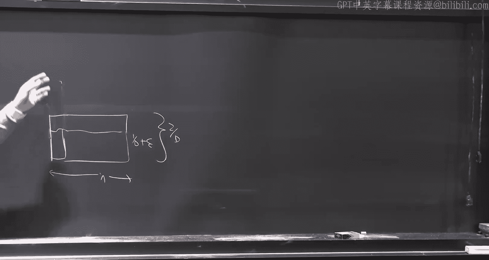
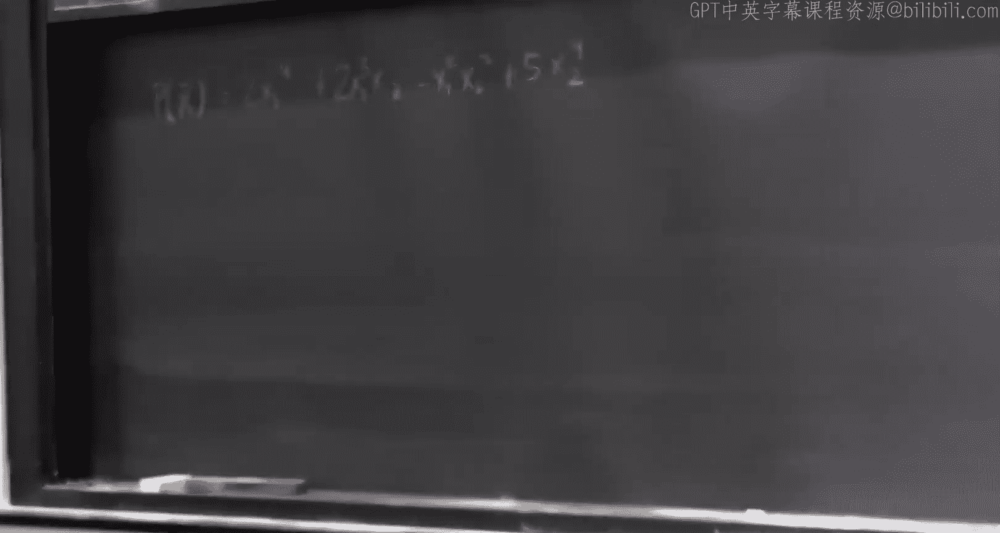
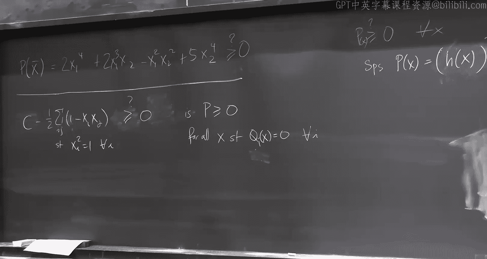

# 25：近似算法与半正定规划

在本节课中，我们将继续学习近似算法，特别是利用半正定规划（SDP）进行近似的方法。我们将首先完成上节课讨论的装箱问题线性规划，然后介绍SDP及其向量规划形式，最后探讨几个相关的应用问题。

## 装箱问题线性规划回顾

上一节我们介绍了装箱问题的基本设定，本节我们来看看如何通过线性规划来近似求解。

我们拥有 N 件物品，尺寸分别为 S1, S2, ..., SN，所有尺寸都在 0 到 1 之间。我们有无限多个容量为 1 的箱子。目标是**最小化**使用的箱子数量。我们希望得到一个使用 **(1 + 7ε) * OPT + f(ε)** 个箱子的算法。

以下是上节课我们为简化问题所做的两个假设：
1.  物品尺寸的种类数有限。
2.  每件物品的尺寸都大于等于 ε。

在这些假设下，我们给出了一种解法，随后我们将移除这两个假设。我们的处理方式是引入“配置”的概念。

一个**配置**是指一组物品尺寸的集合，其总尺寸不超过 1。例如，如果尺寸有 0.2, 0.3, 0.5，一个配置可以是包含 5 个 0.2 尺寸的物品，或者包含 4 个 0.2 尺寸和 3 个 0.3 尺寸的物品等。本质上，这些就是装箱的模式。

我们试图选择最少数量的配置。对于每种配置类型 C，令 X_C 为我们选择该配置的数量。我们需要满足：对于每种物品尺寸类型 S，所有包含 S 类物品的配置所提供的 S 类物品总数，必须至少等于我们拥有的 S 类物品数量 N_S。

更形式化地，令 A_{C,S} 为配置 C 中包含的 S 类物品数量。那么约束条件为：对于所有 S， Σ_C A_{C,S} * X_C ≥ N_S。同时，X_C ≥ 0。目标是最小化总配置数 Σ_C X_C。

这个线性规划的最优值最多是最优解 OPT。现在，考虑这个线性规划的一个基本可行解。变量数为 n，约束数为 B（即物品尺寸种类数）。在线性规划中，一个基本可行解最多有 B 个非零变量。

如果我们定义 X̂ 为将 X 中每个分量向上取整得到的结果，那么 X̂ 的 L1 范数（即分量和）最多比 X 的 L1 范数多 B。这意味着，即使我们将分数解向上取整，我们最多也只损失了 B 个箱子。

因此，我们希望 B 很小。但如果每种物品尺寸都唯一，B 就等于 N，这个界限就无用了。Fernandez、de la Vega 和 Lueker 提出了一种巧妙的方法来减少唯一尺寸的数量。

他们的思路如下：将所有物品按尺寸排序并排列起来。我们将这些物品分成 D 组（例如 D=5）。对于每一组，我们将组内所有物品的尺寸“放大”到该组中最大物品的尺寸。这样，我们就只有 B = D 种不同的物品尺寸了。

现在，我们需要分析这种“放大”操作对最优解的影响。假设我们为“放大后”（黄色）的物品找到了一个装箱方案。由于原始（白色）物品的尺寸更小，它们可以放入黄色物品所在的箱子中。所以，为黄色物品找到的方案对白色物品也有效。

主要问题在于，原始最优解可能对放大后的物品不可行，因为放大后的物品尺寸变大了。我们需要证明，放大后实例的最优解 OPT_rounded 不会比原始实例的最优解 OPT_original 大太多。

考虑原始最优解。我们可以尝试将放大后的物品“平移”到原始物品所在的箱子中。具体来说，除了每组的第一件物品（即尺寸被放大的那件），其他放大后的物品都可以放入对应原始物品所在的箱子。那些无法放入的“第一件”物品有多少件呢？最多有 N/D 件（每组一件）。因此，我们可以为这些物品单独开辟新箱子。

所以，我们有：OPT_rounded ≤ OPT_original + N/D。

现在，我们选择 D = 1/ε²。那么 N/D = ε²N。由于每件物品尺寸至少为 ε，所有物品的总体积至少为 εN。而最优解 OPT_original 至少需要 ceil(总体积) 个箱子，因此 OPT_original ≥ εN。所以，ε²N = ε * (εN) ≤ ε * OPT_original。

综上，我们得到：OPT_rounded ≤ (1 + ε) * OPT_original + 1/ε²。这里我们关键用到了“物品尺寸至少为 ε”的假设。

那么，对于尺寸小于 ε 的“小物品”如何处理呢？思路很简单：先处理所有“大物品”（尺寸 ≥ ε），用上述方法得到一个近似最优的装箱方案。然后，我们尝试将这些小物品“填充”到已打开箱子的剩余空间中。如果一个箱子无法再放入任何小物品，说明它已经非常满了（剩余空间 < ε）。此时我们才需要为小物品打开新箱子。由于小物品尺寸很小，当需要打开新箱子时，其他所有箱子都至少装了 (1 - ε) 的体积，这本身就构成了一个 (1 + ε) 的近似。因此，小物品可以在最后以类似“见缝插针”的方式高效处理。

这就是 Fernandez de la Vega 和 Lueker 算法的核心思想。后续研究不断改进这个界限，目前最好的结果之一是 OPT + O(log² OPT)。一个重要的开放问题是能否达到 OPT + O(1)。

关于如何求解这个线性规划：由于物品尺寸种类数 D = 1/ε² 是常数，且每个配置最多包含 1/ε 件物品，因此可能的配置总数是常数个。理论上可以直接求解。在实践中，可以使用列生成方法，这涉及到对偶和单纯形法。

## 半正定规划简介

现在，让我们进入今天的主题：半正定规划。

首先，我们给出半正定矩阵的定义。我们只考虑实对称矩阵。一个实对称矩阵 **A** 是**半正定**的，如果对于所有实向量 **x**，都有 **xᵀ A x ≥ 0**。等价地，存在向量 **v₁, ..., v_n**，使得矩阵 **A** 的每个元素 A_{ij} = **v_i · v_j**（向量内积）。还存在其他等价定义，例如 **A** 可以表示为若干秩一矩阵的和。

半正定规划有两种等价的看待方式，各有其用处。

**视角一：矩阵形式**
我们将半正定规划视为线性规划的推广。我们有变量 X_{ij}，它们自然地排列成一个矩阵 **X**。约束是线性的，形式为 **A_k · X ≥ b_k**，其中 **·** 表示矩阵的弗罗贝尼乌斯内积（即对应元素相乘后求和）。与线性规划的关键区别在于，我们要求变量矩阵 **X** 是半正定的，记作 **X ≽ 0**。因此，问题形式为：
最小化 **C · X**
满足 **A_k · X ≥ b_k**，对于 k = 1, ..., m
且 **X ≽ 0**

**视角二：向量程序形式**
这种视角更为几何化，通常也更实用。我们直接将变量视为向量 **v₁, v₂, ..., v_n**，它们的维度不受我们控制（但可以证明最优解不超过 n 维）。约束是这些向量内积的线性组合。例如，一个约束可能是 Σ_{i,j} a_{ij} (**v_i · v_j**) ≥ b。目标函数也是内积的线性组合。因为一个矩阵是半正定的，当且仅当它的元素可以表示为某些向量的内积。所以，向量程序形式与矩阵形式是等价的。

关于半正定规划，有几个重要事实：
1.  **对偶性**：与线性规划类似，半正定规划也有对偶。弱对偶定理成立：任何原始可行解的目标值 ≥ 任何对偶可行解的目标值。强对偶性不一定成立，但在满足某些条件（如 Slater 条件）时成立。
2.  **解的大小**：线性规划的解总是有理数且规模可控。而半正定规划的解可能是指数大小甚至是无理数。例如，可以构造一个 SDP 来强制变量间满足平方关系（如 x₂ = x₁², x₃ = x₂²,...），导致解呈双指数增长。因此，处理 SDP 时需要小心。
3.  **可求解性**：如果假设解的大小是多项式级别的，那么存在内点法等算法可以在多项式时间内找到任意精度的近似解。对于今天的讲座，我们将假设 SDP 可以被精确求解。

## 应用：最大割问题的近似算法

半正定规划最早令人惊艳的应用之一就是用于近似求解**最大割问题**。

给定一个无向无权图 G=(V,E)，目标是找到一个划分 (S, V\S)，使得跨越割的边数最多。这是 NP 难问题。

一个简单的随机算法是：独立地以 1/2 的概率将每个顶点放入 S。每条边被割的概率是 1/2，因此期望割的边数是 |E|/2。由于最优解最多割掉所有边，这是一个 1/2 近似的算法。贪心算法、局部搜索等也都能达到 1/2 的近似比。

Goemans 和 Williamson 在 1995 年提出了一个基于 SDP 的算法，将近似比大幅提升到了约 **0.878**。

**算法步骤如下：**

1.  **整数二次规划建模**：
    为每个顶点 i 分配变量 x_i ∈ {+1, -1}，+1 表示在 S 中，-1 表示在 V\S 中。那么，对于边 (i,j)，如果它被割，则 (x_i - x_j)²/4 = 1（因为两者符号不同）；否则为 0。因此，最大割问题等价于：
    最大化 Σ_{(i,j)∈E} (1 - x_i x_j)/2
    满足 x_i² = 1，对于所有 i。

2.  **松弛为向量程序（SDP）**：
    我们将标量变量 x_i 松弛为单位向量 **v_i**（模长为 1）。乘积 x_i x_j 被替换为内积 **v_i · v_j**。问题松弛为：
    最大化 Σ_{(i,j)∈E} (1 - **v_i · v_j**)/2
    满足 **v_i · v_i** = 1，对于所有 i。
    这是一个向量程序，可以等价地写成一个 SDP。这个 SDP 的最优值至少是原整数规划的最优值（即 OPT），因为我们可以将最优解中的 +1/-1 映射为两个反向的单位向量。

3.  **随机超平面舍入**：
    求解 SDP 后，我们得到一组单位向量 **v_i**。然后，我们随机选取一个单位球面上的随机向量 **g**（例如，服从多维标准正态分布，然后归一化）。对于每个顶点 i，如果 **v_i · g ≥ 0**，则将其放入 S；否则放入 V\S。

**分析：**
对于一条边 (i,j)，设其对应的两个向量夹角为 θ，即 **v_i · v_j** = cos θ。在随机超平面舍入中，这条边被割当且仅当 **g** 落在将 **v_i** 和 **v_j** 分开的区域内。这个概率恰好是 θ/π。
因此，边 (i,j) 被割的期望概率是 θ/π。
而 SDP 目标函数中，这条边的贡献是 (1 - cos θ)/2。
我们需要比较这两个量。定义函数 α_GW = min_{0≤θ≤π} [ (θ/π) / ((1 - cos θ)/2) ]。通过计算（或数值求解），这个最小值约为 0.878。这意味着，对于每条边，舍入算法得到的期望值至少是 SDP 值的 0.878 倍。由于 SDP 值 ≥ OPT，因此算法的期望割边数至少是 0.878 * OPT。

后续研究表明，在独特的游戏猜想下，0.878 这个近似比对于多项式时间算法是最好的。这为算法的紧性提供了有力的证据。

## 半正定规划的延伸：平方和规划

最后，我们简要介绍一个由半正定规划衍生出的强大框架：**平方和规划**。这将在我们后续的课程中详细讨论。

考虑一个经典问题：给定一个多元多项式 P(x₁, ..., x_n)，判断它是否**非负**，即是否对所有实数输入都满足 P(x) ≥ 0。这是一个非常基础且困难的问题（即使是受限版本也是 NP 难的）。

一个**充分条件**是：如果多项式 P 可以写成一个**平方和**，即存在多项式 h₁(x), ..., h_k(x)，使得 P(x) = Σ_i [h_i(x)]²，那么 P(x) 显然是非负的。

因此，我们可以提出一个“松弛”的判定问题：给定多项式 P，它是否具有一个平方和表示？如果答案是“是”，那么 P 非负；如果答案是“否”，我们则无法确定。

令人惊讶的是，**判断一个多项式是否为平方和**这个问题，可以通过一个半正定规划来求解！我们将在假期后的课程中展示如何构造这个 SDP。

需要指出的是，存在一些非负多项式**不是**平方和。但根据 Artin 对希尔伯特第 17 问题的解答，任何非负多项式都可以写成一个平方和与一个非零多项式的商。

平方和规划是近年来在算法、优化和机器学习中非常活跃和强大的工具，由 Lasserre 等人发展起来。它为解决一系列困难问题提供了统一的框架。

## 总结

本节课中我们一起学习了：
1.  完成了装箱问题的线性规划近似算法分析，理解了如何通过分组和放缩技术处理物品尺寸，以及如何处理大小物品。
2.  介绍了半正定规划的基本概念、两种等价形式（矩阵形式和向量程序形式）以及其重要性质。
3.  深入探讨了半正定规划在最大割问题上的经典应用：Goemans-Williamson 算法。我们看到了如何将组合优化问题建模为整数二次规划，松弛为 SDP，并利用巧妙的随机超平面舍入技术获得优于简单随机算法的近似比。
4.  简要展望了由 SDP 扩展出的平方和规划框架，为后续学习更强大的优化工具做了铺垫。

下节课我们将讨论在线算法，并在之后深入探讨平方和规划。