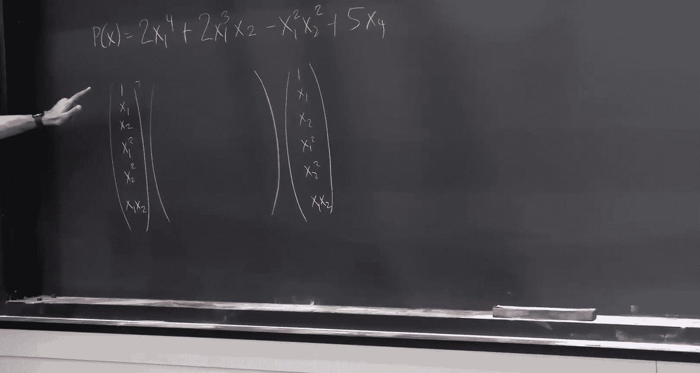
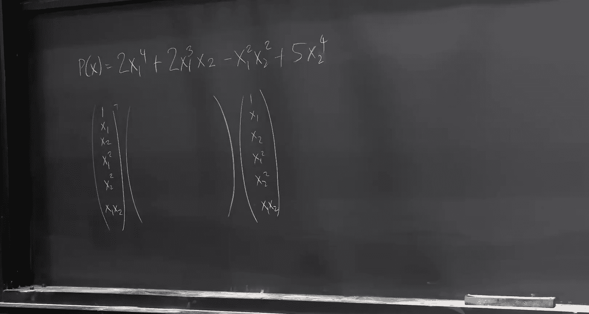

# 27：平方和范式 🧮

在本节课中，我们将要学习平方和范式。这是一种用于分析和优化多项式系统的强大框架。我们将从线性规划的对偶性出发，逐步探讨如何将其思想推广到多项式系统，并介绍平方和规划这一核心工具。

## 从线性规划到多项式系统

上一节我们介绍了线性规划中的强对偶性和Farkas引理。本节中我们来看看如何将这些思想推广到更复杂的多项式系统。

考虑一个多项式优化问题。给定一个多项式 `P(x)`，我们希望在所有满足一组多项式等式和不等式约束的向量 `x` 上最大化 `P(x)`。具体形式如下：

```
最大化 P(x)
约束条件：
    F_i(x) ≥ 0, 对于所有 i
    G_j(x) = 0, 对于所有 j
```

其中，`x` 是一个向量，`F_i` 和 `G_j` 都是多项式。一个著名的特例是最大割问题，它可以表述为：

```
最大化 Σ_{(i,j)∈E} (1 - x_i * x_j)/2
约束条件：
    x_i^2 = 1, 对于所有 i
```


这里的约束 `x_i^2 = 1` 等价于 `x_i ∈ {-1, 1}`。这个集合是离散的、非凸的，使得优化问题变得非常困难。

## Farkas引理与证明系统

在线性规划中，Farkas引理为我们提供了一个判断系统是否可行的“证明系统”。它指出，对于一个线性系统 `Ax ≤ b`，以下两种情况恰好有一种成立：

1.  系统是可行的（存在 `x` 使得 `Ax ≤ b`）。
2.  系统是不可行的，并且存在一个非负向量 `y`，使得 `y^T A = 0` 且 `y^T b = -1`。

第二种情况提供了一个不一致性的证明：我们可以将原始不等式进行非负线性组合，得到 `0 ≤ -1` 这一矛盾。这个证明系统是完备的：任何不可行的线性系统都能通过这种方式被证明。

## 平方和范式：对多项式系统的推广

对于多项式系统，我们希望有一个类似的“证明系统”。我们希望说：要么多项式系统 `K`（由 `F_i(x) ≥ 0` 和 `G_j(x) = 0` 定义）是可行的，要么我们可以证明它是不可行的。

一个自然的想法是模仿Farkas引理，尝试将约束进行组合。对于多项式，我们不能只使用标量系数，而需要使用多项式作为系数。更重要的是，为了保持不等式的非负性，我们要求用于乘不等式 `F_i(x) ≥ 0` 的系数多项式本身也是非负的。

以下是平方和范式的一个核心概念：

一个多项式是**平方和**，如果它可以写成其他多项式的平方和。例如：
`H(x) = (2x_1 + 3x_2)^2 + (x_1 - x_3)^2`

平方和多项式永远是非负的。平方和范式建议我们使用平方和多项式作为组合约束时的系数。

那么，我们期望的“多项式Farkas引理”大致如下：如果系统 `K` 不可行，那么存在平方和多项式 `S_i(x)` 和多项式 `T_j(x)`，使得：
`-1 = Σ_i S_i(x) * F_i(x) + Σ_j T_j(x) * G_j(x)`

对于所有 `x` 恒成立。因为 `F_i(x) ≥ 0` 且 `S_i(x)` 是平方和（故非负），所以右边第一项非负。而 `G_j(x) = 0`，所以右边第二项为零。这就得到了 `-1` 等于一个非负量的矛盾，从而证明了系统的不一致性。

然而，这个精确的表述并不总是成立。一个被称为 **Positivstellensatz** 的定理给出了正确的形式：如果系统 `K` 是紧致的（闭且有界），并且不可行，那么 `-1` 可以写成一个更复杂的表达式，该表达式涉及约束多项式的乘积与平方和多项式的组合。这为多项式系统提供了一个完备的证明系统。

## 检测平方和：半定规划的应用

为了实际使用平方和范式，我们需要解决一个基本问题：如何判断一个给定的多项式是否是平方和？



令人惊讶的是，这个问题可以通过**半定规划**来解决。



假设我们有一个 `d` 次多项式 `P(x)`，我们想知道它是否能写成一些次数不超过 `d/2` 的多项式的平方和。

我们可以将 `P(x)` 表示为一系列单项式 `x^α`（其中 `α` 是指数向量）的线性组合。设 `z` 是一个向量，其分量是所有次数不超过 `d/2` 的单项式（例如 `1, x_1, x_2, x_1^2, x_1x_2, ...`）。

那么，`P(x)` 是平方和，当且仅当存在一个半正定矩阵 `Q`，使得 `P(x) = z^T Q z` 对所有 `x` 成立。这里，`z^T Q z` 展开后，`Q` 中的元素就对应了平方和表示中系数的各种乘积组合。

因此，判断 `P(x)` 是否为平方和，等价于寻找一个满足一组线性等式（这些等式由 `P(x)` 的系数决定）的半正定矩阵 `Q`。这正是一个半定规划问题，其规模约为 `n^{O(d)}`。

## 通过伪期望进行优化

最后，我们来看如何利用平方和思想来近似求解困难的多项式优化问题。

考虑最小化 `P(x)` 在约束集 `K` 上的值。一个关键的思路是，我们不直接寻找最优解 `x*`，而是寻找一个在 `K` 上的概率分布 `μ`，使得期望值 `E_{x~μ}[P(x)]` 最小。最优解显然对应一个集中在 `x*` 上的分布。

然而，优化整个分布空间是困难的。我们观察到，对于多项式 `P`，其期望值仅依赖于分布 `μ` 的**低阶矩**（即 `E[x^α]` 对于小的 `|α|`）。

这引出了**伪期望**方法。我们定义一组变量 `L(x^α)`，我们希望它们能代表某个分布 `μ` 的矩。我们要求这个线性泛函 `L` 满足：
*   `L(1) = 1`（概率分布归一化）。
*   对于所有约束多项式 `G_j`，有 `L(G_j) = 0`（在约束集上期望为零）。
*   对于所有约束多项式 `F_i` 和所有平方和多项式 `S`，有 `L(S * F_i) ≥ 0`（在非负函数上期望非负）。

然后，我们尝试在满足这些约束的条件下，最小化 `L(P)`。如果我们只对 `S` 和 `F_i*S` 的次数加以限制（例如只考虑低阶平方和），那么这个问题就变成了一个关于矩变量 `L(x^α)` 的半定规划。

这个半定规划的解给出了原问题最优值的一个下界。其对偶问题恰好对应于寻找一个低阶的平方和证明，以证明 `P(x) - λ` 在 `K` 上是非负的（即 `λ` 是目标值的一个下界）。这就是平方和规划的基本框架。

## 总结

本节课中我们一起学习了平方和范式。我们从线性规划的Farkas引理出发，探讨了如何为多项式系统构建类似的证明系统，这引出了Positivstellensatz定理。我们了解到，判断一个多项式是否为平方和可以转化为半定规划问题。最后，我们介绍了利用伪期望和矩方法进行多项式优化的基本思路，该方法通过求解一个半定规划松弛来获得原问题的最优下界。平方和范式从而在计算复杂度和证明能力之间提供了一个强大的折衷工具。