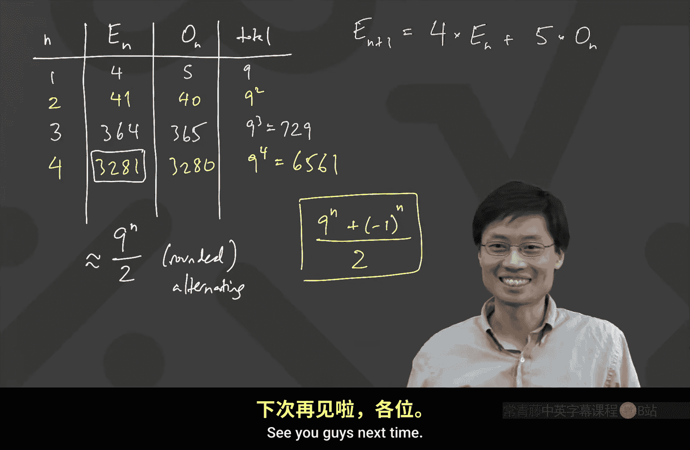

# 001：课程介绍与计数入门

## 概述

在本节课中，我们将学习卡耐基梅隆大学离散数学课程的基本介绍，并深入探讨组合数学中的计数原理。我们将从简单的计数问题开始，逐步引入更复杂的场景，并学习如何运用递归等高级技巧来解决问题。

---

## 课程介绍与安排

大家好，欢迎来到卡耐基梅隆大学。这是新学期的第一天。很高兴见到大家。本课程是关于离散数学的。我们将讨论处理离散对象的各种方法。离散对象可以表现为计数问题，这通常被称为组合数学。我们也会讨论网络等概念。

本课程将涵盖许多不同的主题。课程将通过Zoom进行。如果你有问题或想发言，请在聊天框中输入“raise hand”或“RH”。我会点名让你发言。我理解并非所有人都能打开摄像头和麦克风。但如果你可以，我建议你打开，这样课堂体验会更像与真人一起学习，而不是面对黑屏白字。

课程评分方式如下：作业占10%，考试占60%（三次期中考试），期末考试占30%。作业可以讨论合作，但提交的答案必须是亲自完成。考试将是开卷开卷考试，但需要在Zoom上进行，并打开摄像头。

课程没有固定教材，但有一本由往届学生编写的详细笔记，将作为我们的参考书。我会在每周课程后分享相应的部分。

---

## 计数原理入门

上一节我们介绍了课程的基本情况，本节中我们来看看组合数学中最基础的部分：计数。

计数问题通常询问“有多少种方式”来完成某事。我们从一些简单问题开始，逐步增加难度。

### 基础乘法原理

第一个问题：有多少个四位数？

一个直接的思路是：一个四位数有四个位置。每个位置（数字）有10种选择（0-9）。根据乘法原理，总数为 `10 * 10 * 10 * 10 = 10000`。

然而，如果我们规定第一个数字不能为0（即它是一个真正的四位数），那么第一个数字只有9种选择（1-9），其他位置仍有10种选择。因此，答案是 `9 * 10 * 10 * 10 = 9000`。

乘法原理有效的逻辑在于：无论第一个数字选择什么，第二个数字始终有10种选择。因此可以相乘。

### 引入约束条件

现在，我们增加一个约束条件：有多少个四位数（首位非零），且没有两个相同的数字相邻？

以下是解决思路：
1.  第一位有9种选择（1-9）。
2.  对于第二位，它可以选0-9中任意一个数字，但不能与第一位相同。因此，无论第一位选了什么，第二位总有9种选择。
3.  第三位同样可以选0-9中任意数字，但不能与第二位相同。所以也是9种选择。
4.  第四位同理，不能与第三位相同，也是9种选择。

因此，答案是 `9 * 9 * 9 * 9 = 9^4`。

这个问题的关键在于**计算顺序**。我们必须从左到右计算，因为约束条件“不能与左边相邻数字相同”依赖于前一个选择。如果从右往左算，会遇到麻烦：当计算最左边的数字时，它的选择数量取决于它右边的数字是否为0，这会使得计算复杂，只能得到一个答案的范围（介于 `10*9*9*8` 和 `10*9*9*9` 之间），而非精确值。

---

## 复杂计数问题与递归思想

上一节我们处理了带有相邻数字约束的计数问题，本节中我们来看看一个更复杂的问题，并引入递归的解决思路。

### 一个更具挑战性的问题

问题：有多少个四位数（首位非零），满足**偶数**，且**没有两个相同的数字相邻**？

这是一个复杂的问题。直接应用乘法原理很困难，因为最后一位必须是偶数（0,2,4,6,8），但它的选择又受到倒数第二位数字的影响。

我们可以尝试两种思路，但都只能得到答案的范围：
*   **从左往右算**：第一位9种，第二、三位各9种，最后一位是偶数。但最后一位的选择数取决于第三位是否是偶数。这给出了一个范围：`9^3 * 4` 到 `9^3 * 5`。
*   **从右往左算**：最后一位5种（偶数），向前推。同样，最左边的数字选择数取决于其右边数字，得到另一个范围：`10*9*9*5` 到 `9*9*9*5`。

这些范围重叠，但无法给出精确答案。一种可行但繁琐的方法是**分情况讨论**，根据前三位数字的奇偶性（共8种情况）分别计算。虽然可行，但过程冗长。

### 寻找新模式：递归

面对复杂问题，一个有效的策略是**先解决更小规模的同类问题**，寻找模式。

我们先定义：
*   **E(n)**：满足条件（无相同相邻数字，首位非零）的 **n 位偶数** 的个数。
*   **O(n)**：满足条件的 **n 位奇数** 的个数。

计算小规模问题：
*   n=1（一位数）: E(1) = 4 (2,4,6,8), O(1) = 5 (1,3,5,7,9). 总数 = 9。
*   n=2（两位数）: 通过枚举或简单计算可得，E(2) = 41, O(2) = 40. 总数 = 81 = 9^2。

这里出现一个有趣现象：E(2) 和 O(2) 非常接近，仅相差1。总数是9的幂。

**关键递归关系**：
要构建一个 n+1 位的偶数，我们看最后一位（第 n+1 位）：
1.  如果前 n 位以偶数结尾，那么最后一位必须选一个偶数，且不能等于第 n 位的数字。因此有 4 种选择（5个偶数中减去1个）。
2.  如果前 n 位以奇数结尾，那么最后一位选任意偶数都不与奇数冲突。因此有 5 种选择。

因此，我们得到了递归公式：
**E(n+1) = 4 * E(n) + 5 * O(n)**

由于总数 T(n) = E(n) + O(n) = 9^n，我们也有 O(n) = 9^n - E(n)。利用这个关系和递归公式，我们可以递推计算：
*   E(3) = 4*E(2) + 5*O(2) = 4*41 + 5*40 = 364. O(3) = 9^3 - 364 = 729 - 364 = 365.
*   E(4) = 4*E(3) + 5*O(3) = 4*364 + 5*365 = 3281. 这就是我们最初问题的答案。

### 通用公式与总结

观察 E(n) 的序列：4, 41, 364, 3281...
它们非常接近 9^n / 2，并且交替地进行“向上取整”和“向下取整”。事实上，可以推导出精确的通项公式：

**E(n) = (9^n + (-1)^n) / 2**

验证：
*   n=1: (9 - 1)/2 = 4
*   n=2: (81 + 1)/2 = 41
*   n=3: (729 - 1)/2 = 364
*   n=4: (6561 + 1)/2 = 3281

完全匹配。

本节课中我们一起学习了计数问题的基本乘法原理，处理了带有约束条件的计数，并最终通过定义序列、发现递归关系，解决了一个复杂的计数问题，甚至推导出了其优美的通项公式。这展示了离散数学中，将复杂问题分解、寻找模式、建立递归关系这一强大而优雅的思维方式。