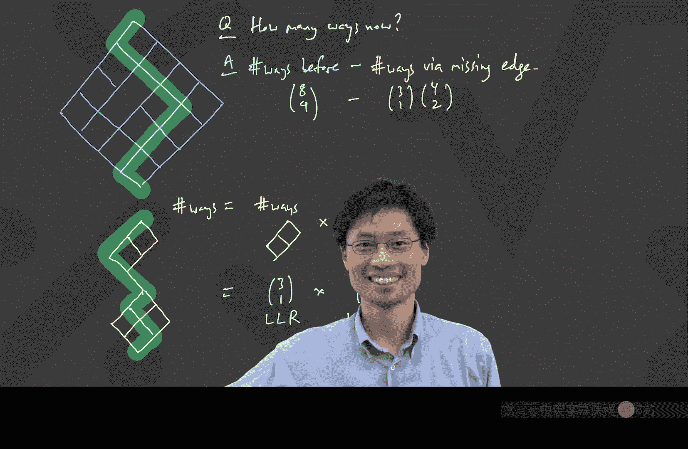

# 002：递归、矩阵与路径计数


在本节课中，我们将继续探讨一个有趣的计数问题，并学习如何运用递归关系和矩阵工具来解决它。我们还将接触一个更经典的网格路径计数问题，并学习如何处理路径中的障碍。

## 问题回顾与递归建立

上一节我们留下了一个有趣的问题：统计满足以下条件的四位数个数：
1.  相邻数字不相等。
2.  数字是偶数。

我们定义了两个序列：
*   **E_n**：满足条件的 **n** 位**偶数**的个数。
*   **O_n**：满足条件的 **n** 位**奇数**的个数。

对于初始情况，我们很容易得出：
*   **E_1 = 4** （数字为 2, 4, 6, 8）
*   **O_1 = 5** （数字为 1, 3, 5, 7, 9）

为了建立递归关系，我们考虑如何从一个 **n** 位数构造一个 **n+1** 位数。

**情况一**：如果原来的 **n** 位数是偶数（**E_n** 种可能），要使其保持为偶数，最后一位必须是一个不同于原最后一位的偶数。有 4 个偶数可选（5个偶数去掉已用的那个）。因此，这种情况贡献了 **4 * E_n** 种可能。

**情况二**：如果原来的 **n** 位数是奇数（**O_n** 种可能），要使其变为偶数，最后一位可以是任意一个偶数（5个）。因此，这种情况贡献了 **5 * O_n** 种可能。

综合两种情况，我们得到关于偶数的递归式：
**E_{n+1} = 4E_n + 5O_n**

同理，我们可以推导出关于奇数的递归式：
**O_{n+1} = 5E_n + 4O_n**

## 引入矩阵工具

上一节我们介绍了递归关系，本节我们来看看如何用矩阵这个强大的工具来求解它。

上述递归关系可以漂亮地改写为矩阵形式：
```
[ E_{n+1} ]   =   [ 4  5 ]   [ E_n ]
[ O_{n+1} ]       [ 5  4 ]   [ O_n ]
```
我们将其简写为：
**v_{n+1} = M * v_n**
其中 **v_n = [E_n, O_n]^T**， **M = [[4, 5], [5, 4]]**。

这个形式的好处是，我们可以通过连续应用矩阵 **M** 来得到通项公式：
**v_n = M^{n-1} * v_1**
其中 **v_1 = [4, 5]^T**。

我们的目标 **E_n** 就是向量 **v_n** 的第一个分量。问题转化为如何高效计算矩阵 **M** 的幂 **M^{n-1}**。

## 矩阵对角化：简化幂运算

计算矩阵的高次幂通常很复杂，但对于某些特殊矩阵（如这里的 **M**），我们可以通过“对角化”来极大地简化计算。

我们发现矩阵 **M** 有两个很好的性质：
1.  **M * [1, 1]^T = 9 * [1, 1]^T**
2.  **M * [1, -1]^T = (-1) * [1, -1]^T**

在线性代数中，数字 **9** 和 **-1** 被称为矩阵 **M** 的**特征值**，向量 **[1, 1]^T** 和 **[1, -1]^T** 被称为对应的**特征向量**。

利用这两个性质，我们可以将 **M** 分解为：
**M = P * D * P^{-1}**
其中：
*   **P = [[1, 1], [1, -1]]** （由特征向量组成的矩阵）
*   **D = [[9, 0], [0, -1]]** （由特征值组成的对角矩阵）
*   **P^{-1}** 是 **P** 的逆矩阵。

这个分解的妙处在于，计算 **M** 的幂变得非常简单：
**M^k = (P * D * P^{-1})^k = P * D^k * P^{-1}**
因为中间的 **P^{-1} * P** 会相互抵消。而对角矩阵 **D** 的幂极易计算：
**D^k = [[9^k, 0], [0, (-1)^k]]**

## 推导最终公式

将上述结果代入通项公式 **v_n = M^{n-1} * v_1**，并经过一系列矩阵乘法运算（具体计算过程课上已演示），我们可以得到 **E_n** 的闭合表达式：
**E_n = (1/2) * 9^{n-1} + (1/2) * (-1)^{n-1}**

这个简洁的公式完美地解答了我们最初的问题，也揭示了答案中同时出现 **9^{n-1}** 和 **(-1)^{n-1}** 的原因。

## 经典路径计数问题

现在，让我们转向一个更经典的组合数学问题：网格路径计数。

考虑一个 4x4 的菱形网格（如幻灯片所示），我们从最顶端的点出发，每一步只能向左下或右下走，最终到达最底端的点。请问有多少条不同的路径？

解决这个问题的关键在于将路径编码为指令序列。因为从顶端到底端需要走 4 步“左下”（L）和 4 步“右下”（R），总共 8 步。

一条路径就对应一个由 4 个 L 和 4 个 R 组成的特定序列。例如，路径 L, R, R, L, L, R, R, L。

因此，路径总数就等于：在 8 个位置中，选择 4 个位置放置 L（剩下的位置自动放 R）的方案数。这就是组合数 **C(8, 4)**（读作“8选4”）：
**C(8, 4) = 8! / (4! * 4!) = 70**

## 处理带有障碍的路径

现在，我们让问题变得复杂一点：如果在网格中央移除一条边（形成一个“洞”），那么有多少条不经过这个洞的路径？

我们可以使用“减法原理”来解决。总路径数减去经过这个洞的路径数，就是不经过洞的路径数。

总路径数我们已经知道是 **C(8, 4)**。

关键是如何计算经过那个特定洞的路径数。任何经过该洞的路径，都可以被分解为两个独立的部分：
1.  从起点走到洞的**左端**点的路径。
2.  从洞的**右端**点走到终点的路径。

由于网格的结构，第一部分相当于在一个较小的网格中走 3 步（需要 1 个 L 和 2 个 R），路径数为 **C(3, 1)**。第二部分相当于在另一个网格中走 4 步（需要 2 个 L 和 2 个 R），路径数为 **C(4, 2)**。

因为第一部分和第二部分的选择是独立的，所以经过洞的路径总数为 **C(3, 1) * C(4, 2)**。

因此，最终不经过洞的路径数为：
**C(8, 4) - C(3, 1) * C(4, 2)**

## 总结

本节课中我们一起学习了：
1.  如何将一个复杂的计数问题（无重复相邻数字的偶数）转化为递归关系。
2.  如何利用矩阵将递归关系系统化，并通过矩阵对角化的技巧（特征值和特征向量）求出问题的闭合解 **E_n = (1/2) * 9^{n-1} + (1/2) * (-1)^{n-1}**。
3.  如何解决经典的网格路径计数问题，其核心是将路径映射为指令序列，并利用组合数 **C(n, k)** 进行计算。
4.  如何使用“减法原理”和“分步乘法原理”来处理带有障碍的路径计数问题。



这些方法展示了组合数学中递归、代数工具和基本计数原理的强大结合。