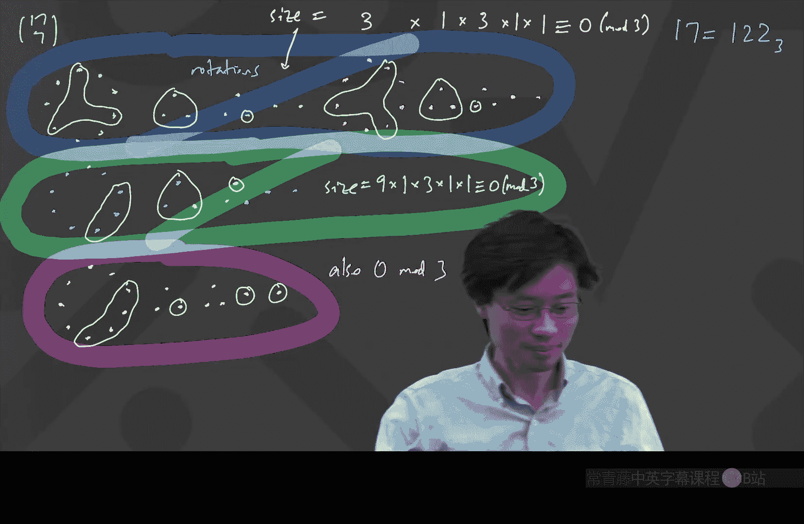

# 011：卢卡斯定理与组合数的模运算


在本节课中，我们将学习如何确定组合数的最后一位数字，并探索一个强大的定理——卢卡斯定理。它允许我们在模一个质数的情况下，以一种非常巧妙的方式计算组合数。

## 课程概述与提醒

首先提醒大家，本周五将有一次考试。关于考试的详细信息已发布在Canvas上。请注意，如果需要申请在周五东部时间晚上9点的备用时间参加考试，请在周五东部时间下午2点前联系我。

考试题目将是全新的，我保证它们会很有趣。今天讨论的内容也可能出现在考试中。

## 问题引入：组合数的最后一位数字

让我们从一个具体问题开始：**62选22的组合数，即 C(62, 22)，它的最后一位数字是什么？**

这是一个在数学竞赛中常见的有趣问题。我们如何着手解决呢？

直接计算 C(62, 22) 的值非常庞大，不现实。一个自然的想法是利用模运算，特别是模10，因为最后一位数字就是该数除以10的余数。

然而，模10运算有一个挑战：10不是质数。在模运算中，加法、减法和乘法都很直接，但除法在模非质数时通常很棘手。例如，我们不能简单地将分子和分母分别取模10然后相除，因为可能会出现分母模10后为0的情况，导致无法定义除法。

因此，我们需要更聪明的方法。

## 核心思路：分解质因数

由于10 = 2 × 5，而2和5都是质数，我们可以利用中国剩余定理的思想：要知道一个数模10的结果，可以分别找出它模2和模5的结果，然后组合起来。

更具体地说，如果我们能确定 C(62, 22) 模5和模2的余数，我们就能唯一确定它模10的余数（即最后一位数字）。

让我们先尝试找出它模5的余数。

### 步骤一：计算组合数中因子5的个数

组合数公式为：
```
C(62, 22) = 62! / (22! * 40!)
```
要知道它模5的余数，一个关键点是看这个数包含多少个质因子5。如果它至少包含一个因子5，那么它模5的余数就是0；否则，我们需要进一步计算。

计算一个阶乘中包含多少个因子5，有一个经典技巧。以62!为例：
1.  计算62 ÷ 5 = 12（向下取整），这给出了至少包含一个因子5的数字个数（如5, 10, 15, ...）。
2.  计算62 ÷ 25 = 2（向下取整），这给出了至少包含两个因子5的数字个数（如25, 50）。这些数字在第一步中已经被计算过一次，所以需要额外再加一次。
3.  计算62 ÷ 125 = 0（向下取整），因为62 < 125，停止。

因此，62!中因子5的总数为：12 + 2 = **14**。

同理，我们计算：
*   22! 中因子5的个数：22 ÷ 5 = 4，22 ÷ 25 = 0。所以是 **4**。
*   40! 中因子5的个数：40 ÷ 5 = 8，40 ÷ 25 = 1。所以是 8 + 1 = **9**。

现在，对于组合数 C(62, 22)：
*   分子 62! 提供 **14** 个因子5。
*   分母 22! 和 40! 总共提供 4 + 9 = **13** 个因子5。

在分数化简为整数后，分子会多出一个因子5无法被分母抵消。因此，**C(62, 22) 是5的倍数**。

这意味着它模5的余数是0，所以它的最后一位数字只能是 **0 或 5**。

### 步骤二：计算组合数中因子2的个数（判断奇偶性）

为了区分最后一位是0还是5，我们需要知道这个数是奇数还是偶数。如果是奇数，末位就是5；如果是偶数，末位就是0。

因此，我们计算组合数中因子2的个数。方法与计算因子5类似，但需要考虑更多2的幂次（2, 4, 8, 16, 32...）。

计算62!中因子2的个数：
*   62 ÷ 2 = 31
*   62 ÷ 4 = 15
*   62 ÷ 8 = 7
*   62 ÷ 16 = 3
*   62 ÷ 32 = 1
总和：31 + 15 + 7 + 3 + 1 = **57**。

计算40!中因子2的个数（使用快速方法：不断将前一个商除以2并取整）：
*   40 ÷ 2 = 20
*   20 ÷ 2 = 10
*   10 ÷ 2 = 5
*   5 ÷ 2 = 2
*   2 ÷ 2 = 1
总和：20 + 10 + 5 + 2 + 1 = **38**。

计算22!中因子2的个数：
*   22 ÷ 2 = 11
*   11 ÷ 2 = 5
*   5 ÷ 2 = 2
*   2 ÷ 2 = 1
总和：11 + 5 + 2 + 1 = **19**。

现在，对于组合数 C(62, 22)：
*   分子 62! 提供 **57** 个因子2。
*   分母 22! 和 40! 总共提供 19 + 38 = **57** 个因子2。

**分子和分母的因子2数量完全相等！** 这意味着在分数化简后，没有多余的因子2留下。因此，**C(62, 22) 是一个奇数**。

结合第一步的结论（末位是0或5）和第二步的结论（是奇数），我们可以确定：**C(62, 22) 的最后一位数字是 5**。

## 强大的捷径：卢卡斯定理

上面通过计算因子个数的方法虽然有效，但有些繁琐。是否存在一个更直接、更强大的方法呢？答案是肯定的，这就是**卢卡斯定理**。

卢卡斯定理指出：对于一个质数 **p**，组合数 C(n, k) 模 p 的结果，可以通过将 n 和 k 用 p 进制表示，然后对应位上的组合数相乘再模 p 来得到。

听起来很神奇？让我们看一个例子。

假设我们想计算 **C(17, 7) mod 3**。
1.  将17和7写成3进制：
    *   17 的3进制是 `122` （因为 1×9 + 2×3 + 2×1 = 17）。
    *   7 的3进制是 `021` （因为 0×9 + 2×3 + 1×1 = 7）。为了位数对齐，我们在前面补零。
2.  根据卢卡斯定理：
    ```
    C(17, 7) mod 3 = C(1, 0) * C(2, 2) * C(2, 1) mod 3
    ```
3.  计算每一位的组合数：
    *   `C(1, 0) = 1`
    *   `C(2, 2) = 1`
    *   `C(2, 1) = 2`
4.  相乘并取模：`1 * 1 * 2 = 2`。所以 **C(17, 7) mod 3 = 2**。

这个定理极大地简化了模质数下组合数的计算。对于我们之前的问题，如果想求 C(62, 22) mod 5，我们可以将62和22写成5进制，然后应用卢卡斯定理。

## 卢卡斯定理的证明思路（直观版）

为什么这个定理会成立？我们可以通过一个组合解释来直观理解。

以 C(17, 7) mod 3 为例。17个物品可以按3的幂次分组：1组9个，2组3个，2组1个。这正好对应其3进制表示 `122`。

现在，从这17个物品中选取7个。我们可以将选择过程分解为：从9个一组的物品中选几个，从每个3个一组的物品中选几个，从每个1个一组的物品中选几个。

关键点在于，**模3运算下，只有当我们从每一组中要么全选，要么全不选时，对应的选择方案总数模3才不为0**。如果在一组中只选了一部分，那么通过旋转该组（因为物品在组内是“圆形”对称的），可以产生多个等价的选择方案，而这些方案的数量通常是组大小的倍数（在质数模下，这会导致总和模p为0）。

因此，所有非“全选或全不选”的方案在模3求和时贡献为0。最终，C(17, 7) mod 3 就等价于：有多少种方式，能从各组中通过“全选或全不选”的方式，恰好选出7个物品？

这正好对应于用7的3进制表示 `021` 来从供应量（17的3进制 `122`）中选取：从9个组中选0个（全不选），从3个组中选2个（全选两个这样的组），从1个组中选1个（全选一个这样的组）。而 `C(1,0)`, `C(2,2)`, `C(2,1)` 正是计算这些选择方式的组合数。

这个论证的核心依赖于模数p是质数，确保了非平凡选择方案会产生倍数为p的轨道，从而在模p下消失。

## 课程总结

本节课我们一起学习了：
1.  **如何确定组合数的最后一位数字**：通过分别分析其因子2和因子5的个数，利用模2和模5的结果联合确定模10的结果。
2.  **卢卡斯定理**：一个关于计算组合数模质数的强大定理。它将问题转化为p进制下对应数字的组合数乘积，极大地简化了计算。
3.  **定理的直观证明**：通过将物品按p的幂次分组，并观察在模p下只有“全选或全不选”的分组方案才有贡献，从而将问题与p进制表示联系起来。



卢卡斯定理是数论和组合数学中一个优美而实用的工具，希望它能帮助你更深入地理解组合数的性质。祝大家在周五的考试中取得好成绩！