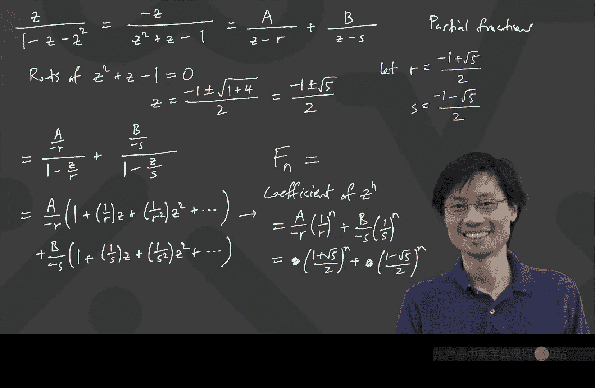

# 017：生成函数入门


在本节课中，我们将学习一种强大的数学工具——生成函数。我们将从一个有趣的数学现象（1/89与斐波那契数列的关系）出发，逐步推导出斐波那契数列的生成函数，并利用它来求解数列的通项公式。整个过程将展示生成函数如何将复杂的递归问题转化为代数问题来处理。

***

## 一个有趣的现象：1/89

首先，让我们观察一个有趣的现象。计算 **1 / 89** 得到的小数展开如下：
```
0.011235955056...
```
请注意前几位数字：0, 1, 1, 2, 3, 5。这恰好是斐波那契数列的前几项（F0=0, F1=1, F2=1, F3=2, F4=3, F5=5）。然而，下一个数字是9，而斐波那契数列的下一项应该是8（3+5）。这似乎“出错”了。

但如果我们继续计算并考虑进位，会发现这个规律依然成立。例如，5+8=13，产生进位，使得后续数字依然符合斐波那契数列的规律。这暗示着 **1/89** 与斐波那契数列的和存在某种深刻联系。

***

## 建立联系：斐波那契数列与无穷级数

上一节我们观察到了一个有趣的现象，本节中我们来看看如何用数学语言描述它。

我们考虑以下无穷级数 **X**，它将斐波那契数 `F_n` 与10的幂次相结合：
```
X = F0/10^1 + F1/10^2 + F2/10^3 + F3/10^4 + ...
```
如果这个级数收敛，那么它的值似乎应该等于我们观察到的 **1/89**。我们的目标是证明 **X = 1/89**。

以下是证明思路：
1.  写出 **X** 的表达式。
2.  利用斐波那契数列的递推关系 `F_n = F_{n-1} + F_{n-2}` 对级数进行拆分和重组。
3.  在重组过程中，识别出 **X** 本身或其缩放版本，从而建立一个关于 **X** 的方程。
4.  解这个方程求出 **X**。

让我们开始推导。设：
```
X = F0/10 + F1/100 + F2/1000 + F3/10000 + ...
```
我们从第三项开始应用递推关系 `F2 = F1 + F0`，第四项应用 `F3 = F2 + F1`，依此类推：
```
X = F0/10 + F1/100 + (F0+F1)/1000 + (F1+F2)/10000 + (F2+F3)/100000 + ...
```
我们将项按列对齐，以便观察模式：
```
X = [F0/10 + F1/100]  +  [F0/1000 + F1/1000]  +  [F1/10000 + F2/10000]  +  [F2/100000 + F3/100000] + ...
```
现在，观察这个重新排列的级数：
*   第一列（黄色部分）恰好是 **X / 100**，因为每一项的分母都比原始 **X** 中的对应项多了一个因子 `10^2`。
*   第二列（蓝色部分）是 **X / 10**，因为每一项的分母都比原始 **X** 中的对应项多了一个因子 `10^1`，但缺少了第一项 `F0/10`。由于 `F0 = 0`，所以缺少的项为0。

因此，我们可以建立方程：
```
X = (F0/10 + F1/100) + (X / 100) + (X / 10)
```
代入 `F0 = 0`, `F1 = 1`：
```
X = 0/10 + 1/100 + X/100 + X/10
X = 1/100 + X/100 + X/10
```
将所有含 **X** 的项移到左边：
```
X - X/10 - X/100 = 1/100
(1 - 1/10 - 1/100)X = 1/100
(100/100 - 10/100 - 1/100)X = 1/100
(89/100)X = 1/100
```
两边同时乘以100：
```
89X = 1
```
最终得到：
```
X = 1/89
```
这就证明了我们的观察。这个推导的核心技巧是利用递推关系，在级数表达式中“重新发现”级数本身，从而建立可解的方程。

***

## 重要提醒：收敛性

上一节的推导依赖于对无穷级数进行重新排列和组合，这在数学上需要级数**收敛**才能严格成立。对于发散级数，这种操作可能导致荒谬的结果。

例如，考虑级数 `Y = 1 + 2 + 4 + 8 + 16 + ...`。如果错误地应用类似技巧，可以写出：
```
Y = 1 + 2(1 + 2 + 4 + 8 + ...) = 1 + 2Y
```
解得 `Y = -1`，这显然是错误的，因为正数相加不可能得到负数。错误的原因在于级数 `Y` 是发散的（和趋于无穷大），我们不能对其应用有限的代数运算规则。

在我们的斐波那契级数例子中，由于斐波那契数呈指数增长，而分母 `10^n` 增长更快，因此级数 **X** 是收敛的，我们的操作是合理的。在本课程中，当我们使用生成函数时，通常会默认所处理的级数具有良好的收敛性，或者我们将其视为一种形式化的代数工具。最终得到的公式可以通过数学归纳法等严格方法进行验证。

***

## 推广与生成函数的引入

上一节我们解决了以10为底的特定问题。一个自然的推广是：如果使用其他进制（例如100进制，即每两位斐波那契数占一个小数位），对应的分数是多少？

设基数为 `b`，我们考虑更一般的级数：
```
X(b) = F0/b^1 + F1/b^2 + F2/b^3 + F3/b^4 + ...
```
重复之前的推导过程（将10替换为 `b`），我们可以得到方程：
```
X(b) = 1/b^2 + X(b)/b^2 + X(b)/b
```
解得：
```
X(b) = 1 / (b^2 - b - 1)
```
当 `b=10` 时，`X(10) = 1/(100-10-1) = 1/89`，与之前一致。当 `b=100` 时，`X(100)=1/(10000-100-1)=1/9899`，这就是每两位显示一个斐波那契数的分数。

观察这个一般形式，它启发我们定义一个新的函数，即斐波那契数列的**生成函数**。我们不再将 `b` 放在分母，而是将其作为一个变量 `z` 放在分子，形成幂级数：
```
F(z) = F0*z^0 + F1*z^1 + F2*z^2 + F3*z^3 + ...
```
这个函数 `F(z)` 就是斐波那契数列的生成函数。注意，我们之前的 `X(b)` 与 `F(z)` 有关系：`X(b) = F(1/b) / b`。

***

## 求解斐波那契数列生成函数

现在，让我们直接求解生成函数 `F(z)` 的封闭形式。我们使用与之前类似的技巧，但这次是在变量 `z` 的幂级数框架下。

我们有：
```
F(z) = F0 + F1*z + F2*z^2 + F3*z^3 + F4*z^4 + ...
```
代入 `F0=0`, `F1=1`，并从 `F2` 开始应用递推关系 `F_n = F_{n-1} + F_{n-2}`：
```
F(z) = 0 + 1*z + (F0+F1)z^2 + (F1+F2)z^3 + (F2+F3)z^4 + ...
      = z + F0*z^2 + F1*z^2 + F1*z^3 + F2*z^3 + F2*z^4 + F3*z^4 + ...
```
将项分组：
```
F(z) = z + (F1*z^2 + F2*z^3 + F3*z^4 + ...) + (F0*z^2 + F1*z^3 + F2*z^4 + ...)
```
观察括号内的部分：
*   第一个括号：`z^2 * (F1*z^0 + F2*z^1 + F3*z^2 + ...) = z^2 * (F(z) - F0*z^0) = z^2 * F(z)` （因为 `F0=0`）。
*   第二个括号：`z * (F0*z^1 + F1*z^2 + F2*z^3 + ...) = z * (F(z) - F0*z^0 - F1*z^1?)` 仔细看，它实际上是 `z * (F0*z^1 + F1*z^2 + F2*z^3 + ...) = z * [z * (F0*z^0 + F1*z^1 + F2*z^2 + ...)] = z^2 * F(z)`。更简单的方法是注意到从 `F2*z^2` 开始的项可以配对，实际上两个括号都等于 `z^2 * F(z)`。让我们更清晰地处理：

实际上，更标准的推导如下：
```
F(z) = F0 + F1*z + F2*z^2 + F3*z^3 + F4*z^4 + ...
z*F(z) = F0*z + F1*z^2 + F2*z^3 + F3*z^4 + ...
z^2*F(z) = F0*z^2 + F1*z^3 + F2*z^4 + F3*z^5 + ...
```
现在计算 `z*F(z) + z^2*F(z)`：
```
z*F(z) + z^2*F(z) = (F0*z + F1*z^2 + F2*z^3 + F3*z^4 + ...) + (F0*z^2 + F1*z^3 + F2*z^4 + F3*z^5 + ...)
                  = F0*z + (F1+F0)z^2 + (F2+F1)z^3 + (F3+F2)z^4 + ...
                  = F0*z + F2*z^2 + F3*z^3 + F4*z^4 + ... （根据递推关系）
```
注意到 `F(z) = F0 + F1*z + F2*z^2 + F3*z^3 + F4*z^4 + ...`。
因此：
```
z*F(z) + z^2*F(z) = (F(z) - F0 - F1*z) + F2*z^2? 这样不对。
```
更准确地说，观察 `z*F(z) + z^2*F(z)` 从 `z^2` 项开始，正好等于 `F(z) - F0 - F1*z` 从 `z^2` 项开始的部分。即：
```
z*F(z) + z^2*F(z) = F(z) - F0 - F1*z
```
代入 `F0=0`, `F1=1`：
```
z*F(z) + z^2*F(z) = F(z) - 0 - 1*z
z*F(z) + z^2*F(z) = F(z) - z
```
现在，解这个关于 `F(z)` 的方程：
```
F(z) - z*F(z) - z^2*F(z) = z
F(z) * (1 - z - z^2) = z
```
因此，我们得到生成函数的封闭形式：
```
F(z) = z / (1 - z - z^2)
```
这就是斐波那契数列生成函数的简洁表达式。

***

## 从生成函数到通项公式

现在我们有了生成函数 `F(z) = z / (1 - z - z^2)`。如何从中提取出斐波那契数 `F_n`（即 `z^n` 的系数）呢？直接进行泰勒展开求导会很繁琐。我们采用**部分分式分解**的方法。

首先，处理分母：
```
F(z) = z / (1 - z - z^2) = -z / (z^2 + z - 1)
```
对分母进行因式分解，需要求方程 `z^2 + z - 1 = 0` 的根。利用二次求根公式：
```
z = [-1 ± √(1 + 4)] / 2 = (-1 ± √5) / 2
```
令 `r = (-1 + √5)/2`, `s = (-1 - √5)/2`。则分母可写为 `(z - r)(z - s)`。

接下来，将 `F(z)` 分解为部分分式：
```
F(z) = -z / ((z - r)(z - s)) = A/(z - r) + B/(z - s)
```
其中 `A` 和 `B` 是待定常数。为了便于展开成几何级数，我们改写每一项：
```
A/(z - r) = (-A/r) / (1 - z/r)
B/(z - s) = (-B/s) / (1 - z/s)
```
因为 `1/(1 - α) = 1 + α + α^2 + α^3 + ...`（当 `|α| < 1`）。因此：
```
F(z) = (-A/r) * [1 + (z/r) + (z/r)^2 + (z/r)^3 + ...] + (-B/s) * [1 + (z/s) + (z/s)^2 + (z/s)^3 + ...]
```
现在，`z^n` 的系数 `[z^n]F(z)` 就是：
```
[z^n]F(z) = (-A/r) * (1/r)^n + (-B/s) * (1/s)^n = (-A) * r^{-(n+1)} + (-B) * s^{-(n+1)}
```
由于 `[z^n]F(z)` 就是斐波那契数 `F_n`，所以我们有：
```
F_n = C * (1/r)^n + D * (1/s)^n
```
其中 `C = -A/r`, `D = -B/s` 是新的常数。

计算 `1/r` 和 `1/s`：
```
1/r = 2 / (-1 + √5) = 2(1 + √5) / (5 - 1) = (1 + √5)/2 = φ (黄金比例)
1/s = 2 / (-1 - √5) = 2(1 - √5) / (5 - 1) = (1 - √5)/2 = ψ
```
因此，通项公式形式为：
```
F_n = C * φ^n + D * ψ^n
```
最后，利用初始条件 `F_0 = 0` 和 `F_1 = 1` 来确定常数 `C` 和 `D`：
*   当 `n=0`：`C * φ^0 + D * ψ^0 = C + D = 0` => `D = -C`
*   当 `n=1`：`C * φ^1 + D * ψ^1 = Cφ + Dψ = 1` => `Cφ - Cψ = 1` => `C(φ - ψ) = 1`
由于 `φ - ψ = √5`，所以 `C = 1/√5`, `D = -1/√5`。

最终得到著名的斐波那契数列通项公式（比内公式）：
```
F_n = (1/√5) * [ ((1+√5)/2)^n - ((1-√5)/2)^n ]
```

***

## 总结

本节课中我们一起学习了生成函数的基本思想。我们从 **1/89** 这个有趣的现象出发，通过建立无穷级数并利用斐波那契数列的递推关系，证明了其与斐波那契数列的联系。随后，我们将问题推广到一般进制，并自然引出了**生成函数** `F(z)` 的概念。

我们推导出斐波那契数列生成函数的封闭形式：
```
F(z) = z / (1 - z - z^2)
```
接着，通过**部分分式分解**和**几何级数展开**的技巧，我们从生成函数中成功提取出了斐波那契数列的通项公式。这个过程展示了生成函数如何将序列的递归信息编码进一个函数中，并通过分析这个函数来获取序列的性质（如通项公式）。



生成函数是解决离散数学问题，特别是递归关系计数问题的强大工具。在接下来的课程中，我们将继续探索生成函数的更多应用。