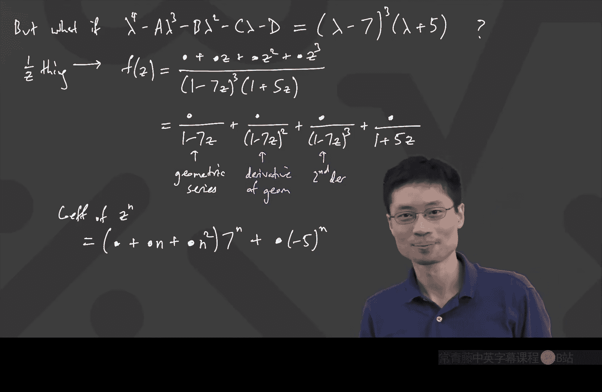

# 019：齐次线性递推的通解 🧮

在本节课中，我们将学习如何求解所有齐次线性递推关系。我们将从上一讲结束的地方开始，通过一个具体的例子，引出处理具有重根情况的通用方法，并最终推导出求解任意齐次线性递推的通解公式。

---

上一节我们介绍了使用生成函数求解递推关系，并遇到了分母为完全平方的情况。本节中，我们来看看如何处理更一般的情况，特别是当特征多项式具有重根时，解的形式会如何变化。

## 从具体例子到一般观察

我们上次以递推关系 **A_n = 6A_{n-1} - 9A_{n-2}** 为例。使用生成函数法后，我们得到的分母是一个完全平方，这导致在部分分式分解时，不能简单地使用一次项，而需要使用高次项。

具体来说，我们最终得到解的形式为：
**A_n = n × 3^{n-1}**

这与之前特征根互异时得到的纯指数形式（如 **C × r^n**）不同。现在，指数项前面多了一个关于 **n** 的多项式因子。

## 构建一般性递推关系

让我们考虑一个更一般的四阶齐次线性递推关系：
**A_n = A × A_{n-1} + B × A_{n-2} + C × A_{n-3} + D × A_{n-4}**

我们的目标是找到求解此类所有递推关系的通用方法。

以下是使用生成函数法求解的步骤概要：
1.  设生成函数 **F(z) = A_0 + A_1 z + A_2 z^2 + A_3 z^3 + ...**
2.  利用递推关系，将 **F(z)** 与自身进行代数操作。
3.  将所有包含 **F(z)** 的项移到等式一边，最终得到形如：
    **F(z) = (某个三次多项式) / (1 - A z - B z^2 - C z^3 - D z^4)**
4.  下一步是对这个有理函数进行部分分式分解。

## 特征多项式与根的情况

部分分式分解的关键在于分母的根。我们定义特征多项式为：
**λ^4 - A λ^3 - B λ^2 - C λ - D = 0**

求解这个多项式，我们得到根 **λ_1, λ_2, λ_3, λ_4**。

### 情况一：所有根互异
如果所有根都是不同的，那么部分分式分解很简单：
**F(z) = α/(1 - λ_1 z) + β/(1 - λ_2 z) + γ/(1 - λ_3 z) + δ/(1 - λ_4 z)**

通过比较系数，我们可以得到通解：
**A_n = α λ_1^n + β λ_2^n + γ λ_3^n + δ λ_4^n**

### 情况二：存在重根
如果特征多项式有重根，例如 **(λ - 7)^3 (λ + 5) = 0**，即根为 **7, 7, 7, -5**。
那么，对应的生成函数分母为 **(1 - 7z)^3 (1 + 5z)**。

根据微积分中的部分分式法则，对于重根，分解形式如下：
**F(z) = blob_1/(1 - 7z) + blob_2/(1 - 7z)^2 + blob_3/(1 - 7z)^3 + blob_4/(1 + 5z)**

这里的 **blob** 代表与 **n** 和 **z** 无关的常数系数。

## 处理重根项：探索系数模式

现在，核心问题是如何求出像 **1/(1 - λ z)^r** 这样的项的幂级数展开式中 **z^n** 的系数。

我们以 **1/(1 - λ z)^3** 为例，探索三种方法。

### 方法一：反复求导（泰勒级数法）
我们知道几何级数：
**1/(1 - λ z) = 1 + λ z + λ^2 z^2 + λ^3 z^3 + ...**

对其求导一次，可以得到 **1/(1 - λ z)^2** 的展开式。再求导一次，可以得到 **1/(1 - λ z)^3** 的展开式。通过观察模式，我们发现 **z^n** 的系数具有组合数的形式。

### 方法二：组合解释（乘法原理）
注意到：
**1/(1 - λ z)^3 = [1/(1 - λ z)] × [1/(1 - λ z)] × [1/(1 - λ z)]**

每个括号内都是一个几何级数。要得到 **z^n** 的系数，我们需要从三个几何级数中分别选取项，使得所选项的指数之和为 **n**。这等价于将 **n** 个相同的“硬币”分配给 **3** 个人的方案数。

这个方案数由“星棒法”给出：
**系数 = (n + 3 - 1) choose (3 - 1) × λ^n = (n + 2) choose 2 × λ^n**

### 方法三：直接泰勒展开
直接对函数 **G(z) = 1/(1 - z)^r** 在 **z=0** 处求各阶导数，并除以相应的阶乘，也能得到相同的系数形式，即包含上升阶乘的项。

## 通用结论与解的形式

综合以上方法，我们得到一个重要结论：
对于项 **1/(1 - λ z)^r**，其幂级数中 **z^n** 的系数为：
**系数 = (n + r - 1) choose (r - 1) × λ^n**

由于 **(n + r - 1) choose (r - 1)** 展开后是关于 **n** 的 **r-1** 次多项式，因此我们可以说：
**系数 = (一个次数 ≤ r-1 的关于 n 的多项式) × λ^n**

回到我们具有三重根 **7** 的例子：
*   **1/(1 - 7z)** 贡献：**(一个常数多项式) × 7^n**
*   **1/(1 - 7z)^2** 贡献：**(一个一次多项式) × 7^n**
*   **1/(1 - 7z)^3** 贡献：**(一个二次多项式) × 7^n**
*   **1/(1 + 5z)** 贡献：**(一个常数) × (-5)^n**

将这些部分相加，**A_n** 的通解最终形式为：
**A_n = (P_2(n)) × 7^n + (C) × (-5)^n**
其中 **P_2(n)** 是一个次数不超过 2 的关于 **n** 的多项式（即 **c_0 + c_1 n + c_2 n^2**），**C** 是一个常数。

## 求解常数：代入初始条件

通解公式中有若干个未知常数（本例中是 **c_0, c_1, c_2, C**）。为了确定它们，我们利用递推关系的初始条件（例如 **A_0, A_1, A_2, A_3**）。

只需将 **n = 0, 1, 2, 3** 代入通解公式，得到一个关于这些常数的线性方程组。解这个方程组，即可得到唯一确定的常数，从而获得该递推关系的特解。

---

本节课中我们一起学习了求解齐次线性递推关系的完整通用方法：
1.  根据递推关系写出特征多项式并求根。
2.  根据根的情况（互异或重根）写出通解的形式：
    *   单根 **λ** 贡献 **C × λ^n**。
    *   **r** 重根 **λ** 贡献 **(一个 r-1 次多项式) × λ^n**。
3.  将所有贡献相加，得到完整的通解公式。
4.  利用初始条件建立方程组，解出通解中的所有常数系数。

这种方法可以系统性地解决任何齐次线性递推关系。下节课我们将继续深入，并探讨更多相关的例子和应用。