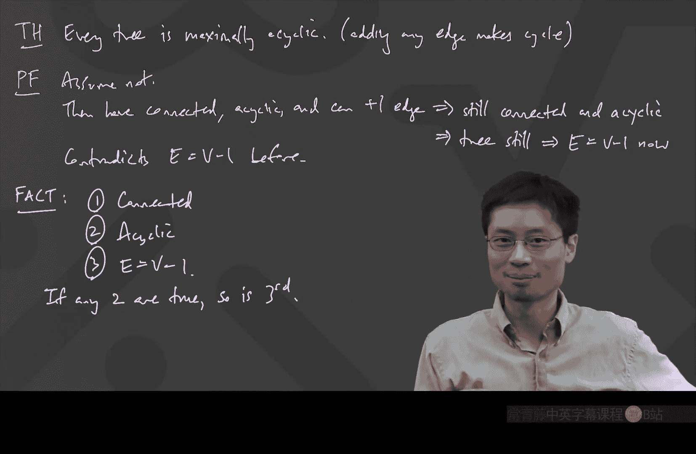

# 023：树的基本定理与等价定义 🌳

在本节课中，我们将深入学习图论中的一个核心概念——树。我们将探讨树的两种不同定义，并证明它们是等价的。同时，我们还将揭示树的一些基本性质，例如其边数与顶点数之间的关系。

---

## 树：两种视角

上一节我们介绍了图的基本概念。本节中，我们来看看一种特殊的图——树。

树可以通过两种方式来理解。第一种方式是通过一个直观的“生长过程”来构建。

### 树的生长过程

以下是树的生长过程的定义：

1.  从一个顶点开始。
2.  重复以下步骤：添加一个新的顶点，并用一条新的边将其连接到已有的某个顶点上。

这个过程产生的结构就是一棵树。在计算机科学中，这种向下生长的树很常见，以至于有个玩笑说“计算机科学家画的树都是倒着的，因为他们没见过真正的树”。

然而，我们也可以从另一个角度来定义树。

### 树的图论定义

在图论教科书中，树通常被定义为：
*   **连通**且**无环**的图。

这里需要明确两个术语的含义：
*   **连通**：从图中的任何一个顶点出发，都可以沿着边到达任何其他顶点。
*   **无环**：图中不存在任何**环**。环是指一条从某个顶点出发，经过一系列不同的顶点和边，最终又回到起点的路径。

---

## 核心定理：两种定义的等价性

现在，我们面临一个关键问题：通过“生长过程”得到的树，是否等同于“连通且无环”的图？在数学中，一个概念只能有一个定义，另一个必须是需要证明的定理。

**定理**：所有有限、连通且无环的图的集合，等于所有通过树的生长过程可以得到的有限图的集合。

为了证明两个集合相等，我们需要证明两个方向的包含关系。

### 方向一：生长过程得到的图是连通且无环的

首先，我们证明任何通过生长过程得到的图都是连通且无环的。

*   **连通性**：在生长过程中，每个新添加的顶点都通过一条边直接连接到已有的图上。因此，图中所有顶点都通过路径连接到最初的那个“根”顶点。任意两个顶点可以通过先走到根顶点，再走到另一个顶点的方式连通。
*   **无环性**：我们使用反证法。假设通过生长过程得到的图中存在一个环。考虑这个环中最后一个被“生长”出来的顶点。当这个顶点被添加时，它只带有一条新的边连接到图中。然而，一个环至少需要两条边连接该顶点。在它被添加之后，生长过程每次只添加一个连接到全新顶点的边，因此环中缺失的另一条边永远无法被添加。这就产生了矛盾，所以图中不可能有环。

### 方向二：任何连通无环图都可以通过生长过程得到

这个方向的证明更具挑战性，因为我们面对的是一个未知结构的连通无环图。证明的核心思路是“逆向构造”：如果我们能找到一种方法从图中逐步移除顶点，最终只剩下一个顶点，那么把这个过程反过来，就是生长过程。

为此，我们需要一个关键引理。

**引理**：任何一个至少有两个顶点的有限连通无环图，都至少存在一个**叶子**顶点（即度数为1的顶点）。

**引理的证明**（反证法）：
1.  假设图是连通且无环的，但没有任何度数为1的顶点。
2.  因为图是连通的，所以每个顶点的度数至少为1。结合假设，可知所有顶点的度数都**至少为2**。
3.  现在，从任意顶点开始，沿着边行走。由于每次到达一个顶点，其度数至少为2，我们总可以选择一条之前没走过的边离开（除了折返）。
4.  因为图的顶点数是有限的，这种行走最终必然会访问到一个已经访问过的顶点，从而形成一个环。
5.  这与图“无环”的前提矛盾。因此，假设不成立，图中必然存在度数为1的叶子顶点。

利用这个引理，我们可以完成主定理的证明：
1.  对于一个给定的连通无环图，根据引理，它有一个叶子顶点。
2.  移除这个叶子顶点以及连接它的那条边。剩下的图仍然是连通且无环的。
3.  对剩下的图重复步骤1和2，不断移除叶子顶点。
4.  由于图是有限的，这个过程最终会只剩下一个顶点。
5.  现在，将整个过程**倒过来看**：从一个顶点开始，按照我们移除顶点的相反顺序，依次添加顶点和边，这就精确地构成了一个树的生长过程。

至此，我们证明了两种定义是等价的。从现在起，当我们提到“树”时，可以自由地在“连通无环图”和“可通过生长过程构建的图”这两种理解间切换。

---

## 树的基本性质与应用

有了等价定义，我们可以轻松推导出树的一些重要性质。

**事实**：对于任何树，其边数 `E` 和顶点数 `V` 满足公式 **`E = V - 1`**。

**证明思路**：根据等价性，树可以通过生长过程得到。该过程从1个顶点、0条边开始，每增加1个顶点就增加1条边。因此，最终边数总比顶点数少1。

这个性质非常有用，它引出了另一个有趣的定理。

**定理**：如果一个连通图满足 `E = V - 1`，那么它一定是无环的（即它是一棵树）。

**证明思路（方法一，利用引理）**：
1.  对于一个连通图，若 `E = V - 1`，我们可以证明它必然有叶子顶点（通过握手定理和度数分析）。
2.  移除一个叶子顶点，剩下的图仍连通，且新的边数和顶点数仍满足 `E‘ = V’ - 1`。
3.  重复此过程，最终会得到一个显然无环的单顶点图。由于移除叶子不会引入环，所以原图也是无环的。

**证明思路（方法二，反证法）**：
1.  假设该连通图有环。
2.  从环中移除任意一条边。图仍然保持连通（因为环提供了替代路径），且边数减少。
3.  重复移除边直到图中没有环为止。最终我们得到一个连通无环图，即一棵树，它必须满足 `E_final = V - 1`。
4.  但是，我们一开始的边数 `E_initial` 就等于 `V - 1`。这意味着我们在过程中没有移除任何边，与“存在环”的假设矛盾。因此，原图无环。

与这个定理对偶的另一个性质是：

**定理**：树是**极大无环**的。即，在一棵树中任意添加一条新边，都会产生一个环。

**证明思路**：假设添加一条边后仍然无环，那么新图也是连通无环的，即一棵树。但这棵新树的边数将等于顶点数，与 `E = V - 1` 矛盾。

---

## 总结：树的三个等价条件

本节课中，我们一起学习了关于树的核心内容。我们可以将树的特性总结为以下三个等价条件：
1.  **连通**且**无环**。
2.  可以通过**树的生长过程**构建。
3.  满足边数与顶点数的关系 **`E = V - 1`**。

一个非常优美的结论是：对于有限图，只要上述任意两个条件成立，第三个条件就必然成立。这深刻揭示了连通性、无环性和边数关系之间的内在联系，构成了图论中树这一概念的坚实基础。