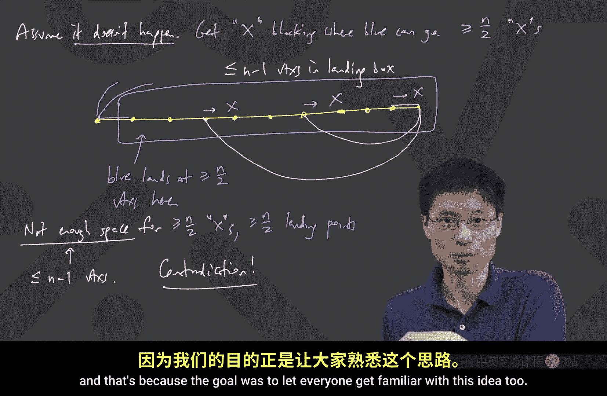

# 024：哈密顿回路 🚀

在本节课中，我们将学习一种与欧拉回路不同的回路概念——哈密顿回路。我们将探讨其定义、存在的条件，并深入理解一个重要的定理：狄拉克定理。

---

上一节我们讨论了欧拉回路，其目标是恰好经过每条边一次。本节中，我们来看看一个不同的问题：如何恰好经过每个顶点一次。

## 哈密顿回路的定义

哈密顿回路是指一个**回路**，它恰好经过图中的**每一个顶点**一次。由于是回路，它不能重复使用任何顶点，并且最终会回到起点。因此，一个哈密顿回路本质上就是一个包含图中所有顶点的环。

## 寻找存在的条件

对于欧拉回路，我们有简洁的充要条件（所有顶点度数为偶数且图连通）。然而，对于哈密顿回路，我们很难找到这样简单且易于判断的充要条件。事实上，判断一个图是否存在哈密顿回路是一个著名的难题（与P vs. NP问题相关）。

我们的目标是找到一些**充分条件**，即满足某些条件时，图**必定**存在哈密顿回路。

首先，我们可以思考一些必要条件。例如，如果一个图存在哈密顿回路，那么它**必须是连通的**。但这只是一个必要条件，而非充分条件。

一个显然的充分条件是：如果一个有 `n` 个顶点的图是**完全图**（即每个顶点的度数都是 `n-1`），那么它当然存在哈密顿回路。但这个条件过于平凡，没有太多理论价值。

## 狄拉克定理

一个更深刻且非平凡的结论是**狄拉克定理**。该定理指出：
> 对于一个有 `n` 个顶点（`n ≥ 3`）的简单图，如果**每个顶点的度数都至少为 `n/2`**，那么该图**必定**存在哈密顿回路。

这个定理非常有力，因为它只要求每个顶点与图中超过一半的顶点相连，就能保证哈密顿回路的存在。

### 定理的最优性

狄拉克定理中的条件 `n/2` 是**最优的**。这意味着，如果我们把条件放宽到“所有度数至少为 `n/2 - 1`”，那么结论就不再成立。以下是两个反例：

*   **奇数顶点情况**：构造一个图，它由两个大小均为 `(n-1)/2` 的完全子图，以及一个连接这两个子图中所有顶点的“中心”顶点构成。这个图没有哈密顿回路（存在瓶颈），但除了中心顶点外，其他顶点的度数至少为 `(n-1)/2`（当 `n` 为奇数时，这等于 `⌈n/2⌉ - 1`）。
*   **偶数顶点情况**：构造一个由两个大小均为 `n/2` 的完全子图组成的非连通图。它显然没有哈密顿回路，但每个顶点的度数都是 `n/2 - 1`。

这些例子表明，`n/2` 这个阈值是精确的。

## 狄拉克定理的证明思路

狄拉克定理的证明是图论中一个经典且巧妙的论证。其核心思想分为几个步骤：

### 步骤一：证明图是连通的

首先，利用度数条件 `δ(G) ≥ n/2` 证明图 `G` 必须是连通的。
*   **证明思路（反证法）**：假设图不连通，则它可以分成至少两个连通分支。考虑顶点数最少的那个分支，其顶点数 `k ≤ n/2`。在该分支内，任何一个顶点的度数最多为 `k-1 ≤ n/2 - 1`。这与所有顶点度数至少为 `n/2` 的条件矛盾。因此，图必须是连通的。

### 步骤二：利用“最长路径”构造长环

考虑图中的一条**最长路径** `P`（即无法再扩展的路径）。我们将证明，基于这条最长路径和度数条件，可以构造出一个长度至少为 `|P|` 的**环**（圈）。
*   **关键观察**：设最长路径 `P` 的端点为 `u` 和 `v`。由于路径无法再延长，`u` 和 `v` 的所有邻居都必须在路径 `P` 上。
*   **构造环的核心技巧**：我们希望找到一条从 `u` 到 `v` 的边，或者找到路径 `P` 上的两个顶点 `u_i` 和 `u_{i+1}`，使得 `u` 与 `u_{i+1}` 相邻，且 `v` 与 `u_i` 相邻。如果存在这样的结构，我们就可以将路径 `P` 改造成一个包含所有 `P` 上顶点的环。
*   **利用鸽巢原理**：假设上述环结构不存在。对于 `v` 在路径 `P` 上的每个邻居 `u_i`，我们都“禁止” `u` 去连接 `u_{i-1}`（如果 `u_i` 是 `v` 的邻居，则 `u_{i-1}` 被标记为禁区）。由于 `d(v) ≥ n/2`，我们至少有 `n/2` 个这样的禁区。同时，`u` 本身也有至少 `n/2` 个邻居，且 `u` 不能是它自己的邻居。然而，路径 `P` 上可供 `u` 连接的顶点（不包括它自己）最多只有 `n-1` 个。现在，我们需要在这最多 `n-1` 个位置中，为 `u` 的至少 `n/2` 个邻居找到位置，同时还要避开至少 `n/2` 个禁区。根据鸽巢原理，这是不可能的。因此，假设不成立，我们必定能构造出所需的环。

### 步骤三：完成证明

现在，我们有了一个长环 `C`，其长度至少等于最长路径 `P` 的长度。
1.  如果环 `C` 包含了所有 `n` 个顶点，那么它就是哈密顿回路，证明完成。
2.  如果环 `C` 没有包含所有顶点（即缺少一些顶点），由于我们在步骤一中已证明图是连通的，因此必然存在环 `C` 外的某个顶点 `x`，通过一条边连接到环 `C` 上的某个顶点 `y`。利用这条边，我们可以将环 `C` “打开”并融入顶点 `x`，从而构造出一条比原来最长路径 `P` 更长的路径。这与 `P` 是“最长路径”的定义矛盾。

因此，情况2不可能发生，唯一可能的就是情况1，即我们构造的环 `C` 已经是一个哈密顿回路。至此，狄拉克定理得证。

---

本节课中我们一起学习了哈密顿回路的概念及其与欧拉回路的区别。我们重点探讨了狄拉克定理，该定理给出了保证哈密顿回路存在的一个强有力且最优的充分条件（所有顶点度数 ≥ n/2），并深入剖析了其巧妙而经典的证明思路，其中涉及最长路径、构造环以及鸽巢原理等核心思想。