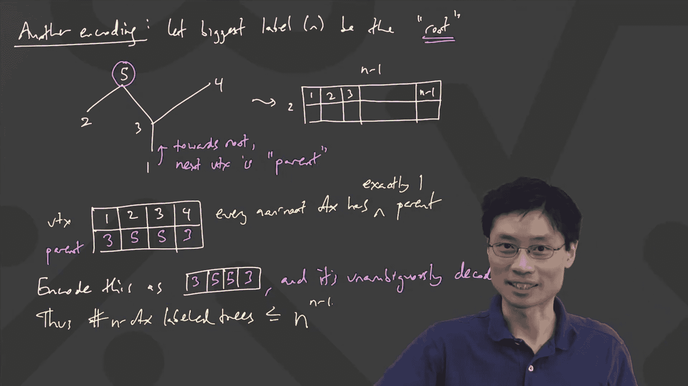

# 027：鸽巢原理

在本节课中，我们将学习组合数学中的一个重要原理——鸽巢原理。这个原理虽然简单，但在解决许多存在性问题时非常强大。

## 鸽巢原理的直观理解

鸽巢原理，也被称为抽屉原理。其核心思想非常直观：如果你有`n`个鸽巢和`m`只鸽子，并且`m > n`，那么至少有一个鸽巢里会有多于一只鸽子。

我们可以用更正式的数学语言来描述它。

## 鸽巢原理的正式表述

上一节我们介绍了鸽巢原理的直观理解，本节中我们来看看它的正式定义。

**鸽巢原理**：如果将`m`个物体放入`n`个盒子中，且`m > n`，那么至少有一个盒子包含两个或两个以上的物体。

这个原理的公式化表述是：
**如果 |物体| > |盒子|，则至少有一个盒子包含 ≥ 2 个物体。**

## 鸽巢原理的简单应用

理解了原理的基本形式后，我们来看一些简单的例子，以加深理解。

以下是几个应用鸽巢原理的经典场景：

1.  **生日问题**：在一个有367人的房间里，至少有两个人的生日相同（考虑闰年）。因为天数（366个“鸽巢”）少于人数（367只“鸽子”）。
2.  **袜子配对**：抽屉里有10只黑袜子和10只白袜子，它们混在一起。如果你在黑暗中取袜子，需要取出多少只才能保证得到一双颜色相同的袜子？答案是3只。因为颜色只有两种（两个“鸽巢”），取3只（“鸽子”）就必然有一种颜色出现两次。
3.  **头发数量**：在一个人口超过20万的城市中，至少有两个人的头发数量完全相同。因为人的头发数量通常不超过20万根。

## 广义鸽巢原理

基本的鸽巢原理可以推广到更一般的情况，这能帮助我们解决更复杂的问题。

上一节我们看了基本形式的例子，本节中我们来看看它的一个有力推广。

**广义鸽巢原理**：如果将`m`个物体放入`n`个盒子中，那么至少有一个盒子包含至少 `⌈m/n⌉` 个物体。

其中，符号 `⌈x⌉` 表示“向上取整”，即大于或等于`x`的最小整数。

例如，如果有20只鸽子（m=20）和6个鸽巢（n=6），那么 `⌈20/6⌉ = ⌈3.333...⌉ = 4`。这意味着至少有一个鸽巢里至少有4只鸽子。

## 广义原理的应用实例

让我们通过一个具体问题来应用广义鸽巢原理。

**问题**：一个抽屉里有红色、蓝色和绿色的袜子各若干只。至少需要取出多少只袜子，才能保证其中至少有4只是同一种颜色？

**推理过程**：
*   颜色种类是3种（n=3）。
*   我们希望保证至少有一个颜色出现4次（k=4）。
*   根据广义原理，我们需要让物体总数`m`满足 `⌈m/3⌉ = 4`。
*   解这个不等式：`⌈m/3⌉ ≥ 4` 意味着 `m/3 > 3`，所以 `m > 9`。
*   最小的整数`m`是10。
*   **结论**：需要取出10只袜子。

我们可以验证一下：在最坏的情况下，前9只袜子每种颜色各3只（共9只）。那么第10只袜子无论是什么颜色，都会使该颜色的袜子达到4只。

## 总结

本节课中我们一起学习了鸽巢原理及其推广。
*   我们首先理解了**基本鸽巢原理**：如果物体比容器多，那么至少有一个容器包含多个物体。
*   接着，我们学习了更强大的**广义鸽巢原理**，它给出了至少一个容器中物体数量的下限计算公式 `⌈m/n⌉`。
*   最后，我们通过几个例子看到了如何应用这些原理来解决实际的存在性问题。鸽巢原理是组合数学中一个基础而重要的工具，它用极其简单的逻辑揭示了某些必然性。