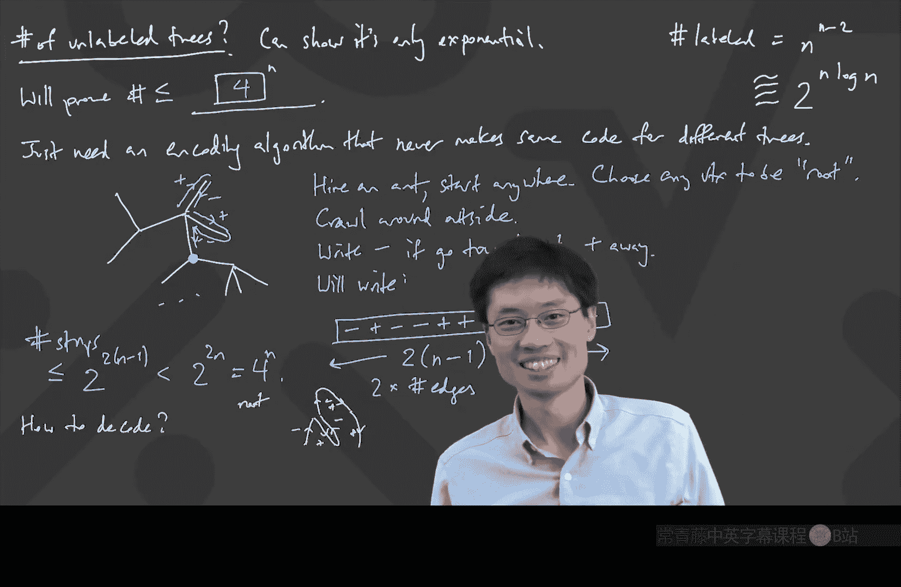

# 029：Prüfer编码与无标号树计数

在本节课中，我们将学习如何用Prüfer编码来唯一地表示一棵带标号的树，并利用这个编码来证明著名的凯莱公式：n个顶点的带标号树的数量是 **n^(n-2)**。我们还将探讨如何估算无标号树的数量。

---

## Prüfer编码回顾

上一节我们介绍了Prüfer编码的概念。其核心思想非常简单：通过反复删除树中编号最小的叶子节点，并记录其邻居，来生成一个数字序列。

具体编码算法如下：
1.  找到当前树中编号最小的叶子节点。
2.  删除这个叶子节点及其相连的边。
3.  记录下这个叶子节点的邻居编号。
4.  重复步骤1-3，直到只剩下两个顶点为止。最终得到的序列（忽略最后剩下的那个最大编号顶点）就是Prüfer码。

这个序列的长度是 **n-2**，其中每个数字都是1到n之间的整数。

---

## 从编码解码树

本节中，我们来看看如何从一个Prüfer码反向构造出原来的树。这个过程证明了编码和解码是一一对应的。

给定一个长度为 **n-2** 的Prüfer码序列，我们可以通过以下算法重建树：
1.  写出数字1到n，作为候选顶点集。
2.  找出**不在**当前Prüfer序列中的**最小**数字。这个数字就是第一个被删除的叶子节点。
3.  将这个最小数字与Prüfer序列中的第一个数字用边连接起来。
4.  从候选集中删除这个最小数字，并从Prüfer序列中删除第一个数字。
5.  重复步骤2-4，直到Prüfer序列为空。
6.  此时候选集中还剩两个数字，将它们用边连接起来。

**解码算法示例**
假设Prüfer码为 `[3, 6, 1, 1, 2, 5, 4, 7]`，n=10。
1.  候选集: {1,2,3,4,5,6,7,8,9,10}。不在序列中的最小数字是8。连接8-3，删除8，序列变为`[6,1,1,2,5,4,7]`。
2.  候选集: {1,2,3,4,5,6,7,9,10}。不在序列中的最小数字是3。连接3-6，删除3，序列变为`[1,1,2,5,4,7]`。
3.  候选集: {1,2,4,5,6,7,9,10}。不在序列中的最小数字是6。连接6-1，删除6，序列变为`[1,2,5,4,7]`。
4.  候选集: {1,2,4,5,7,9,10}。不在序列中的最小数字是9。连接9-1，删除9，序列变为`[2,5,4,7]`。
5.  候选集: {1,2,4,5,7,10}。不在序列中的最小数字是1。连接1-2，删除1，序列变为`[5,4,7]`。
6.  候选集: {2,4,5,7,10}。不在序列中的最小数字是2。连接2-5，删除2，序列变为`[4,7]`。
7.  候选集: {4,5,7,10}。不在序列中的最小数字是5。连接5-4，删除5，序列变为`[7]`。
8.  候选集: {4,7,10}。不在序列中的最小数字是4。连接4-7，删除4，序列变为`[]`。
9.  候选集剩余{7,10}，连接7-10。

最终得到的边集为：`{(8,3), (3,6), (6,1), (9,1), (1,2), (2,5), (5,4), (4,7), (7,10)}`，这构成了一棵树。

---

## 证明凯莱公式

现在，我们利用Prüfer编码来证明凯莱公式。

**证明思路：**
1.  **编码是单射**：我们已经看到，不同的树会产生不同的Prüfer码。
2.  **解码是满射**：我们需要证明，**任何**一个由1到n的数字组成、长度为n-2的序列，都能通过上述解码算法对应到一棵唯一的树。

为了证明第二点，需要验证两件事：
*   **解码算法始终可行**：在解码过程的每一步，我们总能找到一个“不在序列中的最小数字”。这是因为在每一步，候选顶点有n个，而被排除的顶点（已出现在解码表上方或序列中）最多只有n-2个，所以至少有两个候选，其中最小的那个就是我们要找的。
*   **解码结果总是一棵树**：解码过程产生了n-1条边。可以证明这些边不会重复，并且它们构成的图中没有环。一个简化的论证是：如果存在环，考虑环上在解码表中“最左边”的边，其上方顶点的编号将违反解码规则（它本应避免出现在其右侧下方的序列中）。因此，结果必然是一棵具有n-1条边且无环的连通图，即一棵树。

由此，我们建立了n个顶点的带标号树集合与长度为n-2、元素在1到n之间的序列集合之间的一一对应关系。后者的数量显然是 **n^(n-2)**。因此：
**n个顶点的带标号树的数量 = n^(n-2)**

---

## 无标号树的数量估计

对于无标号树（即不考虑顶点编号，只考虑结构），没有一个像凯莱公式这样简洁的封闭表达式。但我们可以估计其数量级。

**核心思路**：为无标号树设计一种编码方式，并证明编码数量是顶点数n的指数级，从而说明无标号树的数量最多也是指数级。

**“蚂蚁爬行”编码法**：
1.  任意选择一个顶点作为树的“根”。
2.  想象一只蚂蚁从任意顶点开始，沿着树的“外围”爬行，遍历每条边两次后回到起点。
3.  蚂蚁记录下每一步：如果这一步是朝着根的方向移动，记为 `-`；如果是远离根的方向，记为 `+`。

这样，对于一棵有n个顶点的树，蚂蚁会爬行2(n-1)步，产生一个长度为2(n-1)的由 `+` 和 `-` 组成的序列。

**为什么这给出了一个上界？**
*   不同的树可能产生相同的序列，但关键在于，**同一个序列不可能由两棵不同的树产生**。给定一个合法的 `+/-` 序列，我们可以唯一地重建出蚂蚁爬行的路径，从而唯一地确定树的结构。
*   所有可能的 `+/-` 序列的数量是 **2^(2(n-1)) = 4^(n-1)**。
*   因此，n个顶点的无标号树的数量 ≤ **4^(n-1)**。这证明了其数量级是**指数级**的（O(c^n)），远小于带标号树的数量级（n^(n-2)，约为 e^(n ln n)）。

---

## 总结

本节课中我们一起学习了：
1.  **Prüfer编码**：一种将带标号树唯一映射到长度为 `n-2` 的数字序列的方法。
2.  **凯莱公式的证明**：利用Prüfer编码建立一一对应，证明了n个顶点的带标号树的数量为 **n^(n-2)**。
3.  **无标号树的计数**：通过巧妙的“蚂蚁爬行”编码法，我们证明了无标号树的数量最多是顶点数n的指数函数，明确了其数量级远小于带标号树。

Prüfer编码不仅是一个优美的计数工具，也在随机树生成和组合证明中有广泛应用。