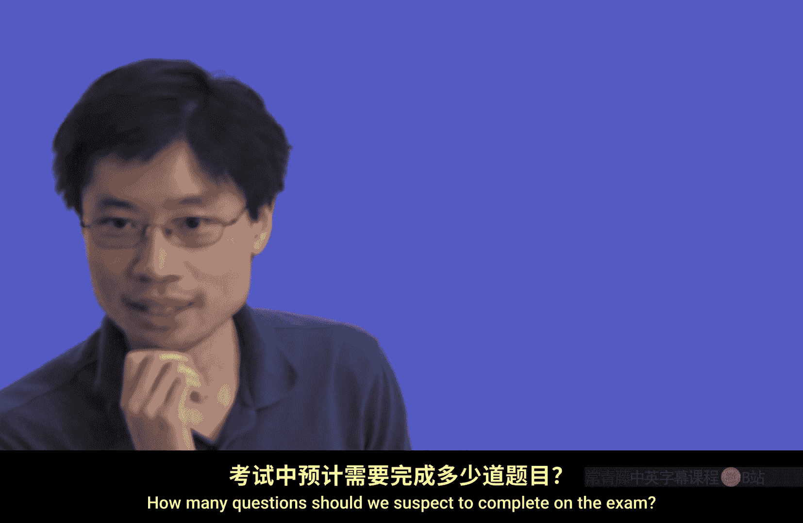
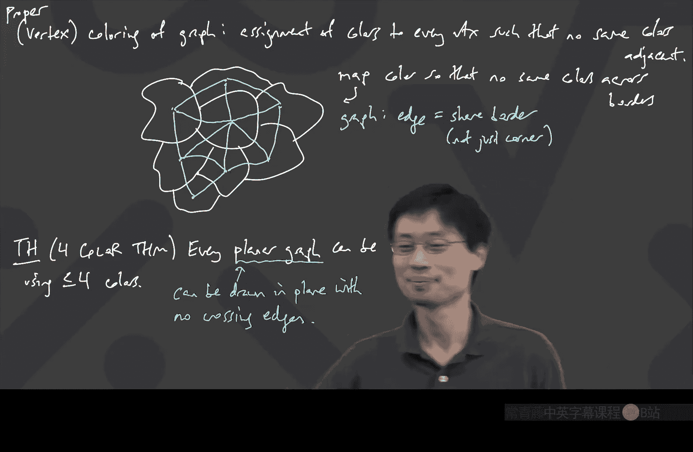

# 034：霍尔定理与图着色

在本节课中，我们将要学习霍尔定理的完整证明，并探讨其在正则二分图中的应用。最后，我们将引入图着色的基本概念，为下一讲学习平面图理论做准备。

---

## 霍尔定理的证明

上一节我们介绍了霍尔定理的陈述：对于一个二分图，如果对于左侧的任意子集 S，其邻居集合 N(S) 的大小都至少等于 S 的大小，那么该图存在一个从左侧到右侧的完美匹配。本节中，我们来看看如何证明这个定理。

证明的核心思想是使用“增广路径”的概念。我们假设存在一个不完美的部分匹配，并试图证明总能找到一条增广路径来扩大匹配。

**增广路径** 是一条交替使用“未匹配边”和“已匹配边”的路径，它从一个未匹配的左侧顶点开始，到一个未匹配的右侧顶点结束。通过翻转路径上所有边的匹配状态，我们可以使匹配的边数增加 1。

**目标**：证明在霍尔条件成立的前提下，任何不完美的部分匹配都存在一条增广路径。

以下是证明的关键步骤：

1.  **假设**：为了推出矛盾，我们假设存在一个不完美的部分匹配，且**没有**增广路径。
2.  **定义集合**：
    *   设左侧顶点集为 L，右侧顶点集为 R。
    *   设 B 是左侧所有未匹配顶点的集合。
    *   定义 S 为所有从 B 出发的“交替路径”所能到达的左侧顶点的集合（包括 B 本身）。交替路径类似于增广路径，但可能提前终止于左侧。
3.  **关键观察**：
    *   由于假设没有增广路径，集合 S 中的任何顶点都不能直接连接到右侧的未匹配顶点集合 D。
    *   此外，S 中的顶点也不能连接到其“匹配伙伴”不在 S 中的那些右侧顶点（记作 C‘）。否则，我们可以延长交替路径，将更多顶点纳入 S，这与 S 是“从 B 出发可到达的所有左侧顶点”的定义矛盾。
4.  **推导矛盾**：
    *   因此，S 的所有边都只能连接到其匹配伙伴在 S 中的那些右侧顶点（记作 C）。
    *   考虑从 S 发出的总边数：`|S| * d`，其中 d 是每个顶点的度数（在二分图中，从 S 发出的边都指向 N(S)）。
    *   对于 N(S) 中的每个顶点，它从 S 接收的边数 ≤ d（因为它可能还连接到 S 之外的顶点）。
    *   因此，我们有：`|S| * d ≤ |N(S)| * d`，化简得 `|S| ≤ |N(S)|`。
    *   然而，由于部分匹配不完美，B 非空，且 S 包含 B。通过更精细的计数（考虑 S 中匹配顶点和未匹配顶点的贡献），可以得出 `|S| > |N(S)|`。这与霍尔条件 `|N(S)| ≥ |S|` 直接矛盾。

因此，假设不成立，增广路径必然存在。通过反复寻找增广路径，我们最终能得到一个完美匹配。

---

## 正则二分图的完美匹配

利用霍尔定理，我们可以得到一个漂亮的推论：**每个正则二分图都有完美匹配**。

**正则图** 是指图中每个顶点的度数都相同的图。

**证明思路**：我们只需验证正则二分图满足霍尔条件。

1.  设二分图左右两部分顶点集分别为 L 和 R，每个顶点的度数均为 d。
2.  首先，由握手引理可知：`|L| * d = |R| * d`，因此 `|L| = |R|`。这保证了完美匹配在数量上是可能的。
3.  现在，任取左侧的一个子集 S。考虑从 S 发出的所有边。
    *   边的总数为 `|S| * d`。
    *   这些边都指向 S 的邻居集合 N(S)。
    *   N(S) 中每个顶点最多能接收 d 条来自 S 的边（因为它的总度数就是 d）。
4.  因此，我们有：`|S| * d ≤ |N(S)| * d`，即 `|S| ≤ |N(S)|`。这正是霍尔条件。

根据霍尔定理，该正则二分图存在完美匹配。

---

## 正则二分图的边分解

上述推论还有一个更深入的结论：**一个 d-正则二分图可以分解为 d 个不相交的完美匹配的并集**。

**证明**：
1.  根据上述推论，d-正则二分图 G 存在一个完美匹配 M₁。
2.  从 G 中移除完美匹配 M₁ 的所有边，得到新图 G‘。此时，图中每个顶点的度数变为 d - 1。
3.  图 G‘ 是一个 (d-1)-正则二分图。我们可以再次应用推论，找到另一个完美匹配 M₂。
4.  重复此过程，每次移除一个完美匹配，直到所有边的度数降为 0。

最终，我们将原图 G 的边集划分成了 d 个互不相交的完美匹配 `M₁, M₂, ..., M_d`。这个结论在调度、比赛安排等领域有实际应用。

---

## 图着色简介

接下来，我们转向图的另一个基本概念——着色，这将在下一讲关于平面图的理论中扮演核心角色。

**正常顶点着色** 是指为图的每个顶点分配一种颜色，使得**任意两个相邻的顶点颜色不同**。

一个经典的着色问题来源于地图绘制：如何用最少的颜色给地图上的国家（或地区）着色，使得有共同边界的国家颜色不同？

我们可以将地图转化为一个图：
*   每个国家用一个顶点代表。
*   如果两个国家共享一条**非零长度的边界**（不仅仅是点），则在对应的顶点间连一条边。

这样，地图着色问题就等价于对其对应的图进行正常顶点着色。

**四色定理** 指出：任何**平面图**（即可以画在平面上且边不相交的图）都可以用最多四种颜色进行正常顶点着色。这是一个非常著名且证明极其复杂的定理（需要计算机辅助证明）。

在本课程中，我们不会证明四色定理，但下一讲我们将探讨平面图的一些基本性质，并可能触及更简单的**六色定理**。

---

## 总结

本节课中我们一起学习了：
1.  **霍尔定理的完整证明**，其核心是通过构造集合 S 并利用增广路径不存在这一假设来推导矛盾。
2.  **霍尔定理的应用**：证明了任何正则二分图都存在完美匹配，并且可以分解为多个不相交完美匹配的并集。
3.  **图着色概念的引入**，了解了正常顶点着色的定义，以及其在地图着色问题中的体现，为学习平面图理论做好了准备。

下一讲，我们将深入探讨平面图的性质和着色理论。