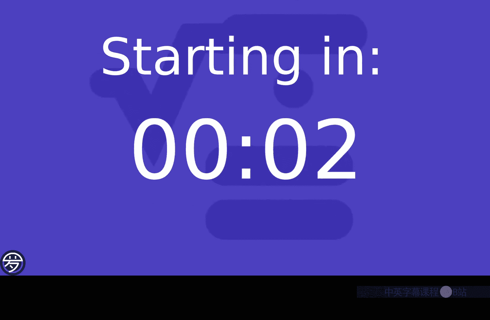
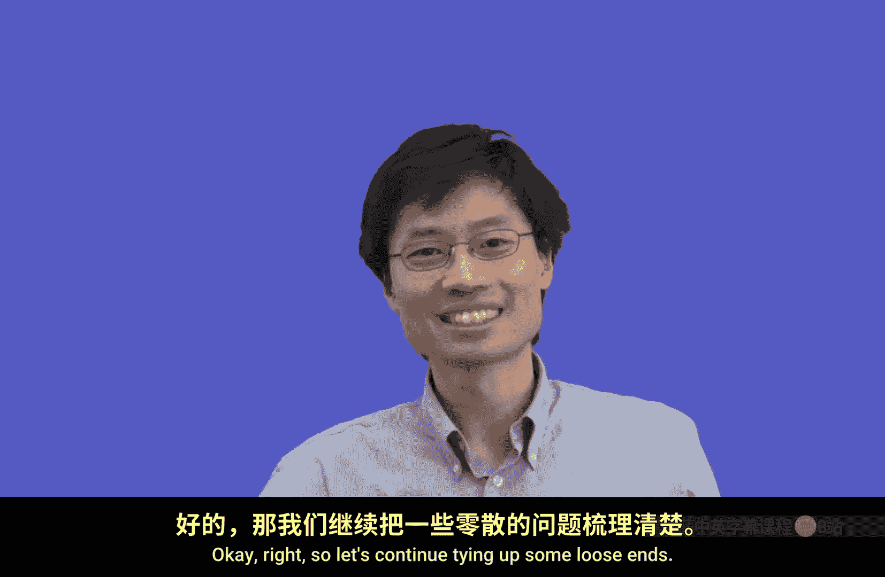
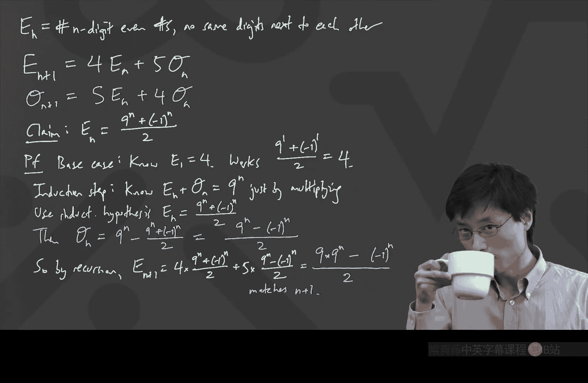

# 卡耐基梅隆【中英⚡离散数学｜21-228 2023, Discrete Mathematics】 p03 P3 -BV1sFibBkEj7_p3-

Hey， everyone， how are you。Hello， happy Friday， I guess we have made it through one week and just as a reminder。

 the homework is due I guess officially now， but unlike the usual class you can't hand it in class just please do it online our great R Ts will take a look at it when they can and what we usually do is that the recitations on Tuesday if they are fast enough then you'll probably be able to talk about the homework solutions on Tuesday。

😊，Okay， great， I hope I hope the questions were somewhat interesting。

 the last one was meant to make people think a little bit。 And， of course， in the recitation。

 they'll also talk about how to do these problems。 But today。

 I want to continue and tie up some of these loose ends that we touched upon for this first week。

 actually， the theme of the first week was to go and talk about some kinds of problems where they might look innocent。

 but it turns out that they're quite innovative to solve。

 I also wanted to give this taste of the fact that in this class。

 we're going to be using quite a lot of different ideas。

 And so it's best to not forget things that youve learned before， or also to think flexibly。

 Some people have asked me， is it going to be really essential to know about eigenvalues。

 eigenvectors and all of that linear algebra。 So I'll give you some good news。

 you don't actually need to have a thorough， thorough understanding of all of that linear algebra in order to do well in this class。

 actually the reason I talk about those is so that I don't have to just tell you this fact is true because it is。

 I can show you why now。😊，I'll be careful on the exams not to make it so that。

You absolutely had to know all of that linear algebra to do well on the exam。On the homework。

 there might be some problems that involve that。 But remember。

 the homework are designed so that you can work with other people。

 And it's a very small fraction of the grade anyway。

 So I recommend that even if you're not 100 per cent familiar with all of that linear algebra。

 ideally find a group of people to work together。😊。

And maybe you also saw that on this homework set today that was due today。

 it could be helpful to have a have a group of people to talk to。

 especially if you wanted to compare your answers on some of the questions。Actually， on this class。

 some of these questions， you can even， if you have a computer， it can be helpful。

 It's like I wouldn't really have wanted that the solution to question 4 is I wrote a Python program and I checked them all。

 That's not the design solution。 but if you have a friend who can do that。

 you can find out if your answer is right。😊，Okay， right， so let's continue tying up some loose sense。

 And， and the goal of this week was there are a lot of topics that are in more basic combinators。

 And that was the goal of this week to talk through a bunch of those。

 But I couldn't bring myself just to teach the basic stuff。😊。

So。Along these lines， I'm going to start with something that's a， it's a pretty standard fact。

 but I'm going to， we're going to take it in some more direction soonon after that。

 we did see this thing where we were trying to rearrange。Ours and Ls。 And we。

 we went and talked about that super fast only because I wanted to get to a point which could have potentially helped you on homework。

But what if we didn't have L's and ours， But you had like A's， B's and C's。 If you had， for example。

 three A's，2 B's and two C's， if I had something like this。

 and I want to ask how many rearrangements。How do you do this kind of problem。

The reason I'm walking through this is because I know people who did math competitions。

 you learn this， but this is actually not part of standard high school curriculum。 And so to be fair。

 let's talk through how does this work and why。 So let's get a few people。 Sydney， Sydney。

 what do you want to say。😊，Okay， assume I'll distinct first and then divide。

By the overcounting factor。Okay， and when you assume they're all distinct， you're like， well。

 if I had how many， I can't count 7 things。 Okay， oh， let's make them distinct。

 Let's make them distinct。 one's this A， the other is this A。

 The other is what other kind of A can I write。Ohoh， here's an A。 And then I can write some Bs。

 right， So here's a B。 Here's another B。 And here's a C， and here's a a little C。

 which looks like the big C。 But I have， I have now 7 distinct things。 And clearly。

 the number of ways to rearrange these things， the number of rearrangements。

And this is review for most people， but I'm just doing it to everyone's on the same page。

 Number of rearrangements is， I've got 7 things。 What goes first，7 choices for what goes first。

Times now， once I've decided which of these things goes first， what goes next， Well。

 I can't pick one of the7。 I can't pick the same one that I already picked。 So there's 6 left。

To go next。Okay。And then it keeps going， times five left to go next and all the way until I've put the seventh point down。

So when I put the seventh one down， the last one， there's one choice。

 It's good that there's one choice， not0 choices， because then otherwise it wouldn't make sense。 But。

 you know， you multiply all the way。 The last one is the last one。 and it's just the one that's left。

The last。1， remaining。Okay， and in， in combinators。

 we see this so often that we write this as 7 factorial。Okay。

 so that's this factorial notation7 factorial fun fact。

 I'm just going to say it now we're probably not going to use it in the lecture part of this course。

 although you might see it in the homework problem， here's a fun fact。😊。

Does anyone know what 7 factorial factorial means。It's not actually what you think it is。

 It's not like how you read it。 for whatever reason， someone invented a different notation。 Brian。

 Oh no， no， Ben， Ben， Ben son。呃，也还是。Yes， the first time I ever saw this I was like， what？

I thought it was like you factorial and that you factorial it again。

 although a bit of me was wondering who in the world would ever need to do that。

 that's like 55040 factorialious is gigantic。 But for whatever reason。

 if you ever see two factorial marks next to each other， it means that you went like every other one。

 Now， I've never seen anyone write 6 factorial and6 double factorial。😊。

I'm not really sure what happens there。 Like， you don't mind a times the 0ca that would be dumb。

 But I， I assume if you ever were to do that， you'd go all the way down to times 2。 Actually。

 it's probably probably goes down to times 2。 but I don't usually run into that。

I just wanted to say this in case you're ever reading anything about combinators or discrete math。

 and you see the double factorial， it means something like this。

I've actually never seen a practical application of a triple factorial。

 which would presumably mean you skip like every three。 But just so you know， that's what that means。

Okay， let's continue。Continuing from every left off， we need to divide by this over counting factor。

 What's the over counting factor。 Well， what that means is， you see。

 if I went and wanted to rearrange， observe。This。Are the same。

Once you realize that the letters are the same once。You realize。The letters。Are the same。

And I'll just draw like， you know， two examples。 One is like。The capital A and then the lowercase B。

 somehow， I chose to use colors。 So I'll put the capital B， and then I'll put， you know。

 one of this lowercase C， and then I'll put the alpha， and I'll put the A。

 and I'll put the capital C。Okay， I claim that that is the same as another one where I just do something different。

 I go and put the alpha first， and then I put the little B， the capital B。

 I switch the capital C and the little C。 And I guess I put the little A and the capital A。

 I just wanted to emphasize these two are the same because the letters are in the same positions。

 It's just that they're different variations on the letters。😊，Right， these two are the same thing。

 If I'm only counting the original question， how many rearrangements。

And so the important thing here is that only。The type。Of writing。Of the letter。Changed。Okay。

 and now we， we talked about an overcounting factor。So the natural question to finish this is。

How many。Rearrangements of the distinguishable type。 That's what this is called。

 How many rearrangements of the distinguishable。Are the same。Does that question make sense。

 It's like， here are two which are the same。 Look， I found 7 factorial ways to rearrange。

 but I actually get clumps of really the same thing。Right， I get all of these which are the same。

 So I should divide。 I should say I've got 7 factorial divided into these clumps。

 How big each clump is。And what would that be。Raise hand， Andrew。So有啲家宝。

So I'm using the colors to just match what they were。So the purple was the A's， right？

 So when when I want to know how many ways can I rearrange。

 What you see here is I'm just sticking the A's in the same places。

 So those A's will always be in those three places。

 but I just can rearrange the A's among those three places。

 that's the same kind of problem we solved earlier Earl， we were like， if I've got a bunch of stuff。

 how many ways can I rearrange the stuff。 So if I have three purple A's。

 which are written a bit differently。 The number of ways you can rearrange the three purple A's is just three factorial。

😊，And then you multiply by， I've got these two fixed positions for the bees。

 I can rearrange those in two factorial bays， and I've got the green seas in in some fixed positions。

 Also， I can rearrange them in two factorial wayss。And then that gives you the answer。 The answer is。

 we have。This many rearrangements，3 factorial，2 factorial，2 factorial， this many total。

 and so I'll just write it in the top right， the answer。

Is going to be 7 factorial divided by3 factorial，2 factorial，2 factorial。O。So that's neat。

 This is just the number of ways that you could rearrange like these， these symbols。

 Does anyone have any questions at this point， By the way， Did this one all make sense。Good， okay。

 in general， slow me down。 The way I'm used to teaching a class is I'm used to looking and seeing how many people look confused because that's a normal classroom。

 But my ability to sense confusion is much worse when cameras are off。

 And so I will only be able to adjust the speed based on， cameras turn on。

 I'll be able adjust the speed based on like what you type or whether you look confused。

 And by the way， I want you to know， I actually， I'm always sensing if people are confused。

 So even if you don't want to type to slow me down。

 if you do turn on your camera and you look confused， I might notice。 And then like。

 if enough people look confused， I'll be like， who who whoa， this is going too fast。😊，Okay。

 and I'm not in a huge hurry to teach you tons and tons of stuff。 I just don't want to bore people。

 And so if people seem to be like， oh yeah， we know all this stuff， right， then I'll just keep going。

Okay， cool。 Well that was fun。 Okay， so so that that's like how many ways to rearrange this thing。

 Now I want to question。 Oh， yes， question， please， Thomas。😊，哎嗯。So can you also。玄关？Wa， okay。

 I like that。 Okay， another way。 So what you said is there's another way to do this。 I have， yeah。

 okay， that's a beautiful thing about combators。 You can always count in lots of different ways。

 I like it。 So let me write on a new picture。 What we have here。 So the question was rearrange。😊。

3 A's。Two bees。And two C's。 And we knew the answer。

 The answer was this 7 factorial divided by3 factorial 2 factorial 2 factorial。

 But you have another answer， your other answer。😊，Roops。My pen is sometimes a little finicky。

 especially when I get excited。 So what you said is it was 7， chooseose 3。So，7。Choose 3。

And then you said times4， choose 2。 Is that what you said。Yeah， I think so。 So why， why this is。

 is because what you said is like， I have7 spots。 I have 7 places。Since。You have seven places，1，2，3。

4，5，6，7，7 spaces places， I said。7 places。Choose。3 for the A's。 That's totally legitimate。

 You drop the three A's somewhere，1，2，3。And then what you said is well， three places are gone。

 So out of the remaining four places。 So then。From remaining。F places。Choose。Run into my head。

 choose  two for the bees。Okay， you choose the two for the Bs，1，2。 And then your point was。

 why don't you multiply by 2， choose 2。 Well， actually， you do。 But  two choose 2 is 1。

 It doesn't make a difference。 You could say， I also want to multiply by the number of ways that from these two spots。

 I choose two places to be Cs， There's one way to do that。 You don't even need to write times 1。

 So you can stop here。And the beauty is that actually， that's the same thing。 So let's， I。

 I was actually going to talk through how you get the formula for these。 Alright。

 But let's go ahead and just do this with the formula first and explain why formula works。😊。

7 shoes 3。 What's that， well。Remember the previous way I said it is if I want to choose three things from seven places。

 there are 7 ways to choose the first spot。And then there is six ways to choose the second spot。

 and then five ways to choose the third spot，  similar to what Si was doing。

 total number of ways of doing something divided by over counting。 So， for example。

 I could have said， oh， pick the third spot for the first A。

 Pick the sixth spot for the next A and pick the fifth spot for the last A。That's 7 ways，6 ways。

5 ways。 But then I need to divide because。I picked three spots。 and what order did I pick them in。

 it doesn't matter。Like， no matter what order I pick these three spots in。

 it's the same combination of three A's。 And so the number of ways I can redo the order。

 this is the rearrangement of the order of the three A's。 That's three factorial。Okay。

That's always how I think of 7， truth，3。And then4 choose2 the same deal is four times 3 because four ways to choose the first one。

 three ways to choose the second one divided by two factorial。And actually， if you look at it。

 they're actually the same answer。 It's even written in a nice order，7，6，5，4，3 over 3 factorial。

2 factorial。 If I just felt like it， I could even multiply by two factorial over two factorial for fun。

😊，Because that's just one， right， it doesn't hurt。 if I just times the 1。

2 factorial over two factorials，1。 And what's the numerator。 The numerator is 7 factorial。

 and the denominator is 3 factorial2 factorial 2 factorial。 So it all works up。

 So it's the same answer。Same as 7 factorial over 3 factorial，2 factorial，2 factorial。Okay。

So that's like one way to， to figure out， you know， how many ways you can rearrange these A's。

 Bs and C's。 And we also saw you can get it through the chooses。Along those lines。

 we can actually also use this to get another， another way to explain the formula for what 7。

 chooses 3 is。 Here's another way to find out what the 7 chooses 3。Another wave。To get。7， choose 3。I。

I could just ask the question。It's the number of ways。To rearrange。I want。3 Vs and four x'。Okay。

 so what I wrote here， I want to get 7 and choose 3。

 I can get 7 and choose 3 by saying it's the same as the number of ways to choose3 Vs and 4 x's。

 rearrange 3 Vs and  four x's。😊，The reason is because the way you can think of it is a V is a check mark and an x is a no。

So if， for example， I had7 things I wanted to choose， you know， 7 things I wanted to choose from。

 And they're kind of arranged in order。 And I want to know how many ways can I choose three of them。

 That's like figuring out how many ways I can put three check marks on the ones that I chose。

And for Xs saying， I don't choose the others。Did that make sense。 So basically。

 I'm saying the answer to 7， choose 3 is also just the number of ways you can rearrange 3 check marks and  four x's。

 because you imagine the seven things in a row and under the row is which ones I checked and which ones I threw out。

But we know what that is。 We just worked that out。That was equal to 7 factorial。

 the number of ways to rearrange if they were all the same。

Divided by the number of ways to rearrange the check marks。And rearrange the axis。Yeah。

 so it's just like， I'm just showing all of these different ways come together。 Again。

 people who did math competitions。 you've seen this before。

 but I want to kind of bring everyone on in the same way that we， we think about this。😊，Okay。

 so now now we're good with like chooses。 We're good with like rearranging things。

 And I want to next go to that， oh， somebody said， raise hand question mark out of it。😊，Yeah。😊。

お、弱みでするね。Yes。哦，O ok。Yeah， yeah， yeah， yeah。 Okay。 Let's。

 let's talk about that because you just use the word binomial coefficients。 And that's good。

 We've got time。 Let's go into there。😊，So these chooses， I often call them like 7 choose 3。

 I call them chooses， but actually， things like 7 choose 3。Is called。A binomial coefficient。Now。

 why is it called a binomial coefficient？ It's because it's a coefficient of something to do with binomials。

 There's something called the binomial theorem。Right。Since if you go and take the binomial x plus y。

Raised to the power 7。And then you try to expand this whole thing out。

 What you end up finding is that， well， there's some coefficients。 actually。

 if you expand the whole thing out。Do I really want to write seven of them。

I don't know if I want to write 7 of them。 Oh， I'll do it anyway。 I'm just not sure if I have space。

1。To。If I was really fancy， I'd just use copy and paste， which you can't use on the chalkboard。

 except that I don't have a mouse attached to this thing。Oh， that didn't take that long。Okay。

 so I have all of this。 I wrote the whole thing out。 This is7 of them。

 And if I wanted to expand this out， then what you see is that there is some coefficient on an x to the 7。

 How do you get a coefficient on x to the  seventh well。

You have to take the X from every one of the terms， right。

 So the only way to get x to the seventh is you take the x from each of the7 from each of the seven possible binomials。

You pick the eggs。Okay， there's only one way to do that。And the way that works is you pick。The X。

From each， from everyone。Every。😔，Term。X plus y。Okay。

 now there's going to be some stuff in the middle， but at some point。

 you'll get something times x to the power3， y to the power 4。Okay。

 and there's some coefficient here。Now， if you want to know。

 what should it be times x cubed by to the fourth， First of all， the 3 plus 4 is 7。 That makes sense。

 because from each of the terms， you either get the x or you get the y。 And when you multiply。

 you're going to multiply together 7 things。 So your total power is 7 between the x's and the y's。

 And then now the question is， how do I get 3 x's。 Well， I have 7。Prenheses。

And I need to use three of them to pick access from。And four of them to pick buy from。

That's why it's7 chooses 3。This actually happens to be 7， chooses 3， because。From。

3 of the 7 x plus ys。You pick。X。So that should feel like 7 shoes，3。

So that's actually why these are called binomial coefficients。

 because in this binomial theorem of x plus y raised to some power。

 then the coefficient of x to the power something y to the other power is just this choose。😊。

What Aavates said is that the thing we just saw seven factorial over three factorial 2 factorial2 factorial。

 that's not one of these binomial coefficients。Actually， that's a triomial coefficient。

So let's talk about the triommial theorem。This one， we don't usually teach in high school。

 but it's the same principle。 Triobial theorem is just saying X plus y plus z。Raised to the power 7。

 This time， I'm not going to write all of them primarily because I don't have space。

 but I'll write a few of them。So it's x， oops。Plus， y plus z。

Times for a while all the way to x plus y plus z。 And this has all kinds of terms inside it。But。

 along the way。There is a term。Plus， some term， which is x to the power 3， Y squared， z squared。

Somethings telling me I should have just called these A plus B plus C to the power 7。

 That have been even better。😊，Because then that's exactly the problem we were doing。 But if I。

 if I'm doing this with like x is ys and z's， Well， how do I get x cubed Y squared Z squared。😊。

The way you do that is you want to know， I， I have this sequence of instructions。

 which is like I have7 things that I'm picking either X's or Y's or Z's。

And the number that goes there is the number of rearrangements of the。Rearrangements。Of the sequence。

I'll call it a string， actually， because we have enough computer science people in this room。

 The string with three x's。2 ys and two z's。Because the string you can think of as telling you the instructions of from each of those seven parentheses。

 who did you pick？And that's what we just did。Good lo。Oh， somebody's responding to Pascal's pyramid。

 Yes， yes， yes， yes。 That's right。 So the thing is that。

 you can just do this in more and more dimensions。 To， totally legit， okay and。😊。

I don't remember if there's a homework problem on this or not， but it's a question I often like。

 But anyway， so this is the number of rearrangements。 And sometimes the way people write it。

  different people have different ways to write it。 I write it this way。

 That doesn't mean it's the only correct way to write it。But， but for me。

 I find this an easy way to think of this。 This is not like standard notation that you'll see everywhere。

 but this is how I， this is how I think of it。 And that that gives you the triomial theorem。

 If you have any triomial that you'd want to know， like race to some power and what's the coefficient of some term。

 Just do this。O。So at this point， we， you could also do that like the what's the for。

What's after try， Quad Quadnomial。Tettraommial don't know。 It doesn't matter。 These are in general。

 called multi noial coefficients。And the multinomial coefficients generally look like something like this7 chooses 3。

22， and you could have more。 That's just how all these were。Are there any other questions。If not。

 I'm going go and drive on to something else that we talked about on Wednesday。

 but I'm going to look at it through a different lens now。

And that was this problem of trying to find paths through a grid。

 So let's go back to this first grid， which was the complete one。

 which means that that's supposed to be a square。45 degrees is hard to draw close enough。

So we've got this thing， not really a square， but they' will do the job。 So I've got this。Got these。

Okay。So remember what we were doing last time is we were trying to count the number of paths from top to bottom。

Cout。Pas。From the top to the bottom。Okay， now， last time we did it with some people saying。

 count the number of left and the number of right。 That's the L's and the R's。

 And in light of what we've done today， everything makes sense。 Now， last time it was 4 Ls and 4 R's。

 right？ And so what we found out it was the answer is the rearrangements。Of4 else and 4 R's。

 which many people said was 8 chooseose 4。 And let's get an answer on that。

 What was that that was 8 times 7 times 6 times 5 over four factorial， four times 3 times 2 times 1。

Cancel stuff。I'm doing this on purpose because I actually want to get an answer now。I just see a 6。

 So I somehow when I do factorials， if I see 3 and 2， I like to cancel out the6 and the top is nice。

 Okay， so that's 2 times 5 is 10。 The answer is 70。😊，Okay。

 now I'm going to show you a different way to do this。

 A different way to do this is imagine that you were a computer scientist and you didn't supposeose you didn't know this fact。

 There's still a way to do this in a way of。Computer based counting。

 but not in like an explosive way where we're counting too many things。

 It's a technique that's called dynamic programming。

And I'm not going to be teaching this from the point of view of a computer science programming class。

Here。But the basic principle。Of dynamic programming is once you've done some work。

 use the work for the next step。And so what I'm going to do is。At every single。

Vertex at every single like corner point， corner point， meaning even intersection point。

 I'm going to write a number。 and that number is going to represent how many ways there are to get from the very top to that point。

For example， I will say the number that goes here。Is it two。 Now。

 how do I write this in a way you guys can read。I'll write a two here。 Okay。

 so there's a two at that intersection point， because there are two ways to get there。

 starting from the very top。 You can see one is go left and then there。

 The second is go right and then there。Okay。So what we'll do is we'll write a number。

At every intersection， or I'm going to call it vertex， every vertex。Which is the number of ways。

To get there。Moving down。From the top。Okay。Now， I don't actually want to just write the number two there。

 I want to build this up somehow。 And the way you build this up with dynamic programming is you start at the very。

 very top。 And you say， well， the number of ways to get to that one from the top is one because it's already there。

 There's nothing else you can do。 That's a one。Now， what else can I do， Well。

 if I want to know how many ways to get there， which is next to it， the number of ways is。

1 coming from the top。So far， so good。 This is one。 and this is what。But there's something nice here。

 There's another way to see why this is two。 The other way to see why this is two is if you wanted to get here。

 there are exactly two ways to get there。One way is to come from the left and the other is to come from the right。

There are two mutually exclusive ways and that that explain the complete number of ways to get to that point。

 You either come through the left or you come through the right。Therefore。

 the number of ways to get there on the two should be one plus one。

Because I already know there's one way to get to that spot on the top left。

And there's one way to get to that spot in top， right。And I can say。

 take either of those and then take the next step。So it should be one plus one。Once you realize。Yeah。

 but once you realize this， then you can continue。 So， for example。

 how many ways are there to get here， which is the next thing on on the left。

 The number of ways to get there。 One way to say it is， was just one go that way。

 The other way to say it is there's actually only one way to get there。

I's to come from that yellow 1。 There's literally only one way to get there。 It's from there。

 So the number of ways is number of ways to get there。 Okay， and then take that one more step。

That's why that's a one。The same argument， or even symmetry tells you that the other side is also a one。

Okay。What you see emerging is something that looks like what's called Pascal's triangle。 Actually。

 if I continue this out this way， how many ways are there to get to the thing that's diagonally to the left of the purple 1。

 the left most purple  one， still only one way。Because I could only get there from that purple 1。

 But now， how many ways can I get to this thing that's under the one and the two。 Well。

 I could get there。Either coming via the one or coming via the two。

 coming via the one means there was one way to get to that spot。 Okay。

 and then I could take another step， or there's two ways to get to the other spot。

 And then each of those two ways lets you take another step。So that should be one plus 2， which is 3。

So the key is you just can add， you look at the things that are going in and you add。

And if you complete this， the next one gives you another3 and a one。This is Pascal's triangle。

 forming up there。Next。You get the familiar1， and then1 plus 3 is 4。 I'm doing it faster。 Now。

 This is 4，3 plus 3 is 6，1， 3 plus 1 is 4， and then there's a 1，1，4，6，4，1。 Now。

 only because we kind of focused on this square grid。

 you don't see more of Pascal's triangle because we're losing the parts that are falling off on the edges。

 But if I just do the additions。I guess we can go back to。Green or something， I don't know。

 Some other color，1 plus 4 is 5，4 plus 6 is 10，6 plus 4 is 10。4 plus 1 is 5。

 It's actually not that bad。 Just always adding the two that are directly above to get the one underneath。

5 plus 10 is 15，10 plus 10 is 20。10 plus 5 is 15。 We're almost done。Let's go to。15 plus 20 is 35。

1520 plus 15 is 35。 and finally，35 plus 35 is 70。And it works。 It matches the same 70 there。

So this is another way that you can do this。 And actually。

 what we just found out by doing things this way is this is another way to give you Pascal's triangle。

 It's another way to understand why these binomial coefficients， the binomial coefficients。

 which are the chooses， actually form the numbers that you're used to seeing in this Pascal's triangle When I add two things above to get the next thing below。

😊，Because if you remember， the number of ways to get to any particular point was a choose。

This thing about。4，8， choose，4。 That was down here。

And if you think about what each of those numbers is， each of those numbers is a truth。

 which is based on how many Ls and how many Rs。 I see there's a comment by Connor。

Can you say that comment again because that's a good comment。先装せ。There's a hole， either a。Yes。

 and that's what I wanted to get to next。 So the one that we did last time has a very nice hole。

 If you remember how we did it last time， we used the fact that we could do some subtraction principle。

😊，And that only worked because we only removed one edge。 If it was a more complicated picture。

 actually， it would have been horrible。 But the way that we did it last time。

 I just want to get the number from last time because then we can compare and it better be the same。

This is what we had last time。 And last time what we said was the number of ways was imagine there's no hole。

 So last time we got that the answer was equal to if there was no hole， it choose4。

 which is no whole。Oh， we know that' 70， okay。And then， minus something。

We had to minus the number of ways that you actually go across that edge。

 So it was the number of ways。That you actually go across that edge。 I drew that schematically。

 like this。And then we go across that edge。 And then there was this， like four thing。Right。

 that's what we had。 That's what we had。 It was like。You have to use the edge。

 And the way we did at that time is we said that's multiplying some binomial coefficients。

 The number of ways that you can get to the top of the edge was two left and a right。So， that was。3。

 choose，2。Because I've。2 L's and an R。 And I need to decide out of these three positions where to put the L's。

 And here， this one was  two Ls and two R's。 And that means I have four positions。

Choosing2 to be else。And if I can do this， that's equal to， let's do the arithmetic 70-3。

 chooseose 2。 Here's another nice thing。 If I want to choose three things from2。

 if I want to choose two things from three things， it's the same as choosing one thing to unchoose。

There's a symmetry in binomial coefficients。 So I unchoose 1。 That's like 3。 unchoose 1。

So this is a symmetry where3 choose  two is the same as 3 choose1。And3， chooseose 1 is just three。

3 ways to pick one thing。 And4， choose 2。 I've done this one enough times that I know what it's going to be。

 But we can say it's four times 3 divided by two factorial。Which is 70-3 times 6， which is 18。

This is the hardest part，52， Okay，52。 So the answer should be 52。

 But now let's go and compare with this other， other way， the dynamic programming way。

 the other dynamic programming way is called Let's just go and write numbers on the vertices。

 There is one way to get there， because I start from there。😊，No。

There is one way to get here and there's one way to get there because they actually anything on the border is one because there's only。

 you know， you can only go along the border to get there。Next one， there's one way to get here。

 two ways to get there， one way to get there。Okay。And if I keep going。One way to get there。

 One plus 2 is three ways to get there。2 plus1 is three ways to get there。

 And there's one way to get there。 But now it gets interesting。The next level， I have a one。

The one plus 3 is 4。But then suddenly， the next one is not my 3 plus 3， right。

 Because the only way to get to the next one。Is to go down and the left。I've lost one of these edges。

And since I've lost one of these edges， that's actually just three。

 because there were three ways to get to that spot。

 And then you can only carry on going down into the left。1 plus 3 is still 4， still keeps going。

 And then there's the one there。And then from here on down， I actually have no more missing stuff。

 so I will always add the two numbers above to get the number below。So  one plus 4 is 5。

4 plus 3 is 7，3 plus 4 is 7，4 plus 1 is 5。And then 5 plus 7 is 12，7，7 is 14，7，5 is 12。Okay。

And then 12 and 14 is， what is that，26。And then 1214 is 26。 Oh， good。 So 26 and 26 is 52。

And math works every time I do this， I'm always afraid the numbers don't match， but it works。

 It has to work。 So this gives you another way to get the same problem and。

Who shot Pascal's triangle。 Yes， yeah， exactly。 So， so actually， if you think about it。

 these two techniques， But one technique was called fancy。

 multiply binomial coefficients and subtract in this particular problem。

 since there's only one missing edge， the one the way we did it last time is more efficient。

 That's true。 However， if you imagine like a very shot Pascal's triangle， like a big， a big。😊。

Grid with lots and lots of things missing。 In fact。

 this way originally would have been horrible because like。

 what are you supposed to subtract and how many cases do you have。

 And then this dynamic programming thing would be the way to cut all the way through。And it's yeah。

 it's only because the whole。 Well， Chris， it's not really only because the hole is in the。

Even center， really， it's because there's only one hole。The more holes there are。

 the more cases you have to be of like did I？Do I subtract the one that goes through that edge only or like also that edge。

 There's just more cases。哦。Oh oh， great。 Yes， thank you。 Thank you。 Thank you for asking。

 and thank you for answering。 I'm just too slow。😊，Okay。Great， so I'm just。

 I'm just double checking to make sure I covered everything I wanted to talk about in this part。

 There， There is actually， by the way， a course textbook。

 but I'll share that with you after we get through this chapter。 So good。 Oh， yeah。

 There's one more thing I want to hit here。 Okay， so， so right， right。 So so this。

 this is like a nice way in order to solve these problems。 And actually along the way。

 We got something for free。😊，I'm going to go back to the Pascals Triangle。Along the way。

 we can actually prove for free something interesting about what happens if you add up a row of Pascal's triangle。

😊，A row of Pascal's triangle， by the way， means the chooses from a choose 0 all the way to like an n choose n。

If I want to emphasize what these are， this guy here， that's4，20。And this guy here。

 that's four choose4。没有。Okay， so if I， if I imagine adding up all the numbers from 4， choose 0 to 4。

 choose 4。What do I get。Well， I can add one plus 4 plus 6 plus 4 plus1。

It's like 5 and 5 on each side。 That's a 10 plus a 6，16。 That's interesting。

 So we now know that 4 chooses 0 plus 4 chooses 1。😊，Plus，4， choose 2。Plus。4， choose 3。Plus，4。

 choose 4 is 2 to the power 4。16， so it's probably not a coincidence。 Why would that be。

 Is there a way to think of this actually in terms of what weve just done， Braden。Okay。

 that's not what I was planning to do， but that works。 Okay。

 you can say that's true because if I took one plus one to the power 4。

 we know by the binomial theorem。That this is equal to 4 choose 0 times the first one to the power。

 I guess，0 times the second one to the power 4 plus all the way to 4 chooses 4 times the。Second。

 well， the first one to the power 4， second one to the power 0。 I see first one and the second one。

 because there is a first one， and there's a second one。 Okay。

 and because when you raise one to any power， nothing interesting happens， so。

The left side is your2 to the power of 4， and your right side is the sum of the binomial coefficients。

 That is true。 There's something else I wanted to use。 Yeah，ia。呃觉 that。这前这前。Okay， yeah。

 that's that's close enough to what I was planning to say。 effectively。

 what you have just done is if you're adding all of this， remember。

 binomial coefficients are also telling you how many subsets of particular sizes can I get from a big set of four things。

 So another way to think of what each of these is like that four chooses 3。

 That's the number of subsets。😊，Of three elements。F。4。Total。

So if I have like four things and I want to know how many ways can I pick a subset of three of them。

 that's for choose 3。 And here it's like all the different ways。

 So the answer should be how many subsets are there。 And  two to the power 4， If I have four things。

 each thing is either in or out。And so it's like either in or out。

 there's like two choices of your status。For each of those， four total。Y。嗯。The four。Is in or out。

Two choices。And so， you know， the number of ways I can do this is two ways， times two ways。

 times two ways， times two ways， to to the power 4。

Maybe I'll just say another thing that's equivalent to this， which is what I was planning to say。

 but it's equivalent， was， you know， we're trying to find out how many ways are there with these L's and these R's。

If I add up across all of here， this is just a number of instructions。

That have a total of four Ls and R's in them。Does that make sense， Like。

 if I look at how I can land on each of these spots， which is at this fourth level。

Each way of ending in the fourth level is some sequence of L's and R's。

 where there's a grand total of four things。And that's the same as what's going on here。

 What's going on here is saying， like， I've got four things。 They're either going to be L or R。

And any way of。Choosing one of those two options and doing it four times， I will get to this layer。

And so if I add up all the ways to get to that layer， it's gonna be the same。So this is a nice。

 nice consequence。 The sum of the binomial coefficients across the row is always two to the power that row number。

Okay。Are there any questions about any of these things。At this point， yeah。If not。

 then I want to tie up one last looseand that will finish up this week。 We add this 9 to the power。

-1 to the power formula。And I ran in through this linear algebra， which looks scary。

 But the reason I said at the beginning of this class。

 it turns out you don't really need to have the linear algebra all the time is because actually。

 if you get a formula， there is a technique to prove a formula， It's called induction。

If you could just prove the formula by induction， you don't need to know any of the linear algebra。

 And that's what I want to do to close out this week。

 just so that no matter what your background was， you have a formula for the number of even numbers and digit numbers。

 which are even with no same digit next to each other。 So let's start reviewing again。

 Remember if E N was the number of n digit。Even numbers。No same digits。Next to each other。

Remember what we had was we had figured this out already。 You can see your notes， but E N plus1。

Was equal to four times the E， N。Plus， five times the O F。And if you want to remember。

 why was it four times the even， Its because if I had the end digit thing and it ended an even。

 then I have only four even numbers I can choose from to finish my thing。

 becauseuse I have to avoid that one even number that was right before it。

And I also have the other thing， which was the O N plus1。Was equal to。5 yan。Plus，4，0，Now。

 there was a claim which was， we want to prove that EN has some formula。Clre。Yian。Is equal to it was。

9 to the power， N。Plus， negative one to the power N over 2。Now， you can prove this by induction。

And I am going to assume that people have seen induction before because 21，1，27，1，28 or 15，1，51。

 These are all things that you should have before this。In this class。

 you don't have to be as precise about your induction proofs because we're not teaching induction as the main thing here。

 So I'm going to say， what's the main idea。 The proof is， what's the base case。Well。

 the base case would be E。 and it's okay because I know what E1 is。 I know。That E1 was 4。

Because there are these four different numbers， which are one digit and even。

And it works in the formula。 It works。With 9 to the power 0 plus negative  one to the power 0 divided by 2。

 that's equal to what in the world just happened。1，1，1，1，1， Yeah， yeah。

 because math is supposed to work。 Okay，1。 so that's 9-1 is 8 divided by 2 is 4， okay。😊。

Now we have to do this induction stuff。Induction step。Okay。

 now it becomes a little bit useful to also use an observation people had said before。

 which is what is E， N plus O， N， We already know We don't have to use induction for that。 We know。

That E， N plus O， N。Is just equal to how many n digit numbers have no two digits next to each other。

 That was 9 to the power app。Just by multiplying。Remember that it's like because of E N and O N together。

 that's how many n digit numbers， No equal digits next to each other。

 We did that like really early on，9 ways to choose the first digit。

9 ways to avoid that for the next digit and so on。Okay。And we also use the inductive hypothesis。

Use inductive。Hypothesis。That E， N is equal to。9 to the N。Plus， negative one to the N divided by2。

 I'm trying to prove the inductive step。 I'm trying to get the n plus one formula。

Can anyone tell me why I went through the effort to say something about E plus O N。

There is a reason why I wrote this down。 The next line I want to write down is going to be very useful。

😊，Now， you can find O， N。 you see， because the point is， I'm actually not using induction to prove E。

 N plus O N is 9 to the N。 I just know that because I counted that separately。

And so now once I do that， I can use the two together。Then the O。

 N is equal to 9 to the n minus this thing，9 to the n plus negative1 to the n over 2。

Is that a nice formula， Actually， it is。 The reason it's a nice formula is if you put it over a common denominator。

Look what happens。If you put it over a common denominator of  two， you get。Two times 9 to the N，-1。

9 to the N。That's just a9 to the end。按照。Plus， negative one to the n becomes a minus negative one to that。

So I， I just did algebra here。 This is actually not crazy stuff。

 It's just If I put over a common denominator， I get this。Well， once I have all of this。

 I can find E N plus1。 It becomes just a smash them together with algebra。So， by the recursion。

E N plus1。It's equal to。Four times the E N。 So that's four times。

9 to the n plus negative one to the n over 2。And then， plus five times。The O， N 9 to the n。

 negative1 to the n over 2。This makes you happy， because。It's a small formula。

 and surely in this small formula， we can simplify it and make it match。

And whenever you have these kinds of expressions with big powers of n or big powers of n of9， Well。

 you put over a common denominator。And we start to collect how many9 to the ends are there。

How many9 to the ends are there， Well， there's four of them。I mean over the over the two， right。

 I've got four of them， and then I've got five of them。4 plus 5 is 9。9ine times 9 to that。

And how about the -1 to the Ns。 Well， actually， I have -1 to the N， and I have four of them。😊。

-5 of them。So it's a minus sign。We're done。That's your formula。 That's like exactly what we wanted。

 This is the expression for E N plus 1。 It's 9 to the n plus 1。😊，Plus。

 negative one to the n plus one。All over too。It's matches。 This is exactly what you wanted to show。

 That matches the claim， right？ So it matches matches。😊，And plus one。

And so that actually finishes the entire proof by induction。This is a taste of what this。

 this is like。 this class is like。 You can go through a lot of work to go and prove something。

 And it can also turn out that just like induction ba。And then you're done。 And then you ask， like。

 why did we bother doing all of the matrices and linear algebra stuff？ Well。

 it's because that gave us another insight that gave us another view。

 And also because you're not always so lucky to be able to guess the formula。

 There are many problems in the world where you won't be able to eyeball it and say， oh， yeah。

 it's going to be this， just prove it by induction。 However。

 why I brought this up is because if at some point in this class。 You know。

 there's some some magic stuff that uses like linear algebra。😊。

Chances are even if you don't if you haven't taken that stuff before。

 you can still know like what the result is， how it's supposed to work。

 and then just whack the rest with induction and it works。What I didn't simplify。 Oh， yeah， yeah。

 I didn't simplify。 I'm sorry。 So if you're， if you're curious what happened here。

 I just ran out of space。 But what happened here was this is 9 to the power n plus 1 because it's 9 times 9 to the n。

 and a-1 to the n is a plus negative 1 to the power n plus 1。😊，So it's legit。

 This is actually plus negative one to the n plus one and then over2。So it all works。

That finishes our first week。 So thanks everyone， and I guess I'll see you next week。😊，Yep。

I'm just gonna turn off the YouTube。