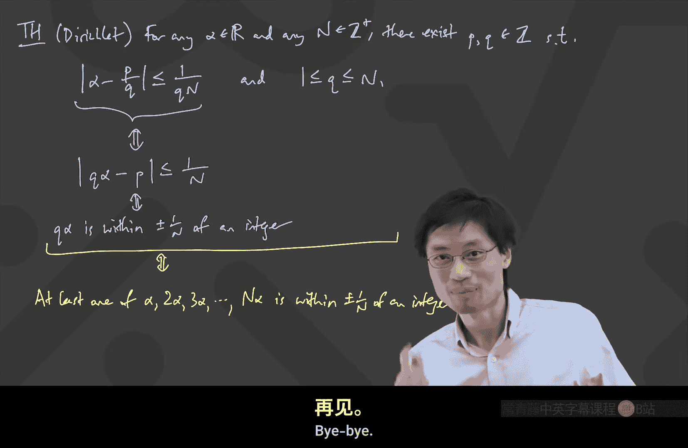

# 卡耐基梅隆【中英⚡离散数学｜21-228 2023, Discrete Mathematics】 p04 P4 -BV1sFibBkEj7_p4-

According in。Hello， everyone。Just a second。Hope that everyone had a good weekend。

What is the weekend like nowadays at C U， Our people actually I a little bit curious。

 Are most people here on campus or。😊，Are people on campus or not on I don't know if up means on campus or not。

 but like are people on campus。Yeah， so what's the weekend like， Are you guys。

 Are you guys supposed to be I guess， isolating and keeping away from each other or is the weekend like people talk to each other。

あ。こしててで。Okay， so theres still some semblance of college life。Okay， just a second。

 I'm just starting my own recording over here。🎼Oh yeah。 thanks for thanks for that reminder。 Yes。

 actually I should also say I have to apologize I'm going to have to leave approximately two or three minutes before the end of class。

 which is probably an okay thing since we have been on average going after the end of class by two or three minutes。

 but that's because I'm giving a Stanford a seminar at Stanford on NoVd like right right when class is supposed to end。

😊，So。Yeah， if you， if you are leaving， if you are living on campus。

 do do consider downloading this NoviD app。 it's what we've made。 It's。

 it's actually the future of being able to protect people from getting sick。 And I can。

 I can go more。 I can go on more about that in another time。 but ultimately。

 it's very related to this class in that it uses discrete mathematics to go and help solve a real problem。

😊。

Okay。Great， so， oh， that's a very ugly black background here。 just a second。

So I was actually preparing to a gun。

Give that talk。 So I was making some adjustments， but now we can go。Okay， right。

 so if you've noticed the homework problems are already up。

 I've already put the homework problems on the website。

 and you may notice that we're now into this like every two weeks type of thing。

 I generally don't like to give a whole ton of homework problems。

 I like to give interesting problems。 And you may notice there aren't that many of them。

 only about five of them。 But the previous experience of people who have taken this class is that even though there are only five questions in two weeks。

 They take a while to think about。 So it's highly recommended not to start thinking about them only like Thursday。

😊，Or or Friday morning。 So do do consider doing it earlier and also try to find other people in this class to talk to。

 you'll have a much easier time learning about this material if you discuss the questions together。😊。

All right。 Well， the topic that we're going to move on to this week is inspired by the following observation。

😊，So。22 over 7。Is a special number。What's that， That's， I actually know what that is。

 I know what that is，3。142859 and repeating and on， on on not。So 1，4，2，8，5，9。Okay。

 so that's 22 over 7。 And and the significance of this， by the way， is that pi。 pi is nice。

Pi is equal to 3。1415，92，6， something。That's all I know， because that's my phone number。 I。

 I decided to get a phone number， which was 8，4，4。 And then this 3，1，4，1，5，9。 Actually。

 there's a funny story。 The phone number is 8，4，4，3，1，4，1，5，9，3， because you have to round。

 But if you dial the two， you get my fax number。 So it's all okay。😊，Anyway。

 so so that's that's all the digits of pie that I know。 But when I was in school。

 I think I stopped at 3。14159， and I didn't memorize any beyond that。Actually， this's a very fun。

 another fun approximation to pie。I remember it like this，1，1，3，3，5，5。And， of course。

 what this means is this is 355 divided by 113。Yeah， it's just， it's just written as a。

 as a funny fraction。 So I can see 1，1，3，3 and 5，5。

 And what this is is approximately I need to pull up my calculator。 Hang on。 Oh。

 somebody might have done it already。 That's even easier。😊，Okay， somebody asked me。

 are we talking about continued fractions today， Nope， you'll find out it's always a surprise。 So。

 so let's go and figure out what is this 355 divided by 113。😊，Oops， that's not the calculator。

 Here we go。3，55， divided by 1，1，3 equals 3。14。1，5。9，2，9。So that's， that's quite impressive， right。

 Like this is， this is pretty close to pie。 Actually。

 what makes you so impressed by these kinds of approximations is that。😊，They're not that complicated。

 Actually， this 1，1，3，3，5，5 thing is just beautiful。 Once you have seen this once。

 you'll never forget it。 This 1，1，3，3，5，5 split it with a back slash。 Okay。

 but there's something much less exciting。😊，I could have told you that did you know that 3，1，4，1，5，9。

2，6， divided by1，0，0，0，0，0，0，0。3。14，15，9，2，6。So why is this significantly less exciting than the others。

What's your notion of excitingness？ I'm trying to motivate this。

You can type R H or raise hand or something。 Oh， good。 Oh， well。

 people have something small denominators。 I see it。 And， and in the future。

 I'll go and call for like， raising hands， so。😊，The interesting thing here is like this one here。

 The last one is like， well， of course， you can approximate pi to that many digits。

 If you just put a ginormous denominator， this is like。😊，Easy。But then this。1，1，3，3，5，5。

It's kind of impressive。 You know， like， how many digits of precision did I get。

 That's how I'm thinking of it Here， my denominator used like， what is it， if I could count。7 zeros。

 right？ I used 7 zeros here。In my denominator， and I got seven digits of precision after the decimal。

Right， so here。My denominator。Used7 zeros。And。Im， I want to say it used 7 digits。

 It really used 8 digits。 but that one， that's just like because it just tipped over from the 9，9，9。

9，9，9。 If you know what I mean， like one with 7 zeros might as well be a 7 digit number。

 It's just barely an8 digit number， barely qualifies。

 So I'm saying the dominant denominator used 7 zeros， but got。😊，Somehow and actually。

 let me let me emphasize that。 this is like about seven digits。Since the one is like silly。

 It's just like one more than a seven digit number， but it got 7 decimal places。

Whereas if you go and look at this 1，1，3，3，5，5 business， the 1，1，3，3，5，5 business。

 it's actually pretty good all the way out to there。 Does that make sense。

 It's like my denominator is this 1，1，3， really just like 2 or three digits of denominator。

 And suddenly， I got this insane number， like 6 digits of precision up there。😊。

So I'm getting more than I deserve is how you should think of this。So here we got about two digits。

And denominator。But。😊，6 digits of precision。Okay， so effectively。

 what we are saying here is that these are somehow nice approximations。

And the theorem I want to talk about today will'll get as far as we can through the proof is a theorem which talks about approximating numbers using fractions。

I will start by stating a trivial theory。Okay。So， the first theorem。Its a。I'll call it easy。

 This is going to be the easy theorem， which says， and I we're gonna see the way we write math in this class。

 is that for any。Real number。Okay， I'm already gonna write it like this。A lot of people here。

 I think， have taken concepts。This means for any number， alpha is a number。 R is a real number。

 So this is reals。Right， so for any real number。And also。

 for any choice of for any choice of denominator。Any， let's just call it denominator， N。

 any integer N。 Oh， N looks like the natural numbers。 I'll call it this way。 any N。Which is in。

 I'll write it this way。 Z plus， there is never any confusion on whether z plus includes 0 or not。

 because 0 is not a positive number。 If I write the capital N， depending on what country you're in。

 some people think that the capital N include 0， and some people think it doesn't。

 So I always use the Z plus， these are positive integers。There exists。There exist integers， PNQ。

So I'm writing P Q and Z。 These there exist some integer P and Q， so that。

What I'll say is this P over Q is really close to alpha。

I'm going to write it in an absolute value way， because that's how it's usually written。

 But I want to parse it slowly。😊，Alpha minus P over  Q is less than or equal to one over  Q。

And I also want one more thing because I haven't used the capital N。And Q。Well。

 Q is between one and a。Okay， let's go and stare at this。 Whenever I was learning math。

 it was always hard for me to understand what the theorem is saying。

So what are we really trying to do， We're trying to find there some way to approximate。

An arbitrary real number by some kind of a rational number。 That's what P over Q is。

 The meaning of P And Q being integers is just that P over Q is a fraction。And I'm supposed to be。

Approximating， so P over is very close to alpha， and my distance between them is like less than one over。

Right。And the only thing is I I also wanted to say that my cue。My， my cu is in some range。 We。

 we' see， we'll see this appear。 We'll see this thing appear later soon。So。As written right now。

This is， this is actually relatively easy to prove。We're just trying to prove。 And， in fact。

 we don't even need all of the conditions。 In some sense， we don't even need to let Q have choice。

 We could even let Q be capital N。And I I'm doing this because I want to talk through how mathematical logic works。

The proof。If I want to prove a statement like this that there exists a P and a Q。

 I just need to go and show you how it would make the P and how I would make the Q。

Somebody has said something。 Wait， Eric John， what do you want me to wait for。Yeah yeah。

 this is easy。 So so， so so this is good。 What you're saying is wait， Oh， that's why you said， wait。

 let me just like draw a number line and take a look at this thing。Here's a number line。

I get to choose。 It says there exists P and Q。 I get to choose my P and Q。

 I'm going to use Q equals n。 Okay， and that's going to for sure， make this happen。In some sense。

 actually， this is very easy to。 You know what it's too easy because I could also say Q equals1。

 Well， actually， it works for every Q。 works for every Q。 But this was just easy。

 This is not the main point of what we're doing today anyway。 But the proof is， we'll get。This。Using。

Q equals n。Alright， And I just need to show that there's a P somewhere。

 So if I want to get this with Q equals n， well， somewhere， somewhere is this alpha。

Epha is somewhere。 But the good news is that this， this number line。

 this number line has all these random fractions over， over Q， over over this n， over this n。😊。

For example， maybe over here， maybe this is3 over n。And maybe this is four over that。

And then we got things equally spaced。 This might be5 over N。

And then there's something else over here，6 over n。7 over n and so on。

 I'm just emphasizing that this number line has equally spaced stuff。

 And what you have just said is hang on a second。 The alpha sits inside an interval whose width is one over n。

Alpha is somewhere。And this interval has a width。Run over N。

And so how do I know that I can choose a suitable P， I just choose the P。

 which is like the the closest over n to the alpha。And my distance between the P over Q。

 P over n and this alpha is going to be less than the width of that interval。Yeah。

 and I could do even better。 You're right。 I could。 I could be more fancy。

 and I could do one over 2 Q， but I'm not going to because I want to twist the statement into something more complicated。

So here the claim is， well。No。Alpha is in one of the intervals。Pick。Pi。To be。The numerator。

Of the nearest。Endpoint。Of that interval。Okay， and then if I do this。

 then this P over N P over Q is going to be close enough。Because this one over Q。

 that was one over n。Then this P over n is within。Plus， or minus-1 over n。Of alpha。

 And that's actually all you need for this proof。Before I go on， I just want to pause。

 Are there any questions。 This is the first， I guess。

 proof type thing we've been doing in this class。 So we're going to see more and more proofs， too。

Any questions on how this one， right。Whenever you are given stuff and you want to prove that something exists。

 you win as soon as you find those things that exist and show that they satisfy the conditions that you want。

So this one was too easy。 We didn't have to do much。Oh， question。 Is there a name for the theorem。

 That is a good question。I， I don't know。 I， I， I， I call it almost like。

Common sense or like the easy theorem by Professor Ey or something。 I don't know。

 It's just like it's it'， it' it's not。 It doesn't deserve to be really called a theorem。 It's。

 it's just a fact。 But I wanted to go and twist it。

So it turns out that what we had found out earlier with these approximations of pi。

 they were much more exciting than this。 In fact， this is my dumb approximation for pi。

 My dumb approximation for pi was， oh， just choose any denominator and get as close as you can on the numerator。

 But what was interesting about the other ones。 was that the denominators were carefully chosen。😊。

So there's a more fancy theorem。So here's a more fancy theorem。 I'm going to attribute it to Deishle。

I'm actually going to write down two equivalent statements that are both due to Deishle。

 actually not two equivalent statements， one and another one which is stronger。

 but this is the one that I often think of in my head。It starts off very similar。For any。Real number。

 alpha。Okay， and again， I'm going to have some integer N and any positive integer N。And any。

Capital N， which is in Z plus。Now， I'm going to show that。 there exists。Oh， actually。

 I don't want to put the n yet。 I'm going to say it the way I often think of it for any alpha。 Okay。

 let's not put that capital N yet。 That's you're getting a preview of something I'm going to use soon。

 which is a more powerful version。 But for any alpha， which is a real number。

 I'll write that there are infinitely many。😊，Wiz。To approximate。Alpha。Using P And Q。

 which are integers。Such that。 Oh my gosh。 I almost wrote S dot T dot。 I guess I'll just do that now。

 I'll teach everyone this。 you guys might have seen this before。

 This stands for such that it just happened so much in math that we are used to calling it S dot T dot。

😊，This says such that。Okay。Such that。If I write the distance between alpha and P over Q。

This is at most1 over Q squared。Okay， now this gets harder。You can't do this the same way as before。

 before， when we wanted to show that there's some way to choose the appropriate numerator。 Well。

 that was easy。 You just went and found the closest numerator。

 and you wouldn't make a mistake by more than one over Q。

 But now you need to go by one over Q squared。 And put that one over Q squared is smaller than one over Q。

😊，So just like if you're trying to take in the meaning of this， this is harder。

Since one over Q squared is smaller。Zan。1 over Q。Okay。And this one says infinitely many ways。

 That's why it's interesting in some sense。 It's that I can keep， I can keep doing this。 Oh。

 question question。 I this for any P Q。 No， no， no， no， I have to have P Q， which are integers。

 If I'm allowed to make P And Q be real numbers。 I can do it very easily。 I can be like， well。

 P is alpha and Q is 1。 bam on the nose。 And then P is two alpha and Q is 2。 bam on the nose again。

 I got infinitely many。 any integers， Yes， that's correct。 So， so what this is saying is， you know。😊。

There are infinitely many ways to find very satisfying approximations。😊，Oh， wait。 out of it， says no。

 that means I must have made a mistake。 What's， what's wrong out of it。No's like think that。Oh， yeah。

 Thank you very much。 Thank you very much。 So， so let's， let's clarify that。 It's like， yeah。

 if you just chose like random P And Q， it just won't work。

 That won't be an approximation of your alpha。 But what this is saying is there's infinitely many ways to do the pie like thing。

😊，Right， it's like pi。 We got 22 over 7， and we were happy。 We got 3，5，5 over 1，1，3。

 and we got happy。 And this statement is saying you can be happy all like infinitely many times in a sense that it's like better than you expected with this one over  Q squared。

😊，Wait， no， not that。 Is that still referring to something I said。No problem。

 And I see somebody else has posted。Yes， there are infinitely many P And Q that satisfy this inequality。

 It's very important to me that you ask these kinds of questions。

 because understanding the statement is the first step。Okay。So。That's， that's quite satisfy。

 And another thing that you might wonder is， well， okay， maybe Deishle is right。

 We're gonna to prove this。 But what if derile was lazy。

 Is it true that I can do this with like one over Q cubed。 It turns out that you can't actually。

 this statement is not true。 if you try to replace the squared with a cubed。 In fact。

 that the squared is the best exponent you can write。😊，So it's actually very satisfying。

 We're not going to prove that part here， but I'll just read it as a comment。Remark。Well。

A remark is that you actually can't。Prove this。For a higher。Exponent。Zan。2。

Mathematicians like these best possible statements。

 it's like what we like to say is that's the best thing you could ever have and we can prove that also。

Is it true for finitely many P Q with better bounds。 Oh， that's a good question。 Well。

 what I'd say there is it probably depends on what the alpha is。 So let's thus parse this carefully。

 The first part of it says for any alpha in real。Right， so if it starts off by saying for any alpha。

 which is real。Then。There might be some alphas that are very easy to approximate。

 Like if alpha happens to be a whole number， then there's a really easy way to get on the nose with rational numbers every single time。

 And then there are other choices for alpha， which are harder to approximate and so on。

Did that help answer the question。Okay， so， so let's let's go and。

 let' go and attack this thing well。In order to prove this statement。

 it turns out that it's useful to go at this by proving a different looking statement。

 which has that capital N in it and that different looking statement is going to imply this one。Okay。

So there's another theorem。 Sometimes the other theorem is called deishlace theorem。

But I'm just gonna attribute it to deishle。 Okay， we're going to。

 we're actually going to prove the green theem。 This is stronger。 And what we'll show is， well。

 what the statement is， is for any。Alpha， which is a real number。And。Any capital N。

 which is a positive in。Now， what we're going to show is that there is one。 Well。

 there's at least one。There exists。Integer case， it's one choice of Q。

 but I'll call it there exist integers P and Q。Such that。

What we're going to get now is we're going to say the distance between alpha and P over Q。

Is less than equal to one over Q times n。And now we need to say something about the Q。

 Q is between one and n。So this should resemble the easy theorem that we had before。 In fact。

 the only difference between the easy theorem that we had before and this theorem is that there's an extra n factor down there。

That's actually right by。 I wrote the easy theorem in this exact language。

 It's just that now I have an extra。 and I'm asking for more。Okay。

Let's understand why the green theorem implies the yellow theorem。So I， I'm。

 I my claim is if we can prove the green， then we get the yellow。Okay。

 and then that will mean that the goal of the game is to prove the green。 Oh， out of it。Oh， okay。

 hang on。 Let me， let me first write down what we're gonna claim， what we're gonna do。

 We're gonna show。That the green theorem。In flies。The yellow here。

What that means is if I knew the green theorem was true。

 I can prove the other theorem and eevte what are you're saying。我 over。O。Replace that。

So let's do that first part， and then we'll get someone else to help with the second part。

 The first part is， wait， I see1 over Q N， and I'm supposed to find something with one over Q squared。

 That's exactly why it's so useful that the Q is less than or equal to n。😊，Alright。

 so the first part is， well， if you use。Oh， yeah。 whenever you think about proving the yellow theorem。

 it means like， okay， I'm given an alpha in a rail。 I'm given a real alpha。

 I'm supposed to approximate this thing somehow。Okay。And the first thing is to notice， Well， I'。

 I'll put it this way。 Notice that if。The Q is less than or or to n。 Actually。

 I won't use the word if because it's true。 I'll call it since。Since。

The Q is less than or equal to n。If I have。Something。Less than equal to one over Q times n。Then。

 it is also。Less than or equal to one over Q times Q。Did that make sense to people。

 The way you think of this is like one over 100 is less than or equal to one over 5。

If you take a denominator and you make the denominator smaller， you're sharing among less stuff。

 And so because the Q is actually smaller than the n， that's why I use a big capital n looks big。

 If youre replace by a smaller denominator， then the answer is bigger。

Why did I call that just the first part？ Well， it's because I want to prove the yellow theorem to prove the yellow theorem。

 I can't get away with just showing one of them。 Yes， Subbassh， you're right。 I need infinitely many。

 So so far， what I'm saying is， you know， if I knew the green theorem。

I can use the green theorem on the alpha I got to prove the yellow theorem， and I'll get like。😊。

One choice of P And Q。Which satisfy the requirement that it's like less than a equal to 1 over  Q squared。

 because if it was less than or equal to 1 over a Q N， it is less than equal to1 over  Q squared。

But then the question becomes， okay， I got one。I'm supposed to get infinitely， many。

How do you turn this into infinitely many， This is slightly more complicated， but not too bad。嗯。

Does the green theorem。Hold for every N。 Oh， yes。 There's an important thing here。

 The green theorem says for any alpha in rails and any n， which is a positive integer。

 Then I can do this。 What that's suggesting is I want to invoke the green theorem a lot of times。😊。

Yeah， because I'm trying to prove the yellow theorem， the way mathematical logic works。

 If I'm staring at the yellow theorem， then I'm saying I've got my alpha sitting in front of me。No。

I have this green thing。 I can use the same alpha， and I can jam it with as many ends as I want。

 What might I want to do， Thomas， why don't you give us a go。Yeah， I was thinking like。You're like。

We就。呃关是。そ？So what you're saying starts with the key idea， which is that， look。

 n is a positive integer， how many positive intetures are there， infinitely many。

 so I can go and hit the I can punch this button on the green theorem infinitely many times every time I punch the button on the green theorem out pops a P and a Q。

😊，I punched it infinitely many times。 Am I not done。 Well there's one thing to be slightly careful。

 The only thing to worry about is if you punch it infinitely many times by punching it means like。

 I'm imagining it like a machine， I put a different n in。 I get a different P and Q。 Oh。

 but I don't always get different P's and Qs。😊，The one weird thing that could happen is what if you press and you keep putting in different ends and after a while。

 you just get back the same P's and Qs and you never get anything new。

Do you see that's the only case I need to get around， That's what I want to emphasize。

 I can invoke green theorem infinitely many times。 The only bad thing is if somehow。

 somehow I only get a finite number of P's and Qs。 I'm going to write that down。Next。4。A fixed。Alpha。

Invoke。The green。For every。Pas defend and。You get infinitely many P and Q fractions。Well。

 infinitely many outputs。 But the question is， how do I know that there aren't only finite many of them。

Infinitely。Many P over Q approximations。Maybe。R。Repeat。And the maybe with repeats is the problem。

 So how do I know， And I see that there are some people Subashi。 what's， what's your idea。嗯。先生かほけ。O。

So that's a good angle of thinking of it。 It's like， you see， if I look at this theorem。

 if you look at the green theorem， the bigger the N is， the more special the approximation is。😊。

Because one over Q N gets more extreme。Okay， it's like if I， if I plugged in an n of one。

 then it's like the old the the trivial theorem。 If I plug in an n of 50 million。

 then I have to be really lucky。 It has to be very。

 very close to it has to be like with one over Q times 50 million。 Okay。

 there is one little thing that can be helpful that we have to do first， actually。

 on this question on this piece。😊，To show that， you know， you。

 you don't die with all of these repeats， it's actually useful to know that we should deal with the case where Al is rational。

 differently from when alpha is irrational。 That would be useful for us。 Okay。

 because if alpha is rational。 I see somebody has a Thomas also said something like that， right。

 It's like somehow， if Al is rational。 It's possible that P over Q keeps coming out at 22 over 7 every time。

 That's actually a a totally the legitimate way in which it could always be giving me 22 over 7 because it's on the dot。

😊，Alright， so I actually want to split some cases。 I'm going to go into the next page， now。If alpha。

Well， let me， let me just write the word now。 So you kind of know it's continuing。

 continuing the proof now。If alpha is actually rational， cu for quotient， I guess。

This is the way we write rational。 If Q is， if alpha is rational， sorry， yeah， if alpha is rational。

Then I don't need any theorem to prove this。 Then it's like trivial。 If， if author is rational。

 I'll give you infinitely many P's and Qes。I'll just like use the fraction for alpha。

 and then I'll double the numerator and denominator and so on。 right， then the theorem。

The yellow theorem， we're proving the yellow theorem。Is easily true。Just use the fraction。For alpha。

And then like double the numerator denominator， triple the numerator denominator， and so on。

And I'll write it like this。 This is how you often write a math proof， say A over B。And then。Use。

A over B。2， a over 2 B。3 a over 3， B and so on。 That's infinitely many on the dot。So in that case。

 I just have one case lab。 It's like， what if the last case is alpha is irrational。

 How could it be that when I keep invoking the green theorem， I only get a finite number of outputs。

 Subbashi has one way of arguing this。 I have another way。

 which might be a little bit easier for people to see。Last case。If alpha is irrational。Why can't。Wei。

Just have。Fly。Many P over cu approximations。Come out。Of the green the。Once I answer that question。

 we're done。Okay。And over here， it's like if I have this finitely many。

 why can't we have this finitely many， well， this is the easiest way to prove something like this is by contradiction。

 So in some sense， today's class， we're talking about different proof techniques。

 we're now moving into proof by contradiction。😊，And I know that there are different ways。

 Subbashi had something that wasn't by contradiction as much as just like。

 I'll construct the next the next value of n to use。

 I'm going to use a contradiction thing just because I want to talk about proof techniques。

 So we can do this by proof by contradiction。Proof。Of this last case。By contradiction。

What we'll do is， let's assume for the sake of contradiction。I just， assume for contradiction。

That there are only finitely many。P over Q， coming out。Now。

 it's useful to think what the number line looks like。So I'll draw a number line。And again。

 what Sebashir said said would work。 But I'm just putting this thing here。

 I find this is quite easy to understand。 Alpha lives somewhere。 Alpha lives somewhere。And now。

 if there's only finitely many fractions that are coming out。Then， you know。

 there's like only three of them or 50 million of them。 but it's finite。 and they live somewhere。

 They're sitting somewhere here。 These are all of the approximations。This is。

One of the P over Q approximation。1 P over approximation， here' is another one。

And they're all living there somewhere。Another。But there's only finitely many。Now。

 if there's finitely many dots， only finitely many yellow dots。

And there's only finitely many yellow dots。One of them is going to be the closest。

That's actually how this is working。 this is actually an idea from analysis， In fact。

 But I was just say there's only finite many yellow dots。 Well， one of them is the closest to alpha。

 There's the closest one。 If there are infinitely many yellow dots， by the way。

 there might not be a closest one。As an example， if I take all of the fractions，1 over 1，1 over 2。

1 over 3，1 over 4， and so on。 and I ask which is the closest to 0。

There is no closest because there are infinitely many， and they keep getting closer， Sir。Okay。

 but when I find that the money， one of them is the closest。 only finitely money。So。1 is the closest。

HLet's go and stare at that one。Can someone help me figure out a way to get a contradiction out of this。

Out of it。行。Since that's like the closest one， you know it has to work。嗯再见。Take go位。

And you take like， I don't know， go limit or whatever。た本？Alpha and D over and。Oh。

 this is a great way of putting it。 Okay， so actually。

 there was an important thing that I just missed that I forgot to say。

 It's like all these yellow dots。 None of them lives on alpha。 If one of them was sitting on alpha。

 the closest is distance 0， but it's very important since alpha is irrational。

 All of these yellow dots， they miss alpha。 There's some gap。 Okay， Only finite many yellow dots。😊。

None。Equals to alpha。 Okay， so there's this other thing here。 And that means there's some gap here。

And what Adoavit just said is that in our inequality。

 we were trying to show that the alpha and this fraction were really close together。

We were trying to show that alpha and the fraction were within like one over Q N。

 And he was observing that as my n， as my rule on n gets more and more intense。

 it's supposed to be like tighter and tighter approximation。So if you go and look at this， it's like。

 well， I did infinitely many times。 I've got this big old gap。 Well， there is a choice of n。

 There is a way to pick n so that one over n is actually smaller than this gap。

Because as n gets bigger， I mean， one over n gets smaller。 So the important thing is。Eventually。

 or there exists。A choice。Of N。Where。1 over n。Is smaller than the gap。And that's the contradiction。

 because then you say， I invoke the green theorem with that choice of n。

 And when I invoke the green theorem with that choice of n， I'm supposed to get a P over Q。

 I'm supposed to get a yellow dot。And the yellow dot is supposed to have a distance from my alpha of less than or equal to1 over Q times that。

And one over Q times n is actually even smaller than one over N。

Trying to think of how I can write this down so that people can see。 So it's smaller than gap。

And that implies。That。1 over Q times N is even smaller。Okay， this one over Q， the Q here。

 I'm not super happy about writing just this Q here because the Q pops out of an invocation of the green theorem。

 So there's not really like a global variable Q。 if that makes sense。

 The Q is coming out of the Q over Q。😊，But what is is emphasizing here is， look， at some point。

 you ran the green theorem with a value of n where one over n would be that little thing。

 And what came out was supposed to be a cu where your fraction is actually even closer than that。

 And it's not because that was the closest one。I'm gonna to pause here。

 Did this make sense to people。Because this was like a proof。 It was not a calculation。

If you have any questions， feel free to slow me down。Okay。Then what can we do with this。 So now。

 now this is all showing us that this green theorem is the powerful  one we want to go for。

We want to prove the green theory。 So this means that somehow I need to go and show that this。

What does this mean，1 over a Q N。 it looks a little funny when you look at it。 So let's。

 let's now start translating this green theorem into something that might be closer to what we could possibly prove。

😊，I claim it's it's a little bit weird because there's a。

 there's a cu there and there's also a cu there。 Okay。

 so I think what we'll do to finish this class is to translate this theorem into another problem into another theorem。

 which is equivalent。 And what we'll do next time is we'll actually prove that other theorem。😊。

And you're probably wondering where all the combators is。

 And that's actually going to come from the proof of the next tier。So if I stare at this thing。

 I'm going to rewrite deish Lathereorem onto another screen， and then we'll write an equivalent form。

The green theory。So， this green one。The richla theor is for any。Real number alpha。And any。Capital N。

 which is a positive integer。There exist。P and Q， which are integers。Oh I。

 I always write S dot T dot such that。I'll write this，Alpha minus P over Q。

This gap is less than or equal to1 over Q N。And one is between Q is between n。Okay。

And what I'm going to write for the equivalence， I'll actually write it stacked right on top of here。

This。Is an equivalent formulation， too。Q alpha， minus P。Less than or equal to one over capital land。

Is that okay。I claimed that what we were trying to prove is green theorem。

 We will get the green theorem if we can just show that there is a way to choose Q so that Q alpha。

Minus P。It's less than or equal to1 over at。All that happened。 Oh， yeah。 And also this。

 this previous thing stays。 And this one less than equal to Q， less than equal to n。Okay。

So that that's just this。 I'm just writing this particular part is equivalent to that other particular part。

What's the value of this， Well， the value of this is because it says P is arbitrary。 Oh， Thomas。

 do you have something you want to add。It just reminds me of the。而证明。こ。喂。Exactly。協はください。

Like integer margin。Got it clip like multiply the real number。こ toな。Okay， that's what I wanted。

 I wanted to translate this into some kind of meaning。 You see， because what's going on here。

 It says there exists a P， any integer P。 If you're thinking about trying to make this， If you said。

 I want to try this with Q equals 50 and you put it there。 Which P should you choose。

 You should just choose the closest integer to Q alpha。😊，What I claim is that this purple thing。

Is equivalent to the sentence that Q alpha。Is。Within。Plus or minus1 over n of an integer。Okay。

 and with that， I'm going to put everything together。 this whole green thing。

 All it's saying is that。One of the following numbers is within plus -1 over and of an integer。

So I'll write， it's equivalently。Now， I equivalent the the whole thing。 all of this。Is equivalent。

 too。At least one of。Q ranges from one to n。 So alpha 2 alpha。3 alpha dot， dot。

 dot capital on capital N alpha is within。Plus， or -1 over n。Of an integer。

That feels very satisfying。 Okay， this， this statement， there's no inequalities， no absolute values。

 We're just saying that。For any。Real number。And any number capital N that I'm willing to consider multiples of that real number by。

 Then if I just look at the alpha， the two alpha， the three alpha all the way to the n alpha。

 one of them is within one over n of an integer。 Why is this satisfying， It's satisfying because。😊。

As your capital N gets bigger， you sort of have more shots。 Does that make sense。

 You've got like more shots to be close to an integer。Okay， and in return。

 you better get closer to that integer。So that's the statement I want to leave with for today。

 I have to run and give a talk at Stanford now， but we will continue from this point next time。

 and then you will discover what this has to do with coviators。😊。

So I'll see you all in the next class。 Take care， bye bye。

Y。