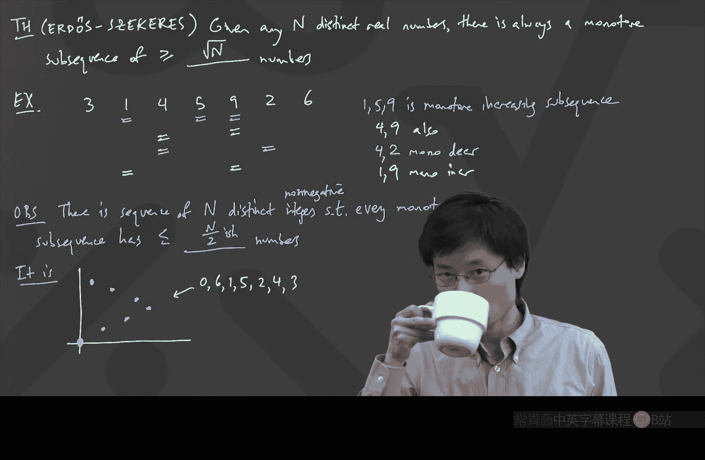

# 卡耐基梅隆【中英⚡离散数学｜21-228 2023, Discrete Mathematics】 p05 P5 -BV1sFibBkEj7_p5-

According in。he啊，佢湾。Hello。Is it Wednesday now， Yeah， it's Wednesday now。 Good to see you。

I don't know if everyone's here yet。 It's my， my screen's only able to show the 25 people who join first。

I guess that's sort of a delegates to going into a classroom。

 It just occurred to me that the way to get a front row seat is to show up first。 I go。

 although I guess it doesn't really matter。 Oh， it's so funny。 So， but I'm talking about this。😊。

Usually when you think about it， the front row seat is like。

 then you guys can see the teacher or the professor。 But from the point of view of teaching。

 the front row is like how we can see who is like responding the most。 So it's just funny。 for me。

 the front row seat are the people that I see that I see first。

 So I guess I'm used to thinking of it from the other perspective。😊，What platform are you on。

 Gallery view， Yeah yeah， I want some gallery view。 Actually。

 I haven't figured out yet whether it's possible to spread the gallery view over multiple monitors。

 Actually， Is that possible， Does anyone know。If you have like two screens。

 can you have the gallery view go across two screens。Maybe someone多 tell。Make the window really big。

 What do you mean， It's like the full screen。Yeah， yeah。 So so it's like。

 it's the full screen right now。 I can see 25 people。 But from this。

 from this place I'm streaming from， I have gigabit Internet。 So there's no reason not to just like。

 see everyone that I can do a better job teaching。😊，房子 other。

So that's what I would do on Google Hangouts because Google Hangouts doesn't limit the number of times you can go and see it。

 Zoom for me has somehow， if I log in on Zoom on another instance， it says you're already logged in。

You can。 Okay， then I need to try this。 I need to try this because that would be， that would be。

 that would be neat。 Okay， cool， well， hopefully， by now， people are here。

 So let's continue and start talking about the class。 So where were we last time。

 Well we were talking about this deishly approximation theorem。 So let me see。 Let me go to this。😊。

Then I can do some drawing。 Oh， I see。 I was just giving a talk somewhere else。

 So I had my screen with。

Some filters。 Let's put that back。O。Right， so we were doing this deish lay approximation here。

 And let's just remember again， what was the the cool fact that we are that we're going to prove。

 I'm going to write down one of the facts。 and then I'll write down the stronger fact just to put us all in the same memory space as we were last time。

😊，So there was this deishleythereorem。And what this said is。

 if you had any real number for any real number。Alpha。

There exists infinitely many ways to approximate this with a fraction。There exist。Infinitely。Many。

P Q choices， which are integers。Such that。If I look at the distance between alpha and this fraction P over Q。

This is less than or equal to one over Q squared。So that was cool。

 that was like we can approximate numbers pretty darn well and we can do it a lot of times。

 we can always approximate the number with like more and more of these fractions that get bigger and bigger denominators and they have errors that get smaller and smaller。

😊，And the route towards doing this， we showed that there's a stronger theorem。

Which I also attributed Deishly。Which says that for any real number。

 there's not and and for any capital N now。So， for any。Real number。And any。Capital N。

 which is a positive integer。There exists。P and Q， which are integers。Such that。Now。

 we have two conditions。 One is that this。Can I fit it all on one slide， on one screen。

 now'll put on next slide， Such that the distance between alpha and P over Q。

This is at most1 over Q times n。And the Q is between one。And at。Okay， and we。

 we showed why this second green theorem implied the yellow theorem。

 That was what we did one of the things we did last time。

And then what we did right before the end is we translated this green theorem into another theorem。

Which I guess I can write。 Well， not another the。 I， this entire condition。Got translated into。

Same as does anyone remember what it was， It was like almost like English phrase。

Just type raise hand or somethings faster than typing the whole thing in。Zhijiia。

I just realized that I have my audio so I can't hear you just a second， not your fault。

 not your fault。Wait a second。 No， I should be able to hear you。A， okay， okay， okay， very good。Great。

 one of one alpha。2， alpha。3 alpha all the way to n alpha is within。Plus。

 or minus1 over n of an integer。O。Now， quick question。It has one alpha all the way to n alpha。

What if had0 alpha。Would it be easy to prove if I had0 alpha as an option。Well， yes， I well， I mean。

 it's not the equivalent， but like0 alpha is an in， no matter what。 So if you're wondering， like。

 what is this one alpha up to n alpha， it's quite nice。 It's like。😊，Don't start with 0 alpha。

 that's dumb。 But from like the one alpha and keep going up to n of them。

 then like one of them is within one over n of an integer。 Okay， so now how do we prove this。 Well。

 so far it might have looked like all we're talking about is like number theory or real numbers or something。

 But it turns out that the heart of this proof。 uses combatorics。 and ate wants to say a comment。😊。

Yeah。There's an idea。 I have no idea how。えピさん。設て順の。O。I have to define the pigeonhole principle。 Okay。

 Pieon hole。 How do you spell。Viision hole。 Piionhole， principle。So， by the way。

 pigeonhole principle does not have a D in pigeon。 That's a pigeon English or something， right。

 But so， so this is pigeon with a P， I G E O N。 Pieonhole principle is very easy to state。

 It says if you have。And pigeons。And n plus  one holes。Then。Some pigeon。Has。More than one hole。

It's true。 I mean， I'm sure， I'm sure that everyone is used to thinking of it in a slightly different way of usually it's like。

 you have n pigeons and n -1 holes。 Then one hole has at least two pigeons in it but its equivalent。

 Okay， but the， the， the bottom line is that it's like too much stuff to fit in too little space。Now。

 this turns out to be the fundamental idea here。 Braden， you were going to say something too。や。Okay。

Pigonhole pigeonhole。 So how can we get some pigeonhole principle here。

 I always just think of pigeonhole principle。 like all this fancy words is just like too much stuff。

For too little space。Okay， that's how I always think of the pigeonhole principle。

 So then I have to think about stuff and space。 And actually， it's funny。

 A lot of people say things like I have this many pigeons， I have this many holes。

 What are the holes and what are the pigeons。 The way we're gonna to do it here is I have these numbers。

1 alpha 2 alpha up to an alpha。 Well， if we're talking about distance from an integer。

 A very natural thing to do is actually to draw the number line as a circle。😊，Okay。

 and this is like a fun idea。So you can actually think of the numbers， draw the numbers like on a。

 on a circle， like like a clock。 Okay， we can。Draw the number line。As a circle。

And sometimes people might even think of this with notation as R slash Z。

 The way you pronounce the slash is。Mud。So this is like somehow some people sometimes think of it。

 It's like you might see it somewhere in math， like R modd Z。

 and what that means is it's the real numbers where all of the integers are identified。

 like all the integers are the same somehow。😊，And the way this looks is you have a circle。Okay。

And I'll think of things going clockwise。 So let's label the circle with a few numbers。

So for example， if I wanted to know where is the number。42， the number 42 is at the top right here。

The significance of 42 is its。42。0。Okay。But I can draw other numbers on this。 I could decide I。

 I might want to know where is like 7 over 2。 Well，7 over 2 is over here。

That's like what is it3 and a half， right， So it's like halfway around the circle。

 If I want to know where is pi， pi is 0。14。14 is close to 。16666。 That's 16。 So in that case。

 I think that pi lives on the circle somewhere around here。How about square root 2。

 square root 2 is 1。414 and 1。414。 maybe that's going to be 0。4ish。 So 。

5 is if I've gone all the way over to here， maybe 0。4 is somewhere there， maybe 1。414。

I'm just trying to approximately say what this looks like This。 Maybe this is square root， too。

Is my picture making sense， I'm， I'm like， I have this big circle， and I can draw my number line。

 Ohh， what's this，22 over 7。Yes。😊，Okay， yeah， yeah。 So so yeah， yeah。 right。 Pi is around 22 over 7。

 That's true。 too。 So， so， so， you know， we have all of these different numbers that we can write on this number circle。

 Alright， so why did I bother doing this， The reason I bother doing this is you can just think of your numbers as going around a circle。

 And every time you get to a full1， it goes around。 Oh， I forgot to write negative numbers。

 Let's put a negative number。 Let's put -1。25。 And I'm doing that on purpose to show that-1。

25 is here。😊，And that's because when you go minus， you know， minus is going the other way。

 it's anticlockwise and minus one full anticlockwise circle and a minus a quarter， right。

 so you can have positive numbers and you can have negative numbers on this circle。😊，Okay。

 so the next thing I want to do is I want to think about what happens if I draw the same circle。

 but I put the numbers，1 alpha 2 alpha，3 alpha up to n alpha on the circle。

So I'm going to get to a new screen。 This was just one demonstration。 New screen is now that。Dra。1。

 alpha。To alpha all the way to an alpha。On the circle。The circle， Arma Z。Okay。

So what does that look like。So if I have all of these things， these are these are numbers， actually。

 should they should satisfy some nice。Periodicness。

 So I'm going to actually write the0 alpha just because that's 0， okay。This is 0， at the very top。

It also happens to be 0 alpha， but that's not one of the numbers I'm trying to write。

 I'm trying to write1 alpha，2 alpha and so on。 Okay， so let's try to draw one alpha somewhere。

Maybe this is one alpha。Can anyone tell me geometrically if that was one alpha， If I said， oh。

 you know， if that's one alpha， this is2 alpha。 What's wrong with what I just drew。

What I just drew is bogus is obviously bogus and why Just type raise hand or something。

Raise hand out of it。Suppose we evenly spaced， right。

 Because if I'm going around the circle like a clock。When I go from 0 alpha to one alpha。

 that's there。 And going another alpha should go the same distance。 Is that clear。Like。

 because this is just like， imagine the number line。 You can't have the number 0。

 the number  one alpha。 And then suddenly， like two alpha all the way over there has to be equally spaced。

 So it is not here。Let's do undo， instead。It's not there， and so it should be sort of equally spaced。

 maybe something like this。To alpha。And then you keep going。 So there's two alpha。

 and then there's three alpha。And they're all equally spaced。Okay， now n might be huge， by the way。

 n might be like 100。So you know what's going to happen。 You're going to go all the way around。

 and you're actually going to wrap around。 Is that making sense， I going to go all the way around。

 It's not going to stop before the end of end was like 100。 It'll keep going around。Just a second。

Keep going。And you wrap。Around。Okay， now as you're wrapping around and wrapping and around and wrapping around。

 maybe at some point， I'm going to get some other things that will drop。 like as it' wrapping around。

 maybe I I'm going to use another color。 Maybe over here， I suddenly got to， I don't know，37 alpha。

Is that making sense， Like， suppose I got to 37 alpha。

 and then there should be a 38 alpha somewhere over here。The distances should all be the same。Yeah。

 so I just thought I'm gonna go around。 You may notice that actually。

 before I should have had some stuff， too。 Like if there was this 37 alpha。

 there has to be a 36 alpha before it。I'm just going to draw it here。

Does anyone notice anything geometrically that should be true。

 Like why I was so careful to put 36 alpha there， Any other fun geometric things about what we've drawn。

Just like any observation of anything being equal。一 same。Oh， oh， okay， okay， Chris。Okay。

 so you said like 2 o'clock is a little bit less。 That's true。 That's true。

 Are there any other geometric coincidences。 I'm just like looking for simple stuff。

 It doesn't have to be big stuff civic。So that。Does that make sense to people。 Yeah， so。

 so that's also true。 I mean， this is also true。 These two distances are equal。

 And why are they equal， It's because what have you done。

 You have just turned the clock back by an alpha。 Does that make sense。

 Like whatever these look like， If I just turned back the clock by alpha， Of course。

 it would look like that。This is an important observation。

So an important observation is that somehow these distances。A same。By turning back。The clock。

By alpha。O。We're getting close to a pigeonhole principle。

 except that we don't have any pigeons or holes yet in the sense that we don't have any。

Subdivision of this space。So I have here like a number circle。

And it turns out that the pigeal principle here is a bit tricky。

 It ends up being something where I will want to break the space into n parts。

 That's going to be useful。And then we're going to try to find out what happens when you have two things landing in the same part。

Actually， the0 alpha turns out to be a useful thing。 We' will leave the0 alpha。

 The way to think of this is this was a circle。Now， imagine what happens。

 I'm going to go to a new screen。 Okay， so now that we understand this piece。

 let's go to a new screen。And say。Okay。Now， we're actually going to draw。0ero alpha。As well as。1。

 alpha，2 alpha all the way to n alphapha on Arma Z。Where。It's。Split。Into intervals。Of。With。

That's ugly with one over n。I just want to write more clearly。With。1 over at。Specifically。

 let's go and draw this Arma Z this circle。So what I'm going to do is I'm going to have some。

 some intervals。 The first interval starts at 0。And it goes for one over n。So， this is 0。

And this is at one over it。Now， notice I used a square bracket， and I used an open。

 oh I just gave away what it was。 I used a round bracket in a square bracket。

 And what those mean is one is a closed end point and one is an open end point。 So the， the。

 the square bracket means including 0。😊，And the open the the the round and round bracket means that this particular interval goes from 0 and it goes up to one over n。

 but not quite。 It doesn't include one over n。 Is that all right， Like these are half open intervals。

Why I did that is I want to draw another one。The next one is going to go from closed also at one over n to2 over N。

I'm working going to do this all the way around。 I'm going to go and get。

 I'm going to go and get n intervals。Okay， so we go all the way around， get an intervals。Alright。

 I wanted to use the Pieonhole principle。And here I decided to throw all the numbers from0 alpha to an alpha into here into this picture。

The pigonal principle then guarantees for me that there is some interval。Which has。

Two of these in it。At least is that okay。Because if I look at these n plus one numbers and I have these n intervals。

 at least one interval has more than one of those numbers in it。Picionhole implies。There exists。

 Okay， I'm going to write it backwards E， we'll see that more and more in this class that just stands for there exists。

😊，There exists。An interval。With。More than。Wen。Of these N plus one numbers。Why is that relevant。

So I suppose I have an interval with more than one of these numbers。 out of。 What do you see。这完了。

Okay， let's use that。大は。Bring it in。Exactly， we want to turn back the clock。

 That's why I was giving that hint about turning back the clock， right， So you'll get something。

 And there exists this interval。 And maybe it's over here， which is what I've just drawn here。

 And maybe the two numbers that are in it。 are， you know， weird or something。

 Maybe this guy is maybe this was 7 alpha。 And maybe this thing here was。😊，I don't know。20。2， alpha。

Okay， I just made something up。 I was like， he's got these two things。

 and these two things are both in the same one over an interval。 Well。

 then what that means is now let's start turning back the clock。If you， if we。

 we just found out that these two numbers are within。1 over end of each other。

So if I turn back the clock， the distance between 6 alpha and 21 alpha is also less than one over at。

Alright， so the way this works is we got this thing。This gets。Two multiples。Of alpha。Within。

1 over n of each other。That's actually the key fact。 It's like they're both in the same interval。

 That means that their distance apart is actually strictly less than one over alpha1 over n is strictly less than one over n。

What does that mean， So it's like。For example。If it was 7 alpha。Distance to 22 alphapha。

But now the key is that's the same distance as turning back the clock。

 That's why I emphasized in the previous picture。 If you just subtract alpha from each number。

 then you have the same distance，6 alpha。2，21 alpha is the same distance。Also。

 it's actually strictly less than one over n。 I mean。

 I wrote my theorem as less than or equal to one over n， but it's actually， it's actually strict。

 You can get better。 It's it's even better if someone asks you to prove less than or equal and you prove less than。

 Well， it's also less than or equal。😊，Why is it so interesting to turn back the clock。

 Can anyone tell me how we will get to the end， The end is supposed to be that some multiple of alpha is。

Within one over end of an integer， how do you finish this proof， I turned back the clock once。Aha。

 let's get another fresh idea， Sean。Bam， turn it back。Aha until it's 0 against whatever。 Oh， no。

 if I only， I could subtract， what is this， is is the hardest set 15 alpha。 Okay。

 and it's also same distance less than one over n。 But what's 0， alpha， It's 0。Boom，0， alpha 0。

And so what you just found out is that there's some multiple of alpha。

Which is really close to an integer。Is that okay， Like 0 alpha is like right there that corresponds to integers。

So what this is telling you is actually， if I looked at this picture。

 I can draw for you in this exact picture。 Where is 15 alpha。 Oh， oh， oh， this is neat。

 In this particular picture， you're seeing an example of a negative。

 Can anyone tell me where I should draw the 15 alpha in this picture。

 I have a 7 alpha and a 22 alpha。 Where should the 15 alpha look。😊，Roughly。

 where should I draw a 15 alpha。Subashi。Exactly。This is where the 15 alpha is。

And the important thing is that these two distances。Should be the same。I'll even draw arrows。

Is that okay， It's like from the 7 alpha， you rewind the clock a little bit to go to the 22 alpha。

And then that means that from the0 alpha， you should rewind a little bit to get to the 15 alpha。

 I'm just emphasizing that where it sits， it could be to the left。

 It doesn't have to be to the right， but it's still really close to 0。

 meaning that it's really close to an integer。Okay。So what we have just found out is。So。

15 alpha is within。Plus or minus1 over n of an integer。Okay。

 so now let's look a little bit about what we're trying to prove。 Remember。

 we were trying to prove that there is always going to be some multiple of alpha from one alpha up to n alpha。

 which is within one over end of an integer。 We have to check that， you know。

 this is this is just one example。 This is just one example with some numbers like 7 and 22。

 How do I know this satisfies the conditions。If I do this procedure。

 how do I know that whenever I finish， I always will get a number， like 15。

How do you know that this number。How do you know。This。Final multiplier。

Is in the range from 12 up until capital N。That's like the only thing left that we have to explain。

Braden。他我给。B out。Brilliant， so the key is that this number。

 this 15 here is actually the difference between the two。

 That's actually why there's this counter intuitivetuitive point divided we throw 0 in there。😊。

The reason we threw0 alpha in there is just so that the differences between any number and any other number。

 the differences would range from one alpha up until an alpha。That's where 0 came in handy。 Okay。

 so yeah， the answer。Since the multiplier。Is the difference。Between。The two numbers。From。0。

1 up until N。And if I take the difference between two numbers in that range。

 I get a number from one up until then。A little bit of you should also be wondering， wait， wait。

 what if， when in the end， I find， what if in the end， I find two numbers。

 which are both in the same interval and one of the numbers is already 0 alpha。

 If one of the numbers is already 0 alpha when you start， what do you do。

Suppose your patientotal principle gave you a0 alpha and a something Subbashi。No， superbahi。Yep。

 if you get like0 alpha and something else and they're both in the same interval， you're like， well。

 okay， thanks。 the other thing is already within one over n of0。😊，And so有个。Okay。

 I want to pause here and just ask， does anyone have any questions about this proof。

 this is a fairly sophisticated proof， but actually in retrospect。

 hopefully it's not that sophisticated。In fact， if you think， okay， it looks like we're good。 Like。

 in fact， if you think about what we've done。It's a very。

 very elegant application of the pigeonhole principle。

 We started out by trying to find approximations to numbers， and we were amazed by pi。

 like 22 over 7 or 3，5，5 over 1，1，3。 And then after that。

 it was how do you go and prove that such things are possible， We had to translate it。

 just like quick a quicker overview of what we just did。 because actually， it's not that hard。

 It's just like， if you look at what weve done。 We just found out that that approximation thing。

 we turned into something with an n instead。 Okay， but the n thing instead。

 let us have a very simple English phrase。 Is it true that all the multiples of alpha。 Eventually。😊。

There's like one of them that's close enough to an integer and then the game became。

 let's draw whenever I want to know if something's close to an integer。

 you just start to draw everything onto a chart onto a circle。

 a unit circle that it keeps revolving around and rotating。😊，And then the key observation is。

 if you ever rewinded the clock by subtracting the same alpha from both of the numbers。

 then the distance between them is the same。 It's like geometry。So once you realize that。

 then it becomes， okay， let's go and pigeonhole this thing。

 go and write all of these these intervals with n intervals。

 And the only tricky part about this proof is to remember the0 alpha is useful。

 So you throw n plus1 dots into this place。😊，Quick question。 Why did I want half open intervals。

 Does anyone know why I wanted to have the first one be closed and the second one be open。

 There's actually a reason for that。Jack。If Al is maybe rational， then maybe。拒绝。Yes， exactly。 So。

 So what we just did is we partitioned the space。 Partitioning the space means that every point of this circle is in exactly one of the。

😊，Pieces。If we had used all of them to be both sided open intervals， exactly， as you said。

 if alpha had been rational， there is a chance that at some point you go and do this and where alpha goes ends up being like there at 0。

 which is not in anything。 And then suddenly， the pitchonal principle is not useful。

What was useful here is we set every single point on this circle is in exactly one of these spots。

And therefore， if I'm going to put n plus one points in here， then one of these。Spots。

 one of these holes or whatever， gets hit at least twice。So that's the idea。

 And then once you found the called hit twice， you just turn back the clock。

 And when you turn back the clock， eventually you get to a0 and something else。

 And that something else is exactly what you want。Here I should also say if people are wondering why the Pieonhole principle is called the Pieonhole principle。

就曾经问的。It has nothing to do with pigeons and holes。MyMy joke about the pigeon having at least one hole。

 that's also not the one， and it's also not the one about two pigeons getting slammed in the same hole。

It turns out to be because。I believe Deishly was German， but in German。

 the Fial principle is not called the。Birds and holes principle。 In fact， pigeon hole。

 as one word smashed together， has an English meaning。A pigeonhole is like。A mailbox。

I would say like if you walk past the math department。

 you can see like you can put hand in your homework in the mailbox But I guess we don't do that anymore。

 But anyway， it's like if you go into an office， there's like all of these mailboxes。

 which are all of these little holes。 and they're all called pigeonhole because you can go and put things in them。

 In fact， it's called the box principle or the drawer principle。 And in fact。

 also a lot this is often also called deishlace principle。

 because deishle is the guy behind this theorem。 This was， in fact。

 one of the first written applications in the math world of the pigeonhole principle。

 So it was actually often called deishlace box principle。 Of course。

 the pigeonhole principle has been used in other non- mathath places， It's just obvious。

 I'm sure pigeons use it too。 but but the bottom line is in terms of the math world。

 It turns out that this particular application， which I just showed you was one of the earliest technical proof type applications of this pigeonhole principle and it's this deishlace theorem。

😊，Okay， so now that we have this fictional principle。

 let's go and play with some other things that have that also are related to this fact。

 and it's totally totally different here。 So we're going to move away from this this particular problem。

😊，And move to a different problem。So the next problem is something to do with sequences of numbers。

 Okay， and this this is a theorem of Erdish and Secorish。 I'll have to spell that for you。

This is the。Herish。Secorish。第二。If you look at the O， if you're doing any late latex type setting。

 it is not the back slash quotation mark。That backslash quotation mark is an O with just two dots on it。

 This is a Hungarian O。 So it's backslash capital H curly brace O。 if， if you care about this。

 But there's a story there， too， because I believe it might have been Paul Erdish。

 who was talking to the guy who made late who made tech and convinced them to make sure to make a Hungarian accent as well。

 which is like different from the the normal， like the the one that you see in other languages。

 So this is a special request that was made by a Hungarian person at the outset of tech。😊，Actually。

 Erdish also is a very famous person。 What is this。Nepotism。 I that what you said， Nepotism。

 I don't know if that's the right word。 I almost would feel like， you know。

 if you think about things at some point， everything was invented or created。

 And if you are involved in the time when things are created， of course， this an outsized influence。

 But in any case， Erdish is also a very famous person。

 Erdish is a very inspiring mathematician to me。 In fact， he was quite crazy。

 he just I believe he was often described as the homeless unemployed mathematician。

 who would live in other people's houses， this is actually true。

 he he used to go and travel from professor's house to professors house lived there for a few weeks。

 prove theorems and and while he was at it。 they would make lots and lots of collaborations。

 He managed to be co-authored in like close around 100 research papers over the course of his lifetime。

 Really interesting guy。😊，He was。So a comment was made on Zoom。

 which Im not echoing because I know this。 I also streamed this on YouTube。 Yes。

 what you have said on Zoom is what I was also going to say。

 but I decided not to because some of the people who watch the YouTube stream are under18。 So， so。

 so so in any case，s very very colorful story， very colorful story。 But in any case。

 he actually also is the the source of something called the airdish number。

 I'm not sure if youve heard of this， most people hear about the bacon number， the Kevin Ba number。

 which is like if you star in movies， then if if you're Kevin Bacon， your bacon number is 0。

 if you costar with Kevin Ba， your bacon number is one。

 if you star with someone who stars with Kevin Bacon。

 your bacon number is 2 in Airdish is the same idea。

 Airdish has this idea of the airdish actually somebody else came up with the airdish number。

 if you write a paper with Airdish， your Airdish number is  one。 if you're coauthor of that。

 your Airdish number is 2 and so on。😊，So and I will also say that Erish number is the motivation for NoVID for those of you who know what I'm working on nowadays。

 the same principle of， well， what's relevant is like how many steps you are on a graph。

 but we'll get to that graph theory later in this semester。😊，there a comment。Airdish bacon number。

 Yes， that's right。 Sean is right。 So if you actually have a finite。

Bacon number and a finite Erdish number。 The Erdish bacon number is the sum of the two n is finite。

 My Erdish bacon number is infinity because I have never costard in a movie。

 but there are some people with like particularly low Erdish bacon numbers because they， I guess。

 do math and also appear in movies。😊，Oh， somebody asked， what is my Erish number，-2。

 But that's only because I'm a combinatorialist。 It doesn't mean like I'm like super good or anything。

 It's like if you work in the field that's closer to Erish。

 you're very likely to collaborate with somebody who has aner dish of one。

 I believe that there's a math professor in our department who has an er dish of one。

 I think I think Alan Freeries has erish of one。😊，I'm not entirely sure。 I think so。 but anyway。

More comments。Teacher at the high school was explaining the mathematical work to Erdish。

 Erdish fell asleep， well。😊，Well doing it。 Yes， yeah， so this's very， very interesting story。

 You can read all about the guy。 He's very interesting guy。 Okay， back to the theorem。

 So Edri Sechist theorem is about like， suppose I have N numbers and real numbers， all distinct。😊。

Given。Any。And。Distinct。Real numbers。It says there is always going to be a monoone subequence of at least some length。

There is always。How have to define that word， a monotone subequence。Of at least this many numbers。

So we're gonna， we're gonna put a， we're gonna put some number there。 Okay。

 we're gonna write that down。But first， let me give an example。

 and then we'll fill in that number that blank。Okay， so for an example。

 let's just go and write down some， some numbers like here， here are some random numbers，3，1，4，5，9，2。

6。 So I just wrote down like some distinct numbers。 Okay， so here are some distinct numbers。And。

What is a monotone subequence， Well， an example of a monotone subequence is， here's one。呃，Let me use。

Wen。And then5， and then 9。So 1，5，9 is an example of a monotone sub monotone increasing subence。

 I'll write that here，1，5，9 is。Monoton。Increasing。Subsequence。Okay， but actually。

 it doesn't have to be very complete like that。 You can have shorter things。 You could， for example。

 even just say4 and 9。Its also。So it's not essential that the monotton sub sequenceequence is like maximum。

 You don't have to be as greedy。Moniern decreasing subequ。

Would be an example of that could be like what's a nice big number 4，4 and then 2。For2， is monotone。

Decreasing subsequentequence。Does this make sense， the basic idea is monoone？Actually。

 it's not really keeping the same value。 Montone usually is like the same note。

 But this notion of monotone is you either always get bigger or you always get smaller。

And that's either increasing or decreasing。 And maybe you have noticed a sub sequenceequence here。

 I don't insist that the numbers are all like smashed next to each other。

 You can like jump over things。 Oh， and another example to show how we can jump over things。

 Let me talk about like 1 and 9。1 and 9 is also a monotone increasing。Just emphasizing that I can。

 I can skip over stuff。 I don't have to take everything。 Don't have to go 1，4， 5，9。

 I can do  one night。Okay， so the point is， it turns out that if you write down n numbers。

 you actually always have some like sub order inside there， which is quite interesting。It's like。

 you can't really have N totally chaotic numbers。There will be some substructure inside。So。What。

 but what can we write into the blank？ Well， this is an example of what's called exreal combinatorics In exal combinatorics。

 you kind of want to know roughly what order of magnitude could I hope for。

 Could I hope that whenever Ive and distinct real numbers。

 there's always going to be a monottonone sub sequenceequence of at least like。I don't know。 Lo N。

 Do you know what I mean is's like， what， what could I get， What could I get。

 What order of magnitude， That's interesting part of the question。

And it's obvious that I can get at least one。But that's because I just grabbed like one number。

 And the key question is， what's the right order of magnitude。

Let's start by going from the other side。 Whenever I' am asking a question like this to。

 to prove something。 I want to know how good is the thing we're proving。

 The way to evaluate that is to say， well。What's too good to hope for。

 And I'm gonna write the other other side。Okay。The other side， let's write a bunch of observations。

There is。A sequence。Of。And distinct real numbers。Reils。Such that。Every monotton subsequent。

Has at most。Some number of numbers。I'm claiming that these are like the flips of each other。

 And let's let's start with this。 I can tell you， I can do it with like n in the blue blank because that's obvious。

 everything every monotone sub sequence has at most N of the numbers。 That's true。

 Does anyone have a interesting construction。😊，Like an interesting way that you could line up a bunch of numbers。

 And and the N， I mean， you don't have to have it for every value of n。

 But is there an interesting way I can make a sequence of numbers so that the monoone subsequences aren't that long。

If I'm trying to make it hard， you know， if I if I'm trying to make it like not many monotone， not。

 not many long monotone subequences， how might you try to arrange and numbers out of it。你な howで。这。

That's correct。And they're like， really。S it up by whatever。法人呢。groundで。の？That is true。The smallest。

Add the most negative。おバー上で。Yes， so， so actually， if you want to go and make these make these lists。

 you can definitely do it with like just positive integers。 And in fact。

 if you had any like distinct real numbers， you could always just like replace them with 1，2。

3 based on which is the smallest you call it 1， which is the second smallest you call it two。

 So you can actually do this。 And we can make a sequence of， in fact。

 not just real numbers but distinct positive integers。😊，Which， by the way， are real numbers。Okay。

How else can we， can we， can we， can we think of any interesting sequences， How。

 how might you try to line up numbers so that they don't make very big increasing or decreasing。

We've got some ideas， civic。Okay， so I'm going to draw a picture。I'm drawing a graph。

And the graph is going to look like this。The smallest number。The biggest number。

The second smallest number。The second biggest number。Third， smallest number。Third biggest number。

 and maybe the middle number。Does my graph make sense。What I'm saying is like。

 it's like the graph of as you're going across from left to right。 It's telling you。

How big is your number。And so this particular sequence， let's translate it。 Actually。

 I don't like Z plus。 I like it from。No negative integers。 I like 0 also。 So let's just do。嗯。

Non negative integers。Okay， non negative ins。 And then what we have here is we have。 this is 0。 Oh。

 no， how many do I have here。 Is it 6。I can't count。 I think it's6。 And then 1，5。2，4，3。Yeah。

 the way you think of this is you just like read it from the left to the right and you just read like the height。

That's a sequence。 If you look at this， roughly what order of magnitude are you getting here。

 What's the longest increasing or the longest decreasing。 Can anyone tell me。

 just order of magnitude is close enough。 It it's fine if you're off by one or two or something。

 What is Subbashi construction。 What's it giving us。About。b呃bdon。It's like an over two， okay。

And over to ish。Okay， so it's like n over two， maybe it's like plus 1， maybe it's minus1。

 that's not important here。Okay， so the question is， like。

 can we do better when I talk about orders of magnitude。

 the order of magnitude of n over 2 is what we call linear order of magnitude。

 It's like n to the power1 with some constant multiplied by it。😊，When you want to do better。

 you're wondering， can I make another way of drawing a picture like this where they're increasing and decreasing things。

😊，Are like， much more compact。I drew the picture on purpose because it's easier to think of geometrically。

So I'm just going start on the next screen。So here's another observation。There。Is a sequence。

Of non negative integers。呃。Length。And。Such that， every。Moanaone。Subsequence。Has length。At most。

Actually， I can do it with， oh， out of it。 you have an idea。啊。知。来ず。Yeah。我的。要。孤的。Yeah， you're like。

 you， you took this thing。 You kind of like， it's almost like shuffling a deck of cards。

 It's like you， you kind of。Oh， that's like unshuffling a deck of cards。 Maybe， or no。

 it is shuffling Anyway， Yeah， like it this like shuffling a deck of a deck of cards。

 You when it took your deck。 You took the bottom and the top， You flipped one of them over。

 and you shuffled it， right。😊，Because we're short on time， I'm going to say that might work。

 but it turns out there's an easier way to visualize something that also works。

And I'm going to draw it， like stairs。I'm gonna draw a picture that looks like this。Okay。

 I need to make this line up properly。Let's do it again。 And， oh， oh， just so you know， I。

 I have some guidelines in what I'm trying where I'm imagining that this。Ls up with this。

Is this making sense to people in the sense that I have these two big axes。

 These are my two big axes， but I'm imagining that my space is getting split up like this。

And then we're doing this。Do you see what I'm doing。

 I'm making something where all the heights are different And every x chord that has a height。😊。

But they're， like， walking on stairs。Okay， and what I'm doing intentionally is over here。

 I have square root of n things。Over here， I've square root of n things。 Over here。

 I've squared of n things。And I guess I'm gonna to do it square root of n times。

Imagine that N was a perfect square。 Okay， we're trying to understand things like with orders of magnitude。

What does this achieve。I have like n numbers now。 I have n dots。 It goes up to height N。

 And they're in like square root of n， many of these， like decreasing stairs。What am I getting？

Because I I'm now looking at like what's the length of the longest。

 What's the longest monottonone increasing or decreasing。 What has this just done。Out of it。Yes。

So you're stuck with square root event either way， since。For the increasing， you can only take。Wen。

C downward。Group。And the decreasing can only can only take an entire downward group。 Must stay in。

 must stay。In down group。Dling bird group。Okay， so we've just seen a construction now。

 The construction is， I either。Go one each or on all down。

 And no matter what it's like a most square root of n， don't worry too much about like。

 is it off by one is， is n in perfect square or not， we're understanding the order of magnitude。

 which is how we're gonna think about this section。

And so the answer is it turns out that it's possible to go and make something where you don't get increasing or decreasing。

 which are any longer than square root event。And it turns out， that's the best。

That's the best order of magnitude of the answer for the elder Seist theorem。

 which we're going to prove next time。 It turns out that given any sequence， well。

 what you just saw was the worst case in the sense that。

There are There is like a bad sequence in the world。 There's a bunch of bad sequences in the world。

 They look like roughly like that。 And those， you can't get any better than square root n。

 But it turns out that if you have any n numbers， however， nice or not nice。

 you will always be able to find a monotone sub sequenceequ of at least square root n。

And we'll do something with that next time。

I'm just going to turn off the。