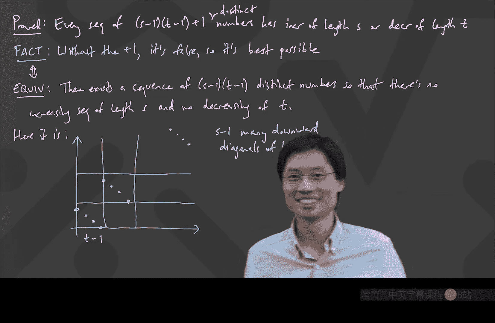

# 离散数学：P6：Erdős–Szekeres定理与鸽巢原理应用


在本节课中，我们将要学习一个关于序列的重要定理——Erdős–Szekeres定理。我们将通过一个具体的证明过程，理解如何利用鸽巢原理来证明：在任意足够长的不同数字序列中，总能找到一个长度至少为√n的单调（递增或递减）子序列。我们还将探讨该定理的一个更精确的版本。

## 定理回顾与问题引入

上一节我们介绍了Erdős–Szekeres定理的基本陈述。本节中，我们来看看如何证明它。

该定理指出：对于任意n个不同的数字，其中总是存在一个单调（递增或递减）子序列，其长度至少为√n。

**公式**：对于任意由n个不同数字组成的序列，总存在一个单调子序列，其长度 L ≥ √n。

## 证明思路：构建辅助表

我们如何证明这个结论呢？一个巧妙的方法是构建一个辅助表格。以下是我们将要遵循的步骤。

首先，我们写下一个示例序列，例如：3, 1, 4, 5, 9, 2, 6。

在每一个数字下方，我们记录两个值：
*   **黄色数字**：代表以该数字结尾的**最长递增子序列**的长度。
*   **粉色数字**：代表以该数字结尾的**最长递减子序列**的长度。

例如，对于开头的数字3，以它结尾的最长递增子序列就是它自己`[3]`，所以黄色数字是1。同样，以它结尾的最长递减子序列也是`[3]`，所以粉色数字也是1。

## 动态计算子序列长度

接下来，我们看看如何高效地计算后续位置的黄色数字（粉色数字的计算逻辑类似）。

以序列中的`6`为例。我们想找到以`6`结尾的最长递增子序列的长度。关键在于：要到达`6`，前一个数字必须小于`6`。因此，我们查看`6`之前所有小于`6`的数字（即1, 4, 5, 2），并找出它们对应的黄色数字中的最大值。

**算法逻辑**：
1.  找到当前位置之前所有值小于当前值的数字。
2.  取这些数字对应的“黄色值”中的最大值。
3.  将该最大值加1，即得到当前位置的黄色值。

在示例中，小于`6`的数字对应的黄色值最大是`5`对应的`3`。因此，`6`的黄色值 = 3 + 1 = 4。这意味着存在一个以`6`结尾的长度为4的递增子序列（例如`[1, 4, 5, 6]`）。

这种方法避免了为每个位置重新从头计算子序列，大大提升了效率。

## 关键观察：数对的不重复性

构建完整个表格后，我们观察到一个关键现象：将每个数字上方的“原数字”（绿色）和下方的“黄色值”、“粉色值”看作数对（绿色， 黄色）和（绿色， 粉色），这些数对在整个序列中是**各不相同的**。

为什么？因为序列中的绿色数字本身各不相同。考虑任意两个位置，它们的绿色数字要么递增，要么递减。
*   如果绿色数字递增，那么根据我们计算黄色值的算法（取之前较小值的最大黄色值再加1），后一个位置的黄色值**必然大于**前一个位置的黄色值。
*   如果绿色数字递减，那么同理，后一个位置的粉色值**必然大于**前一个位置的粉色值。

因此，任意两个位置对应的（绿色，黄色）或（绿色，粉色）数对不可能完全相同。

## 应用鸽巢原理完成证明

现在，我们应用鸽巢原理来完成证明。

假设最长的单调子序列长度为 L。那么表格中所有的黄色和粉色数字都介于 1 到 L 之间。每个位置产生两个数对（绿色，黄色）和（绿色，粉色），但更重要的是，这些数对两两不同。

数对的第一元素（绿色数字）有 n 种可能（即序列的 n 个位置），第二元素有 L 种可能（1到L）。如果不考虑重复，最多可能形成 n * L 种组合？不，我们有一个更强的约束：对于**每个具体的绿色数字（即每个位置）**，它对应的（绿，黄）和（绿，粉）这两个数对，由于上述的“递增或递减必导致黄或粉增加”的规则，在整个序列中也是唯一的。更简洁的思路是：所有（黄色，粉色）这样的数对都是唯一的。

因为黄色和粉色值都介于1到L之间，所以不同的（黄色，粉色）数对最多有 L * L = L² 种。

而我们总共有 n 个位置，也就是有 n 个这样的（黄色，粉色）数对。根据鸽巢原理，如果数对的数量 n 超过了可能的不同组合数 L²，那么必然有数对重复。但我们之前已经论证了这些数对各不相同。因此，必然有 n ≤ L²。

**公式**：n ≤ L²

由此，我们得到 L ≥ √n。这正是Erdős–Szekeres定理的结论。

## 定理的强化版本

我们刚才证明的定理可以强化为一个更精确的版本。这个版本给出了保证存在特定长度单调子序列的精确阈值。

**定理（Erdős–Szekeres 精确形式）**：对于任意由 (s-1)(t-1) + 1 个不同数字组成的序列，其中必然存在一个长度至少为 s 的递增子序列，或者一个长度至少为 t 的递减子序列。

**证明思路**：与之前类似，我们采用反证法。
1.  假设结论不成立，即不存在长度 ≥ s 的递增子序列，也不存在长度 ≥ t 的递减子序列。
2.  那么，每个位置对应的黄色值 ≤ s-1，粉色值 ≤ t-1。
3.  因此，每个位置对应的（黄色，粉色）数对可能的不同种类最多有 (s-1)(t-1) 种。
4.  但我们有 (s-1)(t-1) + 1 个位置（数字），根据鸽巢原理，至少有两个位置的（黄色，粉色）数对相同。
5.  这与我们之前证明的“数对各不相同”的性质矛盾。因此，假设错误，原命题成立。

## 最优性验证

这个“+1”的阈值是最优的，即不能再减小。以下是说明：

我们可以构造一个恰好有 (s-1)(t-1) 个不同数字的序列，其中既没有长度为 s 的递增子序列，也没有长度为 t 的递减子序列。

**构造方法**：
将数字排列成 (s-1) 行，每行包含 (t-1) 个数字，且每行内部数字严格递减。然后，从左到右、从上到下读取这些数字，形成我们的序列。

例如，当 s=4, t=4 时，(s-1)(t-1)=9，构造如下：
```
(第一行) 9, 8, 7
(第二行) 6, 5, 4
(第三行) 3, 2, 1
```
读取后的序列为：9, 8, 7, 6, 5, 4, 3, 2, 1。
*   递增子序列：只能从每行取最多一个数字（因为行内递减），最多能取 s-1=3 个数字。
*   递减子序列：最多只能在一行内选取，一行最多有 t-1=3 个数字。

这个构造证明了阈值 (s-1)(t-1) + 1 的精确性。

## 总结

本节课中我们一起学习了Erdős–Szekeres定理及其证明。
1.  我们通过为序列中每个位置计算“最长递增/递减子序列长度”来构建辅助表。
2.  我们发现了表中（原数字， 递增长度）或（原数字， 递减长度）数对具有唯一性的关键性质。
3.  通过应用鸽巢原理，我们证明了在 n 个不同数字中，必然存在长度至少为 √n 的单调子序列。
4.  我们进一步探讨了定理的精确强化版本，即对于 (s-1)(t-1)+1 个数字，必存在长度 ≥ s 的递增子序列或长度 ≥ t 的递减子序列，并验证了其最优性。



这个定理是组合数学中鸽巢原理的一个经典而优美的应用，它揭示了序列中必然存在的有序结构。