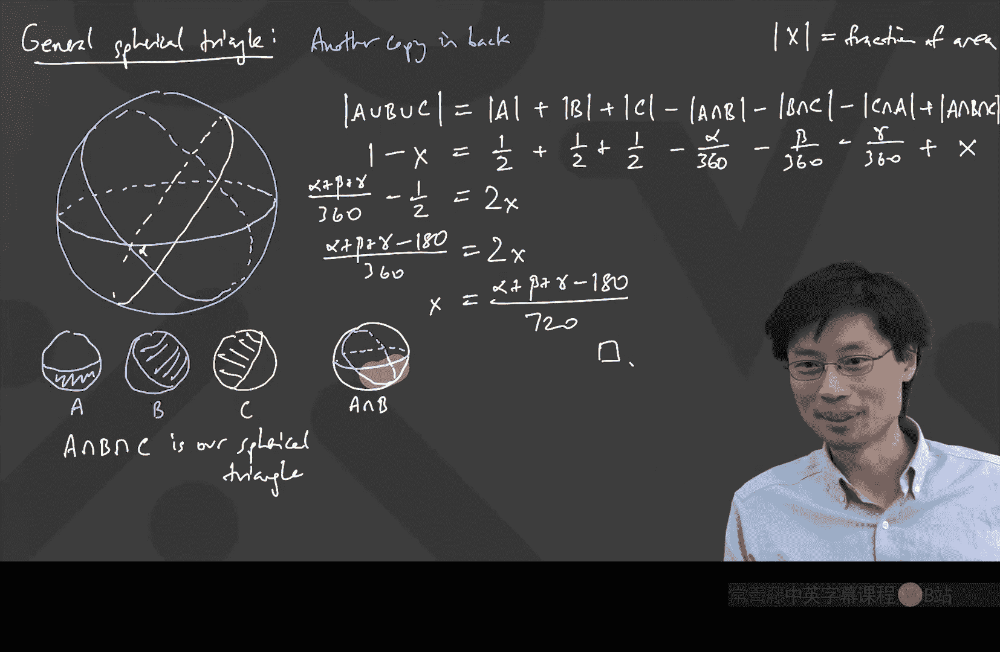

# 卡耐基梅隆【中英⚡离散数学｜21-228 2023, Discrete Mathematics】 p07 P7 -BV1sFibBkEj7_p7-

Hello， everyone。 How are you。Just double checking。 Do we have sound connection here。Yes， we do。 Okay。

 excellent。It's low。It's like the smaller quality。Really。

So we say the microphone is lower quality today。Now， you sound like a robot Oh no。Yeah。

Oh you guys should have told me an office hours， let me fix this。So youre I know what's wrong。

 just a second。Is this any better。Does this make it better。It's better， okay。

It's because of some kind of amplification。 Is it too quiet now， though。Little quiet。 Let's crank。

's crank it up。Okay。I think I see this is because somehow， somehow the audio settings get adjusted。

 So I'm gonna tweak it this way。 Is it still like a robot or is it okay。そ lookか。Little bit。

 pulling it back。How is it now？Is this， is this like good now or is it like still a little bit wonky？

Still a bit wonky， we'll go anyway with this thing， unfortunately。😊。

It's it's that somehow the audio settings got adjusted。By the computer， I'll try this。Okay。

 let's leave it this way， good。Let's go here。

Yeah， and actually， in general， if you guys are at my office hours and notice that anything is funny。

 please let me know because we can use that to help for the class too。😊，Okay， great。 Well， hello。

 everyone。 And we're going to talk some more about combators today。 just， just so that， you know。

 we've finished the pigeonhole principle part。 And just a few comments。

 Some people did come into office hours。 And when they came into office hours。

 I made some comments that there are some problems that are there。 there are meant to， I guess。

 practice induction or pigeonhole principle or something。

 So that's just something to think about could be useful as hints。 And then today。

 we're going to move away from those two topics。 We're going into another topic。 Now。

 the thing I'm going to talk about today。 is actually something for which。😊，Good， that works。

 It's something for which I've actually talked about this in the Putnam class already。

 I talked about it in the boops。 Yep， that's right。

 I talked about it in the Putnam class already for， for， for， for this， for this group。 So you might。

 So if anyone has seen that before， I'm sorry， you're gonna get it again， but。😊，Well。

 hopefully it'll make more sense the second time， but。I want to talk about it because it's a really。

 really interesting application of a very interesting idea from combinators。

 So if you've seen this before， please don't give away anything because it's just， it's just awesome。

 so。😊，The setup for this is we want as you can probably tell。

 my goal is to teach you combinatorial ideas， but I always want to show you the combinatorial ideas in the context of some like very surprising application。

 It's like how when I was trying to show you guys induction。

 I guess we ended up talking about things that involved matrices and like these like numbers with no two digits same next to each other but are even。

 And then when I wanted to talk about the notion of pigeonhole principle。

 we went and talked about this deishlace de theorem deishlace theorem about approximating real numbers。

 And so today I want to teach you about another idea in combinators。

 you won't know what the idea is yet， but we'll start with an application。

 and the application is called getting into college。😊，So it used to be that there was no SAT。

 there weren't all these exams， and so every university had its own kinds of exams to go and try to figure out how you get into the university。

😊，So Carnegie Mellon was no exception。 And on the Carnegie Mellon exam to enter the university back in like the 1913 ish time。

 I think there were all kinds of questions you had to answer。

 Some of them were things like solving an equation。 Sometimes it was like， draw a graph of something。

 but amidst that exam。 like in the middle of the questions， Not at the end。

 There was the interesting question， which said。😊，You have a spherical triangle。With。Angles。

Of something like 70 degrees。呃。80 degrees。And 110 degrees。Okay。

 you have this spherical triangle and the sphere。Has radius。10。What is the area。

Of the spherical triangle。By the way， this was one of the questions to go and see who would go and get into CMU。

 and I remember when I saw this exam， I said， oh my gosh， I will have some trouble getting into CMU。

😊，What's this about， Well， first of all， what's a spherical triangle。

 I guess we've got to think about the sphere。 And again。

 those of you who saw this particular thing and in the Putnam class， it'll be the same idea。 However。

 it's just so important that I want to talk about it in this class。So what's a spherical triangle。

 Well， a spherical triangle is you get a sphere。And it's supposed to be a sphere。

 So I guess it's round。 And a triangle on the surface of the sphere means that you have three points。

Okay。And now is a triangle， meaning that you have the shortest paths between the points。As you know。

 if you fly around on airplanes。These straight lines are not really straight。

 They're actually over the surface of the earth。 And anyone who has ever noticed to you flying like very long distance distances on the earth。

 it looks like the plane is doing this， right， It's kind of going up and and down because that's just。

 that's just the shortest path。 Actually， I used to fly to China a lot。

 And I just noticed that the shortest path between New York and Beijing was to go over the North Pole。

 And that was just like how it always was every single time。😊。

But so we have this spherical triangle and then these angles are something like 70。80。😊，And 110。

And the question was。What's the area？嗯。If you've seen this before， don't give it away。

If you haven't seen this before。Jang bin。Just feel free to type raise hand。 And by the way。

 the answer doesn't。 you don't have to have an answer。 In fact。

 almost nobody should know what the answer is。 Almost nobody， Andrew。to calculate。Okay。

That is the direction we're going to go in。 So let's just say equivalently。Calculate。The fraction。

Of the surface area。Right， because there is a formula for the surface area of a sphere。

 The total surface area of a sphere has a formula。 Does anyone know what it is。啊。4 pi R squared。

 That's right。 So the， the surface area of the whole thing is 4 pi times r squared， which。

 by the way， the proof of the surface area thing is also interesting on its own。

 we just won't go into that ti today。 But if I can just find the fraction， I'm in good shape。😊。

All right。So that呢。If you haven't seen this before， how about you hope to find the fraction。

Christopher， were you going to answer the surface of the sphere or did you have another idea？No。

I was goingNo problem， no problem。 So it's four pi R squared。 And now like， by the way。

 I don't expect any answers。 This is something which I didn't know how to do either the first time I saw it。

 but I'm just kind of curious that anyone have things that what kinds of math could be useful to solve this。

😊，Feel free to just type raise hand or R H， and I'll I'll call on you。

 And don't be afraid if you don't know how to do it， because that was the whole point。A， Ben。Oh oh。

 I can't seem to hear you， Pam。哦， oh sorry yeah so I try俾个。Yes， I guess。So maybe like you could。

But because you know， with one line divides here。Right the area in half。

So maybe like you get to figure out something。okay， so one line cuts。

Let me put line in this like quotes， cut sphere in half。Okay。By the way。

 just I'll get more ideas on this right after I explain what Ben just said。

 Ben said something about what is， what is any the the shortest path on the sphere。

 Like when you draw these lines on the sphere， what are they really doing。

 They're called great circles。 So if actually， if I want to know the distance between two points on the sphere。

 what you do is you find the circle that goes through those two points。😊，Which is like an equator。

 It goes all the way around the sphere。 The center of that great circle is the center of the sphere。

 And that would be the shortest path between those two points。 So like。

 here's an important fact that we are going to use。Fact。Oops。Fact。The shortest。Pf。Between。2 points。

On a sphere。Is the great circle。Through them。And a great circle is a circle which is centred at the same center as the sphere。

With the same center。As the sphere。Itself。Okay。And。

 I'll dwell a little bit more on this fact after I hear another idea。 Van Kash。

 did you want to say something。I think that is。Yeah， but I was also thinking。2D， like just a circle。

Consider it kind of like a sector。Like the length of a sector。未 the like。アイ similar。Oh， this' not me。

Okay， let me put another idea for the 2D version， the 2D version。

 what I'm hearing from you is you're saying like， look， if I drew a circle。

And I have like some part of a sector。 Like， I'm not doing surface area anymore。 I'm doing。

Premeter is。Right， I think your idea was， what's the 2D version of this。

 The 2D version of this is something like， I've got a circle。 I've got a portion of it。

 And what kind of formula do you use to find the portion of it， the the length of that part of the。

 of the， of the circumference。 Well， that turns out to be a fraction。

 That's just a fraction of the whole circumference。

 And the fraction has something to do with what angle that is out of 360 degrees。

 Does that make sense。😊，That's an interesting idea。This thing here。😊，The fraction。

Is let's write an angle。Every good angle。Data。The theta over 3，60 degrees。Okay， so that's an idea。

 It's like the fraction of of the circles circumference that you're talking about is just like the fraction of the angle divided by the whole 360。

 Let me now go to this point that I was said about how this great circle。

 because not everyone is used to thinking about 3D geometry。😊。

That seems a little bit counterintuitive。 Why would it be that the shortest path uses the great circle。

Well， here， this is not the main point of this class。

 So let me just briefly explain to you why you should believe this fact。This is not。

 this class is not a geometry class。 We're just going to use the fact。

 but just in case you're curious why that should be。 the easiest way to think of it is， look。

 suppose I'm trying to go between two points on the earth。

 If the two points on the earth are just kind of like New York and Istanbul。

 somehow they're just like random points， right？ and it's hard to know。

 why should it be that the shortest path between New York and Istanbul is just this great circle。

 It's a lot easier to think about the fact that the sphere can rotate。😊。

So what if you just took the earth with New York and Istanbul and we hit it with a huge asteroid until New York was at the North Pole。

 Al right， now， actually， you need a really huge asteroid if you think about the physics of this。

 But anyway， So let's pretend we move New York all the way to the North Pole。

 Istanbul is now all the way over here。😊，Is it obvious to people that if I rotated the sphere。

And I have one point of the sphere， which is actually legitimately at the North Pole and some other point of the sphere。

 which is like somewhere else。Is it obvious that the shortest path between them is to just go north？

Does that sort of make sense。 It's like， suppose I have a sphere。

 I have this New York and Istanbul is too un too， too confusing。

 So rotate the whole sphere until New York's at the North Pole。 Now， you got Istanbul over here。

 How do you get from Istanbul to the North Pole， You go north。Does that make sense？ But now。

 if you imagine what happens as you go north。The shortest path， obviously， just goes north。And。

It's going to。This is like， in the back。Does this make sense what I've drawn here。 I just said。

 like the path that goes from wherever that other point is up into the North Pole。

 the shortest path really is just go north。 and then like by symmetrymetry。

There's this entire circle， which is going around。That's like a line of longitude and the opposite line of longitude。

 Did that make sense。I hope this helps to explain why it would make sense that the shortest path between two points is actually the it's the section of this great circle。

 which connects them。 and a great circle just happens to be a circle。

 which has the same center as the center of the sphere。

Another way to think of a great circle is as if you sliced the sphere with a knife and the knife actually went through the center of the sphere。

 What you chop off has these two halves。😊，Okay， and that。

 this is just trying to show you why that would be the case。Fun fact。

 The great circle also is is is the circle that goes through these two points。

 which has the longest circumference on the surface of the sphere。 You know。

 there are other circles that go through these two points。

 like there's one that just goes around on the surface of the sphere like this。

 And that tends to be that happens to be a smaller circle。

 So the great circle is actually the longest one。 However。

 from the point of view of the path between them。 It's the shortest path between them。😊，Allright。

 I said all of this because I want everyone to be able to use these facts。 Somehow。

 if I just had one of these lines， I cut the sphere in half。 And the idea was。

 what if I have a bunch of these lines， How does that cut the sphere？ Okay， Well。

 we still need to keep figuring out how to solve this problem。 So what else can we do。😊，Well。

 here's a， here's a suggestion。 Whenever you get a problem that's hard。

 you try to ask an easier problem。And if you've seen this before， I I。

 I'm not gonna call on you just because I would like to let everyone else play if that。

 if that's okay， it's just much more fun that way， but。😊，Whenever you have a hard problem。

 start by trying to solve an easier version of it。 And that's also a general hint of my homework problems。

 They are hard。 But if you kind of think of smaller， simpler cases， you can make progress。

 And then you carry that along。 What might be an easier version of this kind of a question。

This question here says I have a 70 degrees，80 degrees，110 degrees。 and its， it's a circle。

 I mean this is on a sphere， got some radius。 What's an easier version of a problem that I could try to solve then。

😊，What about just using two lines？Considerably a triangle。Okay， let's go and do an easier version。

Easier version。 Well， let's go and take this sphere。And you want to do two lines。

 How do I make two lines。 Now， you use the fact that each line is a great circle。

 Each line is what you get when you slice this thing with a knife that goes right through the center。

 So I'm going to draw two of them， okay。I'll say that one of them maybe looks like this。Okay。

 now it looks more like a sphere， and I'll draw another one。

 another one which maybe cuts across this way。Okay， so I。

 what I've just drawn here is that this is a sphere。

 And there are two of these lines that have've gone through it。

 And I've cut the sphere actually into four pieces。 As you said before。

 if I just looked at just the green cut， I have half and half。 If I looked at just the yellow cut。

 I half and half。 Oh， no， this is a really dumb picture because now it looks like they're all quarters。

 I don't want all quarters。 Okay， I'm gonna draw you another one that's not obviously all quarters because then that's two obvious。

😊，Oh， man。 at first， I was gonna be like erasing is gonna be a pain because of all those dotted lines。

 But then I remembered I have the undo undo is very powerful。Okay， undo。

 And now I want to make something that's not obviously 90 degrees。How do you do that。Gues like this。

Okay， so now I have this。 This is very obviously not 90 degrees。

 And suppose what I'm curious about is like， what's the surface area fraction that happens to live over here。

And also in the back。Does it make sense what I've drawn。

 I've been like there's I was like there's some surface area over here。

 and there's also some surface area in the back。 What fraction of the sphere is that。

 Is there an easy way to quantify that。You can express it in terms of something。Grove。

So we know that。ぱで。3。できません。Yeah， well， however much that is， I guess open。嗰啲。Okay。

 let's give that angle a name。 We'll call it theta。 Okay。

 so what you're saying is that the the fraction that I've got is theta divided by 18080 degrees divided by half。

 Is that what you're sorry， times to half or like divided by2。 Is that what you're saying。😊。

Fraction of area。Is equal to you said it's theta over 180 and then times a half because it's of a half of the whole thing。

 which I can rewrite as theta over 360。😊，Everything's in degrees， so everything's just degrees here。

 even though I don't write the dot。Oh， Franceco， are you going to say something。The same thing。

 Did you have a different way of explaining it。I just looked at it， as like。

ItsLike there's the corner， like there's a two lines inter set。

And they're essentially like you get flated。In a circle and just。

So you're saying it's like it's data over 3，60 because it's 360 for the whole thing。

 Is that what you mean。 Yeah， And， and actually， if you think about it。

 you do see this if you ever eat oranges when you slice the oranges into wedges。

 which is how my family， used see eat oranges。 But then I don't eat oranges that way。

 because it's really messy and juice goes everywhere。 But somehow。

 if you slice it into these fractions， the amount of peel you get。

 It's totally obvious that it's like the amount of peel is the fraction called the angle divided by 3。

60 degrees。 That makes sense。😊，Actually， this is a really good idea。

 So now we know how to do it with just one line。 one circle or a great circle is half how to do it with two great circles。

 It's just going to be the angle divided by 360。 So now what could we do with three， Well， actually。

 it's not so not super obvious because if I make the third one cut into this in a really weird way。

 it's bad。 But are there other ways to make the problem easier。 right。

 we have to do this problem that was over here， It has three of these great circles all cutting each other。

708110 Is there any other type of easiness I could take to this question。 Like to make it easier。

 ask a different question and get some intuition。😊，啊 Andrew。十が。Time go I can keep the ladder。Ah。

 what do you mean by an equilateral triangle， What angles？Rightい。Okay， actually。

 let's start with that。 Okay， there's another way to do this。

 Another way to approach the whole thing。 We can also try。😊，Other。Numbers。Okay。

 what if I have a 60 degree，60 degree，60 degree on the sphere。The first question is。

 how do you do that？I like your thing you said because it's going to get to a point。Out of it。

You can't， because the earth isn't flat。So this is actually really interesting， okay。

 but I wanted you to say that point because I was actually going to use that triangle。😊。

You sort of can because the earth looks flat。 I mean， like。

 if you just went to the floor near you and you just said， okay，6060，60， you're good。

 But the interesting thing is that。It's not flat。 Oh。

 there was another person who was going to say some stuff。And let me get your name， right。Andres。

 And is it Andre or Andres， Andres， what were you gonna say。We're gonna go there， too。 Okay， so。

 so I want both of these。 So the first one is this。 hold the 19990。 Okay， I'm gonna get to that next。

 Let me draw this guy。 What does this look like on the sphere。😊，In fact。

 the only way to get this on the sphere is to make the triangle look like this。See， it's over there。

It's really， really， really small。 In fact， it's practically inconsequential。Does that make sense。

The only way to actually make a triangle that is flat on a sphere is to get so close together that it looks flat。

And you are still not at 60，60，60。 It's like 60 plus a tiny bit。 So in this tiny thing here。

 what this actually is。Zoomed in is something like。This。Where each of them is 60 plus of bit。 Okay。

 but it 60 plus a bit，60 plus a bit，60 plus a bit。 And what I'm going to say about this is that the fraction of the area。

Is about 0 plus a bit。OkayAnd actually， by the way。

 this is how people try to figure out like whether space is curved or flat。 I mean， in general。

 if you are measuring the angles of a triangle， if the sum of the angles of the triangle is bigger than 180。

 then that's actually positive curvature of your space that you're in that's actually what this is。

 So when people are curious is the space we live in flat in some funny notion of flatness。

 people are launching satellites to go very far apart from each other and measure the angles between them。

 And there's even like examples of this， if you look at some of those pictures that they draw of the universe where there's like light going around the star。

 I'm not sure if you guys know what I'm talking about。

 like sometimes there's a picture a star and a gravitational well and like light rays can curve as they go by the star。

 these are all notions is space flat or curved。 And so the notion of the sum of the degrees of the angle of a triangle' actually very fundamental there。

😊，But so we found 60，60，60 about 0。 Now， let me go to Andre's idea。 Andre's ideas。

 there's another kind of a triangle we could have。😊，Or a 90 degrees，90 degrees，90 degrees triangle。

Well， that one looks quite interesting。For that one， we go and take the North Pole。And then。

 we also take。The front pool。And the East Po。None of those actually really exist。

 but you know what I mean， like the North pole， the front pole and the east Pole。

 a sphere can only really have north and south poles because that makes an axis that it revolves around。

 But I think you guys got the idea。Oh， in space。 Can you have to sum of the angles be less than 180。

 Yes， you can out of it。 That's called hyperbolic space。 Yes， that's called negative curvature。

 So the interesting thing is that this whole notion of sum of angles of a triangle is deeply relevant to geometry。

 Like geometry of actually， there's a name for it。 It's called non Euclidean geometry。 But anyway。

 that's not the topic of this course。 So now the 19990。 What does that look like。 That's like。

 you just go down from the north to the front， the front to the east and the east to the north。😊。

And somehow， all of these are 90。This is what I call the rightest triangle in the world。

It's very right。 It's 90，90， 90， you can't get any better than that。

 but now what fraction of the surface area is this。😊，This is easy。 Like this one。 If it's 90990。

 you can say what is the fraction of the whole surface area， just like by looking at it。 Yes。

 thank you。 Chia， it's1，8。 Okay， so the 909090， this is fraction。😊，1 if。Of the whole。

It's one eighth because you can sort of see that across the top hemisphere， northern hemisphere。

 you put four of these guys。 And then you put four more on the bottom。 So it's  eighth。 Okay。

 so now can we find any interesting patterns，909090 gives me one。We saw 60，60，60 gives you like zero。

But we need more data。What I'm trying to say， by the way， is that this question was on an exam。

 Therefore， it has actually got a simple formula。 And the question is how to guess the formula in order to guess the formula。

 we need more data points。 Can we think of any other triangles that we can make where we can like get more examples of angle。

 angle， angle fraction， and we can find a pattern， and then we'll prove it。😊，Again。

 I'm going to try to call on people who I know haven't seen this before。啊上。You can have a 1，21，2，1。

20 tray。It covers the whole sphere。Oh， you said 120，120，120 covers the whole sphere。How is that。

I just have all three。All three angles the same they Oh， yes， yes， yes， yes。Okay。

I know what you mean。Here's the sphere。Here are the three points。They're like all the same place。

 okay？3 points。 But actually， if I zoom in and I ask what is actually， what's actually going on here。

 what you're telling me is that these three points， there's like some trianganglelish thing here。But。

This。Is the inside。Does that make sense， What you， is that what you're saying。That's sort， yeah。

 that's sort of like if you just decided to put on your socks inside out。

 it's not that your socks are inside out。 It's just that everyone else is wearing your socks。Okay。

 so， so now， but if you do this， okay， there's one thing I want to adjust。That's cursesed。 Okay， yes。

 So， so something else I want to do with this is。You said 120。

 I want to adjust your numbers a little bit， not quite 120。What do you actually mean？Like。

 that's not 120。300， Yes， that's 30。 Okay， but it's it's the correct principle。 Alright， So 300。300。

300。 That corresponds to fraction。I'll call it1。Actually， all of these are 300-300-300。

 They're all like marginally less than 300 because of the fact that this is still like outwardly bulging。

 It's all it's not， it's not flat， right， The earth is not flat。 It's outwardly bulging。

 And so each of these is like eaten in a little bit。 So it's a little bit less than 300。All right。

 So 300，300300， I get a fraction of like about 1，60，6060。 I get a fraction of about 0。 and 19990。

 I get one e。 Can we do anything that's like not equilateral。 Ily。

 something that involves like a variable thing。 I have a hint。 The hint I have。

 Is that this thing over here is really useful。😊，Can we do something with that。Now。

 I want something where it's not just like all three of them are fixed constants。 In fact。

 I'd like one of them to be a theta。Okay， Andrew。Would you like constructed so that like？

You're moving away in like art。That kind of like。We're like the center of the。

Arrc between the two lines would like intersect with the center of the angle。

 I'm explaining this terribly， but I'm thinking of like。

Maybe it's like if you were to split the triangle in half。the center of your original theta。うトラの？

Okay， are， are you， are you saying like， use this picture or like another one。

 Do you want to use this， this picture， Are you saying split it where you kind of slice the orange peel in half this way。

 Is that your half you're talking about。But the maybe split。Purple bear。So you mean like。

 you want to cut it。 So you have like 2，90 degree angles。 Is that what you want to do。Let's do that。

 The easiest way to think of that is like， let's put this guy into the North Pole。 Okay。

 that's exactly what I wanted。 by the way。 So， and， by the way。

 there's no right like right or wrong answer。 There's no we're just， we're just experimenting。

 But here's another thing you can do。😊，You can take。The earth。You can run。

Two of these things coming down。When there。Another one there。 Okay， and there's a theta here。

 And at some point， they hit the equator， right。And these are right angles。

Did that make sense to people， Like， that's a totally legitimate way to make a triangle。

 I have two of these lines of longitude， and I have the equator。Okay， so that's a theta。90。90。

What fraction is that。What fraction does data 1990 correspond to。Check。

It's like half of what we had for just the theta triangle。

 Half of what we had for the theta triangle。 That was theta over 360 before。I guess 7 point0。

Theta over 7，20。 Okay， so now we have a lot of information。

 and now we can pretend that we are not mathematicians。

 but like people who look at numbers and try to find patterns。 Okay。

 so we found out that from theta 990， you get theta over 7，20。 What other data do we have。

 We also know that 60，60，60 gives you about 0。😊，Okay， we know that this 300。300，300。

 That gives you like one。We know that 90，9090， Oh，19990 is there。 That's data over over 720， because。

 oh my gosh， it actually works。19990， like over here is like  one，8， right，90 over 7，20。😊。

So this one actually also， also matches 99090。Okay， so then the key question is。

 what kind of formula could the answer be？And I'll give you a hint。

 The formula turns out to be really easy。 It's an even easier formula than the quadratic formula。

 There's no square roots in it。 You just， you just have to like， add some stuff up and like。

Divide or subtract or something。Sai。It looks like it's linear。 It looks like it's linear。

 It's linear。 Yeah， yeah。 You're doing some linear interpolation。

 There's some linear stuff in actually， the sum of the three angles。😊，Okay， so actually。

 let let me let me drive towards the answer。 You know。

 we've been talking about comparing the sum of the angles to 180 degrees。

 And there's something very practical about being on the surface of a sphere。 Remember。

 I said there's no way to make the sum of the angles equal to 1，80。 You're always more。

 And the only question is how much more。 in the 300300，300， you're like really more。

 If that makes sense。 That was your example。 It's like so crazy more in the tiny， tiny thing。

 you're like， not much more。 In fact， it should sort of make sense that the how far off you are from 180 has something to do with how not flat you are。

😊，Does that make sense？ That's a hint。Can anyone see a way to guess a formula。

So there's actually a formula。Wait， where to go。The fraction。

Its equal to something in terms of the angles， if there are A， B， and C， or alpha beta and gamma。

 let's call that。Let's suppose that。 The angles。Our alpha。Beta and Gamba。

Can anyone guess something that might work， given that I gave some hint that it has to do with like how your angle sung。

Diffs from 1，80。What's going on here。执法。Maybe it's just。

However close we are to 900 instead of 180 the summer。And also we approach。知る。Okay。

 somehow like linearly。Interolating。Linear linearly interpolation， no。

 linearly interolating from like 0 to 1。As you go from like 1，80 to 900。So I guess it can be like。

That some of the angles。Yes， so your formula is some of the angles。-1，80 over 7，20。 bam。

 that's the correct answer。 Okay， so so by the way， this is like， what so simple。 So， so yeah， yeah。

 I mean， like this， this is when， when you when you look at it， you're like， wow。

 that's a really simple formula。 How come we don't learn that in school anymore。

 It's actually really simple。 It's just the sum of the three angles，-180 divided by 720。 And in fact。

 if we learned it in school， if you did that exam on the Carnegie Mellon Carnegie Institute of Technology entrance exam。

 it would be like it's easy。 Got it。😊，Actually， we don't learn this anymore because this entire area called spherical trigonometry has disappeared from our curriculum。

 It's just not taught anymore。 The reason is because a long time ago， it was actually important。

 long time ago， people sailed ships 1913。 That's like when they sailed ships across the ocean。

 They didn't have GPS。 And so you had to know what angles were and like stuff like that。

 or else if you sailed the ship the wrong angle。 You die。 It's very simple。 So， so anyway， that was。

 that was like part of the curriculum。 But not anymore。 So it was just a lost art。

But it's a beautiful formula。 So now let's prove it。 That's what we'll do with the rest of this。

How do you prove this formula？ Well， obviously， you just use calculus， right。Well， unfortunately。

 calculus is like really painful。 I don't see how calculus would ever give you a formula that talks about the angles。

 Okay， calculus will give you a big mass of signs， cosines and square roots and like whatever else Itll be horrible。

 So it turns out that the solution is to use combatorics。And to use。Something that is。

 is like the next bunch of things that we're going to talk about。 and you'll see where it comes from。

So what I'm going to do is I'm gonna draw a general triangle。 Okay， so here's what the general。

Spherical。That was supposed to say general， general。Spherical。Triangle。

Here's what a general spherical triangle looks like that I just have to draw like a sphere。

And I have to draw these like three things。 without loss of generality。

 I've rotated the sphere so that one of them happens to be the equator。

I said the word without loss of generality， because even if I have three， like other things。

 I can just turn the ball until one of those things happens to be the equator cut。

 And then I have got two other ones。 Okay， so it's got something which is maybe doing this。

And we have another one， which is maybe kind of sweeping around this way。

I was supposed to look spherical， but close enough。Okay， so I've got these things。And now。

 if I've got all of these things， I can say， well， here's a， here's a spherical triangle。

 The spherical triangle happens to be this guy。😊，Does that make sense。

 So that's my spherical triangle。 I'm saying any spherical triangle looks like this。

 You just take three of these cuts slicing past the center of the sphere。All right。

 The first thing I want to do is I want to say when you do anything with math， you look for patterns。

 I claim that if you look at this carefully drawn picture。

 there's an interesting thing that you might observe。😊，Here's the spherical triangle I'm looking at。

 Do you notice anything like nice or elegant or neat coincidence about this picture。

 That's the 1 I care about。😊，City。Symmetry， there's the same thing in the back。 You see that。

 That's true because of the symmetry， since I just sliced through the center of the earth three times。

If there's a triangle here， there's another copy of it in the back。

 Let's just like make a nice observation。 There's another copy。In the back。

So now what I want to do is I want to define three sets and the three sets I want to play with are going to be three sets for which their intersection is this piece in question。

😊，Actually， we're now moving into an area of combinators when you have three sets。

 What might you do if you're talking about combinatorics and you have three sets and you're dealing with intersection of all three。

 Does anyone know like some fact from combinatorics about three sets and intersection of all three。😊。

Aha， out of it。Wait what did you say， I， exclusion， inclusion exclusion， right。

 So this is something I think most people have seen before in some other class。

 but I just wanted to show how this thing can come to life。

 And this is also a way to review it or to quickly see it for the first time。

 here's an interesting fact。 If I have anyhow， three sets， let me just jump to another screen。 Okay。

 If I draw Venn diagram。 And I've got three sets， A， B and C。😊，A。B and C。

 there's some formula about A union， B， union C。Is that right， Like， there's some formula。

 If I want to know like what is covered by any of the three of them。 Well。

 the answer is you take how much is in a plus how much is in B， plus how much is in C。 Yeah。

 but then that's too much。 you have overcounted because if I went。 and this is a counting thing。

 that the vertical bars is how big is my set， right， I've over counted。

 So I need to subtract off the a intersect B。Subtract off the B， intersect C。

 and subtract off the C intersect A。Okay， but we're not done from this。 if you。

 if you took all of the， the big pieces and then you subtract off the parts that are in two of them。

 what else do you have to do。Is this something everyone has seen before。

 like in high school or or concepts， Yeah， it should be somewhere。 You need to add back something。

 Okay， and we'll prove all of this next time rigorously。 I mean， this。

 the purpose of today's lecture is to kind of open the door to inclusion exclusion。

 This is called the inclusion。Exclusion。Some people call it the principle of inclusion exclusion。

 which is P I。e。 But you can just， it's just like add subtract add subtract。

 will prove the whole thing later。 so be， Yes， thank you。 You add back。 You add back。 Now。

 this is what you think of when you think about the sizes of sets。 But actually。

 the same reason why this is true。 also holds if we're talking about areas。

If I had three weird shaped objects overlapping with each other。

The area of their total overlap is equal to add up each area。

Subtract off the areas that two of them intersect on and add back the area of all three。Interssected。

 Does that make sense to people。 It's the same reason why counting with work。

 If you don't believe the area thing， imagine that you just had areas and regions and you had grains of sand spray painted on the surface。

 And you're just counting how many grains of sand do I have。

Counting grades of sand is proportional to the area。 So that's why it's the same concept。

Now let's use it。So now I need to get three sets such that somehow their union and intersection is nice。

And the three sets I've want to use look like this。So I'm going to have the first set A。

 which is the stuff， which is underneath。Underneath like that green thing。

 that's why I'm using green for the a。For B， let's use the pink thing。For B。

 I want the stuff that is over this one。Okay， and for the sea， which is yellow。

I'm gonna pick the ones that go over。The yellow。Why did I do that？

How can you describe the part I'm curious about， Is there a reason why it shows under for the green over for the pink and over for the yellow。

Raise hand， Van Kash。intersectionで。A intersect B， inters C is our spherical。Triangle。😊。

That said spherical。Triangle， okay， so now let's go and use this inclusion exclusion principle and just have some fun。

 So what we now know is if we think about the fractions。 now。

 now we're not going to say those are areas。 we'll talk about the fractions。😊。

So what I'm going to do now is I'm going to say for the rest of this。

 it's like the vertical bar x vertical bar is now going to mean the fraction of the area。😊。

Is that okay， Ver bar is fraction of area is not the actual area。

 Is it that also not the size of the set。 I'm just going to use that here。

And the inclusion exclusion principle also applies。 So now I know something fun。A union B， union C。

 the fraction of the whole surface area that' is covered by any of these is equal to the fraction covered by a plus the fraction covered by B plus the fraction covered by C。

 minus the fraction covered by A and B minus the fraction covered by B and C minus the fraction covered by C and A running out of space plus the fraction covered by all of them B and C。

😊，There we go。 Just fit。Okay， so that's inclusion exclusion principle。

Let's start filling in some of these。Can anyone tell me any of these that you would like to fill in。

 Some of them are quite easy。Out of it。So like the first one。A union， B union C。

 just like misses the back。Okay， so the A union B Union C is the tricky one。 It's not one。

A union B union C is not one because of this observation we made at at at at the outset。

 There's this other copy in the back。 There's a reason I wanted to say that because the most common mistake is to say A union B union C doess everything。

Nope。It actually just misses the part in the back。Why， because if you look at it， right， let go。

 if you go underneath the a part， you go under the here and you stop right before covering that back triangle。

What about the the B part， which is where you go over the pink thing。

 Go up and then back around and you stop right before entering that white triangle in the back。

 the triangle in the back， the C from here you go， How do I do this anyway。

 from here you go up and over。 and then you stop right before that， that triangle。 So actually。

 the A union B， union C， That one's interesting。 That fraction。 oops。I want to use this pen。

 That fraction is 1 minus x。Why did I call it X， Well， X is what I'm looking for。

 X is this fraction I'm curious about。 Is that okay。Because of that， I'm going to label。

 The last one as X。So I've labeled x is the intersection of all three， and 1 minus x is the union。

Oftenbo。Can anyone give me more stuff？ There are other things you can put in that are easy and actually really useful。

😊，Redkosh。嗯。So aren't the areas of just A， B and C， it's just half。Perfect。Okay。

 and then now we get to the weird ones。 What's the fraction of the area of a intersect B。

 I'm going to draw that。 What is a intersect B， Let's just draw that over here。A intersect B。

 that corresponds to under the green。And over the pink。Under the green， over the pink。Stack here。Oh。

 that's so horrible。Hopefully， you understand what I tried to do here。

 I tried to highlight the part under。Ben， did you want to answer this one。

 or did you have the were you answering a different one。Yeah， I was going to answer the last one。

 but I guess for this one， we could use like。Yeah。Maybe you like something with the angle。

 So like the angle over。Or what have。言語。Yes， so let me jump right to the angle over 360。

 Do you remember that， that's what we had before。 Yeah， that's okay。 This is the angle over 360。

 right。Look， the formula is coming together。 I want to have a formula that involves the angles between these things。

 right， and it's appearing。There's one of the angles。 I don't know which one this is。

 Maybe it's alphapha。Hard to read because of that highlight there。Here's what I'm gonna do。 Oh。

 you raised too much。There's an alpha。That was an alpha just through there。

 So this thing is minus alpha over 3，60。You might see where this is going。Actually。

 each of those other things， what are they going to give us。Remember。

 the three angles are alpha beta and gamma Christopher。

The other will just give you beta over basically and ga over here。Yes。

So I'm not going to draw which one's alpha beta and cama。

 But that's the whatever it is iss what it's supposed to be。 Okay， so I need to solve for X。

 This suddenly looks doable。 I have an equation。 I need to solve for X。 So what do I do。

 I put all the x's on the same side。 That's the right side。 That's two x's are on the right side。

I move everything else to the left side。 So I have a minus alpha over 3，60 minus beta over 3。

60 minus gamma over 3，60。 That gives me an alpha plus beta plus gamma。Over 3，60。And what else。

 Some helped me finish this， There's a， there's a gap here because there's something that needs to be stuffed in。

 What else， How do I close it。Okay， a whole bunch of people wrote minus a half。Because I had。

1 on the left and three halves on the right。 So okay， minus a half。This is coming together。

 What happens if I do a common denominator， Al plus beta plus gamma。-1，80 over 3，60。😊。

Is equal to 2 x。And that's exactly what you want。 Because then what's x。

 you just divide by divide by2， right？ So I suddenly find out that the formula I wanted is there X is equal to the sum of the angles alpha plus beta plus gamma-180。

 divided by 7，20。😊，And that's the proof。So this basic combatorial idea of inclusion exclusion turns out to be extremely powerful。

 We can even use it to get into Carnegie Mellon University and also to derive like this old formula。

 old old known for ages formula about the area of a spherical triangle。 We didn't need any calculus。

 It's actually really interesting。 So what we're going to do in the next few days of these lectures。

 We're going to talk about why inclusion exclusion is true。

 We're going to talk about it with more sets。 we're going to look at more applications and so on。

 but we're effectively now into a different part of the unit， which is all about inclusion exclusion。

😊，Okay。See you guys next time。Thank you。你白。I'll stop streaming the YouTube。

