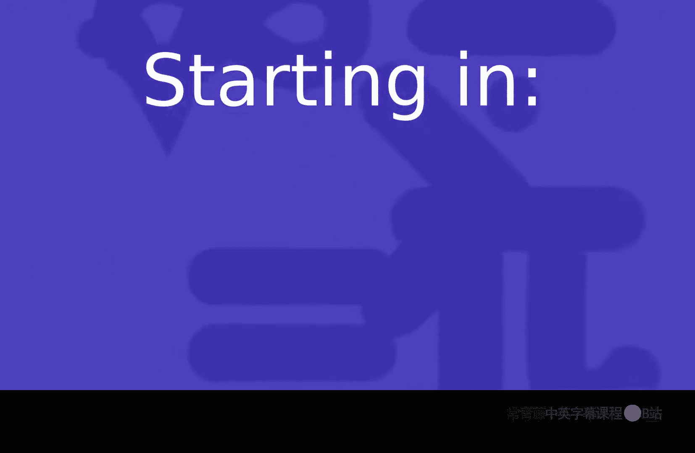
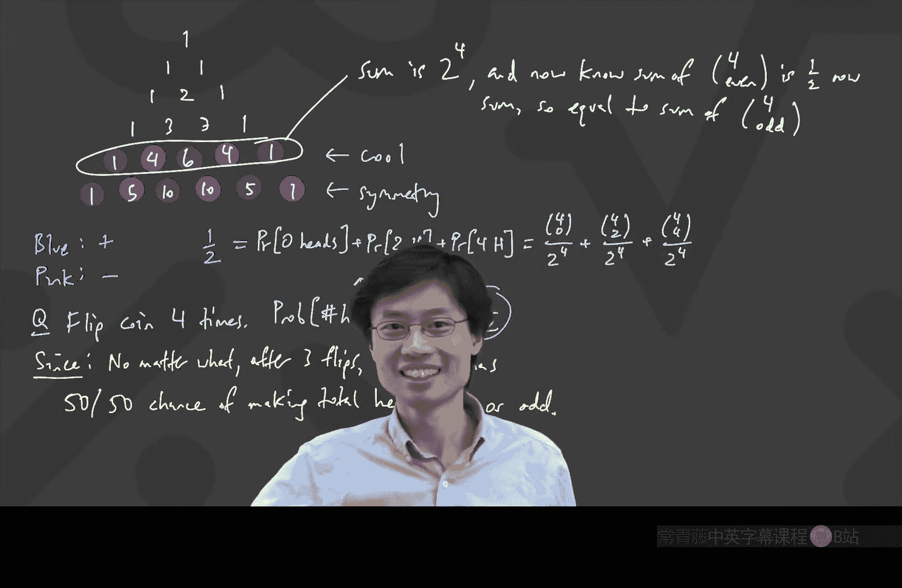

# 卡耐基梅隆【中英⚡离散数学｜21-228 2023, Discrete Mathematics】 p08 P8 -BV1sFibBkEj7_p8-

Recording in progress。

Hello， everyone。 How are you。Double checking。 is my audio Ok or is it like the funny scratchy thing。

😊，Okay， we're good。 Okay， yeah， it's hard to tell because somehow the way Zoom works is that Zoom takes control of your audio settings。

 So I don't know what they have。 Allright， well， hope everyone is doing well today。

 Last time what we talked about is we discussed something where we were。

 we were using inclusion exclusion in order to go and prove something which looked like it had nothing to do with inclusion exclusion。

 But then what we're going to do today is we're going to go and actually discuss the combinators of the inclusion exclusion itself。

😊。

So this is something where I know that it's been covered in various courses before。

 And I just want to know so that I can calibrate in concepts of math， for example。

 to what degree did they talk about the inclusion exclusion formula if at all。

 That was this thing of like A union， B， union C， Its like A size of A， size of B， size of C。

 Anyone want to raise hand and just maybe let me know what what the calibration of knowledge is right now。

😊，ままだ。あ个保用。Okay， so you're saying in concepts， you sort of， you saw the formula。

 You saw the formula did a few problems。 Is that right。Only remember it from linear algebra。

 Good gracious。 So the linear algebra did this。 So I guess curious， the thing I'm curious about is。

 I mean， a lot of people have seen the formula。 But again。

 because not everyone in this class has taken concepts。

 I'm going to quickly put that up onto the screen here。😊。

The inclusion exclusion formula in general is telling you something like this。

 If I have a bunch of sets， and I look at like the。Size of the union of a1， A2 and so on。

 up until A N。 I'm going to write this formula first。

What this is is you kind of like add the odd ones and subtract the even ones in the sense that you take the size of a1 plus the size of a2。

 This is inclusion exclusion for lots of sets。😊，Plus， up to A N。

 And then you minus what happens when you take every two。

 a 1 intersect a 2 and a minus all the way to minus， you know。

 all these random things like a 4 intersect a。9。All the way to minus a and-1 intersect A N。 Okay。

 and then you plus back the threes， A1， intersect a 2， intersect a 3。Plus。

All of the three intersections。And so on， it goes to minus， and then it goes to plus。

 and it keeps going。 And then finally， you get to either plus or minus。 don't know which one。

And it's the whole thing， which is A1 intersect A2， intersect all the way up to AN。Okay。

 and this thing here is the inclusion exclusion formula。And now I want to ask。

 sounds like people have seen this somewhere before。

 did you guys do a whole proof of it when you learned it or was it just like here's a thing。

they may have a showed。The case。あ just。Yeah。Oh， in concepts， we proved it last semester。 Okay。

 so if you don't mind， I'm just a little bit curious。 and maybe for a small number of sets， right。

 the easiest way to prove it is like， you know， if I've got two sets， it's obvious for two sets。

 because if I've got this guy and this guy， And if I take them together， then I got。

 I double counted the middle thing， right， It's like the number of times I counted this one is one time。

 I counted everything here at once。 But I counted everything in there twice。

 So I need to subtract out one of these things， which is the intersection。 Okay。

 and that's proof for a small number of sets， I'm a little bit curious for the proof that involved large numbers of sets。

 I'm curious， Does anyone remember what was the， what was the big tool used in the proof。

 I'm just curious because I'd like to know if this is something that we should talk about。😊。

This is also a memory thing。 By the way， if the answer is I don't remember。

 that's also legit because then we can just do it again here。

 I have a way that I think is pretty easy to remember。😊，Induction， maybe， by the way。

 that's a good guess。 anything with it， which is discreet。

 you can probably prove by induction somehow on the number of sets。 Don't remember。 Okay， good。

 let's talk about it。 Okay， so I Im not， I'm not seeing everyone saying like， do， we all know this。

 It was just done that way。 And since I don't see that， I want to talk about it here。

 because this is a combinators class。 And let's just talk about the proof here。

 Before I talk about the proof。 I will say this formula is a miracle。😊。

Why should it be that you should just do plus these minus those， plus those minus those。 Like。

 how in the world is it that nice。Why should it be plus those and minus those Its like here， you see。

 I got this  one。 and I got this one。 So I covered this guy twice。 and just perfectly。

 I subtract that one，1 copy of the intersection。 And I'm fine。 But like。

 why are all these coefficients， just plus signs or minus signs， It's a miracle。😊，And actually。

 another thing I'll share is you may have noticed I put an announcement on the canvas。

 I've put all of the old exams up。 Some people are usually at this part of the semester。 curious。

 what are the exam questions like。 So if you go and look， you can see all of the old exam questions。

 And you will actually see that I've got like various old exam questions。

 which even we're trying to like derive other formulas that are sort of like inclusion exclusion and they end up having different numbers in front。

 It's actually quite interesting。 I'll make a comment about the exams I shared。

 I always share all of the previous exams。 Oh， yes， thanks， Chris。

 I share all of these previous exams， because， you know。

 that's the way for people to see interesting problems。

 And what you'll notice if you look at the previous exams is that they have a pattern。

 And the pattern is that they never have the same question again。😊，So actually in some sense。

 if you have done all of those questions on the exams， you will exam one is on the 26th。

 right maybe it is whatever the website says。😊，But what I'm going to say is the looking at all the exams。

 is， it's gonna guarantee you that there will be no question like any of those on the exams。

 On the other hand， if you do them， you'll find that。

 you'll just find that you are able to do just about anything in this space， which is the goal。😊。

Okay， but now this is a miracle。 Why are the all plus minus ones。 Let's go and dive into that。

And the way I'm going to dive into that is actually thinking about， you know， a picture like this。

 And what I'm going to say is， how many times are you counting everything。So for that。

 here's what I'm going to do。 I have this big formula here。 I wrote inclusion exclusion。

 I'm going to erase this part。 So I have more space。😊，And I've got a bunch of sets， okay。I。

 I just have a bunch of sets to at。Yeah， maybe they're like this bunch of sets。

 I don't know that they。All overlap。 You know， maybe there's one more over here。

 They don't have to really all overlap。 I just have this bunch of sets。Now。

 what I need to make sure is that。All this stuff on the right ends up counting every single element exactly once if it's inside the union。

Okay， so the goal on the right here。The goal here。On the right。

The right is the right side of the equation。 There's also a left。

 This is the left side of the equation。The goal on the right is。Every。Element。In the union。

Is counted once。Exactly once。Exactly one type。Okay。So now if I want to do that。

 I could go and say here， I've got an element， this person。Here's an element。 I just drew an element。

 This is an element。 I want to know that this element is counted exactly one time as I'm going through the right hand side。

😊，Well， if I'm looking at an element， consider an arbitrary element。 If you look at the element。

 the element is in some number of the sets。 and that's going to be useful。 Okay。

 so I'm going to say if I want to do this proof， consider an arbitrary such element。

 Every element in union。 Okay， consider an arbitrary element in the union。😊，Consider an arbitrary。

Element。In the union。Okay， I will not need to use induction for this proof。 It's actually quite nice。

 If I have an element in the union， Well， it's in some number of the sets。

 It's not necessarily in every set， but it's in at least one of the sets。 And let's just like。

 have a number to say how many sets it's in。 Maybe let's call it K。😊，Letkei。

Equal the number of the A's。It。It is in。And in this particular example right here。Here， K equals 3。

Is that okay， everyone with me so far， I'm like， K is in some。

 is K the number of sets that you're in， number of A's that you're in。

 And in this particular example， if that's my arbitrary element， it's in three sets。

 And here's a fun fact。 You're guaranteed。😊，Actually， tell me what you're guaranteed about K。

 Can anyone tell me a fact about K。It can be a really simple fact because that's the only fact。

Raise hand of it。呃 someone三明问题。嗯。It is an integer that is true。

 But is there anything else I can say about integer。We gonna equal。Okay， guaranteed K is an integer。

Which is less than or equal to n。But there's more you can say。Anyone else。

Not just any individualger cafe -3， Bradden。P really。1。Are people okay with that。

 So K is an integer 1，2 up to。 This is going to be useful by the end。Okay， and by the way。

 the reason you know this is， this has got to be useful is because if I went and picked an element that was outside everything。

Well， then that k is 0。 And I really hope that the right hand side is 0。 I actually also need that。

 That's actually also true。 Go on the right。 Every element in the union is counted exactly one time。

 I forgot to add that， and I want to write everything else is counted 0 times。😊，And everything else。

0， but the reason I didn't write that is I claim the second part is easy to prove。Oh， Bradon。

 you have something that you wanted to say。Is it okay to use Oh， you want a notation。 Oh， okay。

 that is true。 There is actually a notation。 I didn't realize that you guys had learned this notation。

 Square bracket n is the same as the numbers 1，2，3 up to n。 I didn't realize you learn this。

 I only learn this notation。 like when I was in a grad school。 And I saw people using this。

 And I was say， what the heck is this。 I thought that was how you get an array index。

 So I didn't know what this was。 But my general philosophy。

 actually is if you have noticed the way I teach， I like to use as little notation as possible because my philosophy is if you can just like understand it by looking at it without having to parsa notation。

 it makes it easier for you to grasp it。 So although it's true， I could write that。

 I will in general， like write that stuff out。 So you' just like， you can see it。 Oh。

 another comment， Andrew， what are you saying。😊，Oh。So other concepts， no one has used it since。 Yes。

 I see。 Okay， right， So， but why did I just say the second part， the second afterthought。

 Can anyone prove for me the last piece， which says that every element， which is not here。

 is counted exactly0 times by the right hand side。 Why is that true。😊，Rayise had out of it。

Shows up at exactly zero。Yes， because if I'm saying how many times did I count it， it's like， well。

 that element， which is like flying out there， it's not in A 1 is not in A2 is not in any of those。

 If it's not in any of those， it sure isn't in their intersections。 You know what I mean。

 intersections get smaller， right， So it's just like， yeah， great。

 All of the things that are missing from the union。0。 That's easy。 Okay。

 so I'm just gonna highlight that one is like， this is actually done。😊，That part is not。

 That was easy。 Actually， that contrast is awful。 Let me use the blue。Okay， so that was easy。

So that means I just have to do the other part。 So I've got all of these guys， which happen to be in。

 you know， some， some number of sets。 And how can I show it counted the right number of times。 Well。

 in order to do that， it would be useful to kind of look at it row by row。

 And to see how many times do I count it in each of the rows。 Let's start with the top one。 Remember。

 this is an arbitrary element。 The star， It's an exactly K of the sets。

 Can anyone tell me how many times it's counted across the top row。😊，The top row is， yeah。 okay。 Oh。

 that was not raise hand。 Then Katasha you' saying K。 that's right because it's like。

 it's an exactly K of them， right？ So if it's in K of them， K of them count it。

And the others don't count it。I say count it because if it。

 if you have like this vertical bar and some intersections of stuff， if it's in there。

 you get a plus one point。 And if it's not， don' you don't get any points。

 So I'm going to go over here and say。Over here。I counted it。K types。I want to draw that better。

 K times。 Okay， How about the second row Now it gets interesting。 What's the second row。

 How many times do I count this， if my magic thing， my， my arbitrary thing is in K of the sets。

 How many times do I get it as an intersection of two sets， Sean。😊，啊依家。It is K choose too， but why。

Different thats。You the number of way choose two of them that interest in。Yeah。

 so the important thing is， you see， will I count it or not。

 I'll only count it if both of the ones I picked are from that K。Because notice if what I did。

 if I did something bad， supposeose what I did was I picked。 I du'n know。 this set。

And I also picked this set。Does the intersection of those two include the star， Well， no。

Interectctions get smaller。And the important thing is。

 if one of the things I'm intersecting with already doesn't have the special star。

 You do more intersecting。 It really just won't get the star。

So the key point here is the only way in order to count it is if both of the sets that you picked are from the K that cover it。

Is this clear。Anything else。 And it's like， good luck。 You didn't contain the。

 the magic thing anyway。 Do all the intersecting you want。 It's just gonna to get smaller。 Still。

 not， still no dice， right？ So the second one has a K choose，2。😊，Oops， brown pen。

Second one has a K choose  two， but it's with a minus sign。H where is this going。

 Can anyone tell me what's going on with the three intersections。Its same。choose three but。Okay。

 plus K choose is 3。And that's because same reason， the only way to be able to find this with。

 you know， three things which all happen to intersect。

 And after intersecting still contain your star。 the only way to do that is。

 if all three of them had the star in the first place。

 you take anything without the star and your utter luck in intersect， intersect and intersect。

 No star。😊，Okay， we see a pattern。 So it looks like we're just going do this all the way down In this particular case。

 you may have noticed that K choose 3 is the last non0ro value， because in this particular case。

 I'm my K is 3， right， If I keep going， the next thing would be K choose 4。😊。

Here's a philosophical question now。What is 3， chooseose 4 in this particular case， K 3。

 What should 3 chooseose 4 be， Anyone have an idea，0， Yes。

 because we we're not talking about formulas here。 What we wrote down are just like the number of ways to choose 4 things from three things。

 It aren't any。 It's 0。Right， this is， don't think of this in terms of like factorials and formulas。

 Think of this just in terms of like， well， I just want to know how many ways could I pick four things out of the K things。

Okay， so I have this big chain of stuff going on here。 My goal is if you just add all of these up。

 notice that eventually they'll become0， maybe， or， well， not really。

 There's one value of K where you never get 0。 Can anyone tell me what that is。

There's a certain choice of k， where if it just so happened that there was a magical element in k sets for that particular value of k。

 you run all the way down and you don't get any zeros， it's n， yes， if K happened to be n。

 if for some reason all your sets happened to contain one common element or a bunch of common element。

 all those things， all the countings would be all the way up to n。😊。

Will be all the way up to N choose an。 The last one is K choose an。

This is sort of running into my head。 But down to here， it's like， it's either a plus or minus。

 whatever it was。Can you choose at。But now， my whole point becomes。

 how can I try to show that adding up this column gives me one， right。

 My goal is to get that the sum of the column is one。The first thing is。

 let's rewrite the column and think about the fact that some of these things are actually zeros。So。

 let's rewrite the column。What was it anyway， It was K minus K chooses 2 plus K chooses 3。

inus K choose 4 and so on。 And it is either plus or minus K choose n。But， I know。K is in 1，2。

Up to N or square bracket， N， if you prefer。Can anyone help me simplify this a little bit。

You don't actually need to write it all the way to kids choose and。

 Think about the fact of which one's bigger。 Just raise hand。 and I can take that from here， Andrew。

I can't hear you。Oh， no， Andres， I can't read。Underres。あずその限。Dive is a summation。嗯h。😊，The？

Some from I。I plus one。Oh， wow， okay。 So you just moved into a summation notation， which is cool。

 Actually， it's a funny thing。 In concepts they teach you how to use summation notations。

 And in my class， I basically avoid them at all costs。 But， but it's just like， it's fine。

 this is great。 This is like very good if you're a computer scientist， too。

 because that's just a for loop。 But I personally love to just see like the whole thing go out and look for patterns。

 But it's all cool。 You can do this。 This is true。 But actually， in this thing。

 you have made two leaps already， which are both very important。 The first is， what's up with that K。

 You didn't like it as K。 you change the K。 What did you call it instead。😊，Andreth。Well， I mean。

 I don't see that there's a K。 I'm saying like you said that you saw a pattern， change everything。

Can you choose anything greater than。That， that also happened。So that was the second piece。

 So the second piece that you just did here is don't bother doing the stuff beyond K choose K。

 The rest are all 0。 But the first thing you did was something simple where you said， I don't like K。

 I want to call that K choose 1。Yeah， to you， that was perhaps too obvious。

 But it's just like in order to get this really nice pattern。 what you did is you said， that's。

 let's make them all K choose some things and throw away the zeros。 At the end。

 The last thing you ever need to worry about is K choose K。 After that， the rest are 0。

 I'm just making that comment。😊，Okay， so in here， I'll write since the first。

K is just equal to K choose 1。And everything。That was supposed to say everything。After。

K chooses K is0。Okay。Because it's like K chooses more than K。 That's the idea。All right。 I。

 my goal is to show that that's one。 Does that even look like one。I've got， like， these are。Choosess。

 And they're adding with pluses and minuses。 How could I try to， Let let's just do a fresh race hand。

 I don't know who was answering previous question， Who has an answer to this one。

 Is there anything we know that can try to simplify this like alternating sum， Jack。

And my thought right now is that there's just like。Identity， I know。Cs。Let's say we， can choose to。

 right？啊哈。I think， as people to。K choose。手前です。That's true。I don't know it's going over here， but。

It'd be nice that at a high level I kind't want maybe to be con together in terms they make zero。Oh。

 oh， okay。 I I I really like what you're doing here。 You know what。

 I'm that was not what I was gonna do， but we can use that to prove it for a few special cases。 Okay。

 I， I like this a lot。 I was not planning to talk about it， but that will work。

 So this is like the symmetry of chooses。 The number of ways to choose two things is the number of way to not choose number of ways to not choose。

😊，K minus-2 of them， because there's like K things altogether。 So you know what， I can use this fact。

 Let's try it for， I might be wrong on which 1 I want to use。

 but let's try for K equals 3 just for fun。 Okay， let's see what happens。 for K equals 3。

 What did I want。 Well I I， I wanted。 No， I have。 I have。 I have。 Oh it's green。

 So let's use the green thing。 I have。😊，um。K choose 1。 Oh， oh，1，1 quick thing。

 This like-1 to the power。 Andres used -1 to the power。

 That's just a fancy way of getting the correct sign in front of everything。😊。

And he used it to the power I plus1， because when I equals1， then you want to have a plus sign。

 So that's the， that's the fancy way to make the alternating plus minus plus minus is very useful trick。

 Actually， for this， we won't really need it。 But Oh， no we will。

 we will need that idea for something else。 But let's keep going。 So in the， in the K equals 3。

 I will just write it out。 I I to look for a pattern。 K chooses1， minus K choose。 Wait， not K。

 These are all threes now。 K choose K choose 1 is 3。 I mean，3 choose 1 3。😊，Okay is3-3 choose 2。

Plus 3， choose 3。Can anyone use what was just said in order to show why that's one。Subash。Okay。

 that was good， let's try it for k equals 5。K equals 5 what I have。Is 5， choose 1，-5 choose 2 plus 5。

 choose 3。-5， choose 4 plus 5， choose 5。How do I solve this one。I then。

 did you want to answer the previous one or are you on this one or both。

And this one Soこ like5 be like equivalent like the minus。Okay， so those cancel。And5 choose one。

Did that make sense。 I used the two different colors to show which ones canceled。

 So your nice symmetry argument is actually really nice， so。😊，Somebody says。

 where are my even numbers come out of。 I mean， you， you know what I was trying to do here， right。

 So， so， so I'm like， by the way， I could do all the odd numbers this way。 That's why I。

 that's why I wanted the show。 I did not think about this。

 But when you just said about the symmetry is's like， actually every。

 do people see that like every odd number will work this way。

 causeuse you'll just be able to work in from the ends or work out from the middle， However。

 this works。😊，So actually， this works for all odd numbers。 works for all odd K。😊。

But what happens about。K equals 4。Then something weird happens。4， choose 1，-4 choose 2 plus 4。

 choose 3，-4 choose 4。And then now that's like that doesn't even deserve to work if you think about what we just saw。

 what we just saw was but you're supposed to cancel the four chooses one against the four chooses 3。

 but theyd have both plus sides。And it actually should feel like a miracle。 It's like， well。

 the other one made sense by symmetry， But this is just a miracle。

 How in the world could that all cancel the one。 It doesn't deserve to。 These are ridiculous numbers。

 If you imagine what it looks like with K equals 100， you're adding like some ridiculous numbers。

 adding and subtracting ginormous numbers。 And somehow， the whole thing becomes one。

 So there has to be some other reason。😊，What else can we do。Of it。え so？I have two ideas， one。

Just throw the binomial theorem at it。Other ideaデ。You know that that。Whatever is called that。

这 doesn even terms。First。Or whichever term and like split all the other ones up。Into you know。

 a smaller binomial。Try cancelling。Whoa， I didn't expect that。 Okay， let's try that。 Okay。

 so let's do the first thing you've said because that's standard。

 And the second 1 I'm kind of curious about。 it sounds like it sounds like it might work。 Okay。

 so the first thing is the standard way to finish this is just to use what's called the binomial theorem。

😊，And。You see。😊，Yeah， we can see it in both ways。 Let's， let's put it here。

 So the standard binomial theorem is like。😊，It would be really useful to just do。By no meal。Theorem。

 that was supposed to say binommial theorem。Bomial theorem to just like make something and something raised to a power k。

😊，And just say， like， look at this is awesome。 And the particular things you wan to put in， ad。

 can you tell us what you want to throw into the binomial theorem。😊，Its like1。 Yeah， so， I mean。

 you're looking at this and you're like， I mean， that's0。 Obviously。

 why is anyone bothering to do anything else， It is 0。

 But if we choose to use the binomial theorem on it， we get something else that looks interesting。

 We get K2 0。😊，Times 1 to the 0 times -1 to the K。 Actually， let me write it the other way。

 Let it write， Let let's write it as one to the power。Oh maybe that's no。 I， I， I， I， I want to I。

 I want to flip it around。 I want to be -1 and then plus1。 Okay， even though that's the same thing。

At least the way I often think of it is I go and take the first thing。To the power， the， the， the0。

-1 to the 0，1 to the K plus k chooses 1-1 to the1，1 to the K，-1。Plus， dot， dot， dot all the way to K。

 choose k。-1 to the K。 and then。1 to the 0。Right， I wrote all of this stuff here。

 and this is just binomial theorem because I just go over all the different ways to choose how many。

 I I am like， why is it， why is it K choose 1 and then -1 to the1。

 it's because I've got K of these binomials I'm multiplying together。

 And if I want to get exactly one of the -1s， whatever I'm pointing out。

 if I want to get one of the -1s， then all of those k brackets。

 I need to choose one of them to be where I grab the -1。

 we sort of talked about that earlier in this course when we talked about binomial theorem。😊，Well。

There was once a very famous mathematician whose talk I watched。

 and he made a very interesting comment。 What he said is the more ways that you can express the number 0。

 the more things you can prove。😊，Actually， what he said is the more ways you can express the number one。

 the more things you can prove。 But this is this analogous。 But。

 but somehow that's what we just did here。 This is supposed to be 0。😊，Okay。In that case。

 how far away is this thing on the right side from what we're looking for。

What is this thing on the right side？It's some complicated mess。 But if I simplify it。

 it's just k choose 0。 This is why I just write things out without dis summation notation minus k choose 1。

Plus， K choose 2。Minus plus， and so on。Up until K choose K。Oh my gosh。

Do people see that this is really close to what you wanted？In particular。

 it looks like it's just with a minus sign。That's what we wanted。II marked it with the purple， right。

 That's what we wanted。 The purple stuff。 But here， the purple stuff has a minus sign。

 So what do you do， You just like， push it to the other side。Andrew says， oh， and， Andrew says sick。

 A。 Okay， yeah， this is， this is actually really easy。 Okay， so what I mean to say is like。

 after you've seen this， you should not have a hard time proving inclusion exclusion formula formula any more。

 We had lots of fun like playing around with it。 But honestly， the proof is really simple。

 You just go and take -1 plus 1 or 1-1。 Ra it to the power of K。

 Suddenly what you've got is exactly what you wanted。

 except you got to shove some stuff to the other side。 And what's left over is one。 K through 0 is 1。

 That's it。😊，I'm not going to write more words just because I think they'll take up too much space。

 but what we have just found out is because that is0。 So that stuff is one。

 Well maybe I'll write that in words。So this bracket thing is just equal to k choose 0， which is 1。

 That's exactly what you wanted。We'll talk about Ad's idea， too， because I'm curious。

 But before we go there， I want to ask just a second， where did we use that K as at least one。

Remember， if k equals 0， we're supposed to get 0， not what。So somewhere in this。

 we better have used that K is at least one， or else have a contradiction in math。

 And we can just all go home。Of it。0。Actually， I'm going go a little bit deeper than that。 Not quite。

 It's， that's not the， that's not where you die。 There's something about this， like in the proof。

 right， in the proof， what's going on。 Like we have a proof going all the way down to here。

 There's something really weird that happens to this proof when K equals 0。😊，十で0。Yes。

0 to the 0 is kind of whack。 That's the correct answer。 So the thing is like， what is 0 to the 0。

 Well， you know， everything to the 0 is one， right。😊，So， it's one。哦哦。0 to anything is 0。Oh， no。

 what is this。 It's an It's an indeterminate form。 So the whole proof is kind of whack when k is equal to 0。

 So I guess there's an important thing here， which is here you use K is at least one else W。

 as you say， So that that's where that piece comes in。 And thens， that's how we get this， okay。

Are there any questions on this standard proof before we go and dive into Advvit's Fun idea？Again。

 the standard proof is actually really quite simple。 in the end。

 I'm not saying that it's easy to come up with。 In fact， maybe it's quite hard to come up with。

 I'm going to pull back to the previous screen just for a recap。

 because I can tell from the fact that most people didn't remember the proof of the inclusion exclusion formula。

 Maybe what you saw was complicated。 or maybe it's just that you're early on in learning the mathematics。

 By the way， in in this class， it is not required to remember or memorize any proofs。 Actually。

 this is not even the proof that I learned， I just came up with it while I was trying to figure out how to teach the class。

 I'm a lazy guy。 if I have a book that tells me what I'm supposed to teach。

 I'm too lazy to read the proofs I just try to prove everything myself。

 And what you end up getting are my proofs of all the theorems。

 But but it's just like I'm just explaining this is just like how youd come up with something。

 All that's going on is I was just like， I need to count everything once， right， Well， if I do。

 let's do the bookkeeping。 It's just like accounting。

 So I need to know how many times I account for it。

 And that actually will motivate for you why I chose to say let K be how many sets it it。

 because if I intend to do any reasonable accounting。 I need to have some letter。😊，To write that。

K just happens to be the letter I write for the top rope。

And then every other thing is just in terms of the cake。

And then the game becomes at this alternating sum plus minus of these binomial coefficients。

 their binomial coefficients。 So use the binomial theorem。 And then from that， actually， the whole。

 the whole proof just jumps from the top line to the bottom line。 And that's it。😊，Okay， now。

 avit had said something kind of funny。 I'm curious about whether this is true or not。 So avit said。

 here's another way to deal with the K equals 4。 And you'll see this is how I usually work。

 I usually work with patterns， listing things and looking for stuff。

 So I want to know how his idea works for K equals 4。😊，For K equals 4。

 what I got was I'm going to write it down with some space 4， choose 1。-4 choose 2。 Actually。

 the space。 Oh， okay。 It is true。 I write this way。-4 choose 2 plus 4， choose 3。-4， choose 4。

I wrote it this way because of this Pascals triangle type shape。

So what he was saying is that for choose1。That's actually，3，2，0。Plus，3， choose，1。

He wants to rewrite all of these things together in terms of the stuff that made them from one level up。

And this thing we saw earlier in this class when we were talking about the number of ways to move through this diagonal grid。

 And it was like the number of ways to get to this point is the sum of how many ways you could get from the top to that one。

 plus how many ways from the top to that one。😊，Yeah， that was that was what we actually found out。

 Another way to think of this。 Actually， this is， this is called Pascal's identity。

 because it's like in the Pascal triangle。 we'll talk a lot more aboutial binomial identities later。

 But in Pascal's triangle， you add the top two things。 and you get the next one under。😊，So。

 that's this。This thing we have there。 And then what he said as well。How do you get this one。

 This for choose2。That comes from minus- the3 choose1。And then it would be- a3， chooses 2。 Now。

 it's a little bit funny。 I wrote the3， chooses 1， and that three chooses 1。

 They should really be at the same place if it was Pascal's triangle。 But I'm just showing like。

 that's how you made this one。 And that's how he made this one。

 I put minus signs because this guy had a minus sign。😊，And his， his idea was。

 what happens if I just elevated up one rope。Okay， next one。The next one is going to be。To get 4。

 choose 3， that's going to be plus。3， choose 2 plus 3， choose 3。Okay。

 and your hope was that something would cancel。Actually， this is really interesting。

 Something is canceling。😊，Does anyone see what's happening？Something。

 something interesting is happening right here。There's there's still this for truth for。 Okay。

 let's just like remember that exists。Where does the four choose forkcom from， Oh。

 it comes from this way，-3， choose 3。Because actually， if you think of Pascal's triangle。

 you can imagine that the stuff outside Pascal's triangle is 0。 Here's Pascal's triangle 1，1，1，1，2，1。

 I add the two things above to get the next one under。 But you could imagine that there was a 0 here。

😊，And indeed，1 plus 0 is one。 Pascal's triangle is actually more like Pascal's giant cloth。😊。

Infinite cloth。Does this make sense to people？ What I just did is I took Pascal's triangle and has stuffed zeroes all around it。

 It still satisfies the rule that if I add two things， I get the thing under it。

It's actually really nice。 It's just that Pascal's triangle is the non0 part of this giant。

 infinite cloth。😊，So actually， this was3， choose 3 plus 0。 So can anyone tell me why this， this。

 this thing is one， We just found out it's the same as that Ju yeah。😊，Or was that just a cool， yeah。

Everything asked。Wuku。I didn't expect this to happen， by the way。 Let's see what happens。

 I didn't know this would work。 So it cancel these。 Okay， whoa， everything cancels。 Okay。

 and then the thing then then what I'm curious about is does it generalize。

 Let me tell you how I figure out if something generalizes。 I do it for 7。 If it works for 7。

 It works for everything。7 is a weird number。 Okay， and so okay， that means do it for 8。 And， and。

 and that's actually enough for me from the point of view of proof。

 You guys are used to concepts of math。 Youve got to write out the whole thing。

 The way I usually am is like， if it works for 7， then you say， like， yeah。

 the same pattern works for everything。 Okay， the only danger with 7 is whenever you're doing something which has exponential growth suddenly2 to the 7 is not very small and it's very painful。

 But let's just try it for like， that would be 8 in this case。 because I need to have an even number。

😊，Tai。4 k equals 8。Okay， let's see if it works。 So I'm going to go and write out a bunch of stuff。

 I'm going to have the 8 chooseose 1 minus the 8 chooseose 2 plus 8 chooseose 3-8， choose 4 plus 8。

 chooseose 5-8， chooseose 6。😊，Plus 8 choose 7，-8， choose 8。 Oh， I see it's gonna work。

 I you see whenever you actually go through the exercise of this， you notice every number is a prime。

 Oh you guys are so funny。 Okay， yes， yes， yes， yes， yes。

 my my think I've just tried it for 7 doesn't work， because I'll conclude every number is a prime。

 Well said， okay， but I see how this thing is working。 Because you see， there's a beautiful pattern。

 How do you make the choose 1， That's from 7， choose 0。 plus 7， chooseose 1。

 And then now what you should see is that I'm just always gonna have that pattern where things which are next to each other。

 Subtract-7， chooseose 1。-7， chooseose 2。 And then the next  one gives me。op。😊，Next one。

 gives me pluses。Plus 7， choose 2， plus 7， choose 3。And I hope it's obvious for everyone。

 that it's just going to be like the same thing is going to happen。 We don't need to even continue。

 It's， it's like this is going to work。 This is going to have。These guys cancel。And then。

 those guys cancel。It's actually what's called a telescoping series。 Then those are going to cancel。

 Let me write the word telescoping series here。This is a。Tlor scoping。神。

A telescoping sum is called a telescoping sun because a telescope is something which extends like this。

 and somehow when you put it all together。I don't know the things that cancel on each other somehow。

 And I then you get， you just got this short thing， even though you had this very long thing before。

 So everything's going to cancel all the way until the end。 And then what does the end look like。

 The end is here。This was plus 7， choose 6 plus 7， choose 7。

 And then the next one was just simply a-7， choose 7。

 And that was because of this Pascal's fabric business of the of the0。

And so it's perfect the way that the telescoping works。😊，Cancecils out to here。

And then the last one cancels there。And so what I've gotten are these two， these two vertical things。

These two are the same。But the top row。The only thing left。It's just 7，2，0。

So this thing here is 7 true 0， which is1。 bam， we're done。Okay， that was cute。 Thanks， Ab。

 I didn't know that。 but this is just showing how you can go about like proof all kinds of things like this in a nice way。

😊，Are there any questions？Oh， I see。 Somebody said I can prove Goldba。

 Gold back conjecture by just saying I did it for 7。 Okay， okay， so， so maybe my。

 what I said is a bit too bold。😊，But even then， you know， the the idea was， you know， why did I do 7。

 I did 7， Because I was like， it's nice and big。 Look for some pattern。

 As soon as we started doing it， we were like， oh yeah， Of course。

 it's gonna work that way because they alternate just right。 And to me， by the way。

 if you're curious， like what constitutes a proof in this class， What you just saw here。

 I'm actually okay with。 if you， if you said， like， look。

 there's this pattern is very clearly because like that's alternating。 And so up there。

 those are gonna to cancel。 That's actually all I would need to know。😊。

I don't need you to write something saying， well， if the index happens to be even。

 it is -1 to the power of something。 I don't need that algebraic detail。 if that makes sense。

A exams just proof by seven work。😊，So here's what I'll say。 Okay。

 on the exams there's a funny question you'll see at some point on one of the practice exams。

 one of the old exams， where there was a really， really mean question。 I shouldn't have done it。

 But like if you did proof by 7， you'd fail because I asked， I asked a question of like yes or no。

 and you'll see it， I don't want to tell you what it is。

 because you should use the questions to practice。 But I had some yes or no question。

 where if you checked it for 7， the answer was one way。 But if you actually tried to prove it。

 you would find out that it actually breaks down later。 So proof by 7 does not always work。 No。

 but on the exams。 if it's something like。😊，Here is an example of a general case。

 And it's clear that if you wanted to write this with ends， it would work。 That's okay。

 What I'm generally after is actually， there's a way of calling this in math。 It's like。

 how did you cross the ocean， I'm not sure if you have heard of this before。 But it was like。

 sometimes people are thinking of a math proof。 And it's like。

 how do you get through from the beginning to the end。 what's the big idea。

 There's lots of other stuff along the way where you're setting up or you're solving some simple algebra。

 But at some point you cross the ocean， And over here where you cross the ocean is the observation of go from this level to one level up in Pascal。

 That's a big deal。 If you did that， you basically solved the problem。

 Because then you just this a second piece。 Ober that the cancellation happens like with consecutive things。

😊，At that point， you basically solved it。Okay， are there any other questions now that we have thoroughly conquered the inclusion exclusion formula question。

 Jack。Returning to it。-1 plus one。Yes， please。I get， well， I is a butt but plus not。

Would it depend on me？Okay， so you're like， wait a second。

 How can the proofs be different when its case even or odd， But this thing works on both。So。

 actually。This is the more general way that knocks out both the even case and the odd case at the same time。

 But， you know， this would be a nice thing to end with on on today day。

 It's like there's a neat thing about Pascal's triangle。

 I'm just going to write out some of the numbers of Pascal's triangle。

 and you'll see why the even case and the odd case are different depending on how you try to prove it。

 Pascal's triangle has these， like one。😊，1，1，1，2，1，1，3，3。Wean。1，4，6，4，1。 And I'll write one more，1，5。

10，10，5，1。Now， when you look at this。For some of these。

 if I look at the even positions and the odd positions， there's this perfect symmetry。

 I'll do colors where like blue means add and pink means subtract。 Suppose I'm looking at the five。

 I want to add together。😊，These， and I want to subtract those。Does that make sense？ So over here。

 if I'm adding up， so blue means add So blue。Addd。And the pink。Its subtract。And here you see。

 like some perfect symmetry， right， iss perfect symmetry。 Where there's a blue。

 the opposite one is pink。 Okay， and that all balances out。 But the interesting thing is。

 if I go and look at a different one。😊，And I want to do like， you know，1，4，6， for one。

It doesn't match。So all this is saying is that in one of them， there is symmetry。

And this one is just a cool fact。It's like， why， why does that deserve to work， Does that make sense。

 The second one doesn't deserve to work。 So， I mean， the not symmetric one doesn't deserve to work。

 but there is a reason why philosophically， it deserves to work。 Let me ask you a different question。

Here's a question。If you flip。A coin。Four times。What is the probability that the number of heads。

It's even。What should it be？If I flip a coin。Four times。Should be 50，50， right。

 Like the number of heads being even should be 5050。 Well。

 there's an interesting way to understand why it should be 50，50。It is 50，50， and I'm。

 I'm going to give you a totally different proof。 Why， well， it's， it's like this。

 Think about what happened after three coinne flips。

The fourth coin flip is independent of the previous ones。Since。No matter what。After。Free flips。

The fourth flip。Has。50，50。Chance。Of changing。 well， of making it。Even or odd。Making total。Heads。

Heads， that should be more legible heads。Yibn。Or odd。First of all。

 does my last sentence make sense that like， I suppose Ive flipped a bunch of coins。

 and I'm not even telling you how many heads there are。 Now it's like， all right。

 youve to flip one more time。 It's a 50，50 of heads or tails。 Why is it that。Like。

No matter what happened before。Last flip。It's going to be an even number of heads， with 50% chance。

Why is it， Why is that true with this like last of it。Raise hand Drva。He establishedes 505。

Up to that。AndSo either have about one half chance of。大りも。いビ the same。Right so every。

Combin is like broken down。1% evenvent population。50%。So that's definitely one way to put it。

 That's using stuff from before。 like using what it was with like just n-1 flips or so。

 But I'm actually saying it's even more easy than that。 It's like， suppose somebody told you， like。

 let's suppose someone told you you already have 53 heads。 Now， you get to flip one more quite。

 What's the chance that the number of heads ends up even or odd。😊，Eric。Well， it doesn't matter。有し。

If your number is an officer。The number8。Yeah， it's because this last coin flip really just does two possibilities。

 keep the even oddness or change it。And it's got a 5050 chance of keeping or changing。

 So it doesn't even matter what happened before。 So that's actually a completely independent proof that the probability of the number of heads being even is one half。

 How does that imply what we've just done。And then we'll finish with that。

 This is like a totally different proof of why the alternating sum across Pascal's triangle is 0。

S馬しュ。The number。Yeahep。えだけ。えつ絶絶最。No problem。 I'll it because it just we， we ran out of time。

 but I'll just do it。 It's like if I actually wanted to write down what's the probability I get number of heads。

 even， the answer is the probability of 0 heads。Plus， the probability of two heads。Plus。

 the probability of four heads。 This is with flip coin four times， right。

But now look at what that looks like。 What are these probabilities， Probability of 0 heads is， well。

 I've got4 coin flips，4 true 0。Divided by2 to the power 4。Is that okay。Because I I flip four times。

 and I choose none of them to be heads。 The next one is four chews，2。Over 2 to the4。

 And the third one is running into my head is 4， chooses 4。All over2 to the power 4。Oh。

 that's good because we already saw earlier。We saw earlier that the sum of this entire row。Some。

Is2 to the4。 We saw that earlier in this class。So what you see here is that the even ones。

 which are the ones which are blue。The even ones add up to exactly half of two to the four。Right。

 if I look at what happened， well， this is supposed to be one half。So， this is one half。

And so if one is equal， if one half is equal to the even ones that I've picked divided by two to the four。

 then the sum of those even coefficients， even binomial coefficients in that row is exactly half the row。

😊，Half the roast some。And I'll just write that， until I'll finish。And now。No。

That the sum of the four choose events。Is half。Of the roa。So， it's equal。2。

 the sum of the for truths， the odds。Right， because that's what half means。

Because there's this roseam。 The whole rose sum is two to before， and。

Some of them add up to half of it。 The other add up to the other half。 Jack。

 I don't think this actually even answered your question。 You were like， wait a second。

 How come it's different。 What I'm showing you is that there's like a bazillion different proofs of things。

 You can prove things in one way or another way。 Some ways of proving things you need to deal with cases。

 And you need to be like odd and even deal with differently。

 Other ways you prove things you don't don't even think about that。 And we're just like。

 let's flip the last coin。 It' like what does that have to do with everything else。

 But that's why math is fun。 Okay， and with that， we're over time as usual。

 But thanks to everyone and have a good day。 See。😊，分为这些的。

