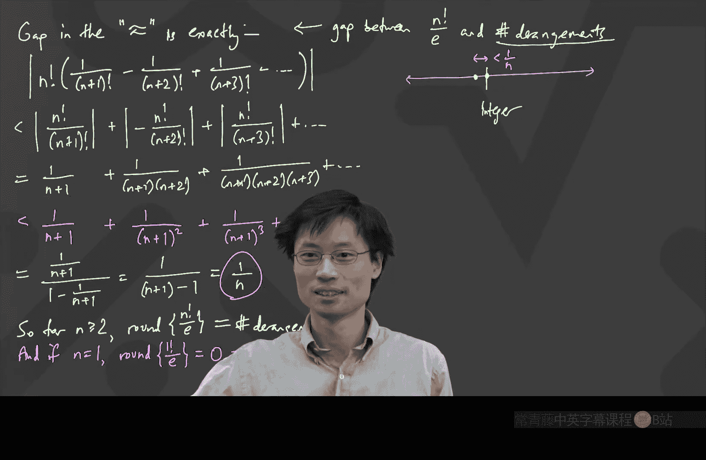

# 离散数学：P9：错位排列与容斥原理

在本节课中，我们将学习如何使用容斥原理来解决一个经典的组合计数问题——错位排列。我们将推导出计算错位排列数量的精确公式，并发现一个与自然常数 e 相关的惊人近似。

## 课程概述

上一节我们介绍了容斥原理，本节中我们来看看如何应用它来解决一个具体问题：计算错位排列的数量。错位排列是指一种排列，其中没有任何一个元素停留在其原始位置上。

## 错位排列的定义

首先，我们明确一下什么是错位排列。对于 n 个不同元素的集合，其所有可能的排列数量是 **n!**。一个错位排列是这些排列中的一个，它满足一个额外的条件：**没有任何元素留在其原始位置上**。

例如：
*   当 n=2 时，元素为 {1, 2}。唯一的错位排列是 (2, 1)。
*   当 n=3 时，元素为 {1, 2, 3}。错位排列有 (2, 3, 1) 和 (3, 1, 2)。

直接计算错位排列的数量很困难，因为选择会相互依赖。因此，我们需要借助容斥原理。

## 应用容斥原理

我们的目标是计算“所有元素都不在原位”的排列数。根据容斥原理，我们可以通过计算其对立面——“至少有一个元素在原位”的排列数——来间接求得。

我们定义一系列集合 A_i：
*   **A_1**: 所有满足“元素1留在原位”的排列集合（其他元素位置任意）。
*   **A_2**: 所有满足“元素2留在原位”的排列集合。
*   ...
*   **A_n**: 所有满足“元素n留在原位”的排列集合。

那么，至少有一个元素在原位的排列集合就是这些 A_i 的并集：**A_1 ∪ A_2 ∪ ... ∪ A_n**。错位排列的数量 D_n 就等于总排列数减去这个并集的大小：

**D_n = n! - |A_1 ∪ A_2 ∪ ... ∪ A_n|**

现在，我们使用容斥原理公式来计算这个并集的大小。

以下是容斥原理公式在本问题中的应用展开：

**|A_1 ∪ ... ∪ A_n| = Σ|A_i| - Σ|A_i ∩ A_j| + Σ|A_i ∩ A_j ∩ A_k| - ... + (-1)^{n+1} |A_1 ∩ ... ∩ A_n|**

接下来，我们逐项计算这些交集的大小。

## 计算交集大小

我们需要计算公式中每一项的具体值。

*   **单个集合的大小 |A_i|**：固定一个元素（例如元素 i）在原位，剩下的 n-1 个元素可以任意排列。因此，**|A_i| = (n-1)!**。这样的集合有 n 个，所以第一项总和为 **n × (n-1)!**。

*   **两两交集的大小 |A_i ∩ A_j|**：固定两个特定元素（例如 i 和 j）在原位，剩下的 n-2 个元素任意排列。因此，**|A_i ∩ A_j| = (n-2)!**。从 n 个元素中选出哪两个被固定，有 **C(n, 2)** 种选择。所以第二项总和为 **C(n, 2) × (n-2)!**。

*   **任意 k 个集合的交集大小**：同理，固定 k 个特定元素在原位，剩下的 n-k 个元素任意排列。因此，大小为 **(n-k)!**。选择哪 k 个元素被固定，有 **C(n, k)** 种方式。所以第 k 项的总和为 **C(n, k) × (n-k)!**。

我们可以将 **C(n, k) × (n-k)!** 重写为更简洁的形式：**n! / k!**。

将这些项代入容斥原理公式，我们得到并集的大小为：

**|A_1 ∪ ... ∪ A_n| = n!/1! - n!/2! + n!/3! - ... + (-1)^{n+1} n!/n!**

注意，我们这里将 **n × (n-1)!** 写成了 **n!/1!**。

## 推导错位排列公式

现在，我们将这个结果代回 D_n 的公式中：

**D_n = n! - [n!/1! - n!/2! + n!/3! - ... + (-1)^{n+1} n!/n!]**

为了形式统一，我们可以将开头的 n! 视为 **n!/0!**。整理后，得到错位排列数 D_n 的精确公式：

**D_n = n! × [1/0! - 1/1! + 1/2! - 1/3! + ... + (-1)^n / n!]**

这个公式是计算错位排列数量的精确解。

## 一个惊人的近似

观察上面的公式，中括号内的求和项看起来非常眼熟。它正是数学常数 **e^{-1}**（即 1/e）的泰勒级数展开式的前 n+1 项。

**e^{-1} = 1/0! - 1/1! + 1/2! - 1/3! + ...** （这是一个无穷级数）

因此，D_n 近似等于 **n! / e**。但这个近似有多好呢？让我们分析一下误差。

误差 E_n 是无穷级数被截断后忽略的部分：

**E_n = n! × [ (-1)^{n+1}/(n+1)! + (-1)^{n+2}/(n+2)! + ... ]**

我们关心的是这个误差的绝对值 **|E_n|**。利用三角不等式和放缩技巧（例如，用 **1/(n+1)^k** 替代分母更大的项），可以证明：

**|E_n| < n! × [1/(n+1) + 1/(n+1)^2 + 1/(n+1)^3 + ...]**

括号内是一个等比数列求和，其和小于 **1/n**（当 n ≥ 2 时）。因此，我们得到关键结论：

**|D_n - n!/e| < 1/n** （对于 n ≥ 2）

这意味着，**n!/e** 与整数 **D_n** 的差距小于 1/n。当 n ≥ 2 时，1/n ≤ 1/2，所以 **n!/e** 距离最近的整数（即 D_n）不到 0.5。因此，我们可以通过四舍五入得到精确值。

由此，我们得到一个优美而实用的结论：

**n 个元素的错位排列数 D_n，等于 n! / e 四舍五入到最接近的整数。**

对于 n=1 的情况，可以单独验证该结论同样成立。

## 本节总结

本节课中我们一起学习了：
1.  使用容斥原理将复杂的“错位排列”计数问题，转化为计算一系列“固定元素”集合的并集。
2.  通过系统计算交集大小，推导出了错位排列数 D_n 的精确求和公式：**D_n = n! × Σ_{k=0}^{n} (-1)^k / k!**。
3.  发现了该公式与 **e^{-1}** 的泰勒展开式的联系，并证明了近似值 **n! / e** 与真实整数解 D_n 的误差小于 1/n。
4.  最终得到了一个简洁有力的结论：**错位排列的数量，就是 n! 除以 e 后四舍五入得到的整数**。这个结果完美地展示了数学不同领域（组合数学与微积分）之间迷人的联系。