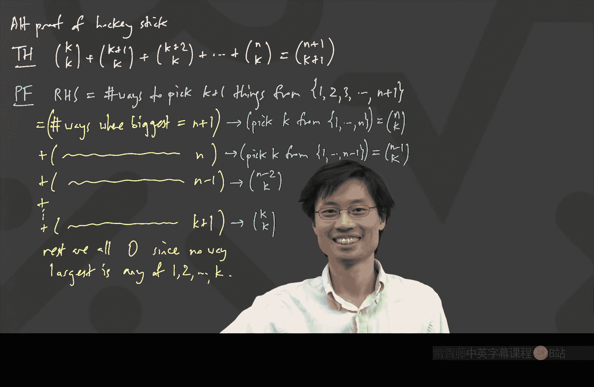

# 离散数学：第10讲：组合计数与帕斯卡三角 🔢


在本节课中，我们将要学习组合计数中的两个核心概念：“海盗分金”问题与帕斯卡三角（二项式系数）的恒等式。我们将通过多种方法证明这些恒等式，并理解它们之间的联系。

## 海盗与金币问题 🏴‍☠️

上一节我们介绍了容斥原理，本节中我们来看看一个经典的组合计数问题：海盗分金。问题描述如下：有 `N` 个海盗和 `K` 枚**无法区分**的金币。我们需要计算将这些金币全部分给海盗的方法数，其中允许某些海盗得到 `0` 枚金币。

### 方法一：隔板法

解决此类问题的一个经典方法是“隔板法”（也称为“星与棒”法）。我们可以将金币和隔板进行排列来形象化地表示分配方案。

以下是具体思路：
*   我们用点 `.` 代表金币。
*   我们用竖线 `|` 代表海盗之间的分隔。
*   一个排列对应一种分配方案。例如，对于 `6` 枚金币和 `4` 个海盗，排列 `...||..|.` 表示：第一个海盗得到 `3` 枚，第二个得到 `0` 枚，第三个得到 `2` 枚，第四个得到 `1` 枚。

在这种表示法中，我们总共有 `K` 个点和 `N-1` 个隔板。我们需要将它们全部排列。排列的总数等于从 `(K + N - 1)` 个位置中选择 `(N-1)` 个位置放置隔板（或等价地，选择 `K` 个位置放置点）的方法数。

因此，分配方法的总数为：
```
C(K + N - 1, N - 1) = C(K + N - 1, K)
```
其中 `C(n, k)` 表示二项式系数，即从 `n` 个不同元素中选取 `k` 个的组合数。

### 方法二：递归与归纳

我们也可以用递归的视角来看待这个问题。假设我们想知道将 `K` 枚金币分给 `N` 个海盗的方法数 `f(K, N)`。

我们可以考虑第一个海盗得到的金币数 `x`（`x` 可以从 `0` 到 `K`）。如果他得到了 `x` 枚，那么剩下的 `(K - x)` 枚金币需要分给剩下的 `(N-1)` 个海盗，方法数为 `f(K - x, N-1)`。

因此，我们有递归关系：
```
f(K, N) = Σ_{x=0}^{K} f(K - x, N-1)
```
其中 `f(m, 1) = 1`（所有金币给唯一的海盗），`f(m, 2) = m + 1`。

通过计算小规模案例（如 `N=3,4`），我们会发现结果符合二项式系数的形式：
```
f(K, 3) = C(K+2, 2)
f(K, 4) = C(K+3, 3)
```
这引导我们猜想通解为 `f(K, N) = C(K + N - 1, N - 1)`，这与隔板法的结论一致。

### 问题变体：每人至少一枚金币

如果要求每个海盗至少得到一枚金币，我们可以先给每个海盗预先分配一枚。这样，问题就转化为将剩下的 `(K - N)` 枚金币（如果 `K >= N`）分给 `N` 个海盗，且允许得到 `0` 枚。因此，方法数为：
```
C((K - N) + N - 1, N - 1) = C(K - 1, N - 1)
```

## 帕斯卡三角与恒等式 📐

“海盗分金”问题的解与帕斯卡三角（二项式系数表）紧密相关。帕斯卡三角本身蕴含了许多优美的恒等式。

### 帕斯卡递推恒等式

帕斯卡三角的构造基于以下基本恒等式，它说明了三角形中每个数是其上方两数之和：
```
C(n, k) + C(n, k+1) = C(n+1, k+1)
```
**证明**：考虑从 `(n+1)` 个元素中选取 `(k+1)` 个。我们可以分两类计数：第一类包含某个特定元素（比如最后一个），那么还需要从剩下 `n` 个中选 `k` 个，有 `C(n, k)` 种方法；第二类不包含这个特定元素，那么需要从剩下 `n` 个中选 `(k+1)` 个，有 `C(n, k+1)` 种方法。两类相加即得等式右边。

### 曲棍球棒恒等式

在帕斯卡三角中，如果我们沿一条斜线（例如所有 `C(i, 2)`）求和，结果等于这条斜线末端下方那个数。因其形状，这被称为“曲棍球棒恒等式”。
```
C(K, K) + C(K+1, K) + C(K+2, K) + ... + C(N, K) = C(N+1, K+1)
```
**证明1（数学归纳法）**：
*   **基础情况**：当 `N = K` 时，左边是 `C(K, K)=1`，右边是 `C(K+1, K+1)=1`，成立。
*   **归纳步骤**：假设对于某个 `N` 等式成立。考虑 `N+1` 的情况，左边和式为 `[C(K, K)+...+C(N, K)] + C(N+1, K)`。根据归纳假设，括号内等于 `C(N+1, K+1)`。再根据帕斯卡递推恒等式 `C(N+1, K+1) + C(N+1, K) = C(N+2, K+1)`，这就完成了证明。

**证明2（组合解释——计数两次）**：
等式右边 `C(N+1, K+1)` 表示从 `{1, 2, ..., N+1}` 中选取 `(K+1)` 个数的方法数。
我们可以根据所选集合中**最大的那个数**是多少来进行分类计数：
*   如果最大数是 `(K+1)`，那么剩下的 `K` 个数必须从 `{1, ..., K}` 中选，有 `C(K, K)` 种方法。
*   如果最大数是 `(K+2)`，那么剩下的 `K` 个数必须从 `{1, ..., K+1}` 中选，有 `C(K+1, K)` 种方法。
*   ...
*   如果最大数是 `(N+1)`，那么剩下的 `K` 个数必须从 `{1, ..., N}` 中选，有 `C(N, K)` 种方法。
将这些情况的方法数相加，就得到了等式的左边。注意，最大数不可能小于 `(K+1)`，因为那样无法选出 `(K+1)` 个数。

这个恒等式直接解释了为什么“海盗分金”的递归求和会得到二项式系数。

### 范德蒙德卷积恒等式

另一个重要的恒等式是范德蒙德卷积：
```
Σ_{i=0}^{r} C(m, i) * C(n, r-i) = C(m+n, r)
```
**证明（组合解释）**：
等式右边 `C(m+n, r)` 表示从一个有 `m` 个红球和 `n` 个蓝球的袋子中，总共取出 `r` 个球的方法数。
我们可以根据取出的 `r` 个球中有多少个红球（设为 `i`）来进行分类。对于固定的 `i`，取法数为：从 `m` 个红球中取 `i` 个 `[C(m, i)]`，乘以从 `n` 个蓝球中取 `(r-i)` 个 `[C(n, r-i)]`。对 `i` 从 `0` 到 `r` 求和，即得到左边，它覆盖了所有可能的情况。

## 总结 📝

本节课中我们一起学习了：
1.  **“海盗分金”问题**：通过**隔板法**和**递归归纳法**，我们得到了将 `K` 个无区别物品分给 `N` 个有区别容器的公式 `C(K+N-1, N-1)`，并讨论了每人至少一个的变体 `C(K-1, N-1)`。
2.  **帕斯卡三角恒等式**：
    *   **递推关系**：`C(n, k) + C(n, k+1) = C(n+1, k+1)`，这是三角构造的基础。
    *   **曲棍球棒恒等式**：`Σ_{i=K}^{N} C(i, K) = C(N+1, K+1)`，我们使用**归纳法**和**组合解释（按最大元素分类）**两种方法进行了证明。
    *   **范德蒙德卷积**：`Σ_{i} C(m, i)C(n, r-i) = C(m+n, r)`，其证明体现了**按子集重叠部分分类**的计数思想。



这些内容展示了组合数学中“计数两次”和“寻找巧妙一一对应”的核心证明技巧，并将看似不同的问题（分金币、选子集）通过二项式系数深刻地联系在了一起。