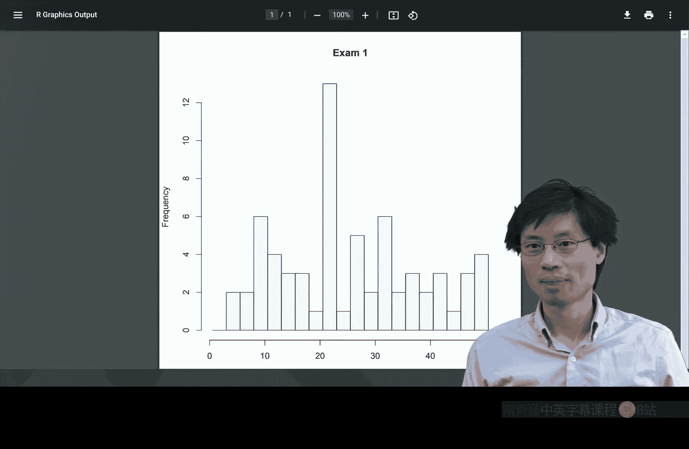

# 离散数学：第12讲：斐波那契数列与铺砖问题

在本节课中，我们将要学习一个新的计数主题，并探索一个著名的数列——斐波那契数列。我们将从一个具体的铺砖问题入手，推导出斐波那契数列，并学习如何用数学归纳法证明相关的结论。

## 课程引入与成绩说明

上一节我们介绍了课程的一些背景。本节中，我们来看看本次考试的成绩分布情况。

以下是本次考试的成绩分布图，它展示了学生们的得分情况。

从图中可以看出，大多数学生的得分集中在20分左右。本次考试的设计具有一定难度，部分题目旨在挑战学生。获得50%的分数实际上是非常不错的成绩。

关于评分，需要说明以下几点：
*   本次考试采用等级评分制，A、B、C的分数线大致如图所示。
*   本学期共有三次期中考试和一次期末考试，每次考试都是提升总成绩的机会。
*   评分时，部分得分基于对问题核心思路的理解。即使最终计算有误，只要思路正确，仍可能获得高分。
*   如果对评分有疑问，可以向助教申请重新审阅。

## 引入新主题：铺砖问题

现在，让我们进入课程的新单元。本节我们将探讨一个与计数相关的新问题。

我们的问题是：**有多少种方法，仅使用1x1的正方形砖块和1x2的多米诺骨牌，来铺满一个1xn的长条区域？**

以下是解决此类组合问题的一个有效策略。

面对这样的问题，一个很好的起点是研究小规模的情况。

*   **当 n=1 时**：只有1种铺法，即放一块正方形砖。`F(1) = 1`
*   **当 n=2 时**：有2种铺法。可以放两块正方形砖，或者放一块多米诺骨牌。`F(2) = 2`
*   **当 n=3 时**：有3种铺法。可以放三块正方形砖；或者先放一块多米诺骨牌再放一块正方形砖；或者先放一块正方形砖再放一块多米诺骨牌。`F(3) = 3`
*   **当 n=4 时**：我们通过分析最右侧的砖块来计数。情况一：最右侧是正方形砖。那么剩下的1x3区域有 `F(3)` 种铺法。情况二：最右侧是多米诺骨牌。那么剩下的1x2区域有 `F(2)` 种铺法。因此，总铺法为 `F(4) = F(3) + F(2) = 3 + 2 = 5`。

我们发现了递推关系。对于一般的 n，铺砖方法数 `F(n)` 满足：
`F(n) = F(n-1) + F(n-2)`
这正是斐波那契数列的递推关系。为了使序列从 `F(1)=1, F(2)=2` 开始更整齐，我们通常定义：
`F(0) = 0, F(1) = 1, F(2)=1, F(3)=2, F(4)=3, F(5)=5, ...`
这样，铺砖问题的解就是 `F(n+1)`。

## 用数学归纳法证明

上一节我们通过观察得到了结论。本节中，我们来看看如何用严谨的数学归纳法来证明它。

**命题**：铺满1xn区域的方案数等于斐波那契数 `F(n+1)`。

**证明**（使用强归纳法）：
*   **基础步骤**：
    *   当 n=1 时，铺法数为1，而 `F(2)=1`，成立。
    *   当 n=2 时，铺法数为2，而 `F(3)=2`，成立。
*   **归纳步骤**：
    *   假设对于所有小于 k 的正整数 m，命题都成立。即铺满1xm区域的方案数为 `F(m+1)`。
    *   考虑 n=k 的情况。观察最右侧的砖块，有两种互斥的情况：
        1.  最右侧是正方形砖：此砖固定，剩余1x(k-1)区域的铺法数，根据归纳假设，为 `F((k-1)+1) = F(k)`。
        2.  最右侧是多米诺骨牌：此骨牌固定，剩余1x(k-2)区域的铺法数，根据归纳假设，为 `F((k-2)+1) = F(k-1)`。
    *   因此，总铺法数为 `F(k) + F(k-1)`。
    *   根据斐波那契数列的定义，`F(k) + F(k-1) = F(k+1)`。
    *   所以，当 n=k 时，铺法数为 `F(k+1)`，命题成立。
由数学归纳法，命题对一切正整数 n 成立。

## 斐波那契数列的奇妙性质

斐波那契数列充满了有趣的模式。让我们来探索其中一个。

观察数列：`F0=0, F1=1, F2=1, F3=2, F4=3, F5=5, F6=8, F7=13, ...`
我们计算一些相邻项的乘积：
*   `F1 * F3 = 1 * 2 = 2`，而 `F2^2 + 1 = 1^2 + 1 = 2`。
*   `F3 * F5 = 2 * 5 = 10`，而 `F4^2 + 1 = 3^2 + 1 = 10`。
*   `F5 * F7 = 5 * 13 = 65`，而 `F6^2 + 1 = 8^2 + 1 = 65`。

这引出了一个猜想：对于奇数下标，有 `F_{n} * F_{n+2} = F_{n+1}^2 + 1`。
对于偶数下标，我们检查：
*   `F2 * F4 = 1 * 3 = 3`，而 `F3^2 - 1 = 2^2 - 1 = 3`。
*   `F4 * F6 = 3 * 8 = 24`，而 `F5^2 - 1 = 5^2 - 1 = 24`。

于是有另一个猜想：对于偶数下标，有 `F_{n} * F_{n+2} = F_{n+1}^2 - 1`。

## 尝试证明性质

我们尝试用归纳法证明奇数下标的情况。命题为：对奇数 k，`F_k * F_{k+2} = F_{k+1}^2 + 1`。

我们以 k=7 为例，展示证明思路，此思路可推广到任意奇数。
我们要证：`F7 * F9 = F8^2 + 1`。
利用斐波那契递推式展开：
`F7 = F5 + F6`
`F9 = F7 + F8`
`F8 = F6 + F7`
代入左式得：`(F5 + F6)(F7 + F8)`
利用归纳假设（假设对更小的奇数成立）：
*   `F5 * F7 = F6^2 + 1`
*   `F6 * F8 = F7^2 - 1` （这里用到了偶数下标性质，说明证明需要同时处理奇偶两种情况）
经过代换和代数化简，最终可以验证等式成立。这个具体推导过程展示了如何通过强归纳法，将关于较大索引的命题转化为关于较小索引的已知命题，从而完成证明。完整的证明需要对奇数和偶数下标分别建立归纳基础并进行推导。

本节课中我们一起学习了斐波那契数列如何从一个具体的铺砖问题中自然产生，并学习了如何使用数学归纳法来证明与之相关的计数公式。我们还探索了斐波那契数列内部一个优美的乘积性质，并初步了解了其证明思路。下节课我们将看到证明这个性质的另一种方法。

