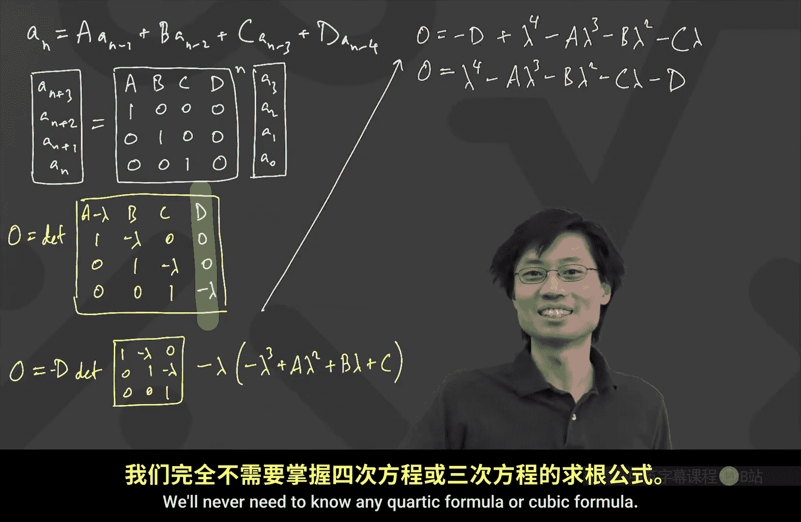

# 卡耐基梅隆【中英⚡离散数学｜21-228 2023, Discrete Mathematics】 p16 P16 -BV1sFibBkEj7_p16-

Hey guys， I decided to try to be on time today。Okay， well， let's continue doing what we're doing。

 I want to go and finish up this interesting result on recurrences where we're going to use the matrices and the linear algebra to go and finish this up。

😊，Okay， so let me switch to the blackboard one second。

Here we go。Okay， so just a quick review of where we were from last time。

 what we had found out is we said， look， let's think about this is just going to be a very quick from the top。

 I'm doing it so that we get very comfortable with the methods。

 but suppose I have a recursion then the recursion is something like A N is equal to A A N minus-1 that was capital A A N minus-1 plus capital B。

 A N minus2 plus capital C A n minus3。😊，The big idea was just to go and multiply matrices again。

 And with this thing， we could say that if I took this time， I'm going to run it as A N plus 2。

A and plus 1。Beian。Last time we did it with A N plus 1， A and， A N -1。

 The result would have been the same， but I've gotten this guy。

 and I can rewrite this guy as we did a matrix product。 And the matrix that we had was the ABC。😊，1，0。

0。0，1，0 matrix raised to the power N times this would be a 2， a1， a 0。And then the big game became。

 let's go and figure out how to take the power of this matrix。 and to take the power of this matrix。

 we wanted to turn it diagonal again。 And the way that we tried to turn it diagonal is we said。

 let's look for。Some lambmbdas and some V's。 It's like lambda 1 and a vector V1。

All the way to a lambda 3。And a vector， V3。And we wanted to find these lambmbdas and these vectors。

 for which we had the following situation。 We wanted to have that if I took ABC。1，0，0，0，1，0。

If I took that and I multiplied it by the vector， like say v1， for example。

 but this would be true for all values of 1， so v1， v2 and v3。

 and this is supposed to be equal to lambda 1 times v1 and so on。😊。

And the reason that this was important is because then we could write some interesting matrix product。

 then we could find。So。It would turn out that if I took the ABC and this I'm just reviewing。

 we've done this a bunch of times before， but because I know that a lot of people only either recently learned this matrix stuff or is fresh。

 I just want to keep doing it because it's neat and after you see it this many times you won't ever forget like this is why you care about writing about finding vectors for which matrix times vector is a multiple of the vector。

😊，I'm going to draw this as V1， V2， V3。As columns。Annotated like this。Okay， this thing is equal to。

The same V1， V2， V3。As columns。But now multiplied by your diagonal matrix， which is the Cs。Sorry。

 the lambdas， Lambda 1， Lada 2 and Lada 3。And the rest of the stuff is 0。Okay。

 and where we got to last time was， how do we know we can multiply by the inverse of this matrix。

 It would be great to multiply by the inverse of the matrix。

 And the fun fact is that if the lambmbdas are all distinct。

 you can always multiply by the inverse of the matrix。 So here's a neat fact。😊。

We won't completely prove the neat fact， butll I'll relate it to something else。

 That's also a neat fact that we could actually go and show if we had more time。

 The neat fact is if the Lada 1， Lambda 2 and Lambda 3 are distinct。Then， this star matrix。

Is invertible。Okay， and finding out that the star matrix is invertible is actually related to showing that there is no way to make a linear combination of the V1 V2 V3 that happens to give you。

a 0 vector。 Okay， and so why was this true， We had some， actually， Subbashi show this last time。

 some way that you could do this for3。 I'll show you a way that's related to how you do it。

 in general。The way this is is because what would that mean？Proof。Of。

I'll write proofing quotes because we're going to rely on something else。

 but we'll rely on something else that's also well known。 The proofing quotes of this neat fact。

What we do is we say， well， assume for sake of contradiction that it's not invertible。So， assume。

That not invertible。Actually， then there's some stuff from matrices that tells you that if a matrix is not invertible。

 then there's a way actually to write。A linear combination of the of the columns。

 meaning like a C 1 times the V1， A C 2 times the V2 plus a C 3 times the V3。

 So that that linear combination of the columns adds up to 0。And not only are there some C1， C2 C 3。

 but actually， this C1， C2， C 3 are not all0。There are some。Constance。C，1， C，2。C，3。Not all 0。

So that if I wrote C1 times this V1。Plus， C2 times the V2。Plus， the C3 times the V3。This is the 0，0。

0。 And here's where we sort of got to last time。 And we had a interesting proof of of what to do next。

But here I want to do it with actually more matrices。So one way I can think of this is。

I actually first want to think about what happens if I take this guy and I multiply on the left by this matrix。

 this ABC matrix， which we call M。This ABC matrix here is what we called。Oh。

 I don't want to use another pink。 Let's use this white one。This matrix was M。

If I multiply on the left by M for this， actually it's really nice because when you multiply m against v1。

 you just get lambda 1 times v1。Okay， so what I'm gonna to do is I'm going to multiply on the left by M。

 and I'll just get like C 1 times lambda 1 times this v thing plus C2 times lambda 2 times this V2 thing。

 plus C3 times lambda 3 times the V3 thing。 The important thing is。

 if I multiply in a lambda from the left。 Then sorry， multiply an M from the left。

 The M hitting a V something gives me the lambda something times the v something。

 It just rescales it。 It's really nice。😊，So let's do that a couple of times。

I'm first going rewrite this piece up onto to the next screen。The C，1， V wanted it。Okay。

 so I know that the C1 times。V1。Plus， a C2 times a V2。Plus， a C3 times a V 3。That's equal to 0，0，0。

But what else I also know is I know that if I took an M。Multiplied by V Anything。

 Let's just write V 2。That's just gonna give you a lambda 2 times your V2。That's really nice。

 So whack it by the M on the left。So what happened here is you just left multiply。By the end。Okay。

 if I do that， I'm going to get the C1 is just a number。 So it's just like， if C1 was like 50。

 It's just like 50 times whatever happens when I take the M times the V1。

 which is lambda1 times the V1。 So that means that I'll just get the C1 and a lambda1。😊，Actually。

 I'm gonna put them in the。 I'll leave them this way。 C run， Lambda1 times this V1。Plus， C，2。

 lambmbda 2。Times this V，2。Plus， C，3。Lambda 3 times this V 3。And that's equal to 0，0，0。

I want something that's going to look sort of like a pattern。 So I'm actually going to do it again。

 I'm going to left multiply one more time by this， by this M。So I'll do it again。

And I'll get actually， if you think about what happens， I have like a C 1 and a lambda 1。

 These are just some numbers that are just multiplying my vector by some length。

 The real interesting thing happens when the M hits the vector and when the M hits the vector， Oh。

 is still V1。 So M times V1 is giving me a lambda 1。

 Can anyone tell me what would be in front on here just to make sure people are following。😊。

If I do it again， what kind of an equation am I getting。Thomas。You just get。

All lambmbdas are squared。 Yeah， is lambda 1 squared times v1， because what just happened is that。

 you know， the C1 and V1， They were just like some numbers like 3 and 17 or something。

3 times 17 times a vector。 That's like how much you're scaling it。 Oh， I want times。

 I want to have M times that。 So that means that I'm just going also scale that vector by another lambda 1 as well。

😊，And there's a C， lambda 2 squared V2。Plus， C 3， lambmbda 3 squared V 3。Equals 0，0，0。Now。

 there's a reason I did all of this。 It's because actually。

 all of this can be written as some kind of a three by three matrix product。And what do I mean。Well。

 let's look at this first thing。 Okay， or actually， the first thing is hard to。

 hard to guess what the matrix product would be。 Let me look at the third  one。

 The third 1 I can get something interesting out of。This third one。

I can rewrite as a product of a matrix and a vector。And the matrix I want。 Let's。

 let's get started with is。 I want someone else to help me finish it。

 But the matrix is going to have this columns。 I wrote this a little bit wider because I need some more space。

 In fact， the columns I want are C 1 is a number， scaling the first vector V1。😊，And then， I went。

C 2 is a number。Scaling the second vector V2， which is a vertical column。And then I want C3。

 which is a number scaling the third vector， which is a column。Okay。

 so I wrote this as a square because it is a legitimate square。 What just happened here is I said。

 the V1 is a vector， It3 tall， and the C1 is a number。 maybe it's 5。

 And that just means I take that vector and I just scale everything by 5。

I claim that if I took this thing。And multiplied it by a certain column。That's equal to 0，0，0。

Can anyone help me fill in what that column would be。This is about matrix multiplication。

How does this work。We have a bunch of people， Jack。I believe it's lambda1 squared at the top。

Lambda 1 squared at the top， then lambmbda 2 squared next and then going down to Lada 3。Yeah。

 so this is all the squares。 Lambda 2 squared and Lada 3 squared。 I want to pause for a second and。

 and like digest what just happened here。 See， the reason why this works is because if you look at what this sum。

 this left hand side is， I just have like some numbers， C 1， lambda 1 squared。 Okay。

 But what would the， what would like the top element of this first thing be Because this left side is like something plus something plus something。

 And let's look at the top element of the left side。

 The top element of the left side is just going to be C1。

 Lada 1 squared times the top thing in the V1 plus C 2。

 Lada 2 squared times the top thing in the V 2 plus C 3。

 Lada 3 squared times the top thing in the V 3。😊，Oh。That's actually exactly what this is doing。

 because if you do the matrix product， you grab this guy and you put it across the top。

 And what you get is you get the lambda1 squared times the C1 times the top thing in the Vva。😊。

That sort of makes sense。It's actually really neat what matrices that you do。

 Marices are just ways that let you organize。 If you have repeated stuff happening。

 It organizes it all in a way where you can say， yeah， all this complicated stuff。

 All I'm doing is I'm just saying。😊，I want to have this lambda 2 squared， all these squares。

 Lambda squares to line up against all of these pieces of the vector V。Now， why did I do that。

 I did that， Because this is the easiest one to see what comes from here。

I wanna do that for the second one， too。Now， I'm going to clear out some space。Well， the second one。

I can also write something。Can someone help me out。

 What would the second one give me if I wanted to write it as a big square thing。

Times a column thing。Equals another column thing。I want to see if people are following。

 What can I do here。Is it。😊，Would that be again C1 V1， C2 v2 and C3 V3。

 and on the3 by1 matrix it will be Londono and， Londonnda2 and number 3。Yeah。

 and then this is just going to be lambda 1， Lambda 2 and Lada 3。Okay， and 0，0，0。

HaSo I just did that for here。For completeness， I think I would like to do something up there， too。

Any ideas。What would be a reasonable thing to do for this first thing。Breden。

We could write that as the C1 B1， C2 B2 and C3 B3 matrix times the vector 111 is equal to 000。

 Yeah let's hit it with 111 that one works。That's 0，0，0。Okay。Now。

 why did I go through all that effort。Advit。So you just found， so since all the lambdas are distinct。

 right， all the lambdas are distinct， Yes， they are。

 Now you found three completely different independent vectors that get mapped to 0 when you hit it with that C1 V1。

 C2 V2， C 3 V3 matrix。 And that means it has to be the0 matrix。😊，Yes， thank you for the drama。 So。

 so basically， what's going on is that these three are like very different vectors。

 So there's something about like， if I have a three by three matrix， and I take like three。

 what are called linearly independent vectors and you multiply them in， and you're all getting0。😊。

That actually tells you that the solution space of that matrix times vector equals 0 has all three dimensions。

 Actually， that means that that matrix is invertible。 There's another way to see this。

 I wrote this in a way because I want to tell you another interesting fact。 This is the fun fact。

 So if I went and like， let's put that one matrix。 I can write the whole thing as a ginormous matrix product。

😊，This times this is equal to this。So I have a lot of space。

 Can anyone help me fill this space there's a reason I'm doing this actually。

 it's because I want to relate different areas of math together。What a said， by the way， is true。

 the fact that somehow this 1，1，1， Lambda 1， Lada 2， lambda 3 and then the squares。

 they're all like independent。 Then that means that the matrix in front is actually the0 matrix。

 which is awesome， Chris。😊，So do C1， V1， C2， B2， C3， V3， and then stack。1，1，1。

 Lambdas stacked and then lambda squared。 Yes， let's stack Lambda 1， Lada 2， lambda 3。

Lambda 1 squared， Lada 2 squared。 Lambda 3 squared。Okay。And what's that equal to if I multiply？Well。

0， all zeros， all zeros。 Because remember， the matrix multiplication is if I have the same matrix multiplied by different columns。

 and I slap all the columns together， which is what we just did here。😊。

If you slap all the columns together， the output will be the three outputs slapped together。

 or but all the outputs were0。No。The reason this is nice is because you see what。

 what ave said about how these are three independent vectors。

 There's actually that's one of the facts。 That's the fact I wanted to use。

 I wanted to just draw attention to the fact that this particular matrix is famous。 and it should be。

 It looks nice 1，1，1， Lada 1， Lada 1， Lada 1， Lada 2， Lada 3 and then the squares。 It looks so nice。

 Surely somebody has studied this before。 And there is somebody who studied it before。

 It's called the Van demond matrix。😊，We've seen that name before， by the way， Vandermond。

 there was also this Van deman's convolution， which was some interesting way of like multiplying things binomial coefficients together。

 At this point， you're probably like Vandermon's a genius。 He must be some great mathematician。

 It's actually quite interesting。 If you look up his Wikipedia page。 Obviously， that must be true。

 right， It says that he was a violinist。 And apparently， he got into math later in life。 But he did。

 know， did， he has done two very well known things。

 one about like binomial chooses and one about these matrices。 And in particular。

 this particular matrix is invertible。😊，In fact， actually， real fun fact， not use。 I mean。

 we won't need it for this class， but it's just like nice for you to know。

 the determinant of this matrix is incredibly nice。😊，That's called the Vdermont determinant。

 And if you'd have a matrix which just like ones， Lambdas， Lada to the next powers。

 and you can have like end by end of this form。Actually， the determinant。

I'll write the determinant of this particular one is it's just Lada 2 minus lambda 1。

Lambda 3 minus lambda 1， Lada 3 minus lambda 2。It factors。

 It factors into all these differences between lambmbdas， and that's extremely satisfying。

 by the way。Because when's the determinant 0。For this thing with like la， this。

 this particular matrix with bunch of lambdas， when is that determinant 0， a it。When one of the。

 when the lambdas are the same or like two of them。 whenever you have two equal lambdas。

 then if you look at that matrix， you're like， well， yeah， I got， then， you know， two equal rows。

 So the determinant is 0 bam。 But if you look at this factorization。 If you've got two equal lambdas。

 this is finding all the ways to find two different lambdas and subtract them。

 So this is a very beautiful fact。 This Bdermon determinant。 However。

 the punch line is that darn thing is invertible because the lambdas are distinct。

 So this is invertible。 So you could just multiply by its inverse and conclude。😊，That the C1， V1。

 C2 V2 C3， V3 is the0 matrix。Okay， so that's like this is the fact that we use that with the Vdermon determinant。

 but that's like a computational fact that's just true of any time you write a matrix of this form。

So that implies multiply， like so multiply。By it's。Inverse。Boom， once you do that。

 multiply by a tinverse。 the whole thing is gone。And I now get that。The C thing is all0。

 How does that finish our proof。Remember what we were trying to do。 Oh。

 is saying did you want to add something or say something or or finish it。Well that was before。

 But if we see it， I mean like C1 and C 2 C2 R 0， which contradicts like that they're not all zero。

 Yeah， yeah， that's it。 That's it。 Remember， we， we started off by saying， assume that the C1， C 2。

 C 3， not all 0。 Look， how in the world can you make this thing equal to the0。 Well。

 there was one thing we assumed， which was that the Vs are not like all 0。 right。

 So the V we assumed the V1 is not all 0。 If the V1 is not all 0， the only way you can get C 1。

 V1 to give you0s is for C 1 to be 0。 So actually with this one with one flash， you get that the C 1。

 C2， C3， they're all 0。😊，But finishes this。And I right， since。We assumed。That the Vs。Let's call it V。

 I。Are not。0，0，0。Thus。All of the sea run。I'll call all the sea ice。A equal to 0。Boom， okay。

 so that's actually the theory behind like， if I happen to have distinct lambdas， like。

 I will get to invert the matrix。 And the one piece that we use is this like magic van demon determinant。

 which， you know， that's actually like just， just some numbers that you could play with if you wanted to。

 Okay， so now we're ready to go and get the the magic formula for what happens with these three term linear recurrences。

😊，Three term linear recurrence。 we now know we can go ahead and invert as long as the lambdas are distinct。

 And that's what we we'll be doing。 we'll be finding results for if they' are distinct in this section。

 And in the next section， we're going to deal with the case when you have repeated。Okay。

 so now the only question become the only game in town becomes， what lambdas can I use。

 So that's where we want to know now， How do you get this lambda equation to work。

 How can you find lambdas so that you have not all 0 V's that make this work。 Well。

 we saw that last time。 That was where you said that's the same as this matrix equals。 sorry。

 this matrix times the V equals like lambdas on the diagonal times the same V。😊。

Are people with me on that， because now we're just gonna sub that all。

 and we're gonna get a deterant equation。Okay， now it boils down to。When。If I took。This ABC。1，0，0，0。

1，0。When if I take this thing， times a V。It's equal to lambmbda Tspe。 And again。

 I'm going to write the lambda as the lambda on the diagonal。 Now they're all the same lambda。

 because I just want to know which lambda make it possible for this to have not all0 solution for V。

 when this has solution。😊，With。The V。Not equal to 0，0，0。 And I hope this also gave some color。

 Then for why I care about the V not being the 0，0，0。

 It was extraordinarily powerful in that last bit of the last proof where we just use bam。

 The V's are not all 0。 That's why those C's are all 0。😊，Well， for this week， we did this before。Oh。

 I have a bad habit of when things are 0。 I just don't write them in the matrix。

 but I'll put back the zeros。 Okay， so that's there。 And now I， let's。

 let's just do what we did before you subtract off， right， The answer is exactly when。

You take the determinant of。You now subtract the matrix on the right from the matrix on the left。

 And you got a minus lambda。B。C，1， negative lambda 0，0，1， negative lambda。

Exactly when that's equal to 0。 Okay， now， how do you take the determinant of a 3 by3 matrix。

There is this like funky trick you can use that some people learn in school。

 which works for three by three matrices。 and I think it's not a reasonable tool。

 I don't know if anyone seen this before。 you like write two more copies of the columns over there and you just kind of like draw these things across and those things across and multiply。

 That's actually a very bad formula to use because it absolutely does not generalize。😊。

Or that symmetric gaus elimination thing。 Yeah， yeah， yeah。 we can do cofactors。

 We can do gaus elimination。 Let's do cofactors。 Okay。

 Cofactors means we kind of go across a row or a column。

 Any preference of which where you want to cofactor this thing。😊，Cofactor。

 the easiest way to think of it is like I'll just go across the top。

 I I'll take that thing multiplied by what happens if I block off those two pieces and determineinate the rest。

 right， That's what you always do。Third column， Third column。 Let's go on on third column。

 So we will take the determinant。Where we go along the third column。Now。

 whenever you do this cofactor expansion， what happens is you will go through the column and you will say。

 let's take this first guy。 I multiply by what I get of the determinant When I block off the row it's on and the column it's on。

 and there's a plus or a minus that I use。 And in fact， if I use the third column。

 this is going to be with a plus up there。 Like the pattern for the determin determinant of of the thing that we do。

 the determinant。😊，Let's call it the sign pattern。It's just a ch board。

It's like plus on the top left， and minus plus。Minus plus minus plus minus plus。

 Are people familiar with this kind of an idea。 It's like when you're doing the cofactor expansion。

 you decide on one row or one column to go on。 And then as you go along it。

 you go and use the sign times that particular number multiplied by the determinant of after you block off that piece。

Determine Ning。 Yeah， I'm trying to figure out what is the right verb for this。 I I I， I。

 I said it in my Putnam class。 I couldn't find a good verb for determininginating something or whatever。

 But let's keep going。 So， so what， what do we do here， determination， Actually。

 I think that's right。 You guys did come up with that in my class。

 There were some people who came up with the idea to call it。 We are going to determine a。😊。

We are determined to determine。 forgett it。 Okay， so let's keep going。

 So that this is gonna be C times the determinant of the inside。 Okay。

 so this is going to be C times the determinant of 1 negative lambda 0，1。😊，And then it's going to be。

 oh， the 0。 I love 0。 forgett the0 is gone。 No more 0。 So then we don't worry about that term。

 And then the last thing is just gonna be a plus。😊，A negative lambda。

Times the determinant of you block off that。 You block off， block off the bottom row。

 block off the right column， and you get a minus lambda B。1， and negative lambda， who。What's this？

Well， it's supposed to be 0。 Okay， so now let's determine the， the， the， the， the two by twos。

 I'll do the first one。 That's easy。 That's C times 1。 Okay， this is just C。Plus。

 negative lambda at times。 Can someone tell me what to put there？ What's the next one。

You guys are great。😊，Yeah。What do I put on the second one。Mus lambda times something。Rs had this in。

Minus Lada times a minus Lada minus B， okay。Okay， and then minus B。 now I have to do some expanding。

 Okay， so this is C plus negative lambda times。 Okay， negative lambda a。Plus， lambda squared。

 minus B。Okay。And now， let's continue cleaning this up。 So I get C。Plus， what is this。

 So I got a lambda squared a。I got a minus lambda cubed。And I get a plus。兰德比。Well。

 let's tidy this up。 Let's just take this thing and like rearrange it as a normal polynomial where you might have a lambda cubed。

Okay， and。Actually， I like to have my polynomials where the sign on the lambda cubed on the biggest term is positive。

What is this， Can someone tell me what I'll get if I rewrote this thing as lambmbda cubed， blah。

 blah， blah equals 0。 I'm going to multiply left and right by negative one， and do some rearranging。

I'm supposed to get a polynomial in Lambda。 I want to know like which lambmbdas will work。

 I hope I can find three different ones。 And I need to say that I got a polynomial just to solve for。

 for， for like for lambmbda。What is that polynomial。Bd。

It comes up to be lambda cubed minus lambda square A Okay。

 so I'm going to rewrite it as a lambda squared， all right， because yeah a。minusus lambda B。 Yep。

 I'm going to flip that around ahu。minus。Bam， that's cool。 wait a second。 This is。

 this is just like too nice。 So when you go， when you get to hear you're like， what。

 So we did all this crazy work。 And it turns out that is this nice。

 That's why people teach these like linear recursions。

 Because remember when we did it for the two term1。 What was the two term1。

 it was just lambda squared minus a lambda minus B。😊，Oh。

 the three term1 is lambmbda cubed minus a Lada squared minus B， Lambda minus C。 Actually。

 by engineers induction。 We now know what it is for all of them。 If we had done this for 7。

 we know for sure。 but3 is3 is good enough。 So so actually， this is neat。

 This is actually the fundamental theorem of like these linear recurrences。

 Now all the stuff that we have done。 that's just the theory that justifies this fact。

 I will not actually be putting on the exam that you have to know all of the linear algebra stuff。

 But I just can't possibly teach this class where I just say， hey， everyone magic formula。

 that's how it works。 No， no， no， hopefully you had at least saw some other stuff and saw that Vandermond was cool。

 And he plays the violin。 But let's keep going。 So we got this thing。

 and we just need to know the roots。 right， So if you found this guy， like here's how you solve it。

 threeterm linear recurrence， get this thing。 and suppose it has three distinct roots。 Oh。

 then you get to invert the matrix。 then but now we got to do the blob math。 Okay， So so far。

 what have we found。 What have we found is that for the A and equals capital A A and-1 plus capital B。

 a。😊，And -2 plus capital C， A and -3。 What we saw was， okay， there's going to be some polynomial。So。

The polynomial。呃。Equation。没有。I'll just call it roots of polynomial。 Okay。

 because I want to have enough space to write some stuff。 So roots。Of a polynomial， lambmbda cubed。

Minus a lambda squared， minus B， lambda minus oops， minus C。Now。

 you see why I chose to write A times a and -1 plus B times A and -2 is because it just goes in the same order。

 Alright， if you change the way you indexed over here， if you wrote A times A and -3 and so on。

 then this won't be as nicely ordered。Okay， find the roots of the polynomial if they're distinct。

If the roots。Are distinct。 Oh， by the way， how many roots do we expect。 It's a polynomial。

 is a third degree polynomial。 We all memorize the cubic formula， right， So that's how you do this。

 Actually， none of us day Then it's too much of a mouthful。 And that's also by generally。

 this is not really used for like go solve this recurrence by using the cubic formula。 No。

 it's the theory is the important thing to know that we can get to this point。

 And sometimes like if you， if you're actually solving these things。

 If there's some observation that there's a root。 Like if you already know one of the roots of this cubic。

 then you can， you know， you have a quadratic laptops， you factor it out。😊。

But just continuing on this， if the roots are distinct， you should get three roots。

 If the roots are distinct， Lada 1， Lambda 2 and Lada 3。Then the magic happens。

 Then we got to invert that matrix， right， Then what I found out is that if I take this。😊，ABc。1，0，0。

0，1，0。Then this thing， after I invert that matrix is sun matrix P。Times the diagonal matrix。

Which is just lambda 1。Lambda 2， Lambda 3。Times the P inverse。And this is zero。

Zeros all around Attis。O。Blob math tag。Wait， Bradon。

 did you just raise your handle without from before。I was from before。 I was from before。 sorry。

 I just， I， I lost track。 Let me keep going。Now what happens next。 Oh， yeah。

 I need to take this to the end power， right， So what I now know is A N plus 2， A N plus 1， A N。

This guy。Is equal to power the guy。 So I have this P。That's what survives here。 P。

 If I power the lambda diagonal matrix， this is lambda 1 to the N。Lambda 2 to the N。

 Lambda 3 to the N。A trick is sometimes if you expect a lot of mass in the matrix。

 draw the big things first and then draw the box for the matrix instead of trying to squeeze everything in。

R to the， Oh yeah， I already raised it to the power N。 And then times the P inverse。Times this a 2。

 a 1。A0。Now， can anyone help me walk through the blood math to figure out a nice formula for A。

The teaching assistants were asking， you know， as they were as they were preparing for yesterday's recitation。

 do we need to show everyone how to take inverses of matrices？ And I said， no。

 because we're using bb math。 And so in this class， we never have to invert any matrices。

 We're too lazy to do that。😊，Yes， Abby。We can multiply the P inverse by the A 2。

 A1 and A0 because those are all just constants。 Yes。

 and that becomes like a three tall columns three tall Yeah， three blobs Go it。 Now what。

And then when we multiply that by our lambmbda diagonal。

 that just becomes another three tall where we have。Bloob coefficients on those lambmbda。 Yes， okay。

 Lambda 1 to the n。 blob lambda 2 to the N， blob lambda 3 to the N。Okay。And now let's finish。

 Now what happens。And then the last step is you have I think it's again， like a three tall。

Each is just a sum of our blob Times Lands， yes。Perfect， so these are all like blob times lambdas。😊。

Plus， I I now， now I've just defeated what I told you， which is draw the。

 draw the stuff first and then write the stuff first and then draw the box。 But the problem is。

 I didn't have enough space in the first place。 Okay， so it's all of those。 Okay。

 that thing and then like similar。 I'm not gonna write the word same because they're not all equal。

But now we're in great shape， because what we have just found out is that I have a formula for A N。

 A N is the bottom thing。 So we just found out that the way you solve all these things。

 you take the roots of the polynomial。 You hope that they're all distinct。

 And if they're all distinct， then you have a nice a nice formula。 for sure。 if they're all distinct。

 you're guaranteed there's a nice formula。😊，And then that tells you， so for。Any and。

I know that A N is equal to something， some blobble， we can give it a name now。 Okay。

 so the blob is now called alphapha Alpha times lambda1 to the N。Plus， beta。

Times lambda 2 to the N plus gamma times lambda 3 to the N。For some constants。Alpha。Beta， gamma。

 independent of N。Okay。Now， what。 Now， how do you finish。

So we now know that we've got this general formula for all ANs。How do I finish from here。Van Kash。

You could just plug in really convenient， like lower level ends like0 a12 then solve alpha。

 And I want to show you something nifty that happens。 Okay。

 so I now to solve that just I go pick any three ends。 usually it 0，1 and 2。

 something something simple。 Okay， so I' I'll have I'll have like three equations and three unknowns for alpha beta and gamma。

 Does that make sense。 I want to find my alpha beta and gamma。 put in three equations，3 unknowns。

 I'm actually gonna write the three equations and three unknowns on the next screen。😊，Okay。

 so what I now know is you plug in。N equals 0，1，2， but really， any three will do。 But the 0，1。

2 is going to be nifty。 I'll find out that a 0 is equal to alpha times O， okay。

 it's going to be lambda 1 to the power 0。😊，Oops。Lambda 1 to the power 0 plus beta。

Lambda 2 to the0 plus gamma， Lambda 3 to the0。I have a 2 whoops， A1。

Is equal to alpha times lambda 1 to the one plus beta。

Times lambda 2 to the one plus gamma times Lada 3 to the1。

 And I have a 3 is equal to alpha times lambda 1。😊，Squared。

 what did I do is a2 equals a2 equals a2 equals this plus beta times lambda 2 squared plus gamma times lambda 3 squared。

 Remember， what are your equations and what are your unknowns。 Okay， remember that these lambdas are。

 We know them now。 you， you presumably we use the cubic equation。 We got the lambdas。

 They're actually like legit numbers。 The question marks that we don't know is we're solving for the alphas。

 betas and gammas。 These are the things we don't know。 everything else written is like known known。

 It's like we got those like 1 plus root 5 over2s。 we got we got like whatever the a 1， a2， a 0。

 are those are legit numbers。 It's like the blue stuff。😊，Blues are the unknowns。Hey， fun question。

 How do you know that this is actually even solvable， Isn't it kind of scary。

 If I've got three equations and three unknowns， I don't always know thiss a solution。

 Sometimes there's no solution。 It's possible， except there's a good reason， actually over here。

 Why this always has a solution。And it's， it's one reason why I showed you something else earlier today。

 I it。lookss a lot like that Vdermond matrix again。 Oh my gosh， Vandermon's back。 Yes。

 the Vdermont matrix appears twice today。 It's like it appeared in the previous thing of like， hey。

 how do I know that I can actually invert those eigen sorry， those those V1 V2 V3。

 How do I know I can invert those。 actually， It's back。

 I can write this whole thing as some matrix equation， Right， Because I'm solving for the unknowns。

 The unknowns are alpha beta gamma， So this is actually equivalent to。 That's why matrices are fun。

 If I got this thing， I can rewrite it as。😊，Equivalent。2， well。

 we always like to write our matrices as like a big3 by3。Times， the unknowns。

And the unknowns are alpha， beta and gamma。Equals。The right hand side。

Can someone tell me exactly what to write here。It might be， is it the vendermon。

 It might be a transpose or something， or who knows， We'll find out。What。

 what do we got to help help， help me put this thing in and tell me what that is。这假。Sure， alright。

 we have alpha， alpha alpha。后的No no， no no no no， that that's the wrong way。 Okay， yeah。Yeah。

 we have alpha and then we have。Do you wanna write an alpha here， I that it or no。

But what do you want to write there。 That's the question。 Oh， oh。

 you already have the there no problem's。Okay okay， okay， no problem。嗯。又要。It's。

 isn't it just the transpose。 Yes， it is。 It is is No no don't worry， don't worry。

 like this is this is hard stuff。 Okay， weve just did a whole lot of crazy stuff today。

 This is the lambda 1 to the 0， which is actually1。 And then this is going to be lambda 2 to the0。

 which is also1。 And this is lambda 3 to the 0， which is also  one。 because that's your top row。

 right， You take these three guys multiply by those three guys。 And that's supposed to be a 0。

 whatever that is。😊，Then the second row is going to be with the coefficients Lambda 1 to the one。

 So this is Lada 1 to the 1， Lambda 2 to the1， Lambda 3 to the1。 And then the next one is lambmbda 1。

😊，To the squared lambda 2， squared， lambda 3 squared， and those equal a 0， a1， a2。And actually。

 one thing from matrixes matrices is that if you have a matrix， it's invertible。

 exactly when it's transposed is also invertible。 These things are all related。

 That's something related to the rank of a matrix。 But we won't go deeper into that today。

 But it's just like the reason why this is invertible。 It's the same thing。 It's that Vdermond again。

 And actually， I don't even know some people put the vandermond this way。

 Some people put it transposed。 they are different conventions。 But so whatever it is。

 this is like also Vdermond， maybe。😊，Vendermon。Or transpose。Depends on like， you know， where。

 where you are。 And， and you， for all， for all， you know， like Bajamind was French。

 So if we were here looking at his matrix， it would look like the transpose anyway because we're on the other part of the earth。

 So I don't know which is the， which is the， which is the right convention。 Okay， so。

 so now we know this exists。 We know this exists。 It's like， it has a solution。 It's。

 it has a solution。 So invertible。😊，And that's the general solution for how you solve all these three term linear recurrences。

 if there are three distinct roots for this polynomial。The parliament has a name。

It's called the characteristic polynomial。And this was this lambda cubed minus a lambda minus oops。

 A lambda squared minus B lambda minus C equals 0。 Actually， polynomials aren't equal0。

 It's just that's the polynomial characteristic polynomial。 And if there are three distinct roots。

 bam， you're done， that's the whole thing。Okay， there's actually a reason why it's called the characteristic polynomial Also if you take a matrix class。

 all that we have just done is we've done a huge lesson on eigenvalues。

 eigenvectors and the determinant thing。 that's actually also what's called the characteristic polynomial。

 So that name comes twice， but we don't need to worry about the eigen stuff。😊。

We got five more minutes。 I want to say， what happens with a 4 by 4。 Well， at this point。

 all of the work that we've done， we now did it generally enough that the whole thing boils down to determining or determiningating one particular matrix。

 So let's do the4 by 4。 And at this point， we don't need to do all that extra theory。 Oh。

 question question。😊，Remind me what we were trying to find in the first place。 Yes。

 what we were trying to do is to find any A N。 Okay， it's like， look。

 I've got this like general recursion here， this thing。

 supposeuppose somebody gave you A N equals 50 times a n -1 pi times A N -2 plus the square root of 3 times A N -3。

 How do you solve that。 Well， you just write this polynomial down with the 50。

 the pi in the square root of 3。 Actually， I'm pretty sure those are three distinct roots that will come up because the probability that you get three distinct roots is basically one。

 actually， if you choose random numbers。😊，And then you'll get three distinct roots。

 three different Ladas。 Once you get three different Ladas。

 you just simply solve this system of equations for the alpha beta and gamma。 And boom。

 that's a general form of your equation of your recurrence。

 A N equals like the first thing times whatever the first root was to the power N plus and so on。😊。

Yeah。So let's now finish finish with the last piece。

 The last piece is going to be what to do with 4 by 4。Well。

4 by 4 is going to be A N is equal to capital A， little A N -1 plus capital B。A N -2 plus capital C。

 A and -3 plus capital D， A N oops。A。-4。So if I want to solve that，oo， a bit。

 what did you want to say？I was gonna to say， could you pull exactly the same thing just with four。

 Yes， instead of three，4 instead of three。 Okay， so let's see what we can do here。

 so I'm just doing four things。 And if you can see。

 we're just skipping steps now because we've done this like a lot of times。 The key thing is。

 what is the matrix。 I need to take some big power and power。😊，Of some matrix。Times。This a。3， a 2。

 a 1， a 0。 Can anyone give me。The coefficients in this matrix。It's going to be 4 by 4。

 How does it read off。嗯。Let's take another prison， Charlie。So the topra will be ABCD。Yep。

And then the next row will be one and then zeros， good。And then 0，1，0，0。0，0，1，0。 Yes。

 there's a pattern。 So there should be a pattern。 math is like that。 So it's gonna to look nice。

 And now you got this pattern。 And you're like， okay， well， we got that thing again。

 All we have to do is to determineinate that thing minus lambda on the diagonal。 And that's it right。

 I am not， I'm not going to show all of those other steps any more。

 because that was the heart of the problem。 And that was why I did the previous thing with enough generality showing how you do it for three。

 that whatever I did before。 If it was bigger， it would be fine。😊，So now the game becomes， what is。

How do I get， oh， let's write 0 on the left。 How do I solve 0 equals determinant of minus lambda across the diagonal。

A minus lambda。B。C。D 1， negative lambda 0，0，0，1， negative lambda 0，0，0，1， negative lambda。

Take determant。Cofactor time。 What's a good way to expand this by cofactor。We use cofactors twice。

 You could， but it's just because we're short on time。 I'm going to be like。

 I liked what you did last time。 I want to do that same cofactor again。😊，Right color。Now。

 if I do write column， any column is okay， but this column is going to be nice because I'm going to use induction。

 Okay， if I go and do this one， the reason I'm happy is because when you cofactor it。

 the D thing is weird。 But what happens here， you get something beautiful。

 When you do the lambda minus lambda times the determinant of the rest。 You recognize that。

 that's my 3 by three problem。 Whenever I go from a smaller case to a bigger case。

 My goal is to go and find out that part of my compute is that I get to reuse what I did before。😊。

And one part of this expansion will be this guy multiplied by determinant of that thing。

 which we did。 Okay， so let's just do it。 by the way， the s pattern here， what is the s pattern。

 those are with negative signs。 Is that okay with people， Because when you chesboard the guy。

 this is like plus minus plus minus。 So they'll have a minus sign on that。So if I do it。

 I get that oops， wrong pen。 I I will get that0 equals。 So doing that determinant。

 I get D times the determinant of， well， if I lose the top row and the right column。

That's going to be  one negative lambda 0，0，1， negative lambda 0，0，1。

 And then the last one is with a negative sign also， because， no， it's not。 I can't keep track。

 It's minus for the D and then plus and then minus and then is's plus。 Okay。

 so it's minus lambda times the determinant of what we saw before。And what we saw before is。

I forgot what we saw before had a negative lambda in it， I think。Like what we had before。 Yeah。

 I remember now， what we had before was negative lambda cubed。Plus， B。No， plus a。Lambda squared。Plus。

 B， lambda。Plus， C。And what I did here is I'm remembering that in the previous one。

 the sign was actually flipped。 I did this multiplying by -1 for the previous one。😊。

Why is this amazing， Well， I still have a 3 by3 determinant。 That looks like no fun。

 Does anyone know how to deterinate that thing。😊，Oh， so fast。 Charlie， what do you see。

If we cofactor expand on the first column ah。It's convenient because we just have one。 Oh， how nice。

 One times the determinant of that stuff。And we know how to take it2 by two determinants。

 So the whole thing is， in fact， one。 aha。 And what you just found is if I ever have what's called an upper triangular matrix。

 the determinant is just the product of the diagonal。

Because I can think of it as cofactoring along the first column at a time as I keep going。Okay。

 so it's a nice fact。 If I ever have an upper triangular matrix。

 the product of the diagonal is just a determinant。

 That's also why there's this method of taking determinants。

 which is based on the Gausian elimination。😊，How do I erase this thing， Good， Okay， so， so actually。

 this determinant is just one。 This is just one。There should be a negative。 Oh， no， this's a mistake。

 Yes， there is a mistake。 It should have a negative。 Thank you so much。😊，Oops， okay。

 there should be a negative here。 Here it is。No， go back。 Okay， so let's put the -1 here。 Okay。

 there's a -1。 Thank you。 Thank you。 That's important。

 And we'll finish because we're about to put this all together。 And it's gonna be amazing。😊。

Because if I put it all together。Up here， I get。0 equals negative D。And the rest of the stuff is。

 plus lambmbda cube。No， lambda fourth now。Plus， no， it becomes minus a lambda cubed。Minus B。

 Lada squared， minus C lambda。Hooray， that's exactly what we expected。

 It's going to be another one of these beautiful things。

 which rearranges into lambda to the fourth minus a lambda cubed。😊，Minus B， lambda squared。

 minus C Lada minus D。 And that's the characteristic polynomial for4。And if you see how we did this。

 this should make you feel like if you really cared。

 you could use induction to prove this for anything。Because the way it worked is we just always used。

 You reus the previous one。 That's like how an induction step works。

 And then there was this one piece， which is always going to be whatever is there times the determinant of this thing。

 which is always going to be upper triangular is all all 0 down here。

 and just like ones on the diagonal。 So that determinant is always going to be one。

So if you actually wanted to prove that this is always going to be what you get。

 you could do that by induction。 But for the purpose of this class， I'm happy enough just being like。

 you see that there's a pattern。 The patterns going to continue， and it worked for a 1，2，3，4。

 And clearly， if I wanted to， I could probably go and continue doing this out。

 And this is how you would then solve any four term linear recurrence。😊，Get that。

 Use the cortic formula。 Thankfully， there is one。 and then you can go and solve this four system of four equations and four unknowns in alpha beta gamma and Delta using the first four terms of the A's。

😊，And you could actually get a formula。And this works for all of them， like 5，5，6，7。

 The only problem is you don't have a quinttic formula。

 But that's a different topic in abstract algebra。In any case。

 we have now talked about the entire solution for these homogeneous linear recurrences。

 if it just so happens that the roots of the characteristic polynomial are distinct。

And that finishes everything we're going to do with the linear algebra part。 startinging next time。

 we'll go into another way that you can think about solving these these recurrences。Okay。

 done question。 The idea of using the quatic formula Okay Oh， no， Yes， and then don't worry， we'll。

 we'll never need to know any quatic formula or cubic formula。

 It's just neat that these can be solved。😊。

