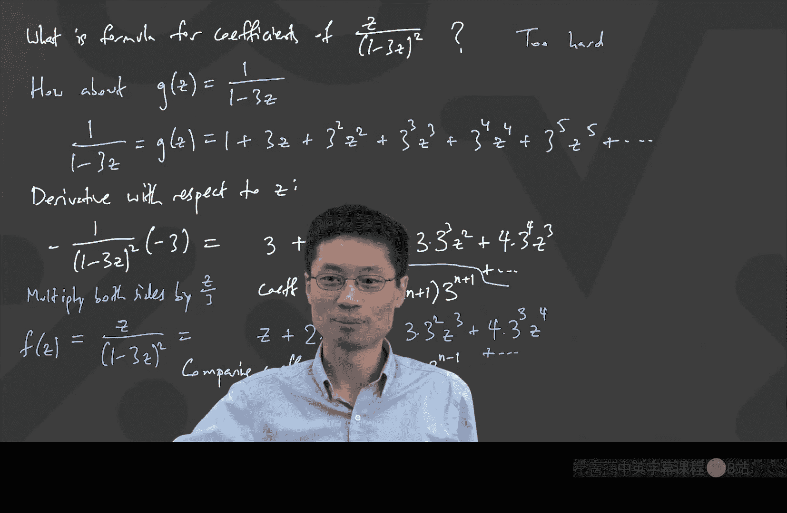

# 离散数学：第18讲：生成函数法求解线性递推关系

在本节课中，我们将学习如何使用生成函数这一强大工具来求解二阶线性齐次递推关系。我们将从回顾上节课的斐波那契数列例子出发，推导出求解一般形式的通用方法，并处理具有重根的特殊情况。

## 从斐波那契数列到一般形式

上一节我们介绍了如何使用生成函数求解斐波那契数列。本节中，我们来看看如何将这个方法推广到更一般的二阶线性递推关系。

假设我们有一个递推关系：
**A_n = A * A_{n-1} + B * A_{n-2}**
其中 `A` 和 `B` 是常数，`A_n` 是我们要求解的序列。

我们的目标是找到一个公式，可以直接计算 `A_n`，而不需要递归地计算前面的所有项。

## 生成函数的定义

我们首先为序列 `{A_0, A_1, A_2, ...}` 定义一个生成函数 `F(z)`：
**F(z) = A_0 + A_1*z + A_2*z^2 + A_3*z^3 + ...**

这个函数将整个序列“压缩”成了一个关于变量 `z` 的无穷级数。这里我们使用 `z` 作为变量，是因为在数学中它常用来表示复数变量，这为理论分析提供了便利，尽管在本课程中我们主要进行形式上的代数操作。

## 建立关于 F(z) 的方程

接下来，我们利用递推关系来建立关于 `F(z)` 的方程。我们将 `F(z)` 与递推关系中的各项相乘并对齐 `z` 的幂次。

以下是具体步骤：
1.  写出 `F(z)` 的展开式。
2.  写出 `A * z * F(z)` 的展开式，这会将原序列的系数与 `A` 相乘，并将 `z` 的幂次提升一次。
3.  写出 `B * z^2 * F(z)` 的展开式，这会将原序列的系数与 `B` 相乘，并将 `z` 的幂次提升两次。

当我们把这三项相加时，根据递推关系 `A_n = A * A_{n-1} + B * A_{n-2}`，对于 `n >= 2` 的项，其系数正好等于 `A_n`。因此，我们有：
**F(z) = A_0 + A_1*z + A*z*F(z) + B*z^2*F(z) - (A*A_0*z + B*A_0*z^2 + B*A_1*z^2)**
最后减去的项是为了修正 `n=0` 和 `n=1` 时多出来的项。

## 求解 F(z)

现在，我们将所有包含 `F(z)` 的项移到等式一边：
**F(z) - A*z*F(z) - B*z^2*F(z) = A_0 + (A_1 - A*A_0)*z**

提取公因式 `F(z)`：
**F(z) * (1 - A*z - B*z^2) = A_0 + (A_1 - A*A_0)*z**

于是，我们解出了生成函数 `F(z)`：
**F(z) = [A_0 + (A_1 - A*A_0)*z] / (1 - A*z - B*z^2)**

## 部分分式分解与几何级数

我们的目标是将 `F(z)` 写成易于展开成幂级数的形式。观察分母 `1 - A*z - B*z^2`，我们希望将其因式分解为 `(1 - λ_1*z)(1 - λ_2*z)` 的形式。这样，`F(z)` 就可以通过部分分式分解为：
**F(z) = α/(1 - λ_1*z) + β/(1 - λ_2*z)**
其中 `α` 和 `β` 是待定常数。

为什么这样有用呢？因为每一项 `1/(1 - λ*z)` 正好是一个无穷几何级数的和：
**1/(1 - λ*z) = 1 + λ*z + λ^2*z^2 + λ^3*z^3 + ...**

## 寻找 λ_1 和 λ_2

为了找到 `λ_1` 和 `λ_2`，我们需要分解分母。一个巧妙的方法是考虑方程：
**1 - A*z - B*z^2 = (1 - λ_1*z)(1 - λ_2*z)**

将右边展开：`1 - (λ_1 + λ_2)*z + (λ_1*λ_2)*z^2`。
比较系数，我们得到：
**λ_1 + λ_2 = A**
**λ_1 * λ_2 = -B**

这等价于求解二次方程 `x^2 - A*x - B = 0` 的根。这个方程正是我们在矩阵/特征值方法中遇到的**特征方程**。因此，`λ_1` 和 `λ_2` 就是特征方程的根。

## 得到通项公式

假设 `λ_1` 和 `λ_2` 是两个不同的根。通过部分分式确定常数 `α` 和 `β` 后，我们将 `F(z)` 展开为两个几何级数之和：
**F(z) = α*(1 + λ_1*z + λ_1^2*z^2 + ...) + β*(1 + λ_2*z + λ_2^2*z^2 + ...)**

合并同类项，`z^n` 的系数就是：
**A_n = α * λ_1^n + β * λ_2^n**

这与我们之前用线性代数方法得到的结果完全一致。

## 处理重根的情况

上一节我们讨论了特征根不同的情况。本节中，我们来看看当特征方程有重根时该如何处理。此时，部分分式分解和最终的公式会有所不同。

考虑一个具体例子：
**A_n = 6*A_{n-1} - 9*A_{n-2}**，且 `A_0 = 0`, `A_1 = 1`。

按照上述步骤，我们得到生成函数：
**F(z) = z / (1 - 6*z + 9*z^2)**

注意，分母可以写为完全平方：
**1 - 6*z + 9*z^2 = (1 - 3*z)^2**

现在，我们面对的是 `z / (1 - 3*z)^2`，而不是简单的 `1/(1 - λ*z)` 的形式。为了展开它，我们需要一点技巧。

我们先考虑一个简单的几何级数：
**G(z) = 1/(1 - 3*z) = 1 + 3*z + 3^2*z^2 + 3^3*z^3 + ...**

对 `G(z)` 两边关于 `z` 求导：
**d/dz [G(z)] = d/dz [1/(1 - 3*z)] = 3 / (1 - 3*z)^2**

同时，对右边的级数逐项求导：
**d/dz [1 + 3*z + 3^2*z^2 + 3^3*z^3 + ...] = 0 + 3 + 2*3^2*z + 3*3^3*z^2 + 4*3^4*z^3 + ...**
**= 3 + 2*3^2*z + 3*3^3*z^2 + 4*3^4*z^3 + ...**

因此，我们得到：
**3 / (1 - 3*z)^2 = 3 + 2*3^2*z + 3*3^3*z^2 + 4*3^4*z^3 + ...**

两边同时乘以 `z/3`，就得到了我们需要的 `F(z)`：
**z / (1 - 3*z)^2 = z + 2*3*z^2 + 3*3^2*z^3 + 4*3^3*z^4 + ...**

观察 `z^n` 项的系数，我们可以总结出通项公式：
**A_n = n * 3^{n-1}**

我们可以验证前几项：`A_0=0`, `A_1=1`, `A_2=2*3=6`, `A_3=3*9=27`，这符合递推关系 `A_n = 6*A_{n-1} - 9*A_{n-2}`。当特征根重复时，通解中会包含一个 `n` 的因子，形式为 `(C_1 + C_2*n) * λ^n`。

## 总结

本节课中，我们一起学习了如何使用生成函数求解线性递推关系。
1.  我们首先定义了序列的生成函数，并将其表示为一个幂级数。
2.  然后，利用递推关系建立关于生成函数的方程并求解。
3.  接着，通过将分母因式分解并进行部分分式展开，我们将生成函数转化为几何级数的和。
4.  最后，通过比较系数，我们得到了序列通项的直接公式 `A_n = α * λ_1^n + β * λ_2^n`。
5.  对于特征方程有重根的特殊情况，我们通过求导的技巧进行处理，得到了形如 `(C_1 + C_2*n) * λ^n` 的通项公式。

生成函数法提供了一种强大而系统的方法来解决这类问题，并且可以自然地推广到更高阶的递推关系。下次课我们将继续深入，探讨更一般的情况。