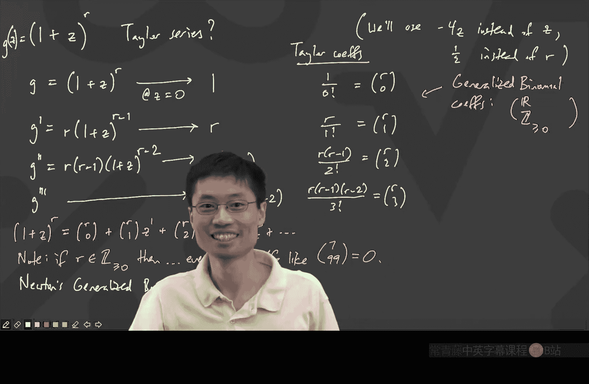

# 卡耐基梅隆【中英⚡离散数学｜21-228 2023, Discrete Mathematics】 p20 P20 -BV1sFibBkEj7_p20-

Hello， everyone。 How are you。Great。😊，Oh， you can't see me。 here we go。Oh no， let me turn。

 let me turn on my video just a second。Hello。Hopefully， you can see me now。那。Okay。

 nice to see everyone。 Okay， right， So I know that there are some questions about the exam。

 So let me quickly say there will be an exam on Friday。 People might be curious what's on the exam。

 Actually， what's on the exam is going to go from the recursions onward。 So after the last exam。

 we had done a class， which was about Fibonacches。 So anything from that class starting on all the way up until what we'll cover on Wednesday。

 And if you're practicing the old exams to go and get an idea of what this is like。

 you will notice there's some questions on the old exams。

 which have something to do with these like parentheses。 So don't worry。

 we're about to learn that today and on Wednesday。 So that's what we're gonna do。😊，Okay。

 and the exam is Friday。 It will be the same kind of thing as before。

 The advice is I will try to make it less not， not quite as hard。 I'll do my best。

 And then the general advice is， the questions are supposed to be in some sense。

 like easier to harder as as as you as you go on。Okay。

 are there any general questions about the exam first， if I， if， if I， if I can answer them now。

I'm going to say one thing， which is that you're not going to need to know how to take a matrix all the matrix stuff。

 It's going to be useful to know， I guess that the matrix multiplication thing was useful。

 but we're not going to go in deep into these like vandermon type determinants or whatever。

So it's going to be designed in a way so that even if you haven't taken a matrix class just based on what youve learned about matrices from high school。

 it should still make sense， but the notion of matrix multiplication。

 I think that would be something that would be fair game， so we will do something on that order。O。

Cool， so I want to just go on and and give you guys the。

 I want to give everyone the big theorem that you can use and you can use it without。

 without proving it again， because the way that this class works is if we。

 if we have covered something， then you can just go ahead and use that One second。

 I just realized that I gave a talk on the weekend。 which had different background。 Let's do this。

 Here we go， okay。😊。

Good， and let's go on from where we were last time。

 So I have here an extended slides because that's just this is this is like this is just like the last few days that we've had。

 And we managed to find out that if you， for example。

 had a recursion that looked like this where the little A N is equal to some capital A and -1 and then so on and so on and so on。

 It turns out that there's a particular， there's a particular way to do this with generating functions。

 And what you end up getting is this kind of a denominator。😊，Just realized I should turn on a light。

 one second。Okay， that lightss on。 So you should turn on this So you should you should use this denominator。

 And from the denominator， what you can get is you can get that。

 It becomes a question of finding the roots of a particular polynomial。

 This is the characteristic polynomial。😊，And so now， once you found these roots。

 once you found these roots， it turns out that if all of the roots were different。

 then the answer becomes that the general term is going to be this combination of the powers of those roots。

And what to do if those roots are the same。 Well， then we started to find out that there were some other interesting things you could do and the punch line that we got to from everything。

Was that if you wanted to find out， let's just go here。 We took some derivatives also， oops。

 Let me go back。 Where was that。Yeah， that was here。 That was here。

 So what weve what we found out is that if you if you actually have there's some some garage door underneath me。

 which is baking noise。 But what we found out is that the coefficient of Z to the power N。

 which is going to be your A sub N， is going to be some polynomial whose degree is up to the the number of repetitions of this route。

😊，Actually， degree， the number of terms like the constant， the n the n squared。

 that's up to the repetition of the root many times。

 and then times the the particular root to the end's power。Now， I'm going to write。

 I'm going to say all that we did before。 Justifies what I'm going to write down next。

So what we now know is that here's how you solve to solve。generalral。linearar。Recurrence。

All you have to do is you just go and say， well， I have some。

 you write the characteristic polynomial。Write the characteristic polynomial。

Which is something like lambda to the n minus， you know。

 then you have a bunch of things that you write。 It was。

 it was like this capital A Lada to the n -1 minus capital B Lada to the n -2 minus dot dot dot minus。

 I don't know how long it goes。 Z or something。 I guess n is equal to 26， maybe。Something like that。

 But so I have this thing。 And then you write this， this characteristic polynomial down。 Remember。

 this means that what you had is that this was from a particular recurrence。

 which was little a sub n is equal to capital A， little A N-1 plus capital B。

 little A N -2 plus dot dot dot。 That was the kind of recurrence that we had。 You write this do。

 Then what do you do。 Then you find the roots。 which now you can tell that I'm not going to put this kind of a pure problem。

 like with a big number of terms on an exam， because nobody remembers the cubic formula。😊。

You find the roots。And the roots， what we'll do to separate these out is we'll say that the roots。

 they come as some distinct things。They are lambda1， with multiplicity。Let's call it M1。

And then you have a lambda 2 with multiplicity， M2 all the way down to Lada。

 I don't know how many roots there are。 maybe are for the number of roots。With multiplicity。M R。

 and the important thing here is that these are distinct。Right。

 so you go and find the distinct roots。 And now can someone just like remind us because our brain is a little bit slow from having had an extra。

 extra break on Friday。In light of everything we have done。What does that mean。Then， for any end。

I know that a sub n is equal to something。What's the form of what I should have here based on what we've done。

 based on what you have thought about。You know， you would generating function this thing。

 You would get like this partial fractions thing。Bdon。Yeah。

 so what we'll say is that it's multiplicity M1， right， So I'm， I'm a visual person。

 So the way I'm gonna write that is theres some coefficients now。 So they're blobs。 Okay。

 so it's like a blog。😊，I'll write apprenhees here。 Blob， plus blob。呃，And。Plus， blob and squared。

 plus dot， dot， dot。And what you have here is you have M1 of these。M1 terms。Times lambda1 to the n。

Plus。And you do the same thing for all of the other roots。 So the next one is like blob plus。

 don't know how many of the blob terms there are here。 Well， let me write it still the same way。

 blob n plus dot dot dot times lambda 2 to the power N。 And here you have M2 terms。😊，And so啊。Until。

Lambda。A stop。Is that clear to people。First of all， is does the theorem make sense to people。

 Does the statement of the theorem make sense to people， The purpose of the theorem is to say。

 I find all my roots。 And after I find all of my roots with different multiplicities。

 then I just have to fill in these blobs。And the number of blobs that I have has to do with。

 So for every lambda， the number of blobs I have has to do with the multiplicity of that particular root。

 And if you rather remember why the basic idea was because you generating functions this thing。

 when you generating functions。 this thing， you would go and get some partial fraction decomposition。

 The partial fraction decomposition will have powers of like 1 minus Z 1 minus z times lambda 1，😊。

That to some power， that particular power being all the way up until M1 power。

 And what we saw last time is that if I wanted to know what's the general form of a coefficient of expression like this。

 I'm going to flip back of the expression like， you know，1 over 1  Z to the power R。

 The general form of that actually just has some polynomial in R whose degree goes up to the multiplicity -1。

😊，And then we just combine the blobs because what we have here is if you wanted to combine all of these different partial fraction pieces。

 you'd be adding together a bunch of different polynomials in N。

 whose degrees are all less than or equal to the multiplicity -1。

And then the blobs will just become other blobs。So then you have this piece。

 And this ends up being the general form。 And if you want to know the actual blobs。

 you can just solve a system of equations。 You plug in the first and plug in the first。Well。

 it's not n terms， but you plug in as many terms as you need as there are blobs。Plug in as many。

Values。For he。As there。A clubs。And you get the values。Of the blos。

And that gives you a formula for all that。So that's the grand finale of this homogeneous linear recurrences。

Are there any questions about this。You can use this without proof。

Although it's very useful to understand the proof in the sense that if you know， if you。

 if we have something that digs a little bit deeper into why one of these things is true。

 then it would be nice to understand a bit of a proof。

 But if you ever run into a occurrence like this， you'll be able to deal with it。 question， Thomas。

Times lambda to the n。Close， yeah， yeah。 So the N here is the same as the N and the A N。Y。

 but exactly。 if you have a very precise question， which is like。

 suppose that there is one repeated route with multiplicity2， and that's it。 Then in that case。

 you've got no more of this nonsense， It's just blob plus blob and。

Close parentheses times the root to the power N。 Find the blobs。Yes， it's amazing， actually。

 it's amazing， but the first time I ever learned this， I was like， oh my gosh。

 you can actually solve all of these recurrences where all you have to do is find the roots of the polynomial。

That's amazing。It's actually solvable。And we in fact。

 have done in this class enough of the understanding of why that's the case。

 because it just comes into the question of how you deal with these partial fractions。Over here， we。

 we saw all of these things。 Any other questions on this， on this core piece。If not， let's go on。

 So I want to make sure we have time to cover the next major topic。

 The next major topic is about how many ways can you arrange parentheses to be legit。So how many。

Valid。Arrangements。Of an pairs。Of parentheses。Okay， well， what does that mean。

 So let's give some examples of valid。Open， open， close。 close。 Open， close。But bad。

Bad would be like open， close， close， open。Open close。 Yeah， that works。 What was so bad about this。

What's bad about the bat。yes， Nick。Yes， like what's that。 that's， that's funny。

 You've got this thing here where we've closed before opening your program will not compile。 Okay。

 so that's that's why it's bad。 And so that's pretty easy to understand the question。

 It's just how many ways can you arrange them。 Well， let's try to work this out。😊。

If I want to know the answer to this， it helps to get some small cases to try to find out。

 find out the answer。So what is the n equals one case。 That's easy。 I'll do that one。

 There's only one。 There's only one way。 It's just open， close。 And so it's just one。

How about n equals 2。 I don't want to use the yellow， Let just use blue n equals 2。

Can someone help me？ What are the legit sequences of parentheses for two pairs of parentheses has to be legal valid。

I think。That seems about right。 So， okay， let's call that too。The next one， how about n equals 3。

If you just wantan to say a few of them， that's fine。 You don't。 You don't have to have the answer。

 yes， we got someone。 So Charlie。Oh， this is very interesting。

 You're gonna build it from the previous months。 Okay， so what did you say。

 So you got the triple open triple close and what else。Oh。

 so you are like the way that I make it is I go and combine an n equals 2 and then n equals 1。

 So let's try that， right， So if I combine an n equals 2。

 I'll use colors since you suggested that so I can do open， oops， I can do open， close， open， close。

 That's an n equals 2， and an n equals 1， n equals 1。 There's not much choice。 And I have open， open。

 close， close。😊，Open close。Is that it or do we have more。Like that。5。Okay， so is that it。Okay。

Does everyone agree or is there something else here？I actually think there's。

 I think there's one more。呃，对。That。Oh， no， let me do a different way。 Okay， that's like。

I'm doing this。 Do you see what I've just done here？

So what we just did is we kind of sandwiched one and the others。 That's no fun。

 So this is actually like。😊，Not fun。 The answer here is 5。 What sequence goes 1，2，5。 Come on。

 at least it could have been Fibonacci，1，1，2，3，5， but it goes 1，2，5。

 I just happen to know that with this， this particular sequence， it does go 1，2，5。😊，Oh， no。Now。

 it looks complicated。 By the way， the idea was quite good of like， you know， you open and you close。

 But can we try to find some other way of doing this。 Oh， what is this， Braden。

But skip every other number。 Yeah， yeah， yeah。 Okay。 okay。 That's it。 Clearly， It's fibonac number。

 skipping every other number。 that might be the case。 Well。

 it turns out that this sequence is actually famous。 So I I。

 I'm gonna slip at some point when I say it。 So let's just say it right now。

 These are called the Catalan numbers。😊，And the Catalan numbers are extremely famous because it turns out that there's a lot of things where the number of them turns out to be this。

 The number of ways to arrange parentheses where you have these n pairs and they have to be legit。

 And so Catalan numbers， if you look it up， you'll see all of these different things that they can count。

 They count things like triangulations of polygonts and whatnot。

 But now it's important to go and try to answer how many are there。 And as you can see。

 we're already trying to think inductively， How do you build it from the previous one， right？

 And here we were trying to build from the previous two， Well， if I look at this。😊。

Can I find any other way to try to figure out a recurrence for the Catalan numbers？ Well。

 let's go and， hunt for a recurrence。First of all， let's call the Catal numbers C， N。 Okay， so let C。

 N be the number of valid。Paris。That's not how you spell pears pears。呃。嗯。Oh， no。

 numberumber of valid ways， numberumb of valid ways to make N pairis app parentheses。

 numberumber of valid ways。To make。And pears。Of parentheses。Okay， now that's the Caal numbers。

 How could I try to count those， Well， I had some colors before。Advit， what is this。

You have something you wanna say。デア。Oh， no， no， don't need any colors。

 I was just going to use colors to make the idea clear， but tell me what you were thinking。So。

Did you go back。So you're like the way I make3。 Okay， let's， let's stare at this。

 because let's let's， let's understand how this is a neat question。 Okay。

 so one way I could try to approach this is I could say， oh， look at that。

 It's a2 and a1 because that was the idea that Charlie suggested， right， So if I have a two and a 1。

 How do you make 3。 Well，3 is made in a few ways。3 is equal to Well， let's do it this way。

 So I'll use some other color here。3 is equal to 2 plus1。😊，That's one way。 And， in fact。

 I'm going to say that this particular one here， this is a two plus one。How else can you make 3？

 Another way to make 3 is one plus 2。But I'm going to say this is where it gets kind of tricky。

 because how do I characterize this 1， I think that's why Charlie might have said there's like two ways to account for things。

 because you see the  one that I just pointed in this pinkish thing， This is both a two plus one。

And a one plus 2。And that's not fun。 If you have two different ways of counting the same thing。

 then it gets annoying。 Oh， Chris， you have a hand。 What did you want to say。😊。

So what you're thinking of like somehow you're like。

You put things around the end is Are are you sort of thinking of like how you make the end。

 the the open and close。Okay， so now we're starting to think of like， where are the parentheses。

 How are you function composing them， right， So let me， let me take the n equals 3。

 let me rewrite those。 Okay， so I have n equals 3。 So this is C 3。😊，Well， round pen， C 3。

And here I'm I'm just gonna draw them in the same order we had with no special colors。 open， open。

 open， close， close， close。We also had open， close， open， close， open close。 We also had open。

 open close， close， open close。 And then we had open， close， open， open， close， close。And then。

 we had。Open and close on the outside and open close。 Open close on the inside。Okay， great。

 So I've got all of these。 Now， when you look at all of these。

 we can start to think of how you're composing， how you're function composing these。

 And we do want to build this up from smaller things。 So here's a suggestion。

 I'm going to give a hint。😊，I want to think about the first one。What's the partner of the first one。

Let's start to do this together。 In this first line， what's the partner of the first one。Nick。Okay。

 next one。This one was the partner of this one。Well， I guess people know this。

 I'm just gonna kind of highlight them。 right， It's the one that can right after it。

 And then here is one where I have the first one。 you saying， why don't you give me this one。

 What's the， what's the partner of this third one。Yep， all the way over there。 And then， you know。

 I'll do the next one。 This is easy。 And I'll just do this because this。

 I think people understand I just marked the opens and the closes for the first guy。😊。

Why is this relevant？Can anyone see why this is useful， I can use this to break things apart。

My goal is to be able to say C3 breaks into a sum of some things。

So I want C 3 is equal to a sum of a few things。 How can I split this apart， Sydney。

ha so you're like， take something from the previous one。

 the left thing that you wrap around it can go anywhere。 and the right one goes somewhere after it。

 Okay， good， I'm glad we're thinking about this。 I want to be able to split into cases。

 I want to say like any legit parentheses thing breaks into。

 It's going to be this or this or this or this or this。 I'm giving a hint。

 It's not actually just the sum of three things。 We just did these linear recurrences。

 This is not going to be a linear recurrence。 It's going to turn out that the C N has to do with a lot of previous Cs。

😊，And we've got another personality。Oh， could you， could you speak up a little bit？

 I want to hear what you said。佢二咗新景式嘅语。Okay， so I heard the key words of like。

 I want to take the first parentheses。 I want to take the product of stuff as I break down。

 What I can do is I can break into a few cases， which is called。

 Do you close the first one right away， Do you close it after one pair or do you close it after two pairs。

 Do you see that。I have three categories。 The categories are， you close。The first parentheses。

How do you spell parentheses。Prenhsesis， maybe close the first parenthesesis。After。

The number of pairs。Is equal to0。Or when。Or two。Is that okay， So it's like I， I， I will， And this is。

 for example， a 0。 The number of pairs that I got。 Oh， I， I should be clear。 the number of。

Other pairs， do you know what I mean， Like a number of enclosed pairs。 Let's do that enclosed。

The number of enclosed pairs。 That's how I'm emphasizing that this second row。

 that's the0 enclosed pairs。Yeah， and on this first row， that's two enclosed pairs。 By the way。

 the 0，1，2 is only for C 3。 We're going to have to do this in general for all of the different Cs。

So how can I turn this， I want to do multiply avit， help me with this。 If you do。

 if you close it after 0， what is it。You just invented C 0。 Well。

 we need to know what is C 0 because， I mean， like the number of ways to arrange0 pairs app parentheses。

 What's that？ How many ways are there to arrange 0 pairs of parentheses。One way。 Okay。

 there's one way。 that's important because it's always important。 Like what's 0 factorial。

 What's 0 choose 0 here， it's convenient to say， I want c 0 to be equal to1。

 Because if I look at my second row here， that's like。One way to enclose no parentheses。

And then I've got a C2 because there's two pairs of parentheses left， which are following it。

And what we just did here is we said c 0 equals 1。Oh。So this is cool。 This is going to generalize。

 right。 We did it for three。 So it must be true for all of them。3 is not quite 7。

 but it's close enough。 And the important thing is。

 what we've just found out is there's this beautiful pattern。

 And I want to pause here because this is a very important point。 The important point is like， look。

 if I have C 3， I have actually legitimately split up all of my possibilities just based on the partner of the opening parenthsesis。

😊，And every possible way of doing this， the opening parenthses must have a closing parenthesis。

And it just has to be somewhere。 And it's just like， is it after 0 after one after two pairs。

And so what you see here is it's going to be true in general。So what I find out is in general。

CN is equal to。Well， let's， let's call it C N。 Yeah， Why not C N is equal to C 0， C， N-1 plus C 1， C。

 N-2 plus you just kind of like swap between them。 It's sort it's almost like a binomial theorem which kind of thing。

 You know what I mean， Like the， the sum of the indices。 They trade off against each other。

All the way until the last one， which is c N-1， c 0。Okay。

 so that's the recurrence for the Catalan numbers。 And now the question becomes， h。

How can we find out a formula for the catalog numbers。Well， what tools do we have。

 Can we use linear algebra。Yeah， we're gonna have to use some generating functions for this because linear algebra is gonna to be bad If you try to imagine trying to have a vector。

 which is just like the C's。 Okay， if your vector was just C0， Well， what would it be anyway。

 It's like it's not like it's a fixed length。 You know what I mean， when we did the linear algebra。

 We were like my recurrence always has three terms。 So I will go and take three things in my vector。

 always3。 But here it gets longer and longer， if I want to know the recurrence for C 100。

 there's like 100 terms or something like that。 Yeah， C 3 has three terms， C 100 has 100 terms。

 So I want to find a different technique， Let's try generating functions。😊。

So now I'm going to rewrite this recurrence relation on the next screen。Okay。

 so what I know is C N is equal to C 0， C N minus1 plus C1 C。

 N minus2 plus dot dot dot plus C N minus-1， C 0。That's my recurrence。 And by the way。

 all I have for my initial condition is just C 0。Is equal to one。

The beautiful thing is just from c0 equals to 1。 You already get the whole formula。😊。

Because if we wanted to know what would happen next， right。

 the next term would have been C1 is equal to what。

What would I have done for C1 if I use this recurrence， Anyone want to tell me。

 I just want to get everyone comfortable with this。

 And then we'll do some generating functions on it。Yes， Nick。0Okay， C 0 times 0， C 0。

 And that's equal to1 times 1， which is 1， which is good。 We had that last time。 C 1 was1。

 The number of ways to arrange one pair of parentheses is one。 And whenever I do something like this。

 I always want a sanity check。 Does it work for C 2。😊，I'll do this one。 C 2 is going to be C 0， C 1。

Plus， C，1， C，0， which is 1 plus 1， which is 2。And the moment of truth is the， the C 3。 Do I get 5。

C 3 is supposed to be C0， C 2 plus C 1， C1， plus C 2， C 0， which is equal to。 well。

 I will take the two times 1。 That's a2 plus a1 times 1 that gives you 3 plus another2。's 5。😊。

At this point， we should believe it。 And， of course， we should believe it because we did it。

 You know， we， we derived this thing。 So now the question becomes， Ha。

 what's the generating function for this。So， let's let F of Z。Be equal to。Well， it's going to be C0。

Z to the 0。Plus， C，1， Z to the one。Plus， C 2， Z squared plus dot dot dot the third one， C 3， Z cubed。

Plus， dot， dot， dot。 But， oh， no， now I can't do what I did before。

 What I did before is I just replaced each thing by like some， Well， I I guess I could。

 I can replace each thing by like some combination of the previous ones。Right。

 but the combinations now aren't just like suming two things or aren't just selling three things。

And so， the key question becomes。Have you ever seen an algebra。

Ever done anything before where you might somehow。Do this。 Is there anything I can do to the F。

 I want to do something to the F to， to， to， to go and， you know， make。Make this thing appear。I。

 I'm like， I want， I want something I can do to F。And let's see。Any thoughts？

 I want to give other people a chance if I see you。 So Van Kaakesh， what do you have a thought of。

What happens if you squared， Well， F of Z。Whole thing squared。 Let me， let me do parentheses。 Okay。

 just so that we know what I mean or brackets。 I w to square it。What is that， Well。

 I'm going to have to do some big multiplication。 So I'm going to write this all out a little bit。

 C 0， Z to the0 plus C 1， Z to the1 plus C 2， Z squared plus dot， dot dot。😊。

Times the same thing again， C 0， Z to the 0 plus C 1， Z to the1 plus C 2， Z squared plus dot dot dot。

 Okay， how does multiplying work， Well， I need to know。I'm multiplying two infinite polynomials。

That's called foolil。 It just never ends。 anyway。 So， so if you want to do this thing， you go。

 you go and you're gonna to take one thing from each bracket， right。

 And if I want one thing from each bracket， here's how we should start thinking about it。

How do you get a Z to the 0。If I'm going to grab one thing from each bracket。

 how can I get a power of Z that is just plain just plain Z to the 0。

I want to get as much involvement as I can in this。

 because this is like one of the core ideas in how we're proving this generating function thing。

 Good， Drva。Yes， the important thing is， how could you possibly get Z to the 0。 Well。

 you're going to take more Z's and more Zs。 You just get more z's。

 So you better take just the Z 0 thing and just the Z0 thing and 0 plus 0 is the power of Z。

 It's still 0。 So what you end up getting is just C0， C0。😊，Those are both zeros。 I'll do a plus sign。

Actually， I'm got to write the Z to the one。😊，Outside， I want app parentheses。

 What's the coefficient on Z to the1 now， How does this work， Can someone else help me up？

 I want to get as many people involved in this as we can。

How do you get a Z to the one term where you grab something from each。Bden。Right。

 these are the only ways the， the， the blue and the pink are the only ways that you could get a power of Z。

 which is z to the1。 It's a 0 plus1 for the power of the Z and the power of the Z or a 1 plus 0。嗯。

This looks familiar。Okay， and our。Our our instinct is this has to work， right？ Plus Z squared。 Oh。

 yes， of course， that's actually why these C's have the indices。

 which always add up to the same thing， Because I'm just kind of the way you multiply polynomials is you kind of move in opposite directions on both of them。

 right， I'll do this one。 So this one is like， is like， how do I do this。 Well。

 I I want to get a Z squared。 So to get a Z squared。

 I either take Z to the0 from the first and the Z squared from the second。😊。

Or I take a z to the one from the first and a z to the one from the second。

 or a z squared from the first and a z to the 0 from the second。And that's exactly what I wanted。

That's C 0， C 2 plus C 1， C，1 plus C2， C 0。It's annoying that the Cs look like parentheses。 Okay。

 so now now that I have all of this， I'll write it plus dot dot dot。Okay， well。

 in light of all of that， what's the punch line？ What's the conclusion。This is pretty exciting。

 Advvert， what do I now know？Okay， so the important thing is like it looks a lot like F of Z。

 except that the first thing would give me a C 1， right， I have gotten C1， Z0。 Oh， let's do this。

 I want to make it so it' as easy for you guys to read as possible。

 I'll write an equal sign over here。 and I'll write C 1。

 Z to the0 plus C2 Z to the1 plus C 3 Z squared plus dot dot dot。 And now I'll write the equal sign。

😊，Equals， you said it was like F of Z over Z。But without the first term。

So let's expand this and write minus C0。 Is that what you want。

Because if you think about what is F of Z， F of Z starts from C 0， Z to the0。 Okay。

 but then it goes C1， z to the 1。 And you go on this like all this blue stuff。

 But I need to drop a power of Z because all of the powers of Z and the blue stuff are one down。

But I know what C I know what C 0 is。 C 0 is 1。So now I know that this is equal to F of Z minus-1 over z。

So our goal is right。 Our goal is to go and figure out what is， what is a Taylored series for F。

 And actually， we， we can solve for F now。 We can find the generating function in the sense that F is not going have a plus dot dot dot anymore。

 I have an algebraic expression。 I have that F of Z whole thing squared。

 is equal to F of z -1 over Z。😊，Let me rewrite that final expression on the next script。

 just giving people a moment to pause and， you know， take this in。All we did， by the way。

 is just called it looks like the pattern for a square。 Let's square for fun。 Oh my gosh。

 there is F again。 Okay， that was the key thought。 And then now it's like。😊，How do I solve for F。

 Well， let's write that down next on the screen。I know that。 F of Z。

Whole thing squared is equal to F of z。I'll write a bracket around it， minus-1 all over Z。

Any thoughts？ I need to know F OC。I need to get like F of Z equals something so that I can go and have my Taylor series fun。

What would that be。How can I solve for F of Z here。This is like a thing that is there's。

 there's a one twist in here， which is a strange thing that you would ever do with functions。

In an equation， But I emphasized with like， a bracket。 It's like a square bracket， Chris。

The quadratic formula on F of Z。 Yes， why not。 So， firstst of all。

 let's turn it into a quadratic equation。 Multiply both sides by Z。 I have Z times。

 I'm going to use colors now。 Okay， this is the square bracket F of Z。Oh， I have a better idea。

Oh yeah， that's okay。 Square bracket F of Z。 My square bracket is in blue。

 but my exponent is in white because I'm emphasizing that my unknown is square bracket F of Z。

And then I'm going to minus the square bracket F of Z。And then， I plus one。Equals 0。

I think I didn't make a mistake。So so what we have here is we're just simply saying multiply the Z up。

 Okay， and then shove everything back to the left side。 And I've got this。

 And I have a quadratic equation in F of Z。 So that means it satisfies the quadratic formula whenever you have blah。

 blah， blah times unknown squared plus blah blah， blah times unknown plus blah blah。

 blah equals 0 by the quadratic formula， which you can prove by completing the square if you want or other methods。

 you can find out that So F of z。😊，Is equal to。Negative B。Right。

 negative B is the negative of the coefficient of the F of Z of the blue thing。

 plus or minus the square root of B squared。 That's one。-4 times a times C。 That's 4 z。All over2 a。

 which is 2 Z。Are people okay with this？H something fishy。What's fishy， of it。What's plus or minus。

 Yeah， yeah， hang on a second。 We're supposed to have just one generating function。

 Why is there a plus or minus。 That's no good， Because， it's like it's a thing， right。

 There's not plus or minus。 So should it be plus or should it be minus。

 And is there any way that we could figure this out。

 And this is why I'm saying like in this generating functions， thing。

 some of the things we do are not necessarily the most rigorous， But they seem to make sense。

 which is enough for this particular unit。😊，I need to figure out whether to use plus。

 or to use minus。Hm。Well， we need to figure out whether it should be plus or it should be minus。

 It should be one particular one of them。Well， what happens when z equals 0。

Does anyone know what happens， And this is， this is the one fishy thing about the generating functions I'm about to do。

What is F of Z at 0。What was F Z anyway， Remember F of Z， That was the cattle length thing。

 It was C 0 plus C 1 Z plus C 2， Z squared and so on。What is F M 0 is supposed to be。

This is actually not really。 this' is not a trick question， Nick。It should be C 0， right， Like I。

 I can substitute in 0。 That's， that's like that that particular power series。 Actually。

 there's an interesting thing here。 If you're curious， how is that even rigorous。

 the answer is because it has to do with the fact that there's a radius of convergence on a series。

 So， for example， if I plugged in Z equals 50 million。 this thing is just going to be like infinity。

😊，But there's actually a small radius of convergence around 0。Because actually。

 it turns out that the Catalan number C， N is always less than like。2 to the power  to N。

I'm just making this It's a general comment。 is's useful。

 It's like the number of ways to arrange n pairs of parentheses is always less than two to the two n。

 Does anyone know why， if I'm going to put down n pairs of parentheses。

 So I'm going to make a sequence of four n things， And it's going to be n pairs of parentheses and they are like legit。

 Why are there at most。😊，To to the power to N of them proofva。Yes。

 it's because if I just have two n things。 and I randomly。

 then I decide to be like open or close for each one。 And I don't even care if it's legit or not。

 The number of them is 2 to the2 n。 So I'm just making this comment。

 I'm not writing it down because it's just a general comment of like。

 why is it true that you could imagine that there's a radius of convergence。 It's because the power。

 I mean sorry the size of the C N is always less than like 4 to the n。😊，And from cculus class。

 theres like the nth root。 I that， is that an root test。

 Is that right for like convergence of radius of convergence of power series。

 It's been like 20 years since I took that class。 But it's like there's some nth root test。

 And the nth root test would tell you that your radius of convergence。 You have at least one quarter。

 Anyway， I'm just explaining this。 This is not important for for for the class。

 But just so you know we're not like totally cheating。 Okay， so you can actually plug in0。

 And it should make sense。 But it's just plain one， Okay， why did I do that。

 I claim you can use that to figure something out here。 Chris， you had raised your hand。

 Did you want to answer this over you're answering that。😊，😀H。😊，think。Okay， well said。

 so the point is2 over zero is very bad。2 over 0 is very different from one。

What I'm saying is that two over zero and one are totally different planets。

 two over zero would be suggesting that something is diverging。

But0 over 0 is a sign of something called a removable singularity。

 It's like if I wrote down some expression like Z over Z， actually， Z over Z is legit。

 except when z equals 0。 the rest of the time is's1。😊。

So that's actually what I meant when I said this radius of conversions。

 If you wanted to know why this is rigorous。 The way you'd actually do it is you'd go and argue and say。

 well， you know， although I can't really put in 0， I can put in a number onto the Taylor series for F。

 the generating function， which is so close to 0， that this is really， really close to1。😊。

It's definitely possible because there's this radius of convergence。

 And so it's actually close to one when you're really， really close to 0。 Therefore。

 if I put a number here， which is really， really， really close to 0 for z。

 then I'm going to get a number on top， which is really， really close to either 0 or really。

 really close to2。 And I don't want something really close to 2。

 dividing by something really close to 0。 So that's the easiest way to explain why it better be a  minus。

😊，Blu。So there's a question here about like， what happens。

 Does it turn out that some of the terms are real， but the thing is also complex， Well， actually。

 the real problem is it just does not converge， right。

 Like if I went and put in a number like 50 for Z， it just goes to infinity。

An infinity is not a number。 So it's not even that it went to a complex。

 It just went to another number。Okay， but this is justifying why it should be minus。Oh。

 he means something else。okay， okay， okay。 So inside the square root， Oh， that's also interesting。😊。

Okay， I didn't think about that one that carefully。 It's like， well， is the answer then complex。

 I think the best way to put is， actually， once you get like beyond the one quarter。

 it might start falling apart in the radius of convergence business。

 and we might be getting like weird stuff。 We might be getting like infinite stuff。😊。

So that that's that's why I'm saying like with this thing。

 we don't actually go and discuss too much of the convergence things。

 I just mentioned that in case people were curious about these things。But I'll write。

 and2 over zero is very bad。Okay， so what we now know is we now know that F of Z。

Is equal to 1 the square root of 1-4 z all over2 z。Okay。

 so now if I want a formula for this Catalan number。

 all I have to do is take the Taylor series of this。😊，Fun。😊，No， this is terrible。

 We don't want to do that。 Instead， what we'll do is we'll use the fact that we actually have touched on something quite similar in the previous class。

 where this term，1-4 Z to the power 1 half is actually very interesting。

 It turns out that there is a nice way to tailor series eyes just this part。

1-4 Z to the power 1 half。 And we'll do that to finish up today's class。

 And then we'll continue again tomorrow and well actually let me on Wednesday。

 and we'll get the full theorem。😊，So what I want to do is I'm a little bit curious what happens if I have something like1 plus z。

To the power R。That's what we want to know。 Taylor series。Because by the way， oh， oh。

 I wrote one plus Z， But what we really will want to do is we want to do 1-4 Z to the power 1 half。

 right？ So we will actually use。😊，Will use。Some， like。-40。Instead。Of Z。 And we'll use one half。

Instead。Of R。Okay， but this is a very general thing。 I want to get this general thing。 Oh。

 Van Kata you， we're gonna say something。Maybe never mind。 Okay， okay， Yes。

 and a says this is the generalized binomial theorem。 Well， let's try。 Okay。

 I want the Taylor series。 We're gonna get a new name。 This is called G of Z。😊。

G of Z is equal to this。 How do you get the Taylor series， Well， we just start to， you know。

 take derivatives。 So I have G of Z。 Well， we just got that right there。 I'm just gonna rewrite it。

 Oh， I， I won't write the of Z。 I'll write G。 Well， I do want to write of Z。😊，Do I know。

 I don't need to。 I'll just write G。 G is equal to。1 plus Z to the power R。Actually。

 this is just like what we did on Wednesday。 I want to take evaluations at Z equals 0。😊。

That's not so bad At z equals 0， what is1 plus z to the power R。确1万。But I can do that。

How about G prime。What's going to happen here， Can someone help me out？ Let's G pride。

This is just Taylor series。 I want to take a whole bunch of powers。

 a whole bunch of derivatives of this， And I want to keep plugging in Z equals 0， Braden。Okay。

So that's nice。 Actually， what you're seeing here is evaluating at zero is not bad because I have a power of one。

And if I keep going， G double prime。That's equal to I'll do this。

 This is R times R -1 times 1 plus Z to the power R -2。And if you evaluate this at z equals 0。

That's r times R -1。Okay， but by the way， if you do these Taylor series。

 we already see what's going to happen。 It'll be1 R， R times R -1 and so on。

 Let's just write the third one。 Okay， the third one， I'm just going write G triple prime。

 a big long arrow。 And then what it actually is， which is R， R -1， R-2。😊，Now。

 how do you go from this to the Taylor series coefficients？

What should I be doing to each of these things if I want to get the Taylor series coefficients。I对。

Divide by the number of primes factorial， where you mean like the number of derivatives factorial。

 which is one over 0 factorial，1 over one factorial。 And that becomes R， R-1 over 2 factorial。And R。

 R minus-1， R minus-2 over 3 factorial。Why is this exciting。What have I just written to。主va。

Our choose 0， our choose 1， R choose 2， and our choose 3。

 where we've been very liberal with how we're defining choose。 Okay， because remember， R is one half。

 We have just defined a reasonable way to say， what is 1 half choose 3。 You just stick it in there。😊。

Okay， so it's like， you're not really choosing things because one half choose 3。

 How can you possibly choose three things from half a thing。

 But this is the generalized binomial coefficient。 That's what these are called。

So these things here are called generalized。Shandralized。Dynomia。Coefficient。Cofficients。

 which are of the form， real number， choose， I guess。Non negative integer， which is like。Oh， no。

 how am I gonna write that。There's not a good symbol for non negative ins。

 I'll just write Z plus union， the 0。I'm just trying to emphasize that I can throw any real number I want in the top now。

 And that's just how I define to choose。And that just gave you。Subasshi says kind of。

 What is the kind of。Yeah， So the deal is like if I use this， it's okay。That's why it should。

 That's why n should have 0。 Okay， so some people think that natural number should have 0 end。 Yeah。

 yeah， you know， it would have been convenient。 But， oh， you know， what。

 some people actually have a notation for this。 Let me just use that。 Okay。

 some people actually use Z bigger equals 0。 Have you seen that before。😊，This is a。

 this is a pretty good notation。 It's， it's obviously shorter。

 But now what I've just found out is I've gotten the Taylor series。 So I've just found out that。😊。

1 plus Z to the power R Taylor series is okay， Tayloror series time。

 I put all the coefficients in front。 R choose 0 plus R choose 1 Z to the1 plus R choose 2。

 Z squared plus R choose 3 Z cubed。😊，Plus， forever。No。Why should this make you very happy。

There's something about this that makes you very happy。Okay， kind of cool。

 I've got all these like archuous stuffs。Have you ever seen anything before。

 which is of the form r chooses 0 plus r chooses 1 times z to the 1 plus whatever？Actually。

 we do care about1 plus Z to the power of 50。The regular binomial theorem。

 You know what happens if R is an integer。I know how to do this。 If I as an integer。

 I just like write these things out， but then I stop。So why does this stop？What's the deal here。

 What does this have to do with regular binom coefficient， I'll write note。

If R is a legitimate integer。Okay， not negative mini。In theature're bigger or equals to 0。Then。

What happens， I've an infinite sum， don't I。A lot of zeroes。 Yes， yes， yes。

 because eventually you get 0， right， If R is an integer， then eventually。😊，The coefficients。

Are like， you know， I'll just write something，7， choose 99。Which is just 0。Okay。

 I was just doing like R equals 7。 That was what I was doing。 It's like。

 eventually you just get like stuff。 choose bigger stuff is 0。 So actually。

 it's just the old fashioned binomial theorem。 What I'm emphasizing is if you're taking one plus C to a legit non negative inte power。

 you just got back the old binommial theorem。😊，And so what this is。

 is this is a generalized binomial theorem。One thing to be careful about is about radius of convergence。

 This is a little bit bogus。 If you plug in a Z， which is too big， let's not worry about that。

 We're doing these like generating functions， things。 But there's a name for this。 If you're curious。

 some people call this newtons。😊，Generalized。Bomial theory。

And so that is actually the heart of what we're about to use when we come back on Wednesday。

 we're going to use this piece， which lets me go and take one plus something raised to a weird power like half。

 we'll use that to just in one punch， knock out the anth coefficient for this Taylor series for the Catalan numbers。

😊，And we'll continue next time， next time we'll finish up Cat numbers and will'll be all set with everything we need for the exam on Friday。

Great。要。

