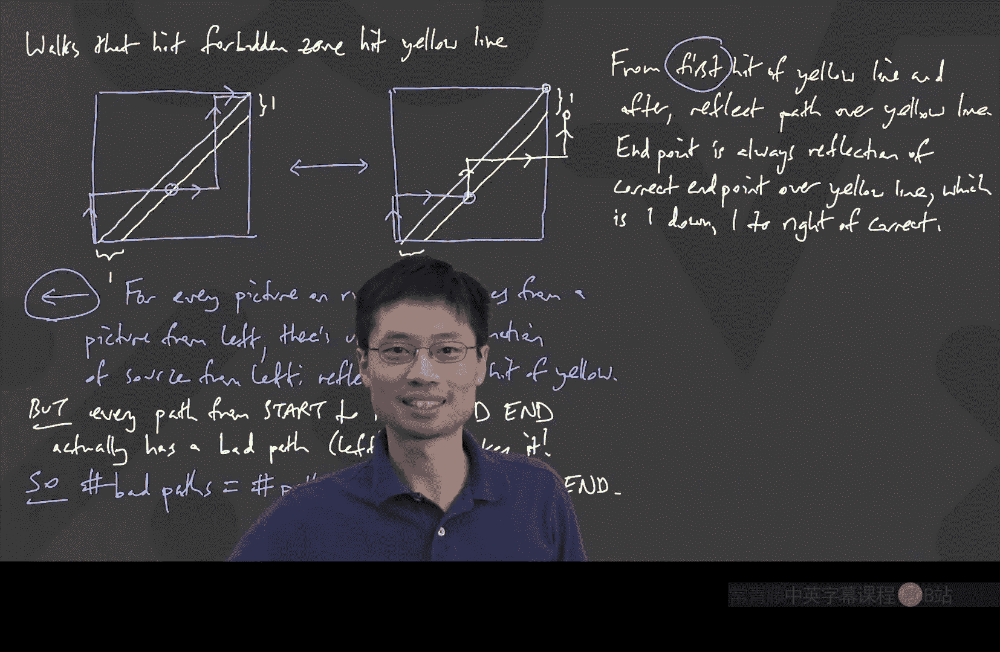

# 卡耐基梅隆【中英⚡离散数学｜21-228 2023, Discrete Mathematics】 p21 P21 -BV1sFibBkEj7_p21-

Hello， everyone。 How are you， Are you able to hear me。Yes， okay。 good。 We're on。 We're on there。

Double checking this thing。 Yeah， great。 Okay， let's go ahead and start。

 So we're talking about Catalan numbers。 And just as a reminder。

 there's an exam which is coming up on Friday。 Something about the exam。

 I also want to mention if you were doing the old exams。 You may have noticed that some really。

 really old ones asked questions about expected value。 That's actually not on the exam。

 People wondered what is on it。 It's what we've covered about recursions and generating functions。

 And it'll go all the way through today's class。 where we finish up Catalan numbers。😊，O。

So let me go and switch to where I can draw。 And I'm going to continue from where we left off last time。

Just a second。 I'm trying to figure out why oops。 and second， the thing that I'm using here。Yes。

Let me turn that filter on， good。Okay， so here's where we were last time。

 And I want to bring us all onto the same page， because this is a fairly complicated thing。

 which is actually quite easy in retrospect。 if you， if you understand it。

 So bottom line was we said， okay， we want to know how many different arrangements can we make of these pairs app parentheses and pairs app parentheses。

 And we found out that it's hard to count them。 if you just count them。 But instead。

 if you kind of look at for the very first open， where does it close， you break into a lot of cases。

 And once you break into a lot of cases， you just see a pattern。

 And and the pattern is the number of ways to finish with each of these is the number of ways to finish the part inside that first open and then close part times the number of ways to finish the stuff outside。

 This is all stuff we had last time。😊，And that gave us a recursion。

 which was not a simple linear recursion。 And， in fact。

 it had a different length for every different different value of n。 So then。The game became。

 could we do anything with generating functions， And we found out that actually。

 if you just square the generating function， you get something that looks a lot like that。

 and we ended up finding that the square of the generating function looks somehow just like the generating function again。

 minus the first term， but then divide by a Z because we had to drop all the powers of Z。😊。

And then that took us to the quadratic formula where we found out that we have a formula for F of Z。

 F of Z is just equal to 1 minus the square root of this thing over 2 z。

 but then the problem was we were too lazy to take any kinds of Taylor series。Instead。

 I mentioned at the end that there is actually something you can do with this Newton's generalized binomial theorem。

 which is that if I have anything of the form  one plus something to any power， well。

 then you can write this down as some kind of a tail series。

 which may or which may converge in some small window around 0。

 and it happens to look just like the binomial theorem iss just the exponent choose stuff times the term to various powers of the stuff adding forever。

 and it generalize the binomial theorem， because if you had R being a non negative integer。

 this would just stop。😊，So now let's put everything together。 Alright。

 so the easiest way to remember this general generalized binomial theorem is just do the binomial theorem with dot。

 dot dots。 that that's really all that's going on here。 And at some point， they become zero。

 But yeah， that that's just adding zeros。😊，So back to the generating function。

 we have f of z equals 1 minus the square root of this， 1 minus4 z all over  to z。

 I'm going to rewrite that on the next screen。Oh， yeah。 after， after class。

 some people are chatting and and asking questions。 That was something separate。

 But F of Z is equal to 1 minus， I'm gonna write it as an exponent， exponential。

 like a fractional exponent，1-4 z to the power 1 half all over 2 Z。😊。

I think let me go back and double check。 I think that's what we had 1 the square root of 1-4 z。Yep。

 over Tuesday。Okay， so now if I want to do that。What should I do， I guess I should split this apart。

 And I should say there's one part of it， which is going to be that Newton's binomial theorem piece。

 And there's also this like one and this two Z thing。

 The thing to think about is if you can just tailor seriesize that part。

 It's great because if you can tailor seriesize that part。

 it's very easy to figure out how you put everything together to get the power series for the the whole F O Z。

😊，So let's now like， like， let's， let's focus on the， on the， on what is this1 minus。For z。

 all to the power of1 half。Okay， well now we know it's going to be a bunch of chooses， right。

 So this is just simply going to be， it's by the Newton's generalized binomial theorem。

 It'll be a half choose 0。😊，Times， negative40。To the power 0。Let me do this to the power 0。

That's the first term。 And the second term is plus。12， choose 1。Times negative 4 Z to the one。Plus。

1 half， choose 2。Negative 4 Z to the two， and so on。Is that clear。

 That's like what we just had with this nuton's generalized binomial theorem。 We just took the power。

 choose， I guess， the term number。 And then the thing。

 which was the Z is now the negative 4 z rate to that power。

I'm going to care about the end term eventually。 So let's think about what the end term looks like。

I don't know if I call it the n term or not， but I'll just say it's like plus one half choose n。

Times-4 Z to the power app。Okay。Now， for this， I'm not going to do my usual thing of doing n equals 7 and looking for a pattern。

 I'm actually going go and hunt for the end because we will want to write down a bunch of dot dot dots That's actually more convenient to do when you have the general term N。

 Oh， yeah。 And it keeps going。 plus dot dot dot。😊，Goes on forever。

How could we possibly try to simplify this， Because I don't like how this looks。 One half choose and。

 I mean， actually， you could say this is the answer。

 You could say the answer to the anth Catalan number is， well， if I want the anth Catalan number。

 let's quickly check which， which term of this would I want for the anth Catalan number。

 I just want to make sure everyone's on the same page。And feel free to type raise hand in the chat。

 If I care about C N， the Cat number C， N。 I， I'm asking this question because the answer is not the n term here。

How would I get the C， N Brad。我他。Okay， so I heard this one half coming out。 Let's。

 let's actually go and make that term。 right， What I'm what， what， what Braddon is saying is， look。

 if I want to get a C and Z to the N term inside this。

It actually comes from the Z to the power n plus one term in the rest of the stuff with the exception of the Z to the power 0 term。

 which might be weird。 but let's worry about that separately。 It's like we。

 we know how to find the Catalan number for C 0， C 1， C 2 by brute force。

 the interesting things are the big ns。 And when I say the first one might be weird。

 It's just because there's a 1 minus here。 And there's this extra one。😊，But in general。

 if I want to get the C and Z to the N term， the way it comes from is I get the N plus。

 I get the Z to the power N plus one term from the Newton binomial thing。And they get it。

 and are divide it by2。Okay。So where that actually comes from is。

 maybe let's write the next row just because that's the next one。 It's plus。This one half。

 choose n plus  one。-4 z to the power N plus 1。 And this particular term。Goes up into there。

Is that clear like this particular term has a z to the power n plus1 in it。

 which is exactly what you need because you need to divide by this this Z in the denominator。

And you might wonder， oh， wait， is it going to be a legit power series。

 The reason it's going to be a legit power series， even though there's a 1 minus here。

 is because the very， very first term of the binomial theorem expansion is just a plain  one。

 So the one and the-1， This is1-1。 They cancel each other out。

 And then that thing doesn't matter any more。 So I can actually divide by twoy。😊。

The reason I said that is because if， for some weird reason， the numerator of this expanded to have。

5 plus something Z plus something Z squared plus whatever。 You can't divide that by 2 Z。

 because what's 5 divided by 2 Z is not a power series。 You can't take 5 divided by 2 Z。

 Does that make sense。 So the important thing is that this one here。

 All that does is it knocks off this first thing right here。And that's it。

 So I'll use like some colour here just to say that this one。Just knocks off this piece。And does it。

 And then so the rest of the terms are just going to be simply this over like negative this over 2 Z all the way to negative this over 2 Z。

And with that， we have a nice formula now。 now we know。

That the n Cat number by equating the coefficients， that's just going to be minus。1 half。

Times 1 half， choose n plus 1。Times negative 4 to the power N plus 1。

 I'm going to pause there because I want to make sure that this one makes sense。

And also is correct because I could make mistakes。H， is this right。Well。

 this is the z to the power n plus one term。 That's why I don't have a z to the n plus one here。

 And I have to divide by 2 Z。 Then that's why there's a2 here。 And the Z dropped to the power N。

 That's how it equated because Z to the power N。 And there's a minus sign。

 So that's why there's a minus sign。 Is everyone okay with this。We have now found the formula。

 That's the formula for the an Catal number。 It's amazing。

 It's just take a negative half true like a half true stuff。😊，Okay， well。

 let's see we can turn this into something more pretty because we're not used to doing half choose。

 Okay， so I'm going to write that on the next screen。 So C， N is equal to negative a half。

That was a half。Choose n plus1。And then it was negative 4 to the power N plus 1， I think。Yes。

All right， Any suggestions， how could I try to clean this up if you were supposed to do a half choose n plus1？

I guess we could just。Do it。ButWhat does that look like。What is， what is one half choose n plus1。

us a half。What does that choose n plus one even mean， We can write down some stuff。

 We'll have some dot， dot， dots。The minus half is just the thing in the front。Yeah。Aaron。マイナス？所。啊。

justly。売売。I'm just writing now what you said， first。You said something like this。 Is that right。Yeah。

And later。Like minus half minus。開表はい。I know what you're getting at。 You're like， yeah， if I。

 if I put those things into this thing with the half， I could。

 I could expand this out and I could write it down。

 But the only problem is I don't have a good half factor。

 So that was the thing that maybe I talked about too fast last time。

 I'm just going to swing back just so we remember where this came from。😊，You see。

 the way we did this is we said for these Rs。Even if the R is not a whole number。

We could think of like our choose 3 to be that thing。

And the reason is because it's not like we're just making stuff up。 We're like， actually。

 we just want to do Taylor series。 If you just simply do the Taylor series。

 you see that the coefficient of the Z cubed is supposed to be that thing。

 R times R -1 times R -2 over3 factorial， which we decided to generalize and say we're just going to write that as R chooses 3。

 even though R might be like half。😊，Okay， so I'm going use that as the lead off。

 What you said is okay。 Actually， you can generalize what you said using something called the gamma function。

 if you define half factorial what you said could be fine。 But I'm just going to say。

 how might you try to write this up。 I'm okay with dot dot dots。 I'm looking for a pattern now。😊。

What could I do。Jack。You read it as you're working on。Yeah， okay。And how many of them。有。今日はさんどうぞ。

Yeah。Okay。And then， you divide by。Good。And then you multiply by negative 4 to the power n plus1。Now。

 let's clean this thing up。 You see， now we actually have some stuff multiplied together。

 Could we potentially find some pattern。 Oh， oh， oh， yes。

 if I'm going to multiply all the way to n plus one terms。

 maybe we can even write down what the last term is。 That's ambitious。 What is the last term。😊。

Can anyone help me with that？ I always have trouble with that。What's the last time。

 I know that itll be minus and， I know it'll be over 2。 But what's on top。😊，这你问 though。

I'm getting a ticking noise from the kitchen。 Let me close the door。Sorry。

 my stranger was making some ticking guys。 Okay， And says， is it one plus 2 n， Is it？ I mean。

 I'm asking you the question。 I don't know How many people like that。 So you said one plus 2 n。

By the way， here's how I check anything like that。 I check it in for a particular value of n。

 And in this case， I'm not gonna do 7。 Oh，2 n-1。 Okay， well， we'll find out really soon， right。

 So I'm like， I know what I would do if n equals 3， If n equals 3， I see 4 of these things。 right。

 If n equals 3， it should be going to the fourth one， because it's n plus 1。 And if n equals 3。

 I would get。😊，It's -1。 that's how I see。 It's -1， right。

 because I need to know that whatever I put in here actually matches what I would expect to see。So。

2 n -1。Right， and that's because if it works for three， it works for all of them。

 And if n is equal to 3， I want the first four terms。 And then the fourth term。

 it would be two times 3， which is 6，-1 is 5。 And that would be this one。 Okay。

 so we wrote the whole thing down。So now we want to go and simplify。

 Can anyone have any ideas on how you could do some cancelling or simplify。

 Do you see anything that's useful。By the way。Do you know if any Cat numbers are negative。Cse not。

 They're counting things。 They can't be negative。 So so can we simplify， yes， Nancy。と。Good。

 so we're gonna to fix up all of the negatives and fix up all of the one house。

 So the important thing is， if you just look at it， there' is clearly n plus one negatives。 Sorry。

 there's n negatives here。 One more negative there。 That's n plus one negatives。

 And here's n plus one other negatives。 N plus one plus n plus1 is always an even number because I added a number to itself。

 So all the negatives cancel。😊，Okay， that's the first important piece。

 So the important thing about this is that here。You have n plus one negatives。

And here you have n plus one negatives。And so whenever I have the same number of negatives and the same number of negatives。

 of course， that would be an even number of negatives total。So， it's an even。Number。Of negatives。

Implies all signs。Cancel。Okay， that's convenient。 So now I don't need to worry about negative numbers。

 You also want to fix the tools。Alright， I there anything I could do to kind of write down what's the power of two。

 What's， what's the way to do this。Well， I guess I'll do it since since you suggested it already。

 So over here， how many toolss are in this part。So there's 4 to the power n plus  one。

 That is 2 to the power， twice as many of them。 So that's 2 to the power 2 n plus 2。Right。

 that's how many toolss we've got。Because I had n plus one pairs of twos。 And now。

 if I look at the rest of it， how many twos do I have， I have n plus two twos， right？

 I've n plus one twos from these guys。And then I have another one。 So I have n plus 22s。

2 to the power n plus 1。 No，2 to the power n plus 2 in the denominator。O。😊。

So what's the answer so far。Things got better。All of the negatives are gone。

 and I have on the positive side， I have a strange thing。 I have like one times 3。

Times 5 times 7 times dot， dot， dot times 2 n-1。On the denominator， I have n plus1 factorial。

And I have an extra。Times。2 to the power at。If I make a mistake， please correct me。I mean。

 I I'm just like， this looks much prettier。 I have a factorial。 Okay， I have this other thing。

 You may remember that I I said that some people write this other thing as 2 n-1 double factorial with two exclamation points。

 You could do that。 But it turns out that this problem is much more beautiful than that。😊。

It turns out you can turn this thing， this thing into something that looks kind of like a truce。

 because we don't really like the double factorial。 Doub factorial means you skip every other one。

 right， That's no fun。 Let's just for fun， multiply in something that will fill in all of those gaps。

😊，So what I mean by filling all those gaps is I'm now going to multiply by one。

 I'm going say that's equal to。 I'm going to multiply by a blue thing。

 and the blue thing will be the same thing on the top and on the bottom。

Can anyone suggest what would be good things to multiply on the top and the bottom。Nぜ。Okay。

 so is is going to be an n factorial。 That's what we're gonna get。 That's what we're gonna get。

 I want to make a factorial on top， though。 So what numbers are missing。不。The even ones。 Okay。

 and that's where you're getting your factorial。 So let's multiply in to。4，6， and so on。

And let's just go all the way to 2 n。 That's a nice even number。 I'm going beyond。 I mean。

 if I just was filling the gaps， I might go to 2 n -2， but  two ns nicer to write。

 And on the denominator just multipplied by the same thing。 I've simply multiplied by one。 So。

 of course， it's equal。Okay， good。Now， let's try to simplify this。 This is true。 So this becomes。

The numerator is now a perfect factorial。 It is a2 n whole thing factorial。😊。

The denominator has an n plus one factorial。I have this two to the end。

And I still have the denominator。 The denominator is still lying around2 times 4 times 6 times dot dot dot times 2 n。

 How do I rescue this denominator。It's really annoying。 I have a 2，4，6。 Who。

 I see a lot of race hands all up here at the same time。 Nick， how about you。😊，Well。

 you can find her at each of。Yes， so the thing is， we don't really like to do multiplying odd numbers together。

 I don't like to do odd numbers multiplied because that's not a factorial， right。

 But even numbers multiplied as a factorial。 I actually， there's n of them。's。

 that's very convenient。 I have a two to the n。 I have n factors of two that I can use to cancel out every single one of those。

😊，So let's do it。 The N cancels each of those into a one。2，3， all the way to N。 Oh my gosh。

 it's nice。 It's just n factorial on the bottom。 Okay， that was nice。 So what is this。😊，Toan。

Factorial over n plus 1 factorial and factorial。Now， that looks very convenient。 That's like nice。

 right， This is like how many ways are there to arrange N pairs of parentheses。Well。

 the number of ways to arrange N pairs apprenheses， which are legitimate。

 is2 n factorial over n plus1 factorial times n factorial。😊，Nice。

And now I want to do a fun punch line。 Let's compare that with a totally different question。 So。

 firsts of all， this is， this is an answer， but I want to compare this answer with a different question。

😊，And the different question I'm going to ask is。How many ways。To arrange。And pairs app parentheses。

 if you don't care if it's legit or not。Apprenheses。If you don't care。About valid。You know what。

 what I mean， I just mean I have N opens and n closes， and they can be like crazy。

 but it's going to be an opens and and closes。So， for example。

 now this thing is allowing things like clothes， close， close， open， open， open， okay。

But it's n pairs of them。 So I actually do need to have N opens and en closes。

 What's the answer to this question。This one doesn't need any generating functions or anything。

Britain。Yeah， choose n spots out of the two n spots。For open。Why did I do that。

 So I just said that the number of ways to just like arrange any old parentheses is to and choose n。

 And we were talking about how many of the ways are valid， right？

 So then we can ask this interesting question。What fraction。Of them。Are valid。Well。

 we know the number that are valid， the number valid。Is equal to the Catalan number。

 which I'll copy again from the last screen That was2 n factorial over n plus 1 factorial and factorial。

So what fraction of them are valid。Right， this is how many valid。 That's how many total。

And you should not expect a nice number who， who would have expected it would be a nice number。

 I wouldn't have。 It's just like randomly being like， how， what's your chance of being lucky。

 Probably some crazy thing。 Yes， exactly， it in。 you're。 It's just one over n plus one。

 because that's all there is。 It's just an extra it's an extra n plus one。😊。

This actually is just one over n plus 1 times 2 n， choose n。So， the fraction。That are valid。

It's just equal to one over， and plus one。Too nice。 does not deserve to be this nice。 But it is。

 Okay， so that's the Catalan numbers。 That's the formula。 And actually， once you see this。

 it helps you double check if you are ever running into Catalan numbers again。 It's like， well。

 it's gonna be something nice compared to if I just was not thinking at all and typing some N and opens and end closes。

 It's just one over and plus one fraction of them。😊，Alright。

 so that's the proof of Caal numbers using this generating functions approach。

 I'm going to pause here and ask， are there any questions about what we just did here。Like。You know。

 we just。We did this Taylor series thing。 Sorry， go back。 we did this like gender functions thing。

 found the generating function， did the Taylor series by using the Taylor series for Newton's binomial theorem and then like hunted down。

 What's the coefficient of the Z to the N。And when we did that， we got a mess。

 and then we made the mess messier。 and then somehow it all collapsed and became nice at the end。

And that was the answer。If no questions， I'm gonna go on because I want to also talk about other ways to do this。

 So it turns out Catal and the ooh question。 What's this。Miss how we done。 Oh， yes， yes， yes， yes。

 Let me go there。 Thank you for asking。 Okay， So what did we do here。 So first of all。

 whenever I have the random real number， choose nonnegative integer。

 what that means is this is what happens here。 If I have like non negative integer choosing non negative integer。

 But if I have random old real number， you multiply together as many copies， sorry。

 as many of the real number， real number-1 real number-2， keep oning1。

 do it as many times as the as not denominator as that bottom number is and divided it by the bottom number factorial。

 And the proof of why this worked was that's actually just what you did when you were doing Taylor series for the for the particular function。

 which is one plus z to the power R。 That's what we did towards the end of the last last last class。

 where we just took all the derivatives of this。 And as we took derivatives， we found that the R。

 the R-1， the R -2， all multiplied out in front。 And for Taylor series， you plug in the thing being0。

 which is great because1 plus0， I don't care to what power that's going be one。😊，Cool。

 so now I want to go on into another approach。And the other approach shows what Catland numbers have to do with counting something very different。

Okay， so what we're going to do now is we're going to ask a different question。Which is， how many。嗯。

Mountain paths。 I'm gonna call them mountain paths。With。2 and steps。Never。I'llGo below。The sea level。

And I need to put an example of what in the world do I even mean。 So what's a mountain walk。

 A mountain walk means that you're going to go diagonally。 Everything is a slope 1 or slope -1。

And every work takes a step， which is the same size。Like this。 So what I'm doing here is that each。

Sttop。Is the same length。And has slope plus， or -1。And the sea level is here， where you started。Okay。

 first of all， if I write this quite this kind of question down。

 what do you see about what this has to do with what we have been thinking about。Yes， right。Yes。😊。

Yes。😊，Yes， so it's just。C， N， is that okay， That's the n's Cat number。 Like。

 this is just a different way of looking at the same thing。Alright， and if you see these things。

 these actually have names。 I don't。 They're not actually called mountain paths。

 You might see some other books might call them。Dick Pas， D CK。Okay。

 and you might imagine these are kind of important。 There are lots。

 There are actually lots of applications of this。 One application of this is called gambling。

 if you are gambling and。When you gamble， you can't gamble when you of zero money。

 or if you actually， this is highly not recommended。

 But if you are speculating on cryptocurrency or something。

 but if you have like some money and you are investing it or something， if you've got positive money。

 you might get more money and you might get more money or you might get less money。

 but there's one problem about sea level。 if you have no money left， you can't invest。Supposedly。

 I think， I think that's how the thing usually works。 So like， this is often thought of as gamblers。

 which are going around， gambling their money。 And if you gamble and you do well。

 you can keep growing。 But the moment you hit sea level， its， it's over。 you， you ran out of money。

Okay。Well， in in their case， this sea level would be like one penny or something like that。

 The the minimal unit of money， because if you have 0， you can't do any betterdding。Okay。

 now I want to count this in a totally different way。 Of course， we know the answer is C。

 But once you write it in this way， you can turn your head 45 degrees。😊。

And you can ask it as a different question， which is how many。I'm going to call it up slash right。

Works。In we're gonna draw a grid。Here's a grid。It's going to have N。It's gonna be width。

 and and height n。And this grid is going to be something like， you know， I'm just going draw some。

Some of these。Things that are happening。Okay， I just did this。

 How many of this where you stay always above the main diagonal。In this。Where。You always。Stay。Above。

Or on the main。Diaagonal。Well， I mean， it's obvious。 This is the same， same question。 Is that okay。

 Like， this is the same question。 If I just made it n by n， all I did is I， oh， my， my。

 my thing is mirrored。 So to look this way。 But like I I have this thing flipped。 and。

 and it's just the same picture。 I have， I have two n total things。 I have n ups and and acrosses。😊。

And also， I need to kind of stay above this green thing。

 which is the same as staying above the sea level。So now let's just go account this。 Okay。

 I'm just going to count the grid thing because the grid thing is easier for me to draw。

 Somehow human beings are much better at drawing grids than at at trying to draw like 45 degree angles。

 I find it very hard to draw perfect 45 degree angles， but vertical is okay。😊。

And vertical and horizontal is okay。So now let's look at this， this particular thing we're counting。

嗯。If I want to count how many are always above or on the main diagonal， Well。

 the answer is how many are there where I don't care about this thing。

 minusus how many there are where I go into the bad zone。Okay。

So I'm going to say that the C N is equal to the number of walks。An。Theres this N by N， grid。

This thing， number of walks on this。Minus the number that。Go into the forbidden zone。

And and that was supposed to be a square， but I'm just going to do this。

 and I'm going to say the forbidden zone is here。Is that okay， My walks， by the way。

 My walks are always。Always the box are like up。Or。Right。Okay， those are my walks。 up All right。

 If I allow myself to also go down or go back， the number of walks is infinite because I can just kind of go in circles。

Okay， so I want this。 Let's start which one is easier。

 Is there one of them that we can answer right away。Aha， Christopher。要。It's， I've got two N steps。

 and I choose N of them to be up instructions。 We， we saw this before。 This is the。

 this is the problem we did before， walking on the grid。So I just need to do the other one。 Well。

 how could that be easier。 I mean， is it easier to count the ones that go into a forbidden zone。

 The answer turns out to be yes。And the reason the answer turns out to be yes is because you can use a technique which is hard to invent。

 it's called the Ref principle， which is what I want to share here。Alright。

 so now let's think about the paths。Wals， walk the wax that hit the forbidden zone。Okay。

 if I have a walk that's gonna hit the forbidden zone， let me draw a picture。

It's going to look like this。There is this diagonal that goes across。

And it's going to hit the forbidden zone。That actually means that if I drew。

The diagonal that's one underneath it。This thing here is exactly one underneath it， where， I mean。

 my scale on this is that this gap。It's one。And this gap is one。Forbidden zone means I hit。

 I actually hit the yellow thing。RightThe only way you could enter the forbidden zone is you actually legitimately hit the yellow thing。

Hit。The yellow light。Is that observation clear， It's like， if I want to count。

 how many ways do I hit the enter the forbidden zone， The moment you touch the yellow line bank。

 you hit the forbidden zone。 Let me draw one of these such paths。

 Maybe what happened is you kind of went up。And then maybe you kind of went across。And then。

 maybe you went up。Let's make it simple for now， all the way up。And then。Across。Okay， by the way。

 you might hit the yellow line， possibly multiple times。 I'm just saying you hit it at least once。嗯。

Now， it turns out that there's something you can do here。

 which the first time I ever saw it blew my mind。 and then I had to remember it。

 there's something called the reflection principle。What if for fun。For every one of these pictures。

 we drew another picture where we did some reflections。 So we're going to associate it with。

 This is called a by。 But it doesn't matter。 I'm just saying for each one of these。

 I'm going to draw another picture。 And the other picture happens to be the same。😊。

I'm gonna draw the square。The yellow line。So， the green line， the yellow line。Remember。

 there are distances of one。But now， what's going to happen is after the first moment when I hit the yellow line。

 because there is some time that I hit the yellow line。 The first moment you hit the yellow line。

 the rest of it， we do a flip。 We reflect the rest over the yellow line。

So I'm going to draw it exactly the same picture here。 I went up。 I went across。

 but now I hit the yellow line。And now， from now on， I just will。

Flip everything across the other leg。Does that make sense， I'm gonna。

 I'm gonna reflect it across the yellow line。 And just to contrast， maybe I'll use some， Oh。

 yeah white color。 So if I reflect across the yellow line。 Oh。

 that's where the next thing is gonna hit。 Okay， so it'll go like up。Go a cross。

And then it will go up。And what I have just done here is from that first hit point thereafter。

 I reflected across the yellow line。From first。Hit。Of yellow line。And after。Reflect。The path。

Over the yellow light。I want to give some time for this to digest。

 because this is a really amazing trick。😊，Okay， so what exactly happened。Oh。

 I always will hit it because I'm counting the ones that hit the yellow line。 And as soon as it hits。

From there on after， you see what I did with this pinkish thing。 It was doing that zigzag。

 And if you reflect that zigzag over the yellow line。

 then the zigzag ends up becoming the white thing。If it hit the yellow line many times， it's okay。

 I mean， here I hit the yellow line again， actually， as I was going past， but。

There's something interesting about where you end up。

Do you notice how I was very careful to draw where I ended up。Where do you end up。

 I claim that no matter what you draw， if it's any pink thing which hits the yellow line and you do blah。

 bh， blah， blah， blah， and then you do the reflect。After the reflection。

 I claim you always end in the same place。 And why is that。And where is that place anyway。

And how would you know。Let's get some more people involved。 So maybe Sean， Sean， what do you see。Oh。

 yeah。 it's the， it's the old endpoint just reflected over the yellow line。

 That's the easiest way to say it， right， because I， I'm doing something。

 And I always go to the same correct endpoint。 But now I'm saying in all of these that hit the yellow line。

 I'm going reflect all of them over the yellow line。 Well， then therefore。

 they better all end at the place they're supposed to end at。

 reflected over the yellow yellow that reflected over the yellow line， which is exactly that one。

 That's why I was very， very carefully to draw that one。😊。

That spot is exactly the image reflected over the yellow line。Of the supposed to be。finish point。

 right， The supposed to be finish point was up there。

 And the yellow line is just coming right around。 So I should be kind of like one down and one to the right of that。

 if that makes sense。Okay。So the important thing is that the end point。Is always。The reflection。

Of the correct endpoint。Over the yellow light。Which is one down and one to the right。

Of the correct and point。Okay。Great。😊，So there's something interesting I drew here。You see。

 I drew a blue arrow that goes both ways。That's a funny。 That's a very strong statement。

 because so far， I was just telling you， hey， if I take。Bad。Pink line。

 which happens to touch the yellow line， which is what makes it bad for every one of those。

 I can make one of these。Okay。But there's something interesting here。

For every one of these on the left。I can make one of those on the right。

But if somebody was just showing you the thing on the right。Could you figure out where it came from。

And how。The the bidirectional arrow。 so far， we've only done one way in a byjection。

 you need to say for everything here， there's something there， for everything here。

 There's something there and so on。How come I have two arrows。 If I have two arrows， then supposedly。

 if you never saw this in the first place and you just saw that， you would be able to say。

 I know it came from this bad pink line。 How would you undo it。2。安置。

You reflect it again around where。 So I'm looking at this guy， right， I've got this path。

 It happens to go from here。 It happens to go to there。 How did I know。

 How do I know not to reflect it there。Oh， no， you're right。 It is reflecting。

 I just want to be a bit precise on exactly what you said。

 because it might cross the yellow line multiple times。 How do I know which one to reflect that。Like。

 how do I know， I don't just reflect that part。The first one。 Yes， yes， yes。

 That's why the first was so important， right， Because we said the first hit of the yellow line。

 That's why I want to emphasize here from the first hit of the yellow line。 Oh。

 I should use the pink because that's what it was from the first hit of the yellow line。

 that's where you reflect。 So if you want to undo the reflection。

 you just go and find out that first place that you touch the yellow line。

 that's got to be where you did the reflection， right。

 Because whenever you reflect yellow lines going to yellow line。😊，And so you can't be like。

 after reflecting magically， I got another point on the yellow line。 No。

 every point that was on the yellow line before reflection is also thereafter。😊，Josia。

 you had something， were you going to say the same thing， or do you have another question？Okay， good。

 good， good。 So this is cool。 So what we just found out is for。😊，Every。Picture。On the right。

That comes from。A picture from the left。There's a unique way to get back the picture on the left。

There's a unique。I'll call it reconstruction。Of the source。From the left。

You know exactly where it came from。 And that is， just reflect。Over。First。Hit。Of yellow。Now。

 note that I emphasize it's this is true for every picture that came from the right。

 So what I'm saying is for everything I'm trying to count。

 I'm trying to count all of these things on the left。 I don't know how many of them there are。

 but for every one of them， let's draw a picture on the right。

 And at least I know that the number of pictures on the left。

Is the same as the number of these on the right that I could make from those。Does that make sense。

 It's like instead of counting these on the left， I only count those on the right。

And if I count how many of them there are here。 Well， then then itll be the。

 if I count how many of them are on the right， I'll be good。 But why is that good。

 How would you know on the right， Like， how would you know。Which of them could have come from here。

 Like， what I'm talking about this projection thing is that somehow I've shown that if I got something on the left and I try to make something on the right。

 I'll never double make。 I， I'll never make the same thing twice。 But then I need something called。

 that's called injectivity。 I need something called serivity that will make my life really nice。😊。

In fact， I claimed that。I claim that everything that goes to here。

Everything that goes to this particular endpoint came from something over there。

I claim that every single picture you draw where you start from the starting point and you end at the reflected end point。

 I claim that every single one of those， I can point to a picture on the left。

 which is a bad path that touches yellow。 that gave that picture。I'm gonna write that down in words。

 because that's important。But。Every。Pa。From。The start。To the reflected end。That's what we did。

 reflected and。Actually。Has a bad path。Which is from the left。That makes it。I'm。

 I'm actually saying that it's always。 and why， why is that， Chris。Okay。

 because if I run it through the function twice， I'll get the same thing because actually。

 if I find the place where it intersected， O， is's over there。

 And then if I do another reflection around that intersection point， I get back to where I was。 Yes。

 the only piece I want here is that there's one piece here called existence。

 How do I even know that if I start from here， And I end at the reflected endpoint。

 How do I know I touch the yellow line。😊，That's actually the beauty of it。

 That's why this proof is interesting。 How do I know I， I touched the yellow line， Braden。😊，Yeah。

Yeah， I'll call that the。 It's obvious。 There's no way you can get from there to there without crossing the yellow line。

 you just can't。 So the， the amazing thing is that this new thing。

 which we drew every single path from the beginning to the reflected end。

 every one of those crosses the yellow line。😊，Oh， that means I just find the first such crossing。

 Reflect the rest。 T'll give me a picture here。And that one is the unique one that partners with it。

That's this huge observation。Right， so the huge observation is so。The number of bad paths。

Equals the number of paths。That go from the start。2， the reflected end。This is huge。

And so I want to pause to make sure this makes sense。 It's like， before I don't know how to count。

 because it's like， how do you know， do you touch the yellow line or not too hard。

 I don't know what to subtract。 And then over here， it's like， well， you know what。

 if you did the reflection。Every single one of those bad things。

 it becomes one of these that goes from the beginning to this mysterious reflected endpoint。Okay。

 but it turns out that at that point， every single path that goes from the beginning to that reflected endpoint comes from one of those uniquely。

 So the answer is just how many paths from here to there。That's amazing。 Actually。

 how many paths are there。 Is that easy or hard。How do I know the number of paths going up and to the right that start from here。

And， and there。Nick。那第一点就是。好玩。大家看嘛。So we're on a grid， right， So you're like。

 you have to fix going right twice。 So what you're saying is somehow before we had n ups and n rights。

 And you're like， not quite anymore。 You have a different number of ups and rightss。

 but we maybe can use similar ideas。 I want to go and crystallizes a bit more， Jack。有。So， it's like。

Yeah。😊，Yes， it's like， I've got two n total steps still。 but now I have an extra to the right。

 So it's like I've n plus  one to the right and n-1 ups。😊，So let's， let's do thisPrevious thing。

Over here on the right hand side， it is just the number of ways This is equal to the number of ways to do n plus one。

Us。And no， no， n plus one writes。And n-1 ups。And that was equal to。2， N， choose n，-1 or n plus 1。

 whichever is your favorite。Bam， that's the formula。 Subtract these two。 That's it。So， so。

 so like that's amazing。 no generating functions required at all。 In fact。

 at this point is just algebra。 What is that， If I want to subtract that， that's equal to2 n。

 choose n minus2 n choose n minus-1。 But we know the answer。

 The answer is supposed to be1 over n plus1 times this2 n choose n。

 So now let's just shape it into that answer。😊，And the way we'll do that is we'll do some algebra。

 So this is equal to 2 n choose n minus。 Let's write out this two n choose n -1。 It's 2 n factorial。

All over n-1 factorial， and plus one factorial。Now。

 if you wanted to turn the whole thing into two and choose ends。

 I need to mess around with the second piece to make it look like two and choose n。

And the way I would do that is I， I think I'll just multiply it by n over n。

The reason is because I actually want to make an n factorial in order to make it look like two and choose n。

 I want to have an n factorial on the bottom and another n factorial on the bottom。And in particular。

 if I take this thing， I can rewrite it as two an factorial。Over， there is a full n factorial now。

 and the n plus one factorial， I can call n plus1 times n factorial。

 Let's use green just to show that's where that came from。😊，N plus1 times n factorial。

 And there's still an extra n。Does it make sense what I've done。 I just simply said。

 I don't like this funny form。 I want two entries N。

 How do I force it to look like two entriess n multiply by one。

 And by multiplying by this particular n over n， I'm able to have an n to throw into my n -1 factor。

😊，Why is this satisfying。I want to know the answer as a fraction of two entries N。What have I done。

 What is this。This is a certain fraction of two entries， and。S。Yes， so I have a two n choose n。

 And then of a minus， it's simply n over n plus1，2 n choose n。 Oh my gosh。

 that's exactly what I wanted。 Of course， math has to work， right， It can't be a different answer。

1 over n plus1 to n choose N。 That's the end Catal N number。 Okay。

 so now we have just gotten like totally different way to solve this problem。

 One way to solve Catal n numbers was the generating functions， which is actually very satisfying。

 even got this binomial theorem。 The other way to get the Catalan numbers is to do this crazy reflection principle。

 And what you see on this screen here。 This is just algebra。 That's not the interesting part。

 I'm going to leave the reflection principle on the screen as we， you know as we finish this class。

 because this is crazy。 It's like， how would I count the stuff on the left。

 I don't know is it's just totally random stuff。 But if you do that reflection。

 It turns out that your full set of what you're counting。 becomes a complete overlap。

 It's becomes the same set as all the paths that start from there and end at the reflected end point。

😊，Because every single one of those。Happens to come from one of the original ones。

 and you'll never get the same one twice。 Like， that's a miracle。 It doesn't deserve to be true。

That's actually the beauty of why this works。 It's like by doing this reflection。

 I'll never get the same thing twice。 But， oh my gosh。

 it turns out that the things that I I'm getting instead。

 anything that you could possibly get by starting from here and ending there。 Well。

 it just so happens to be hit from one of those。😊，So then the answer is just how many of those there。

And that's it。So that finishes all of our recursions， generating functions， Catal numbers。

 and that finishes the unit。If people have any questions， I'm happy to answer them。

I'm just going to stop the broadcast。

