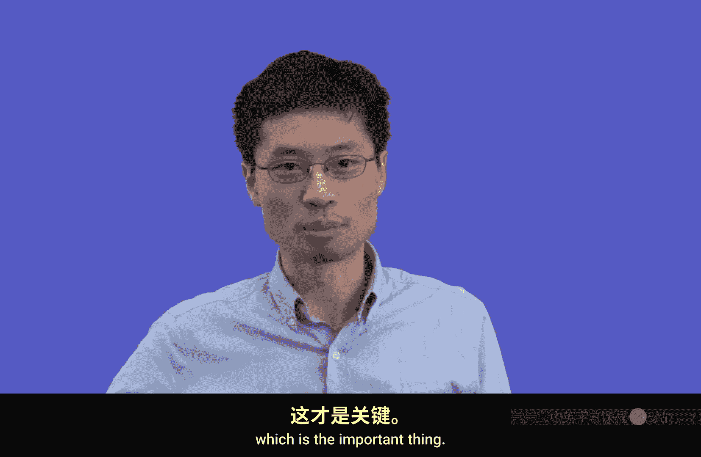
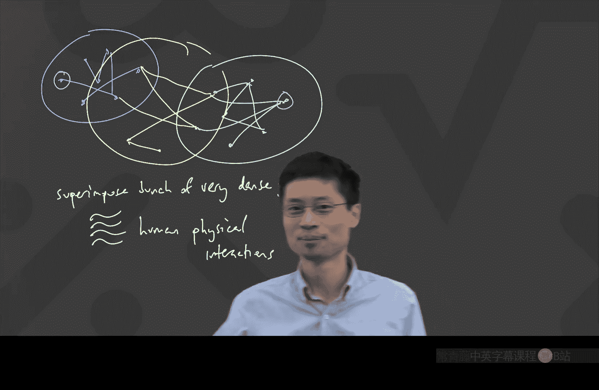

# 离散数学：第22讲：图论入门

在本节课中，我们将开始学习图论。图论是研究由节点（顶点）和连接线（边）组成的结构的数学分支。我们将了解图的基本概念、不同类型的图，以及图论在现实世界中的应用。

---

## 图的基本概念

图由两部分组成：**顶点**和**边**。顶点是图中的点，边是连接顶点的线。图的核心在于顶点之间的**邻接关系**，即哪些顶点是直接相连的。

一个图可以用多种方式绘制，只要顶点之间的邻接关系保持不变，它们就是同一个图。例如，以下两个图本质上是相同的，因为它们表示了相同的连接模式。

*   顶点 A 邻接于顶点 B 和 E。
*   顶点 B 邻接于顶点 A 和 E。
*   顶点 C 邻接于顶点 D 和 F。
*   顶点 D 邻接于顶点 C。
*   顶点 E 邻接于顶点 A 和 B。
*   顶点 F 邻接于顶点 C。

---

## 现实世界中的图

图可以用来表示许多现实世界中的关系。以下是几个例子：

*   **交通网络**：地铁站或航线连接的城市可以构成图。
*   **互联网链接**：网页之间的超链接构成一个巨大的图。
*   **社交网络**：社交平台上的好友关系或关注关系构成图。
*   **文本预测**：单词在语言中的常见连接顺序可以建模为图。
*   **生物网络**：蛋白质之间的相互作用可以表示为图。
*   **人际网络**：“谁认识谁”的关系图在现实中非常有用。

理解这些图的结构，可以帮助我们解决实际问题，例如规划路线、分析信息传播或设计算法。

---

## 一个图论应用实例：疾病防控

上一节我们介绍了图的基本概念，本节中我们来看看图论如何应用于一个具体问题：疾病传播防控。

想象一个图，其中顶点代表人，边代表两个人有密切的物理接触。传统的疾病防控方法是：当发现一个感染者（病患顶点），就找出并隔离所有与其直接相连的人（邻接顶点）。

我们的团队提出了一种新思路：不强制隔离，而是告知每个人他们与感染者之间的**图距离**。图距离定义为两个顶点之间最短路径的边数。

**公式**：`图距离(u, v) = 连接顶点u和v的最短路径上的边数`

这个简单的改变将策略从“你已被暴露，请隔离以保护他人”转变为“风险正在接近，你可以主动采取措施保护自己”。这改变了人们的动机，使防控工具更可能被自愿使用。这个创新正是基于从“是否邻接”的二元判断，转向“距离是多少”的整数度量这一图论思想。

---

## 图的类型与性质

现在，让我们认识一些常见的图类型及其性质。

### 树

树是一种特殊的图。以下是树的一些关键性质：

*   图中没有**环**（即从一个顶点出发，不重复经过任何顶点或边，最终能回到起点的路径）。
*   图是**连通**的（即任意两个顶点之间都存在一条路径）。
*   任意两个顶点之间存在**唯一**的一条路径。

树因其分支结构而得名，在计算机科学（如数据结构）和网络分析中非常常见。

### 顶点的度

顶点的**度**是指与其直接相连的边的数量。在社交网络图中，一个人的度可以近似代表他的“朋友”数量。

**公式**：`度(v) = 与顶点v相连的边数`

关于度，有一个重要的定理：

### 握手引理

握手引理指出，一个图中所有顶点的度数之和等于边数的两倍。

**公式**：`∑ 度(v) = 2 * |E|`，其中 `|E|` 表示边的总数。

这个引理之所以得名，可以想象边是一次握手，每次握手涉及两个人，各计一次。利用这个引理，我们可以快速判断某些图是否可能被构造出来。例如，不可能构造一个具有5个顶点且每个顶点度数都是3的图，因为度数总和15是奇数，不可能是边数（整数）的两倍。

---

## 特殊图族

在图论中，有一些经常被研究的标准图。以下是其中几种：

*   **完全图 (K_n)**：每对不同的顶点之间都有一条边相连。例如，K₅ 表示有5个顶点的完全图。
*   **环图 (C_n)**：顶点排列成一个环，每个顶点恰好与两个邻居相连。例如，C₄ 是一个四边形环。
*   **完全二分图 (K_{s,t})**：顶点分为两个集合S和T，S中的每个顶点都与T中的所有顶点相连，但S内部或T内部的顶点互不相连。

了解这些“图动物园”里的成员，有助于我们分析和建模更复杂的现实网络。

---

## 图的建模与现实意义

我们为什么要区分不同类型的图？因为图的结构直接影响其性质和应用。

考虑疾病传播网络的例子。如果我们假设人际接触网络是一个**树**结构，那么如果中间某些人没有使用防控应用（相当于从图中移除这些顶点），原本相连的两个人之间的路径可能会断裂，距离变为无穷大，导致系统失效。

然而，现实中的社交网络更可能由许多**高度连通的子团（近似完全图）重叠**而成。在这种模型中，即使一部分顶点（人）缺失，任意两点间的距离估计仍然相对稳健，不会发生巨大变化。

这种对图结构的直觉和理解，是设计鲁棒算法和系统的基础。图论使我们能够对复杂系统的行为进行理论推理和预测。

---

## 总结

本节课中我们一起学习了图论的入门知识。我们定义了图的基本组成部分——顶点和边，并理解了邻接和图距离的概念。我们看到了图在现实世界中的广泛应用，并通过一个疾病防控的创新案例了解了图论思想的实际威力。我们还介绍了几种重要的图类型（如树、完全图、环图）和基本性质（如顶点的度、握手引理）。最后，我们讨论了理解图结构对于建模和分析现实网络的重要性。在接下来的课程中，我们将继续深入探索图论的更多有趣性质和定理。