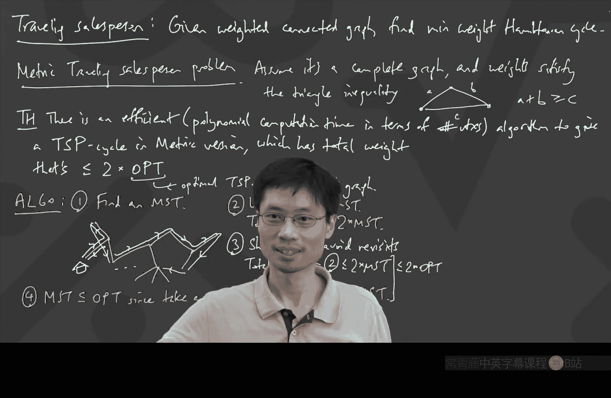

# 卡耐基梅隆【中英⚡离散数学｜21-228 2023, Discrete Mathematics】 p26 P26 -BV1sFibBkEj7_p26-

Hello， everyone。 Nice to see you。😊，I'm on time today。Okay， great， can everyone hear me？We're good。

 Okay， so let's continue from where we left off last time。

 We were talking about interesting ways to find minimum spanning trees。 And again。

 because last time I unfortunately was so late for class that I only showed up when class was over。

 I'm just gonna very quickly remind what we were talking about here with a minimum spanning tree。😊。

And we're going to do a different algorithm today， anyway。

But the notion is that if you have a graph and somehow there are weights on the edges。

So we have here some kind of a graph。And every edge has a weight。 So we have weighted graph。

I don't know。 Some weights，3，1，4。5。9，2， something like that。 Got some weights。

 Then if you're looking for a minimum spanning tree， which we always write as M T。

M is going to stand for a minimum， even though it could also be maximum。But， minimum。Sppanning tree。

And that is a tree which goes through every vertex。 Ex what obviously。

 And it has the minimum total weight。Using every vertex。And。With。没那么。Total。B。Okay， and as an example。

 if I look at this particular one， what's a minimum spanning tree here， I guess it looks。

 I'm just eyeballing it， poops， wrong pen。I'm just eyeballing it。 I think we can do it with。This。

Okay。Now， we talked last time about one algorithm that you could use to try to find this minimum spanning tree。

 Oh， yes。 And the graph better be connected or else it just doesn't exist。

 If the graph is not connected， there's just no way that you could get a spanning tree at all。

 So there's no minimum to do anything with。Let me just write。 Better be connected。Okay。

 and we talked about one algorithm last time。 It was called Prims algorithm。

 Prims algorithm was where you start from a vertex。

 and you just kind of try to grow your tree like a multiheaded hydra。 And that's what was。

 that's what we talked about last time。 And the recording is on the on the recorded zooms。

 I also think I sent maybe a YouTube link if you prefer to watch that。😊，Actually， I'm not sure。

Does Zoom recording also let you watch the recording at like 2 x speed。Oh， it does。 Okay， okay， I， I。

 I just know that some people prefer the YouTube because you can adjust that。

 although I I heard from some people that you， they also figured out how to override the settings to make it play at like 5 x speed。

 Anyway。 Oh， no， somebody just put a comment into the chat。 Maybe it's the secret。Yes， for speed。

 Okay， anyway。 so， so， so yeah， you， you can， you can， you can you can go into ludicrous speed mode。

 But now， now let's talk about a different algorithm。

 The different algorithm I want to talk about is called Croscos algorithm。

 And Cscos algorithm is not going to grow like by trying to grow some kind of a multi headed hydra。

 which which just sprawls across the whole thing。 You see， because if you think about it。

 What's a tree。 A tree is a connected acyclic graph。 So the prims algorithm we talked about before。

 We're saying， let's build a connected graph and make it as big as we can。😊，H well。

 since I've said it this way， what's the alternative， the alternative would be called。

 let's build an acyclic graph。And get it as big as I can。If that makes sense。

So that's actually what this CRscos algorithm will be。This is Csco's algorithm。Csco。

And this is to find the MST minimum spanning tree。 What you do is you start with all of the vertices。

 Yes， you have all the vertices。 and what you do is you just keep adding the minimum weight edge or a minimum weight edge。

 if there's a tie， just pick one。So。Keep。Adding。A minimum weight。Edge， oops。Rich。

Doesn't make a cycle。So that makes sense， right， I mean。

 it would make sense that you could just try to make a graph， make a subgraph。

 which has which ends up being a tree by just keep on adding and adding and adding as long as you don't make a cycle。

 Well， actually we do want to say a little bit about this。 like how do we know。

 how do we know that this actually even gives you a tree in the end。

Any thoughts like how do you know， how do you know that this is going to give you a tree in。

 And if you started with a connected graph。So we need to say， here's a question。Why。Given。

And initially， an input， an input graph， which is connected。That's connected。Does this。Make。A tree。

Aha， we have some people。 its insane。嗯m。😊，Okay， so there are a few ways that we can answer this。

If we could show。You get。The number of vertices。-1。Edges in the end。Then。It's。It's acyclic， right。

 It has no cycles we already know that's that's forced。 It's acyclic。With。The right number of edges。

And that gives you a treat。But the catch is， how do I know。

 how do I know I actually get to n-1 and vertices -1 edges。 I'd wait you have an idea。没有。

You know that there are no psychos。Nos。That means it's a ti。IsAnother。Okay。So let's try that， right。

 thats， that's often a powerful technique。 It's like， how do I know it'll work， Well。

 let's show it that it can't not work， right， So let's assume。For contradiction。That。You finish。

With like a bunch of different connected components。With at least two connected components。Right。

 and maybe the two connected components are here and here。 And there could be more。

 There could be more connected components。 And oh， yeah， when I drew those things。

 I'm referring to it being like they contain。神。Well， they're connected， right。

 So it contains like some kind of a tree like structure inside。Okay， so I have these two things。

 I might have more things。 But the important thing is that the graph was connected to begin with。

 So since the graph was connected to begin with， there is some edge somehow。

 at least one edge that goes between these。 There might be many。But。Since。Started。Connected。Must。

Exist。Sng edge。Between。And now the key is， why didn't we take that edge when we had a chance？

Actually， I shouldn't even say when when we had the chance because I'm saying。Keep adding one。

 which doesn't make a cycle。 Well， here's one。 I claim I'm done， but no， no， you can add this one。

 This one won't make a cycle， right， So you're totally not done。 This is like， keep adding。

 which doesn't make cycle。 I see 1。 I'm not done。 Add that one。

And that's because I've felt like connected lump， other connected lump。

 and they're not connected at all。 you' put one across。

 obviously there's no cycle because if you use that one piece as part of your cycle。

 how in the world are you ever going to get back？This。Can。Be added。呃。With。No cycle。So。

 you weren't done。Okay， that's very satisfying。 So now we know that at least this algorithm is going to create a tree。

 I mean， it's going to create an acyclone graph because that's how we've made it。

 And it's going to be a tree in the end because it's connected as well。😊，Well， in that case， now。

 the question is， how do I know that this is a minimum spanning tree。

 How do I know that the total weight is minimum？ And if you。

 like what we did in the last lecture is we explained how it's。

We explain how these kinds of greedy algorithms are very dangerous。

 It's like what if when you went to grab an edge and add it to this minimum spanning tree。

 What if it was the wrong one or what if you got locked into a path that's really， really bad。

 I mean， locked into I meant locked into like building something that's really， really bad。

 Then it's like you may as well just quit the game。 right。

 So what we need to do is we need to show that at every stage of doing this algorithm。

 we are always on a right track。 that that was actually how I did the proof last time as well。

 The goal will be to show to prove that this algorithm works。

 the goal will be to show that at any intermediate stage。

 whatever you've got is part of some minimum spanning tree。😊，And if that's true。

 then you're always on a right track all the way until the very end。

 when you have an actual legit spanning tree， a tree going through all the vertices。In which case。

 it is a minimum weight spanning tree， and you're done。Okay。

 so the heart of the proof is the same as before。The goal。😊，It's the show。That。After。Every。Addition。

Of an edge。To the MT。What you've got is always part of entirely contained in some some actual MT。Oh。

 I shouldn't call it the M ST because it's the partial MST。 Okay， because we're not done yet。

 We're we're making a partial one。Partial MT。It's。Entirely。Contained。Yin。An MT。Of the whole input。

Okay， so now I need to show this。 Well， it's the same kind of thing like induction as before。

 When I start off， it's true because。I have nothing。 I have no edges。

 So the initial cases is called the thing you start with is there are 0 edges and just all the vertices。

 That is definitely part of an MT because， well， every MST contains the empty edge set， okay。So。

 initially。Z edges。Picked。And it's true。That。Actually， it's quite interesting。

 This also then tells you a very powerful fact， which is called， you know， if I had a graph。

 a connected graph and the lowest weight edge was unique in the sense that if there was only one edge with weight of like 52 and everything else was strictly bigger than 52。

 What does that mean that that's like a pretty powerful statement。

 that means that every minimum weight spanning tree has to contain that one edge。😊。

Which is kind of surprising if you think about it， because like， okay， maybe not surprising。

 It's it's a nice。 It's nice that you should always pick the smallest one into the minimum weight spanning tree。

 But it's kind of interesting because， you know， a priori。

 if you didn't know this this algorithm would work， you might be a little suspicious of saying。

 But what if somebody just cooked the weights carefully so that picking that one would be a terrible trap。

 Do you know what I mean， like at the beginning， if you look at this。

 you might say maybe it's a trap。 Maybe somebody just set a trap saying here's a very。

 very low weight edge。 Surely you want to take it。 And after you take it， it's like bang。

 youve got some really expensive edges to deal with。😊，That that connect out。 But this， this。

 this fact that we're proving that you're always on the right track has that consequence。 Okay。

 so now let's prove that entire thing。So now let's， let's take a step。No。Suppose。

What we have gotten so far， the partial MST is contained in a real MST， and then we do one more step。

Suppose our。Partial。M， ST is in。呃。In， in， and in a total， let's call it in a total in a full MST。

 I'll use a different colour for this。嗯。Full MT。And what we want to do。都是。

And what we want to do is we want to show that if you do one more step of this algorithm。

 your new partial MST is also part of a full MST。Show one step。Later。😊，Still true。Well。

 what would that look like。I guess we got to kind of draw this out， right。

 We've got our partial MT so far。 And what is what is different about this and the Pris algorithm we talked about before is that now it doesn't really look like a tree。

It looks like this。There could be some vertices that haven't even been picked yet。

Does that make sense， Like， it might look something like this。 I just got some。

 some random thing that I drew。Maybe let's make it more stuff。Okay。

 so I got this random thing that I drew。 So it looks like this。 And actually this has a name。

 if if you read about this graph theory online， you。

 you will find out that some structure like this has a name。

 this is something which is just an acyclic graph。 This is called a forest because it contains lots of trees。

 that's actually what this is called。 So if you have something which is just acyclic。

 it's just called a forest。😊，Okay， but so suppose I've gotten this thing so far。

Now I am supposedly adding one more one more one more edge and the edge that I'm adding is a minimum weight edge that does not make a cycle。

Which one is that， Let's just go put something here。 Maybe that's here。H。So， E。Is equal to。A minimum。

Wait。Ege。That。Doesn't make a cycle。Actually， at this point， I'm going to say。

 do you see any interesting thing about E？There there's something nice about what this edge has to look like。

 If I， if I look at this whole bunch of little trees that I've drawn so far。

 I happen to draw an E like this。😊，Is there a general property that。

 if I have drawn a bunch of trees so far， an edge that will not create a cycle。

What is true about that edge， It's kind of nice。 And maybe we'll even find it handy， Bradon。Yeah。

 so the thing is that I have all these different connected components of my graph。

 and so it has to go between two different connected components of the graph。😊。

Because each connected component is already。A tree。

And that means that it's susceptible to if you add any one edge inside it。

 then that's going to make you。 Well， it's going to make you a cycle。

 And we had something like that idea before。 So I've got all these different connected components。

 and the edge has to go has to legitimately go between two of them。Okay。

 so that was a nice observation。Note。Must。Go between。2。Of the connected components。

Of this partial M T。Okay。H well， now I'm supposed to prove that whatever I've gotten here is going to be part of an MST。

 like of a full MST。Well， I I know that the original thing was part of our full MT。

If that full MST happened to contain E， I'm very happy， right。So the point is。

 I started with this yellow thing， and the yellow thing is part of some full MST。

I don't know what it is， but if that particular full MT happened to include E， great。

 I am already automatically done。 No other work needed to do。So I'll write， if。The full。MT。

Containing。The the partial MT。Happened to have E。Then you're done。

So we only need to do the other case。 What if it didn't have you。

So what does the other case look like， Well， there's this full MST that contains the partial MST。

That means it just kind of goes through this。Okay。Going through all this。 But it's a full MST。

 It is's going to do some other stuff。 Somehow， it has to link up everything else somehow。

 So maybe like this， maybe like this， maybe like this。Maybe like this。 I'm just drawing something。

Okay， maybe it looks like this。I just made up something。

 So maybe I have all of these things being connected。Another question is， hmm。Well。

 what can I say then。I would like to argue that there is a full MT。

 which happens to contain the E as well， happens to contain the yellow edges and the E as well。

So I've got this big full MST instead。What can I use。And actually。

 I'm realizing it's probably quite hard to see my video。 If I spotlight video like this。

 maybe you already did this。 That's how you can zoom in on what I'm showing， but。

What I've just drawn here is I've said I've got my yellow backbone， my parts。

 partial stuff I've built so far with the yellow。 And it's part of some giant full MT。

 And now I would like to be able to argue， I want to make another full M T。

 another full spanning tree。 And I want to claim that that other full spanning tree has。😊，A weight。

 which makes it actually also a minimum spanning tree。But I needed to contain E， instead。

Anyone have any ideas of how you might do this。I actually drew out this example on purpose because the question is。

 is there anything I can do to tweak this white MST so that it contains E instead。I know， I。

 of course， will need to lose something else。And I want to be able to explain why the new thing that I do happens to have a weight which is also minimum。

 Let's get some different people。 Oh， you saying。 you have an idea。Yes， so the is the minimum。

So now we know that's a pretty good choice。 And somehow there's all this other edges around here。

 If we could show that there's a different edge that we should have picked。 Sorry。

 if know there's just like， find some other edge here。 get rid of that edge from the MT。

 the white MT。 and put the E in instead。 Well， E has a great properties。

 It's the minimum among lots of stuff。 but it's the minimum among the edges I could add now。

 it's not the minimum over all edges in the graph anymore more。

 But the good news is that in what I've drawn here， there is another。

 another candidate for an edge I could use。 So let's see ad。 you had an idea。😊，Okay。い。Okay， okay。

 so this is good。 So I I'm I'm saying this is good because we want to be a little bit careful because the way I explained it like two years ago。

 I made a mistake。 And I think I might have said it something similar to what you said， which is。

 you know， there's some edges that weren't there before。 Like this one。

 this edge wasn't there before。 The 1 I'm pointing to right here is between what was an isolated vertex and like some yellow tree stuff。

 So this one wasn't there before。 But， you know， if I just go and say， let's put E in after all。

 And let's take that guy out。 that doesn't make a tree。

 because then I just get like an isolated vertex up there。 And I even get a cycle down here。😊。

So you said if you do it carefully and make sure the thing is connected， then you're in good shape。

 How can we make sure that I don't make the mistake of。Swapping the wrong edge for you。Like。

 what's a， what's a right edge。 And this is， this is the slightly tricky piece in this proof， Sean。

I it like。draw you。最高。Yeah。Yeah， that's actually how we'll do it。 The thing is that， first of all。

 see this thing， which has the white tree。 When I have the white tree。

 if I throw E onto the white tree， whenever you have a tree and you add an edge， a cycle happens。😊。

That's how I know that there's a cycle on the white tree， which contains E。 Okay， so let's。

 let's start to write this down one step at a time。So， okay。Else。That's the rest of this group。Okay。

 else。The full MT。Plus， the E E。Has a cycle。Con。Containing E。

 we're going to focus on that cycle because wait the second， we know that E was added。

Because it doesn't make a cycle， right， That's actually why I'm emphasizing these words。

 The full MST plus E has a cycle containing E。 But wait a second。E's not supposed to make any cycle。

 That means that one of those edges in the white M T was not there when we wanted to add E。 You see。

 we， we were trying to， we were trying to dwell on。

 How do you know that there is an edge that was not there before that we can swap with E。

And the way I know for sure that it wasn't there before is because， well。My algorithm wants to add E。

I'm not allowed to make cycles in my algorithm。 Therefore， E is by assumption。

 something that doesn't make a cycle。 Okay， well， in that case。

 that means that there's some edge here。 One of these other outstanding edges is one of them for which it just wasn't there before。

Did that make sense， That's the new answer。 And it's actually not really that hard。

 It's just that you have to articulate it in this particular way。Has a cycle containing E yet。

E didn't make a cycle now。Y didn't。Make a cycle now。So， some edge。Of that cycle。Kim。wasnn't there。

 just like wasn't there at the time of E。Wasn't there。No。Okay， that's the one you swap。

 So we go and find one that wasn't there。 I'm just gonna go and use a different color。

 Let's say green， this one。Wasn't there now。 I'll' use this。 Some edge of the cycle。

That's the one that wasn't there now。 Okay， so now I will actually just want to say that wasn't there now。

 And therefore， I know something about the E。 First of all。

 it's also that if I added that particular edge， I need to know that's also a candidate， right， Like。

 suppose I added that green edge instead， how do I know that was a candidate in the sense that how do I know that when I was adding E。

😊，I could also have chosen to add this one。 Well， it's because。

Adding this one to the yellow tree definitely doesn't make a cycle。

Can anyone explain why I just want to make sure everyone's on the same page。 It's like I'm saying。

 I would like to say， you know， switch the green thing， get rid of the green thing。

 put the E in instead。 and then we're done in order to make a nice conclusion about that。

 I would need to know that the weight of E is less than or equal to the weight of the green thing。😊。

In order to know that， I need to know that the green thing was a legitimate candidate at the time of adding E。

How do I know that at the time of adding E， I could have added the green edge to the yellow tree and not made any cycles。

Yes， Aaron。There's another like。Edge that will。There's another actually。Okay。

 so the things that we do definitely need to know。 So the point of this green thing is to know that。

 you know， E was a candidate。 the green thing we'd like to say was a candidate for the algorithm to add。

 And we'd like to say， therefore， that means the green thing has a higher or equal weight to the E。

 And so the piece I need to establish now is， why is it true that at the time of the yellow graph at the time of the yellow edges。

 Why is it true that at that time。Adding the green thing would not have made me a cycle。

Because if I have that， then I'll get what you just said。Bden。There's no cycles。有利。Yeah。

 so the key is that you see this green edge is part of the big white MT。

So it's part of something that has no cycles。And furthermore。

 that thing entirely contains the yellow stuff。So that means that the yellow stuff plus the green thing has no cycles。

 In fact， the yellow stuff， plus the green thing， plus all the white stuff still has no cycles。

 Therefore， obviously， if I just take part of it like the yellow stuff， plus the green thing。

 I still have no cycles。So that's like how that part works it。Right。And what I'll write here is that。

😊，And。The partial MT。Plus， the edge。Plus， this other edge。

That's actually contained inside the full MST。And it has no cycles。So， the green edge。

Has a weight bigger， equal to E。 I'll just write it this way。

 The green edges weight is bigger equal than E's weight。Did that make sense。

 That's that's because they were both candidates at the time。 So at the。

 at the time that I added the purple E， I could also have chosen to add the green E if I want。

But I didn't add the green E。 Well， or rather， I added the purple E。

 That means that the purple E is the least weight at this time。And now， finally。

 that tells me the full MST that contains the yellow plus the purple edge E。😊。

I will just simply swap the green in the purple。By swapping the green and the purple。

 I will actually have。I mean， if， if you take this particular， this particular MT。

 adding one edge that made a cycle， and then you break the cycle， then I have another spanning tree。

 And because the swap that I made went to an edge that is less than or equal to the original weight。

 then it's actually a minimum spanning tree as well。

I'm gonna write that down and then pass to make sure it all make sense。So， this。And then， you swap。

You swap， You change the green edge。Changes to eat。Gett。A spinningning tree。Of。

Less than or equal to the weight。And that finishes this。

 So I tried to fit this all on one screen so that we can look at it all at the same time。

 But this actually shows the whole thing。And the idea of the argument is just you just have to show that whenever I make a decision。

 there's always a way that I could finish my whole procedure successfully with that decision。

And the art of it was just trying to explain why。If。That were， well， not， if that were not。

 I don't mean if that were not true， I just mean that。 well。

 since I was able to finish before with this white thing。

 I just need to find another possibly alternative white thing to use。

 That would be a way to finish containing the E。 And that's where you use the fact that E is the cheapest edge that you could have added with no cycle。

Are there any questions at this point。Because this was。It's a very short proof。

 but there's a lot of this kind of。Analysis or minimum along the way。I will say like I actually。

 I don't know what the standard proof of this is。 This is just what I invented。

 But I'm pretty sure it's probably the same， but I'm just trying to explain。

 like the way I often think about a proof is I think what's the heart of it， What's the main point。

 And the main point is， you just have to show that you never get stuck。

 You just have to show that you never make a decision where you are locked in to a suboptimal path。

 a suboptimal track。 And that's why the way this works is you just go and say， All right。

 I made this decision， let me go and prove that even if this is a different track than I originally thought I was on。

😊，I can explain why this track is at least as good as what I was on before。

And so that's the alternative algorithm。And it turns out there's a bunch of algorithms to find the minimum span tree。

 which have this general flavor。 And we just did one of them， which came at it from。😊。

Using the connectedness and building a big connected thing。

 And we also talked about it with another algorithm that went from the acyclicness and just went and built a big acyclic thing。

Okay。So that's how you find MSTs and actually I think on some homework problems some homework problems you get to play with the MST algorithms as well。

 it's in fact very satisfying that you can actually find MSTs just without using tons and tons of computation。

😊，And then I'll move on to the next topic， which is what does this have to do with the traveling salesperson problem？

So。Remember， I said that the real question that people want to answer is。

How to make a traveling salesperson able to efficiently visit all of these different towns so that they even go back to where they started。

 right， So let's talk about the traveling salesperson。

And what we're going to have is we're going to have a weighted connected graph。

 but the weights are the distances。Given。Awaitted。Connected graph。You want to find a Hamiltonian。

Cycle that visits every single one of the vertices exactly once。Find a minimum。Wait。

Hamiltonian cycle。Now， there is something a little bit tricky here， because if you remember。

 not every graph even has a Hamiltonian cycle。 So in some sense。

 in in the minimum spanning tree version of the problem， I just said。

 given a weighted connected graph， there exists a minimum weight spanning tree。 Well。

 definitely in every connected graph， there's a spanning tree。

 But now if the only thing I told you is that it's connected。 You don't even know。

 you don't even know there's a Hamiltonian cycle。 right， that's not even for sure。😊，So。😊。

I'm going to actually focus on a slightly different problem。

 which is not necessarily super realistic， but you know， it could it could be not bad。

 And the idea of the alternative problem is it's called a metric traveling salesman problem。

Metric traveling salesman problem。Salesperson。Problem。Okay。

And what the metric traveling salesperson problem is， is。

 let's just assume that from every vertex to every other vertex， you can go。

 So let's assume we're playing now on this completed graph。 So actually， let's assume。😊，It's。

A complete graph。Meaning that you can actually go from anywhere to anywhere else。

 except that since it's metric， it means that they use meters and kilograms。No， no， no。

 The metric here is referring to the fact that the distances， the weights。

 the weights have something to do with the notions of a metric space。

 So assume it's a complete graph and the weights。Satisfy。Well， what should they be。

 So now when when we say metric， metric is actually not just about the metric system。

 metric is about measuring things。 And in mathematics。

 there's a notion of something called a metric space。

 metric space means that I have a way of measuring the distances between things。

 Adv you've raised your hand。😊，Yes， so the definition of a metric space in mathematics is that if I have two points。

Then the shortest path between those two points is the straight line。

 That's the notion of a metric space。 And you'll see this when you take the analysis class at Carnegie Mellon。

 So with weight and weight， satisfy the triangle inequality。

Triangle inequality will say something like if I have weights like this。 will， first of all。

 it a complete graph， right， So if I have that this is A and this is B and this is C then。

A plus B is bigger equal C。Is that okay， Like that's， that seems actually very reasonable， right。

 Like， shouldn't， shouldn't this be true in real life， I mean， in real life。Come on。

 if you're trying to go from point A to point B， the cost is cheapest if you go between point A and point B。

Well， I mean that should be true if you only care about fuel costs。

 But I have observed that when you try to buy airline tickets。

 the triangle inequality sometimes fails very， very horribly。 For example。

 between Pittsburgh and New York at some point， it used to be that it would cost like $600 to go round trip from Pittsburgh to New York City。

 But if you took a stop in between it suddenly dropped to like $200。

 And the reason ended up being because there were a lot of people who are like business people who needed to go to New York just for the day。

 and those people don't want to worry about the five hour like long long， what is a having a layover。

 So they wanted to go direct。 So it is not true that it is always that the triangle inequality happens。

 But you know if you if you're like U or something。 maybe it's somewhat more reasonable。

 I will say the other place I've seen the triangle inequality break horribly is I used to go to China on Thanksgiving because I used to do a lot of work between the US and China and so whenever I could go and take a trip over to China I would。

 And I found out that Thanksgiving is a very。😊，Cost effective time to go to China。

 because for some reason， not a lot of people are trying to fly to China。

 and the cost of going back and forth to China was sometimes less than the cost of going back and forth within the US。

It was actually quite funny， but in any case， let's now talk about this metric TSP where we're going to assume that we have a complete graph and we also have weight satisfying the triangle inequality。

😊，Now， it turns out that even though finding the exact minimum traveling salesman cycle。

Is hard to do。 Nobody knows how to do that in a polynomial amount of time。

 It turns out that we can make a factor to approximation to the optimal traveling salesmen。

Pro salesperson path cycle。 We can make a factor of two approximation。

 which means that there's an efficient way to give you a cycle where the cost is at most double of the best one。

Okay， so let me just say the， the fact with theorem。 it's just really cool Theorem。

 I'll call it the theorem， even though it would be very easy for us to prove。😊，呃。There is。

And efficient。Efficient means polynomial time in the number of vertices。Polynomial computation time。

In terms of the number of vertices。There is an efficient algorithm。To give。

A traveling sales traveling salesperson cycle。I'll call it T SP。Travellling salesperson cycle。

In the metric version。Which。Has total cost， total weight。

Which is at most two times the optimal traveling salesperson cycle cost。

Which is less than or equal to。Two times the optimal。Oftentimes， we just write it as O， P T。O， P， T。

 this is the。Opttimal。T SP cycle。In that graph。So the way you should think of this is that somebody is giving you inputs right you're trying to optimize these delivery routes for Amazon every single day。

 and so there's the inputs， inputs and inputs and inputs keep feeding in and those inputs are like here is what all of my cost structures look like today that go from Pittsburgh to Harrisburg and so on。

😊，And then you need to come up with an algorithm。 and there's an efficient algorithm so that the output of this algorithm on any particular day is at most twice the best thing you could ever have done with with the best computer in the world on that day。

By this O P T， I don't mean the optimal for all graphs。

 I think what I mean is for every single set of weights， for every single graph。

 which is complete graph。 in every single set of weights。 There is a particular opt。

If I change the weights， the opt might change。 If I change the weights tons。

 the opt might change tons， but there is an algorithm which is easy to compute。

 and it guarantees you it's never worse than twice the opt。Now。

 sometimes people look at this and they say， but why do I care about twice the opt。

 Shouldn't I care about like。I would like something that's always no worse than the opt plus one or something。

But actually， when you do business， it turns out that the factor is what's relevant。Because actually。

 a lot of things that are in business is like everything is per unit。 something， right。

 Like I'm making money by selling pencils or whatever。 And it's like， well。

 if my input costs increase by a factor of 3 cents per pencil I make。

 Then what I care about is what is the 3 cents divided by the cost of the pencil。

 because that affects how many pencils I can make， I don't care that the 3 cents compares to my。

 you know。$50 million of pencils that I sell every year。 I don't compare the 50 million and 3 cents。

 I compare the 3 cents and the price of the pencil。 So that actually。

 this is extraordinarily satisfying the fact that you' are able to be within a factor of two。😊。

That's pretty good。 And the way a lot of people often evaluate their business costs is something like what fraction of my business costs are spent on rent。

 What fraction are spent on our travel or transport， right？ And so if I can say， well。

 I'll never be worse than the factor of two on it。 That's already nice。 And by the way。

 such a statement is highly non obvious。 because if you just said。😊。

I always find you some traveling salesperson path， a cycle。

 Like if you just were really stupid and just pick the wrong things， you could be like way， way。

 way off from the optimal。So I just want to emphasize it's a huge deal to be able to get a factor to approximation。

 If you like this notion of like factor approximation， approximation algorithms。

 there are researchers and computer science who spend a lot of time just thinking。

 how do we make approximation algorithms， because it's often good enough that your algorithm is just within some small factor of the optimum。

 and especially if that can be done with fast computation。😊，All right。 Well。

 now that we have said this and I haveve sold this idea， let's just show what the algorithm is。

 It's actually really easy。😊，The algorithm is find an MST。What。😮，So， the algorithm。Find。An MT。

Wait a second。 That's not a travelling salesperson cycle。 You can't even do it。 I mean， what is this。

 So， so you got some MT。 MT is like this。Okay。We got an MT。

 and somehow we're telling our traveling salesperson use that MT。

 but they can't because you're not supposed to use the same path twice。You're not supposed to use。

 not， sorry。 You're not supposed to visit the same vertex more than once。 Well， here's a question。

 Suppose you knew that this is an M T。 Well， you could start。

 traveling salesperson could start and say， okay， here I go。 Im going to start by going from here。

Over to there。Then I'm going go up to here。But not what。Oh， I， you have an idea。Yeah， we got。

 we got to use the triangle inequality else we won't get anywhere。Maybe you， maybe。Want to go down。

Just take the street。Aha okay， okay， so good。 So first I'm gonna to do what I'm gonna do。

 you're absolutely right。 That's what we want to do。

 First I going be like here is the traveling salesperson who just follows the MT and does something that's not super clever。

😊，Look at what the traveling salesperson is doing。If you can see。I'm going around this whole MT。

 And is there anything that。Maybe about more people participating。

 where' is this factor of two possibly coming from？Okay， I'm tired of drawing this。 at some point。

 the whole thing goes around。 Okay， and eventually it goes aroundt， dat dot。

 and it goes back around here and you get to home。So why is there a two in this whole theorem。

We're going to triangle inequality like crazy in a moment。 But Braden， where's this two from？Okay。

 so first of all， remember that there's this traveling salesperson。 they want to start from home。

 get back to home， and they don't need to go to the same city twice。But this is just called。

 They had no imagination。 And they just decided to go through all that。 Like just follow the MT。

 Go around it around it。 That's exactly what we did。 We went around the MT。

 and sometimes they visit the same vertex more than once。 And they're like， oh。

 I guess I've already been here。 Oh， well， let's keep going。 It's okay。 it's not like it's bad。

 It's just that there was a waste of walking。😊，And okay， if you do this。

 the good thing is if you walk around it， then you will exactly get twice the cost of the MSD。

My walk around here， my around is a literal。 It's literally around。

 I'm walking around the MT in a way where I'm visualizing it as you're actually walking around it。

 Okay， walk around。😊，The MT。Well， there's an important thing here。

 which is that the total weight you have just taken is exactly twice the weight of the MST。

Your total。Wait。Is equal to twice of the MT's weight。Okay， but now this you is what Adve said。

 short cut time。 Why in the world are you visiting the same city twice。Shortcut。Shortcut to avoid。

Visiting， oh， avoid revisiting。 That's the way to call it revisits。Okay， and what does that mean。

 That just means that。Instead of， you know， I start from a home， I walk 1， I walk another。

 and it says I was supposed to go there。 No， I don't want to go there。

 What's the next place I'm supposed to go。 Oh， over there， That's new。

 So since that's new what you do。Is you actually replace？With this kind of a shortcut。Actually。

 let's be， let's be a straight line。Did that make sense to people Like。

 that's actually legitimately better by the triangle inequality。

 Because if I was going to go through an intermediate city on the way， now， just go and fly straight。

 Okay， and then you continue this thing。 Actually， I'm just going to draw a few of the shortcuts。

 Now， it looks like I went to a new vertex， a new vertex， new vertex， All new stuff。

 And then suddenly， the last part over here is like， nope， this， not last part。

 But this part over here， then we should take a shortcut from here。

 we should fly direct nonstop over to there。😊，And then now it gets even more interesting。Actually。

 where's my next stop。So I'm going to erase a bunch of stuff。 Now， it's interesting because。This。

 this， all this is going to old stuff， right？ So my next stop is a nontop flight。To hear。

Did that make sense to people。The principle is just called。

If I was supposed to visit somewhere that I have been before， Well， skip over it。

 And the triangle inequality actually works for non triangles。

 It works for quadrilaterals and other stuff。 Triangle inequality just says the shortest path between two points is the straight line。

 And if I ever was thinking of like going three steps around instead of going straight。

 that actually follows by two applications of the triangle inequality。 But。

 but this is not a class in analysis。 So let's not worry about that。 effectively。

 all I want to say is if the shortest path between two points is a straight line。

 then you just keep doing these short cuts。😊，So now what happens。

 now the total rate only can go down。That's important。So now， my total weight。

Is less than or equal to what it wasn't too。 Is that okay。Because two was something。

 And I took some short cuts。Okay， so I managed to prove it's at most double of MT。

 but that's not what I want。 I want double of opt。 I want the。 I want that。 It's at most。

Twice of the optimum traveling salesperson。Cycle。But I only compare it the NT。How do I finish。

I need one more step， and then I will have the theorem。嗯。I have that。 And by the way。

 this will be the end。 This is actually legitimately what you do。 You go around， then you shortcut。

 and then that actually is going to be a great solution。😊。

I just need to be able to relate the cost of that purple MT with the true optimum。

Shortest traveling salesperson cycle。I want to get new ideas。 So Eric， yes。我。

Use the triangle inequality， how？Yes， so I'm like the triangle inequality gave me this piece。

 It tells me is less than or equal to 2。 But the thing is the two。

 But what I really need to show is I need to show why does the purple MST。

 Why is the purple MST less than or equal to the optimum travelling salesperson cycle。😊，A it。

 I saw that You had a hand。Take be。もう最後。も一個はね。bigger than the minimums。Yes。Yes。

 so the key is the MST is less than or equal to the opt。So that's like the last part。

 The fourth important point is that the MST is less than or equal to the opt。And that's because。

Since tick。And opt。What does an opt look like， It looks like a traveling salesperson cycle。Okay。

 going all the way around and doing stuff。Well， if that's an opt。

Let's just take away an edge for fun。Ban。If you delete that edge for fun。I get a spanning tree。

And therefore， the weight of that spanning tree is at least the MT。So， after deletion。This thing。 So。

 so what I have is， if I delete it， then that is。A candidate for the minimum spanning tree。

 But that means it's at least the MT。Did that make sense， this is。

 this is really the key observation。 It's like， I've got this optimum travelling salesperson path。

 fantastic cycle， fantastic。 kick out an edge。 Now I've got a。😊，Spanning tree。

It's at least the minimum spanning tree。And since I kicked out the edge。

 that means that the weight of the original travelling salesperson cycle is definitely at least the weight of it with one edge removed。

 which is at least the MT。And suddenly， if you put everything together。

 we have that the total weight of what we found is at most twice the MT。

 but the M T is at most the O， the opt。😊，And so what I end up finding between these two。

Is less than or equal to twice the optimum。And this is somehow like very satisfying。

 We just used the minimum spanning tree algorithm。 and we took a really， really hard problem。

 And in a metric version of it， we managed to find an algorithm that's no worse than a factor of two。

 The first time I ever saw this， I was like， oh my gosh。

 that's amazing because it's supposed to be a hard problem And it turns out you can just walk around the minimum spanning tree twice。

 If you like this。 actually， it turns out there's an old exam problem I gave at some point。

 which outlines another algorithm you can use to make a factor 1。5 instead of a two。 But already。

 the interesting thing is within a small constant factor of the optimum。😊。

And that finishes what we are going to do for today。 We're now done with spanning trees。

 and we will do a different topic on the next class。😊，Which is， I think， Wednesday。

 So see you Wednesday。Yeah。

