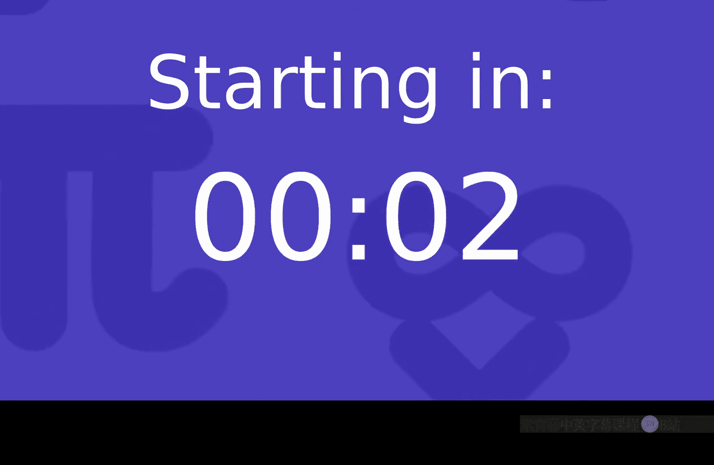
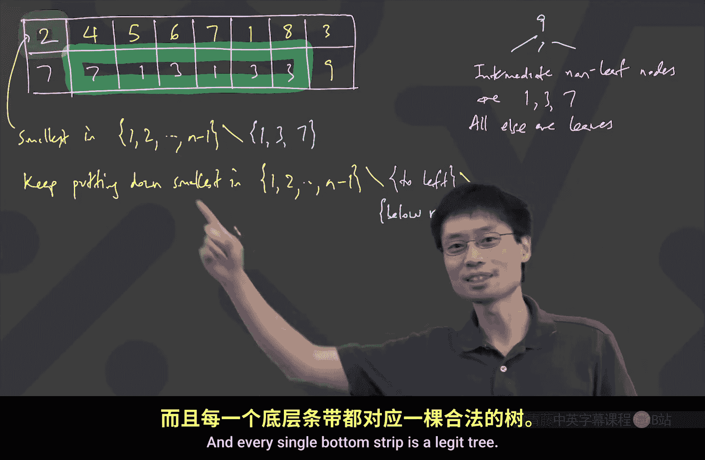

# 卡耐基梅隆【中英⚡离散数学｜21-228 2023, Discrete Mathematics】 p28 P28 -BV1sFibBkEj7_p28-

Hey， everyone。How is everyone doing。Good， yeah。 it's warm。 again。 Finally。

 that means that the semester is almost over。 and we're going to finish up。 But， you know we。

 we're closing up our graph theory part。 So last time we were talking about how many trees there were。

 And we found this really remarkable fact that somehow the number of trees is the number of vertices and to the power of n-2。

 And that's nice。 I mean， what's， what's the chance that something got nice would be true。 Quite low。

 Well， now the goal becomes to prove such a thing。 Now， in order to prove such a thing。

 what we need to do。😊。

In order to prove such a thing， what we need to do is we need to find some way that we can efficiently count these trees。

 And last time what we had talked about was， well， you could conceivably in a tree。

 you could conceivably go and say find。The largest vertex， right。

 Let let's just recall a method that we had last time。 And I'll even give that one a name。

 So last time we had something， a way of encoding a tree。Last time。

We had something that I'll call a parent code。These are called codes because it's a way of expressing the tree in some shorter code form where we can say from the code。

 you can get the tree back。 And the way this one worked was where。😊，The largest vertex is the root。

Largest vertex is the root。And you write down。A table that looks something like this。

You can say there's a vertex。And you write down its parent。Right， and that you make a table。

 the table ends up being。And-1 across。And it has。Two rows， vertex and the parent。 And in fact。

 the way you write this down is every single vertex， except the largest one has a parent。

 So the vertices are 1，2，3 up until n -1 all the way across。 And for each one。

 you write down the parent， whoever it is， maybe 5， and then 7， and then one and so on。😊。

And what you do with this is that you would then use this thing to construct a tree。

This would construct a tree where the vertex 1 has a parent of5。The vertex2 has a parent of7。

And the vertex 3 has a parent of one。And so on。 And， of course， this is only part of the tree。

 But I could just keep going。 Did that make sense。 Like， that's what we did last time。 And also。

 last time， what we said is for this code， you actually only need to communicate to the other person。

 this part， you only need to tell everyone the bottom strip。

 because if you tell everyone the bottom strip and you're agreed upon protocol。

 is that your top is going to be 1，2，3 up to n -1。 Now， suddenly。

 the person just knows connect all of these。 and we're good。

 And what we found out is that that tells you that there's an injective map from trees to these bottom strips。

 And also， it's since this injective that tells you that the number of trees is at most n to the n -1。

 which is the number of ways to make this bottom strip。😊，But that's not what we want。

 We want enter to the n -2。So what's the issue。 The issue is that somehow you are possibly getting n-1 edges。

 I say the word。Possibly because you could have some weirdness where if I wrote like 2 and then 7。

 And over here， there was a 7 and underneath it just so happened to be a two。

 that's totally not a tree because I just put the same edge twice。

 So what you can see here is that although for every tree， you get one of these strips。

It is not true that for every strip， you get a treat。 So I'll just make this comment。

But whoops the wrong pet。But。Although。Each tree。Gives。A distinct。Meaning that you never repeat。

 it gives a distinct bottom strip。Some of the bottom strips。Aren't。Trees。For example。

 let's just put one explicit example， which is very easy to say。 It's if the bottom。Striip。

Started with。2。And then what。Actually， there's an even easier way。

 If the bottom strip just starts with one。 it's like， no， this is a very bogus tree。

 What do you mean one。 then have an edge from one to one。 And that's not allowed in a tree。

 That's even easier。 let's just say， or if it just started with one。

 And there's like dot dot dot other stuff。 You're already dead。

 So what you're seeing here is that the number of trees is strictly less than the number of these bottom bottom strips too bad。

 not very useful for counting。 So that brings into this new idea， which is at first， at first。

 it looks really weird。 I mean whenever I learned this at the beginning， it was like。

 who would have thought of this。 Well， the person's name is proofer。

 So I guess it was proofer who thought of this。 So let's do this proofer code。😊。

So the way this one works， Let's first talk about an encoding mechanism。

 and then we need to go and start proving all all kinds of things about it。 We need to show。

 for example， that the encoding always can be done。

 We need to show that the encoding never gives you the same thing twice。

 And we need to show that every possible outcome of the encoding is illegitary。

 A lot of things to prove。 But first， let's talk about the encoding。😊，To encode。

 I'll write encoding of a labeled。And vertex 3。With the labels。1，2， up to。 Okay。

 and the way this is going to work is you're going to keep track of。At every time。

 we will find the smallest leaf。And pull it off。So， the way this works is。Keep。Finding。

The smallest leaf。And deleting。It。And its edge。I say it's edge because it's a leaf。

 It only has one edge coming off。 A leaf or leaf。 Remember， leaf means degree 1， right。

 Leaf means degree  one right now。Okay， and remove it， remove its edge。 And at the very end。

 you'll just have one vertex left。 ignore that。Finish。With one vertex。left。

Let me write that properly， one vertex left and ignore it。And we're going to draw a table。

 The table we're going to have is we'll have a table of smallest Let me draw here。

 So this is going to produce a table， which is the smallest leaf。😊。

And we'll keep track of its parent。 parent means who was it connected to， Who was it adjacent to。

 Because a leaf has degree。1， a leaf is adjacent to one person， one vertex。

 I'll actually call it itss。Neighbor。And its neighbor is well defined because it has degree1。

 so it has exactly one neighbor。And we'll make a big chart like this。Okay。

And the chart's still going to be n minus1 things across。And there would be two things up and done。

Now。Hopefully， it's not running too much into my head， but we can see it here。

 And I'm going to do an example first， And then we'll start to go and analyze some interesting properties about this。

 At first， it looks like this is going to be worse because we have two rows。 You know。

 last time we did pretty well by having no first strip。

 because the first strip we organized where it was an order 1，2，3 up to n -1。 Sudden。

 I need to have two rows。 But don't worry， we'll find other ways to compress this。😊，Okay。

 so let's do an example。Well， let's just draw some kind of a graph。 So I'm just going to draw。

Deeggree 4 there。 De 3 there。To， okay， close enough。 we， we do something。

 And let's put some labels on it。 Okay， let's put like。When。2。😔，3。4。5，6。7，8， and 9。So here I am。

 I have drawn a tree and I've labeled it with I've labeled the nine vertices 1，2，3 up to 9。

 So let's go ahead and try to draw this proofer code。 Well let's draw this table first。 Actually。

 the table is called the extended proofer code。 We're going to compress that down。😊，Alright。

 so it's actually called the extended proof of code。Well， we have the smallest。Leave。

And its neighbor。I don't know how long we have to make this。 We see。

So just to make sure we're all on the same page， can someone tell me what would be the smallest leaf here。

It's not one。2，2，2，2 looks good。 So the smallest leaf is 2。And its neighbor， that's7。Okay， did that。

 And once you did that， now you're supposed to say that one's gone。Let's use this thing。Gone。

 so that one's gone。 What's next， Now， what's the smallest leaf。

Let's do this together because this is， this is interesting as you start to do it together and look for patterns。

 I see fours。 Okay， so four is next and fours neighbor is 7。Okay， let's get rid of four。Gone。

 what's next。Just like， type it into the chat。 It's cool。I have to read。 also 5，5，5。

 I think that 5 is reasonable。 So 5 and fives neighbors one。Okay。Gun。Okay， and the next is。Is it 6。

 I think it's 6， right， So we take out 6。I promise you this is going to be interesting。

 So6 disappears。 Its neighbor is3。Okay。Now what happens？It's kind of weird。

 You kind of take away things from all different parts。 You're just picking apart this tree。

 The next one is 7。 Now， it's like we went。 we flew over there。

 But now the important thing is you see this 7，7 used to not be a leaf， but it is a leaf now。

 So now I can take out 7。And sevens neighbor is one。 Okay， so seven's gone。What's next？

Now it gets interesting because one comes out because now one is exposed。 like one。

 one can be taken out。 So let's take out the one。😊，1 is the smallest leaf， and its neighbor is3。Okay。

Wen's gun。Now， who's next， Who's the smallest。8，8， not 3。 So that the smallest is 8。Hey。

 I did it right。 So， I mean， I I left approximately the right amount of space 8 to 3。 that goes away。

 And then now who's the smallest leaf。3，3，3，3。 Yeah， just just the three that's there。

And its neighbor is 9。Okay， and we just finished this。 This is gone。 There's one lone vertex left。

 We ignore it。 Okay， now that we've drawn this。 It is true that if you were communicated this whole thing。

 if somebody gave you this whole thing， then， you know， you could figure out the tree。 Also。

 it's pretty clear that it's well defined in the sense that for every tree， every tree has a leaf。

 I think we prove that at some point， like every tree has a vertex of degree exactly one。

 So it's always possible to go and make this code。 All right。

 so now what we know is that for every single tree in the world。

 I can make this code with two times n -1。😊，Two times parentheses and -1 things。

 And so the number of trees is less than or equal to n to the power of two times n -1。

 We saw that already。 That's not useful。But the interesting thing about this code is that if you already agreed that we're going to communicate with this code。

 now we're going to play the game of compression。 Now， if you think of compression。

 there are various kinds of compression。 There's a zip file do Z IP。 If you make a zip file。

 It has the beautiful property that when you unzip it， you get back whatever you had before。

 It's nice。 zipip is called lost list， you get magically a smaller file size and it has exactly the same information content as before。

😊，There are other file formats like MP4 or MP3。 It is not true that if you MP4 eyes a video and attempt to decode it。

 you get exactly what you started with。 You just get something that looks almost like what you started with。

And that's called lossy compression。 What I want to do here now is I want to do lossless compression。

 meaningan I， I want to say， we're going to agree that we're going to communicate these long tables。

Hey， but is there any way I can save on some of the communication。

 Does anyone see anything obvious that you could be like。

 given that we're going to agree to do this procedure。

 you can leave some of these numbers out when you're telling the other person。In particular。

 there's one number which is staring at us inside this big table that you could have been like， yeah。

 da。 that number is always going to be there。 You don't have to tell me。ABdon。今い。你想自民。Obviously。Okay。

 so one thing at a time。 Let me go one， one step at a time， the9。

Let's go first and explain that the last thing is always going to be。

 What's the significance of a night。 How come you said that， you know it's going to be a9。

 What's it going to be。If you had everything else except the9。

 how did you know that that was going to be a night。Well， maybe better than， better than you。

 It's just like， it's the biggest vertex。 That's the thing。 So the thing is that， actually。

The claim is that always the last thing is going to be the biggest vertex。

 And that's a consequence of of a theorem that I didn't prove in this class， but。

It's that every tree has always at least two leaves。This is a neat fact。

 Every tree has at least we proved last time every tree has at least one leaf。

 but it's actually true that every leaf， which has at least two vertices， has at least two leaves。

And that's what's going to let us know that you'll never pick off the biggest one as the smallest leaf。

 because there's always another choice。 Let me go and write that down now。Okay， so interesting。

 important fact。It uses that every。Ci。With at least two vertices。Has at least two leaves。

And and why let's， let's go ahead and prove that， right， Let's prove that really quick。

 The reason is actually easiest to explain this from the point of view of counting up all the degrees because the leaves are degree1 vertices。

😊，So the proof of this piece is that， well， the sum。Of the degrees。

Is equal to two times the number of edges。I'm going to always for this section have n be the number of vertices。

So this is equal to 2 times n minus-1。Now， can someone tell me why it better be that you have at least two degree1 vertices if I need to have n numbers。

 which add up to two times n -1。I have N numbers。Summing。2，2 times n -1。Why is it that I better have。

At least two of them be just one a。いて？这个。And we already know that there's one。Yep。And then。Yes。

 then you have too much。 If you only had one number， which is one。 And by the way。

 none of the numbers are 0。 Okay， trees are connected。 And I I。

 I said every tree with at least two vertices。 So all the numbers are at least one。

 If you only had one number， which is one。😊，And the rest。Well， I'll write。 then the rest。

 then the rest。Are at least two since none。Are 0。And that's just too big。It's just too big。

 You can't have like one plus bigger equal2 plus bigger equal2 plus bigger equal2 n -1 times。

 It's too big。And the sun。Of degrees。Would be。Bigger equal 1 plus2 plus 2 plus bunch of twos where there are n -1 vertices。

 right， So that would be already21 plus2 times n plus 1， which is too many。Too big。Okay。

 so now that's how we know that every tree has at least two leaves。questionest。 What's the， Yes。

 Chris， Chris， What's the two times n -1 for， I was just saying that the sum of the degrees is twice the number of edges。

 because for every edge， you contribute one to each end point for the degrees。

 and the number of edges we know is n -1。That's where this comes from。 Okay， let's put that there。

 since the number of edges is n -1。 Let'， let's just underline that。

 The number of edges we know to be the number of vertices -1。Okay。

 so now we know that every tree has at least two leaves。

 And that's how you know in this proofer code。 We know that the proofer code procedure。😊。

You will never be stuck using the biggest vertex as your smallest leaf。

 because you always have at least two choices， so you won't choose the biggest one。Therefore。Oops。So。

In the proofer。And coding。You'd never be。Stuck。With。Just。The biggest vertex。As your only choice。

4 smallest leaf。Smallest leaf。And so the biggest vertex will always be the last one standing。 right。

 Remember， we go all the way until the very end。 And the last one standing is actually that one in the bottom right corner。

So， the biggest。Vtex。Will be。The last。Vertex left。Which is the vertex。In the bottom， right。Okay。

So now we know that the bottom right vertex doesn't need to be communicated。

 It will be the largest vertex。 Oh， wait， But if somebody just gave you that table。

 how would you know what's the biggest vertex。 So this is almost like one of those like Sudoku problems or something。

 It's like I have， I have this this pattern。 I've got this table Just a second。

 How did you know it was even 9， You don't get to see the tree， You just got this table。

 How in the world would you from the table。 Figure out that 9 was the biggest vertex。😊，Remember。

 we're playing the game of you just got this thing。 and there was some missing。 There's a hole。

 You got this thing， and there's just a hole down there。 How would you know that it should be night。

 You don't even get to see the tree。 There is a way， actually， shot。😊，Oh， that's one way of doing it。

 It's the smallest one， not in the top row， because the top row is everything else that got taken away。

 That's one way to do it， actually。😊，Yeah， that's one way to do it。 It's like， you know， you。

 you got rid of all of those。 So what's next。 Okay， that's one way。 I didn't think of that。

 But it works。 It works。 Is there another way to do this， And。Yeah， I was doing that。 Again。

 There's nothing wrong with what you just said earlier， Sean， because that is true。

 I was doing something more simple， which was like， look。

 I can just count the number of columns that I have because that's going to be n -1。

 because I'm assuming that I start with a tree and do this encoding。 Therefore。

 if I start with a tree， do this encoding。 I'll get n -1 columns。 I'll get vertices -1 columns。

 Therefore， let's just count the columns。 That's vertices -1。😊。

Plus one on it that's the number of vertices， stick the number down there。Both ways， totally legit。

 So now what we've just found out is that if somebody gave you this table and was missing the last square。

You could still figure it out。So with that， now let's go and try to do something a bit more sophisticated because Bradden was saying you can also do it missing that thing。

 too， missing the missing the entire last column for that， I'm going to redraw this， this table。Well。

 actually， I won't。 I want to look at it right here because I want to see it with the。

 with the tree here as well。Okay， so the first thing that we know is we know that if you。

 how do you erase this。How do I erase this safely。Okay， that's close enough。

We know that if you communicate this， you can decode safely。Now， the next point is。Braden wanted to。

 also。Remove this。You w to ghost out that3。How would you be able to conclude。

Suppose somebody just gave you this without the three。

How would you have been able to know that they meant to give you a3。啊。My team。

It should always be the number in the last column。 Okay， but how do you know it should be a three。

 Because we， we don't have this up there。 I'm saying all you see is this table。Oh， oh， oh， okay。

 okay。 I see。 So what you said is look at that。 The8 had a neighbor。 The neighbor was a three。

 So it has to be that three。 Okay， that's one way of concluding that three is still at large。

 that three is still there to be taken。 But there's something I want to say it's a little bit in this particular example of what you said worked。

 But there's a chance if you had a different tree。 it is entirely possible that in the other tree。

 the8 was actually connected to the9。It is actually conceivable because you have to deal with any tree in the world。

 If I just took that edge and didn't have the 8 go to the 3。

 But if the8 went instead directly to the 9。 Now， in that situation。

 I would actually have written a 9 here。 But it would still have been a three there。 I'm saying like。

 if I just change this tree where I take that 8 to 3。 Pu it off and stick an 8 over here。

 connected to the3， I would still get this exact same picture， except under the8 would be a 9。

 and then I wouldn't want to put the 9 up there。😊，So there's something slightly different that I want to tweak there。

Anotherぜさ？Android。Ha。So that's another way， right。 So this is like a。

 this is just like one of these sleuth problems or like Sudoku or whatever。 What you just said is。

 you know what this， this top row is。 This top row is all the smallest leaves。

 and I am picking them off。 Therefore， I expect that the top row is going to be a complete set of everything except night。

😊，And that's related to the idea of magazine you were bringing together。

 which was somehow that the three is this leftover vertex。

 How do you figure out which one's left over。 One way is you said， I see it there。 Therefore。

 I know it's there。 that worked in this example。 But in general， what you can say is， you know。

 the top row has n -1 numbers in it。 has n -1 different numbers in it。 And I can see n -2 of them。

So let's just go pick the other one。Pick the not 9。 So what I'll say is that this thing here。

This thing here， the the last， the last columns。Top number。 That is just whatever。Whatever number。Is。

Missing。From the top row。呃 among。The set。1，2， dot， dot， dot， and  -1。Does that make sense， Like。

 that's like very clearly， we'll be able to find one。Let's continue this sleuth thing。

 So importantly， what I'm saying here is that suppose that you didn't get any of the last two in the the last two numbers in the last column。

 If no， if they didn't give you anything about that。

 you can actually figure out what the one is on top by just saying what's missing from the top row。

And then you just slap， you also just slap the biggest number on the bottom。Well。

 the biggest number meaning count how many columns there are。These are。

 this is an empty column that still counts。 It's an empty column。

 and you count the number of columns， and you plus one to know the number of vertices and stick that vertex there。

Well， let's continue uncovering this。 So what I'm going to do next is I'm going to attempt to transcribe this table。

 but I'm going to leave out the number on top on the second last column。

 So I'm going to attempt to rewrite the table。 Okay， it will be。😊，It's gonna take me a about。

 So suppose I had the table 2 and then 7。4 and then 7。5 and then one。603。7，1， and then1，3。Now。

 I'm gonna not draw the 8。 I'll just draw a3。And I'll remember that。 there are some blanks。Okay。

 so it looks sort of like this。Okay， now the question is， oh， yeah。

 We didn't know what that was because we saw it in the previous thing。 But suppose you didn't。

 suppose you had this puzzle。 And you know that the way this was always done was that the。

 the top row was always the smallest leaf。And the bottom row was its neighbor。

Can anyone think of a good way that you could try to figure out what is that next missing one？

Suppose you're playing this game again。 This is， this is this game of like how to figure out what's missing。

Is there any way I could do this。Bradon。被告。We're missing at a free。not给。Okay， yeah。

 so let's try to like problem solve this one out， right， so that thing there， what is that thing？

Well， that thing， we know it's not。And。I'm just using n to represent the biggest one。

 We know it's not n。 Let's put the parentheses 9。Since。That's。Never the smallest leaf。

We already established that。 Okay， we also know somehow that it's not3 because it's right above above three。

 So it's also not3。Not three， since， right above 3。

And there's no way that you can make it where you say I made a tree and I connected three to myself。

Oh， that's really convenient。 So what's left。 Well， what's left was， I I。

 I think I think you also says what's left in the sense that， well， how about this like 1，7，6，5。

4 and 2。 Well， it can't be any of those either， right？

 We know that the top row is always going to be all distinct， right？ It's also。Not。

Any of the top row。We see， so far。I say the words so far because what we're going eventually do is we're going to show how you could have picked off a lot of things and eventually we'll be like。

 hey， the proofer code is just this tiny strip and watch how we can reconstruct all the missing numbers one after the other。

 Get the extended proofer code and bang。 That's my tree。 Okay， that's how this is working。

 That's like how you zip a file。 You try to find ways to compress down the compactactify the information where you can always recover what you started with just based on what you see。

😊，Okay， and what does this eliminate， So it's not。2，4，5，6，7， and 1。Is there anything left， I'm。

 I'm just looking 1，2， and then there's a 3， and a 4，5，6，7， and 9s gone。 It's just 8。

 There's no choice。 It looks like here there's just really literally no choice。 It's 8， right。

 Because if I look at this， that's the only number left between1 and n。Only choice。Left。Is 8。

 So that's how you know that you don't have to tell anyone that top one。 By the way。

 we need to see that this is rigorous in the sense that it always works。

 So let's just do a few more of these to see if I can actually find a way to communicate less information。

 but actually let the let the recipient decocode it Sudoku style。 Okay。

 so now we've gotten rid of that one。 I want to get rid of the one also。

 So I want to keep getting rid of stuff。 So I'm going to attempt to redraw this picture。

 except I'm going to lose one more thing in the top row。😊，Here goes。 so it's 2，7。Oops。

 I only go back1 now，4，7， and then 5，1。6，3， and then 7，1。Now， I'm not gonna write the one。 Well。

 I'll write 3 and 3。And now， let's go and make this。

Thing where there's going be a blank on the last one also。Okay， draw the table。Question mark time。

What goes there。 And the the point， by the way， is if I can。

 if I can concretely say that is definitely whatever it is。

 then I can use what I did before and continue to work forwards and。

 you know fill in everything else。 So now how could I do that？ Now。

 it starts to get a little bit more complicated。 Actually， let me start again with what Braden said。

 Because that's a good starting point。😊，Bradon said。Question， mark。Well， it's。Not。The three under it。

Right， that's not okay。 You can't be the 3 under it。 You also can't be the 9， Not n。

 This is the same thing we wrote last time。 Not n， not 9。 We also know it's not。Any of the top row。

So far。Which is。2。4，5，6，7， okay。But now what。Now it gets a little bit more complicated because obviously。

 it's like last time I had some extra peace that I was not。Actually， there are two possibilities now。

So， it could be。What are the two possibilities。It could be one。Or8。Oh， no， there's an ore。No it。

Because I'm supposed to say that I can definitively know which one it is。

 How would I know whether it's 1 or 8。 This is where this is this one。

 one of the tricky pieces in this proof， Chris。Sorry， sorry。In this case， it doesn't matter。

 but that would be a problem。 It would be a problem if it doesn't matter。

 because I was trying to claim that by just not telling you that you could definitively know what sticks there。

And I would say it is true。 It doesn't matter if you didn't mind too much about some of the key words here。

 We were taking off the smallest leaf and its neighbor。

So I need to use the fact that you are really following the procedure。What am I getting at？

Let's see more ideas。 So I see oh， another present Jack。我。Yeah。

 so now here's the deep question' like。Should it be the one。Because maybe it got took off first。

 you see， because Chris， what you're saying is from the point of view of recovering a tree。 Look。

 if you put an8 above a3 and a1 above a3， whichever order you put them in the recovery。

 you get the same tree。 But what I'm trying to say is that I I'm claiming at the level of compressing this code。

I'm losing 0 information。 I want to get the exact same two rows code back。

 And I'm making some claim that actually， there's a reason why it should be the one and not the8 that goes right up there。

 And Jack is like， maybe that's the one that that got taken off。 Let's see。 I saw another idea。

 Andrew。そてそる。ゆっこりに。で本に。slide。Yes， so the thing is that because I I somehow have two choices。

 I should pick the smaller of the two because I was taking the smallest leaf。

 But the reason why this， I said is that one of the hard points is like。You know。Indeed。

 I have two choices，1 and 8。 If I knew that they were both leaves， Then I would be okay with this。

 Like， if I actually legit knew that they were both leaves， then it's like， of course。

 it's going to be the one because， you know， I'm supposed to have put the smallest leaf。

 But here's something really powerful。 There is a way to look at the information you see here。

 and conclude that both one and 8 are leaves。 Remember that N， which is 9。 is the root of this thing。

 And then there's all this tree coming off of it。😊，Okay，9 is the root。 And when the tree。

 when the tree comes off of it， actually， the way I like to think of it is let's do it computer science style and draw it like this。

 Okay， so we have this， this tree with stuff coming down off of it。

 off of the biggest one off of the 9。😊，Now， there's a reason why if you look at this chart。

 you can say that after you have already。Gotten rid of all this stuff。 All that stuff is gone。

Thenhan in what's left from this on out， like the vertices that still survive that haven't been removed yet。

 What are they anyway， Let's write that down。 Who's left。Who's still。Left， let's start that。

 let's start that first， because I want to kind of bring everyone together on this。

 Suppose that you have already， you know， done this， which is called remove the smallest leaf and it。

 and the edge to its neighbor do do do do do。 And now I have this last bit。 I。

 I don't know what's going on here anymore。 So I'm pausing time right after removing 7 and its edge。

 Can anyone tell me a complete set of which vertices are still at play in play。It's like。

 after this point。Which vertices are still in play。Obviously， 9， I mean。

 that's going live the longest。 But how would I get that set。Bd。Haven't got。That would be。给。Yep。

 we go1，2 up until N。Somehow subtracting sets always looks like that。 I always。

 I always want to write a minus sign。 But anyway， it's like that。 Take away the top row so far。😊。

Is that okay， That's what's going on。 You removed the top row so far。

 That's exactly what we said we did。 We got rid of those vertices and their edge。Okay。Actually。

 wait a second。 though who's left that。 So let's look at it specifically in this exact example。Here。

It's。呃。Looks like。I I just take away the 2，4，5，6，7。 Oh， that's convenient。 They're all like in a row。

 But I get 1，3，8 and 9。Okay， so I know for sure that the vertices that are still around are 1，3，8。

 and 9。😊，Now， is there a way based on what you see in this table of the3 and 3 down there。

And we know the 9 is going to be like the one that lives at the end。 We know that for sure。

 That's like always。 that was the easiest thing。 If anyone gives you a table and it's missing tons of stuff。

 you can always drop a 9 in the end and end in the end。We know that for short。

 We didn't have to do any fancy stuff to get that。So how do you know from looking at this bottom row 3。

39， How do you know which are the vertices that are the leaves。Out of this 1，3，8， and 9。

 there's a really interesting fact that 9 is going to be somewhere。

 I don't even know the degree of the 9。 by the way。

 I shouldn't have drawn three things coming off of it。 But there's a way to say out of the 1，3，8。

 and 9。Some of the vertices are leaves， and some are not。Like as of right now， shut。啊Yes。好。Yes。

 the key is if you have anything in this bottom part， as of right now。

 you're not a leaf because somebody else used you as the vertex they were touched to。

Does that make sense， with the thing that I'm making as an exception about how the 9。

 the 9 could be a leaf， but it's special is the root。 That's why the9's a different colour anyway。

 right， So what I'm saying is that out of these， out of these things， which are in the bottom thing。

 none of these are like down like bottomish leaves in this computer science way of drawing the tree。

😊，So， I'll write here。I'll actually circle， except the9， the9s weird， right。I'll write this thing。

And。This。Area。Listists。All the none leaves。Left。AAmong。The vertices 1，2 up to n， -1。

I'm just indicating that the vertex n is still special。 It's possible that that's actually a leaf。

 but we're taking it off last anyway。 And so for the point of view of this algorithm and this encoding。

 it's just going to be somewhere on top。😊，Actually。

 then now we have some great information because now we know that three。

 like all the non leaves are three。 therefore it could be one or8， and they're both leaves。😊。

Therefore， the algorithm should have picked the one because it was supposed to take the smallest leaf。

Okay。😊，Thus， the algorithm， Well， let， let's see the， the， the， the encoding。The， well。

 let's call it algorithm， algorithm。Should。Have taken。Wen。Since it's。The smallest。Amongg。All leaves。

嗯。And it's like a nice coincidence。 I'm just gonna note this neat coincidence。😊，Coincidence。

That one and 8。Are the full set。Of leaves。No。Ameng。The 1，2， up to n， -1。Again。

 I'm isolating that the an is weird。 The an could be a leaf also。

 but we're not going to care about that。Okay， where do you think this is going。

 What do you think I'm going to do next。Remember， we're always trying to like peel off bits of information and hopefully be able to say。

 but there had no choice that had to be that。What do you think is next， Andrew。Your vice generalize。

发了。Yes， we need the bottom row， except for that last thing， which is a 9。 Okay。

 so I'm gonna to continue walking this back。 And this is just like。😊。

It's remarkable that you can do this。 Okay， it's like。

 it's ridiculous because I would normally be like， it's the bottom row。 if the top row was 1，2，3。

4 up to n -1。 Yeah， I know that。 I can， I can drop that in。

 But this is some weird stuff going on of how we're able to always figure out what it is。

 Let's try the next one。 Now， we're gonna cut off that 7 up there， okay。😊，It was 2，7。Then it's 4，7。

 and then 5，1。Then it's 6，3， but then I'm going to have a blank。6，3。

 And that's the end of my top row。 Now， the bottom row goes 1，3，3。Okay， now let's go and draw。

This whole thing。Oh， I need that row。Okay。Okay， now the key question is this one。

That's supposed to look like a question mark。Okay。HWhat happens now？ Can can we， let， let's。

 let's like write down what we had so far。 Okay， question mark。 I'll just repeat what we did。

 So it has to be not 9。呃哦。Yeah， I'm going。 I'm not gonna to completely repeat。 Okay， I'm gonna write。

 It's not an。Which is not。That's fine。 We know that because the n is the last one to be removed。

 I'm also going say it's not the 2，4，5，6。Not what。Already。Already in the top row。Which is 2，4。

5 and 6。 But now I don't want to just write down not what's right under it。

 I want to write down a little bit more general than that。 Can anyone tell me what that might be。

I don't want to say just like not the one。 There's like some other things that cannot be not where it's like more general。

Jack。嗯哼。😊，Then你原始ける。啊。You mean this。Yeah， actually。

 I want to use a different colour for the second one。

 just so that I can emphasize these are like different nature things。 Okay。

 so we have these two different things。 Okay， so one part was this。Not what's already in the top row。

 That was this blue stuff， right？ But now we have the green stuff。 The green stuff is different。

 The green stuff is like， well， of course， the question mark can't be any of those other things because the question mark says you are dead。

 You're gone from the tree。 right， Like as of that moment， you are banished。 no more。

 And therefore you can't resurrect later。😊，You better not show up again。

 And you definitely can't show up on yourself。 that's just like wrong。 Okay。

 so the important thing is before we just said can't be what you're directly on top of。 But really。

 it's that you can't be what you're on top of and later。Because you are gone。

 you have been erased from the tree。So I'll use this green， and it's also not。What。Below。Or。

That's or like below to the right。 Like what's below or later。 I can say that or later。 actually。

 that is is， it is even true that。 I write， is's not what's， it can't be what's below or later。

 That's for sure， because you， you actually can't have it appear later either。 But I'm。

 I'm basically saying that green thing。 Okay， not what's below or later， which is the one。3， oh。

 no more3。 but you cannot list it twice 1 and 3。 Okay， what's left。Possibilities， let's not use blue。

 Let's just use yellow， again， possibilities。What are they， Well， I just eliminate from what's here。

 So one's gone，2s gone，3 is gone，4 is gone，5，6 is gone。 Oh，7 is here。 and 8 is also here。

Is that right，7 and 8， No， I must be missing something，1，2，3，4，5，6，7，8。Now， I'm confused。

Oh no maybe it's okay， maybe it's okay。😊，Yeah， yeah。 It's actually okay。 Yeah， yeah yeah。 So， so。

 so it'， it's either 7 or 8。But the， the magic is that。Which one should it be， Should it be 7 or 8。

Bradon 7， a bunch of people are saying7。 It's actually because miraculously， if you look at this。😊。

You actually know that 7 and 8 are both leaves。 It's what we just said before。

 because if you look at this picture。Based on what happens at this brake line。Yeah， this。

 this brake line， I'll use this right now。 What happens at this brake line。At that exact point。

 what happens is。After。This。Break line。After this break line， what happens is that there's a 9。

9s there，9s always there。And then you got like some stuff that maybe comes off of it。 But 1，3，1。

 and 3 are the ones which are still intermediate nodes because somebody else hangs off of them。

After this，9 goes there。And1，3。Are the remaining。Intermediate notess。So，7 and 8 are the leaves。

It's actually pretty cool。 It's like just by looking at this thing。

 You can be like my complete set of leaves at the break point is whoever is not in the blue。

 whoever is not in the green and is not a9。 Everyone else， for sure， guaranteed to be a leaf。

 assuming we started with a tree。 right， That's how we were doing this。 You started with a tree。

 Everyone is going to be a leaf。 So that means that 7。😊，Is the smallest。

And that tells you that it's a second。So now so far， it looks like we're pretty lucky。

 It seems like no matter what we're able to find something。 And if you can see what's going on。

 we have just found a way to get the top row back。 And now let's do it like。

 where' I just write for you， the bottom row with。😊，Up to this 3， right， I won't write the night。

 So let's just show how you can do the whole decoding with just like 7，7，1，3，1，3，3。😊，Okay。

How you get everything back。Well。Now， we have an algorithm for decoding。Well， what goes first。

 How do I figure out what to put here。What should I do。Raise hand， Aaron， Aaron， Aaron。こなす。Yeah。

 so the key is like when you start the whole thing。 Well。

 I can't be any of those because those are going to be my later on intermediate nodes。 Actually。

 this is interesting。 If I start at the very beginning， I got nothing。

 So what I know is I have all my n vertices to play with。

 and I have all my n vertices to play with and the n， which is the9， lives at the top。

 and I got some stuff hanging off of it。 Okay， but I know that the intermediate nodes。😊。

Non leaf nodes。而。呃。1，3， and 7。 So just everything else is a leaf， all else。Our leaves。

So pick the smallest of them。 So you just pick the smallest of them， and the smallest of them is2。

So what I just did there。Is the smallest。In the set 1，2 up until n-1。Minus the green stuff。Which was。

1，3， and 7。And this is cool。 It actually can continue。 Now， the way you get the next thing。

 what do I do for the next thing。😊，Can I erase this nicely， I can。

Can someone tell me how I get the next thing。I same。で。Yep。

 so what happens is now what you do is you take the smallest thing。

 not in the blue and not in the green。 Actually， this algorithm just keeps going。

 You just keep going across。 You go like， take the smallest thing not to my left and not down and the right。

And that's just what you always put in。 So what you do for the next one is you keep。Puing。😊，Down。

 the smallest。Not in。Well， no， I， I write the smallest in because I wrote a set minus。 smallest。 Oh。

 no， no， that's annoying。Now， that's fine。 I'll write it。 Smallest in 1。

2 up until n-1 set minus the blue thing， so。😊，To the left。And also。Set minus under。

It's running into my head。 So I'll just write， like。How do you write this thing， Anyway， set minus。

Below to write。Below right， I'll just write that way。 Okay。

 I think you guys understandca we've done this enough times。 So it's just like you take， take。

 take whatever is smallest that's not there。 And the beautiful thing， by the way。

 is it always exists。😊，There's a reason it always exists。It's because I have n-1 things。

And how many things am I excluding at most。What's the most things I can exclude between the blue and the green。

 and -2 columns。 So there's always a choice。 We'll talk more about that next time。

 But the key is that it just works。 And if you just do it， let's like， let's go， let's have some fun。

 So what's the smallest that's not in 1，2，3，4，4，4， It has to be 4， right， I'm just doing it now。

 I'm just doing it because it's relaxing。 So what， what happens in the next  one is like the smallest  one outside of the 2。

4 and the 1，3 stuff lookss like it's 5。😊，You see， this is like， this is really powerful。 Hopefully。

 I don't make some dumb mistake。 But now the smallest thing， not in 2，4，5，1， and 3，1，2，3，4，5，6。😊。

And the smallest thing， which is not in 2，4，5，6，1， and 3。 Ive 1，2，3，4，5，6， So has to be 7。

 And then now the smallest thing， not in 3，2，3，4，5，6，7。 It's1。 Now， the smallest thing， not in1，2，3。

4，5，6，7 is 8。😊，Okay， and then now the last thing that goes here is the smallest thing that's not in all those to the left。

 which is a three and there's a 9 under0 it and you got the whole thing back。😊，I hope。 Let's look。

Is it。Yeah， it looks like it，7，1。 Yeah， I think so。1，8，3。Yeah， it works。 Okay。

 so I just did proof by one example。 And what we'll do next time is we'll go and continue and explain。

 So first of all， this is super cool。 This shows that all you have to communicate is that bottom bit。

 That's super cool。 That is the proofer code。 And what we'll do next time is we'll go and use that to show。

 Actually， that's that lets you encode every tree uniquely。

 And every single bottom strip is a legit tree。 And that will finish this。😊。

Alright， see you guys next time。