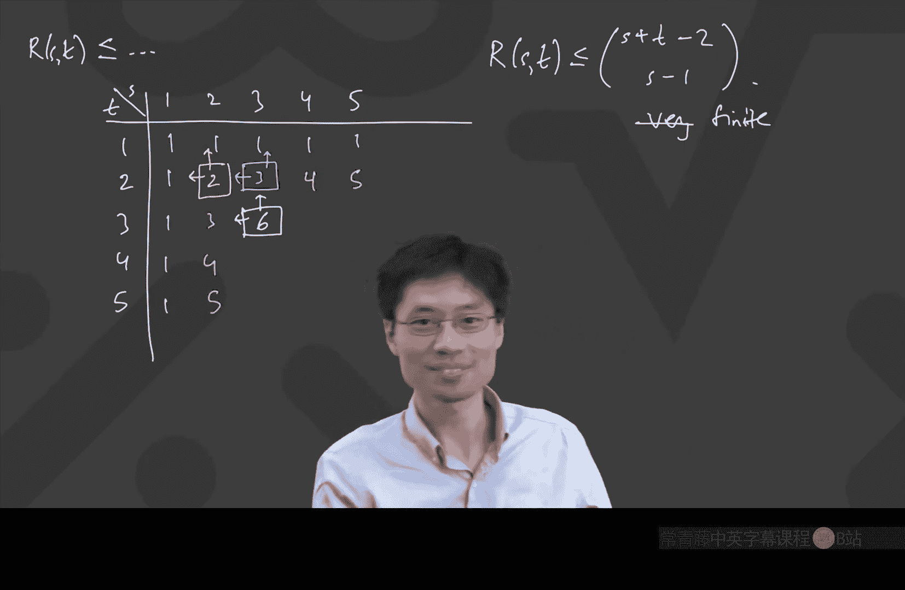

# 卡耐基梅隆【中英⚡离散数学｜21-228 2023, Discrete Mathematics】 p30 P30 -BV1sFibBkEj7_p30-

Recording in progress。Hello， hello， guys， okay。Okay。Well wrong screen。

Okay， great。 So we're on a new section of the course today。 Well， it' still graph theory。

 But we're gonna talk about。😊，Different kinds of ways of thinking about the graph。

 And so this one is motivated by， I guess， a fun story of how。Sometime， maybe about 100 years ago。

 there was a Hungarian sociologist and a Hungarian sociologist made an interesting observation as they were analyzing classrooms of people and so。

😊。

This sociologist observed。That if you go and look at any classroom of about 20 kids。

Among every class。Of about 20 kids。Right， somehow you're always able to find out that the nature of human social interaction is you can。

😊，Always find。At least one of these， At least one of two options。

You can either find four kids who are already pairdise friends with each other。4 kids。All four chew。

 two， pairs。Our friends。We're going to assume that friendship here is mutual in the sense that if you have two people。

 then they are friends or they are not friends like that。Or you can find。Or you can find four kids。

None of the fortres to pairs。Our friends。Okay， so this was kind of nifty。

 This Hungarian sociologist was kind of like going through classrooms and finding out that， you know。

 this is just a nature of human behavior somehow like they， they。

 they always have this situation where you can find friends like for groups of four who are friends。

 a group of four who are not friends， something to emphasize here。

 this word or in mathematics or means can。Be both。 That's why I emphasize that appear here。

 it's like at least one of these are true。 So whenever we use the word or we mean inclusive or。

 So that's like the inclusive。Nature of the word Or。 Okay， but fortunately。

 this person was Hungarian。 Hungarians know a lot about combinators somehow。

 And the story goes that this person was also friends of some other famous Hungarian mathematicians。

 And this person actually figured out that， you know， it has nothing to do with kids。

 It's just a true statement about whenever I have any 20 vertices。😊。

Then I can always find interesting situations in the graphs。So actually。

 it turns out that this observation is actually a fact。Actually， is a fact。About graphs。

 It has nothing to do with kids， Nothing to do with human relationships that every。20 vertex graph。

Contains。A complete graph with four vertices。 That's this K 4。 Remember what that means。

 I don't know。 I don't remember if I actually defined it in this class yet or not。

 But this is four vertices。And all four choose two edges。Or it contains the complement of K4。

 It's hard to decide what to use for this notation。 Sometimes people do it with a bar on top。

 I guess that's what I'm going to do this time。 Sometimes people do it with little C seat for complement。

 But what this K 4 with a bar means that just means for vertices。😊，With really no edges。In。

 inside there， I say the word in， because if you have these four vertices。

 like there's an edge that goes from one out to another， that's okay。Alright， so that's the。

 that's the situation that somehow you either contain a K 4 or you contain the complement of K 4。

 Actually， that is often called an independent set。

 So this thing up here is an independent set of size 4。😊，Of four vertices。Okay， so in that case。

 what we have here is that somehow this is true。 And we're going to go about thinking about this。

 But， you know， there's a deep question。 It's like， do you really need 20。Well， I don't know。

 Do you think it's true if I've tried tried to say the same thing with like 5 vertices。

 Could it be true that every5 vertex graph always has a K4 or like。Independent set of size for。

 That feels kind of ambitious。 It's actually probably not Probably not。 is the right answer。

 It's like， yeah， it's not。 And we'll find some good reasons why it's not。 But the。

 the interesting thing that you should naturally wonder here is like。Do you need。20。For this。

To be true。And this entire area that we're now talking about is called Ramsey theory。

 Ramsey theory is this thing where we're talking about。

Just because I have a lot of vertices is therere going to be a big cleeique or a big independent set。

 This is called a clique。 K 4 is called a clique。 Let me just put that word here。

 because we're using it now。A big clique or a big independent set。 And it's specifically， actually。

 this is a interesting question。 And you can define what's called the Rams Z number and the Ram Z number is the smallest number of vertices for which this is true。

So let's define that now， because we're going to be talking about Ramsey numbers today。Whoops。Okay。

 the Ramsey number。R T comma T is defined to be the minimum number of vertices。Needed。To guarantee。

There is。呃，Katie。Or an or an independent set of size of tea vertices。By the way， actually。

 even as written right here as a definition， this is not a legitimate definition。

 Can anyone tell me why this is like a bad thing for me to say that this is a definition that there will be a minimum number of vertices required to guarantee a K T or a clique or an independent set of T vertices。

 And I'll call that R T T。 What's bad about this definition out of it。You have no idea whether it is。

Oh no， What's up with this Mint？That's bad。 I shouldn't have called it a death。 Actually。

 I should have called it a theorem。 There's a theorem called Ramsey's theorem。

 which is that this exists。 So I should actually say there's actually a theorem。

 The theorem should precede the whole thing。Which says that the Ramsey number。Ramsey numbers exist。

It's like， you know， if somebody told you， there's a way， just get enough vertices in the world。

 and there will be a K 100 or an independent set of 100 vertices。How do you know， Like， what if。

 what if somebody could like make a really wacko graph and it has no clique of 100 vertices and has no independent set of hundred vertices。

 Maybe that's the case。And so the fact that this even exists is， is is a theorem。 And specifically。

 I want to say how。Would。You know。That enough。Vertices。Wouldd。Guarantee。K， T or K T bar。

I will say this reminds me of a conversation I once had with somebody who was not a mathematician and that person was asking me what do you guys do in math。

 And I said we prove stuff， And this is what do you mean prove stuff。 I said， you know， for example。

 we prove there are infinitely many prime numbers and the person said。

 but of course there are there so many numbers。😊，So， so， yes， I mean， in some sense。

 that is the case。 But I I， I would have， you know， like it's just like， that's not proof， right。

 And， and so what's going on here is a similar kind of concept。So somebody asked， do I mean K。Yeah。

 okay， so somebody said， why are putting the T and the T。 I need I use the same variable twice。

 So specifically what's going on here is that there is a notion of what's called diagonal Ramsey numbers。

 which is when I want to have both T and T。 both of these are T the clickique and independent set。

 both T vertices。 Then there's a notion of off diagonal Ramsey numbers， which is if I go and say。

 I want a clique of five vertices or an independent set of seven vertices。

 And you could ask those kinds of questions， too。 That's just why that's the same t here。

 And just because we are using， I guess colors， I'll just emphasize that they have colors。😊，Oh。

 actually。In Ramsey theory， that standard colours are called red and blue。 We're about to get that。

 So I'm just gonna go with red and blue。So this is the part where colors are very handy when you're teaching this class。

 So notice I said something about colors。 It's because there's a way to rephrase this。

 Another way you can see Ramsey numbers talked about is not to say， hey。

 just get any graph of that many vertices。 Instead， you can say， suppose I take that many vertices。

 And I make every possible edge。 but I color every edge in red or blue。😊。

So I'm gonna write equivalently。嗯。R T， T equals min number vertices， such that if every。

Possible edge。Is red or blue。呃。You run into my shirt， Then then you get like a monochromatic。

 like all the same color， K T。Get。How do I write this， Let's go up here。Monochromatic。Katie。

I'm going to attempt to stand out of the way。 So， so the deal here， actually。

 somebody once told me you should just wear a green shirt when you teach。

 and then you can have more space to write。 But that would just be extremely strange for you guys to watch。

😊，Because I'm in front of a green screen。 so that would just make all of this part invisible。

 And I could run on it too。 Anyway。 So， so now over here， this is this is。

 this is the same statement， by the way， of saying if you just color everything with one of two colors。

 red and blue， then you want to have a monochromatic。

 meaning all the edges are the same color with T vertices。 The reason is because if I have a graph。

 I can think of a graph as coloring the possible edges with two different colors。

 when there's an edge， it's blue。 And when there's no edges red。😊。

Like red stands for missing or something。 Some just put an interesting comment here。Oh no， okay。

 I should。 don' on new first。 Yeah， you know what。 you guys are， you guys are， very clever。 Okay。

 right。😊，So， so this is， this is the notion of Ramsey numbers， Ramsay theory。

 Let's go and dig into some Ramsey numbers now。 Okay， so again， the Ramsey number is the。

 the smallest thing you need to guarantee something。

 And I'm going to think of the colored version is's a lot easier to do this with colors than to think of it as edges there or not there。

😊，So let's start to mess around with this。What is R 1，1。I'll just write that down。

 Minim number of vertices， such that if all edges。Are colored。Red or blue。嗯。Theres。A monochromatic。

Edge。K1， I wanted to emphasize monochromatic edge。 The edges are what you're colouring。

 not the vertices。What is this， I claim this is so easy。 I can do this。

What's the minimum number of vertices you need so that no matter how you color all those edges。

 you're going to find a K1 where all the edges are the same color。Eal。

If you w to just bang it in the chat， that's fine， too。 Okay， so now this is tricky。 is's like。

 do I want， what does it mean A K1。 Well， okay， so so the thing is like it's either one or it's 2。

 But it turns out this is one because it's like。😊，There。I did it。 I got one。 and that one。

 it already has a a monochromatic K1。 And that's it right there。 So that one's okay。 That one's not。

😊，Let's do some more。 R 2，2。 Now， it gets a little bit less obvious。 Well， I mean。

 slightly less obvious。 What would this be， What's the minimum number of vertices so that as soon as I have that many vertices and you colored all the edges like red or blue。

2， yeah， let's try2。 Let's try it。 Let's try 2。 It is actually2 since now I'm gonna to say like。

 I'm actually going say， I have to show two things， right， in order to say that it's equal to 2。

 I need to say。If I have two vertices， and I， anyhow color。If I。Have。Any coloring。Of the edges。

On two vertices。There's a monochromatic K2。There's a mono。Chromatic K2。 Well。

 that's obvious because it's like if I have two vertices and the edge bang is's there， right。

 It's just whatever you colored it， that's monochromatic because there's only one edge anyway。

But I also need the other piece。 The other piece is， and。Actually。

 can someone help me explain what the other pieces， if I want to say that the minimum number is 2。

 on the one hand， I' just show that whenever I have two any coloring。

 I'll find that monochromatic K2， What's the other thing I need to do。啊，B。

I need to show it Can't work for smaller numbers。 That's right。 I need to show that this。

 this conclusion can't work for smaller numbers。 Can you help me say that in like an English that's like not just what。

 how would I show that it can't work for smaller numbers。Yes。这一个。啊，对。Yep。

 there exists a coloring of the edges on one vertex。Where there is no monochromatic K2。

Did that make sense， I'm just really being very clear to split the two。 On the one hand。

 you need to show oh， any coloring in the world on this two vertices。😊。

On the edges on the two vertices， you'll find the other chromatic thing。 The other thing is like。

 hey， just find， find one。 Show me one coloring， and I'm done。😊，Like the。

 if you can feel the asymmetry here， the thing on top， you got to prove something。 And on the bottom。

 you just have to be like， hey， look at this。 So at first， you might， I mean， when I say， hey。

 look at this， I'll do that one right now。 here， this one。Bam， one vertex， I colored all the edges。

 and there's no monochromatic K2， obviously， So I'm done right。

 And the other one I have to make something about this one was' obviously there was a way to argue。

 that's okay。But I wanted to emphasize that there's some asymmetry here。 And a priori。

 you might say this looks harder。 maybe， maybe it's hard to go。 Sorry it a priori， this looks easier。

 Just like， show a colouring Dararn it。 Okay， somebody had made a comment just yeah。

 could you ask your question again because Im， I don't understand it。哦。

It's because my handwriting is awful。 It's a T。Okay， I'm sorry that， thats， that's my fault here。

 Yeah， that's a T。 Okay， but thanks for asking， thanks for asking。 And in general。

 if my handwriting is lousy， please let me know。 Yes， I'll try to do a better job。😊，Okay。

 but now we're gonna get to the first like interesting ish theorem in Ramsay theory， R 3，3。😊，嗯。Okay。

 now if I want to do this， actually， I'm going to give a hint。

 which is I already indicated like drawing an example of something which has no monochromatic K3。

Is probably the easier way to go。 Can someone come up with a way to draw a graph。 Sorry。

 it's going to have a bunch of vertices。 You're going to have colored every edge， red or blue。

And there better not be any monochromatic triangles。 Can anyone come up with one of those， Add it。

Can you make a graph？Mo。How， let me draw5 vertices for you。 Tell me how they color it。P down one。

One color， randomly。And then just like keep going and then just break triangles every time you have the chance to meet。

Oh， okay。Okay， okay。 I get what you said。 What you said is like， just。Randomly。Add edges。

Avoiding triangles。 I that what you mean。Goodま。So I will say it ran into my head again。

 you have just this discovered something called the triangle free process。That's actually。

 There's a name for what you have just said。 is's called the Triangle free process。 In fact。

 our current department head of mathematicalmatic sciences at Carnegie Mellon， Tom Bowman。

 He's a really good guy。 You should take his class at some point。

 but he actually has some papers on the triangle free process where he was one of the people who analyzed what would happen if he did this in。

 in like a large number of vertices。 Interest stuff。😊，And actually， just to let you know。

 the reason why he was interested in that is because that's related to our3 comeee。

Here we're doing R 3 comma 3， which is like， obviously， this would make a lot of sense。

 But I'm just saying， like， what you did is people were interested。 People were interested in that。

 That's an interesting area of research。 Okay， so I'm just gonna start doing it。 Allright。 Yeah。

 Why not？ No triangles。 Now what。😊，哦。But now we got trouble。Oh， yikes。 So。

 so I think what this is showing is that the triangle free process， by the way。

 it is a good strategy。 It's a very interesting way to do things for large graphs。

 But the oh yaikes is like， so that didn't quite work， so。😊。

What if you made one of those blue at the start， you mean like this。Yeah。

 so what we're doing right now is we're getting out of the triangle pre process。

 We're gonna try to be smart。 Sorry， not that you weren't smart。

 Your idea is very good for a different kind of thing。 but here we're gonna cook something。

 We're gonna to say， does any， let's let other people get involved。 It is true you can do it with5。

 There is a way to color this all 10 edges of this K5。😊。

In a way that avoids triangles in any one particular color， Does someone else want to try。

 And that one won't be random。 It will actually look really nice。 Itll be a nice pattern。😊，summer。

Anyone else want to try， it's not that bad A Jack， Jack。好回。啊。Oh， yeah。

 This is actually a really neat fact， by the way。 Did you know that K 5 breaks into a star in a Pentagon。

 It's kind of nice。 And like there's no triangles， right， Oh。

 emphasis on what a triangle means triangle means K 3。

 It means three vertices where I have all the same color edge between them。

 even though you see some triangles in this picture。 Those are not triangles in the graph。

 Those are just because I drew it and the lines crossed。😊，Allright， so this is one。

 so what we just found out is that hey it's possible to make five vertices and a coloring of the edges so there's no monochromatic triangles。

 Can anyone tell me what that means in terms of R33。 R33， we claim is going to be a number。

Now you stare at this。 That tells you a fact about R3，3， compared to 5。What is that fact？

And when I was learning this subject， I was like my brain swims about inequalities or like strict inequalities or non strict inequalities。

 So I wanted to actually ask everyone to play in this and think to yourself， what would that mean。

I want to say to say something about R 3，3。 Yes， Charlie。とりまして。Great than5Okay， good。

 So it must be strictly greater than 5 because of the fact that。

 you're talking about the minimum required to guarantee something and 5 doesn't guarantee it。

 Alright， So what we have here is。5 can't。Guarantee。I can't spell guarantee。

 How do you spell guarantee。 I did it a few times already。G， U A R， A and T， E。

 E can't guarantee a monochromatic K3。 I'm getting shorter just calling it mono。

 So that means that 5's not good enough。 That means R 3，3 is bigger than 5。 Well。

 the Ramsey number would only be an integer。 So that's the same as saying it better be at least 6。

 Okay， and the interesting thing is that actually 6 is enough。 So let's go to the next screen。

Next screen is， but。嗯。安你。Coloring。Of the edges。On write， on6 vertices。With。Two colors。

Has a monochromatic K3。Now， that's cool。 That's going to tell me that R 3，3 is 6。😊。

And how we do how would we do this， So the way， what do you want to say？Yeah。

 let's pigeonholeer or something。 Okay， so I， I have， I have like 6 vertices， right。

 So just like pull one aside。 It's like here， one of the vertices。😊，艾里。Any one vertex， great。

 So I've got this one vertex。 How many other vertices are out here to look at。

 There's five other vertices to look at。😊，Right， so the way I'm thinking of it is I've kind of separated off。

This one vertex from these other five。 When you say pigeonhole。

 could you be a bit more specific what you mean by pigeonhole。

From that one vertex you have at least three of the same colors。Okay。

 so but the idea here is that you have five other vertices。So， at least three of them。

Are adjacent V the same color。 Oh， let's give that vertex a name。 V， Okay， are adjacent。To V。

Vya the same color。Okay， well， now this is one of these places where we like in mathematics to sayvolog。

Without loss of generality。So which colour， I mean， is' gonna be the same for both of the arguments。

 But because there's nothing special about the colours yet， let's just go and say， you know。Here。

Rlog。嗯。Red。And I'm only going to draw three of them。 There might be more of them。

 like it might be that there's more adjacent by red， but let's focus on this。

Focus on some three of them。Right， by the way， well log means without loss of generality Once somebody was explaining this on the board and called it without lots of generality。

 And that would be the exact opposite。 So the L stands for loss。Without。Loss of generality。

This is one of these wonderful statements in math that you can say when you're like。

 it looks symmetric enough。 And that is the case。 And the only way to know， like， yeah。

 this was a legitimate thing to say is because at the end， you'll say， well， But obviously。

 if I just had them blue instead， I'll just flip everything in the argument。 Okay。

 so can someone else tell me why this would be awesome。 So I've just drawn that。

 Here's this one vertex， here are these three with red across to the right。

 Can someone else tell me how I'm going to use this to go and get a monochromatic triangle。😊。

I just want more people input。This is a perfect setup。对的。好。So the important thing is that， look。

 if I put a red edge on any one of these， bang， I have a triangle。 Okay。

 let me write that down first。If。Any。Of。This thing， these kinds of edges。Are red。Then， a K3。

Let's use red。 It's a red K 3。 So I'm going to actually just write the K3 in red。 Then I got the K3。

 red K 3， Okay， okay。And that would be great。 Then we're done， right。

 We're trying to show that there's always going to be a monochromatic triangle。

 This would give me done。 Well， then there's the else。😊，Else， all three。R blue。 What's that。Oh。

 that's a blue K3， right， because that that's a K3 right there。

3 vertices and all three of the edges are blue。Blue K3。And you're done。

 So that's actually how this works。 And the without loss of generality， the w log was like， well。

 come on。 If I had that the three were blue instead， then I'll just do the same argument。

 I'll say if these were all blue。 then each of those white shaded edges。

 those if any of them is blue。 I'm done， I got a blue K3。 Otherwise， it's red。 And then I got this。

 otherwise all of them are red。 and I got this red K3。😊，Did this argument make sense。

 This is this R 3，3， every six people at a party， There's always three of them who already knew each other before or three of them who didn't know each other。

 didnn't know each other， didn't know each other before。 Really， really satisfying。

This is actually often what I'll say if I was you know I used to travel a lot and if somebody would ask me what do you do as a mathematician would prove things I'll give this example too。

 and this is something you can explain to someone， you can just be like here's how I would prove it and you don't have to draw all of the possible ways of making friends or not friends on six vertices。

 which is a lot of possibilities。😊，Okay。Did this proof make sense。

Because now we have just proven something about R 3，3。So， R 3，3 equals。Equal 6。

Because once I have six vertices， okay， for sure， you'll find them monochroatic， whatever。 and if。

I have less than 6。 eh not good enough for guaranteeing。 We saw that Pentagon with a star inside it。

Well， then now it's interesting It's like how about all the other Ramsey numbers， like R 4，4， R 5，5。

 R 6，6 and so on。 Well， there's a fun statement about this。 First of all， R 4，4。

 I don't remember what it is。 I'm not sure what it is。 somebody can probably look it up。

 I is like 17 or 18 or something It's definitely less than 20。 But as you can see。

 I don't pay too much attention to exactly what the numbers are。 You might say at first， What is it。

 think it's 17， Maybe it is 17。 Okay， thanks， Eric。 So it's like， yeah。

 yeah the reason I give 20 is like， I'm sure 20 is enough。 But you might say， oh， come on。

 such small numbers。 Let's just make a computer search， right， that can't be too hard。 It's like。

 we know R 4，4 is 17。 And then there's R 5，5， R 6，6。

 How hard could it possibly be to do a computer search。 Like R 5，5。

 That's probably somewhere around like 5050 is， right？

 So why not just go an attempt to prove this by exhaustion called find all the possible colorings of graphs on 50 vertices。

😊，And just show， like exhaustively that they always have monochromatic K5s。I'll write to show。

I actually don't know about this R55， but I'm just going to say is to show R 55 is less than or equal to 50。

Okay。AhaSo it， if I wanted to show it's less than Google 50， because suppose I want to get an answer。

 right， to find R 5，5。😊，Just。Well， no， no， let's let's just say to， to， to find R 5，5。

 I don't want to say to show R 5，5 less cical 50 is to find R 5，5。You just need。To find。

Some particular coloring。Of edges。On some n-1 vertices。With no monochromatic K5 computers。

Are awesome。Surely they're powerful enough。And。Check。Every。Coloring。Of edges。On and vertices。To see。

 they have。Monochromatic， K5。Right， and in this particular case， n happens to be， I think， around 50。

 you guys are much faster than me I checking things on the Internet。 But I think it's around 50。

 right？ It's like here。😊，And iss somewhere on the order of 50， I think， maybe it's 60。

 maybe it's 40 and something like that。 But now I already see people posted into the， into the chat。

 Oh， oh。The number of colorings。Is like。2 to the power and choose 2。HBecause like every edge。

 every possible edge is one color or the other。 I wrote some approximately because maybe you could say there's some symmetry。

Right， maybe you don't need to worry about every colouring， but unfortunately。

 there's not enough symmetry。 And so that would be2 to the power 50 choose 2。

And 50 choose 2 is about like 50 times， iss about like 50 times 49 over 2。

 That's approximately 50 squared over 2。 So that's like two to the power， like thousand250 ish。

That's bad news。 So， so unfortunately， the computers aren't this fast。 Oh， people wrote some stuff。

Ramsay R 5 of 43 to 48。 yeah， yeah。 So， so you see， you see。

 in my head it's like somewhere in the 40s or 50s， Nobody knows。 And thanks， Chris， for posting that。

 So， yes， so， so， thank you very much。 What you just said is it's like 43 to 48。😊。

Something like that。 By the way， actually， these Ramsey numbers are quite neat。

 There's a story about this where Paul Erdch， I think once has had a quote where he said。

 if aliens showed up in the world and said they need us to tell them R 5。

5 or they'll blow up the planet。 Then we should rally all of humanities。

 computers and mathematicians and whatevers。 And we we could probably find a way to do this。 maybe。

 maybe even though this is huge， we use symmetries or whatever， we might be able to do it。

 But if the aliens ask us for our 6，6， we should just try to blow up the aliens。😊，So that's the。

 that's the， that's the quote。 The R 6，6 is like out of reach。 Actually。

 if you look at these balance on Ramsey numbers， you will see that some of these papers have a person named Mackey on them。

 That's the same Mackey that， you know。😊，So yeah， if you look at these like balance on Ramsey numbers。

 John Mackey actually was involved in some of these。So okay。

 this is just showing you our department here at Carnegie Mellon is like touching this particular subject quite a lot。

Now， great。 now that we know that， you know， these particular numbers are hard to actually find。

 let's at least show that they're finite。 Let's prove Ramsay's theorem。 Okay。

 so let's go and prove that the Ramsey number is finite。 It's not that big。 it it， well， sorry。

 that's the wrong word。 It's not infinitely large， okay。😊。

So what we're actually going to show is we're going to show alemma。

Which says that the Ramsey number are S comeity。And that's why I used this like two parameters。

 It ends up being very helpful that there's two parameters here。

It's less than or equal to the Ramsey number of S -1 T。Plus， the Ramsey number of S T-1。 Okay， I。

 when I was learning this， I always found it hard， Do， what's this inequality。

 Let's translate that into words。Iい。What does it actually mean， It means that whenever I have。

The right hand side。Whenever you have the right hand side R S-1 T plus R S T-1， that many vertices。

And you look。Add any two coloring。Of all possible edges。You have。I'll write a red。Ks。Or。A blue。Katie。

And that's a T not。So that's the statement。 The statement is that somehow。

 if I just get enough vertices together， I can guarantee myself a red chaos or a blue K T。

 And the interesting thing here is where establishing the next bound。

 like the mixed Ramsey number is sort of dependent on some previous Ramsey numbers。😊，By the way。

 this will be enough to show that they are all finite because you can build any Ramsey number from smaller ones using some base cases。

 Let's also use like some obvious facts also。This is more obvious， but if I ever have R 1 come T。

 can anyone tell me what this is。How many vertices do I need to guarantee that there is always a red K1 or a blue K T。

One， you put one down， there's your red K1。That's very satisfying。 And what if I had R S comma 1。

 Well， same reason。 That's a one。 Also。 If I wanted to have a red K S or a blue K1，1 vertex。

 you got your blue K1。 So what this is is， is' sort of setting up like some， some base cases。😊。

For you to show by induction that this Ramsey number is always finite， which is satisfying。Okay。

 let's go and prove this lemma。I claim that the proof is very similar to what we did with R 3，3。

Hadbit。But what if you assume that？And then just look at the complete graph。Take out one vertex。

See how many。Okay， let's try that。 So what we're gonna do first is we're gonna say， hey。

 we're supposed to prove this I。e。 right， whenever I have this many ver vertices。

 give me that many vertices。 Suppose I'm staring at an arbitrary two coloring。

 arbitrary coloring of the edges with two colors。 I call it arbitrary two coloring because at some point。

 we might talk about using more number of colors。 But anyway， I I will I will oh my gosh。

 I even already wrote that。 Okay， so this two coloring。 that means that I'm using two colour。

 My gosh， Okay， I didn't mean to add new terminology so early。 but two coloring means using。😊。

Up to two colors。That's the technical lingo with this Ramsey theory because there can be multicoled Ramsey theorem。

 too， with like 15 colors or something。 But the proof of dilemma back to this is like， okay。

 consider an arbitrary two coloring of that many vertices。An arbitrary。2 coloring。Of all edges。

All possible edges。A门。That many vertices are。S，-1 T plus R S T-1 vertices。Okay。

 and let's pull any vertex out。Any vertex， just take one of them aside and we'll do what we did last time。

Chop it off and think about everybody else。 Well， there's a lot of the other ones。

But what you want to do is you want to say of the other ones。Some of the other ones are connected。

 are adjacent to this vertex V。 Let's give it a name。

 Some of the other ones are adjacent to V via a red。And some of them are adjacent to V via a blue。

So I have some adjacent via red， some adjacent via blue。Actually。

 they're all adjacent to V viaya those colors。And so， this is adjacent。To fee。

V red and adjacent to V by via blue。 Now， how could I possibly use this interesting fact？ Well。

 I'm supposed to conclude that I can find a red K， S or a blue K T。How could。

 how could like having a bunch of stuff here， which is adjacent to V via red possibly help me。

I want to get more people involved in this because this is it's a neat fact。

 which is actually not crazy。I'm just like， it's going to be really handy that all of these vertices over here。

 I'm going to select them。 All of those are adjacent via red。 All of these are adjacent via blue。😊。

And if my goal is to get a red K。 S or a blue K T， somehow the fact that in this zone。

 they're all already read to there is handy。Why so。

Can anyone tell me like a reason why if I have enough of stuff here。I'm in good shape。And why anyway。

 is this R S -1 T R T， R S T -1， How do I， Why is there a -1， How do I use the -1。Oh， remember。

 what those mean is that each of those are numbers for which in that。

 if you have that many vertices bang， you definitely have a red K， S -1 or a blue K T。

As soon as you get that many vertices， you have to find some structure like that， Chris。我想。Okay。

 so one thing here is that if you're thinking about like the triangle world， right。

 in the triangle world is like， whoa， we already know a lot about like colors。

 If we were trying to avoid monochromatic triangles， It's like， what in the world am I going to do。

 I have no good way to connect。 But I wanted to take this moving out of triangles a little bit。

 because the the place we've moved to is now like。😊，K S and K Ts。

So I'm glad you said the idea we need to have a lot of ideas to solve this Sean。

It's like our first one。And then word' words supplement that S minus1。Okay。喂。だいったしで。

Let me digest that one piece out。 I think what you said is if you found a red K S-1 up there。

 you got your red K S。 Is that what you just said。If you find a red K S-1 here。

Then you plus the V and you got your red K S。 That's actually why this all being read is handy。

 It's like， now I'm happy enough in here。 It's like my my goal was to find a red K S or a blue K T。

 Well， by doing this divide and conquer， I suddenly said in this place here。

 I don't need a red K S anymore more。 A red K S-1s enough because I'm going add one more to finish it。

😊，So if I had this， then plus V， let me just write with more space。 If I find this， then。Adding。V。

Gives。A red K， S。 So that means that I only need to guarantee inside this zone， a red K S -1。

Or a blue K T。So what that means is， so。If this。Is， at least。Ramsey number S-1 comeee。 I'm done。

That's one of the important points。 Are people okay with this is like。

 as soon as I have enough vertices to guarantee a red K S -1， which I'll add the V V2 Go red K S。

 Or if I get a blue T， blue K T， Well， got it。 Blue K T， That's it。 I'm done。 Then I'm good。😊，Okay。

Well， if that's the case， the same argument tells me something down there。

Can anyone tell me what that argument would be or what what the bound would be。

 Cause I just wantan to make sure everyone's on the same page。

Under what circumstance can I also say done。As long as this bottom blue blob is big enough。Bd。Y。

 so on the other hand， if I got the other one to be big enough to get a red K S。 Thank you。

 or a blue K T-1 use V。 Now I got a blue K T。 I'm good。😊，Oh， no。 But how are we done。

 So what am I supposed to do， I'm supposed to somehow show that， Well， at the beginning。

 I started with this many vertices。 I started with the two Ramsey numbers added together R S -1 T plus R S T-1。

 I started with those two numbers。 I' am seeing the numbers appear again， which is exciting。

 I would like to get some conclusion that says at least one of them has to happen。😊。

How do I finish this。We have all the pieces in front of us now。

 We even have those particular Ramsey numbers， which appear there。Anyone else want to jump in。 I I。

 I like to involve as many people as we can on this。I'm starting with all of this stuff。

If I can get either this or this， big enough。And' done。

How do I know that one of them has to be big enough or both。Jack。sameです吧？サし。That the other pile。都。O。

You're on the right track。 You're on the right track。 Okay， you're absolutely on the right track。

 And this is， this is like slightly tricky， which is why I just wanted everyone to think through it together。

 You're absolutely on the right track。 It's like， this looks suspicious。

 I've got the two numbers that add up to there should be some kind of a running out of space issue。

 The only thing to be careful is that one vertex got yanked off here。😊，So the way。

 the easiest way I usually explain this is I say。Well。

Let's do like a proof by contradiction in the sense of。If I could get this， I'm done。

 if I could get this， I'm done whenever you're doing a proof。 If you got to the， if I got this。

 then I'm done， then you're always able to say， well， suppose I'm not done， then not that。

Is that okay。So I'm going to say， well， that's true。 If it's this that I'm done。

 how would I not be done， The only way you cannot not be done if it's。Less than that。

 But here's where we're gonna overcome the one。 maybe add。 This is probably what you wanted to say。

 Can you， Can you help me out with that。Was going to say， suppose。Where are the right？Then theres。

没意思。Then there's at most like R。minusワ？Yes。今番。As the one。あて無でない。Yes， that's the key。

 The key is that the -1s are perfectly lined up to give you the proof。 The point is， all right， Well。

 that would be done。 But otherwise， otherwise， what's the deal， Otherwise， it's like。

 I have less than or equal to that -1。😊，And the same thing would happen over here。

 It's like either I'm done or the number of things in the blue is this nice R S T -1， and then -1。

But then how many vertices are there in total， if I do that， Well， I get the two nice R things。

 which I wanted， a-1， a -1， and then a plus one for this vertex V。Which is just one short。

Did that make sense to people。So I have this then done。嗯。And maybe the I'll just like right up here。

 Okay， so it's like continuing。Up here。So， if not done。Then， the number of red。Well。

 I'll just write the， the number of vertices that we have。Is less than or equal to one。

 That's for the vertex v。Plus。Are all these colors。Plus， the Ramsey number。R S -1 T，-1。And then。

 plus。Using the blue R S T-1，-1。My pen ran into the right side。Mus what。Mus1。Okay。

 and that's just like too little。 I I'm， I'm short by exactly one。Which is too small。

We were supposed to start with， you know， without the -1。 Okay， so we've just proven this。

 and it's just perfect with the -1。 Now， there's a reason why this is really satisfying。😊。

It's because this actually is a nice recursion。 You know what this means。 If I。

 if I'm going to do some induction thing and somehow R 1 comma T is 1， R S comma 1 is 1。

 and all of these R S Ts are less than or equal to R S -1 T plus R S T -1。

 Have you seen anything else in this combinators class where you like have a function of two variables and the function of。

😊，The two variables depends on what happens when you reduce one of them by one and reduce the other by one。

 Actually， that's a pretty bad。Hint that that's probably hard to see。 I'm going oh bra it。

 Maybe you do see。It's like Pascal's triangle is here。 That's actually what's going on。 because if I。

 if I'm going to say that the value of each one， let's just do it real quick this way。 Okay。

 so what do I now know， I can make a chart for R T is less than or equal to what。 Well。

 let's make a chart。 So here is。😊，The S and the T， S can be 1，2，3，4，5， and so on。 T can be 1，2，3，4。

5 and so on。 And I'm just writing down upper bounds。 So I'm saying these are all at most one。

 these are all at most one。 But now the fun begins。

 Because what I do is that if I want to know what is the Ramsey number of this less than or equal to is less than or equal to what happens when I decrease each of S and T by one。

 And you add them together。😊，Did this sort of make sense， Like。

 that's exactly what R S -1 T and R S -1 T is this way。 And R S T -1 does。

And if I want to know what to write here， well， that's going to be whatever was above and whatever was to the left added together。

 These are not the Ramsey numbers。 These are upper bounds on the Ramsey numbers。But look。

 we've seen that before。 That's just Pascal's triangle。This was like on the early part of the class。

 And here for like the three and the three， what goes here。Is the sum of those，3 plus 3 is 6。

Does this make sense。 So actually， this is nice。 We just found out there's a bound on Ramsey numbers。

 It has something to do with Pascal's triangle。 And this actually shows R S comma T is at most some choose thing。

 And it turns out to be S plus T-2。 choose S -1。😊，Very satisfied。 That's very finite。Actually。

 the word very uncalled for。 It's just finite。 All right， finite。 things are finite。 In fact。

 it's not， it's not not very finite。 It's pretty huge。 But。

 but what I have here is I've just found out that it， it satisfies this pascal triangle thing。

 And if I was just careful， I would see that this is just S plus t-2 choose S minus-1。😊，Alright。

 so we have now proven that the Ramsey numbers exist， and therefore。

 we can now wonder how big they are， and we'll continue with that on Monday。😊。

See you guys yep。