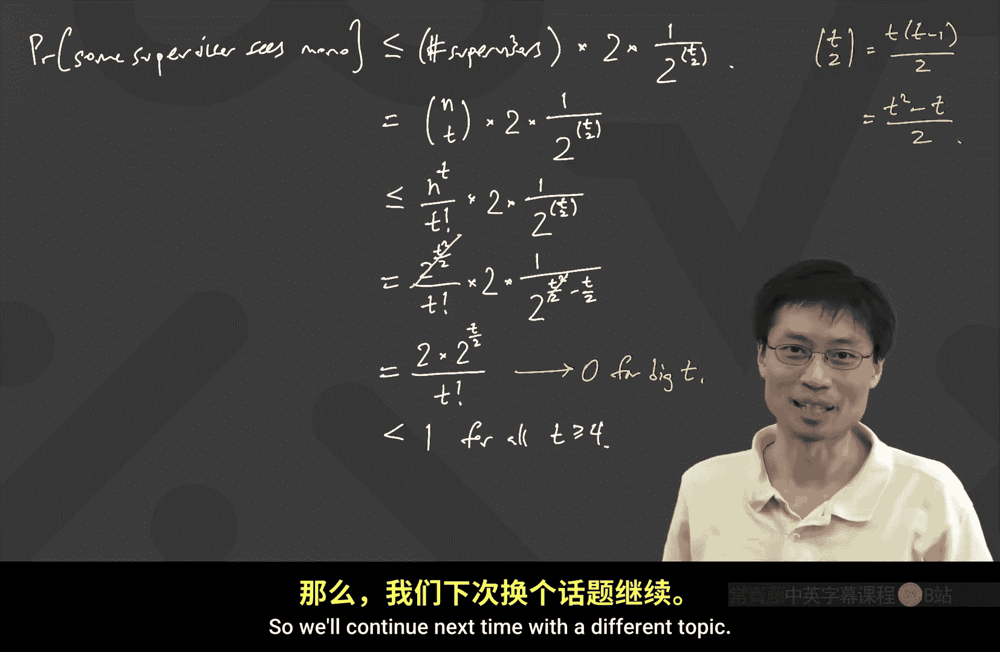

# 离散数学：第31讲：拉姆齐理论深入

在本节课中，我们将深入学习拉姆齐理论，特别是关于拉姆齐数上界和下界的证明。我们将从回顾上节课的结论开始，然后探讨如何利用这些结论推导出拉姆齐数的上界，最后介绍一个巧妙的概率方法，证明存在一个指数级的下界。

---

## 回顾定义与定理

上一节我们介绍了拉姆齐数的基本概念。本节中，我们首先回顾其定义和上节课证明的关键定理。

拉姆齐数 **R(s, t)** 定义为最小的顶点数 **n**，使得在任意一个对 **n** 个顶点的完全图的边进行 **2-着色**（使用最多两种颜色）后，图中必然包含一个红色的 **K_s**（s 个顶点的完全子图，所有边为红色）或一个蓝色的 **K_t**（t 个顶点的完全子图，所有边为蓝色）。

上节课我们证明了一个重要的不等式，通常称为 **Erdős–Szekeres 定理**：
**R(s, t) ≤ R(s-1, t) + R(s, t-1)**

这个不等式意味着，如果我们有 **R(s-1, t) + R(s, t-1)** 个顶点，就足以保证存在一个红色的 **K_s** 或一个蓝色的 **K_t**。

---

## 推导拉姆齐数的上界

基于上述递归关系，我们可以通过归纳法推导出拉姆齐数的一个具体上界。

我们利用边界条件 **R(1, t) = 1** 和 **R(s, 1) = 1** 来填充一个表格。表格的行和列分别对应 **s** 和 **t** 的值，每个单元格填入 **R(s, t)** 的一个上界，该上界等于其上方单元格和左侧单元格数值之和。

以下是填充表格的步骤：
1.  第一行和第一列的所有值均为 1。
2.  对于其他单元格，其值等于正上方单元格的值加上正左方单元格的值。

通过这种方式，我们得到了一个类似帕斯卡三角形的结构。例如，**R(3,3)** 的上界是 6，这与我们已知的 **R(3,3)=6** 相符。对于 **R(4,4)**，我们得到上界为 20（尽管已知实际值更小，例如 18）。

更一般地，我们可以推导出公式：
**R(s, t) ≤ C(s+t-2, s-1)**，其中 **C(n, k)** 表示组合数。

特别地，当 **s = t** 时，我们得到对角拉姆齐数的上界：
**R(t, t) ≤ C(2t-2, t-1)**

---

## 分析上界的增长速率

现在我们来分析 **R(t, t)** 这个上界的增长速率，即 **C(2t-2, t-1)** 的大小。

首先，我们可以给出一个非常宽松的上界。因为二项式系数 **C(2t-2, t-1)** 是 **2^(2t-2)** 这一行帕斯卡三角形中的一个数，所以它显然小于该行所有数之和：
**C(2t-2, t-1) < 2^(2t-2) ≤ 4^t**

因此，我们得到 **R(t, t) < 4^t**。这意味着，如果我们有 **4^t** 个顶点，那么无论如何对边进行 2-着色，都必然存在一个单色的 **K_t**。

然而，这个上界 **4^t** 可能并不紧。一个著名的未解难题就是：能否将这个指数的底数 4 改进得更小（例如 3.999）？对于足够大的 **t**，目前已知的证明方法无法做到这一点。

---

## 探索拉姆齐数的下界

上一节我们得到了一个指数级的上界，本节我们来看看问题的另一面：如何构造一个着色方案，在尽可能多的顶点上避免出现单色的 **K_t**，从而为 **R(t, t)** 建立一个下界。

一个简单的构造是使用 **(t-1)^2** 个顶点。我们将顶点分成 **t-1** 组，每组内有 **t-1** 个顶点。

以下是具体的着色规则：
*   每组内部的所有边都着**蓝色**。
*   不同组之间的所有边都着**红色**。

为什么这个构造中没有单色的 **K_t** 呢？
*   **没有蓝色的 K_t**：因为最大的蓝色完全子图只能在一个组内部，而每组只有 **t-1** 个顶点。
*   **没有红色的 K_t**：要形成一个红色的完全子图，你不能从同一个组中选取两个顶点（因为组内边是蓝色的）。因此，你最多只能从每个组中选一个顶点，总共最多能选 **t-1** 个顶点。

这个构造表明 **R(t, t) > (t-1)^2**。但这只是一个多项式级别的下界，与我们刚刚得到的指数级上界 **4^t** 之间存在巨大的鸿沟。

---

## 概率方法：一个指数级下界的证明

保罗·埃尔德什（Paul Erdős）引入了一个巧妙的**概率方法**，证明了存在一个指数级的下界。

他证明了对于所有正整数 **t**，存在一种对 **n = 2^(t/2)** 个顶点的完全图的边进行着色的方法，使得图中没有单色的 **K_t**。这意味着 **R(t, t) > 2^(t/2)**。

这个证明不是直接构造出着色方案，而是证明了这种方案“几乎肯定”存在。以下是证明思路：

1.  **随机着色**：考虑一个有 **n = 2^(t/2)** 个顶点的完全图。对于图中的每一条边，我们独立地、随机地抛一枚均匀的硬币来决定其颜色：红色或蓝色，概率各为 1/2。
2.  **分析失败的概率**：我们想要证明，在这种随机着色下，**存在一个单色 K_t** 的概率 **小于 1**。如果这个概率小于1，那么其对立事件——“**没有**单色 K_t”——的概率就大于0。这意味着，在所有可能的随机结果中，至少有一种着色方案是成功的。
3.  **使用布尔不等式（Union Bound）**：计算“存在一个单色 K_t”的概率很复杂。我们转而计算它的一个上界。我们考虑所有大小为 **t** 的顶点子集（共有 **C(n, t)** 个）。对于每个这样的子集 **S**，令事件 **A_S** 表示“子集 **S** 中的边构成一个单色 K_t”。
    *   对于任意一个固定的 **t** 顶点子集，其所有边同色的概率是：所有边全红的概率加上所有边全蓝的概率，即 **2 * (1/2)^(C(t,2))**。
    *   根据布尔不等式，“存在一个单色 K_t”的概率 **P** 不超过所有事件 **A_S** 的概率之和：
        **P ≤ C(n, t) * 2 * (1/2)^(C(t,2))**
4.  **代入 n 并简化**：将 **n = 2^(t/2)** 代入上述不等式，并利用近似 **C(n, t) ≤ n^t / t!**，我们可以得到：
    **P ≤ (2^(t/2))^t / t! * 2 * (1/2)^(t(t-1)/2) = 2 * 2^(t^2/2) / (t! * 2^(t^2/2 - t/2)) = 2^(t/2 + 1) / t!**
5.  **结论**：当 **t ≥ 4** 时，**2^(t/2 + 1) / t! < 1**。事实上，随着 **t** 增大，这个值会迅速趋近于 0。这就证明了在随机着色下，成功（即没有单色 K_t）的概率是正的，因此这样的着色方案必然存在。

这个结果令人惊讶：尽管人们难以显式构造出一个指数级大的、无单色 K_t 的图，但随机方法却以极高的概率产生了这样的图。这揭示了组合数学中一个深刻的现象：某些结构虽然难以直接描述，但却“几乎无处不在”。

---

## 总结

本节课中我们一起学习了：
1.  利用 Erdős–Szekeres 递归不等式推导出拉姆齐数 **R(t, t)** 的一个上界：**R(t, t) ≤ 4^t**。
2.  通过一个简单的分组构造，得到了一个多项式下界：**R(t, t) > (t-1)^2**。
3.  重点介绍了保罗·埃尔德什的**概率方法**，它证明了存在一个指数级的下界：**R(t, t) > 2^(t/2)**。
因此，对角拉姆齐数的真实值被夹在两个指数函数之间：**2^(t/2) < R(t, t) ≤ 4^t**。精确确定其增长速率（即指数的底数）是组合数学中一个长期未决的著名难题。概率方法不仅为解决此类问题提供了强大工具，也揭示了随机性在发现确定性结构中的非凡力量。