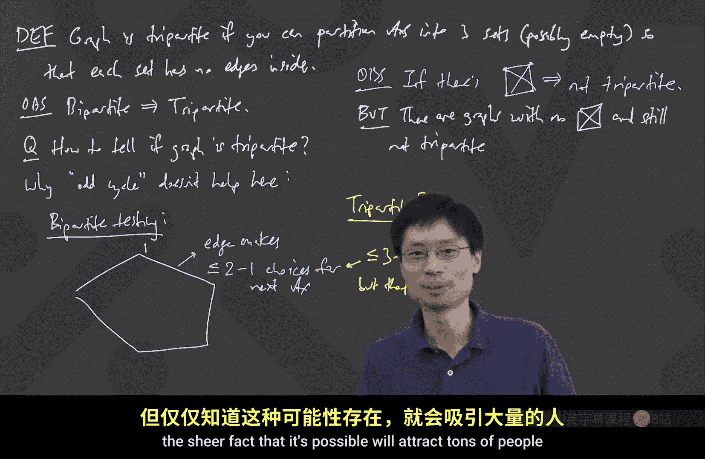

# 离散数学：第32讲：二分图与图着色

在本节课中，我们将要学习图论中的一个重要概念——二分图。我们将了解二分图的定义，学习如何判断一个图是否为二分图，并探讨二分图与奇环之间的关系。最后，我们会简要提及将二分图概念推广到三分图时所带来的计算复杂性差异。

---

## 二分图的定义

上一节我们介绍了图的基本概念，本节中我们来看看一种特殊的图结构。

一个图被称为**二分图**，如果存在一种方式将其顶点集**划分**成两个集合，使得图中**没有边**完全位于**同一个集合**内部。

用公式描述，即存在一个划分 `V = A ∪ B`，其中 `A ∩ B = ∅`，使得对于图中的每一条边 `(u, v)`，都有 `u ∈ A, v ∈ B` 或 `u ∈ B, v ∈ A`。

在上图中，所有边都连接了左右两侧的顶点，这是一个典型的二分图。需要注意的是，一个图可能有多种不同的二分划分方式，并且划分中的集合可以是空集。

---

## 如何判断二分图

上一节我们定义了二分图，本节中我们来看看如何高效地判断一个给定的图是否为二分图。

最直接的方法是尝试所有可能的顶点划分。对于一个有 `n` 个顶点的图，每个顶点可以属于集合A或集合B，因此总共有 `2^n` 种可能的划分（考虑到集合A和B的对称性，可以节省大约一半的检查，但这仍然是**指数级**的复杂度）。对于大型图来说，这种方法是不切实际的。

因此，我们需要一个更高效的判定方法。

---

## 奇环：二分图的“破坏者”

在寻找高效算法之前，我们先来探讨一个关键性质：**奇环**。

一个**奇环**是指一个包含奇数个顶点的环。如果图中存在任何一个奇环，那么这个图就**不可能**是二分图。

**原因如下**：
假设我们试图将一个奇环的顶点分配到两个集合中。从任意一个顶点开始，将其放入集合A。由于边必须连接两个不同集合的顶点，它的邻居必须放入集合B，邻居的邻居又必须放回集合A，以此类推。当我们沿着这个奇环走一圈回到起点时，会发现起点被迫同时属于两个集合，这产生了矛盾。

因此，我们得到结论：
> 如果一个图包含奇环，那么它**不是**二分图。

---

## 核心定理：无奇环等价于二分图

上一节我们看到奇环会阻碍二分图的形成。一个自然而然的猜想是：如果一个图**没有**奇环，那么它**就是**二分图。这个猜想是正确的，它构成了一个完整的判定定理。

**定理**：一个图是二分图，**当且仅当**它不包含任何奇环。

我们已经证明了“如果包含奇环，则不是二分图”。现在需要证明另一个方向：“如果不包含奇环，则一定是二分图”。

**证明思路（构造性算法）**：
1.  从任意一个顶点 `v` 开始，将其标记为 `1`。
2.  将所有与 `v` 相邻的顶点标记为 `2`。
3.  将所有与标记为 `2` 的顶点相邻、且未被标记的顶点标记为 `1`。
4.  重复此过程，像波纹一样一层层向外标记顶点（这类似于广度优先搜索BFS）。

在这个过程中，我们会将顶点分成不同的“层”：
*   `N0(v)`: 顶点 `v` 本身（距离为0）。
*   `N1(v)`: 所有与 `v` 距离为1的顶点。
*   `N2(v)`: 所有与 `v` 距离为2的顶点。
*   以此类推。

**关键观察**：
*   在这个标记方案下，边只可能存在于相邻的层之间（例如 `Nk` 和 `Nk+1` 之间）。不可能存在“跳跃”的边（例如从 `N1` 直接到 `N3`），否则最短路径距离的定义会被破坏。
*   更重要的是，**不可能存在连接同一层内两个顶点的边**。如果存在这样一条边，结合它们回到起点 `v` 的两条路径，就会构成一个**奇环**，这与我们“无奇环”的假设矛盾。

因此，所有奇数层的顶点可以构成集合A，所有偶数层的顶点构成集合B，这样就得到了一个合法的二分划分。如果图不连通，对每个连通分量重复此过程即可。

这个证明过程本身也提供了一个**高效算法**来判断二分图：执行上述的BFS或DFS标记过程。如果在标记过程中，发现一条边连接了两个相同标记的顶点，就找到了一个奇环，说明图不是二分图。如果整个过程顺利完成而没有冲突，那么图就是二分图，并且标记结果直接给出了一个二分划分。

---

## 从二分到三分：复杂性的跃迁

上一节我们完美解决了二分图的判定问题。本节中我们来看看，如果将问题推广到三分图，情况会发生什么变化。

一个图被称为**三分图**，如果其顶点可以被划分成**三个**集合，且每个集合内部没有边。显然，任何二分图也是三分图（只需让第三个集合为空集）。

那么，如何判断一个图是否是三分图呢？一个诱人的想法是寻找类似于“奇环”的简单禁止结构。例如，完全图 `K4`（四个顶点两两相连）就不能被三分着色，因为四个顶点需要四种不同的颜色。

然而，问题在于**不存在**一个像“奇环”那样简洁的禁止子图列表来刻画三分图。存在一些复杂的图（例如彼得森图），它们不包含 `K4`，但同样不是三分图。判断三分图（等价于判断图是否可用三种颜色着色）是一个著名的**NP完全问题**，目前认为不存在对所有情况都高效的多项式时间算法。

**为什么二分和三分有如此大的差异？**
关键在于“约束力”。在二分图着色时，一个顶点的颜色确定后，其所有邻居的颜色都被**强制**确定为另一种颜色，没有选择余地。而在三分着色时，一个顶点的颜色确定后，其邻居仍有**两种**可能的颜色选择。这种微小的选择自由度，在图中传播开来会导致需要回溯的可能性呈指数级增长，从而使得问题在计算上变得异常困难。

---

## 总结

本节课中我们一起学习了：
1.  **二分图**的定义：顶点可划分为两个集合，所有边跨越集合。
2.  判断二分图的高效方法：利用BFS/DFS进行顶点标记，其本质是检查图中是否存在**奇环**。
3.  核心定理：图是二分图 **当且仅当** 它不包含奇环。
4.  问题的推广：将二分图判定推广到三分图判定时，问题会从简单的多项式时间可解（P问题）转变为目前认为的难解问题（NP完全问题），这体现了计算复杂性中“二分”与“三分”之间的根本差异。

理解二分图及其判定是图论学习中的重要基础，它在匹配问题、网络流等领域有着广泛的应用。