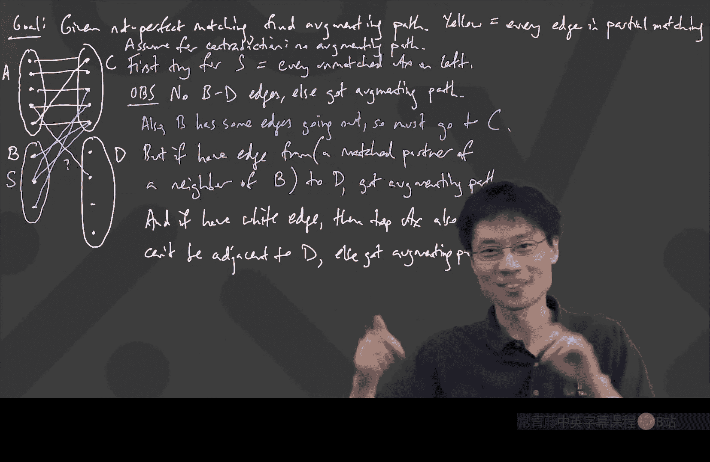

# 离散数学：第33讲：二分图匹配与霍尔定理

在本节课中，我们将要学习二分图匹配的核心概念，特别是如何判断一个二分图中是否存在“完美匹配”。我们将从一个实际问题出发，引出匹配的定义，并最终学习一个非常强大且优美的定理——霍尔定理。这个定理给出了完美匹配存在的充要条件。

---

## 考试回顾与课程过渡

上一周我们刚刚结束了考试。这次考试涉及了较多证明内容，在历史上通常被认为难度较高。但从结果分布来看，大多数同学能够完成大约三道题目，这达到了课程的基本目标。考试中的每一道题目都旨在考察我们对课程核心概念的理解与应用，而非直接套用。

关于考试的详细讨论将在本周的习题课中进行，建议大家参加。

现在，让我们回到课程内容。我们将继续探讨二分图，但焦点将转向“匹配”这一主题。

---

## 什么是匹配？一个分配问题

想象一个场景：有一群人，还有一些物品。每个人对某些物品感兴趣，愿意接受它们。我们可以用二分图来表示这种关系：左侧顶点代表人，右侧顶点代表物品，如果一个人对某个物品满意，就在他们之间连一条边。

**核心问题**：是否存在一种分配方式，给**每个人**恰好一个他/她满意的物品，并且每个物品只能分配给一个人？这就是寻找一个“完美匹配”的问题。

更形式化地说，在一个二分图中，一个从左侧到右侧的**完美匹配**是指：为左侧的每一个顶点，都找到一个**不同的**右侧顶点与之配对，并且这对顶点之间必须有一条边相连。

---

## 完美匹配的必要条件

在探讨如何找到完美匹配之前，我们先思考一下，如果一个完美匹配存在，这个图必须满足哪些显而易见的条件？这些条件被称为“必要条件”——如果连这些条件都不满足，那么完美匹配绝对不可能存在。

考虑一个一般的二分图，左侧有 `L` 个顶点，右侧有 `R` 个顶点。

1.  **基数条件**：右侧的顶点数量必须至少和左侧一样多。
    *   **公式**：`|R| ≥ |L|`
    *   **解释**：如果物品比人少，那无论如何都会有人分不到物品。

2.  **霍尔条件（局部邻居条件）**：对于左侧的**任意**一个子集 `S`，这个子集中所有人“感兴趣”的物品总数（即这些人的邻居集合 `N(S)`）的大小，必须至少等于子集 `S` 本身的大小。
    *   **公式**：对于所有 `S ⊆ L`，有 `|N(S)| ≥ |S|`
    *   **解释**：`N(S)` 是 `S` 中所有顶点的邻居的**并集**。这个条件防止了“内部竞争”：任何 `k` 个人，他们合起来至少要对 `k` 个不同的物品感兴趣，否则这 `k` 个人就会因为选择太少而无法全部被满足。

3.  **连通性条件（由条件2推出）**：如果二分图可以分成两个完全不相连的部分，那么上述霍尔条件必须在**每一个部分内部**都成立。
    *   **解释**：匹配问题在不相连的部分中是独立的。

实际上，条件2（霍尔条件）是最强的，它蕴含了条件1和条件3。如果条件2成立，那么条件1自动成立（只需取 `S` 为整个左侧集合 `L`）。

---

## 霍尔定理：必要即充分

一个非常了不起的结论是，对于二分图，上述显而易见的必要条件**同时也是充分的**。这就是**霍尔定理**（Hall‘s Marriage Theorem）。

**霍尔定理**：在一个二分图中，存在一个从左侧到右侧的完美匹配，**当且仅当**对于左侧的每一个子集 `S`，都有 `|N(S)| ≥ |S|`。

我们已经证明了“必要性”（⇒）：如果存在完美匹配，那么霍尔条件必须成立。否则，那些“选择太少”的人就无法被匹配。

定理中困难且精彩的部分是证明“充分性”（⇐）：**只要**霍尔条件成立，我们就**一定能够**构造出一个完美匹配。

---

## 证明思路：寻找“增广路径”

直接检查所有子集 `S` 的算法是指数级的，不可行。我们的证明将提供一个有效的构造性方法。

核心思想是使用“贪心+调整”算法。我们从一个空的匹配开始，尝试逐步增加匹配的边数。

1.  **初始尝试（贪心算法）**：简单地依次为每个人分配第一个可用的物品。这种方法很容易失败，例如，后来的人可能发现所有他感兴趣的物品都已被占用。

2.  **关键调整（增广路径）**：当一个人（设为 `P`）无法匹配时，我们尝试进行“调整”。`P` 可以去“抢占”一个已被分配的物品。这迫使原拥有者（设为 `Q`）必须去寻找一个新的物品。如果 `Q` 能找到一个新的空闲物品，那么问题就解决了；如果 `Q` 的新物品又是从别人那里“抢占”来的，这个过程就像连锁反应一样继续下去。

3.  **增广路径的定义**：这种“抢占-重分配”的链，在图论中称为**增广路径**。形式上，给定一个部分匹配 `M`，一条增广路径是一条起始于左侧未匹配顶点、终止于右侧未匹配顶点的路径，并且路径上的边交替地**不属于** `M` 和**属于** `M`。
    *   **不属于 M 的边**：代表“抢占”或新的潜在连接。
    *   **属于 M 的边**：代表沿着现有匹配进行“回溯”或调整。

4.  **增广路径的作用**：一旦找到一条增广路径，我们可以通过“翻转”路径上边的状态来得到一个更大的匹配：将路径上原来不在 `M` 中的边加入 `M`，同时将原来在 `M` 中的边从 `M` 中移除。这样，匹配的边数就增加了1。

因此，证明霍尔定理的充分性就转化为：**在霍尔条件成立的前提下，只要当前匹配还不是完美匹配，我们就一定能找到一条增广路径。**

---

## 证明核心：为何增广路径必然存在？（反证法草图）

假设存在一个满足霍尔条件的部分匹配 `M`，但它不是完美匹配，并且**不存在**任何增广路径。我们将推导出矛盾。

1.  设 `B` 是左侧所有未匹配顶点的集合。
2.  由于没有增广路径，`B` 中的顶点不能直接连接到右侧任何未匹配的顶点（否则这就是一条长度为1的增广路径）。
3.  根据霍尔条件，`B` 必须有邻居。因此，`B` 的所有邻居都位于右侧那些**已被匹配**的顶点集合中。
4.  考虑这些右侧匹配顶点的“配偶”（即它们在左侧的匹配对象），将这些左侧顶点加入考虑范围。
5.  通过反复应用“没有增广路径”的假设和霍尔条件，我们可以分析出，从初始集合 `B` 出发，通过交替行走（从左侧到右侧用非匹配边，从右侧到左侧用匹配边）所能到达的所有左侧顶点构成的集合 `S`，其邻居 `N(S)` **恰好就是**我们行走过程中访问过的那些右侧顶点。
6.  然而，根据我们的行走方式，`N(S)` 的大小**等于** `S` 中通过匹配边相连的顶点数，而这个数**严格小于** `S` 的大小（因为 `S` 包含了起点 `B`，而 `B` 中的顶点是未匹配的）。
7.  这就得到了 `|N(S)| < |S|`，与霍尔条件矛盾！

因此，假设不成立，增广路径必然存在。

---

## 总结

本节课中，我们一起学习了：
1.  **匹配问题**：将二分图左侧顶点（如人）与右侧顶点（如物品）配对的实际背景。
2.  **完美匹配的必要条件**，特别是强大的**霍尔条件**：`∀S ⊆ L, |N(S)| ≥ |S|`。
3.  **霍尔定理**：该条件同样是完美匹配存在的**充分条件**，这是一个深刻而优美的结论。
4.  **证明的核心思想**：通过构造性地寻找**增广路径**并利用反证法，证明了只要霍尔条件成立，就可以通过有限步的调整最终得到完美匹配。这个证明过程也隐含了一个寻找匹配的有效算法（如匈牙利算法）的基本原理。

霍尔定理是组合数学和图论中的一个基石，它在任务分配、调度、网络流等众多领域有广泛应用。