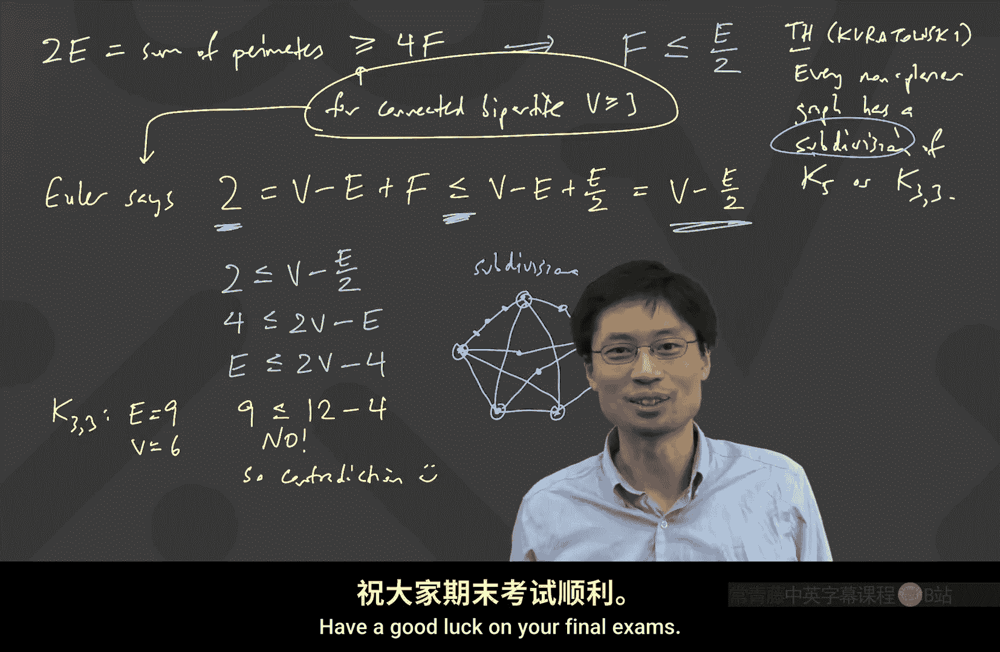

# 离散数学：第35讲：平面图与欧拉公式

在本节课中，我们将要学习图论中一个非常有趣的概念：平面图。我们将了解什么是平面图，并学习一个关于平面图的顶点、边和面的重要公式——欧拉公式。最后，我们将利用这个公式来证明某些特定的图（如K5和K33）不是平面图。

---

## 什么是平面图？

上一节我们介绍了图的基本概念，本节中我们来看看一种特殊的图：平面图。

一个图被称为**平面图**，当且仅当它可以被画在平面上，并且**没有任何边相交**。

例如，完全图K3是一个平面图，因为我们可以轻松地画出它而不让边相交。然而，对于K4，如果我们画成一个正方形加两条对角线，边就会相交。但这并不意味着K4不是平面图，只是我们画得不好。实际上，K4可以画成一个四面体（或三角形加中心点）的形状，从而避免边相交，因此K4是平面图。

那么，完全图K5呢？我们似乎很难找到一种画法让它的所有边都不相交。但要证明K5不是平面图，我们不能仅仅依靠“尝试所有画法都失败了”，因为画法有无限多种。我们需要一个更严谨的数学工具。

---

## 欧拉公式

为了严谨地分析平面图，我们需要引入一个核心概念：**面**。在一个平面图的画法中，边将平面分割成若干区域，这些区域被称为“面”。我们总是将图形外部无限大的区域也计为一个面。

现在，我们来看一个连接平面图顶点数、边数和面数的重要公式。

对于任何一个**连通**的平面图画法，以下公式恒成立：
**V - E + F = 2**
其中：
*   **V** 是顶点数。
*   **E** 是边数。
*   **F** 是面数。

这个公式被称为**欧拉公式**。它同样适用于多面体（例如立方体、四面体），这也是它有时被称为“欧拉多面体公式”的原因。

### 证明欧拉公式

我们可以使用数学归纳法来证明欧拉公式。证明的思路是，对于一个连通平面图，我们通过逐步移除边，将其简化到最基本的情况（树），然后验证公式成立，再反向推导回原图。

以下是证明的关键步骤：

**1. 基础情况**
我们考虑所有可能的顶点数V。对于一个有V个顶点的连通平面图，其边数的最小值是 **V - 1**（此时图是一棵树）。对于一棵树，它只有一个面（即外部无限面）。代入公式：
V - (V - 1) + 1 = 2
公式成立。

**2. 归纳步骤**
现在，考虑一个边数 **E > V - 1** 的连通平面图。因为边数多于顶点数减一，根据图论知识，该图中**至少存在一个环**。
*   我们从这个环中删除任意一条边。删除后，图仍然是连通的（因为删除的是环上的边），并且仍然是平面的（没有引入新的相交）。
*   对于这个新的、边数更少的图，根据归纳假设，欧拉公式成立：V' - E' + F' = 2。
*   比较新旧图：顶点数不变（V = V‘），边数减少1（E = E’ + 1）。由于我们删除的是环上的一条边，这条边原本分隔了两个不同的面，删除后这两个面会合并成一个面，因此面数也减少1（F = F’ + 1）。
*   将变化代入归纳假设的公式：(V') - (E' + 1) + (F' + 1) = V' - E' + F' = 2。
因此，原图的公式 V - E + F = 2 也成立。

通过归纳法，我们证明了欧拉公式对所有连通平面图都成立。

---

## 利用欧拉公式推导边的上界

欧拉公式本身很优美，但我们如何用它来证明某个图不是平面图呢？关键在于将面数F与边数E联系起来，从而得到一个只关于V和E的不等式。

我们通过“双计数”技巧来建立联系：计算所有面的周长（即围绕每个面的边数）之和。

**重要观察：**
1.  每条边恰好属于两个面（或者为同一个面的边界贡献两次），因此**所有面的周长之和等于 2E**。
2.  在一个顶点数至少为3的连通平面图中，每个面至少由3条边围成（最小的面是三角形）。因此，**所有面的周长之和至少为 3F**。

结合以上两点，我们得到不等式：
**3F ≤ 2E**

将这个不等式与欧拉公式 **V - E + F = 2** 结合，我们可以消去F：
1.  由 3F ≤ 2E 得 F ≤ (2/3)E。
2.  代入欧拉公式：2 = V - E + F ≤ V - E + (2/3)E = V - E/3。
3.  整理不等式：2 ≤ V - E/3 => E ≤ 3V - 6。

于是，我们得到了一个重要的结论：
**对于任何顶点数 V ≥ 3 的连通平面图，其边数满足 E ≤ 3V - 6。**

这个结论非常有用，它表明平面图的边数不能太多，其增长是线性的（O(V)），而不是像完全图那样的平方级（O(V²)）。

---

## 应用：证明 K5 和 K33 不是平面图

现在，我们可以利用上述结论来证明某些图不是平面图。

**证明 K5 不是平面图：**
*   K5有 V = 5 个顶点，E = 10 条边。
*   如果K5是平面图，它必须满足 E ≤ 3V - 6。
*   计算：3V - 6 = 3*5 - 6 = 9。
*   但是 10 > 9，不满足不等式。
*   **因此，K5不是平面图。**

**证明 K33 不是平面图：**
K33（二分完全图）有 V = 6 个顶点，E = 9 条边。直接套用 E ≤ 3V - 6 得到 9 ≤ 12，无法推出矛盾。我们需要一个更强的条件。
*   K33是一个二分图，这意味着它不包含奇数长度的环。因此，在K33的任何平面画法中（如果存在），它的每个面至少由4条边围成（因为三角形面需要3条边，但二分图没有三角形）。
*   因此，对于二分图，我们有更强的条件：所有面的周长之和 **≥ 4F**。
*   结合 2E ≥ 4F，得到 F ≤ E/2。
*   代入欧拉公式：2 = V - E + F ≤ V - E + E/2 = V - E/2。
*   整理得：E ≤ 2V - 4。
*   对于K33：V=6， 2V - 4 = 8。
*   但K33的边数 E=9 > 8，产生矛盾。
*   **因此，K33也不是平面图。**

---

## 库拉托夫斯基定理

为什么我们特别关注K5和K33？这是因为一个非常重要的定理——**库拉托夫斯基定理**。该定理指出：
**一个图是非平面图，当且仅当它包含K5或K33的“细分”作为其子图。**
“细分”操作是指在一条边上插入新的顶点，将其分成多条边。这意味着，任何非平面图的“核心”结构里，都藏着一个K5或K33的变形。这就是为什么证明这两个基本图是非平面图如此重要。

---

## 总结

本节课中我们一起学习了：
1.  **平面图**的定义：可以画在平面上且边不相交的图。
2.  平面图的**欧拉公式**：对于连通平面图，V - E + F = 2。我们使用归纳法完成了证明。
3.  利用欧拉公式和双计数法，推导出了平面图边数的上界：**E ≤ 3V - 6**（对于一般图）和 **E ≤ 2V - 4**（对于二分图）。
4.  应用这些上界，我们严谨地证明了**K5**和**K33**不是平面图。
5.  最后，我们提到了**库拉托夫斯基定理**，它揭示了K5和K33在判定平面性中的核心地位。

希望本节课能帮助你理解平面图的基本性质，并学会运用欧拉公式这一强大工具进行推理和证明。