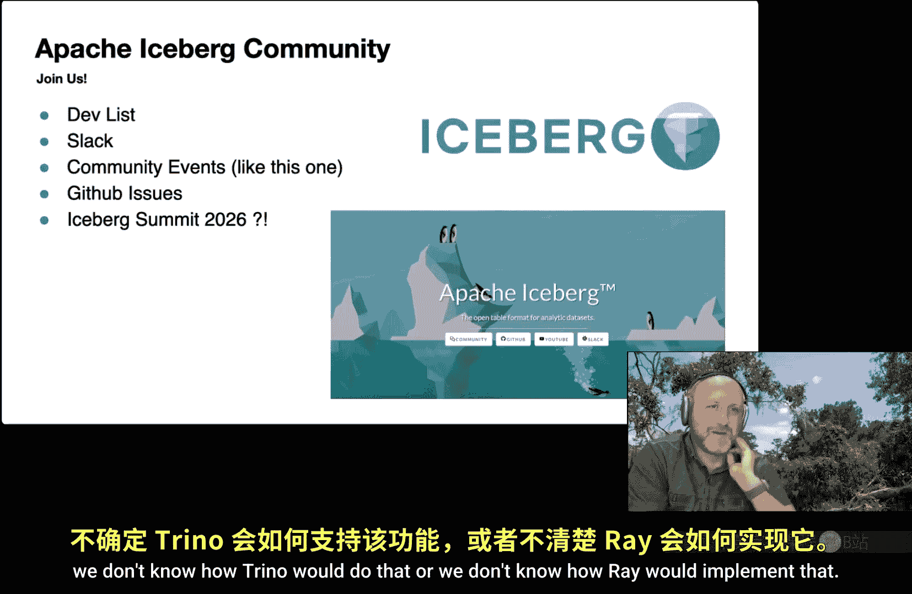

# 001：Apache Iceberg 查询规划的实际工作原理 - 技术概览

在本节课中，我们将深入探讨 Apache Iceberg 查询规划的实际工作原理。我们将从 Iceberg 的核心架构和关键概念讲起，逐步深入到查询如何从 SQL 语句转换为具体的文件扫描任务。课程内容将涵盖谓词下推、清单过滤、删除文件处理等核心机制，并简要展望 Iceberg V4 的未来发展方向。目标是让初学者能够理解 Iceberg 如何高效地减少数据读取量，从而加速查询。

## 为什么查询规划至关重要

无论我们为向量化执行引擎或复杂的 Shuffle 算法设计了多少优化，都无法超越一个基本原则：执行查询最快的方式是读取尽可能少的数据。因此，查询规划的核心目标就是减少需要读取的数据量。

实现这一目标最直接的方法是利用与数据文件关联的统计信息（Metrics）来判断文件是否与查询相关。例如，像 Apache Parquet 这样的列式文件格式，其文件尾部（Footer）通常包含每列的最小值（min）和最大值（max）范围。

利用这些信息，我们可以根据查询条件决定是否需要读取某个文件。例如，对于一个查询 `WHERE x = 2 AND y > 40 AND z STARTS WITH ‘BAZ’`，我们可以检查 Parquet 文件的统计信息：

*   **x = 2**：如果 x 的 min-max 范围是 [0, 10]，那么 2 有可能在这个文件中。
*   **y > 40**：如果 y 的 max 值是 20，那么 y 永远不可能大于 40，因此**无需读取**此文件。
*   **z STARTS WITH ‘BAZ’**：如果 z 的 min-max 范围是 [‘A’, ‘F’]，那么以 ‘BAZ’ 开头的字符串可能存在。

在文件级别，这非常有效，因为只需读取文件尾部即可做出判断。然而，在云存储（如 S3）时代，反复列出文件并检查其尾部的成本变得极高。因此，我们进入了表格式（Table Format）的时代，Apache Iceberg 就是其中之一。

今天我们将讨论 Apache Iceberg 如何收集这些统计信息，将其放入无需读取原始文件即可访问的元数据格式中，并如何利用这些元数据信息来规划查询。

## 课程内容概览

我们将从 Apache Iceberg 的基础架构和关键特性开始，这些是理解查询规划工作原理的前提。然后，我们将模拟一个 Spark SQL 查询，跟踪它如何被分解并传入 Iceberg 库。接着，我们会探讨这些从 SQL 中提取出的谓词如何应用于清单列表（Manifest List）过滤。在了解了 Iceberg 的构建方式后，我们将讨论清单（Manifest）本身的过滤。最后，我们会讲解删除文件（Delete Files）—— Iceberg 中一个相对较新的概念——如何与数据文件一起进行规划，从而完成整个流程。课程结尾将简要介绍 Apache Iceberg 社区正在为 V4 版本规划的一些重大变革。

从宏观上看，整个流程涉及三个层面：

1.  **引擎特定层**：将查询（如 Spark、Trino 的 SQL）转换为 Iceberg 库能理解的实体。
2.  **Iceberg 核心层**：使用这些转换后的结构，在 Iceberg 代码库内部完成查询规划。
3.  **文件扫描任务层**：生成最终需要从磁盘读取的文件扫描任务（Scan Tasks）。此外，在文件格式层面（如 Parquet 的行组过滤）还有进一步的过滤，其原理与清单过滤类似，但本课程将不深入讨论。

## Apache Iceberg 核心概念

在深入规划细节之前，我们需要理解几个 Iceberg 的核心概念。请注意，以下是高度简化的版本，仅聚焦于与查询规划相关的部分。

### 什么是 Apache Iceberg？

Apache Iceberg 是一种**开放表格式**。其核心思想是：如何将一堆文件（如 Parquet 文件）像关系型数据库一样管理。它实现了计算与存储分离、ACID 事务，并支持模式演化、分区等数据库特性，同时针对云存储进行了优化。最重要的是，它的定义是开放的，旨在让不同厂商和引擎能够协同工作，实现互操作性。

Iceberg 通过在数据文件之上构建一层元数据来实现这一点。与其他表格式不同，Iceberg 选择将元数据也存储在一系列文件中，并通过一个名为 **Apache Iceberg 规范** 的文档来明确定义这些文件的组织方式和交互规则，确保实现的无关性。

### 元数据层次结构

Iceberg 表的元数据是一个层次化的树状结构：

1.  **元数据文件**：一个 JSON 文件，描述表的整体信息，如模式（Schema），并指向多个快照（Snapshot）。
2.  **快照**：代表表在某个时间点的完整状态。每个快照指向一个**清单列表**。
3.  **清单列表**：一个文件，列出了属于该快照的所有**清单文件**。
4.  **清单文件**：一个文件，列出了属于该快照的所有**数据文件**（和**删除文件**）。

这种层级结构的关键优势在于：要判断是否需要读取底层的数据文件，可以先检查上一层（清单）的统计信息，从而大幅减少实际需要打开和检查的文件数量。

### 模式演化与字段 ID

在旧系统中，模式演化是个难题。例如，删除一列后又添加同名列，可能会意外地“复活”旧数据，因为底层文件中的列名没有改变。

Iceberg 通过引入 **字段 ID** 解决了这个问题。在定义表模式时，每个字段除了有名称（供 SQL 查询使用），还有一个唯一的、不可变的数字 ID。

*   当写入数据文件时，文件内部记录的是**字段 ID** 到列值的映射，而不是列名。
*   当查询引用一个列名（如 `id`）时，Iceberg 首先在表模式中查找该名称对应的**字段 ID**（例如 2）。
*   然后，在读取数据文件时，它直接查找字段 ID 为 2 的数据，完全不管文件内部该列实际叫什么名字。

这样，重命名列、删除后重新添加列等操作，都只需修改表模式中的名称映射，而无需重写任何数据文件，因为数据查找始终通过字段 ID 进行。

### 隐藏分区与分区转换

与传统 Hive 分区（基于目录名）不同，Iceberg 实现了**隐藏分区**。它不依赖目录结构来推断分区值，而是将分区信息作为元数据与文件关联。

这通过 **分区规范** 实现。分区规范定义了一组**转换函数**（如按天截取、哈希分桶），这些函数作用于表的某些列（通过字段 ID 引用），为每个数据文件生成一个**分区值元组**。

例如，可以对 `timestamp` 列应用 `day` 转换，生成一个代表日期的分区值。这个值会作为元数据存储在文件中，与文件的实际存储路径无关。查询时，即使查询条件是基于原始的 `timestamp` 列，Iceberg 也会自动将条件转换为对转换后分区值的过滤，从而实现高效的“隐藏分区”过滤。所有转换函数在 Iceberg 规范中都有明确定义，确保跨引擎的一致性。

## 从 SQL 到 Iceberg 表达式

现在，我们开始进入查询规划的实际流程。假设我们在 Spark SQL 中执行一个查询。

Spark 通过数据源 V2 API 与 Iceberg 插件交互。Spark 会调用 `pushPredicates` 和 `pruneColumns` 等方法，将查询信息传递给 Iceberg。

### 谓词转换与绑定

在 `pushPredicates` 方法中，Spark 传入的是 Spark 自身的谓词表达式。Iceberg 插件首先需要将其转换为 Iceberg 内部的表达式表示。

转换完成后，我们得到的是 **未绑定的谓词**。它包含列名、字面量和操作符，但尚未与具体的表模式关联。

接下来是关键步骤：**绑定**。Iceberg 会尝试根据当前表的模式，将谓词中的列名解析为具体的**字段 ID**。例如，将名为 `x` 的列绑定到字段 ID 2。只有成功绑定的谓词，才能用于后续基于统计信息的过滤。

绑定过程也会考虑时间旅行（Time Travel）。如果查询指定了 `AS OF` 子句，Iceberg 会选取对应快照的模式进行绑定，确保使用正确的模式版本。

### 列剪裁

在 `pruneColumns` 方法中，Spark 传入它需要读取的列。Iceberg 根据这些列名和表模式，生成一个投影后的 Iceberg 模式。

这里有一个重要细节：查询谓词中可能引用了未被选择投影的列。例如，查询 `SELECT x WHERE z > 5` 中，`z` 列只用于过滤，不出现在结果集中。因此，在构建投影模式时，必须将谓词中引用的所有列也包含进来，因为引擎在过滤时仍然需要读取这些列的数据。

完成这两步后，我们就得到了 Iceberg 内部的表达式集合和投影模式，可以进入核心的 Iceberg 规划代码了。

## 清单列表过滤

规划的第一步是确定要读取哪个快照。快照确定后，我们就可以加载其指向的清单列表。

清单列表文件包含许多条目，每个条目对应一个清单文件，并包含两个关键信息用于过滤：
1.  **分区规范 ID**：指明该清单内所有数据文件使用了哪种分区规范。
2.  **分区统计信息**：描述了该清单内所有数据文件分区值元组的**最小值和最大值范围**。

我们的目标是在不打开清单文件的情况下，判断整个清单是否可能包含符合查询条件的数据文件。

为此，我们需要将之前绑定的 Iceberg 表达式（基于原始列）**投影**到清单所使用的特定分区规范上。例如，查询条件是 `timestamp < ‘2008-11-05’`，而清单的分区规范是对 `timestamp` 列应用了 `day` 转换。那么，Iceberg 会将查询条件转换为对转换后分区值（即“天数”）的过滤条件：`day_timestamp < days(‘2008-11-05’)`。

转换后的表达式现在可以直接与清单条目的分区统计信息进行比较。Iceberg 使用 **访问者模式** 来遍历表达式树。对于每个操作符（如 `>`、`<`、`=`），都有对应的逻辑来检查统计信息的上下界。

例如，对于 `lessThan` 操作符，如果清单分区统计信息的**下界**都**不小于**查询字面量，那么该清单内**不可能**有满足 `column < value` 的行，因此可以跳过整个清单。反之，则可能需要读取。

通过这种方式，我们筛选出了需要进一步检查的清单文件。

## 清单文件与数据文件过滤

打开一个清单文件后，里面列出了许多数据文件条目。每个条目包含比清单列表更丰富的信息：
*   该文件具体的**分区值元组**。
*   各个列的统计信息：值计数、空值计数、**最小值/最大值**（序列化为二进制）。

现在，我们可以对每个数据文件进行更精细的过滤。逻辑与清单列表过滤类似，但更具体：
1.  **分区过滤**：使用转换后的表达式，直接与数据文件条目中具体的分区值元组进行比较。
2.  **列统计过滤**：使用原始的 Iceberg 表达式，与数据文件条目中列的 min/max 二进制值进行比较。这里需要将二进制值反序列化为对应的类型进行比较。

当前（V3及之前）的挑战在于，列统计信息以 **字段ID到二进制值** 的映射形式存储。这带来两个问题：
*   **类型信息缺失**：二进制值本身不包含类型信息，如果模式演化中发生了类型提升（Type Promotion），比较会变得复杂。
*   **列式读取不友好**：在 Parquet 等列式文件中，映射结构不利于只读取特定列的统计信息，可能需读取全部。

尽管如此，当前的实现仍能有效工作。通过分区和列统计的两层过滤，我们最终得到一组**可能包含匹配行**的数据文件列表。

## 处理删除文件

Iceberg 支持通过**删除文件**来标记数据文件中某些行已删除。规划时必须确定哪些删除文件适用于哪些数据文件，以便读取引擎在读取数据时应用这些删除。

删除文件也有自己的清单（删除清单）。在规划初期，我们会像过滤数据清单一样，根据分区和统计信息过滤删除清单，得到一组相关的删除文件。

然后，我们构建一个 **删除文件索引**。在生成最终的数据文件扫描任务前，我们会为每个数据文件查找其关联的删除文件。关联方式主要有几种：
*   **等值删除**：基于内容匹配的删除，可能全局适用或适用于特定分区。
*   **位置删除**：指定文件路径和行号的删除列表。
*   **删除向量**（V3 新特性）：一个紧凑的位图，直接标识要删除的行。

将数据文件与其关联的删除文件配对，就构成了一个完整的 **扫描任务**。

## 任务规划与最终输出

最后一步是 **任务规划**。用户或引擎可以指定任务拆分大小。Iceberg 会根据数据文件的大小，决定是否将大文件拆分成多个任务，或将多个小文件合并成一个任务，以优化执行单元的负载。

至此，所有规划工作完成。Iceberg 将生成的扫描任务列表返回给执行引擎（如 Spark）。引擎负责实际读取这些文件，并将数据转换为内部格式进行后续计算。如果查询包含 `LIMIT` 等子句，引擎可能会提前终止，无需读取所有规划出的任务。

## 展望：Iceberg V4 的演进

当前架构仍有改进空间，社区正在积极规划 V4 版本，可能带来根本性变化：

1.  **改进列统计存储**：改变当前“字段ID到二进制映射”的存储方式，使其类型安全，并更适合列式读取，以支持更灵活的类型提升和更高效的统计信息访问。
2.  **移除清单列表**：提案建议将清单列表也视为一种特殊类型的清单，统一处理逻辑，简化层级。同时，探索对元数据文件本身应用“删除向量”的概念，允许增量更新元数据，而非总是重写整个文件。

这些变革旨在进一步提升 Iceberg 的规划性能和元数据管理效率。

## 总结与社区邀请

本节课我们一起深入学习了 Apache Iceberg 查询规划的实际工作原理。我们从减少数据读取的核心目标出发，探讨了 Iceberg 如何通过字段 ID 实现模式演化，通过隐藏分区和分区转换实现高效过滤。我们跟踪了一个查询从 Spark SQL 转换为 Iceberg 表达式，经历清单列表过滤、清单文件过滤、数据文件过滤，并整合删除文件，最终生成扫描任务的全过程。

Apache Iceberg 是一个开放治理的开源社区，欢迎所有人参与。你可以通过邮件列表、Slack 频道、GitHub 议题等方式加入，共同学习、讨论和贡献。期待在未来的社区活动和会议中见到大家！

