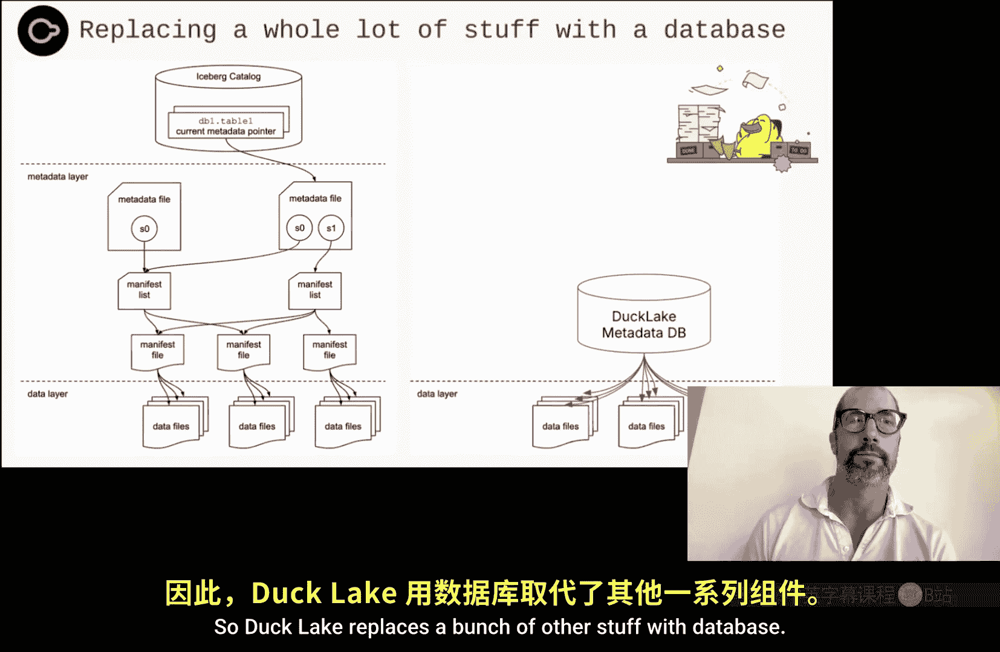
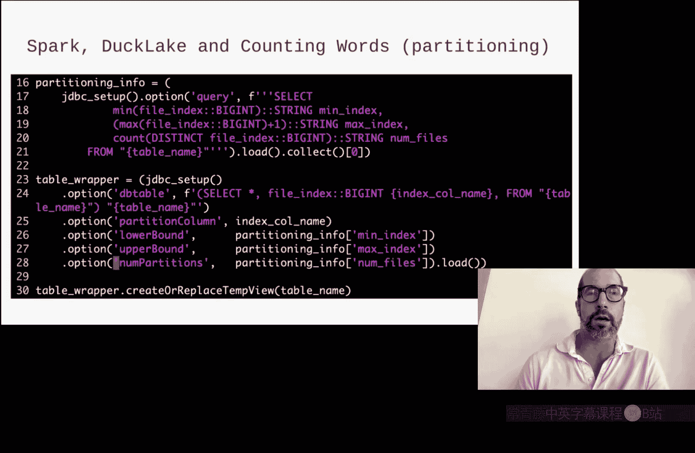
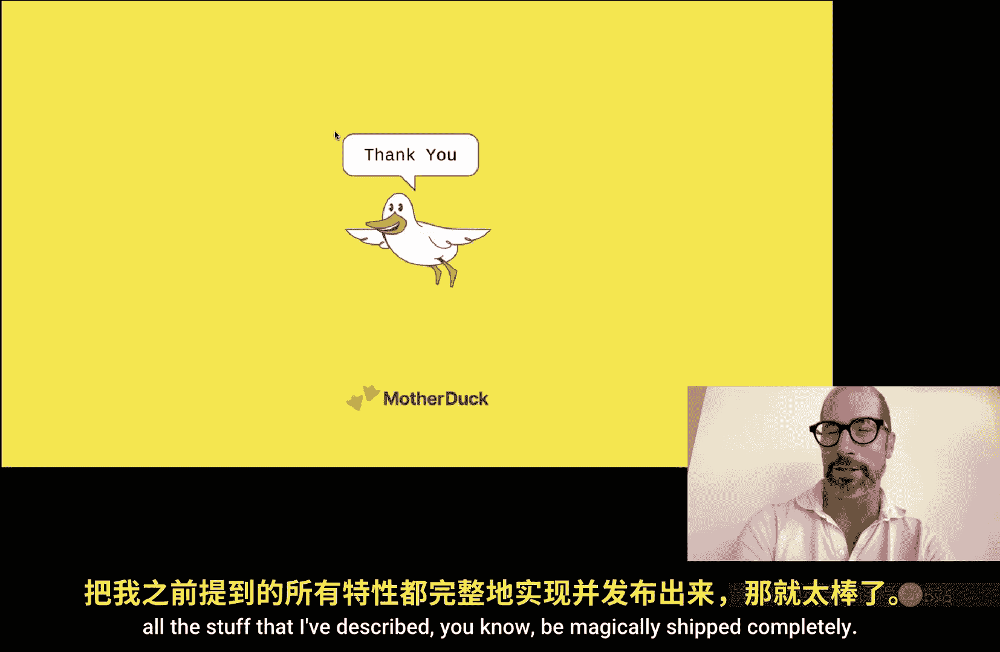

# 003：从云数据仓库学习，构建健壮的“湖仓一体”


在本节课中，我们将学习DuckLake的设计理念与架构。DuckLake是一个开放的数据格式和目录系统，旨在解决现有数据湖架构的诸多痛点，其设计灵感直接来源于成熟的云数据仓库（如BigQuery和Snowflake）的最佳实践。我们将通过对比分析，理解DuckLake如何通过将元数据管理回归数据库，来实现高性能、强一致性和易用性。

## 引言与背景

本次研讨会由卡耐基梅隆大学主办，谷歌赞助。演讲嘉宾是Jordan Tigani，他是Mother Duck公司的联合创始人兼CEO，此前曾长期担任Google BigQuery的存储技术负责人，在构建大规模数据分析系统方面拥有丰富经验。

## 云数据仓库的演进

上一节我们介绍了本次研讨会的背景，本节中我们来看看云数据仓库的发展历程。2010年代初期，以BigQuery和Snowflake为代表的云数据仓库兴起，带来了几个关键的技术转变：

*   **存储介质**：数据从本地磁盘迁移到对象存储。对象存储的不可变性改变了数据处理的方式。
*   **存储格式**：从行式存储转向列式存储，优化了分析查询的性能。
*   **架构**：从“无共享”架构转向“共享磁盘”架构，实现了存储与计算的分离，允许两者独立弹性伸缩。

对于云数据仓库的存储层，以下几个问题变得至关重要：

*   **文件管理**：由于对象存储的不可变性，会产生大量小文件，导致性能随时间下降。因此需要合并与压缩操作。
*   **元数据管理**：需要ACID属性来保证数据一致性，通过元数据指向最新的数据对象，从而实现快照隔离。
*   **流式数据**：列式存储不擅长处理频繁更新。解决方案是引入行式存储缓冲区，定期将数据写入列式存储，同时保证查询的一致性。
*   **减少数据读取**：读取海量数据成本高昂且缓慢。通过实现统计信息、分区等技术来减少需要读取的数据量变得至关重要。

## 数据湖的挑战与湖仓一体架构的出现

在另一个技术演进路径上，数据湖架构（基于Parquet、ORC等开放格式）虽然提供了无限扩展性和模式灵活性，但也存在显著问题：

*   它们容易变成难以治理的“数据沼泽”。
*   性能不佳。
*   缺乏有效的文件管理、ACID事务支持以及处理小规模频繁更新的能力。

湖仓一体架构的出现，旨在解决上述问题：

*   通过写入时或读取时合并来解决文件管理问题。
*   提供ACID事务更新。
*   通过提供剪枝信息来减少数据读取量。

然而，早期的湖仓一体方案仍存在一些挑战：

*   将数据存储在元数据文件中导致文件数量爆炸式增长。
*   数据新鲜度（低延迟更新）仍是问题。
*   涉及多表的复杂事务处理困难。
*   读取路径长、延迟高，因为需要从多个元数据位置读取信息才能定位数据。

## DuckLake的设计哲学

我们看到，湖仓一体架构正在向云数据仓库架构收敛演进，并形成以下共识：

*   **表是比文件更好的接口**：用户应该基于表而非文件进行交互。
*   **数据库是比对象存储更好的元数据存储地**。
*   **后台合并优于前台合并**。
*   **协同访问控制（每个引擎直接访问所有文件）并非最佳实践**，需要集中的访问控制管理。

DuckLake正是通过将元数据移入目录（一个数据库）来帮助解决这些问题，推动这种收敛进化：

*   **事务**：通过数据库事务来保证。
*   **数据新鲜度**：通过内联写入实现。
*   **读取路径**：大大缩短，仅需几次数据库查询即可定位文件，然后直接访问。

## 核心机制对比：文件剪枝

减少数据读取是提升性能的关键，而文件剪枝（即跳过不相关的数据文件）是核心手段。下面我们通过一个简单的过滤聚合查询示例，对比BigQuery、Iceberg和DuckLake的实现方式。



**查询示例**：
```sql
SELECT customer_id, SUM(amount)
FROM sales
WHERE date BETWEEN ‘2023-01-01’ AND ‘2023-01-07’
GROUP BY customer_id
ORDER BY SUM(amount) DESC
LIMIT 10;
```



### BigQuery的实现

BigQuery将分区和列统计等元数据存储在Spanner（Google的全局分布式数据库）和专用的元数据表中。进行文件剪枝时，本质上是通过SQL查询这些元数据表，快速过滤出需要读取的存储集（指向实际数据文件）。这种方式高效且直接。

### Apache Iceberg的实现

Iceberg的元数据是链式结构，存储在对象存储（如JSON、Avro文件）中：
1.  读取目录，找到元数据文件指针。
2.  读取元数据文件，找到清单列表文件。
3.  读取清单列表文件，找到清单文件。
4.  读取清单文件（内含数据文件的范围统计信息），应用过滤条件，最终确定所需数据文件。

这个过程涉及多次远程读取，即使有缓存，在数据更新时也可能失效，导致读取路径较长、延迟较高。

### DuckLake的实现

DuckLake将类似的元数据（如文件列表、列统计）存储在数据库表中。进行文件剪枝时，只需执行一条SQL查询，例如：

```sql
WITH relevant_files AS (
    SELECT file_path
    FROM ducklake_column_stats
    WHERE column_id = ‘date’
        AND min_value <= ‘2023-01-07’
        AND max_value >= ‘2023-01-01’
        AND end_snapshot_id IS NULL -- 活动文件
)
SELECT * FROM relevant_files;
```

这条查询与BigQuery的元数据查询**非常相似**。它直接在数据库内完成高效的过滤，避免了Iceberg式的长链式读取。

## 核心机制对比：写入与ACID事务

一个健壮的系统必须支持ACID（原子性、一致性、隔离性、持久性）写入。

### BigQuery的写入
1.  创建查询作业并运行。
2.  将结果写入存储（Colossus）。
3.  在Spanner中启动事务。
4.  创建新的存储集指向结果，更新表元数据和统计信息。
5.  提交事务。
整个过程依赖于Spanner数据库的强大事务能力来保证ACID属性。

### Apache Iceberg的写入
1.  查询引擎运行任务，存储Parquet文件。
2.  写入清单文件、清单列表文件、新的元数据文件。
3.  更新目录指向新的元数据文件。
其原子性依赖于对象存储的最终一致性和目录的更新操作，隔离性实现起来较为复杂。

### DuckLake的写入
1.  运行数据创建任务。
2.  在目录数据库中创建事务。
3.  插入统计信息，更新表统计和列统计。
4.  提交事务。
由于所有操作都在一个数据库事务内完成，因此天然地提供了强大的ACID保证。其模式可以看作是BigQuery方案的规范化版本。

**对于小规模频繁写入**：
*   BigQuery：写入专用的内存行式存储缓冲区，定期压缩。
*   DuckLake：可以在目录数据库的表中缓冲数据。
*   Iceberg：目前支持仍不完善。

## 为何选择湖仓一体与DuckLake的优势

人们选择湖仓一体，通常提到的原因是开放性、避免供应商锁定、成本。但Jordan认为，这些往往是次要原因。**首要原因是用户希望运行多个计算引擎**（如Snowflake和Databricks），并希望能直接“触及”和理解底层数据文件。

然而，使用许多湖仓一体方案需要付出代价：
*   性能可能下降**2到10倍**。部分原因在于元数据管理开销大，以及查询引擎与数据格式之间可能存在的阻抗不匹配。
*   难以实现细粒度访问控制（如行级权限）。

DuckLake通过将元数据管理回归数据库，旨在**缩小这个性能差距**，并提供更好的治理能力。它遵循一个核心原则：**如果能用数据库实现某个功能，就应该使用数据库，而不是自己重新实现**。数据库擅长事务、日志、搜索、连接和处理大于内存的数据集。

## DuckLake的实践与生态系统

DuckLake的设计使其易于集成。一个极简的Spark连接器可能只需要约34行代码（包含样板代码），其核心是：1）查询DuckLake目录获取所需文件列表；2）让Spark分发这些文件给工作节点；3）执行查询。

在MotherDuck的托管服务中，创建一个DuckLake表并运行查询同样简洁。Jordan曾演示过，使用MotherDuck能在约两分钟内完成对850亿行数据的单词计数，这与Google Dremel论文中的性能表现相当。

## 托管DuckLake：MotherDuck的实现

为什么需要托管DuckLake服务？
*   从本地笔记本电脑查询云数据可能受带宽和出口费用限制。
*   云工具（如BI工具、dbt）需要服务在云端可访问。
*   集中管理身份验证（OAuth）和权限比直接使用S3凭证更安全、更简单。
*   托管服务可以自动处理数据压缩、清理等运维工作。

MotherDuck的架构核心是基于DuckDB的“小黄鸭”实例模型：
*   每个用户获得一个独立的、可按需快速启动和关闭的DuckDB实例。
*   DuckLake目录本身也运行在一个DuckDB实例中，多个用户可以共享同一个目录。
*   这种架构使得运行DuckLake目录的成本极低（按实际使用的CPU周期计费）。

MotherDuck还致力于提供：
*   **凭证代付**：向外部引擎（如Spark）返回经过签名的URL，安全地授予其对底层数据文件的临时访问权限，而非原始路径。
*   **PostgreSQL兼容端点**：使任何支持PostgreSQL的连接器都能连接到MotherDuck。
*   **细粒度访问控制**：通过分区级权限控制来实现（正在开发中）。

## 总结与问答精要

本节课中我们一起学习了DuckLake如何借鉴云数据仓库的成熟设计，构建一个更健壮、高性能的湖仓一体方案。其核心在于**使用数据库来管理元数据**，从而获得高效的文件剪枝、强大的ACID事务支持以及更短的读取路径。



在问答环节，Jordan进一步阐述了以下要点：
*   **性能**：DuckLake旨在缩小湖仓一体与云数据仓库之间的性能差距，MotherDuck通过内存、本地SSD、远程SSD、对象存储的分层存储来优化性能。
*   **扩展性**：MotherDuck目前专注于纵向扩展（单个实例最高192核+1.5TB内存），并通过多租户架构为每个用户/工作负载提供独立实例来应对并发。对于超大规模数据处理，用户仍可直接使用Spark等引擎访问底层文件。
*   **开放性**：DuckLake的元数据模式设计得足够通用，可以在任何支持SQL的数据库（如PostgreSQL）中实现。MotherDuck并未添加专有扩展来锁定用户。
*   **路线图**：未来的工作重点包括完善分区级访问控制、优化与Spark等引擎的集成，以及持续提升性能。