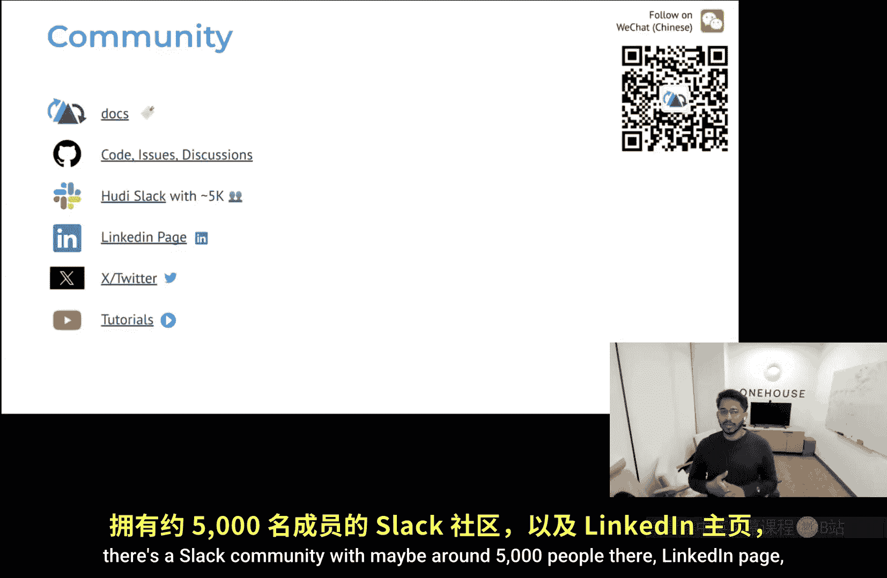

# 卡耐基梅隆【中英⚡未来数据系统研讨会系列｜Fall 2025, Future Data Systems Seminar Series】 p02 P2 Apache Hudi： A Database Layer Over Cloud Storage for Fast Mutations & Queries -BV17pidBkEzr_p2-

But just one for my peaces that pass， God blessedless they friends。

And check it out now I pound because it's mad brown。

YIt's time for Carnegie Mellon University's future data System seminar series This seminar is made possible by Google have he is the creator of Apache Hooty which I'll talk about today he's also the cofo founder one house commercial backing and and commercial Apache Ho we're super him to be with us today seminar series if way he's not for an being floor is yours co。

All right thanks so much for being here hello everyone I'm very excited to be here speaking to you all about the Apache Hori project like many of you I was a graro myself roughly 17 years ago though beauty Austin so yeah being you preparing for the talk putting the slides together over the weekend definitely reminded me of my own assignments and projects so thanks for taking me back to those golden days。

😊，All right， formally， my day job is running hopefully now a somewhat kind of like well recognized data startup one house in the data lakeout space。

 equally important to me is my OISis hat as BC chair for the hoodie Project。

 also a member of the Apache Xtable project that brings stable format interoperability。

And previously， I being part of database and analytics data platform teams at Uber comesfluent Lied then。

 fortunately during some hyperpros of these companies。

 which helped me learn a lot about the set of data distributed systems。All right。

 this talk is kind of eight years in the making starting with us open sourcing the hoodie project in you know early 2017 at Uber and hoody's the earliest data Lakehost tech and you know it introduced a lot of the database on the lake ideas and architecture and Hoie today powers some of the largest data Lake hostes in the world including。

 of course Uber， Amazon， Walmart， a good chunk of fortune00 companies that has given us also a lot of perspectives on real production challenges that people hit in the running these workloads。

 which I hope to share with you today。So the goals for today。

 we want to first cover how this Las architecture came to be and what are the motivations for doing something like this。

Then we want to cover the core design trade offs， well cover all the important problems being addressed in the space and leave you with some thoughts on what the future holds。

Our story takes us back to Uber in kind of like crazy crazy growth mode we're adding new features。

 a lot more users all led to more and more data we had you know my previous job was a LinkedIn like a company that is pretty well known for its data infrastructure back in the day end day as well we had built a traditional filebased data lake so if you're unfamiliinated with the data lake what this means is data lake is a very large collection of files stored on cloud storage like S3 or distributed phrases to make HDFS you then run jobs which are basically processes that read process write new files so you crunch files produce new files using distributed frameworks likepar or map produce so this is generally how how the thing runs。

And at Uber， we as you would imagine tripPS was like a very core data set， we wanted to ingest trips。

In near real time into our data lake and write them out as parque files。

 which is like a column file format widely adopted by the industry to do analytical queries for data science。

 analytics， machine learning， what have you？Right， and then。

You know our our kind of state of the art file based data lake ran into a lot of problems right so one was you know correctness issue simply because there is it's producing files so if there is a partial right or a duplication in the data anything like that we had no way to query these tables consistently right we could we could see some like phantom rights and things like that。

😊，To they're slow and fragile because as you can see。

 there was 120 terabytes via bulkesting every 8R you just kind of like knots。

 when the actual data changes only less than 500 GB， but like again in the lake you deal with files。

 you really don't have a good abstraction to kind of apply updates or things like that。

And the other thing is it's too expensive a whole thing because it's not the only thing that we do。

 we also process the data， for example， as simplest job would be trips are happening。

 you would want to and then let's say the trip records are in local currency or something and then we just want to join it with a standard currency conversion table and say okay how much revenue did we book right so even all those things crunch similar amount of data because it was all like full recomped every8 hours R and R of delay right and。

This wasn't like really scaling for us， right？And the reason was data lakes were pretty limited back then right at a high level there were some fledgling you know SQL data frame engines which are reading and writing crunching files。

 that's basically what we had。😊，You could you mostly dealt with upendund D files you write open you write files you write more files right and there is essentially course partitioning which is essentially splitting files into folders to kind of mimic I would say poor mans index if you will to kind of you know do things more efficiently there's no table or concurrency control you have to manage all these files yourself you know clean them like put the right ones in。

 get the wrong ones out， things like that and and as I mentioned you know you reprocess things over and over time which means writers are writing more the readers are scanning too much right？

By the time I worked on a relational database and a key value database at my previous jobs I'd come to appreciate kind of how databases simplify life right its specifically of interest was the storage manager functionality here in this talk we kind of talk about it interchangeably as the storage engine。

And if you look at it， it provides a much more efficient a higher level of abstraction to work with data right the code maintenance aspects were all standardized by you know database services right don you don't deal with all of them。

 you write and read data right at a record level abstraction right if it helps kind of internalize MysQL the DVM MS。

Supports different storage engines with different tradeoffs right for example。

 like you know D is a B3 and MyRs is like a rockx DB Lry。

 one optimize for reads another opt for writes， all of this is nicely packaged hidden under the SQL interface that you see on MySQL right。

But lets like we mentioned worked with files right not not records right so on the left if you look at it a simple job of transforming some data。

 there are some user events there are some user profiles and we're trying to do some aggregate stats right typically the way you did that was you scanned a bunch of files you really didn't know what changed so you scan heurically last seven days right in the hope that you know only last seven days files had like folders had any updates or anything like that then you join them you typically read the previous state of the table and you completely produce new sets of files and flip a pointer and the catalog or something to say this is now the new table right this is kind of like how the whole thing worked。

But record level operations are more than natural way right like backing right cells obviously right when youre in this kind of thing but rewriting full partitions is often not necessary and it's often a lot of wasted work right most of the times only a small part of the data has actually changed since you last like you know compute or target table right so。

😊，If we had record level operations we could process data more efficiently as you would see on the right。

 you would be able to query the records that changed， scan them。

 you know join them with another table and then just update or merge them directly onto a target table right this is a more natural more efficient way of dealing with this right and you can relate to probably how you build tables and a relation database right how you maintain your ETLs or something so but this is not how it worked right。

But data lakes are not entirely bad， they are the most scalable and the most cost effective way to handle large amount of data even today。

 right， say anything beyond like a 10 terabytes， you know。

 something like you should put on something like this。

Thatt power comes from a few things one vast inexpensive storage you can I say inference storage mean obviously it's not practically theoretically infinite but you get the point right you just like write data into S3 and you like they deal with it right and then it's great for it can hold some data and motion and also data address right it's your one big repository where you can keep dumping as much as you want。

The other really nice thing was you had a lot of these purpose built scale of distributed query engines right you have one for ETLs。

 you have one for data science workbenes， things like that。

 you have interactive query engines all of them kind of operate in a sort of like a headless mode on top of this data I say headless because you know typically ETL job is run on a schedule you take a spark hi job or something like that and every six hours every three hours it runs on a schedule right when it's not running it's relinquishing all the compute which makes the whole compute architecture efficient here right you can also have a longrun thing like for example many many many of them have a press or a trino or some interactive engine that is just hooked up to your storage that like analysts go on run your queries like your data warehouse query use case right so and you can also have data science workloads where it can be anytime right really。

And so on when the data scientists are working， they may spin up a cluster。

 do some analysis shut down the cluster， so this whole thing was very efficient the architecture because you had lots of storage。

 very cheap， very scalable combined with like multiple engines which you know come up and go right as on demand right so this was like a real good power for the architecture。

So。Taking us all the way back to our Uber team， what we asked ourselves was。

Can we you know what if data lakes can be more like databases。

 we can interact with it in a similar fashion without losing any of these benefits， right？

We thought this would be a new adventure， in fact a new model to actually retain all the strengths of the late data lake which is storage compute columnar files you know just having everything be stored on on the lake and actually introduce this sort of like storage engine functionality transaction indexes updates that automated table maintenance and CDC and all of that right so in effect we' are adding like a layer in between the query engines and storage in the previous diagram that Ps saw so this is how we concede hoodie the right way to look at hoodie is like a storage engine which is embedded into your SQL engine right and it has a table or a storage format designed to support this functionality。

And we retain the headless architecture of the data lake right these engines can still like come up and go this this makes some design changes very interesting as we'll see all later。

😊，And the engine also performs fully distributed read rights against cloud storage right so if you add so the thing that we considered back in the day was use a system like Ku for example which was like a storage system that came up back in the day which address some of these issues but the thing is if you add any storage in front of a cloud cloud storage that will invariably turn into a bottleneck you don't want anything between your scale out distributor compute and your scale out cloud storage so the third thing is again as I mentioned this is embedded into the engine so typically embedded engines are single process if you look at like for my previous robot LinkedIn we what with level D Rosd Berkeley embedded databases but those typically sit within the process here this is almost like embedded database which is distributed that you you put in。

an existing framework like let's say S right so our idea here is if you take an existing distributed framework Xpar you embed something like Huie that the combination makes this an embedded and just distributed database built purely on top of cloud storage right which is a very exciting thing for us to kind of start building and we believe that if we build this it'll kind of like raise the bar make us do more things on the lake that was the core core motivation for us。

😊，Right。😊，So with this， I think there are two major components to Huri。

 one is the storage engine that we talked about and the storage format， right？😊。

So in the next sections， we will cover the format and then go into how the engines implemented using that。

All right so just to dive into this， this slide kind of gives you a schematic of the hoodie storage layout right on the left lower left corner you have know a hood table sitting on top of cloud storage which now expands out into some directly storing data and some directory storing metadata right so the data directories are you know the table can be partitioned are not partition but partition is merely you think of it as a folder within the table that logically partitions for example the most common way to partition data and the lake is by date right you store event logs by the date in which the events are produced。

 things like that。Within each partition we have what are called file groups。

 so file group is effectively the core like a core abstraction or a concept inside hurryri where records belonging to that partition are in a map to a file group at any point in time right so it's essentially a distribution of records into different file groups。

And each file group then has you know like different versions of files so it basically contains a group of files that contain different version of a set of records so essentially there's a base file and then there's a set of log files the log files encode updates or deletes to the base file think of them as a change log specifically for that particular base file right and the base files can be parque or see you know our own as a stable based file format open file formats and log file again contains some you know some。

Mettaadata and the container is still an open format like parkque or Avro right so we also support Avro in the log files so that you can quickly write row based data and then you know ammarize the cost of writing columnar parque files which can be like 10 x more expensive than writing pro based data right so it's generally how the the storage layout works so there is in summary。

Tables are partitioning you know split into partitions optionally Partitions have file groups。

 file groups have a bunch of。you know kind of what we call file slices which represents a base file set of log files we'll talk about what slices are a little bit later and each of these records also are individually versioned every record for example is stamped with the with a commit that wrote the record right this helps us implement change capture and other things like that later on。

The metadata now is stored in a special folder under the base part the table。

 it contains transaction logs， what we call a timeline which is essentially an event log it records every change that you make to table state within that and then there is a file that contains table configxs。

 that is a metadata folder which contains all the table metadata and the indexes。

 and some folder to deal with some auxiliary things like write racking and stuff like that。

Actually this is a stupid question like Sue yeah I've always pronounced it as Hootie。

 but you've been saying hoodie and then now you look at your layout here and you have hoodie HOOD I。

e。 what is what is the entomology of this like why did you have the guys at the change when you made it Apache？

Yeah， so somebody complained over the name， so we had to change it because of。

The ticket' still in the in Github， I think but we are already live lots of people already used it。

 so it's kind of like it stuck around as one of these workss in the project and a fun story to tell people。

😊，Renaming them， that would take a like we had to take a downtime so when we donated it to Apache。

 somebody complained。Okay， awesome， thank you。Okay。

All right now so I touched upon this a little bit the base files in the log files right so the logs are basically a differential data structure added to reduce right cost so if you're updating stuff you know the simplest way to deal with it is what we call a copy and write table write come in you just like read the parquet table。

😊，Pque file sorry and then like change only the records that have changed and then write a new parquet file but this can be expensive as you can imagine right because columnar data is a lot more expensive so like we also support something called merge read where you kind of like queue up all these changes to log files associate them with a base file and then you accumulate enough changes and you know periodic background compaction then takes the log files applies the changes to the base file and produces amorase the cost of writing these expensive columnar parquet files so this is something that we call merge read know these are two table types that we have in hurry and there are like you tradeoffs here the copy on write has higher bright cost but and MO could be lower the data latency could be slower because writing parque is actually more expensive and you know if you write row based。

arrow changes into your MR tables， then the data rating you can be like pretty fast on a MR table。

And query speed can be really fast on the top end right tables。

 it's almost like scanning a parquet table， right pure columnar query performance。

And the query performance on the MRR table can be slower before compaction once the compaction runs you know makes new parkquet files it's just like querying any other par file right so these are a couple of levers that you know people have to you know trade off all these different changes。

And next we come to the timeline， the timeline is pretty central to good these operations。

 it's designed as a transactional like an event log like I mentioned so each。

Action essentially action is any change by a writer or a maintenance operation to the table state and each of these actions have like a state which can be either an action can be requested in flight or completed and they have like a requested time and a completion time along with it so if you look at the image on the right it basically talks about how you can think of actions as like intervals a long time where something starts it's in in flight it can fail multiple times while it's in flight and then it finally commits and actions changes don't take effect unless it it's completed and each state whenever it changes state it writes a new file under the metadata folder and the requested state often has like plans associated with it for example。

Planning a compact or request clustering we see as the plan for that operation within within that as well the timeline itself is implemented as an Ltry。

 which is a really know proven data structure for storing this cell like timebased logs and event data right and the history goes into this Lcenttry structure while what we call active actions which is either stuff that's in flight requested in flight that are not know completed recently all of them stay in active timeline and by own process will automatically move stuff from the active timeline to the history so this is designed so that we can support large amounts of history and also frequent rights to the table state change again given all of this is on cloud storage we need to do efficient management of this。

Rar as well to have very scalable tables。All right， so there's two questions in the chat。

 one is what it's more properly deployed， copy and write or original read。

I would say based on the Github issues searches， it's about 5050， copy andrite is used by。

 I would say like typical analytical tables， downstream things。

 a lot of people use MR for quickly landing data， streaming in just from CDC streaming pipelines。

 anything that requires some level of concurrent writing or faster you know rights。

 I think Ms keychis。And then another question is are actions。

 are actions basically DDL changes and then eternal things like compaction？Yes。

 the actions high level actions are。terInternal table shows like compact clustering， savepoint。

 restore， anything that can change the state of the table， and also the writers。

 right which includes all these different issues。Again， guys， Dave， if you want to ask a question。

 just unmute yourself， Joseph if you want to unmute yourself and ask it？

Yeah absolutely absolutelybsute， absolutely， I was just wondering what at Uba scale， what was。

 how slow was the compaction for hoodie。Maybe in terms of numbers， yeah。So for Uber。

It's hard to for me to recall like a compaction number。

 but the original architecture that we had when we pre hoodie。

 we ingested every eight hours with Hori， we were able to ingest every 20 minutes for compaction itself we didn't have a good baseline to say it was this law right because previously we didn't have compaction。

😊，But that made sense。Yeah， that。 Thank you。Having not one question。So the timeline is a log。

 I'm just curious， why does it require a less to。Built to have that log， and。

Yeah great question so if you look at this architecture like we discussed we we don't want to store store any of the metadata not just the data。

 just the metadata on anything except cloud storage right that way the whole table can be selfcont on the cloud storage so now going now this answer goes back to the limitation of cloud storage itself it does not like a lot of small files right so if if we for example keep writing table history as like you know one let's say one file or object per action it will become like quickly unreadable if you try to go access it just listing it or just even accessing that to take like lots and lots of minutes so what we do here is we take the the historical know actions and we kind of write them out as an Lcent based on parque parque because we can then。

😊，Kind of flexibly query it based on just the time or we want the actual metadata for an audit trail。

 so it gives us a lot of functionality and efficiency to query the history。So the L is for searching。

Not for efficient searching of the log。Efficient searching of the timeline history， yes。All right。

 cool， great questions。All right so next we come to you know metadata right a good amount of for example。

 the database functionality that the goodness comes from you know access methods are indexes and also built in built in metadata tracking by the database the database tracks what files are valid on disk and like does all of that bookkeeping for you right so so we need a similar mechanism here so hood stores all of its table metadata in an internal metadata table it's another MOR table that is stored you know alongside every hoodie table。

And it broadly contains two kinds of metadata， one is table format metadata。

 which is stuff that you need to identify table snapshots。

 you know like what files belong to what snapshots used by the query engines typically to plan the queries and then we also store indexes indexes are used by you know the query storage engine itself to speed up queries and write as we will see in you know future slides and these are kept up to date by any writers or tables。

 anything that changes the state of the table will make sure this table is always in sync with the they data。

Right， so putting all this together， so what data what is the data structure you're using for the secondary indexes？

We are using so it's another hood table so it has a base file and our log file。

 the base file format however， is a SS table based file format where we use to explicitly index the column stas and things like that。

Got it， okay， thanks。How do you make also how do you make the。

The metta atically updated along with the right， like it's different。

 it's different different file like。Someone will read an outdated or newer version than what was already written。

Yeah。So just to repeat the question， how do you keep the meator on the data table up to date so at a very high level we built a parent child relationship between the metator tables timeline and the data tables timeline so nothing in the metator table is committed until it's committed in the data table right so that gives us like a good way to you know write to the data table metator table as well as keep everything consistent and not。

All right so just to wrap this up on a very high level hear us out the read and write parts work when you write you add records you to a file group or a file slice。

 the latest file slice either you create a new file slice by adding a new parque file if you're a copy and writeite or you write a new log file into an the latest file slice if you're using Mo read and then you again you commit to the timeline and keep the metta table up to date on the reading side you first the query engines up read the metada from the timeline。

 the metta table figure out what are the right snapshots on the thing you the column statistics or things like that to prune and plan the query。

 then you just go read the actual file slices that you need to read to answer your question so if you are for example。

 a time trial query you need to read like a previous file slice if you have the snapshot query which you want the latest snapshot then you read the latest file slice。

It is a level how these rates work。Okay， now that we understand the layout right time to solve some hard problems and a lot of these questions are great because some of them touch on this kind of storage in functionality that we will cover in the next slides。

😊，O。First and foremost the layout here is very challenging right for any database as you can see you can do a different tradeoff on the right and read and you can have a table format that's generally what I think can be done and our a storage format for that matter so this is particularly challenging because it kind of touches both traditional OLTp and OAP we want the system to be optimized for analytical scans which means the data can be sorted you know it can be in many different ways the organization has to be purely be driven by the queries right while at the same time we need efficient record level operations like OLTP like I say like because it's not a OLTP system but it should be fast enough to absorb any updates to an upstream OLDP system right if I need to keep up with a2 million records per second updates from an upstream cassandra table and replicate this scalably into the right so that's a goal so a good reference that we use for this。

The Ram conjecture， which I believe was covered on the course actually many years ago， if I'm wrong。

 maybe I'm wrong and so this seminar is not part of the course， it is just general Davis stuff。

 but like we cover this in the advanced class yes。😊，Yes。

 okay cool so it basically states that when you design an access method you know like for read update and modify these three tradeoffs if you optimize for two。

 it's not possible to do that without adding a cost to the third right so so so if you can see some of the choices here right so if you look at the triangle something like file snapshots so I apologize if that's not very legible something like file snapshots that represents things like iceberg or Dlta lake they're tracking files and like files make snapshots right even with their recent MO variants they make it like more update optimized right and newer formats that are Lsmtry based optimize purely for write speed because an Lsm3 is great for likeend append rights are like random updates even right but in in my opinion that's not the right tradeoff to make here on the lake because it's very read heavy system lots of analytical queries scanning a lot of data。

😊，So what we ended up doing was we decided to take additional cost on the storage piece right there's no memory component here it's all stateless but you know we decide to use more storage space to build indexes right to make sure that the rights now can you can have keybased indexes so if you want to update something you look up the index。

 the index takes storage space but you are able to quickly go update the file group that actually contains the record。

And on the read side this completely now decouples however we you know do the we can sort the table whichever way right where unlike an e entrytry for example。

 where you need to kind of start it by the record key right for it to kind of at least work efficiently so you can start it whichever way so it's also like you know read optimizeimd right and then there are also benefits for the file group right theres grouping of records helps us cut down redampplification for the merge because as in the picture without this kind of grouping。

😊，You know you end up you know merging all the for example the iceberg B2 delete files you end up merging all of them with every base file here you only merge changes that are relevant to the base file with every scan so it kind of bounces it keeps the compaction tasks bounded in size and then you know it also the very important thing here is it preserves the data insert order which is very important in lake right lot of data array based on time and then actually preserving that kind of insert order by default makes a ton of sense because for example you will build a dashboard based on time and you want it to work pretty well and the locality is kind of important for these queries right。

Second problem is the real light table can be like really big right we at least have some 10 documented exabyte scale deployments for hoodie and scaling this table metadata is a core core challenge for us because of that。

😊，And and the reason is the following right like listing millions of files is slow and expensive a rename on a cloud storage is a nonatomic copy so you can't do things like like rename。

And you need to have the readers efficiently skip column startss during query execution This is compounded by the fact that you can have white columns you can have like you know large tables wide columns and lots of table versions as well so if you compound all that you quickly end up with a state where your metadata can be like really big this is a great paper where it talks about similar challenges for BigQuery right and ultimately what we realized was we need to deploy different kind of rowb file format typically used in you know like databases online like no SQL stores to indexes metadata a little bit better right so in short what we do for this is we store the core table metadata which is files and column statistics indexed by you know storage partition for the files and the column statistics we kind of organize it so that you have columns right you there are。

And clustered by columns so if let's say you have a white table and your query only involves 10 columns。

 then you only look up those 10 columns of 10 files things like that instead of you know reading like a single flat file with entire column stats for all the columns so this and this is augmented with a smart metadata caching inside the storage engine we you employ memory RosDb signal like bunch of different cache backends within like for example。

 like a spark cluster along with 30 to or know any of these engines like it can all help to improve the metadata access。

Time so we talked about a timeline so times can of important so time is generated the start and completion of every action here like we discussed before and time the way time is used is used to order operations on the timeline so writer for example a writer with an earliest completion time completion time probably should say procedure writer with a greater completion time right and a compact for example with a request time which is kind of higher than a like a completion time of right kind of followed that right so these things are important for us to make sure we schedule the compact to cover the right set of files right so we don't miss any log files for example during compact。

So the approach that we take here is kind of adapt based on Spanish through time of course we are not in the business of OLTP databases which makes this problem like lot easier so essentially this chart if you look at it it maps real time was just through time right the basic problem here is there can be clockQ and difference in local clocks across different processes but again since we are not OLTP we can the default implementation we can wait long enough for a reasonable amount of time to iron order these issues and we use a distributed lock to kind of like generate time weight and then let the SU pass and that you helps us generate monotonically increasing times obviously it can also be implemented differently with a global time generation service and whatnot but yeah this practically works for many。

 many large deployments。Now things get interesting。

 we want two writers to update the table safely right so specifically we want something like something that works for data lake workloads though so if if you just you know want to characterize the data lake or the lakehouse transactions they are nothing like old D transactions right so the realtime rights in lakehouse is like a minute or a few seconds right which is all like for example when there was an oracle like something ran for a few minutes that was a long-run transactions so all you have is like basically batched longrun transactions right so we need and even even if say we designed a system to support you know single record updates low latency。

 single record updates again cloud storage cannot support this it'll have a lot of small files and objects andque the query performance anyway so I think what we need to optimize for is this architecture in Lakehouse。

We have I throughput batch transactions right and but the key requirements here is us we need to be able to constantly maintain the tables using table services。

 same principle same motivation if you do not compact and you know keep or remove like expired data using cleaning then your you know your table performance can generally degrade right so you need to be like maintaining the table constantly。

😊，And the key thing in this architecture is we don't have any longrunning storage service right so on data lake scale record scale is generally 10 to 100 x more than a warehouse or like other systems so we cannot do things like pessimistic role level locks that can probably give you high lot of concurrency those techniques are not feasible here so we need to so we solve it in this use case using optimistic concurrency control which is course grained at the file level right so this is what hood implements。

😊，And。You know the basic way it works is there's a distributed lock so writers write they stage the data basically and then take a lock and then validate the state before committing and they do conflict detection on overlapping files and do like you know version checks and things like that so you essentially one of them about if they detect a conflict right that's generally how it works。

😊，But OCC barely works when there is even a small amount of conflicts and where it becomes very problematic is given the nature of these jobs。

 these are jobs that are running on thousands of course for ours and computing something and finally it output something if they keep failing or if if one writer stars or keeps failing it can cost like massive wastage and kind of hardburn at scale because you run like for example like a big bad spa job and then it finally was didn't commit so that's not a good outcome so we added a yearly conflict detectionduction mechanism to go alongside where as the right happens it keeps checking whether it would based on like outof- band auxiliary like marker files and other mechanisms on whether it's going to eventually aboard if it's going to eventually aboard it' basically the driver kills itself。

😊，At least like you know relinquishs the cluster time， you know， it's an optimization。

 it's obviously not guaranteed to catch the cash you know everything right， avoid the whole thing。

So this is actually our next problem to solve because this issue of I want to write and keep maintaining right is a very common thing right for CDC pipelines for example you know you need to constantly you know listen to a CDC stream of and then keep applying the changes as you apply you are generating kind of new files you need to either do some compassion or some table maintenance to keep the table in shape right and if your table maintenance keeps kind of you know failing and starving from the writer you can experience very bad query performance right so this is what is basically depicted here where if you have a shorter writer it can actually star the table maintenance always right so you'll try to come you know it'll start it'll run for some time try to commit it'll fail by the time you rewrite again but there's probably like you're actively writing to the table。

😊，It fails again。So we have special handling for this particular use case。

 we do something I think novel here and what we do is we actually distinguish between scheduling of the compaction and actually executing the actual compaction right and so。

😊，So you have a motionary motionary table， the write and write a bunch of， you know。

 log filess to an existing。Existing base files like four file groups there what we do is we schedule a compaction right we take a distributor log we pass the world for the duration of actually planning out the compaction we serial as the compaction plan to the to the requested state in the timeline this is where the timeline comes in like very handy because it helps us notify all other writers that hey a compaction like this is。

Is going to happen and all the writers and readers are just their view of the table based on that so the compaction。

 we assume that the compaction will eventually succeed right it can fail many times and it can eventually succeed but until then the writers can add more logs and everything to the newer file slice and life goes on so if this is a very very key thing that hoody does which makes it a good fit for CDC streaming workloads if you're ever curious that you you know in your chat G or anything if you don't punch various why is hoody different or anything if it tells you hoody is good for CDC and streaming workflows is why but the approach that we take here is pretty general purpose right this this also helps for for example two large batch jobs kind of writing to the same thing like a compact the removing deletes applying deletes。

😊，You're adding new data to the table so yeah this is like super handy it solves a really big class of a very common concurrency problem for us。

The other thing we've emphasized many， many times is read and query performances speaking on the right we have LaA reads but it's not that EC Doci Cloud storage has very high latency。

 low iOs by that if you think of this as a disk by that what I really mean is if you like do too many calls it throttle you right essentially cloud storage is simply a HtP service that you talk to using I don't know why but still HDP1。

1 right and then。You need to avoid small files so if you have a lot of small files。

 the amount of get calls that you make will go through the roof so a lot of bad things will happen so file sizing layout management is super critical to control our cast on the lake。

Pty basically does a few things here， the storage engine functionality right operations ensure target file sizes so it it does a binpacking algorithm where it tries to figure out okay for this right it profiles the workload and figures out how to pack the data so that it can meet that target file size and there is background clustering and you know reordering that you can do to re sort the table you can use theordering or you linear sorting Hilbert curve things like that and yeah we maintain file groups as the unit for concurrency control and compaction throughout all these different operations。

Right。So so far we saw how we scale metada like how we basically covered a lot of the table abstracts right remember our goals start of the talk we said we want the lake to behave more like a database so if we are to achieve that we need to fundamentally make the record level operations for reads and write way more performant because that's kind of like what makes the database not even performance it's easier to deal with you can write stuff you know work with records and not worry too much about files right and。

😊，There are two classes of problems to be solved here for rightss if you have updates and deletes。

 let's say to less than one% of records in a petabytes of data how they do that efficiently right so summarized some very common needs you've seen over the years these are real OS users with kind of real workload shapes that we've seen you know Amazon package delivery status financial transactions changing and how you update a few transactions changing in large table delete a few user events amongst hundreds of millions of users right so for all these merge operations or delete operations if you scan the entire table it can be prohibitively expensive。

On the queries there are needle in a haystack type queries you want to like a Uber you wanted to look up one Uber trip right what happened on that own Uber trip or you know for for something like like a retailer who would want to look at status of all orders for a given customer right something like that so these require a separate system right。

So hoodie's approach here we have like about half a dozen right side indexes so we implemented you know these indexes based on actual right patterns that we've seen so we broadly characterize the rights into three patterns one is random updates to dimension tables like any record can get updated at any point so the right amplification here is like super high even a single record changing in every file will like kind of have to you have to re the table ultimately at some point right so here you can simply do giants against the whole table if the dimension table is small enough we also support a record index which is essentially a hash bucketed index with backed by the same as table file format that I mentioned。

And it consists like a bucket index and a consistent hash index， you can use hashing。

 obviously this messes with the layout of the table。

 but there are options for the writers to pick here。😊。

The second is we seen skewed updates to large fact tables like where a few recently updated partitions。

 you know your shopping cart history， things like that where there's a large amount。

 the table is actually much bigger but there's a pattern just like some sort of like a zipy and pattern to how the updates trickle across time so here I think reable indexes again helpful we also seen a lot of users use broom filter indexes because they quickly weed out all these for example the yellow partitions all the white tones will quickly weed out all of them so you end up like processing whale as data than what you then scanning the whole whole table for example right。

And deletes against large event tables are actually very challenging right so the issue here is the data scale is so high that even if you have like a record level index across the table it's going to be very it's la La index right even at that point so we build something called we also have partition level indexes so the the most of these event tables if you look at them a lot of them kind of。

😊，You know move this like a window of time right so the data is valid for some time and then it goes into rest so the partal index actually like follows that pattern so you maintain the indexes of the partition level or the folder level basically not at the table level that way you keep up with the right volume you're not your index where maintenance problems don't become like you know O of table size they become O of the amount of data that is written which is helps use kind of scale the rights linearly over time。

In terms of like data ving， not table ving。On the reader side we also provide you know this is something that we implemented for Spk when probably rolling out other engines over time you can create like secondary indexes on a columns in the table you can create indexes on expressions of columns as well and then we build these indexes and you can see mean it's kind of obvious that with an index something like a TPC any query that can use an index would see you know much greater data skipping and much lower latency so yeah so we support essentially database like indexes on both reader and writer that's the takeaway。

All right， the lake has column reads， but what about rights right so this is actually one of the least optimized areas even in data warehouses。

And but today we all want data faster you know data needs to be integrated continuously over time lower processing time so you know we need we need to embrace updates right the whole lakehouse the category and the popularity of the whole category is also based on for example a need for updating data which is previously mutable right so merge operations are very common in ETL pipelines to accomplish things like that right and oftentimes they actually end up only changing a few column values in record right but most of the current implementations if you look at it they work in the following way you have a merge interstatement and then once you figure out the new values to write you are in some way like reading all columns for all the updated or touch records and then you end up writing new files with deletion vectors for all the you marking in the old files。

These values are deleted and then that file for in this case file 8910 contain full images of all the updatedd rows right while file 147 also contain the full images of the updatedd rows which are now deleted right so this can be like pretty you know cumbersome when you have again white tables or even just tables where only a few columns are changing right very large table otherwise you have to end up rewriting a lot of a lot of data right over time。

So Huri also does columnar rights meaning like we just encode the change columns and given the file group abstraction that we already have。

 we do it right next to the base file exploiting， we can exploit the column niche of the base file and also these processinging engines which can you know kind of read them as arrow vectors in a columnar fashion and merge them so we do that and implement a very efficient know merge actually so you can see this is kind of like a win win across the board because the log file points to hey here are the columns that are being changed and we know the rows that are being changed with with the vector already so we write update vector not just a delete vector。

This way when we do a scan for the file slice， we are able to actually figure out what we need exactly what column values to suppress and whatnot across different different columns right and it gives it actually improves update latency because we are writing fewer bytes we are not writing all columns we are only writing the change columns that the total amount of data stored goes down because we are only against order the change columns and the query latency also goes down because we are fundamentally reading fewer bytes right so just like a win across the board。

😊，And this actually is a foundation for us to support white tables and unstructured data that I will cover a。

Finally the last frontier for us is the data processing world has significantly changed right in the last decade I had front row seats into the rise of Tafka and stream processing at LinkedIn you know and then even tuned our JVM clusters for Kafka at LinkedIn and have done enough Kafka for one lifetime I would say so stream processing obviously offers different way of processing data right so it kind of like deals with data as a stream and there are new problems that come with it you need to handle data can be out of order from the sources and you know we need processing not just based on arrival time but based on even time or like some kind of business field within the data and a lot of cases that can be dedoops copies of streams know all these kinds of issues you need a deterministic dedoping mechanism all of that right。

If you want low latency and high so there's like a lot of desire to get these on the lake right without having to copy all your data into Kafka。

 this is the great divide right now the world split into streaming and bat systems and streaming as you put it in log is your storage Kafka and Kafka like storage systems are on the other side you have batch systems which are essentially lakes and warehouses right so if what we wanted to do from the get go going back to that incremental use case that I talked about right we wanted to actually cut down we wanted the pipelines to run in a more natural way right all of that processing is nothing but so we already made a lot of progress towards right so for low latency and high efficiency or this kind of workload this kind of processing blocking should be as little as possible so hood does to three things here。

Specifically to bring more incremental or streaming style processing on the lake so of course we already made the right faster using indexes and stuff which helps it's like how stream processing state store behaves for fast kind of mutations and merges so that's a start already but we go beyond that what we do is we implement first class support for event time so so the base on the log files that I talked about before we can configure an event time feed for the table and then we can actually merge these records based on the event time are not based on the commit time or the actual arrival down of the system right so it's very very helpful for things like out of order data maybe they have a table that is being fed by two database change logs and there's duplication you see older state of the table again like all those things right it's super super helpful for avoiding things like that the example here shows how an order system and a payment system are sending。

Emitting events for the same order and obviously these microservice can be up or down have bugs anything really and then emit events out of order right but you still want to consistently deterministally merge them based on an event time and not the standard right。

Second， like a database who providesdes CDC streams， they are encoded。

 so CDC blocks and logs are encoded right next to the base file in the log files themselves。

 right CDC queries follow more sales explanatory， it provides kind before after record images along with the operations that cost the changes for insert updates and deletes within that time window。

We also provide something called an incremental query which only provides the latest state of the record right it does not provide all changes let's say you updated the record 10 times between T and T2 it will still give you one value right the latest value latest committed value within the time and of this again is very useful because as we this saw before as a system we are constantly compacting the thing right so let's say we are writing to the table every 10 minutes committing every 10 minutes compacting every 10 minutes but you are querying every R now you want to actually amorize all the work that the compactor has already done for you and if you just want the latest state of the table to sync you can you can use the incremental query a few other systems also support this for the same kind efficiency。

So previously we talked about limitations of OCC right and how non blocking is implemented。

 but we left that at the two writers are still blocking each other and that's not good if you want to have some kind of streaming semantics。

 right？😊，Stream processinging if you look at it typically two producers just serialize these rights into a log and avoid their concurrency and get some kind of deterministic order that is how they solve actually end up solving it queryier apps for the lake we move the log to the file group basically right and then we implement non-walking concurrency control where the writers don't block on each other even when updating the same record of the columns the records are they is right and then the records are most deterministically either based on commit time or even time based on the semantics that you want。

😊，And the compaction also can be performed async and non blocking like before outside。

 so this is like brand new functionality that we introduced like earlier this year as of now hood is the only system that can support。

 for example， two fling streaming jobs right into the same table without one killing like theyre constantly killing each other rights。

 otherwise right。😊，All right quickly wrapping up there's definitely a lot going on this slide but i'll keep it very quick this is generally the like a hoodie what a hood deployment looks like people use a lot of tools that we already have to ingest data sources from databases pointservice even streams what have you using Spar or Flink they produce a series of tables and then we Huri is also has a lot of support for these you know different catalogs it basically is designed as an external storage system that can sync your tables to multiple catalogs because as we know catalogs are deeply coupled with different query engines right so we want to be able to support querying from all different open source and commercial query engines。

😊，And all popular engines and clouds warehouses except one can directly query hood tables and for that one。

 we also support a Xtable sync where we can expose hood tables as iceberg or Delta lake tables that can be read by engines that don't naturallyly support Hoie res so a popular deployment for people as they use something like Hu to get all of this is open source whatever I talked about right now so they can actually say a ton of money on the infrastructure by building a open data lakeos on top of Ho keeps it kind of like loosely coupled from any one engine and then you can expose your data through different different engines right that's generally what we see。

😊，I'm pretty sure you're all curious about this given the last speaker and the series itself so I thought like I'll leave you all with a mental model of how to think about this。

 the space can be quite confusing because this lots of interest in the space and also this model kind of collapses and split layers very differently right so if you actually zoom back and think about it。

 there is a clear differentiation between the storage engine functionality which is software we write open source software to implement performance updates delete streamwriter all of the stuff that we just discussed。

😊，From the table format which is a specification for okay what a standard table representation should look like on top of cloud storage right so if you look at stuff like iceberg it focuses a lot more on like it's distinct more from the format and up right it's essentially like a okay lowest come in on nature of what different engine support and it's evolved by adapting newer features from things like other formats as we discussed in the last talk。

😊，Purri is designed first and foremost as a storage engine with a format that is designed for the storage engine right so that is kind of like how Huri's design evolves。

And Dlta is kind of similar to Hoy I think more in that regard a lot more with some technical differences right so we've been also doing a lot of work in the Apache Xtable project to bring these together the great thing about this is unlike commercial warehouses with closed their own file formats and things since the base file format here are mostly open file formats un sharedd it's actually pretty easy to make you know the like you know crosstable format reading at least work like really well right and。

😊，And with that I think there's a final note on ton of cool innovation happening in the project with the columnar writing and other things we already sewn the seeds for you know white tables and unstructured data so we are like you know there's a lot of focus on bringing unstructured data to the lake house as well if you Google Lake versus as warehouse you probably say something like lake is good as unstructured warehouse is good as structured but the lake was completely is about structured data right so so we're trying to we've solved a lot of these hard problems for that and I think a lot of them are applicable for unstructured data as well。

So we are also working on pluggable table formats， a lot of the storage engine functionality that we built can actually work on other table formats like iceberg or LSM or introduced like LSM data layouts if people want LSM。

 so we are working on like making that layer more pluggable deeper secondary indexes that is like you know we built through this probably 10 more that we can build right and some cost space selection among indexes right now it's not a problem because we have two but if you are 10 then we need to solve this problem。

😊，We're also thinking about caching， that's a core part of what we don't have and from from the picture that I showed you before。

 this thing is somehow like caching's been tied to the engine very tightly。

 so we're trying to kind of think through how to decouple that in a way that it can work across multiple engines。

😊，Non-blocking concur control not just for compaction but for clustering as well and the other open problem is the index construction how do we make it for Flink streaming rights right now Flink does the support for example record level index and things like that there is an inherent hard problem there where the Flink model is like very you know like Flink decides what a commit is right now but we don't want to commit until the index and the data are in sync so there's some hard problems to be solved on that front SpPAR gives you a nice synchronization point on the driver because of the microbsh model but Flink is pure streaming right so there is there's a lot of work to be done around that right。

If any of this is interesting and if you know like， you know， can I engage with us。

 here is where you can go， you know， there's a site for the docs。

 Giub is where everything else is there's a slack community with。😊，Maybe around 5。

000 people there like LinkedIn page， like this is where you find us。

I hope this was useful and thank you so much for having me here。

All right sorry applaud else this is actually a fantastic talk you covered all the important stuff I appreciate it we have time for one question we' a little over time one question for Vinot before we call it a day。

😊，You hear a questionute yourself， otherwise I will take the time。Okay。

 so when he talked about the true time piece。I think basically what you're saying is。

Since it's decentralized， all of the whatever different query engines that are talking through the hoodie API or the library then start modifying files in the lakehouse for lake storage each of these scors are basically coming with their own like timestamp is that correct but then it sounds like it have a hosted service you could then call out to us time service like whatever the Amazon one is or Google's own right yes。

In practice， though， how if you're not using a centralized time service。

 how how challenging is it to get people to make sure like。

The various systems in the same organization are at least running the same they're running NTP or something like that。

Yeah great question so practically we measured this before at LinkedIn because Walemmart which was a system that we worked before use vector clocks and had timestamps as well so the NTP in like data centers are actually you know like 0。

1 millisecond it's less than 0。1 millisecond the drift between them and even right now if you look at AWs lots of these data like cloud providers use synchronize clocks like know like GPS clocks to atomic clocks to actually synchronize their time so it's mostly in sync。

😊，On top of this what we do is we can can we are not a OTP。

 we can afford to add a 5 and millisecond weight or like a few hundred millisecond weight like and itll practically eliminates the problem altogether。

 but if you're really paranoid you can create a file on S3 and use the files creation time as the timestamp and they will give you like you know theoretically completely or like you timest。

😊。

