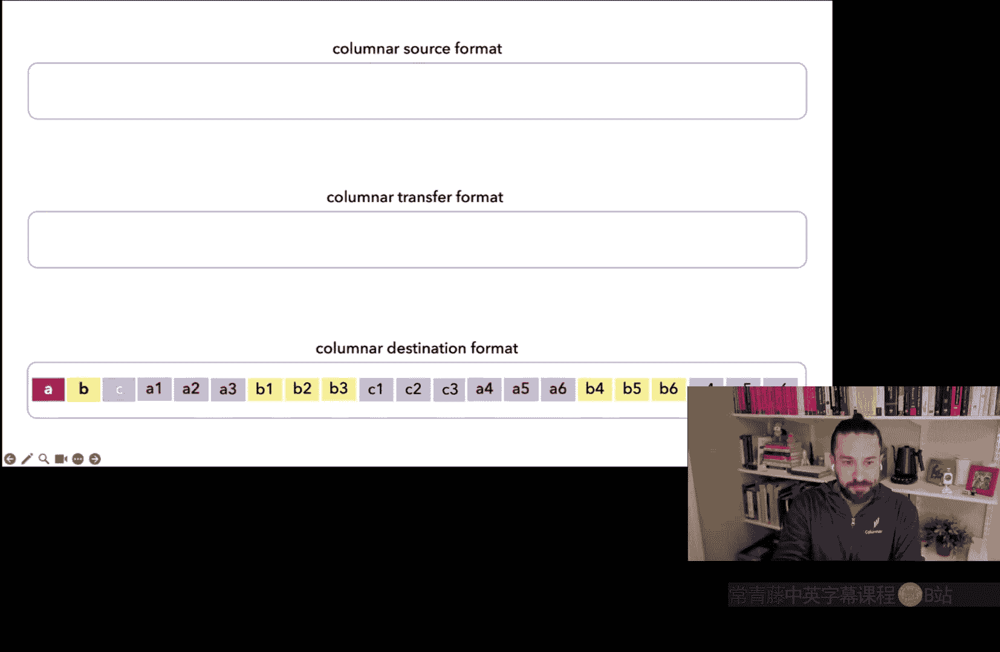
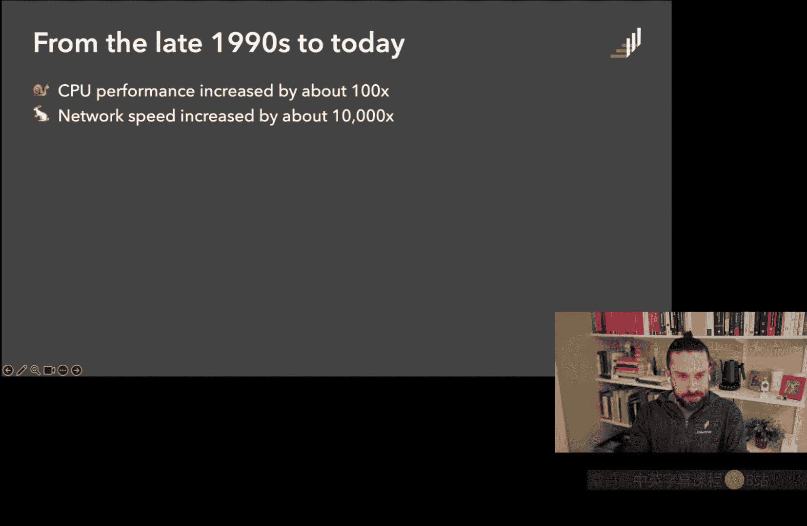
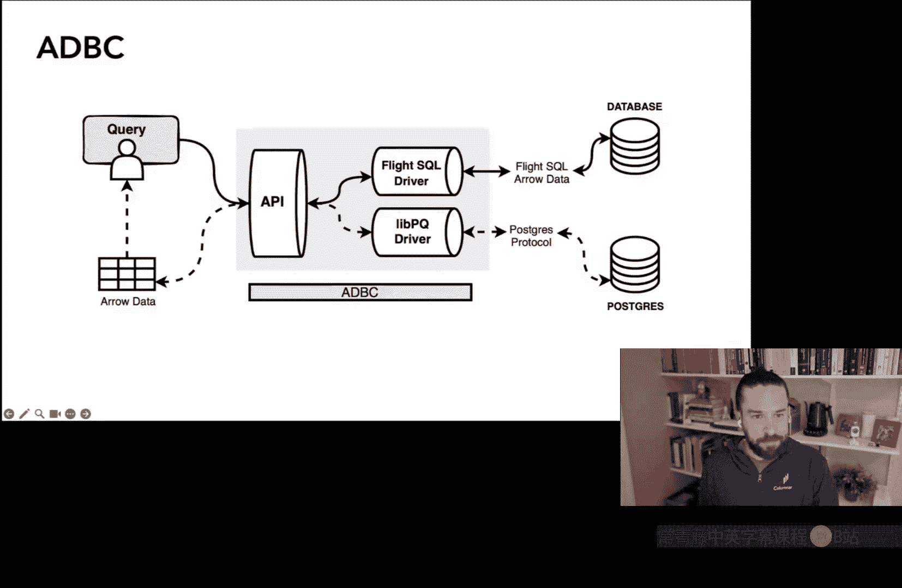
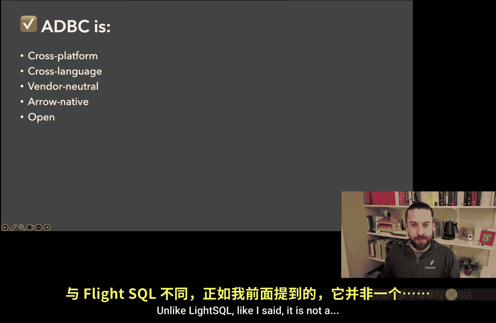
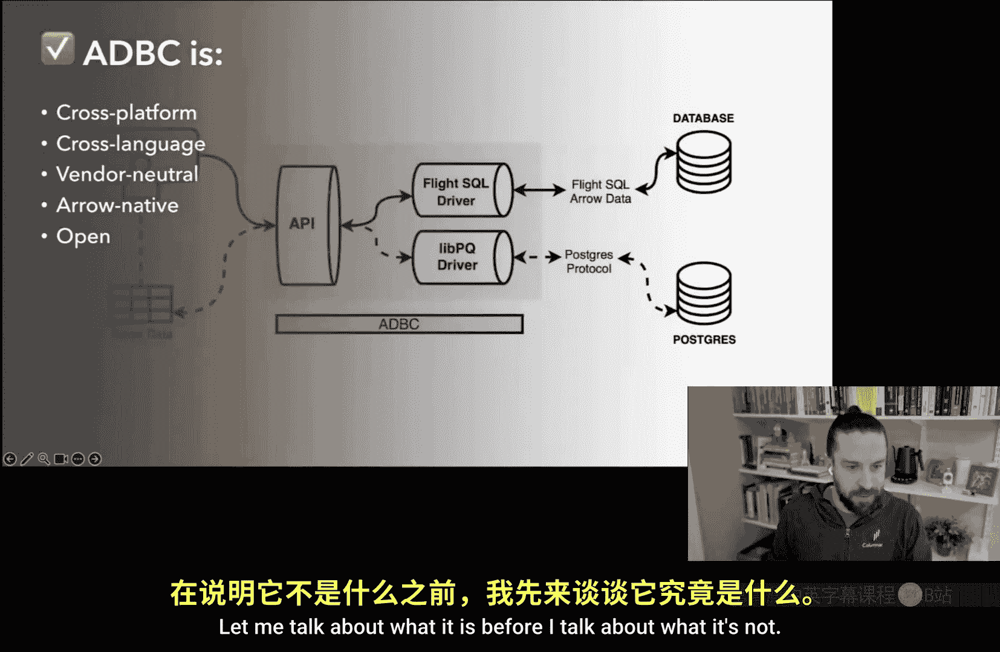
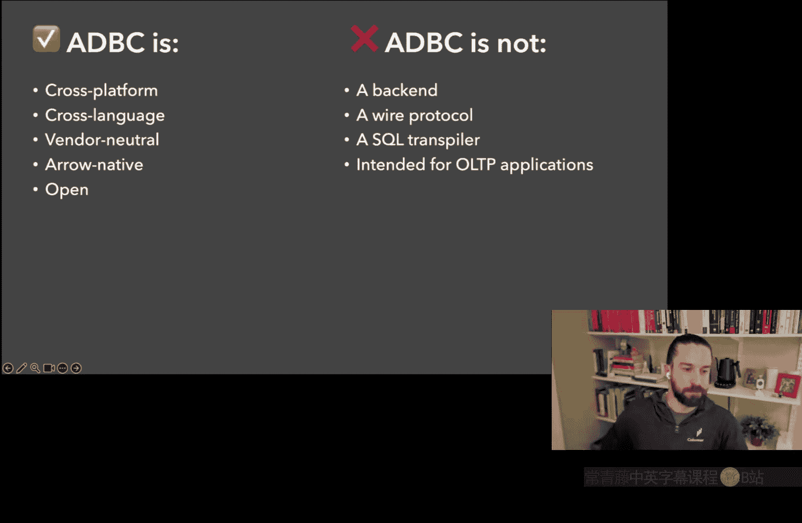
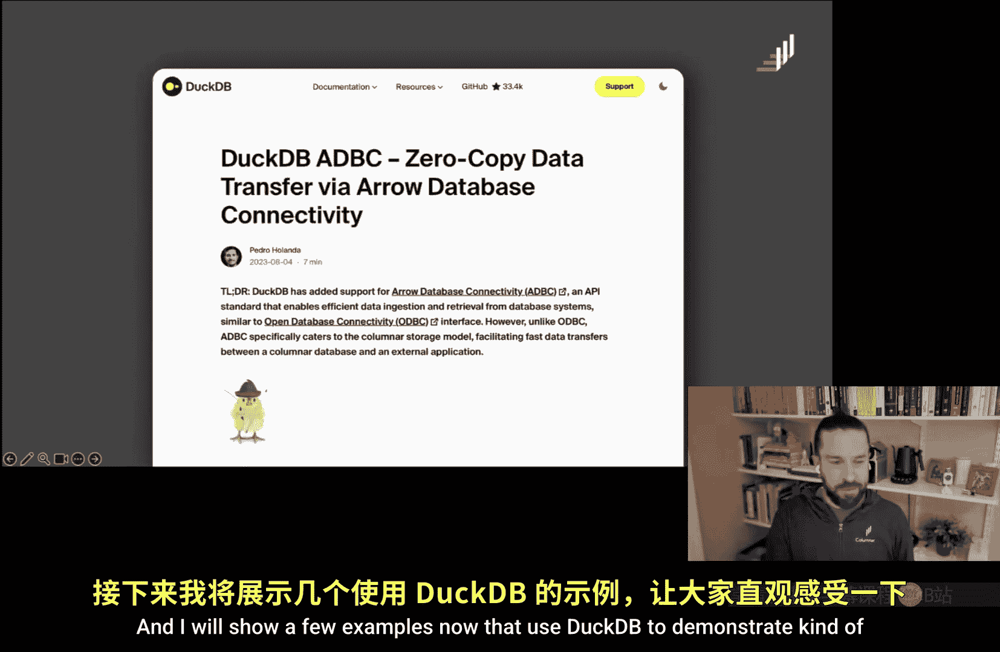

# 卡耐基梅隆【中英⚡未来数据系统研讨会系列｜Fall 2025, Future Data Systems Seminar Series】 p05 P5 Where We’re Going, We Don’t Need Rows： Columnar Data Connectivity with Apache -BV17pidBkEzr_p5-

But just want for my peace that pass God bless a friends。

It's time for Carnegie Mellon University's future System series This made possible by that was not4 slip I promise you。

 he's the cofounder and CEO of Collumar， he is X Ua Labs which is the original company backing Apache E and he's X Voltron and since then he's taken all his selfea's learned about Apache Erow and working with Apache Eero F and everything that's talk today and they have a new company called Collumar。

They have money。 He'll talk about it later， but not now。 And so Ian。

 thank you so much for being here。 anybody， if you have a question for Ian。

 either post in the chat or better off unmute yourself and just interrupt it at any time。

 And that way， Ian's not talking to himself for an hour on Zoom。 Ian。

 thank you so much for being here。 the floor is yours。 Go for it。😊。

Thanks Eddie really appreciate the invite and yeah please feel free to jump in ask questions interrupt me as I am going so I'm going to talk today about ADBC which is a part of the broader Apache Ar project。

😊，So the agenda for this session， I'll start off with a little introduction。

 then we're going to jump back in time in keeping with the theme of this whole series we're going to go back to 2015 then back to the 90s and then back to today。

 then I'll talk a little bit about ADBC kind of wide exist problem it solved and how it solves that problem at the end we'll travel forward in time to talk about the broader vision of what we hope to solve in the future with ADBC and then we'll have time for some questions at the end。

So a little about me， Andy mentioned I am a CEO and cofounder of Calner previously at Voltron data before that I was at Cloududdera also during the Hadoop Hay Day。

 I went to school for Sta， dropped out before the PhD and I'm also an Apache Ar PC member。😊。

And so I want to talk a little bit about hold on one second slide glitch okay。😊。

I actually before I learned SQL and databases， I know this is like a database crowd but before I learned SQL and databases databases I was an R guy。

 this is what happens if you go to grad school for statistics and so I knew data frames and really I only learned SQL when I got my first job in industry after grad school but in grad school I fell in love with R later with the tidiverse and this actually had a lot to do with why I ended up working on Ar so I want to jump back to 2015 and describe kind of the origins ofarrow which have a lot to do with the intersection of data frames and SQL so I joined Cladera in 2015 and this was like a super interesting time for Cladera and some of these other companies working on Hadoop because they had all of this big data infrastructure that all ran in the JVM so this was engines like hiive imp Paula Kudu Spark later and。

😊，What was happening in the meantime was that Python and R were becoming massively popular for data science data analytics。

 but for far too long the Hadoop companies kind of treated Python and R users as secondclass C so in 2015 there was like a lot of oh if you can't do it with SQL you need to learn like Java or Scala so when I joined Cladera。

 one of my jobs was to build a bridge between R and the Hadoop SQL engines at the time primarily like hive and Iala and this。

 if you're familiar with R there's a nice data frame library in R called D plier which defines kind of a domain specific language for working with data frames dataframe API it's in memory by default。

 but there's a package DB pli which takes the DPlier API and piles it to SQL and runs it in a database so I wore a bunch of hats at Clouddera but one of the things I was doing was building in Paula backend for D。

Player and at Cladera， I met Wes McKinney， who was also there after they had acquired his startup data pad and Claderra at Claderra West was tackling exactly the same problem I was but with Python instead of R so Wess you had created pandas earlier and pandas obviously went on to become wildly popular but Wes famously kind of grew to hate some things about pandas he wrote a blog post about this and in 2015 at Claderra he was like rectifying some of the things that he wished he had done better in pandas part of the way he did this was by creating Ibis。

A SQL runs on your database or your query engine of choice is analogous to what DB plier does in R。

 but as it turns out， compiling data frame API code into different dialects of SQL like Ibis and DBPer do only solves part of the problem of bridging you know R and Python with SQL engines。

 the other part of the problem is quickly and efficiently getting results out of the SQL engine into a data frame in memory and Python or R this in some ways is a trickier problem and in 2015 like the only real standardized way of doing this was using something like ODBC or JBC so in R most of what was built at time in DBPer was built on an underlying package called DB in R which most of the time called ODBC drivers under the hood likewise with Ibis a lot of the databases that you could connect to。

Exposed Python Db API you know connectors which many of them used ODBC under the there was a little bit of work on some newer things like thrift at the time。

 but there was like a fundamental problem here and we I think West realized very early that there was no shortcut around the inefficiency of these these underlying standards and required a lot of lowlel work and coordination with vendors and other projects to solve this problem so this was this was when West Ga together a group of open source developers including Jacques Naau who co-founded Drmio around that time and launched the arrow project to solve this and some related problems so Ar in the early days provided little more than a binary format and a very low level toolkit that enabled interchange like between modules written in different languages usually in the same process but it emerged at this kind of pretty。

Moment when a lot of developers at the Hadoop companies and elsewhere were all struggling with this lowlevel data interoperability problem as Python and R and other languages like you know wanted to access all this tooling that was written in the JVM so Ar became a smash hit very quickly and then over the year got implemented in almost every major language today it's used inside virtually every data stack。

 the Python library for Ar alone is on track to be downloaded something like two and a half billion times this year but you know what happened also is that as Ar became a fixture in lowleve data infrastructure it gradually climbed upward and solved like progressively higher level problems and at higher abstraction levels so although Ar is almost 10 years old。

 it was only fairly recently that it became a fixture in things like data connectivity and queer result transfer as we typically under。

standand them but what you know the core design choices made a decade ago by West and the rest of that crew turned out like by foresight not by accident to be great for this use case too I wrote a blog post with my two columnar co-fs Matt and David early this year about this I'll hit on some of the points from this blog post in this talk。

 but if you're interested in like more detailed look at what exactly makes arrow so good for query result transfer check out this blog post but one of the questions that immediately comes up is like so arrow is great for transfer and query results but compared to what？

So I want to start here by looking at the incumbents。

 who are we competing against in this data connectivity space and to do that we need to jump back to the early 90s when the first widely adopted connectivity standards were first created so in the 1990s。

 I know Andy has covered this in some of his lectures virtually all data systems at the time were roworiented。

 the earliest column oriented databases existed only as research projects in the early 90s and it was at that time early '90s 1992 exactly that the SQL access group which was this group of database vendors including Microsoft SIba a few others released the first version of ODBC so for context in 1992。

 this was before were even one of Python was released that was in 1994 Java had not been released that wasn't until 1995。

Um， so this was， you know， the world was very， very different back then， but ODBC， we had ODBC。

A few years later， some Sun didn't like having to know do foreign function interface to access databases through ODBC。

 which was very based on CNnc++ and so they created a JVM based data connectivity standard JDBC which they released five years later in 1997 as part of Java 1。

1 and then also in the 90s Python started to become more popular by the late 90s and PEP 249 was accepted that is DB API 2。

0 so this is a recognizable name for anyone who this Python this is still the dominant Python data data access API that we use today so that's the thing that's notable about these standards from the 90s is far from you know being like something that's drifted。

into history we still use these things today and that is all the more striking when you look at how much of the rest of data infrastructure has changed in the ensuing years so I borrowed in front of Andy's slides for this so you know as I said in the 90s and before the vast majority of data systems were roworiented specifically like the term that database researchers use is the En storage model each row each entire end Tuple is stored contiguously on disk in memory that was the way things were for the most part before the 90s during the 80s but really didn't happen in earnest until the 90s there started to be research in columnner data systems and the term researchers used for this is DSM were decomposition storage model what this means right easy that you decompose the relation the table into its attributes it's called。

And you store the attributes contiguously in memory or on disk this is what we commonly know today as column oriented or columnner storage model。

😊，So right， starting in the 200s and 2010s， Calner model became ubiquitous。

 but in the '90s it was like virtually unheard of， but yeah today if you look， you know。

 and you's got all these logos in here virtually every like mainstream analytic database system and many other tools like data frame libraries。

 visualization tools， BI tools and much more are all you know use columnar architecture。

One little side net， though， many column data systems today are not。

Bull columnar in the strictest sense of batch columnar this is what's known to database researchers right as PAC partition attributes across First you split a table horizontally into like sets of rows typically called row groups record batches。

 something like that and then within each of those batches you use the columnar model the DSM model This is the model that arrow uses this is also the model that parquetductDb。

 many other columnar systems and formats use so PAs gets you virtually all the benefits of the columnar model while retaining some benefits of row oriented layouts like you can keep the attributes in each individual tuple fairly close you know physical and physical proximity So one thing to note is that like at either end of its limitss converges to either NSM or DSM depending on your batch size so like with the batch size of one record。

😊，It's the same as row orient， the same as NSM with a batch size of the whole table it's DSM but in practice with columnar storage like most real world systems use batch sizes of hundreds of thousands of records or more and so I think you know distinguishing packCs is something other than like full columnar obviously it's important for database researchers to do that but I think sharpening this distinction can be like a little bit harmful to lay people tends to result in people being unnecessarily pedantic and saying things like oh Andy Palo taught me that parquet is not a true columnar format so only in this audience what I not just call Parquet and arrow inductedD columnar side note over Andy anything you want to say about that far I cans accurate that's fine。

こol。All right so I want to drill more into this layout stuff and show you how this applies to data connectivity specifically so here I'm going to use in the next couple slides this logical table which has three columns。

 six rows， the rows are all one two3，4 five6 and the columns or ABC so logically we represent it as a table if we were using a row oriented layout the physical representation might look something like this is a reductive simplified but first we store the schema at the beginning I've just represented that as the header and then we store each tuple sequentially you from one to six in order like that right but in a batch columnar layout like arrow you would instead group those six rows into some number of record batches in practice like I said you each record batch has like hundreds of thousands of rows typically but in this simple。

😊，each record batch has three rows， so the way that you serialize in a batch columnar layout is first is schema again。

 then the first record batch in this columnar layout with column A。

 all the values adjacent column B column C and then the same thing for the second batch。😊。

That's you know visualization of serialized table in these two these two layouts so the reason I show this is because。

😊，As as the world has adopted columnar formats in many source systems， databases， query engines。

 file formats， et cetera， and as the world has adopted columnar architecture and a lot of destination formats。

 single node databases like DDB BI tools， data transformation tools。

 we've had ODBC and JDBC and DB API and all of these legacy row oriented transfer formats sitting in between。

And what this means is that every time you want to transfer data from a database like DDB through something like ODVC to another columnar format。

 you have to do this big shuffle， this big transpose and Ive visualized this here。

 you know first you take the header。Then you take you have to take the individual row values。

 which you've got to grab from different locations in the columnar layout and you've got to sequence them all in this row base layout。

 which means like just a lot of compute cost to be like grabbing these values have different locations。

 a lot of memory overhead， a lot of CPU overhead。😊，All right， so now we've got you know。

 the data in the format to' something like ODBC expects it in。

But at your destination you've got to reverse the process in many cases so you've got to grab the locations of the different columns out of the rowb format and you know rehydrate like the data in the original format you added in this is ridiculous I mean why would anybody do this right well the reason everyone would do this is because it's like the dominant protocols for connectivity like ODBC and JDBC and DPA just do it this way this is the way it's been done for 30 years and so inertia keeps us doing this so the fundamental question of8BC and of the otherarrow technologies for query result transfer is what if we just replaced that middlestep with a columnner transfer format right then what we can do is just simply take the data and stream it exactly without any reordering into the transfer and then stream it without any reordering into the destination format and we're done and this is just like incredibly more efficient does not have to burn up a CPU cycle。

Does not have to use memory allows us to do a bunch of other nifty things and just get our results a lot faster and more efficiently。

😊。

Notably， like something to consider here is that。Since the 1990s from then to today。

 CPU performance has increased about 100 x， but network speed has increased by about 10。

000 x so one of the reasons why these formats like ODVC were perfectly fine in the 90s was that databases and you know data sources and data destinations were all row oriented another one though was that networks were slow very slow and so generally the network was not going with the network was going to bottleneck everything so if you you needed your CPU to be you know running hot in order to serialize and decsialized data it still wasn't going to be the bottleneck the network was going to be the bottleneck well fast forward to today the network is increasingly in query result transfer the network is not the bottleneck it's all the serialization desalizing it's happening at either end it's the bottleneck because even with multite core performance CPUs are you know。

Have not improved in performance as much as a bunch of networks have and I mean what these numbers come from is in the 90s the typical CPU was about one gigaplops right and today the typical like desktop CPU is something like 100 gigaplops where in the 90s you know if you remember using a modem right like something like 56k was common today like gigabit was common so that's what the math is there。

😊。

So。I am not you know the first one to point out that ODBC and JDBC were you know that it's time to replace these these 30 year old standards so Tomer Sharon the founder of Drremio wrote a nice article back in 2019 pointing out you know some of the same things I'm pointing out here that ODBC and JBC were incredibly inefficient way to transfer data and Tomer proposed at the time that arrow flight which is this client server protocol based on Apachearrow was a solution to this problem and I think you know Tor had a good point if every database vendor would implement a full arrow client server protocol in their service we could eliminate the need for all of these you know serialization deilization costs imposed by inefficient client protocols right but that's a big if。

You know， Drmio famously embraced arrow very early built the whole platform on arrow Drmio has a great arrowarrowero flightlight and arroweroflight SQL client server protocol that you can use today to get data out extremely fast but not every other player in this space has followed suit and I think you know I don't know if any of you are familiar with this concept that Cory Doctorro and others have have pointed out。

If you want to create interopability， sometimes you need to do it in an adversarial way。

 sometimes the parties that you're trying to get to interoperate don't want to interoperate the problem with requiring a client server protocol to speak arrow is that if' the vendor and open source project in control of what happens on the server side you have to convince them to add arrow on the server side in order to take advantage of that and that is a hard sell for for a lot of vendors and open source projects and so I think like one of the innovations that we had with arrow is simply removing the need for the server side to do anything in order to make all kinds of query engines databases and cloud services speak arrow and that was the key insight with ADBC so I'll spend the rest of this talk talking about ADVC so what it is is a multilanguage data access API spec and。

😡，Stard that gives you data inarrow column format instead of a rural oriented format and it's really a modern alternative to ODBC and JDBC specifically for analytic applications so in addition to usingarrow format。

 ADDBC can zero copy data to achieve low latency and high throughput and to reduce processor load and memory memory overhead。

😊，So here's a diagram you know， describing what ADBC is and this calls out two distinct options for ADBC。

 which kind of mirror what I was talking about before。

If you have a data source like Drmio that natively speaks arrow on the server side in Drmo's case。

 it implements a flightSQL clientover protocol， then you can use a flightSQL driver in ADBC。

 and you can get true arrow all the way from end to end out of the database into the driver using FSQL out of the driver into the ABC API using ADBC and then to your client in arrow format。

But if you have a database like Postgres， which does not natively have anarrow based server protocol。

 well no problem， we can still create an ADBC driver for it， but in that driver we have to wrap。

Some existing protocol that the database understands。

 so in this case in this example for Postgres we wrap LibPQ which is a library that implement the Postres protocol。

 we bundle that up into an ADBC driver and then from the user's perspective it all works the same way it's just not going to be as fast because it's not true end to end car format。

😊，So that is a， you know， there's sort of a slow path and a fast path that are baked into the architecture of ADBC。

 but all behind the same single client API， which enables like if you were going to migrate to ABC。

 you don't have to wait for each vendor to go and implement drivers or to go and implement support for somearrow protocol in order to do that。

So I want to talk about what ADVC is and also what ADBC isn't so it's a client API specification unlike LightSqL。

 like I said it is not a oh hold on， let me talk about what it is before I talk about what it's not。

😡。

呃。Yeah so it's a client API specification， it's crossplatform， so ADBC works on Windows。

 Linux Mac it's cross language， it uses under the hood。

 its it's a C API but it could be you can implement it in any language it's vendor neutrals there's no you know it thearrowero project is an Apache software Foundation project not controlled by any vendor it's controlled by the Apachearrow PMc ADBC is Arrow native。

 it uses the aeropar format to transfer query results and it's an open standard and all the software around it is open source so I'll talk about what ABC is not right it's not a backend so you can wrap a backend with an ADBC driver but ADBC itself does not sit on the backend it's not a wire protocol or a client server protocol it does not impose any requirements on the server side all that's needed for a database a query engine。

😊，Platform to work with ABC is a client side driver that adapts its protocol。

 its API to the ABC API so it's a client API specification doesn't define what goes on between your client and the database yeah so another thing it's not is a SQL transpir if you want to say you know translate some。

😊，Like general API into ADVC into queries that you send ADVC to different database drivers。

 you're also going to need to use something like SQL Gt to transpile the SQL queries themselves。

 ADBC will not take care of that for you， it will dispatch the queries to different databases all with a very unified API but it's not going to take it's not going to take care of the problem of converting between SQL dialects。

Another thing that ADBC is not it's not intending to compete with ODBC and JDBC for transactional applications ADDBC is very much about analytic queries。

 OLAP applications， not OLTP。😊，Honestly like things like ODBC and JDBC are really fine in most cases for ODBC I'm sorry for transactional applications so we're not we're not trying to compete there do Pman did you have a question Yeah since you said can interrupt you when you mentioned that it's not a SQL transpier and you said you'd have to do something like SQL Gt instead so when substrate for example goes to ADBC does that still mean that you need some sort of engine specific implementation even if you're using substrate or to substrate an ADBC like kind of I don't really understand this far too well like work together magically so that it。

Actually just implements like the logical plan and gets executed the same way across all these engines。

Yeah great question so just for some background if you're not familiar with substrate。

 it's a separate open source project started by Jacque Naau who factored in the origin story of arrow earlier Jacque more recently started this project substrate which kind of had similar goals to arrow but attempting to standardize compute operations instead of standardizing data format like arrow does substrate is in theory。

 kind of a single compute plan to rule them all and so in theory you'd be able to like take some data frame operations or some SQL and compile it into a universal substrate plan which any database could understand and you just send that through some protocol to the database and get your results back ADBC supports both SQL and substrate as query plans in practice the challenge is that there are very few systems that。

Actually added native support for substrate and those that have have not done it in a fully standard way so in practice you still need some kind of translationpolation layer or specific dialect compilation step for substrate the same way you do for SQL I think there is like some interesting work going on to sort of automate some of that but it's not a solved problem now I also say that I have not been close to the substrate project so if anyone has been closer to the project wants to chime in please please do I worked on project a bit in the early days but I've drifted away from it the last couple of years I think your qualifier saying in theory is painfully accurate。

Yeah。Yeah， I think there's a lot of value that folks are getting from substrate but not as a universal interop tool。

 you see a lot of use of substrate for pretty amazing applications like within walled Guardians where you're controlling you know the production and consumption of substrate plans I know there's like some fascinating work that's going on like Microsoft research and other other companies where that kind of stuff is done I think there's some folks at Datadog who are also using substrate in that way but as a sort of magic you know translation layer between different vendor components it's got a way to go ways to go before。

😊，Or it'll cheat that。So I know you're saying you say here， it's not intended for OGP applications。

 but like again。JDBC wouldBC is so bad， right。Even if you're sending a small number of tus。

I can imagine a better binary protocol would actually be better。 So do you， do you。

Does ABC support or plan to support things like begin commit and other things you'd want to see in an LTP system？

Yeah I mean yes and no like in many cases I think you know you're alluding to the fact that transactions ingest updates things like this often are batched they're not like single row updates and in those cases yes8BC does want to play there I think like there's just a whole set of optimizations that you need to start thinking about if you're trying to have this be the way that。

Like you know like a consumer app does single row updates in a backend database I'm sure that with enough engineering we could make ABC do great at that。

 but it's not like our first priority to make that work in part becausearrow as a column format is like not going to be any more efficient than a row base format for representing you know a small number very very small number of vers or a single row mean too just because like we got to focus or we' boil the ocean and so yeah transaction I mean I think you're raised a good point though which is that like。

There's a lot of frustrations with ODBC and JBC that go way beyond their inefficiency。

 they're also just really not contemporary in their developer experience and yeah in a lot of the tooling around them and that is an interesting like problem that in the fullness of time we might end up solving with ADDBC but it's not our focus right now。

Got it， all right， thanks。

Okay， so here's the state of ADBC today。There is about a dozen drivers that exist for different databases query engine data platforms。

 a few of them are not yet released， but I'll talk a bit at the end about what we're planning to do a columnar in the next few weeks。

 and then you can interact with those engines from about 10 or so different languages increasing set of data frame libraries including pandas and Pols and an increasing group of data transformation tools and BI tools including DBT fusion。

 which is the new generation of DBT based on Apache data fusion under the hood that uses ADBC as its underlying connector architecture and Power BI。

 Power BI from Microsoft， you the sort of most commonly used business intelligence tool has begun in recent years ripping out ODBC in the places where they can replacing。

With ADBC for improved performance and Microsoft just put an incredible amount of energy into this both ADBC and the broader arrowero ecosystem implementing lots of infrastructure in C sharpp。

net and creating drivers you collaborating with databricks in particular and other vendors to do this so Kudos to Microsoft for being a big part of driving ADBC after they were also one of the creators of ODBc so it's their vote of confidence in the project is really one of the things that gives us confidence。

😊，question in the chat， will data transformation tools benefit from transactions in ADBC？嗯。

I'm not exactly sure what you mean by that context。

 but yeah like we do have support for transactions in ADBC。

 I'm not sure like how well it's implemented across all the drivers but you know like a typical analytic workflow you don't really care about transactions you're just running query and getting the result but in a transactional workflow you have to like do several updates and then commit them at once and yes that kind of thing is supported by by ADBC when I say OLTP use cases I'm not counting out those kind of batch updates and ingest and I'll show later how you can use ADBC for ingest I don't have any like transaction or commit examples in my slides but yes you can use use ADBC for those sets of operations and I think they are in DBT fusion。

So I want to talk about terminology because this gets a little bit confusing with ADBC so ADBC is an API and this API is really a set of APIs。

 some of which are more abstract and some of which are concrete so the canonical ADBC API is a header file C header file that you can find in the ABC repo that is considered to be like the canonical concrete ABC API。

 however there are several other implementations including one for Java one for go which do not implement that exact same concrete API but use it sort of abstractly to implement something that is analogous in that language。

 each of the ADBC implementations also implements or many of them implement a higher level like set of idioms that are popular in that language like for example there is a Python implementation。

of ADBC， which I'll show in a moment that implements the DB API 2。

0 interface or something that's very semantically similar to DB API because people know that and use it familiar with it in Python and so you should think of ADBC not as like this one single API that you need to use but as sort of an abstract API which is implemented in different idiomatic ways in different languages。

😊，But it also you know has this core C header definition which drives the you know a lot of what needs to happen in the project。

 there is a spec in you know like in addition to the C header file there's a specification that talks about all the different methods and so forth that you can go look at that but it's you know very low level so I will not dwell on that I'm going to present mostly higher level Python examples later in this talk。

Another important piece of terminology is driver so I mentioned this before an ADBC driver is a library that enables code or applications to interact with some data system through that ADBC API an ADBC driver is also somewhat flexible so we can implement them in different languages common choices are C++ C sharpp go and rust typically we choose languages that are like lower level compiled languages。

😊，ADBC drivers can be statically linked or imported directly into the same language they're implemented in so if you wanted to you could natively build an ADBC driver in Python nothing stopping you from doing that and you could just imported into your Python script and as long as it spoke the Python ABC API you'd be good to go but in practice we usually start by defining lower level drivers in a compiled language and we compile those into shared libraries or dynamic libraries and then those can be loaded into any language using what's called a driver manager which i'll talk about in a minute so a shared library is this you know it's a dataso file for Linux that dialog file from macOS DLL for Windows this is like know obviously been around for a very long time the same architecture that ODBC used incidentally ODBC drivers are also shared libraries and so a lot about ADBC is actually。

Inspired by what worked in ODBC and this is one of the things。So what is a driver manager。

 an ADBC driver manager and I'm not a huge fan of this term but we borrowed this from ODVC also it's a library that acts as an intermediary between your application or code and one or more ADBC drivers and we have ADBC driver managers for a bunch of languages C SQL plus go Java Python R and rust the reason we have this is that at runtime you might want to load a driver and use it without knowing which one you're loading in advance driver managers let you do that so you link the driver manager and then the driver manager can dynamically load drivers and this gives you the ability to have a simple universal interface thats statically linked into your application and then just at runtime choose like which specific ADBC drivers you're going to use to access which data systems。

This again， is exactly the way that ODBC works。Okay so I mentioned there are a number of existing drivers about a dozen or so for ABC some of these are true columnar endto end drivers so this means that theres some client server protocol that is using arrow or some other you know columnar format that is wrapped by the ABC drivers so the data stays in arrow format or some other similar columnar format that all the way through so Big Creek Data fusion。

 Databricks stuckdB flightsQL snowflake， those drivers are all true endto- end columnar drivers we've got several other drivers which use rowb client server protocols under the hood so those are Microsoft SQL server。

 Myql Postgress Redshift and Trino a couple of these could hypothetically use a columnar protocol under the hood but we just haven't gotten the support from that vendor or haven't done the work to implement it and that's an interesting kind of opportunity for us to do that。

But in the meantime， we're not waiting， you know， we've got ABC drivers for a bunch of these systems available today。

Even if they're slow， you can at least start to use them， start to migrate to ABC。

Interesting fact is that there is not a DDB ADBC driver DDB is an ADBC driver and this is an interesting thing like DDB itself is distributed as a shared libraryso file。

bedL file and if you plugged it in to the driver manager it works exactly like an ADBC driver so there's a nice post here by Pedro Hollanda DuckDB Labs who helped to implement all this that talks about this and I will show a few examples now that you DeeB to demonstrate kind of what the experience is using an ADBC driver so。

😊。

Step one with ADBC is import your driver manager package in Python that's called ADBC driver Manager。

 and I'm going to import this idiomatic DB API imitation library from it that allows us to use this familiar Python DB API 2。

0 syntax with ADBC。We're also going to import the Pro library so that we can create some data to load into DDB so the way that you connect to a database query engine data platform with this Python driver manager is you tell it where to find the driver that's a path to that shared library。

 you tell it the name of the entry point， which is like a function defined find in that C header file。

 which is like the main function for the driver manager to load。

 and then you pass it one or more arguments which could be for a cloud data platform。

 things like your authentication， your credentials， which schema you're working in for DDB。

 you just need to it pass it the path to a DDB database file so that knows how to open up the file。

 which one to open up。I am excited that we have simplified this a great deal with a new a new work we did recently in ABBC。

 we defined this new part of the ABC spec called a driver manifest。

 which is very complicated internally， but what it does is it defines a specific search behavior for driver managers that looks for a Tamel file which describes where a driver is and how it works。

 and then that just allows us to say driver equaled logical name that points to a driver tells the driver manager what its entry point function is much simpler and I'll talk a little bit more about how we are using that to build some cool stuff at Calar at the end。

😊，So once you're connected to a database you've got this connection object named Khan。

 we can do a bunch of stuff with it， I'll show the two most basic things you might be interested in doing one is ingest data into that database with ABC so here what I'm doing is creating a simple three row two column Piro table with what I hope are some of Andy Paavlo's favorite groups in it and then I am loading that ingesting that recipes doubleL。

😊，Yes， yeah， I know that's the one you're going to lead with on this video， I hope。Um。So yeah。

 so this， you just call the ABC ingest function and you pass it that pri table and then the result is that that you knowductDB databasease file now has those three rows added to it。

😊，Even more common thing you might be interested in doing with ABC is running a query and this is also very simple。

 you call the execute well you create a cursor from the connection object and then you call the execute method on it is again same way that you would use DBAP 2。

0 in Python you pass your select statement to that execute method and then you can fetch the result in the result in a few different formats。

 there's arrow table which is like you great arrow type of object for smaller result sets if you want an iterator that will like lazily load the data you can also get a record batch reader which is like an iterator that emits record batches and that's what you would use for larger data so there's also a fetch batches method that you can call。

😊，That's the basic usage so it's it's really like with ABC our strategy is to absorb a lot of complexity for you in order to create like a very simple developer experience and I think the Python this really shows。

😊，All right。So I want to jump forward now to 2030 and talk about what our vision is for where we go with ADBC from here I think our overarching goal is to just eliminate these inefficiencies that slow data access today you know I picked on ODBC and JDBC but they are far from the only places where we see just gross inefficiency in data access something that surprised its people is that even if you're using brand new protocols like for example MCP model context protocol this much touted hyps protocol for you know connecting agents to data sources and tools and things like this if you say wanted to send a binary cner data set in band in MCP guess what the only way to do it is base 64 encode it that's just wild like I don't know how we got there but I think you know we。

We need ADBC to be in a lot more places， and that's one of them。

There is some deliberate symmetry between what we're trying to achieve with ADBC and what the data lake table formats are trying to achieve like iceberg。

 Delta hoodie at the bottom of the stack so arrow at the top of the stack or sorry8BC at the top of the stack。

 those formats at the bottom of the stack， each of those can kind of unify it it's you know its place in the data analytics stack。

😊，We really want to bring everyone to the table with ADBC so you know like as I mentioned。

 we're not relying on vendors to implement a protocol on on their service side on the service side we can create drivers we love to do this in collaboration with the open source projects the vendors that maintain those databases because they know their systems best this is tricky you know and frankly it's not all carrot there's also some stick here like if you're a data platform vendor。

There will be an ADBC driver for your platform it's really up to you whether it's fast or it's slow right if you're a BI vendor or a data transformation vendor or an agentic analytics company。

 some of your competitors will implement support for ADBC and their products will be faster than yours so you know we'd really like to cooperate with folks and drive ABC into all the places where that performance is needed。

Another goal of ours with ADBC is， well let me explain this we are living right now through a Cambririan explosion of new query engines and you know if you watched the sessions in this seminar series you've seen thisductDB data fusion。

 all these other engines they are too good to ignore and I think large enterprises that we talk to。

 even Staodgy ones recognize that they are leaving money on the table if they don't use things like DDB and data fusion。

 and it's also notable thatductDB data fusion and some of these other projects can't be co-opted by a single vendor they're set up in a way where they will fundamentally be open。

But there's constant pressure in enterprise environments to like rationalize tools。

 consolidate vendors like just do everything with one big mega vendor platform and I think what we're doing with ABC can kind of reconcile of some of these competing forces it's not really that Cammbbririan explosion of different engines that's the problem for enterprises it's the fact that each of those engines brings its own of incompatible interfaces and creates all these required security integrations and creates all these required observability hooks that's where the problem is and ADBC can solve a lot of that。

😊，I want to talk about a couple ways that you can help so in a few weeks we will be publicly announcing some tools that work with ADBC and improve the developer experience this is open source stuff built by Calner I would love it if you all could sign up for our beta and try these out if you'd like to sign up i'll send you an email with some details but just got to Calar。

tex/ beta and we'll tell you all about DbC which is our new driver installstaler which gives you access to some of those drivers that I mentioned。

😊，If you are interested in interning or research topics there is a lot of fascinating work that can happen in the ADBC area I sort of mentioned some handwaavy performance claims we need to get our act together with benchmarking and performance engineering so we can be more confident about the numbers we're putting forward that's a rich area of work where I'd love to bring on some folks or work with some folks who are doing kind of performance focused research on this and we're also building ADBC drivers we're working to build ADBC table providers or table functions for a bunch of different systems including data fusion DDB if this is interesting to you please be in touch and I would love to discuss this with you。

Sorry keep can you explain what's a table provider again Yeah so like right now if you want to load a parquet file there is a like function that's implemented as a table generating function。

 a table producing function called read parquet right we'd like there to be a read ADBC function for a lot of systems so that you have the same kind of easy access to an ADBC source that you'd have to a CSB file a parquet file。

 things like that and there's been some work along these lines this is how。

 for example in pandas and polars you can do this but there's many other systems that you can not yet and so we'd love to implement that。

All right， so with that， I think we have time for a little bit of Q&A。Awesome。

 thank youan I will clap on behalf of the audience， if you you have a question。

 please feel free to unmute yourself and fire away at any time。Hey， Ian。Really nice talk。

 I have two questions。 The first one is。All of these analytics systems they are the same except for the parts where they are not and one of the big parts where they are different is in things like data types everyone has a variant implementation now or many of them do and some may have JSON B and stuff like that and that data type type impedance mismatch also plagues the ODBC world so are you guys taking a different approach of course witharrow you probably have a little bit more flexibility so would love to get your thoughts on that and then I have a follow up question。

Yeah， absolutely that is something that I spend a lot of time thinking about and I think one of the kind of key questions here so。

The answer is multifaceted， right？Like in some cases will have a database that whose type system is not rich enough to feed an ABC driver easily an example is SQ light right we have a ABC driver for SQ light my cofounder David Lee worked on it it's pretty funny when it has to do SQ light if you know has like I think three data types and so in order to map those to the arrow data types and convert them we need to like。

😊，Make guesses based on the first 100 rows， but then if we discover in R100 that we were wrong about that gas。

 we to go back and convert everything through different data types， it's like very complicated。😡。

A lot of that logic is baked inside the ADBC drivers it's what makes many ADBC drivers nontrivial is that if the data source system does not natively support  Ar。

 we need to convert that source， whatever it is to  Ar the thing is that arrow has been around for almost 10 years and a lot of that work has been done in some form I mean there's just like hundreds of projects out there where people have integrated arrow with various systems so at least you know the logic for how to do that is in many cases already implemented。

 there's just a matter of us finding it bringing it into an ADBC driver and implementing it there but you raise the second question there which is like what if the type system is too rich for arrow right an example of this is this recent work which we've talked about you know it was brought up in the session last week and you know about variant the work that happened to implement variant in parquet and an icebergarrow。

has for many， many years been like attached to parquet at the hip so whenever parquet does anything we've got to jump on it and do it in arrow and that's exactly what we did for variant so my cofounder Matt implemented the proposal for a variant canonical extension type in arrow and that was approved and it's been implemented in a couple languages and there's more work happening right now to implement that。

I think it is very important that arrow remains a big tent I mean we do want to invite everyone to the table but part of that is having a place for everyone at the table so arrow needs to evolve over time to have the richness in its type system to work with a broad set of systems however there's also some like release valves so arrow has this great multiple mechanisms of extensibility it has it has firstclass types then it has canonical extension types and then it has non-canonical extension types the latter two allow you to use underlying physical types which in arrow are very general in represents almost anything。

And to add your own semantics or your own meaning on top of that。

 that's how we've implemented many things like。Funkky time interval and timestamp stuff。

 you know that exist in many many source systems inarrow so that it can pipe through aBC losslessly there's more work to be done though like one thing we hear about constantly is。

😊，Timetamp with time zone per row， we don't have that in arrow and there's been a lot of serious talk about whether we need to implement it。

😡，Yeah， there's some interesting other ones like that like some of our interval types maybe don't work exactly the same way some of the ones that you know popular data platforms use and there's been a lot of push and pull about what we should do about that but yeah I think you know arrow needs to continue evolving fortunately we've shown that this old dog can do new tricks recently there is like well not recently even like a couple years ago now this huge project happened in  Ar to implement new firstclass types based on academic research and industry work from CwiI from meta from theduct EB folks that showed that there's a more efficient way to represent strings which you know Andy likes to call German strings we implemented them in arrow was an incredible Herculean feet but we didn't and we're going to keep doing that because arrow needs to yeah needs to be like a true high fidelity interruptop layer with all the systems out there that exist that was a very longwied answer straight。

No but one second question that was a great answer I have another question that I see if someone else has a question that is otherwise I will ask it。

😊，I said go for it okay so in the interest of efficiency which you made a really good point how far do you push compression of course this compression andarrow of flight and you know what are the current plans and are you looking there's obviously a ton of work happening on compression and parkque and new formats and stuff like that is that part of your long term plan to start focusing on that to make the transport be even more efficient。

Yeah， great question so compression is a second order priority in arrow which may seem a little strange because it's like a first four order priority in perquet compression is much more important for archival storage than it is for data transfer which is a little bit mindblowing but again go back to the fact that networks have increased 10。

000 times in speeds since the 90s if you're dealing with like the kind of intra data center networks that exist in many enterprise applications you're dealing with like 100 gigabit networks compression in many cases slows down data transfer however not always right sometimes you do need compressions so arrow has the ability to define as part of its IPC format to use compression for body buffers you know the arrays that actually store the data there's a few different options there you can also if you're sending arrow data。

😊，Through like standard HtTP you can just compress the stream using standard HTP compression that turns out were great in many cases and some of the companies like Snowflake that have implemented arrow in their restful APIs are just using standard HP compression because there's great support for it across many tools and it turns out to be great Felipe Carvala who's on the call was involved in some of this work to test out these different these different compression options with  Ar and got a nice write up but yeah that is an area that is actively being looked at but I'd say it's not a first order of priority just because it turns out that in many rural world applications is not as important nearly as important as。

😊，Compression is in archival storage applications。Great， thank you。Other questions from the audience。

Okay。So my first question is like。Assuming you had the best case scenario for。

For an employee where where the client has ADC driver and the back server that is's talking to has native arrow support so you don't have to do the SQL translation。

In your experiments， you guys， what is the， what is the next bottleneck on performance implementation to solve。

 Like， is it the。Like， you know， are there do you think there's more upside for more aggressive compression I'm we just talked about that like but the more compression like fast lanes and all the stuff that the fortex guy talk about less what next week is it。

Zero copy from the hardware into you know， into user space。

 you know kernel bypass or something like what do you guys see as being the next？

Like next engineering challenge to solve again， the getting。

 getting client side and the service side to all speak a natively is a， that's a。

Pureaucratic issue can always be solved in engineering。 But what's the。

Like in terms of like that middle piece there， what do you guys see is the biggest bottleneck？Yeah。

 I think that。I mean just to address the point that you made the last mile problem is really where a lot of the value is here I think you know we don't need to do any fundamental innovation to see a lot more improvement in how fast drivers can be because vendor support for arrow is very spotty and very weird I mean for example there's a number of systems that speak arrow or say they speak arrow but if you actually look under the hood。

 they do very strange things， they send types in instead of using kind of canonical arrow types for things they will in certain cases like if you send a complex object they'll convert it to JN and send it as a string or if you represent a timestamp a certain way it won't come as a timestamp it'll come as astruct of integers and so there's like a lot of work that needs to be done just to standardize how all these things are working to get to like full speed but I think that what you were really looking for is the question of like where。

We need to innovate to get past the bottlenecks and I think there there's some like interesting things we could do in arrow in the future like for example。

 arrow right now， I mean just just give one example。

 arrow right now uses bitmaps for nulls uses N null bitmap not s values and doesn't implement support for roaring bitmps which is like a much more efficient way to represent bitmaps so stuff like that I think just like continuing to incorporate research and findings and what other systems you know cutting edge systems are doing you know talking to the community of people who are researching file formats and engines and just continuing to learn from them and implement things like that an arrow how we get a lot of a lot of value it's challenging though because arrows stability is also sacrosaned so we cannot like break competitive there's never been an arrow 2。

0 the current arrow format version is 1。5。It remains compatible with 1。

0 unless you're using some of the things that have been added more recently。

 so I mean need to think very carefully about how we implement new things to ensure we maintain compatibility。

 but yeah there's some things like that that I think where we can make fundamental changes to the spec or additions to the spec that' are optional that will give you access to more performance if you need it。

You guys need these like a reverse clickbench， I mean maybe don't piss people off but like a reverse clickbech ranking where you like shame the vendors that one don't have native support and say as you said。

 say like how slow you are you don't want to be at the top and then and then like the compatibility matrix or something like that to say like here's all the weird things these companies are doing and like that go against you know what the protocol once or expects so。

Again， maybe that comes out of academia because you guys are startup being a little pising your off。

That's a separate conversation。

