# 卡耐基梅隆【中英⚡未来数据系统研讨会系列｜Fall 2025, Future Data Systems Seminar Series】 p06 P6 SingleStore： Storage Metadata for Modern Cloud Databases (Joyo Victor) -BV17pidBkEzr_p6-

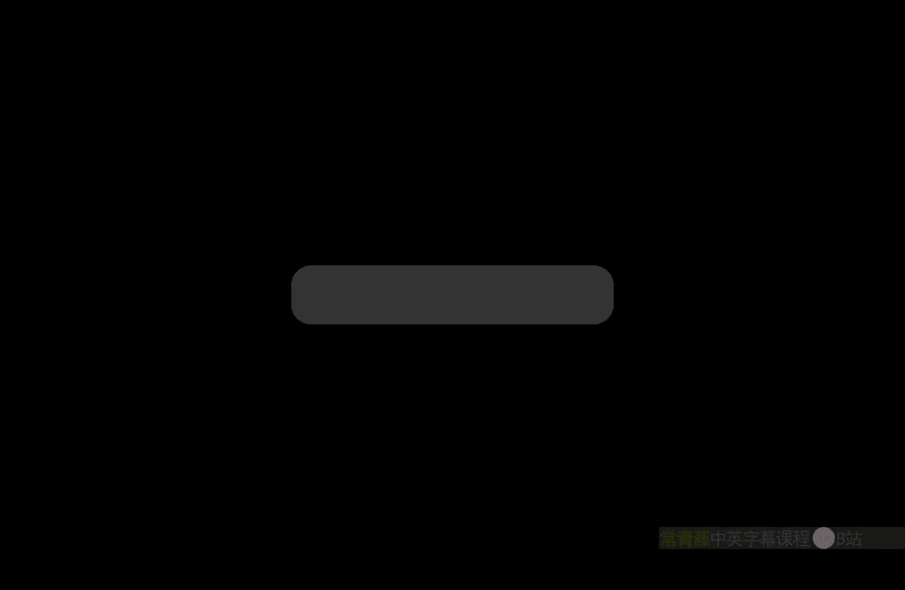

But just want for my peace that pass God bless a friends。

It's time for Carnegie Mel University's future series possible let's get started We're excited today to have Jo Victor who is a return speaker this is his second time seminar appreciate him us again is the chief architect single as always you have questions for Jo while he's unmute yourself and any time and that way he's talking to an audience people that are interacting with him rather than just talking to overoo in Berkeley for an again Jo for coming back man I' really excited about this floor series go and you can see it like changing slides and's beautiful great Okay so this is my second talk at the CMU's kind of actually a sequL。

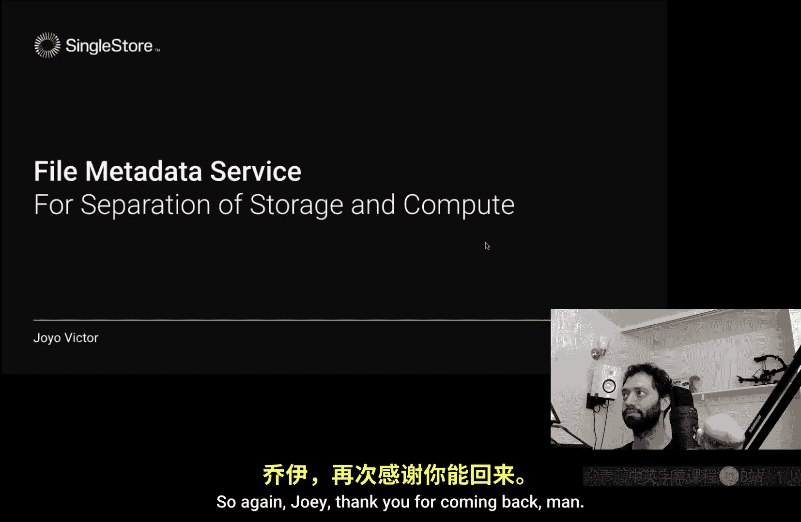

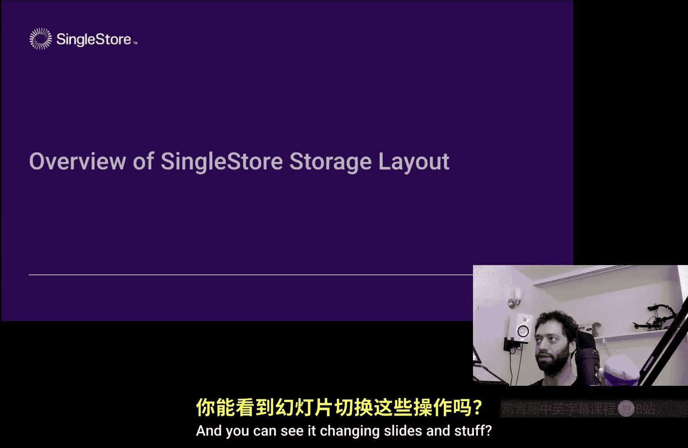

To my 2021 talk about our separation of storage and compute model so today basically we're going to the first section is we're going to kind of give an overview of our cloud storage layout which is the fine print of that is the entirety of the last talk so if you want to learn about the nitty gritty of that you can go back to that one。

😊。

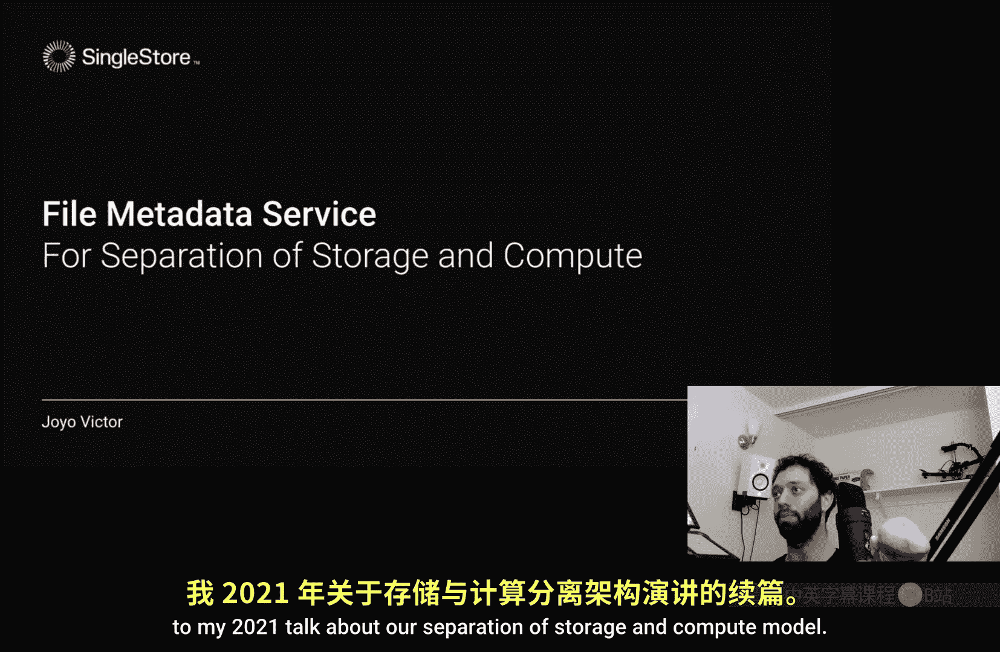

And then I will talk about why that architecture is not enough to let you do database branching。

 So database branching is like you like to branch your， you know， you're so used to it already。

 you're building the code。 you create git branches when you want to go do an experiment。

 You want to do whatever。 And branching doesn't work in the old architecture。

 but it does work the thing the service that it's called the bottle service。

 the bottomless metadata service allows you to do it。

 And then we'll talk about some other applications of it。

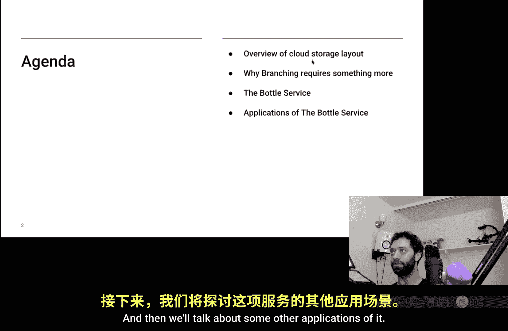

So let's get started。All right， overview of the single store storage layouts。

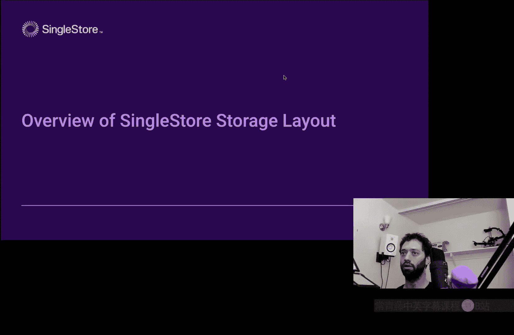

So this is a very high level view of how we store our files in object storage I usually will say S3 as an Amazon S3。

 but it also works on Google GCS and Azure block storage and anything with an S3 compatible API you know cross your fingers it's truly S3 compatible。

 but I use S3 as a shorthand。So what do you have in your storage。 Well， first of all。

 you have these data files and I will I will use the word data file and blob interchangeably。

 but it's basically a file with some data in it that you can run queries on it。

 So these could be column store files kind of like parquet files that actually have data in it。

 These could be indexes that could be vector indexes， that could be statistics。

 But there there are stuff that you need to run queries and most of your data exist in these files。

These data files。Are not very useful by themselves。 So you also have metadata for the files。

 and the metadata for the files， when you change those that metadata。

 we put that changed metadata in the log。 Also， when you create a new file， we put that in the log。

 So you have these logs。 Can you see my mouse。Cool， sorry， yes， yes， cool。 Yeah， so。😊。

I want to query one of these files。 Let's say it's a file that has a column with column store data in it。

 The metadata for these files would say like， oh， the third row in this column is deleted or the 2700 throw is deleted whatever。

 And so the data files themselves are immutable。 They never， ever change。 Only the metadata changes。

 That's kind of one of the tricks of single store。 again。

 my previous talk goes into detail of how all that works。

 But from the perspective of this talk we' kind of zoomed way out on the cloud storage。

 So we're disconnected a little bit from compute。 So there's no compute here。

 So we really only care about what files exist and what files don't exist。😊，So the files。

 when they get created， they get created at some point in the log。

 Im drawing an arrow from the point in the log where the file is created to the file itself to say that the log references the file at that LSN。

You'll notice that these first few blobs do not have an arrow pointing to them because data files can outlive the log which creates them。

 so the log which created these files might have been over here and that log might have fallen out of the retention period and already gotten cleaned up。

So far makes sense。Cool， so， okay， in addition to creating these things at some point。

 these things get logically deleted。 At some point， all of the rows in a given data file are deleted。

 or， you know， the indexes get merged。 What have you。 And we no longer need the file。

 This also happens at some point in the log。 So the I'm drawing these little red arrows to indicate。

 oh， at this point in the log， this bb was deleted。 at this point in the log， this b was deleted。😊。

Obviously， the deletions can happen out of order。Can happen out of order relative to the。

Relative to how they're created， as you can see。 But the point is， okay。

 at this point in the log is created at this point in the log is deleted。

 they can get deleted in any order。Finally， we have this notion of snapshot files。

 the snapshot files。嗯。The idea with a snapshot file is it if you replay the log from the beginning of time。

 you'll reconstruct all of the metadata because it has all of the changes in metadata in it。

 If you start from the snapshot and replay the log after the snapshot， it should be exactly the same。

 So implicitly， if the snapshot is able to know about all files that that are in the log before it。

 the snapshot references any file which was created in the log before it。

 So this snapshot has pointers has things pointing to each file that was created before the snapshot。

 the snapshot is here， but but not deleted before it。 This file was deleted here。

 which is before the snapshot， thus， it's not referenced by the snapshot。

 This file was created and deleted before the snapshot， Thus， it's not referenced by the snapshot。

This file was deleted after the snapshot， so it is referenced by the snapshot。嗯。This is not a。

 this is not super hard stuff。 I'm just kind of saying very obvious stuff。 very， very。Clearly。

 the snapshot references things that were created before it and not deleted before it。And of course。

 yeah， deleted data files are not referenced by the snapnapshott， as I said。So here's the thing。

 I've drawn all these arrows。 And I've seen， you know。

 here's all the places where the metadata the metadata， which is stored in these log files。

 which implicitly reference the blobs。 And the snapshots also implicitly reference the blobs。

 We have all this kind of network of implicit references。 But all of these things， these snapshots。

 these log chunks in these blobs are just files sitting in object storage。

 And so the problem is that。😊，Yes， there's all these implicit references。

 but we have no idea what even is in object storage。

 There's no global list of everything in object storage。 and somehow that's kind of okay at first。

 because if I want to attach compute。If I want to attach compute to a storage and object storage。

 well， I download the latest snapshot。 I download all the logs after it。

 Now I know the names of all the blobs that are currently visible to me logically in compute。

 If I want to detach。 I just make sure that anything I've written is in object storage。 So。

I don't actually need the global list of everything。

 I just needed to be able to find the latest snapshot， find the latest log chunks。

 replay it all and kind of hydrate my metadata locally on the compute nodes。U。But there's。

And so like you don't need a global list of all the files in order to do quite a lot of things。

 but it's still really annoying not to have that list。So now that I've set the backdrop。

 I want to pause and see if there are any questions about this picture。I think were good。Cool， okay。

 so this is what it looks like in object storage。 And if you want to attach compute to it。

 it's not that hard。 And if you want to learn the details about exactly what happens if you delete one row or if you update one row。

 that's in the previous talk， which is in the 2021 vaccination series。😊。

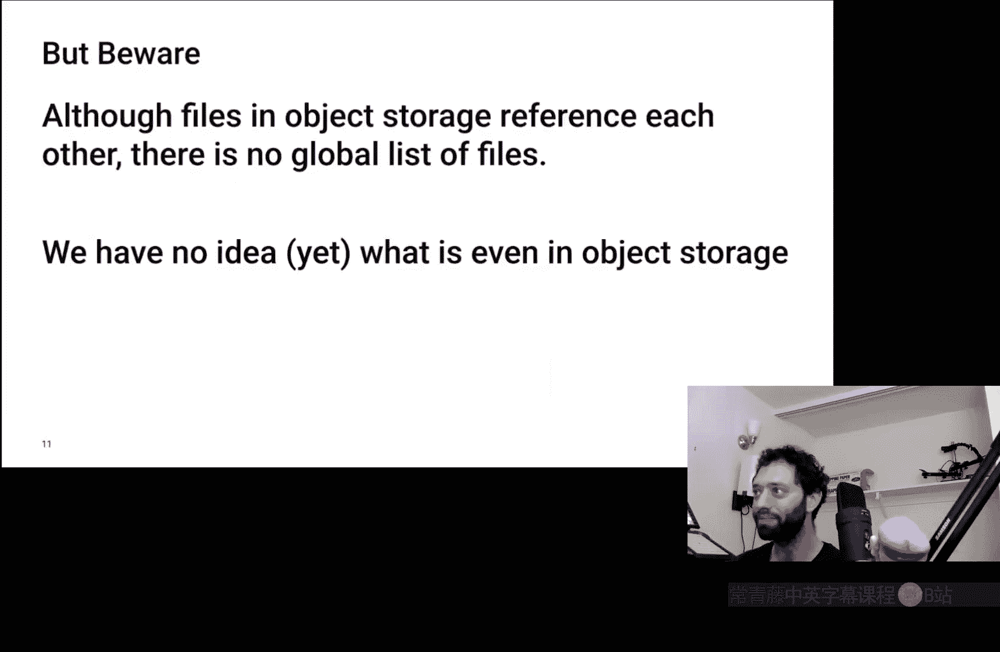

All right， cool， So what is bad about this system， when does this system not work？

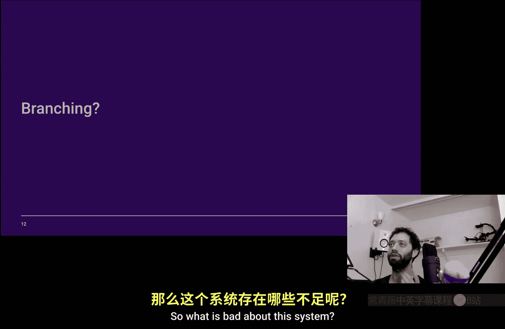

嗯。Well， the question is， why can't I just fork the log stream， right？

 So I didn't mention this earlier， but the。It or。Let's say I just fork the log stream。

 so I replay my snapshot， I replay any logs after it。

 and then I start writing new logs to a new directory。Right， this makes sense。

 I can just start making new logs that don't interfere with the old logs。 And now I have a branch。

And any。Any blobs which were referenced by the old log stream are implicitly referenced by the new log stream now。

I can also de referenceence things by deleting things， right。

 So let's say this new log stream deletes that first log and this log stream deletes this log。

 et cetera。 I can kind of。By deleting things， I， I de referenceence them。

 And so these different log streams can kind of。Have different sets of blobs that they care about。

And this almost creates branches， but I have no idea how to do garbage collection because I have I don't have any centralized place that stores all of these arrows。

 So all of these arrows exist somewhere if I ask all the different computes that are attached to something。

 but I I really cannot do garbage collection based on this information。And so。To that end。

 we introduce a centralized service。So we're close to something really cool here our durability story is you track the changes in the logs and the data files just kind of come along for the ride。

😊，So the data files are immutable and you know when you change the metadata about these data files。

 when you delete a row in the data file， just changes the metadata， the data file is just there。

 you just have to track when they're created and when they're deleted。嗯。I can just fork the log。

 right， I can create an independent branch and the vast majority of the underlying data， right。

 the the log data is going to be like 5% of your total data。

So if I just create an independent branch。The vast majority of the data doesn't have to be copied。

And so you have this situation where the past is shared kind of like with git。

 but the futures are independent。 I don't。 There's no gi merge in this story。

But there's a problem which is I have no idea how to do garbage collection and so like yeah。

 basic basic CS thing you need reference counting so。😊。

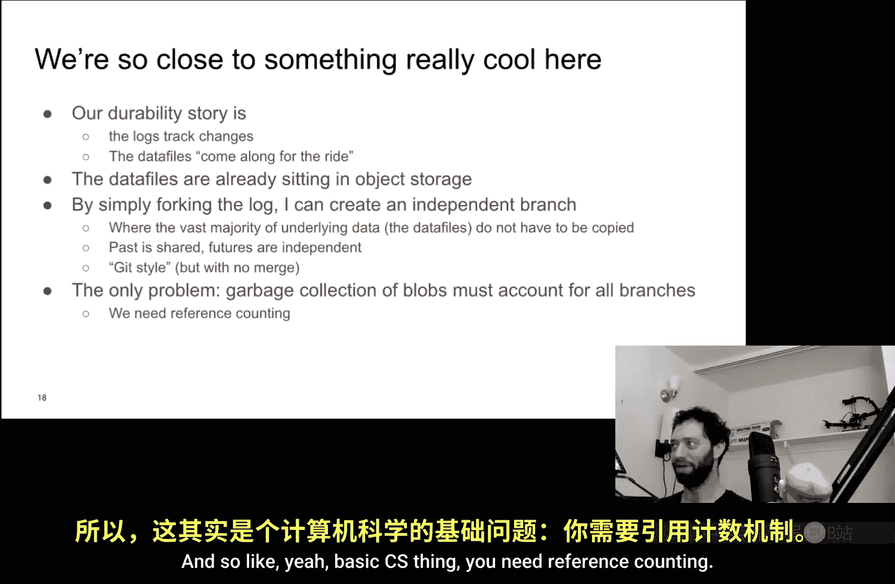

What do we do？We introduce the bottle service， which is short for the bottomless metadata service。

Our separation of storage and compute is called bottomless internally。

 so if I reference bottomless storage， I mean object storage， I mean S3。

And so we introduced this thing called the bottle service。

Any questions of what we're trying to do and why we need an external service in order to do it？

Did you originally design the architecture？Like did not require centralized metadata service or this is like you sort of。

 you knew your eventually you were going to get there and you added the bottomless storage。

know with this log stream and then you're like， okay。

 if we now add the metadata or the middleware or metadata service。

 we can then do the forking or the branching right like what what was the thought process of how do you design the architecture？

That's an excellent question， so。I， I was pretty certain that we would not need。

 This metadata service was originally called the GC service when we were talking about it。

 And as of 2019， I did not believe it would be necessary。 There were some other people who did。

And it wasn't until and so we talked about Nikkita from Nen and Nikkita from Neon really wanted branching actually before before he left in 2019。

 and so it was actually Nikkita who convinced me that we would eventually want to build this。And so。

Yeah， the。I I don't know if we knew that we were going to have the metadata service be quite like it was。

 but we knew that garbage collection with branches was a problem that eventually needed to be solved。

And when I say we， I mean me and some of the other engineers。

 I think that some of the kind of business type people kind of didn't see the value in this until we had already built it。

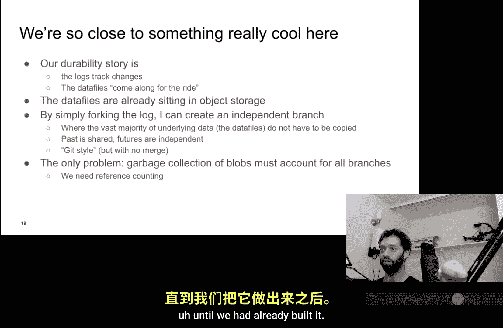

Got it， thanks。Yeah， that's a good question。 Like， why would you build a service where you have no idea what's in S 3。

 How do you even write billing for it？ And the answer is， oh my God。

 it was really hard because like you get on live sites and stuff， you know， and it'd be like， oh。

 there's some problem。 And we it's really， really hard to debug because you can't see what the files are。

 Now， in live sites。 It's just like， oh， yeah， let me just query this， this database and like。

 ask it what things are。 It's like having things in a structured queryable format is awesome。

 databases are actually， really cool。 not just like databases can help you build more databases。

 And if that doesn't justify the the investment in databases， I don't know what will。😊，Yeah。

 any other questions？

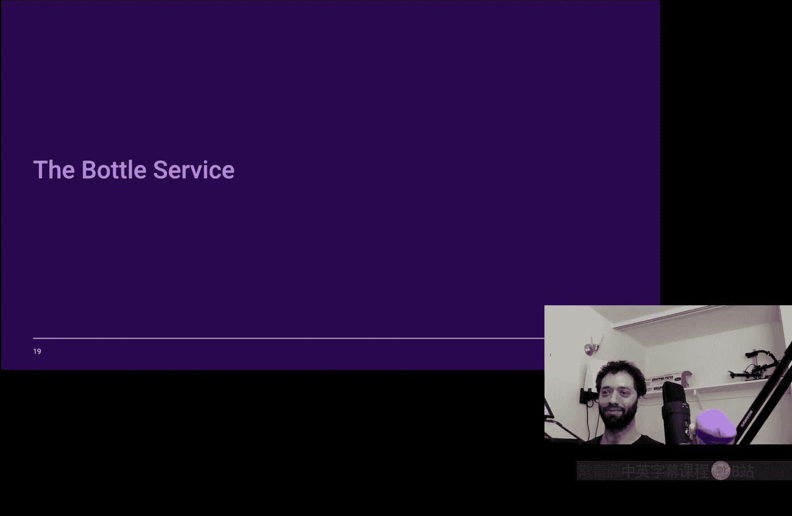

Cool Ia。All right， so here's the idea of the bottle service， you rough count the blobs。

You record a reference on blob creation， you record a reference on branch creation。

 so when you create a new branch for any blob referenced by the new branch。

 you just copy the reference over。And you recorded a deletion on Bob deletion。

And all of these operations are itempot because you're saying you're not really。

 it's not like rough counting where it's just like， oh， I just have some number。

 You're actually saying at this LSN， the blob was created at this LSN， a branch was created。

 which causes this other compute session to reference this objects。嗯。And on the deletion， you know。

 same thing at this LSN， there is a deletion record without having to open the log。

You don't simply remove the reference， you don't remove the reference。

 you put a deletion in the database。When a deletion goes out of retention。

 you delete the reference and the deletion。And when a blob has no references。

 you physically delete it。 So pretty straightforward with a little bit of cleverness around this idea of item potent。

 I can create a reference item potently。 I can delete a reference item potently because the references and the deletions are at a position in the log。

😊，And this work has to be moved outside the user cluster， you need a centralized place to do this。

And it's going to be multi tenant and these kinds of things， which is awesome in a cloud service。

What system are we going to use for this？That's an interesting question。 What system。

 What system could I possibly use for this？ Well， it's a transactional operational workload that's recording individual data files and it's running the managed service storage operation。

 So it's running an app。😊，It's doing real time light analytics。

 It's not the craziest analytics queries in the world， but they're in real time。

 They're on the same data。 I got to remove references。

 matching deletions and find the unreferenced blobs。

 And these are joins and left joins and not exist queries that you know。

 there are not 000 line queries， but there are 200 line queries。😊，And you know。

 requires high availability， high durability， and of course， we're using single store。

So we are using single store to build storage at single store， very cool。All right。

 so I think it's cool。So the bottle service， What is the bottle service。

 So the bottle service is a single store database with a bunch of stored procedures attached to it。

And what is its job is it tracks database metadata。

So it tracks metadata for files in S3 or an object storage。 and you we weren't doing that。

 We'd have no idea what we were storing， and we'd be back in the dark ages。嗯。

It also tracks which compute sessions reference which blobs。

I I haven't said precisely what a compute session is。

 but somehow as I'm attaching compute to this storage and if I'm attaching multiple different computes to the storage at the same time。

 each of those is like one session that has its own ID。嗯。And it includes a worker service。

 so it's not just the database and the worker service is responsible for you know， deleting stuff。

 basically。So I call this smart storage I call this smart storage because。

 you know S3 or object storage is kind of it's dumb， right， you put files in， you get files out。

 that's all you really do。And it's very difficult to like logically see what it's up to。You know。

 it's if you've ever used S3 at scale， that's kind of a thing。 We got a chat。

Bottle service design regarding being implemented by single store。

 The recent relevant events of dynamic D endpoint sunk entire， but many other misssterrs。

What's the failure model when it's recursively backed by single store， It's。

 it is not backed by itself。 It is a separate single store cluster that is not bottle service backed。

 So the bottle service itself does not have bottle service。 That's， that's a very good question。

 It's kind of fun to think about， But the bottle service itself is an independent single store instance。

 So if the bottle service were to fail， it wouldn't take itself down。😊，嗯。

I hope that kind of answers that question and is it is it is it one single sort instance per customer or because it's an internal system for you guys so it can be one it is one per region and if you pay enough you can get your own。

Got it。 Of course。 Yes。 So our， our， our largest， largest customers have their own bottle service。

 Everyone else， they're in the， they're in one per region。And when you say if you pay enough。

You get the road。I mean， here you are talking talking publicly about bottle service。

 but like a customer signing up for a single store would they go along and check off like I want。

 I want a bottle service or like if you get bottleless storage you just get you just get it we have this notion of like dedicated like。

We have this notion of like， oh， I want， I have a dedicated region where it's like， oh。

 I have my own region。 And like my region is disconnected from everyone else's region。

And so like our biggest customers， they're in like their own logical region， you know。

 it's in u physically it might be like US east whatever。

 but it's like not there's no connection with the kind of general population。

But I it's like someone doesn't know they they're using bottle service。

 it's just they're maintaining the metadata。 That's right。 Yeah， like like。

 like Foundation Db and sniff like， it's just there。 it's just right it's just there。 It's like。

 it's， it's a lot like foundation Dv。It's a lot different than foundation D also。

 but it's a lot like Foundation D。U but。It's a better system， but I mean that's the point yeah。Yeah。

 keep going all right， cool yeah， so we've got this thing and it makes storage not be dumb and so everything in the database queryable start it's just it's just awesome it enables us to do more with the bottomless storage that we already have and so those include it includes a bunch of things but branching and smart DR are the two that I'm going to talk about。

😊，So I call this smart storage and yeah。Okay， cool。 So how does it work， La。

 what is the nitty gritty， It's it's a database So what's the schema， right。

 So we have this notions of storage locations and compute sessions。😊。

A storage location is basically a directory in S3。 It's basically a database。

 When you create a database， you're creating a storage location， and it has a storage I。

 A compute session corresponds to one attached。 Like I mentioned earlier。

 It's ended when you detach and it's identified by a compute Id。

 You have multiple compute sessions attached to the same storage location。

 If you have bottles of this。A snapshot in the log chunk are scoped to a compute session。

 So every compute session has its own log。 That means that whatever they write。

 they will never interfere with each other So they can both delete the same row or update the same row to a different value。

 That's fine。 I don't care about the contents。 But the the the the log streams are independent。

 So they can have conflicts all they want because they never come back together。Yeah。

 and so a new compute session is basically going to log to a new directory。And so in this way。

 compute sessions share a past， but they don't share the present or the future。And data files。

 on the other hand， are scoped to a storage location because when I create a branch。

 I want to have visible all the data files from the previous storage location。By。

The name of the compute session that creates a data file is part of the name of that data file。

 and that means that again， you never have conflicts because everyone is creating fully independent sets of files。

S， any questions？good， cool。 So what what's going on in the bottle service。 Well。

 we have a storage locations table that records all the directories and S3 to have stuff。

 We have a compute sessions table that records the metadata about compute sessions， including。

 you know， like 25 different metadata terms and LSNs log sequence numbers for figuring out when to do garbage collection and stuff like that。

 We have a database files table that records you know， each snapshot and log chunk。 We have a blobs。

😊，Table that records each data file， a data file is a blob。

 a database file is a snapshot or a log chunk internal versus external naming。

 but the data files are called blobs inside the bottle service。

And we have a blob references table which says which compute sessions reference which data file。

 we have a blob deletions table which says which compute sessions have deleted which data file and at which LSN the deletion is at。

So running clusters will populate this information into the bottle service as they upload S3。

 upload a file S3， tell the bottle service that file is there， pretty simple。

 little bit of a dance about pending files so that you I can make sure that they're in sync with each other。

 but ultimately that's what they do and it's pretty simple。

Are you storing for the broad metadata table， are you also storing the statistics information or zone maps because you're seeing the data as that shows up and because you're running at S3。

 are you recording any of that metadata？No， no， no statistics。 No。

 we don't know what it what what the files are。 We just know。

How big they are basically so you don't know whether， yes。

 you have no idea whether something is data。Statistics， indexes， vector stuff， whatever。

 it's just stuff to store。So like and， the API， this is some this is。

This is internal to to single story。 So this is like the bottom so it。So does that mean？

Up above in the rest of the system， like it's keeping track of like for some blog that I wrote out to the bottle service thing。

 like here's the stats that I've recorded for it。Yes， so the well， actually。

 the stats will be in a different blob。Okay， so sometimes the stats will be in the same blob。

 Sometimes they're in a different blob。 The point is that the。

 the the metadata for all these files is in the log and the each of the compute sessions has。

By the virtue of existing， they have replayed the log。

And they are writing to the log as they as they change stuff。 So the if I'm like I'm a compute。

 you know I'm a compute cluster， I create a new file。

 I say this file has maxes and mins and you know has， you know25 columns in it and whatever。

 I will write that to my local metadata， I will log that to my transaction log。

 So anyone who replays the transaction log will will will discover the the the query time metadata for that object。

 But in terms of just tracking it， I don't track it here。😊，Now。

 there's another service which we're currently building called the catalog service， which is。

 you know， it's like a snowflake excuse me。Iceberg， it's like an iceberg catalog。

 but it's over the single store data， not over iceberg data。 It could It could output iceberg data。

 but it's basically replaying these log。 So it's a separate service that's cracking open the log and recording the metadata in a catalog type service。

 That is not something that I am necessarily it is part of this presentation。

 but I could talk about it more at the end。Okay， yeah， so this is basically opaque blobs。

 you don't have looked in there at this level of the bottle service。 It just。

 I was asked to write some stuff。 I've record it exists and that's it。 That's right Go it okay。

 thanks。Any more questions？Cool， so how does garbage collection work， Well。

 I've kind of alluded to it very aggressively， But I'm gonna say it again。

 So to perform a garbage collection pass， you pick a new cleanup L SN based on the retention period。

 What was the highest LSN one week ago， you log sequence number， you， position in the log。

 You delete all log chunks and snapshots below the cleanup L SN， You don't need them。

 You're not gonna crack them open and read them to figure out what's deleted。

 You delete all blob references that have a corresponding blob deletion before the cleanup LN。 right。

 once once the deletion goes。😊，Outside of the retention period。

 it vaporizes both the reference and the deletion。嗯。You delete all deletions all， you know。

 you delete the references， you delete the deletions。

 and then you check to see if there's any data files that have no references。

 If you have a data file with no references， you delete that。And cool。

 Now we have a unified garbage collection system that， you know， hopefully doesn't get stuck and。😊。

I know。Well， you can't engineer your way like you can't say hopefully from an engineer perspective like。

Whathy would it get stuck， It doesn't usually get stuck。 It ran out of memory last week。

 and then it got a little bit behind。 and then over the weekend， deleted like， I don't know，1。

5 billion files or something。 So occasionally it has a little hiccups here and there。 But yeah， no。

 it's， it's been， it's been crunching along for the last， I know，18 months。Okay。

 little little disruption little disruptions here and there I mean it's it's。

It's a pretty serious system these things are running on。诶。

We're trying to large machines we're trying to say large clusters。

 I'm trying to remember the core count， but I don't remember it we're trying to we're trying to make it cheaper actually。

 and that's mostly just by messing with the Sequel， making the sequel better。

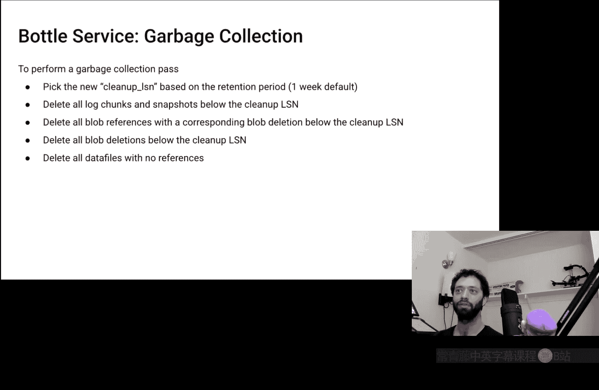

对。Cool。All right， what can you do with this system？

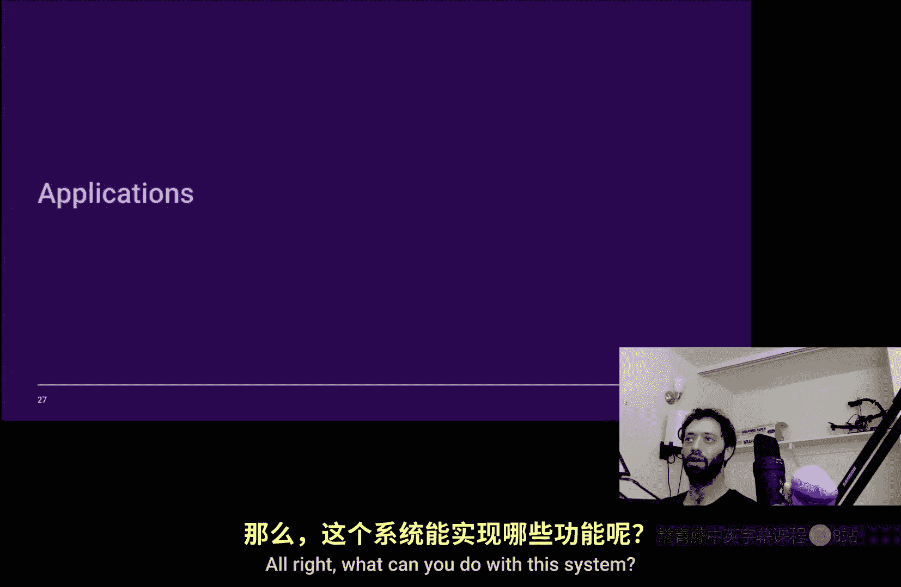

So the first thing you can do， we got a chat， we got a chat so Stephen Moy。

 the Steven Moy Foundation for Keep Real says multitenant sharding does each region just have one very large bottle service。

 single store series， or maybe they are sharded。Each region has one very large bottle service。

 It is fine to do that。I said that they were big， they're not like。

They're big enough that like finance notices， they're not like so big that they're like difficult。

 you know， they're not among the biggest single store clusters out there。Yeah， they're not huge。

're' they're bigger than I'd like them to be because they're expensive。Maybe I'll ask a follow up。

When you roll out changes， isn't that kind of like， how do you make sure。

 like it doesn't if can because if it's a single cluster。

 then if you roll the code for changes for the bottle service， if it's bad， your rollbacks gonna。

Disrupt the entire region operation。 So that's why I thought it's not because other multiten service usually use a cell architecture when you roll out code changes。

 So I'm curious sort of like what will how you do it in bottle service。 Yes， okay。

 very good questions。 Yeah， this is actually neat。 the way we do it。 So there's a couple answers。

 So the first answer is， when I say one per region。 I， I don't include the dev regions。

 So we also have dev regions。 So like one like the。

 there's a separate logical region for production versus development。 We roll out the dev。

 So internal first， then。So that's thing number one。

 And we do have a ring to roll out of that because we're not stupid。

 The other thing that's really cool。 So I said that all of the code， all of this stuff。

 all of this stuff。 these are all stored procedures。😊。

And the way that we do it is that actually each version of each version of single store has its own version of the API that it's using。

 And so when it when it queries the bottle service。

 it specifies what version of the API it actually wants to use And so even though it's physically one bottle service。

 the code that it's running the application is versioned。😊，Which is nice。The application is version。

 the part of the application that's not versioned is is the the multitenant parts of it。

 So the garbage collector is not version because there's one garbage collector shared among everything。

 But the stuff that's tracking all of these blobs and database files and references and stuff。

 That is versions。 I mean it's all version。 But it's like the the background tasks are always running at kind of the latest version。

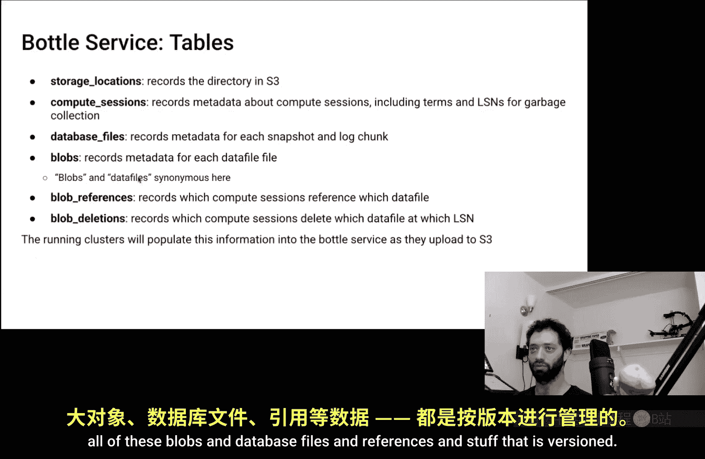

Cool， thank you。 but those can't take down user clusters。 you know， they can delete data。

 which is a little scary， so they have to be correct all the time。

 They're never allowed to not be correct， but they never interfere with the user's cluster。Yeah。

 good question， any other questions？

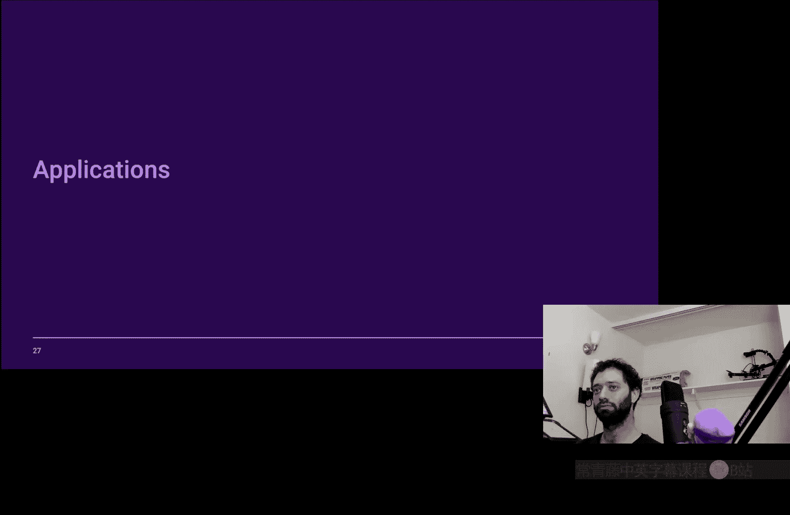

Al right， cool。 So I'm going go through two applications of the bottle service。

 And so the first  one I've alluded to aggressively is I want to create branches。

 How do I create branches， Well， I pick the LS Senate at， which I want to do a branch shot。

 I somehow create a snapshot。😊，In the the remember each compute session。

 so a new branch is going to be a new compute session。

This compute session needs to create a snapshot that starts it out。

 so either we copy the last snapshot or we do like partial replay of the logs before the snapshot。

 we create a snapshot in the new directory of the new compute session to start the new logging。

We copy all blob references， bb references are just rows in the database。

 so we do an insert select to copy from the old compute session to the new compute session subject to being created and not being deleted at that specific LSN right with this architecture it's really easy to say show me all the data files that exist at this LSN。

And if we did it right and wed better have done it right， because。Otherwise itd be a bug。

 the things that we reference are precisely the things in the snapshot。However。

 I will point out there is no core， There's no coordination between these two systems。

 We are doing the same computation twice and， you know。

 then then there's like health checks and stuff to。Make sure that everything's right。

 But we are not reading the snapshot file。 We are compute， you know。

 making the snapshot file by copying it and then computing using the bottle service what's referenced。

And they're always the same。Because math works。The new compute session now has its own directory。

 it has a snapshot， it can start logging， it has references to all the blobs。

 so if it doesn't delete those blobs， those blobs won't get physically deleted。

It's completely independent from the old compute session。

 but it shares the files and the references keep the data that it needs alive without keeping any data alive that it doesn't need。

I mean can you roughly say how long like， I mean obviously it depends on the number of references。

 like is this the order of I'm assuming milliseconds to do this？Yes。

 I wish it took milliseconds to create a branch。 There is a lot of craft。I。

 I think that one of the things about single store that's not so good。

 There's a lot of things about single store that are great。

 One of the things that is not so good is the amount of time it takes to do metadata operations and just creating a database even without any of this stuff is not only slow。

 but it takes a random amount of time。 So you might do it once。 and it takes， you know。

200 milliseconds and you might do it another time， and it takes 20 secondsd and。😊，You know， as oh。

 you just got bad luck and you ended up behind some lock or something。 And so like。

The amount of time it takes to do this is this operation is not the bottleneck for creating a branch。

嗯。And， and that's kind of。That is kind of when when you look at snowflake， which can go from。

Just nothing to querying in 100 milliseconds。 like I have nothing。 I want to run a query boom。Like。

 oh， yeah， like we got some work to do in order to kind of compete with that。That's very interesting。

 thanks yeah。And you know we're going to figure it out like it's not like that's a fundamental thing that that's broken。

 but it's currently broken。Any other questions about creating a branch？All right。

 the last thing I want to talk about is called smart DR。

 So smart DR or maybe storage DR is our cross region disaster recovery。System。

 and it's a little weird。 And it's a little。 it sounds at first like you're violating the cap theorem。

 But it's， it's just a slight of hand。 And so， and it's kind of neat the way it works， but。

We want to enable cross region failover。And so the way we're going to do this is we're going to make the storage in both regions the same。

So I've got my bottle service， and I've got my S3 or my object storage in two different regions。

 They could be two different CSP for all that matters， right。

 Like you could have your Google and your Amazon and and be doing this between them。 But you just。

 you want to make the storage in both regions the same。😊，There's no primary region for a database。

Each compute session has a primary region because the compute is actually attached somewhere。

 but the storage is just the storage。And so in this world， if you can accomplish the first thing。

 then you can do a failover by just making a branch in the other region。

A failover is just making a branch。And this is really neat because there's no split rain in this world。

 Well， how can there be no split rain？ There's the cap theorem。Well， okay， there is split brain。

 but it's， it's in branches。 So the other split of your brain is just in a branch。 So let's say that。

 you know， what happened two weeks ago or last week， I can't remember happens。 And you're like， oh。

 crap。 I want to go from Virginia to Oregon。 So you create a branch in Oregon。 Okay， well。

 there's some data that didn't make it to Oregon at the time that you did your failover branch。

Once the dust settles and once the data starts flowing again。

That data that didn't get captured at the time you press the button will eventually flow over to the other region。

And so the new branch you know has a new computer ID， logs to a new region， it can't。

 it's not going to conflict， even if the data logically conflicts。

 it won't conflict with the old branch in terms of like the availability of the data。嗯。

And so you can manually put them back together if you want， you know， via insert select or whatever。

So the bottle service maintains a queue of files that it needs to send to the other region and there are never conflicts because all the files are scoped to a compute session and also this system keeps the bottle service in the other region up to date。

And so the protocol is bidirectional and symmetric。

 so every file that gets written is guaranteed to eventually show up in all the regions。

 you know modulo， a data center actually literally dying。

 which I guess could happen but typically it's usually just the network is it' unreachable。

Any questions about Smart VR？ItIt's a bit different than replication。Typically， looks。I mean。

 so S3 is being replicated， this obviously this is replicating the metada itself。If there was。

Say a true disaster and the bottle service was wiped out。

 you can just you could just scan through the files and reconstruct it， right？

So if the bottle service in the， let's say that you you got you know region A and B。

 the bottle service in region A is completely wiped out。 Yes， you could attach in region B。

 All of your data is in region B or like， you know， everything。

 but the last second or last minute of data is in region B。You attach your good。

 The bottle service and all the data is if just the bottle service is wiped out， then yeah。

 you have to do a repair process， which is going to be very painful in order to rehydrate the bottle service in region A。

 or you can just start over if you want and start replicating back。

Oh you just ingest it back in from B back a day， I say yeah。嗯。Yeah， actually， so like this is。

 if you actually lost S3， if you actually lost your object storage， which is， you know。

 that that stuff is supposed to be very， very high durability， but， you know。

 natural disasters and human made disasters could。Certainly do it if you needed to。

So what does this get you？any more questions about smart art？I think we're good。Cool。

 and the other thing I should mention about smart ya。

 you don't need any compute in the secondary region。

Youre pretty much just it just storage in the secondary region。

 so it's very cheap and that's really nice。So how does it work well， I you know behind this cloud。

 you have an S3 over here and a bottle service over here。

 you have an S3 over here and a bottle service over here。

 but they're all sending data to each other so they're all making each other the same so I can attach compute over here and I could attach more compute over there if I want and you know they're get branches like I said。

 and I could just attach compute in the other region。

And maybe I do some computation in the other region。 Maybe it's not a failover。 I just like。

 there's something in the other region where I want to do a computationutation there。 So I do some。

 you know， machine learning thing。 and I get some table R。Well。

 over while that table R is going to get duplicated back。

 this guy could then attach that database could attach a branch of this branch over here， grab R。

 merge it with the local data and suddenly it's like， oh。

 I can kind of do computations anywhere and my data is available anywhere everywhere。And yeah。

 the neo neon Db。Demo of this is kind of very， you know， very fancy looking。

 but we have those abilities too。So conclusion on the bottle service。

 smart stores enables us to do more with our bottomless data， branching。

 remote log scanning and smart DR。It makes the service easier to manage。

 as well as customer databases。And it moves the management of the storage outside of the engine。

So it's kind of just making single store more of a true cloud database。

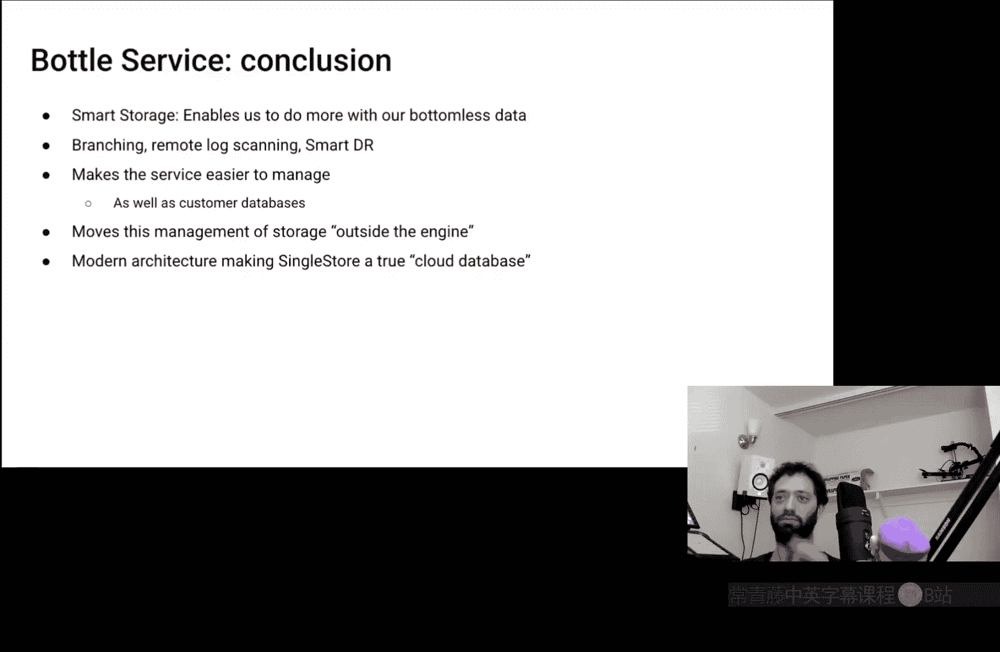

Awesome， I will clap behalf of the audience We have time for question for Jojo if any questions。

 feel free to unmute yourself and go for it。😊，I would say all the time right。My first question is。

 was there anything any language features you guys had to add for in single store for the the bottle services and internal store procedures mean one hand like you don't have to maintain a separate application server because it sounds like everything the bottle service needs to do can be done as store procedures。

 is that correct？Yeah， so this is。This is interesting because our stored procedure language is at once。

Very awesome and very terrible。I would say that the ergonomics of a database story procedure language in general and ours in particular are not great。

 There's nostructs。 There's no like I want to group these columns together like that kind of stuff is just terrible and that's。

 you know， I'm sure that's true in all the oracle languages too， although I haven't used them。Um。

 but then there's also likeh as， arrays are very， very awkward in our language。And so it's like， oh。

 I， I want to send this array as an RC or or something。 And it's like。You know。

 there's 10 different ways to do it， and they all suck。And， and so a lot of what we did was。

Not necessarily requesting more features， although we did， we did have bug requests， Of course。

 like a lot of bugs。 we， we found a lot of bugs， but it's just like。

I feel like we invented a lot of techniques to make the existing system work。

And I think our story procedure language is actually really cool。I I wish it was more like spark。

 to be honest。 I， I wish that it was， you know， you had R D Ds and， and like， you know。

Those kinds of that kind of thing。But you have the ability to like， save a query。

 And then you can like， select from that query and stuff like that。

And that ends up being enough to do a lot of stuff。

So the code is not always as like pretty as you would normally like it to be。But you can。

 once you get used to it， you can really make that thing cook。

the store procedure they're basically treating as an RC like you would call into the bottle service like do this thing for me or I now recorded something for you。

 And then do those store procedures ever need a call out of the single sort database system to go do something three something else is doing that。

 Yeah， you just so we have these worker tables these job tables and you just stick stuff in a job table they get picked up by these workers and you know the job table will be like delete these hundred files or you know copy this file from this bottle service from this region to that region like relatively straightforward jobs and then other some of the jobs are even just like run this stored procedure every 10 minutes or something know run the garbage collector or something like that。

😊，And so its it's a very， it's a very reenttrant system like SQL cues are awesome SQL cues。

 I know a lot everyone hates SQL cues， I think they're so cool。😊，Yeah， I。

Oh the other big feature is we did this all read committed， single store only has read committed。

And and so if you are building an application like this and you don't know the fine print of exactly where the anomalies are。

 you will never get it to work。The only reason that we were able to get this to work is because we were very。

 very， very careful about。We know that certain anomalies cannot exist at certain times。 And so like。

 we're careful to like match things to the shard key where everything is on a single box and you don't have distributed anomalies。

Got， and then you've said this before， maybe this last talk。

 the workers are outside of S store and they're just like what Kubernetes pods。

 Kubernetes pods is doing， which is you know， whatever the tasks to be done they do it。

That's right got okay， they're like， I think yeah， they're written in Golang。

 they're not particularly complicated。Yeah， okay， and then I guess。

Steve Moy asks data format of the blob， NenDb got bought by Databricks。

 meaning now Databricks runtime can just read the neononic blobs on S3。

 do analytics land as DB scan all data long without waiting for the typical change data capture Kaka cost and whatnot。

 how does one plug spark to do analytics with bottomless blobs without spinning up a whole new single store reader instance without impacting primary？

I will tell you right now that Databricks does not have that capability that they want that capability。

 I know people who are working on that that project started weeks ago。And yeah， the， the。

 some of my friends are are working on that。 a bunch of my friends， actually， the， the。

 the team that's doing that is a lot of X single store people。

 but they they do not currently have that。 Is that this is the lake base file format project。 Yeah。

 it's the0 E T L project is is what what it's called。😊。

The single store can do that kind of stuff today because it's one system that has row store and column store in it。

 So like the the， the， the kind of。The dominant architecture of everything is you have。

 you have a Postgres and you have an analytic system。 and the Postgre is your app or。

 or it's your streaming system or whatever。 And and it's CDCing into your anatic system。

 And that that's what， and even if you bundle that， right， Everyone's bundling that， you know。

 Databricks is bundling neon with with their spark stuff。 there spark data Delta like thingy。呃。

And single store， instead of bundling a Postgres with， with a column store is basically like， no。

 it's just， it's single store。 So we， we kind of have the。

 the app running system and the the other system in the same。

In this the OLTP system and the OLAP system in the same system， even in the same table。嗯。

What that means in practice is it just like it's， it's really an analytic system that doesn't fall over when you try to run apps on it。

 So all of these like 1 Z2 Z updates we're doing where it's like， oh， add one reference。

 That's on column store tables。 Yeah， it's like， it's， it's crazy。

 So were running an O app system on column store。 and it's fine。 And it's like。

 that's not the hard part。 That part works perfectly。😊，As for Sp。When I'm talking about Spark。

 I'm that's really more about。Linguistics， like the spark programming language is really good。

 And the spark programming language is really good because it allows you to。

 to express complex distributed computations in a really easy way that gives you a lot of control single store allows you to express really complex。

 distributed computations in a in also an easy way， But it's like it's only SQL。

 And if the optimizer doesn't do the thing that you want。😊，Too bad。 And and so like SQL is great。

 but sometimes you want to break out of that SQL box and Spark lets you do that in single story doesn't。

If you wanted to run Spark against single store， you would use our S connector。

 which works great and a lot of our customers use it。Okay， any other questions？I guess。

Let me talk about Spark a little bit more and now we're going into the world of my opinions and the like my weird ideas。

So like， you have parquet sitting in in S 3， right， And you're like， oh。

 I want to run I want to run Sp over。 And in parquet is an open format。 And that's great。

 And I do believe in open formats。 Sle store is not one of them。 But you you put。

 you point spark at your open format and it knows how to read it and knows how to do stuff with it。

 And you're like， cool。 That's great。 Now， a single store is a closed format。

 So I've got some opaque blob sitting in S 3。 And I'm like， I want to go run queries on it。

 What do I do。😊，And so like， you need something to go decsialize that blob and read it。

 and that something。Is a single store cluster。 So instead of the spark binary being the so like with parquet。

 you need something to decialize it。 Well， that's the spark binary or Athena or whatever with single store。

 you still need something to decialize it。 It's just that you only have one option。

 and that something is single store。 Once you've decialized it， You can convert it to， you know。

 you can marshal that data straight to spark。 It's pretty fast。 You needs arrow or whatever。

 And then you can， you can do spark computations on it。😊，Just the same。

So it is one extra little thing of you need to have that single store binary sitting there。

 but you can still。Like。嗯。Openness is good。 And openness means there's one less thing to do。

 but it is not a complete TK。 It's not like， oh， because this is a closed format。

 I can't make it do the stuff I want iss just you need to put that thing there to read the data。

 And that thing is the single store binary。I think arrow makes us a lot also less than these days as well。

Yeah， I mean， the single store binary needs to spit that arrow， yeah。Which it does， which it does。

 yeah。All right， my last question would be。I mean， given going back to some my original question like。

 okay， sounds like， you built this bottle of storage。 And then after the fact， you said， okay。

 we have add this metadata bottle service。 I mean， it is sort of the micro service。

Kind of architecture where you're separating out sort of critical components from a single monolithic architecture。

 but is there anything you lose by not having like because the bottomless service piece that's inside the single sub binary。

 correct？Yes， so like is there what do you， what do you lose？

By not being sort of more tightly integrated。And like having the bottle service would be a first class citizen within the single sub binary as well。

嗯。That's an interesting question。I， I I， okay， I know the answer to that。 actually， you lose onprem。

 So we， we have a legacy business。 Well， technically。

 it's a thriving business of self managedaged customers who run their own single stores。

 and they're not in the cloud。 And for the most part， they're not trying to do branching。

 They're trying to do more legacy data workloads。 But some of our customers are trying to do stuff like this。

 and they're trying to do it on legacy on bottom list without a bottle service。

 And it's I I cannot believe how well it works。 frankly， it should not work as well as it does。

 and it does not work that。mSo those customers need to like they they basically have a choice of like moving to cloud or like not having these features。

And， you know， Bo service is kind of single stores first major feature that has this kind of trade off。

 but the more we do stuff like this， the more that we end up kind of having two different versions of the products。

 we have like a managed version that has all this stuff and a self managedage version where you don't get the most modern features。

And， you know， it's not just us that's having this。 like we've already talked about databricks。

 Databricks， you know， used to have something where it's like， oh。

 you can run your own databricks or you can kind of point the databricks， you know。

 control plane and its notebooks and stuff at your S 3 bucket or you can have a fully managed offering。

 like they have the three tiers。 But like neon， my understanding of neon is neon is only in that third tier。

 I think I don't know that for sure。 I maybe that hadn't been decided yet when when。

 when I when I heard that， but the。I think that this is kind of a thing that's going to happen that a lot of companies are going to have to make these decisions。

You know， do I fragment my product my projects or do I build things the hard way。

 which is making them work on prem， Everything is so much harder if you have to make it work on prem。

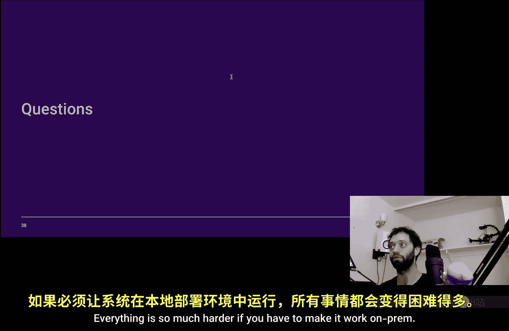