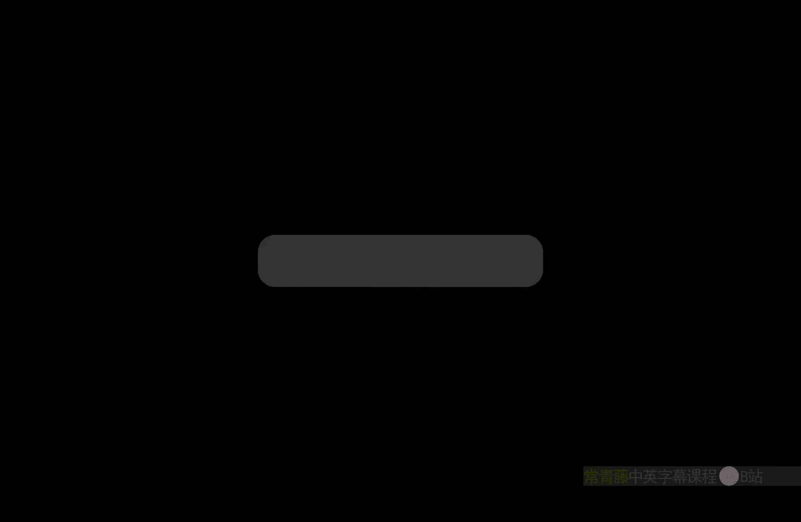
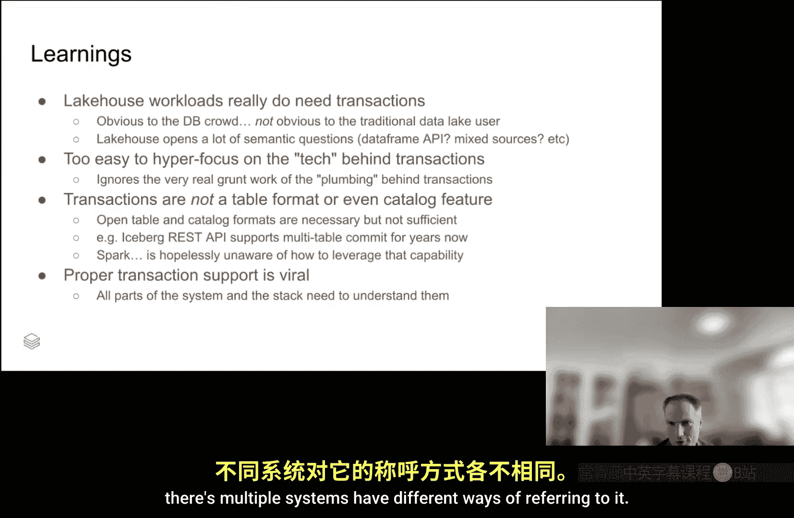

# 卡耐基梅隆【中英⚡未来数据系统研讨会系列｜Fall 2025, Future Data Systems Seminar Series】 p07 P7 Multi-statement Transactions in the Databricks Lakehouse (Ryan Johnson) -BV17pidBkEzr_p7-

But just one for my peaces that pass， God blessedless they friends。

And check it out now I pound because it's mad brown。

Y it's time for Carnegie Mellon University's future Data System seminar series This seminar is made possible by let's get started。

 We're excited today to have distinguished Carnegie Mellon Databricks Group alumni， Dr。 Ryan Johnson。

 live from Utah where he is a principal engineer at Databricks So here he can talk about today about the Lake House work that Databricks is doing and in the context of the Delta Lake Project and as always you have questions for Ryan to meet Dr。

 Ryan while he's giving his talk feel free to unmute yourself and fire any time that way Ryan is talking for an Ryan we appreciate you being here we you working through the cold talk with us the floor is yours go for it。

All right， so as the title says， this talk is about building transactions in the database databasebs like house。

 but really what the talk is about is all of the stuff you won't hear in the Sigma industry paper。

 all the stuff you won't see in the gloss marketing slides because honestly transactions are not that new of a thing in the database world right they're kind of older than I am so we're going focus on all the stuff that you don't see in school which turns out to be a lot。

All right so first of all kind of some context right Delta Lake goes way back like a decade at this point and the problem that it tried to solve was that basically the promise of the data lake was turning into more of a data swamp you have these random directories full of parquet and CSV files。

Yeah and nobody knew what was going on You just got you know people cobbling together paths here and paths there dropping directories left and right and that just made it impossible to figure out anything and catalogs b their hearts you know HMS was the state of the art and it was really just a glorified discovery tool right you could give names to locations maybe throw it like a well your best guess at a schema and some other stuff to help query planning。

 but really the table is a beast of its own that lives independent to the catalog。

And so that's the world that Delta Lake entered into right we want a way to have something resembling the discipline of database engines in what up until then had just been directories full of files and we need this to be in a self-deib self-stand form because catalogs really weren't a thing yet back then unless you count HMS as something amazing so the problem then was how do we get you know atity and consistency for readers and writers。

And keep in mind， all of this predates my time at Databricks。So what Delta settled on was。

At the time， a novel notion of using putative absent in cloud storage to have an increasing sequence of commit files right。

 So if you're thinking like traditional database logging， this is the database log。

 It can be truncated with appropriate checkpointing。

And it just tracks to all of the changes to the table it's appendned only in the sense that you know。

 once one dot JsonN exists， the next thing that goes in is 2 dot JsonN。

 you're not going to write another one and you're not going to skip to three。

And so that becomes the protocol。And then there's also data directories full of files that are the actual data in the transaction or in the table。

And the key here is that we have this ordered atomic sequence of commits and each commit refers to everything that that。

Action changed on the table and so you know you could add things， you could remove things。

 you could tweak the schema and as you replay through all of those logs in order you end up with the final state of the table and then of course throw in checkpointing to reduce the amount of log replay and you've got a pretty nice system。

And concurrency control wise it's very very simple， I try to write 2。 JO you try to write 2。

 JO one of us wins， one of us loses the loser will check the content of the winning commit。

 see if it logically conflicts and if not they just rebase and retry with 3。

 JO so there's a distinction between physical conflicts ofOops somebody got the file name first versus logical conflicts of you know oops they dropped the column I was trying to insert data into。

So this all worked great back in the day， but eventually it spoiler alert became a weakness and that weakness will become increasingly clear as we go through the presentation。

Transaction wise Delta Lake did actually have transactions from the start。

 they were single statement， single table transactions and within that table。

 you know changes to different rows， different partitions were tracked very carefully。

 there's support for serializable readers usually go for snapshot isolation because they don't want all the overhead of tracking perfectly consistent you know all the crazy anomalies that can happen。

Optimistic andcur control， there's no central authority， so there's really no choice but to do OCC。

But that also has a nice benefit that everything just flows right you never block on anything also support for blind rights so you can say I'm just depending rows。

 I don't care what else changed in the table。And then databricks eventually added row level conflict detection as well for even better concurrency control so you can literally doesn't matter which files they're in or how they got laid out if the two rows don't relate to each other you're not going to see a conflict。

Yeah quick clarify this question so so this does a like transaction model but then you say databricks supports so what is the what is the Databricks runtime the system what is that yeah Databricks runtime so at the end of the day conflict detection is up to the client。

Right， and then the Delta spec doesn't have too strong a wording about what exactly that looks like。

 so there's Delta Spar that has pretty good concurrency control and then databs has some extra magic on top。

Got， thanks。Okay， so here's where it gets fun right if you want to see some fun faces。

 you can ask Lakehouse people right these are the ones who came from the directory full of parquet and you know all of this discipline that database engines bring is still kind of a partly unwelcome thing you start asking about all the stuff that goes wrong right do you like hey。

 do you have a pipeline that uploads of updates a bunch of tables and has you know table three ever failed to update well all the other succeeded or have you had a right manual rollback logic of some kind or using crazy batching or audit logs or other things and yet in spite of all of this you still end up asking somebody why the data doesn't make sense。

And all of these things are just kind of run of the mill in the wild west of the lake， you know。

 the Data lake， and that's to some extent that's inherited by the lakehouse。

And so here's some examples that I got from some of our product managers right a major customer in the construction industry。

 they're literally playing around with like merge statements and some kind of isolation based on batch IDs。

But whatever they did， it didn't quite work and they're constantly having to fix messes。

If you have transactions， all of this stuff just goes away。Another one。

 a major manufacturer of GPUs similar thing right they need to do what if analyses and coordinate changes across multiple things they've got foreign key and primary key constraints which by the way are also a pretty new concept in the lake world。

And they're constantly you know， having to go back and clean up orphaned messes。

 I think they're a little better they don't get outright inconsistency。

 but there's like garbage laying around all the time and again。

 right transactions would make this really simple。And then there's a whole bunch of workload workarounds that have been generated right。

 so merge， for example， if you stop and squint a sQL merge is really。

The most complicated possible SQL statement that is still one statement so that you can do kind of transactions with a single statement and get around the single statement limit。

You've got declarative pipelines right like Databricks has DLT but there's plenty of others and one of the tricks they can do is just make sure to schedule readers when no writers are happening so that the readers get the illusion of consistency but anybody who comes in outside the orchestrator is fully exposed to whatever's really happening right so there's no actual consistency iss just a scheduling trick DLT actually do that Yeah okay so within the pipeline you'll always see perfectly consistent results it's wonderful but then external readers are like what's going on。

Because there's no way to coordinate across multiple tables right out at publish， this is a concept。

 you know that's a name that came out of the iceberg nomenclature but I mean a lot I've called it drop and swap for years right you create temporary change or you work with temporary changes and if you like what you see。

 then you quickly rename those you know those outputs on top of your inputs and if you're quick enough at it nobody notices the shuffle while you're moving things around。

And that's way better than doing your work in place because rollback is easy and the final swap is pretty quick。

 but it's still not actually atomic and somebody can still sneak in and see you know when you've updated A but not B。

And then like those customer stories right custom metadata tracking， custom logic， custom scripts。

 all these things they're super intrusive， you never get them right it's just a mess and so really you know having true transactions like multiple tables。

 multiple statements is just a fundamental property that a system has to provide there's not really a way to get around it。

And then you can add on some extra business incentives right the lake House maybe doesn't especially recognize transactions or even welcome them there are segments that really want it and there's others that we still have to convince them not to just treat delta tables like directories full of brcade。

But for onprem data warehouse users， transactions or table stakes they've been using this for decades that's all they want and it is the number one most requested feature from data warehouse customers。

Which makes sense and so if we have good support for transactions。

 we instantly unblock know some large number of digits worth of dollars in migrations。

And everybody's happy and so to kind of you know riff on the phrase that the best data warehouse is a lakehouse。

 well， yes， as long as it support transactions， then it's the best data warehouse。

So that's where we're headed， that's the background here。Okay， so at one side note， right。

 Delta by back in the day was invented before catalogs were really a thing。

And in a modern world where catalogs are supposed to be governing and tracking changes and giving notifications and vending credentials and all this other good stuff。

File and based commits are actually really really bad right they just bypass all of the governance like people just grab an instance credential and do whatever they want the catalog never quite knows what's going on because it has to rely on clients to update it after the fact to say oh yeah by the way I totally change the schema maybe maybe you're interested I don't know there's integrity issues a Delta table a single commit file can change data but can also change the schema and so the catalog can't actually enforce。

The permissions model of I can modify data， but I can't change the schema that it simply cannot be done unless you have like trusted compute。

So open it up for external access and all these guarantees go away catalog also can't block commits that would I don't know make a foreign key constraint column nullable that totally didn't happen one time and totally didn't cause lots of trouble and then coordinating anything multi object is just a non starter right S3。

Or the cloud St put of Amazon can't coordinate anything over multiple objects。嗯。

I guess that's not strictly true， I think this month S3 released a copy if absent primitive that actually checks two whole files to make sure the source and the destination are both what you expect but that's as far as it goes at cloud storage so we really need catalog managed reads and rights for catalog managed tables。

Al right， so for transactions， two easy steps right step one。

 put the file system in its place as in get it out of the way， step two add transactions。

 so for file system， the idea is that writers are going to propose commits to the catalog and ask the catalog to ratify those commits instead of going to the cloud store directly。

You can inline small commits， that's really convenient， right， don't write a 1 kilobyte JON to S3。

You can also stage big commits to cloud storage， if you prefer。

 don't stream a gigabyte of stuff to their catalog service。

And then the catalog now can go validate everything it needs to do， it can send it out notifications。

 it can store it， however it wants， and then eventually the catalog will flush it back to the file system because it doesn't want to track a million commits forever and the readers don't want to have to ask the catalog for a million commits when they're doing log replay。

So readers obtain unpublished myths from the catalog。

 they combine that with what they can already see in the file system and boom you've got perfectly consistent reads and perfectly under control rights。

So all that's left is to add， you know， a multi commit API kind of like a IRC has in Kaoom， right。

 we good， we've got transactions。Well， you actually still have to implement transactions so three pieces of interest are first we need kind of a glass pane right the transaction needs to see its view of the world that is not visible to anybody else and we'll go into details there we also need to take all the intermediate rights you know if I do like 20 statements against the table that all needs to end up becoming one atomic change that everybody else sees they don't want to see 20 you know partial changes that suddenly appear And then the last one is conflict detection and resolution that you know transaction conflict sort of thing we need to handle them gracefully。

Fortunately those last two are easy， Dlta supports law and compaction we have the ability to take to roll up commits 10 through 100 and produce a single output。

 so we just use that right we basically treat the transaction as a bunch of commits that are staged but never ratified and if they succeed。

 then we just scroll them up and commit the roll up。Same thing for conflict detection。

 the system doesn't really see a difference between row level concurrency control on a single statement transaction versus a multi statement transaction。

It just needs to run the same algorithm over more commits。 So that all works。

 And the main thing is the glass pane。All right， so conceptually speaking what we're talking about here is we've got the catalog on one side。

 we've got the client on the other side and it's doing a bunch of work and we've got versions of various tables right a reader and a writer。

And we need to make sure that we insulate everybody from each other so they don't see dirty rightss and suffer dirty reads so that's what the glass pain is and the idea is that when I start my transaction I see the latest thing from the catalog life is good。

And then I go ahead and make some unpublished commits， these are part of my transaction。

 nobody else can see them， they're not in the catalog。

And somebody else commits something to the catalog。 That's actually fine。 It's outside my snapshot。

 I don't see it。 they don't care。And eventually the transaction completes that all gets rolled up and boom commit 22 lands in the catalog and now everybody could see it。

So。Are we good there does that part makes sense。Try to like there's the Death like piece and then looks at look the iceberg is down there is the reader as well or oh it's an iceberg table being read by Data Rick's Kt。

Got， okay， and then so the writer is the write all go through D the Lake and then within that same transaction that I'm writing to new changes。

 I can be also reading from iceberg Gables。Yeah， I mean that's the whole like managed iceberg available and cetera yeah and so really it's not that the right is necessarily。

Iceberg or Delta is that the table I happen to be reading is happens to be an iceberg table and the table and writing happens to be a Delta table。

Got it， okay。Yeah good question。 So first big messy design question。

 where do we actually put the glass pane？And the intuitive thing is to put it in the catalog。

It already has to track table schemas and other things and the nice thing if you put it into catalog is then know transactions can go anywhere。

 the downside is catalogs live in the control plane and they really really really don't like A having to deal with a bunch of versions floating around for indeterminate amounts of time and B they really don't like tracking state they want to be stateless and just backed by some database engine somewhere。

And the other way is for the engine to track it and there's also some intuitive support for this because for sure the engine has to know whether a transaction is in progress。

 so once you're able to track that reliably why not just track everything else too。

Good thing is it does preserve your stateless control plane。

 the bad thing is that now the state is tied to whatever cluster you're running on。

And so if you ever want to move clusters， you're going to have to move the state as well。

Turns out that just due to complexity and the fact that you anyway have to change the engine。

 we went with stateless control plane for the type beam and the engine is where the glass pane lives。

So that can be revisited， but for now that's where it is for simplicity and robustness。All right。

 so were getting close， we have catalog managed rights and to be clear， right。

 any table format that supports catalog managed rights， multi versioning。

 things like this is a suitable candidate for participating in transactions。

We've got our glass pan so that you have proper isolation， you can read your own rights。

 we've got squashing so that you get all or nothing。

 we've got fine grade conflict resolution so the concurrency has a relatively nice story so great we just need to tweak the SQL parser and we're done。

Ha， nice Ray。There's a lot more left as we discovered this particular project generated more crosss team asks than kind of all the projects I've ever been involved in in Databricks put together so were going that's where the fun starts we're going to go into some of these other areas where we ended up going。

So this is something that came up over and over， people are like， oh。

 just bake Delta transactional and we're all good， it's done。

And it took a lot of work to explain why no that's not quite how it works like the table format can support transactions。

 but it can't implement them so we do have catalog managed rights， we've got version grades。

 this is great The catalog while we're kind of there， we've got multi table rights。

 but we have no support for tracking and flight DDLs。嗯。Engine。

 it needs to be updated right dayricks runtime Sp， any engine that's going to do transactions is going to have to be transaction aware。

And then we get into the serverless world where， oh。

 the engine you ran the previous statement of the transaction on is gone。

 and the new statement is running on a completely different piece of hardware。

And then even further out， notebooks and other kind of client side UIs have to become transaction aware。

 so it turns into this whole full stack engineering effort。Rather than， hey。

 let's make Delta transaction aware， which is kind of where the story started in a lot of you know product manager' minds。

So we'll start with SQL and I learned more about SQL doing this than I ever wanted to know。

First of all， and this is a participatory part who can spot the significant and meaningful difference between these two statements。

Or these two snippets of sequL。Is Anne have different semantics than commit。Kind of。

You're sniffing around it， but the real issue is earlier。I mean， to begin atomic begin transaction。

 I don't know what that semantics means in SQL。Yeah。

 so this is like so arcane and it dates back to like the first version of SQL。

But it turns out that there's this little semicolon on one， and there's not on the other。

So the one on the left is a SQL block。Those have been around since the 70s。

Transactions weren't even invented yet when these were already invented and it's literally just a way to put a bunch of statements into one blob so that you can easily send it around。

The one on the and it does have the option to say， I want it to be atomic。

The one on the right is an actual like transaction begin right。

 you say begin semiynical one and now you're in a transaction and then you do whatever you want until you commit。

And this turns out to be quite meaningful because a。

 the one on the left is really confusing to customers， it turns out， but it's also really useful。

 so it's confusing because it may or may not be atomic depending on how it was invoked。

But the good thing is， if it works everywhere。 right， It's a single SQL statement。

 You can send it through JDBC。 You can send it through Spk do SQL。 You can put it in session list。😊。

Everything and it just works and so we ended up supporting transactions with both。So Ryan。

 is that because customers actually use the big anatomic syntax？Yeah。

 SQL scripting actually shipped before transactions did at Databricks。

So this is sitting around in legacy code is that the super legacy code like six to 12 months before transactions landed but customers needed ways to bundle up multiple statements like in Spark if you try to send two statements to sparkk。

sql it just rejects it and so they were looking for ways around that。

And we unearth this really ancient dessooteric sequel syntax， so it turns out is widely supported。

Interesting， thank you。Yeah， so was this took so long to explain to like the general audience。

 like that semicolon makes so much difference。Right， oh， and then one last detail。

 if you want manual as， you actually need a transaction。

 you can't put an abort statement in a SQL block。All right， another fun spot of difference。

Any guesses？You me sex， I'm looking。Yeah are good。This one simultaneously more obvious and more subtle just for fun。

I mean， there are different tables， I don't that's not the main one you care about the domain difference。

So that that is the main difference but there's no way to tell from the table name the problem is one of the tables is a transactional source and the others's not。

😊，And so because we have mixed formats in Lakehouse， and so you can very easily find yourself。

Trying to access non transactional sources that would completely invalidate your transaction。

 You know， maybe I deleted from a table and expected a roll back to actually do something。

 Maybe I was reading from Feerated SQL source and reading again will give whatever it gives back。

 like there's。And so we actually， oh wow， that destroyed my punchline there。

 the microscopic small print that should have been bigger is that。

We actually force that in a transaction， you can only access transactional sources unless you specifically annotate it in the SQL to say I know this is nontransactal I want it anyway that's good for things like logging or reading from streams or stuff like that。

But what we didn't want was the foot gunn of somebody thinking that the transaction on the left and the one on the right both behave the same。

 even though one of them is not able to give the semantics。All right， and then the snake pit。

Right the data frame API， you've got arbitrary T complete code that can run。

 you can mix and mingle SQL and nonsQL， you can do scripts， you can launch the missiles。

 you can commit after catching the transaction abort message。All kinds of crazy wild stuff。

 we haven't even tried to design that and as far as I know nobody has tried to design that if you run the closest is snowflake will allow you to run like ice spark ti scripts。

But it just whatever is outside of the SQL API， it just runs。

 it's not part of the transaction even though it's interleaved with the transaction。

I'm not sure that's even documented very clearly anywhere。

 so it's just kind of Wild West and we said Eve。We're staying away from this until we have a really good idea of semantics and for now we're using the begin atomic block to restrict。

The transaction to a single SQL statement where we can contain the blast radius。Okay。

 so there's SQL and API stuff。Next up， Spark， what in the world Spark？

So you have these thing called Spark sessionsession that in theory would be tracking you。

 transaction state。But they're completely permissive。

 so you can attach any number of threads anytime。And detach them whenever you want to a single Sp session and that makes for really weird semantics of like well am I running multiple statements in parallel in my transaction is there some kind of dependency analysis going on to make sure I read my own rights what if somebody attaches to a session and they didn't know that the session had a transaction going and so now they're confused why their rights didn't become publicly visible after the transaction aborted。

And a given thread that started a transaction can detach from the session and attach to a different one。

And maybe they're going to be surprised that their transaction got awarded automatically or maybe it didn't or maybe their new rights go to the old transaction even though the new session again kind of Wild West and so we say all right。

 if you started a transaction your thread and your spark session are locked one to one until the transaction finishes。

And that way we just kind of exclude all of the craziness and if we ever need parallel transactions。

 the thinking is。That transactions don't make your original code more correct than it was in the absence of races and so if you created thread races。

You get what you get， transactions won't change that。

 but we haven't had any assets for parallel transactions yet， so we don't have to go down that road。

Okay and then last one this turned out to be kind of interesting and surprising there's this command called copypy into and it is a special command it's kind of a streaming flavored command except at the parquet directory level right this is again going back to that wild west of just directories full of parquet。

People want to monitor directories for data that's being produced by various scripts or other non lake houseware machinery。

And anytime a new parquet file lands in that directory， they want to slrk it up into the table。

But you can't trust the files in that directory to be stable and so you actually copy the content of that file into a new file in the tables zone storage。

 and this means that in a fast moving table and a fast moving directory。

 it's not always obvious at a glance which files have already been processed by previous iterations of copy into。

And so what happens is。Delta at Datab， really the you know。

Yeah the runtime maintains an external checkpoint file associated with the table and its job is just basically record the set of scene files and it keeps it around for two weeks and if you need a file that's older than two weeks to be reestted。

 you have to regest it manually and then there is a transaction or an app ID in the table itself that just identifies which checkpoint。

Do I currently point to？And this works really well for keeping track of all those files。

 but it's now an external file that's not versioned， it's not part of the Delta Pro。

It's not part of the catalog state like how do you enforce transactions semantics on this thing。

 how would you even start to define resolving conflicts？

So here's an example of what I mean by conflicts right if you just do copy into the vanilla way。

A runs， they do a copy into， they see checkpoint zero， they pick up some perquet files。

 they write out an updated checkpoint1， everybody's happy， B comes along， they do the same thing。

 they see checkpoint1， they see that three and four do perK have not been ingested。

 they pick those up， they write out checkpoint2， it's all good。

But now if you just wrap that in a transaction block。

We no longer are so good because B is running a snapshot isolation and doesn't see A's changes。

 it should not see them。 it hasn't committed yet。But now we've diverged the checkpoint state， right。

 there's a checkpoint 1 A and a checkpoint1 B。And the existing copy into infrastructure is not equipped to handle divergence checkpoints。

And so if we do nothing。Concurrency under copy into is just a non starter。

 Like it's just guaranteed to fail every time。 and that's a little unpleasant。 And so。

We had to make copy into itself transactional right we have to write out hidden checkpoints。

 current concurrent writers can't see them， we need custom conflict resolution in transaction commit that can actually go into those checkpoints。

 verify their content， make sure they don't overlap and then we have to merge everything and write out new checkpoints that are world visible if the commit succeeds。

And so suddenly， yeah， there's no magic right its very straightforward。

 but it's yet another part of the system that's very deeply transactionally aware。

 and it's like a separate feature that suddenly Delta code is having to know about。

 which is also kind of annoying and viral。So this is like you're protecting copy into from other copy into。

 but you're also trying to protect like someone do a straight insert that isn't copy into that needs to be aware that copy into is doing something。

Yeah， less' so that one because a concurrent copy into will only is logically conflicting with everything except blind inserts got it so if somebody just inserts row 10。

 I's like great， you inserted row 10。If somebody you know did some crazy merge。

 then a copy into it'll just be like， oh， I have no idea what's going on， just try again。 got it。

But yeah so concurrent copy intos is really right I've got this directory with like a gajillion different partition directories that you know some parallel script is writing out stuff to and I have a different copy into thread that's monitoring each one we need stuff like that to keep working。

Okay， so' more or less taking care of the engine at this point。Next up， serverless。

So the problem with serverless is that there are in fact servers。

 they're just short lived and unpredictable， we don't know which server we're getting when we run a statement。

And so DB equalQL in particular the。It has a gateway in the control plane whose job is to track what the user sees as the session because the spark session that's in the。

You it first session on a given cluster。Only really lasts for the lifetime of one command because who knows where the next command will run So the gateway has this nice handshake with the spark session on the cluster to say hey。

 I'm going to initialize the session with the state I have And then at the end you give me back anything important that changed and I'll keep that until the next time。

 And so it's just this back and forth choreography。

The problem is now transaction state is part of the session。

 And so now the gateway has to be transactionally aware。

 It needs to know if there is a begin so that it can start requesting that extra state read footprint tracking in particular。

 because normally reads are stateless they don't cause any changes to a session。

 it also has to know if an abort happened if the rollback was issued or if an error terminated the transaction on the cluster。

 It has to know that if a cluster died with an active transaction that that means that the transaction is no longer usable all this stuff now is suddenly again。

 you know invading another part of the product surface。It can all be worked out。Oh， but there's more。

 It's in the control plane。 And so it doesn't like long lived big chunks of state。

 And so we have very strict limits on the footprint。 And in particular。

 the fancier we want to get with re tracking and with tracking updates to hundreds of tables when somebody does some crazy pipeline refresh。

😊，We have to be really careful about how much we track so that we don't run over a limit and just abort the transaction due to the gateway。

And also the gateway doesn't have any doesn't make any effort to sequentialize requests like if you send 20 in parallel。

 it will find 20 different clusters to run them on and now you've got divergent transaction state because you've got 20 different things coming back from those 20 clusters and no way to reconcile them So now suddenly you know more work right you've got sequencequencing we've got serialization and decsialalization compression trying to get that footprint down。

All in order to keep it working on a serverless project。Oh and pro tip。

 if you want to get past security review， don't have any code that relies on Java serialization。

 it's apparently just a complete security nightmare and so you need some other SED approach。Okay。

 and then one last piece here， notebooks， so these are you know the web based UI that is really convenient for attaching to various sources of Databricks compute。

They're super popular with customers and we actually have two flavors of them due to various acquisitions。

 there are stateful notebooks which have sessions and they know when they're attached to a cluster or not。

 they know which cluster they're attached to at all times。

 they can have state carried between transactions， you know variables even full blown like seat Python or Sp。

Scholar， sparkark API stuff。Then you've got the stateless notebooks that are kind of like DBSQL where every new command is just a new session。

So these both pose problems for transactions。On stateateless side， it's like， well， no sessions。

 so where am I tracking transaction state， there's no state。

And on the stateful notebook side we actually have two issues。

 the first one is a very convenient feature for customers called Auto reconnect where if my compute goes down for whatever reason。

 but the system notices that there's 20 other clusters up and running。

 it'll just reattach the notebook to one of those other ones so I can keep going。

That's wonderful for you know， normal， stateless stuff where I just want to run the next dashboard query。

 but new compute means a new session and a new session means the old transaction that might have been in progress is invalidated。

And so again， we have this issue that suddenly they're running things they think are in a transaction that are not。

The other is that these stateful notebooks are a collaborative shared resource。

 and so you can have multiple users banging on them at the same time and even executing multiple things in parallel and that starts to open up questions of you know。

 should BC's A's rights should days's。Roll back， abort B's rights。

 all of these you know semantics questions， and B may not know that A started a transaction。

I mean so in these notebooks also too like I mean， I realize you can deploy them in production and automate them but like oftentimes this is some data scientists banging away the keyboard like a human sitting there so now are you dealing with like long running transactions because they did something。

The transaction is open and they go get a coffee and come back or does everything get to be sort of sent altogether when you that can absolutely happen it's not at all unusual for things to run overnight you can have jobs that run for 24 hours and somebody checks it on Monday like yeah and if the cluster didn't go down they totally expect everything to be right how they left it I didn't have it in the presentation but we ended up with a 24 hour limit on transaction lifetime and that's mostly determined by various other constraints not so much the transaction itself and then a 10 minute idle timeout so that if you walk away from an idle transaction for too long it's just gonna to disappear so that you don't get completely confused and for get a transaction was in progress。

Got it。 awesome， great。Okay， so the solution for the transaction for the stateful notebooks is yet another crossT ask right we've got to get over into the Web UI side and make sure that that notebook knows whether transaction is going or not that required some handhaking with the data plane and the notebook has to force the user to issue a rollback command before it's willing to reconnect so that the user has acknowledged that their transaction is dead。

Only if a transaction was in progress， though， otherwise the original behavior is maintained。

 and then also it locks out other users who might try to join the notebook saying， sorry。

 you can't run this cell because somebody else is already in the transaction。And again。

 that needs to be conditional on transaction actually existing。On the stateless side。

 there's really not a solution I mean， transactions require state。

 so the workaround is SQL script right， send the whole thing as a single begin no sending colon block。

And at the end of that whole statement。You've run your transaction。

 but these are now camed transactions， right， you can't run an interactive transaction that way。Okay。

 so we're getting close to the end here， I hope I've。

Made it clear just how invasive transactions are right that the entire system has to know about them。

 the table format， yes， it needs to know， so does the catalog， so does the engines， so does the APIs。

 so does the control plane and the entire downstream ecosystem everybody needs to know about it。

And for a system that was designed from the ground up to be transactional。

 that's kind of just implicit， but when you're changing the wheels on the moving car that is know the entire Sp ecosystem。

That's a little bit bigger lift。And in particular， a lot of people have just kind of assumed for years yeah。

 here's the learnings， a lot of people have assumed for years that hey。

 you know we just need like a catalog that supports a multi table put and we're set we've got transactions now。

So。Overall， you know the learning experience that I got out of all of this over the last year or two is that a Lake House workloads really do need transactions。

 they're not special， they're just like everybody else。

It's just not obvious to the traditional data lake user and so there's a lot of education to be done there。

 none of this should be surprising to a database crowd。The other thing though。

 is that the Lake House， because of its kind of messy Wild West origins。

 has a lot of semantics questions that have， as far as I know never been addressed by you know traditional data warehousing or traditional transactional research。

 certainly nothing that I ever looked at when I was Toronto。

It's also you know kind of tempting to hyper focus on the tech because that's the fun part right I can do this clever log shipping thing to get amazing distributed transactions or I can do this or that or the other with concurrency control and it turned out a lot of the work of actually shipping transactions wasn't the tech it was the very real but very unexcit plumbing to make everything work with transactions。

And then the one that it took a shocking amount of time to convince the product managers that we couldn't announce transactional support for Delta Lake。

 the table format because transactions are an engine thing we had to announce。

Transaction support for the Databrick runtime because some other client accessing a Delta table won't automatically get transactionality unless they've done this same work。

And so we do need open table formats， we do need open catalogs。

But that's only a starting point to having kind of open transactions。

 somebody's still got to do the work to implement in say Spark。

 which currently is hopelessly unaware of how to be transactional。Iceberg， the rest API there。

 right they had a good start by having multi table commit for many years。

 but as far as we know nobody out there actually supports transactions through that API because the engine work is where the real work is it's actually pretty easy to just slurp up the multitable commit。

And then the last thing is that wow， this is really viral， right。

 This is as bad as like sync versus async almost not quite， but it's。

 it's really viral right Once you start adding transactions deeply。

For other stuff to keep working correctly， you've got to keep surfacing those transactions higher and higher in stack ultimately the user has to know they're running a transaction that's really what it boils down to right if I don't know I'm in a transaction I'm going to make different decisions than I would have otherwise。

And。In order to leverage transactions， I need to know that I'm in one and so any layer of the stack that blocks my view。

 my visibility into transactions is going to make my job as a user harder。And like no bookss。

 for example， right， we found these words that were making users lives harder。

So that is my learnings， I hope this was a fun journey。

 I have the obligatory recruiting slide that I'll show here really quick we had some really fun interns last year。

 several of which I hope we get to hire again some of them were even at CMU。So yeah， please you know。

 apply if you're interested， we've got a lot of fun stuff going on and then I'm actually going to come back to this one for the Q&A。

All right， awesome。 I I will clap my have everyone。 Ryan， This is phenomenal。

 Ill have to go back a look at that photo。 Have any CM you students there。

 There's a large contingency， I know not just you in Ipocrus There's a large CBD alumni there。

 All right， we have time for questions for Ryan， if if you you want to unmute yourself and fire away at any time。

 feel free to go for it。😊，Maybe I might ask a question， Ryan this was， as Andy said。

 absolutely a movie， amazing， great to see you out such a long time so maybe we might see you on campus one of these days。

So as you look through all of this stuff and obviously。😊。

You and all the other companies including Snowflake are doing all kinds of transaction stuff。

 but in different parts of the product including the lakebased component and this is more in the analytics plus light transaction component and you guys also acquired a transaction iceberg type of company so what's the broader picture here that you see take a 10。

000 foot level it's like where are we headed are we headed towards true Etap systems where you have one source of data and everything is fully integrated or you think there are still there's still the need for bespoke specialized transactional systems at one end of the spectrum that might be speaking more agent like transactions？

Yeah， that's a great question。 Ipo actually gave a whole talk about HT and the short version is。😊。

HTAP is definitely a thing and we're seeing massive need for at data breaks and I think everybody else is too。

诶。But it's a little less clear in like a cloud native world whether we really need a single system versus a single kind of product surface。

Mmhm。😊，Right like the user doesn't care which piece of hardware running， which。

Piece of software process their command as long as their command ran correctly and efficiently。

And so a lot of work。Yeah， like the lake based folks， for example， right。

 they' they're doing a lot of work of how quickly can we keep the data lake in sync with the Postgres。

There's a lot of fun stuff going on there or you've got zero bus that says， hey。

 I've got a Kafka queue that I'm pulling stuff from and in 100 milliseconds it's durable and in less than five seconds it's queable in Delta Lake。

Yeah， but if you had a transaction layer that cut across all regards to application surface。

 it's just data right and message use are transactions to as Jim Gray wrote a long time so is there and of course all of that if you try to make everything under a transactional layer then is potentially an efficiency issue。

 so is the argument and efficiency issue for not covering everything under the same transactional semantics whether it's a streaming side or it's a serving side or is there other more nuanced argument。

😊，Yeah， I don't know that we have a clear idea there yet because these worlds are still kind of colliding。

And neither side really understands what the other side is doing yet。

 the data warehouse people don't understand that the reason they hate their data warehouse is actually because their workload is broken。

 not so much which data warehouse is struggling to run their broken workload。And I've had essays。

You know， just like I came into Databricks all on firearm transactions I right I'm a transaction guy and they're like。

They don't need transactions for late arriving you know， Internet of things data。

 like what does serializable mean if the data from sensor 20 arrives two weeks late because its uplink was down and somebody finally noticed and fixed the antenna like what does serializable even mean there？

And so I think one area that I'm really interested in is can pipelines become。

know take the best parts of transactionality without necessarily all the semantic baggage of a typical data warehouse transaction can a pipeline orchestrator leverage transactions across multiple pieces of hardware and still have the outside world see a consistent transactional view。

But now you need something that's not session based right because this is like orchestrating things across a bunch of places in parallel and it's really not a traditional data warehouse workload there's a very lakehouse workload to have a big orchestration pipeline。

The other piece is some resources are just plain hard to make transactional right like if I have a directory full of ML models。

That users are running scripts to produce and consume。

It's not clear how that could even be made transactional。

You the question we keep getting from customers is hey do you see volumes are wonderful and they kind of resemble tables if you squint can we just make those transactional too and we're like well it's a directory full of parquet files What are we supposed to do know you'd need some kind of like file systems now Shoing at that point which is a whole different right that's like usens there's a whole community trying to figure that stuff out So I think there's a ton of unexplored territory here。

That's great， Thank you， fantastic answer。Other questions with the audience？

A question whatsoever sorry， so I'm asking if the audience has other questions。Otherwise。

 I will kick all the time greedily okay。So the so going back to the atomic SQL block。

 was this something being pushed by customers or this is some legacy spark SQL thing that like they added and promoted before you started and then you did have to support that。

So it was never in spark。It was something that we found in SQL when trying to figure out how to make spark support basically blocks of SQL got it Okay and you know there are we have Serdge whoses like SQLs are you know literally has worked on significant chunks of the SQL spec and he's like。

 hey the SQL spec has had this for decades why don't we just use it Go okay okay and so that's how it came about and then the need for atity arose kind of in parallel to that effort？

yeah， and so while they were putting the finishing touches on being able to do it at all。

 which was really the key to being able to run transactions and say DB SQL because all that plumbing for SQL scripting had already been done。

 then we just had the slap on the atomic bit。Got it， okay。

So then what you say here is Spark is hopelessly unaware how to leverage that capability when so hopelessly meat sounds like it's never going to happen。

 is that how I should interpret that statement？Well。

There is so many places in Spark you would have to change。

That it starts I think maybe hopeless today it's hopelessly unaware like the current code we do have people trying to figure out how our ways to start exposing that but it's going be like for Sp aficionados right like the way that Sp DSV1 and file sources were hopelessly unaware of catalog and DSV2 came along and fix that it's almost something maybe not quite that big but like something fundamental has to change in query planning and optimization and know what about commands that launch other commands like somehow transactionality as a state of being needs to be shot through all of that and there's just no info whatsoever so。

Hopeless like it can never be done， no， hopeless can it be done with today's code。Iness， got it。

I then the other thing this smells like old school TPM work right or like the exopen X protocol from the 80s whatever。

 And if I understand my history correctly， a lot of the big challenge in that space was like hey。

 there's this TPM thing great we all can connect to it。

 But unless the thing that is is interoperating with the TPM unless it does all the things that you've been talking about here。

 like like rolling back changes or like exposing that you're in a transaction like then it's all sort of hopeless that sort of understand that the journey you guys are going through is that you had all this nontransactal stuff。

 you wanted to build this notion of a centralized transaction monitor I know you're not calling that for for marketing reasons you wouldn't want to call that。

 but there's this notion of transactions and that you're just going back and refactoring all the existing code to make sure that for the various the various service areas that Databricks exposes so that。

Transactions are now a first class concept。Yeah， although my understanding of X is it was especially targeting distributed transactions where you actually have multiple transaction capable systems that now want to coordinate distributed transactions amongst themselves and you know。

 so like SQL implements MysQL implements Xa and Postgres implements Xa like they're very capable on their own。

 but how do you make Postgres and SQL share a transaction that that was。

More what I understood X A to be， but I mean， isn't that what's kind of doing here that like there's。

Well， you have the notebooks to doing in transactions and the same time you're doing like copy into for example。

 they need to be aware of each other Well here though right the notebook doesn't have any specific state that needs to coordinate。

 it's more of I'm doing transactions on Delta tables from a notebook and the notebook needs to not hide that from the user。

So we're not really doing distributed transactions in that sense。

 we're just like making the system aware of the transactions that are happening at a UI UX level。

Got it， okay， so it's it's basically fixing the。I mean， ODBC， JDBC upstream things're not using that。

 but like the upstream things to beat the clients to be aware got it okay， yeah。

 and then you know one that wasn't in the presentation， but it turns out that like this， you know。

 JDBC ODBC， they have their own notion of transactionality。Right。

 you can use API commands on your start EBC driver to say you know run the next thing in a transaction or have auto commits or whatever。

 and those turn out to be completely incompatible with SQL transactions。

And so we ended up doing what everybody else does and its just undefined behavior if you try to use both at the same time。

 because like they're not even the same part of the system and without some kind of Xa like capability to coordinate them is just。

Wild West。Got it。 Okay， yeah。All right then sort of pigbacks related to this does that mean like？

S aside， right， I understand because that's a major undertaking。 So they mean any new product that。

Works in this ecosystem that Databricks would put out would have to like as a add big box。

 they would have to support transactions right away and then。On that note。

 I guess it might be this is less a because it's all client side stuff。

 but like are there parts you've been you've developed for different？

knowThe different pieces of the Data ecosystem you've had to modify are there parts of that you could reuse so that a new product could come along very quickly and support transactions rather than grafting them alonelon later on。

That's a good question so a lot of the。A lot of the grungy work was you know in the runtime itself in like the various date control plane components。

 but that said many of the products that would want to talk to Delta tables are already transactional right like if Snowflake wants to read a Delta table using UCOSS or IRC for that matter。

 like Snowflake has at least weak transactions right the read committed。

 but it's better than nothing So like in theory， they could hook up their transaction machinery。

 it would be their semantics。That would prevail， but like in theory they could do itductD B。

 you know， they're integrating with Delta through N you see through the Delta kernel they have transactions like they know what transactions are so for a lot of these systems the plumbing work has been done and they just need like the catalog support and you know kind of the last mile。

Got it， okay， but yes， if I have something like Sp that is， you know， like。

 say if you want to take Google's map reduce and make that transactional aware it's going to be a similar big messy lift。

Got it， Okay， awesome， all right， and then Sanji put in the comments that the Atomic block has been in SQL 2。

 popularized by Piase's T SQL in the 1990s。Yeah so that good historical reference we don't teach the kids what SQL2 is yeah and then the other fun thing I discovered is that SQL server uses the phrase begin and。

😊，To be something else， it's like a T SQL thing and I wasn't completely able to figure it out。

 but it didn't quite sound like this so just to add to extra confusion for customers。

 there's multiple， you know systems have different ways of referring to it。

