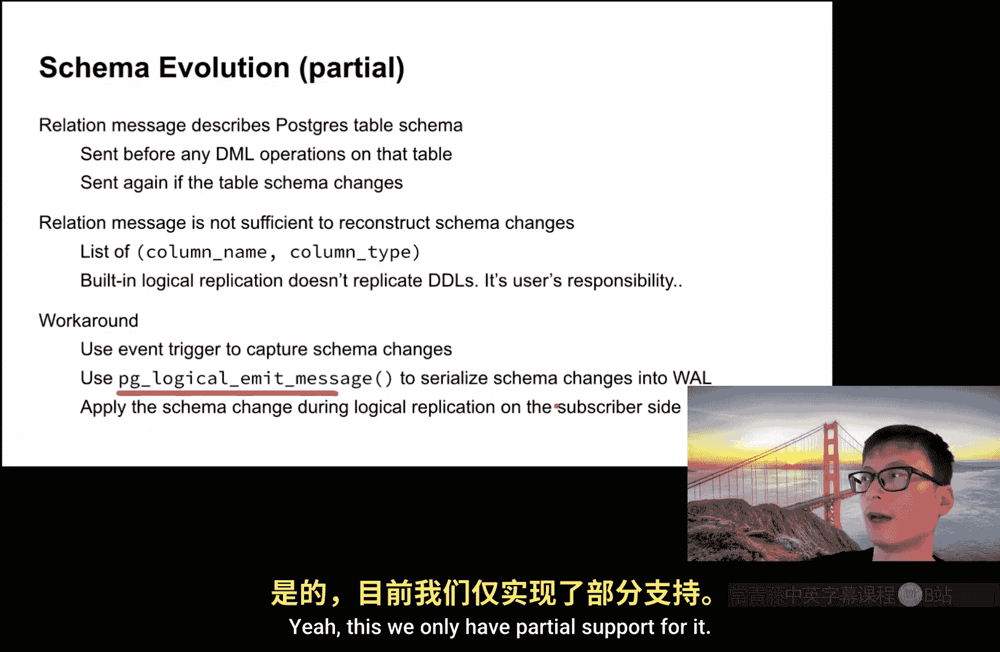
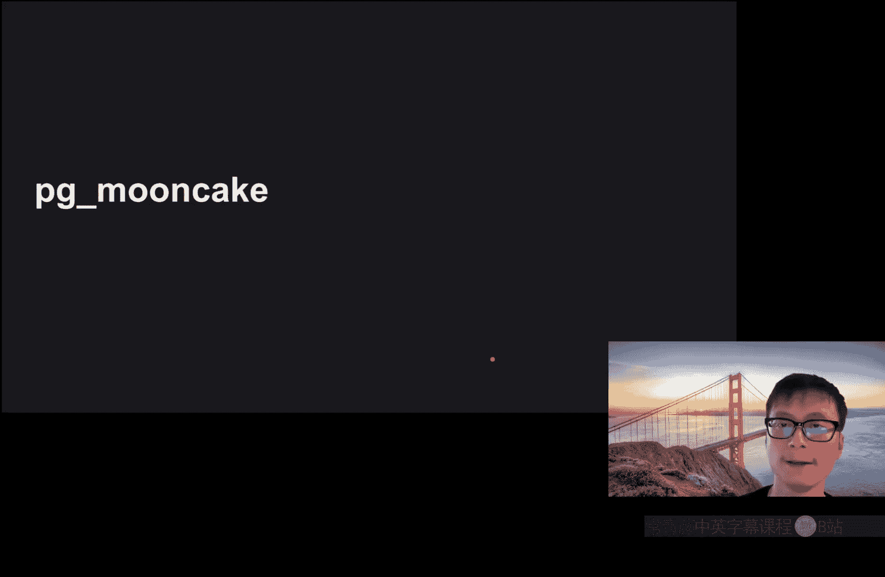
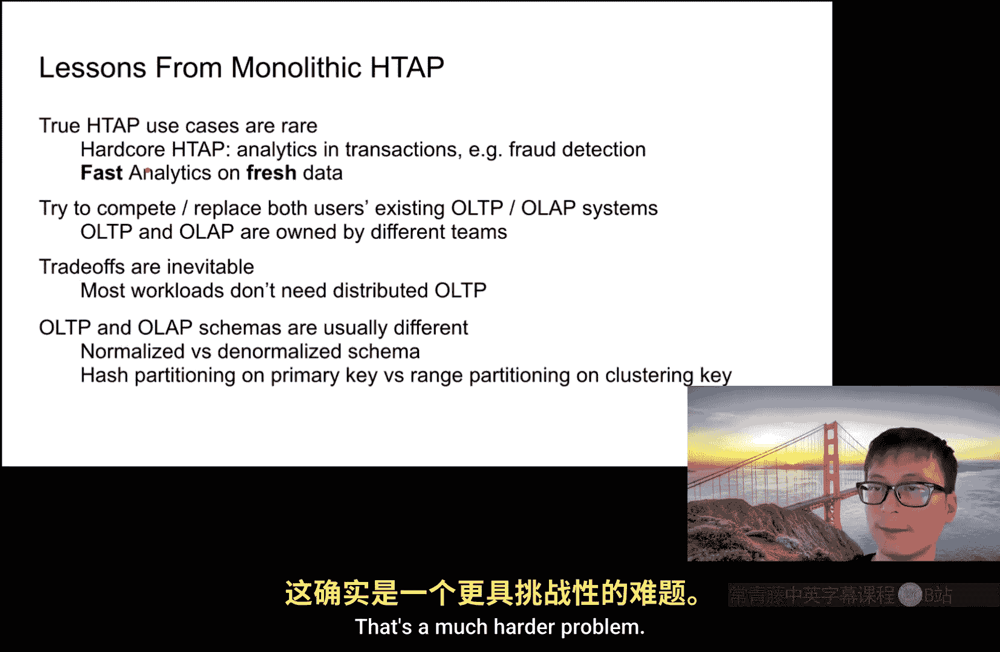

# 卡耐基梅隆【中英⚡未来数据系统研讨会系列｜Fall 2025, Future Data Systems Seminar Series】 p08 P8 Mooncake： Real-Time Apache Iceberg Without Compromise (Cheng Chen) -BV17pidBkEzr_p8-

But just one for my peaces that pass， God blessedless they friends。

And check it out now I pound because it's mad brown。

Y it's time for Carnegie Mellon University's future data System seminar series This seminar is made possible by at Che Che he was the cofounder of Mooncake which he's happy to say we've got acquired last month by Databricks congrats and he's here to talk about the Mooncake extension they were building out in Postgres to interoperate with with iceberg that's now being put into the Data Databricks infrastructure So as always if you have questions Che while he's given to talk feel free to unmute and fire at any time that way he's not to himself for an hour by himself on Zoom and so much for being here the floor is yours again congrats on the acquisition I'm glad you could still make it。

Yeah， thank you Andy。 yeah， hi everyone。 So I'm Chen。

 it's a honor to be here today and share what we are building at Mooncake Labs。😊，So a few months ago。

 my cofounder wrote a blog post titled H type is Dead。

 and that sparked a debate in data community about the future of hybrid transactional and analytical processing。

So the dream of a single monolithic H type engine that seamlessly handles both transactional and analytical workloads hasn't played out as many of us hoped。

But the need for faster analytics on fresh transactional data hasn't gone。 if。

 if it's not stronger than ever now。So today I will work through how to build a composable H type stack。

 one that bridges together your existing OLTP system and your existing OAP engines designed for the cloud error and then powered by open data format。

Yeah， as Andy said， if you have any questions at any point。

 just feel free to interrupt me and drop or just drop them in the chat。So a bit about myself。

 so I joined single store right of school and spent many years on the core execution team there building a monolithic H type engine。

And last year， I left single store with two colleagues to start a company called mooncake Labs。

 So yeah， don't tell me why it's called mooncake。 There's a story。

 I just think of that without selling mooncake。 So the goal of the company is that we want to do this in a in a way new approach。

 We want to build H type in a composable way。😊，Yeah， I will explain very soon what that means。

So just last month， after a 13 month journey， Mooncake was acquired by Databs。

 and we are starting a new chapter with a lake B team at Databricks。

So Lakebase is a Databriricks Postgres offering。 It's serverless and deeply integrated with the lakehouse。

😊，So let's look back to the history in the good old days。

 so one relational database can do everything transaction during the day and reports after the hour。

However， although businesses had more data and asked tougher questions。

 the database began to this kind of one single database has begun to show its limit。

 OL TP requires microsecon inserts and point lookups。

 While O app demands full table scans and large scale aggregations。

 So this creates a constant contention and poor systems in different of in different directions。😊。

So on the analytics side， column store， column storage and vector execution emerge to accelerate the scans and aggregation that' is common for analytics workload。

This changes both how data is stored and how quaries are executed。

And the cloud fully changed the game， separating compute from storage enabled fully serverless elastic analytics。

The lakehouse then unified the storage layer。 Now data leaves on an open format on shared object store and multiple engines like Spark channel。

 etc cea can process the same data for ETL BI and AI all in a single shared data layer。However。

 on the transactional side， early NoSQL systems tries to address the scalability limits of relational database。

 but it gave up transactions and consistency。And new SQL systems try to put them back while s horizontally。

But despite a few successes， it never became mainstream as analytics rapidly moving to the clouded warehouse and the lake house。

So where this leaves us is a world like with two distinct systems。

 so one is optimized for transactions and the other is optimized for analytics。

And the users are forced to manually duct tape them together with complex and fragile data pipeline that takes hours to think and sometimes transform data into something that's hard to read。

So that bounds up a natural question。 Can we do， can we do better。So the original vision of HT。

 what I call here monolithic HTap was to build a single engine thats capable of serving both OLTP system that can serve both OLTP workloads and OL of workloads。

And we actually spent the last decade as a single store working towards their vision。

So at single store， there is only one copy of the data and one engine that powers both transactional and analytical queries。

 hot data stays in the in memoryory low store while cold data lives in the own disk column store。

The comb store was engineered to be operational。We added signal indexes and a better sability to this comb store to support fast scans。

6 filters and aggregations。And the system is fully distributed。

 it can scale from a single node to to thousands of nodes。

It also supports like semi structure Json data and can integrate search and full text search vector search seamlessly into S。

So single store is a strong and versatile system， but you never achieve the attraction we hoped for。

 And ironically， if you ask many former single store engineers today。They will just tell you。

 don't build a H system and don't build a circle。So this is a better lesson I learned from Singlestore。

The better lesson is that2 H type is extremely niche。So it's the really hard HT system。

The really hardcore H use cases that really requires a monolithic H type engine that both workloads runs in the single engine like single store is you need to run analytics inside transaction。

So for example， one typical example of this is fraud detection。

 you want to perform analytics in real time within the transaction and you want to use that the result of that analytics query to decide whether to approve that transaction or not。

But most of the works， most of the workflow that involve both OL TP and OL are not like that。

 There are more people are more interested about running faster analytics on fresh data。

 and the goal is to make smarter and faster decisions。 And for those。

 you don't really need a monolithic H type engine。😊，So that's a market side。

 So from the engineering standpoint， building a monolithic engine also puts you in a very tough spot。

 you are competing with both the best OLTP engines and also the best OAP engines while and are trying to replace both of them and replacing users existing OLTP and OLAP system that usually have tons of workload already relying on that。

And these challenge is even compounded because O OL TP and O lab are often owned by different teams within the same organization。

So moreover。Creating a single engine also forces trade offs， compromising both workloads。

 and you are just compromising for a niche use cases that most users never will use。

 So it's just they are hoping that maybe one day they will， they will be using it。 but most of time。

 they will never use it。And finally， OL TP and O lab schemas are usually different。

 So using the same copy of data like single store does。

 some in in many case doesn't make sense in practice。😊。

So when we look at the real windows in the market， so Postgres is winning on the OTP market and cloud data warehouses and lake house areminating for are the dominating usage for the data team。

So Postgres remain the most left OL TP databases， thanks to its reliability and openness and a rich ecosystem for extensions。

 There are thousands of extensions。 You can pretty much find anything you want just with a。

See offer extensions。For all the no OL TP workloads。

 Lakehouse built on top of open formats like iceberg and Delta。

 they are emerging a unifying data layer， enabling both analytics and AI workloads to run across multiple execution engines on the same underlying data。

So what does H type really mean if the OLTP is dominated by Postgres and the data is dominated by the lakehouse？

So my understanding is that it's not really about building one magic engine that I try to replace people's left Postgres and lakes。

It's about giving that is early effect。 Let's build something that tries to bridge existing O TP and O app systems so they can work seamlessly together。

 And the goal is to simplify the usual data stack。So in that sense， I think in。

In more realistic in the more realistic sense， H type is not really a new database catalog。

 it's more of a feature of your data stack that if you want to turn it on it can enable real time analytics on your transactional data。

So this is what we proposed as a composable H type stack at Mooncake。

 so users can continue using their favorite OLTP and O app systems。

 it can be Postgreed but can even be like My for transactions。And for the for the Ana size。

 you can use any execution engines on the on the open data format provided by Lake。

So what Mu adds to this is a real time layer on top of Lake holes。

And enables subsequent ingestion from O L TP to O lab。 And we also allow， like。

 directly read from O L TP for fresh analytics。So this is the feature you can turn on demand for your data stack。

So this makes our decision to join Databririck simple。

 so Databricks is already a pioneer in Lakehouse， offering the best in cars buck for massive scale ETO and analytics and their recent acquisition of Neo adds serverless Postg offerings called Lakebase complementing the Lakehouse St。

 and they also have unity catalog that provides a unified governance across both the transactional analytical data。

As Mooncake team joins Data breaks to help build a stronger bridge between the lake Ba and Lake House。

 continuing our composable H type vision， but at a much larger scale。So in the following。

 I will do a tech deep dive into moon cake。There are two components we build。

 Both I will talk I will cover moon。 This is the real time layer we build on top of iceberg that also enable the subsequent second intion into iceberg。

I I will talk about how we build this incrementally one step a time then the next part I will talk about PG Moonke。

 which allows direct fast analytics in Postgres and integrates mulink and when combined with Mulink it provides a complete H type solution directly inside your left Postgres。

So this forms the composable each type framework and while the talk here are focusing on Postgres and iceberg。

 but the same idea applies to other OLTP systems and all app systems。So let's look at the moon first。

So when building a real time inges into iceberg， the challenging actually isn't in the ETO itself。

 the real difficulty comes from the fact that the destination a system simply isn't real time enough to keep up with the source。

 the OLTP transactions。So our goal here is to support both streaming and batchlor rights and for both insert。

 update and delete， and we also want to make the destination table always optimize for read。

And the latency from the data is generated from the source from the OLTP Postgrel site to when it's applied and readable on the destination's an size needs to be extremely low on the order of sub to be truly considered real time。

So there are several difficulties for each of them。So for streaming rights。嗯。

The existing CDC tools often rise to the destination for every single source right。

 This creates thousands of tiny parque files， explodes the metada and makes the reading very very expensive。

 and this also requires frequent compaction， which is also costly and disruptive。

And for update and delete， this makes the problem even worse， many of the systems。

 many of the CDC tools that directly just write equality deletes。

 so what isequ is they just write like which which key are deletes and they are now actually writing the position so they require the readers to handle them at read time to join this deletes and the actual data and query time this further slows the read down。

So batchlor rights also have their own issues， so most systems will wait until let's say you do a large big insert insert into the Postgres。

 Most of the CDC tools will wait until these large batch rights transaction has been committed and only then they start they start to stream the changes and applying the changes。

 So this introduces unbounded latency after the source has been changed and the latency can be proportional to to the size of your rights。

So Muni is designed to solve all these challenges by adding a real time layer on top of iceberg。打了。

So yeah， Moon is built on top of like previous engines inspired by many previous work。

 So during the short term of mu labs， we actually rearchitect our our design。

 So our previous version PgM v0。1 it works very similar to other CDC tools。 most of the CDC tools。

 it basically handle the right。 it basically only allows like batchchelor rights and but everything but we we wrap everything inside Postgres。

 So every time the Postgres does a right batchlor right and we we we also do a right make a new commit inside Postgres。

 So it it can only handle batchchelor rights。So this kind of only works well for casual data warehouse use cases。

 the only good thing it adds is you can do everything inside Postgres， so it's easy to use。

And when we try to sell this， some users try to use it for streaming rights because they are just expecting everything it just Postgres and it didn't go very well and this actually leads to us why we rethink the architecture and try to include this age type experience into it。

So we also draw inspiration from TDB。 So TDB is another H type system So unlike single store。

 TDb actually maintain two copies of data， one copy for transaction and another copy for analytics。

 and they have realtime intion from the low store to the comb store to keep them in sync but TDB also has their own limitations。

 it forces your comb store clustering key to match the low store primary key。

 which is very restrictive for comb store。And ultimately， it's still a monolithic H type engine。

 So they are claiming that you need to use Ti KV to replace your OLTP system and you need to use Ti flash。

 which is clickhouse fork to replace your O lab。So another relevant project is Fl。

 So Fl forces users to adopt Pmo。 So this is a different lakehouse format。 It's。

 it's one that more real time。 So what moonlink does in contrast is it makes no assumption about the underlying lakehouse is being used and it's composable with like different OL TP and O systems you want。

😊，Yeah， before we dive into the internal workings of Moon。

 let's first look at what the input and output we are talking about here。

So the input comes from logical Postgres logical replication。

 so we can subscribe to the changes of Postgres and we can subscribe to like specific a specific set of tables or the entire database。

So when transactions are wrong in Postgre。The changes are forth written to the war and the changes are written to the war in the order they occur。

And changes from different transactions， they can interleave。It with each other within the world。

And for logical application， Postgres use this word sand process。

 They are going to read changes from the wall and replace them into a reorder buffer。

 This buffer will group the changes by transaction and order them by transaction committee。

So what does that mean that as a result， the receiver。

 what we say is just one complete transaction at a time in the order when the transaction commits。

However， this only works for small transactions for large transaction。

 we definitely don't want to wait until the entire transaction already commits before starting streaming the changes and applying the changes to destination。

 they will introduce unbounded latency。So Postquarel 16 enhance their support for logical progression。

 it added support for streaming large transactions。So when the reoral buffer are fill up。

 So its postg is going to select the current in progress transaction that's largest and sends changes in a streaming block like。

😊，来 like this。So these large transactions can later be committed or aborted。And is。

And at any given time， there may be several large transactions。Inter livinging with each other。

 but along with the usual stream of small transactions。

So one important thing to note here is that the streaming is optional。

 so it's not necessarily turned on。 and even when it's turned on。

 there is no guarantee that you can always see the uncomit changes within the transaction。

 So this is the limitation of Postgres logical application that basically mean that if you really want to build a true H tab that actually you can run analytics within transaction。

 you can do that。 So for Mon， that's fine because our goal is not to run analytics within transaction。

 we just want to run analytics on fresh transactional data。So let's also look at the destination。

 So this is a very extremely simplified version of Lakehouse open format that we are writing to。

 So at its core， it's just data files， mostly parque files。

 but they also support other some other data format。

And the met met datata and also adds metadata to these data files that helps you construct the counter snapshot of the table。

So iceberg and Delta does differently for the metada。

 icem metadata directly list the count snapshot of the table。

 so each snapshot contains the list of data files that makes up the count version。

And Delta does it differently， Delta metadata track the changes like at each time like which files are added and which files are deleted。

This is very simple by version， like there are more details into it。 but in the end。

 it's just the same data file plus some flavors of metadata。 And for us。

 it doesn't make too much differences。😊，So both formats also support deletions in different ways。

 the simplest way is the equity deletes which I just told you the problem with that。

 so with equity deletes the records we only record the deleted keys and rely on the reader to duplicate that every time。

Iceberg V2 improves it by introducing positional deletes。

 storing a separate parquet file that list the positions of loads to delete and iceberg v3 goes further with deletion vector files so using a bitmap to identify which loads in a parque file shall be considered delete and for us for moon we write deletion vector since it's optimized for read。

Cool， now let's see how mooncake works。 And I'm trying to do it in a step by step way。

 So let's start from the simplest case。 The simplest case is we want to support streaming rights with just insert。

 It's a pan only。😊，So the challenge here is that we can't write to iceberg too frequently。

 We need to buffer the last， the latest rights in in a low log and write to the iceberg only occasionally。

But at the same time， we need to provide a consistent view so that the readers can read。

 we need to read at much， much frequently interval compared to the frequency we write to the iceberg to Delta。

So in order to do that， we have to do some kind of union read to serve the data from both the Buffalo and iceberg。

So most specifically， the way we are doing that is we decouple a mooncake snapshots from the iceberg snapshot。

 So what mooncake snapshot does is it's kind of a lightweight snapshot and it can serve reads for union read。

And we take a mooncake snapshot every 500 milliseconds。

 while the iceberg snapshots are only created like every five minutes。

Or or when like when there are enough changes or has oil be accumulated。

 we also take a iceberg snapshot。And mooncakes the iceberg snapshot is taken based on the most recent mooncake snapshot。

So here is the example So let's suppose say we already have an iceberg snapshot with like four。

 Now we do a new insert and when this insert comes comes in。

 we just append it into the in memoryoryarrow buffer。

And the combination of this in memoryory arrow buffer， plus these parquet files。

Will allows us to union read the latest data， the count snapshot。As new loads are getting appended。

 we just keep app them to thisarrow buffer and create moon link and create mooncake snapshots every 500 milliseconds。

And when it's time to create an iceberg snapshot， we just flush this arrow buffer into a parque file。

😊，And forming a new iceberg snapshot from the latest iceberg from the latest Mcake snapshot。Yeah。

 so this is how it works for streaming rights and just a panel only just because the error buffers that are in memory that's sitting inside the Postgres process because that's where the mu extension is or this outside of it so moonlink is by itself a rust binary it can be wrong inside So in P Mu we have like two different ways to deploy moonlink one is just we deploy that as a background worker So it's inside Postgres another way is we just deploy as a standard load of So the P Mu can just attach to it。

Got it so then。Ma I understand you're transitioning from a standalone company integrating those databs。

 but what is the plan， how would you integrate this with like neon？Yeah。

 I think so this separation these two deployments even exist before we joining Data breakricks。

 so Moon is just a single rust library and anyone can just include it inside their binary and in PG Muke we just one way of deploy it we just deploys like background worker in Postgres。

I understand that I'm trying to say like what can you share what the plan is going forward since PG Mooncake is now you know。

 part of Databricks， like how how is operationally Databricks going to deploy this？

Like within Postgres itself or as a standalone service。

Yeah right now since we just join Databricks so they actually already have some kind of forward ETO which does something very similar to the account mu link and right now it's not really we try to deploy Mo link inside Dataricks it's more of like we are trying to add more capability as text we develop add mu link and try to enhance that thing awesome thanks。

Yeah， so this is streaming rights and a panel。So now let's add support for update delete into these streaming streaming rights。

So let's still first look at the source Postgres uses replica identity to identify a low when updating to replicating updates and deletes by default。

 the replica identity is just the primary key， but it can also be set to a unique key or even like the entire low if suitable if node there no suitable exists。

 so the goal of that is just to identify the low so youll know which law to delete update。

So for replication， delet will send the old replica identity and to indicate which loads to remove and the update will send both the old replica identity and also the new table There is also important note about toast columns To column stores like large value that don't fit in line in the hip page when replicating update when the toast column is unchanged Postgres will by default optimize that and only indicate that it's unchanged without actually sending the actual toast value like this。

So currently， we simply just instruct Postgres to send in Tao by running auto auto table repa identity Fu。

 but this can be optimized in the future。So the difficulty in update delete is we need to translate this replica identity。

 these equality deletes in Postgres into a positional deletes that's better suited for efficient reads。

To do this， we need to build a hash index of this hash index is mapping from the hash of the replica identity。

 not， not directly from the replica identity to the to the position of the low。

 which is just a pair of far I D and low I D。So we need to build this hash index for both the the in memorymory arrow part and also the on disk parque part for the in memorym arrow part。

 we just use the in memorym hash table to index it from the par part。

 we use the disk optimized hash table to index it。And the parque index are stored in the iceberg puff files。

 so it links this index to the correct iceberg snapshot。

 So if anyone else also wants to read theh the hash index， they can also use it。

So because the key is just the hash of the replica identity。

 so the hash table is really small and it can we can catch the encing on local disk。

So an important optimization here also answers why we can just use the hash of the repa identity is that because we are simply miow in Postgres。

 so if Postgres says that a low can be did， that law must exist。

 this means that if any time we search for the hash of the repa identity and find only one low。

 this law must be the one we are looking for。So unless there is a hash correlation。

 it just oneh hash table lookup to find the law， we don't need to touch the actually compare the replica identity or need to read the data forms。

So the O disk index is structured as the index LM。 So if we have had a single hash table covering the entire table。

So think of the other way， if we have a single hash table covering the entire table。

 then every table update will require updating the index。 On the other hand。

 if we had one hash table per data file， then each lookup would require scanning all the indexes。

 which is very inefficient。So with the index LSM， each index is built for a subset of data files and only needs to be updated when those files changes。

 so this provides a good balance between write and read performance。

So this approach inspired by single stores index， which use the same index LM structure for different types of signal index。

 including hash index， Ft index and back index。And the hash table read is disc optimized。

 so each individual hash table， each hash roofup is just two，2，6。So now let's。

 let's see how updated this is。Works。So with these building blocks in place。

 the key idea here is to just add a delete log。So。When update deletes are replicated from Postgres we first append the rep identity。

 the Ed deletes to the delete log， and this happens in the foreground and is very fast in the background the Mke snapshot will translate this Ed deletes into positional deletes using the hash table then the Iberg snapshot updatess the deletion vector with the positional deletes from the Mke snapshot。

So for example， imagine we have an iceberg table with with with four rows。 First。

 we add two new rows。Which are buffered in the arrow next we delete one low from from the buffer This delete is initially recorded as a equality delete in the delete log。

 and then the next mooncake snapshot will translate into a position delete and pointing to the low in the buffer。

Then if we update low in a par for， the old low is also marked as deleted。

 we do the translation pointing to this low。 and at the same time。

 we also add the new load to the data to the data log。And in the following iceberg snapshot。

 this positional delete and also the data file will be flushed into the deletion vector and the Pa file。

So the next thing we do we are going to add support for large transactions so to handle them we need to enable logical replication protocol V2 so that postgresss can stream in progress transactions We also need to apply these uncom changes on the fly ourselves。

To do this， the idea is basically， we may turn a separate low log and a delete log for each large transactions。

 and we also allow parque files to be flushed in the middle of the transaction。

 rather than waiting for the entire transaction to commit。 Otherwise。

 a large transaction will just over overflow the memory。

So one important details here is that when we translate the equality deletes into position deletes during a Mooncake snapshots。

 this translation operation needs to be global。So for example， under the read committed。

 imagine you have a large transaction that's running and also a small transaction commits in the in the meantime。

 this large transaction should now be able to see these newly committed laws from this small transaction。

So this deletion transaction must take both this large transaction and large and small transaction into account and needs to be global。

So oftentimes we are creating a chrom store mirror of a Postgre table that OE contains a significant amount of data。

 so we need to perform an initial table copy in a way that's consistent and parallel。

So the workflow is as follows。 So first， we create a logical replication slot and also we expose the snapshot from it。

 Then we start an parallel workers each responsible for copying a slice of this table。

 and they are sha by the Postgrel C T I D。Each of the work will yeah。

 so these workers will read from the expected snapshot exported from on the first part。

So they will all see a consistent view of the table。And once the appar copy has been finished。

 we begin the replication from the slot and applying incremental changes。

 so the entire table is a consistent meing。So we also need to be able to recover from crash。

 So one naval approach that we tried at the beginning is to rely entirely on Postgres war。

 so basically we would we will only acknowledge back to the Postgrels air and that has been flashed to iceberg that way。

 the logical replication slot never advance past the ice what the iceberg has persisted。

 So after the crash， we can just ask Postgres to resent all the changes that we haven't seen and just reply them。

But this actually creates the issue。 we end up having the logical application far lagged behind the count L in Postgres。

 and this can block the Postgres from shutting down。To address this， we actually need to add a moon。

 a writer hell log ourselves。And we acknowledge the S back to Postgres as as as it' written to the mooncake war。

 not only after like it's flashing to the iceberg。 So this lets the Postgre replication slot to move forward without being held back。

So one note here is that mooncake war is written after the Postgres reorder buffer so the order。

 the record order isn't the same in Postgre war and during recovery。

 we need to actually carefully reconcile these three things。

 the last the latest mooncake snapshot and the latest iceberg snapshot， the mooncake writer ha。

 the Postgres wall and make sure everything stays consistent。

So another thing that we also need to run back mergers to periodically compact small data files and index files into larger ones。

 So compaction is heavy。 But the issue here is that compaction is a heavy long runningning transaction。

 and it should not block con rights。 So， for example。

 suppose the Iberg snapshot currently consists like two par files。K。And now。And now we。

 we start a module process to start comparing them into in into one。 So while this is running。

 there are content insert and updates coming in and new moon snaps have been taken for for for this。

😊，And when this compaction finishes， we can just commit this compaction because it will conflict with the delete records in the delete log because the delete delete are still points to the previous low positions。

To handle this。 so we when we come these two parque files。

 we also build a remap table that maps the old loads to their new position。

 And before we committing this compaction， we quickly work through all the deletes in the delete log and rem these deletes to the new load location。

And this remapping process is fast。 So now this after this remapping。

 this compact compaction can commit。😊，We can even further optimize this by breaking this large compaction transaction into smaller incremental ones。

 we haven't done that in a accounting。It's also important to define a clustering key on the comb store。

 whether that's a hash key or thought key or some something more smarter like a liquid clustering。

This will allow us to skip fast more efficiently at real time we are just in the middle of building this when we get acquired and now when we join districts we can just take advantage of the clustering capability they already have。

So now let's putting it all together。 So Moon link adds a real time layer on top of iceberg through the buffering and the indexing。

 So we buffer both the loads in thearrow buffer and also the deletes in the in in the in the positional deletes。

And also build index to make the translation fast。And it supports both streaming and batch ride with fast update and delete support。

 the engines can just directly read the historic data directly from iceberg。

 but if they want to read the latest changes， they can do a union read directly getting it from Moon with subse latntency。

So in the foreground we only consume the Postgrel CDC and we only append the new loads to thearrow buffer and record theequ delays into the delay log。

 so this is aqui pass and extremely fast All the heavy works happens in the background。

 the mooncake snapshot， the iceberg snapshot， the compaction and none of them will block the replication in the foreground。

So like can you're writing out parquet files that can contain data from uncommitted transactions。

 right？We only do that for large transaction Sure I yeah， I understand that like。

 but it means like you're still still doing it someone has a largest transaction， you have to do it。

And then the。The if that transaction then fails， the I guess， deletion vectors saying。

 ignore that thing that's been removed or where do you keep track of like。

YouI wrote a proque file that has uncommitted changes。The transaction then fails。

 How do I then rectify that I shouldn't read those changes。When。

 when parking filess are flushed for large transactions。

 these pocket filess are not committed and we are not actually writing to any of the moon moon cake snapshot or iceberg snapshot。

 It's not valid to write it。 Gett it， Okay， okay， makes sense。 Okay， We just track them， yeah。

So does that mean that like？A。For the large transaction， if it does commit。

 you then push that parquet file into iceberg。Yes， actually。

 the the pocket file is already uploaded to S 3。 So the only thing we do is just basically move the。

😊，N the the pass of the packet file into the metada to track it。 Yeahep， got it。 Okay， thanks。

So one last thing about that is a schema revolution， so when the schema of a Postgres table changes。

 how can we capture these changes and apply them to the destination icePo table？So， in fact。

 capturing schema changes in Postgres is not trivial。

 Postgres sends a relation message in logical application that include the common names and the column types。

 but that's not enough to fully reconstruct the schema changes。

So this limitation does not just applies to us， but it also affects Postgres building logical replication when the source table schema changes。

 the replica can draft from the primary。So one one workaround we can do is to use events to capture the schema changes on the tables we。

We are interesting， and we serialize these schema changes。

 use this special peological em message to record that on the wall。 and then on the subscriber side。

 we can decsseize these changes and apply the schema changes to the iceberg。Yeah。

 this we only have partial support for it。

Yeah， okay， so this is about moving a real a real time layer on top Postgres。

 which allows us to do fast subsequent interesting from Postgrels to iceberg。Now。

 let's talk about PG mooncake。

So PG Muke enables fast analytics directlying in Postgres， and when combined with moonlink。

 it delivers a composable H type experience。So the usual interface is like。

 so let's suppose the usual O have like a Postgres table， regular Postgre table。

 Now they can run call mooncake do create table and specify in the Com store table。

 And this is a low store table saying that I want to create mooncake table at the middle of the Postgreed table。

The full syntax table。Also， allows you to。Specifies， sorry。

 specify the where this Postgres table reizing。 It can be a remote one。

 You can rep meing from a remote postgres like RD S。

 You can also con table table options such as where to store the iceberg table and how it shall be clustered。

And once this iceberg middle has been created， it just behaves like regular Postgres table。

 you can even join it with other Postgrels heap tables。The only thing is that you should。

 this is a read only that you should do the right into the Postgres table。

 but do the read from this iceberg table。 You can also do the read from the Postgres table directly for transaction workload。

It might be possible to build some kind of syntax sugar that you also allow rights into this Com store table where it fades back to insert into the remote or local Postgres table。

Yeah， on the performance side you should expect the performance on these iceberg tables to be comparable to techD on parque files and that's super fast on Clickbench you can see that these antic quaries can be up to  a thousand times faster than running the same queryrry directly on Postgres tables。

Yeah， there actually has been many attempts to bring all up to Postgres。There are some。

 so those early earlier efforts tries to use their own proprietary format。

 their proprietary storage and execution engine， but they are usually much slower than purpose build and analytics engines like dark D。

 So as as can be shown from the click clickbe。So in the past year。

 there are several projects have tried to embed back into postgs。So P G do D B。

 So this is one that we actually build on top。 So， yes。

 PG monkey is actually a sub extension of P G like D B。 will use that for execution。

 So P G likeD B is the official Postgre extension to use do D B inside Postgres。

 This is built by the collaboration of the hydro team， A Y C startup and and a mother duck team。So。

 but they are only focused on execution and they don't handle the storage。

 what Peter Muke adds to it is a handle the storage。

So we also have this PG lake that's from country data that was recently acquired by Snowflake。

This is their offering is similar to our Vi point1。 It only handles batch workloads。

 So it's mainly suited for casual data wellhou in Postgres。But their offering is more mature。

 like more production ready in terms of analytics。So our P G mooncake， on the other hand。

 we build on top of P G like D B， and we add a storage layer on top。

 and we also integrates more link。 So as a whole， we actually provides a full age type experience that user actually want inside the Postgres。

😊，Now， let's first look at why we want to embed activity。

 why so many people want to embed activity inside Postgres。So what what is like DB。

 So D DB is like SQL light， but for analytics， it's designed to be embedded directly into a host process。

 It's incredibly fast for analytics ranking at the tops in benchmarks like Clbench。 and even better。

 its SQL syntax is very close to Postgres， which means there are few incompatibility issues to worry about。

😊，And both Postgres and activity are highly extensible。

 which make this approach possible without actually modifying their source source code。

So in Postgres， extension can register a new table type using table access method。

 hooking to the planner and executer to change the query behavior or override the DDL through utility command groups and inductDB。

 you can also do something similar you can write a storage extension to register a new catalog and you can customize the table planning and execution logic。

And this is just a brief overview。 There are way more things you can do way more extension points in both systems。

 they are very versatile。So as I mentioned， the Pg monkey is built on top PG do BB。

 We use PGductD to as an execution to use DD to run Postgrelsqueries。

 So let's first describe how PGduct D works。So at its core。

 so PGductDB federates Postgres quaries to doDB， it hooks into the Postgres planner and when it sees the Postgres query。

 it rewrites this query intoductDb syntax and then as the executecutor run this inside the inside doDB and then stream the result back into Postgres and then converts this result back to Postgres types and return to the user。

So it's at its cost， just a qua federation。So PGductTB also allows joining with regular Postgres tables。

So this is done by rewriting the Postgres tables of schema tables into aductDB table under a special cosmeticsmic catalog called PGductTB catalog。

So this Pg activityB catalog is registered byductTB storage extension by Pg activityB。

So this catalog， what this catalog does is it feds the scanning of this Postgres table back into Postgres and uses Postgres to scan this table。

And P like support scanning this Postgres table in parallel。

 and they can also push down the filters into this table scan and use this Postgres index to do the scan。

However， yeah， the adds this very cool execution on of execution into Postgres。

 But the thing that's missing is that there's no storage。

 If you just use the activity to query the Postgres， it doesn't make things much faster and。😊。

When compared to just running the same query directing Postgres on the same table。

 D DB really shines when the data is already in corner format if。

 if you you can directly call in the parque files， for example。So currently。

 the Pduct D B feds the entire query into entire post into introductionduct D B。

 so you cannot do some kind of partial query push down。

So there are many feature gaps and semantic difference between Postgres and DDB。

 so not every Postgres query can be wrong in darkDB。

 It will be much better to push down only part of the query to darkDB。

 only push down the path they can handle and excluding the rest in Postgres。

There's already a common PR to add support for In select for PG likeD B。

 and this P G lake extension I mentioned earlier from country data has better support for this partial pushdown。

So now let's talk about the P G M。 So P G Mu solve the problem of data are not already in the commonal format。

So what it does is it adds a table access method for for moon cake table。

So when you call this call monkey create table， it creates a mirror。

 a real time iceberg mirror of your Postgres table， and it's named by C。

You can also do it with either local table or remote table and PG Moonke achieves this by by using Molink PG moonke either run this Mo link as a Postgres background worker or runs like as a standard load service。

 you can even like have different Postgres or connecting shared to a shared moonlink instance。

And this mu link will subscribe to the Post logical creation of those source tables and handle the actual meing and keeping the iceberg table in sync in real time。

 So Fuji monkey uses mu link for the right pass。So for the read on the read pass。

 P mooncake instructs PGductD B to rewrite the mooncake tables into into a mooncakes into into a table inside the mooncake catalog。

 This mooncake catalog is registered by our， our mooncakesductDB extension。

 It's actually a standardal loadductD B extension。So when a table scan is performed。

 it just talk to the moon link and ask for the counter snapshot using an RPC call。And this table。

 this table matter data will include the count data files。

 the count delete files and all those buffers like the arrow and the and the position deletes。

 And then we are going to use like DB's parque scan to re modify that to handle all of them and creating the latest view presenting that to the user。

😊，So we want to give users more users a true H type experience。

 so we we need more than just eventual consistency。

 specifically what we want to do is that we want to aim for a sort of session session level consistency。

 that means that if you open a Postgres connection and you write to a table。

And now if you do immediately select from the Com store table。

 you will want the user to immediately see the changes of there might be instead of eventual consistency。

So Peter Muke achieve this by passing the last commit ASN to Moonlink。

 and Mulink Mulinkk will wait and only return only return the Muke snapshots that after the request ASN has been applied。

And because moving is super fast， even after a large write。

 a select can be fulfilled in subsequent second latency。

 just like you would expect for a regular Postgres table。

So it's important to note that because the limitation of Postgres logical replication it can capture all the oncom changes。

 so full age type analytics on oncom data is not possible。

 but as discussed earliers not that use case is not our goal， it's very niche。

So because mooncake tables is treated as the logical table rather than individual parque files。

 we can track metadata and statistics at both table level and for each data and low groups。

 this allows us to skip in relevant data during the queryrry do for skipping more effectively even outperformingductT on parquet。

So this was tested back in January with the older version of darkTB。And from P Mugi。

 weve adopted a very modular。Design principle。 So previously。

 P G Muke had to actually hardflk the P like D B， which made the maintenance very difficult。

 In the latest version， it's now a sub extension of P like D B。

 We need no code changes to P like D B at all。And scanning the moon cake tables induct T B is also packed up。

By itself， in a separate activity extension。 and this extension can be either used stand by itself in a standal load activity to to query mu link from back D B。

 or you can use it from Postgres in the context of Postgres and PG mooncake。

 So it's it's very modular。And the same modular design principle as applies to mooncake。

 enabling a composable H framework。 So while this talk I'm mostly talking about like Postgres iceberg。

 the mooncake design also supports other OLTP system and Lake format， such as My and Delta。 In fact。

 we already added support for inges from Kafka and event streams like OT and the execution engine is also not limited to darkTB。

 We actually already supported Apache data fu， and we can even leverage Spk as well in the future。😊。

So I think this is a very exciting time to rethink OLTP and how it can integrate with the lakehouse。

 So the lake base is still in its early days， and there are many open problems to explore。

 and moon Mucake provides a way for the ETL。 But can we also do the reverse ETO， like。

 can we create a Postgres tables from iceberg table or Dta table more efficiently。😊。

There will also be an interesting thing when we try to bridge these lake base and lake holes。

And on the lakehouse side， we can do data sharing。 We can share data on the lake House cross organization。

 but can we also do the same thing as the Postgre side。

 Can we share the Postgres tables across different organizations。

The analytics words are moving towards open formats。

 but can also derive open format for OLTP with the open OLTP format。

 we might be able to run some of the Postgres related workloads outside of Postgres itself。

 For example， we can run some of the ETL。 we can directly convert into the open OLTP format。

 run everything outside of the Postgres using using Spark， for example， much much faster。Also。

 on the Postgres side we have index build on Postgres。

 but can also build second index on lakehouse to serve lookups and search workload so we don't need to prepare the gold data in Lakehouse and load it into second another engine to serve it Now we can directly serve from this lake Can we do that。

And also， with both with OL TP and OL bridge through the composable H type layer。

 now can we implement some kind of smart core roing to load between these two engines。And finally。

 can we leverage some kind of something like unit catalog to build a universal data governance that across both transaction and analytical data？

Yeah， thank you for attending my talk If you have any questions about mooncake after this talk feel free to ask in our De Sck channel I'm also encourage you to considering joining Databreakricks and the lake B team Let's build a future data system together yeah thanks。

I will clap behalf of the audience。 Shane， thanks for much doing this。

 We have time for a few questions。 if you want tomute yourself far away， go for it。😊。

So if you go back to the previous slide。When you have the sort of lake piece and likehouse。

 So should I understand that moon cake， look with the moon link piece。

 that's like that's in between the two of them， right。

 like you' you're you're you're positioning this thing as like this。I mean。

 I understand that it could run as a worker directly inside Postgrads。

 but if you're saying I want to start connecting with Kafka。

 I want to start connecting with open telemetry stuff like。

And and then actually guess the linkhouse doesn't doesn't matter either we like whatever whatever the query engine is。

 like in that environment， it has to be its own sort of middle service like it can't be。

Like is that your vision how you want to position this thing？Yes， yeah， we definitely focus。Yeah。

 we' definitely not just focus on the Postg side， and we actually have like more focus on the on the Lakehouse side。

But I think yeah， as one thing you said， it can be a middle will， but on the other hand。

 I think as I mentioned earlier， I think for things like this in。

 its not really the hard part is not really just about the in like the middle part。

 I think it's sometimes it's you the destination is not real time enough。

 You want to build a layer on top to make make that thing more real time。

 So will be more something like like something wrapped on top of lakehouse。

 It's kind of manage lake house。Something built on top。 So， in fact。

 so while we are already building this E TO， so。Before we are getting acquired by daybreaks。

 we are actually also discussing internally。 Try to build some kind of indexing layer on top of the lake house and try to directly serving serving from the lake cost。

 So in that sense， it's more like a measured real time lake cost on top of。The already existing ones。

Got it。 Okay。 And then when you had the sort of the comparative analysis of the existing tools that are out there and there's Citus。

 Microsoft bought those guys， that was shared nothing。 that doesn't exactly matter what they were。

Which you know what you guys are trying to do Swarm 64 they were FG accelerator and then they got acquired by serviceNow then now it's in Rapttor Db or whatever service Now thing I。

I think it's all software based， but again I think of those systems and they other the tasks expertiseisse。

Like with those guys， you know， they're intercepting the queries sort of similar to timescale and running off to like separate a column store。

I mean， in some ways， like you're not， all those other participantss had to built their own OAP engine。

But now since you guys are coming along five， six， seven eight years later that。

You can take advantage of all people that have built。Things likeduct media data fusion and。

And it's really about the like just rely on that sort of commodity hardware or commodity components to do the query execution。

 the magic， the hard part is really is sort of like。

Reconciling like the change log and maintaining you know materializing the results that you can then feed up to or feed into data fusion or into Postgres as needed that's how you understand what mooncake is trying to do right Yes。

 yes， we definitely don't want to are some we don't want to revent the wheels so we want to use existing excsion engines like data fusion they're already very good Theyre also very good distributed excsion engine that we can federate to。

Go it， yeah， okay。 so that's all the analytics part。 for the H type part。

 we are also trying to solve a much simpler problem compared to the monolithic H type that we are trying to solve back at single store。

 We are mostly just trying to replicate the what what the already does in Postgres。 So that's a much。

 much easier problem compared Comp back then。 Yeah， get it。 Okay question。

Yeah nice talk I wanted to go back to the earlier part of where you started with the motivation and you talked about how Etap applications are you have to look really carefully at what the Etap applications do and you know as a backdrop database community。

 if you look at the traditional transactional vendors like SAP and Oracle。

 they added hybrid stores with row store and column stores in the products a long time ago ran into same types of problems where some of the workloads tend to be problematic so if you go back to that what are the drivers that you're seeing from the application perspective that need this type of Etap that need that speed are these applications that want to。

 for example credit the analytics side and feeding into some AI pipeline because for those it's okay if you don't get quite the right data the fraud example I wasn't quite sure it resonated so I was just wondering if you could talk a little bit about the types of applications。

That are driving the need for the types of things that you described in Moon G。Yeah。I think the May。

 the main workload we are looking at at Mooncake was fast analyticss on fresh data。

 What that means that we want to。Dequease the latency between where your data is generated to where you can。

Run quaries on top and then make decisions based on that。嗯m。はい。Yeah， I don't。

 I don't have like a concrete example use case of that， but it's more of that。For fraud。

 there was like Neilte， this is what Splice machine was still saying。 they were running for visa。

 So they as you're doing the swipe on your credit card。

 they wanted to run fraud detection like at the point of sale。Yeah， but for fraud。

 you actually need analytics in transactions， that's a much harder problem。

