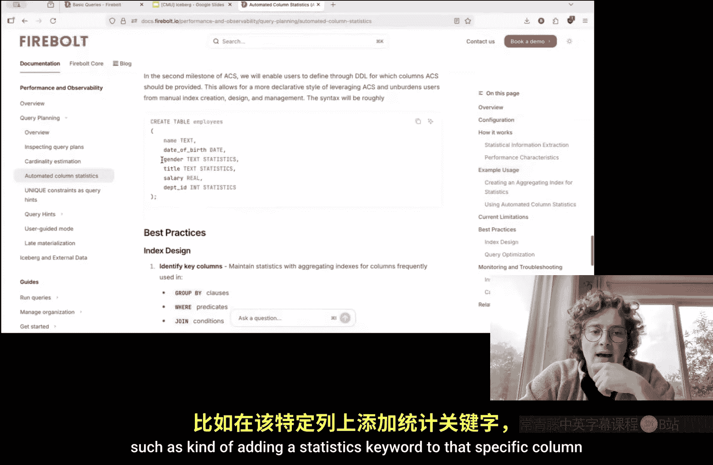
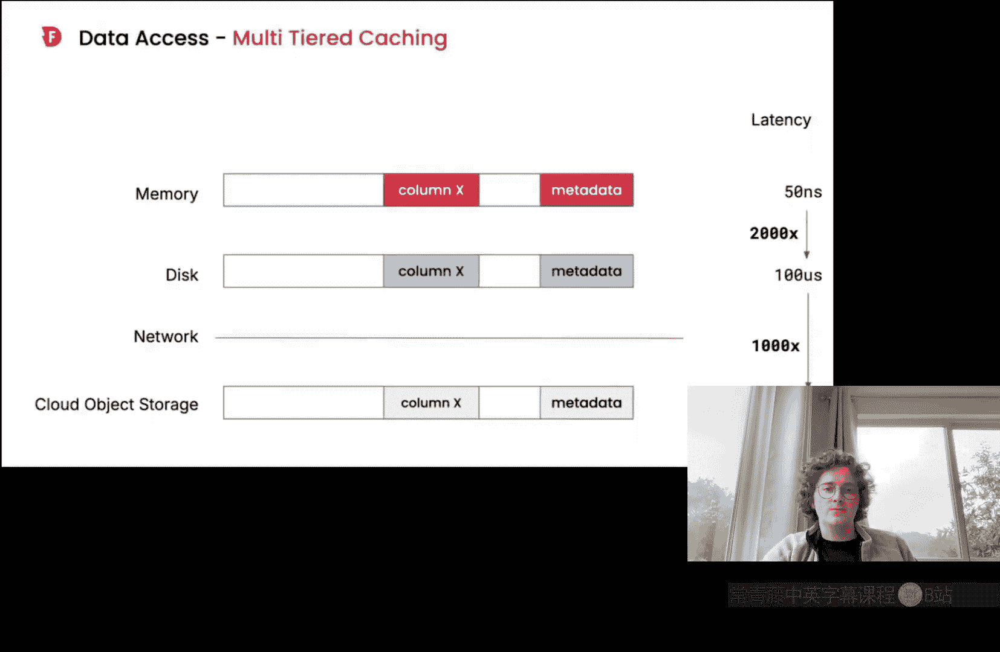
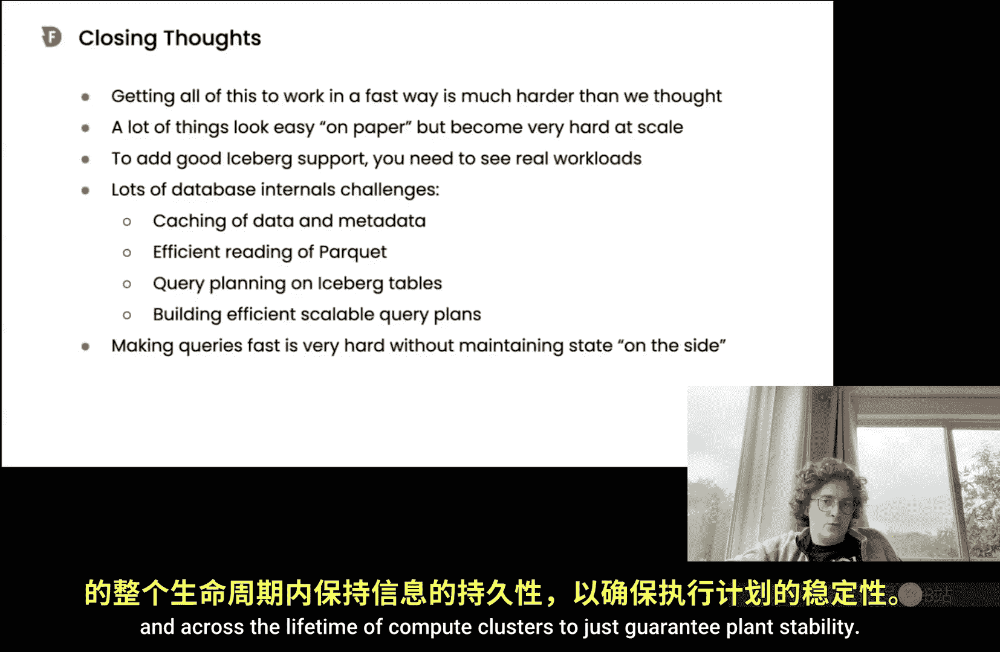

# 未来数据系统研讨会系列：P09：Firebolt：为何在 Iceberg 上支持面向用户的应用如此困难


在本节课中，我们将探讨 Firebolt 团队如何将 Iceberg 表格式集成到其高性能分析引擎中，以支持面向用户的低延迟、高并发应用。我们将深入分析在此过程中遇到的技术挑战，以及 Firebolt 为解决这些问题所采用的创新性策略。

---

## Iceberg 基础概述

上一节我们介绍了本次讲座的主题。本节中，我们先来快速了解 Iceberg 表格式的基本工作原理。

Iceberg 是一种用于分析数据集的开放表格式。它构建在原始数据文件（如 Parquet 或 Avro）之上，提供丰富的元数据层。这解决了传统数据湖（仅有一堆文件）的诸多痛点，例如：

*   **缺乏元数据**：难以确定哪些文件属于一个表，或执行删除操作。
*   **无法进行时间旅行**：无法查询历史数据快照。
*   **缺乏原子事务**：无法保证数据更新的原子性。

Iceberg 通过一个分层的元数据系统来解决这些问题。其核心结构如下：

1.  **Iceberg Catalog**：位于最顶层，指向一个元数据文件。
2.  **元数据文件**：包含表的历史快照列表，并指向当前快照的清单列表。
3.  **清单列表**：一个文件，指向一组清单文件。
4.  **清单文件**：每个清单文件指向一组存储在对象存储（如 S3）中的实际数据文件。

当向 Iceberg 表插入新数据时，会创建新的数据文件、清单文件、清单列表和元数据文件，形成一个新快照，同时保留旧快照以实现时间旅行。

---

## 面向用户应用的挑战与目标

上一节我们了解了 Iceberg 的基础。本节中，我们来看看 Firebolt 要解决的核心问题：支持面向用户的应用。

“面向用户的应用”通常指公司将其收集的海量数据通过数据产品形式暴露给最终客户（可能是外部客户或内部用户）的场景。这类应用要求查询引擎能够在海量数据上提供**低延迟**（如亚秒级）和**高并发**的查询能力。

Firebolt 最初为其专有存储格式构建了这样的引擎。过去一年多，团队的核心工作是将同样的高性能能力赋能给 Iceberg 表。这带来了一系列独特的挑战。

---

## 核心挑战一：对象存储的延迟与 Iceberg 元数据解析




上一节我们明确了目标。本节中，我们首先分析最根本的挑战：对象存储的固有延迟与 Iceberg 多层元数据解析路径的冲突。

现代对象存储（如 S3）具有高访问延迟和相对较低的吞吐量特性。读取一个小对象可能需要 25 毫秒，尾部延迟可能超过 100 毫秒。读取一个 4MB 的对象可能需要 100-400 毫秒。

问题在于，为了从 Iceberg 表中读取用户数据，查询引擎必须按顺序解析多层元数据：
1.  访问 Catalog，获取元数据文件位置。
2.  读取元数据文件，找到当前快照和清单列表。
3.  读取清单列表，找到相关的清单文件。
4.  读取清单文件，找到最终的数据文件。

完成这至少四次对象存储访问后，才能开始读取实际数据。即使每个步骤只需 0.1 秒，加上读取数据文件的时间，总延迟很容易超过 0.5 秒，这无法满足低延迟应用的需求。

---

## 解决方案：元数据缓存与陈旧性容忍

上一节我们看到了延迟问题的严重性。本节中，我们介绍 Firebolt 的核心解决方案：将元数据解析移出查询的热路径。

为了突破 0.5 秒的理论下限，Firebolt 采用了以下策略：

*   **缓存 Iceberg 快照**：在内存中缓存特定快照对应的数据文件列表。
*   **定义陈旧性容忍度**：允许用户为查询指定一个“最大陈旧时间”。例如，用户可以要求读取“最新状态”的数据（延迟低但可能触发元数据刷新），也可以接受读取“最多 5 分钟前”的数据（延迟极低，使用缓存元数据）。
*   **后台异步刷新**：系统在后台根据设定的陈旧性间隔，异步刷新缓存的元数据，确保用户查询在绝大多数情况下无需访问对象存储来解析元数据。

这样，查询可以直接使用内存中的缓存来定位数据文件，实现了亚秒级响应。

---

## 利用 Iceberg 元数据进行查询优化

上一节我们解决了数据访问的延迟问题。本节中，我们看看如何利用 Iceberg 的元数据来优化查询计划本身。

一个高效的查询引擎需要解决多个问题：数据访问、连接计划、数据剪枝、高效运行时和可扩展的查询计划。Firebolt 利用 Iceberg 元数据来助力其中多项。

### 基数估计

以下是 Firebolt 内部使用 SQL 查询获取表行数（基数）的方法：

```sql
SELECT SUM(record_count)
FROM iceberg_files('s3://bucket/path/to/table', staleness_interval)
```

这里，`iceberg_files` 是一个表值函数，它基于用户指定的陈旧性，暴露当前快照下所有数据文件的元数据（包括行数）。Firebolt 查询优化器运行此类内部查询来获取准确的基数估计，从而制定更好的连接顺序。

### 分区感知的连接与聚合

如果两个要连接的大型 Iceberg 表具有相同的分区方案（例如，都按 `order_key` 进行了分桶），Firebolt 可以生成一个“分区连接”计划。该计划将相同分桶的数据分配到同一个计算节点，使得连接可以在本地完成，**避免了昂贵的全节点数据混洗**。同样的原理也适用于按分区键进行的分组聚合操作。

### 文件级数据剪枝

Iceberg 清单文件中通常包含每个数据文件内列的最小值和最大值。Firebolt 可以将用户查询中的过滤条件（谓词）转换为一个“可证伪表达式”，该表达式仅针对这些最小/最大值进行计算。通过评估这个表达式，系统可以提前跳过那些**不可能包含匹配数据**的文件，大幅减少需要扫描的数据量。

例如，对于谓词 `WHERE order_date = '1998-01-01'`，系统只会读取那些 `min_order_date <= '1998-01-01'` 且 `max_order_date >= '1998-01-01'` 的数据文件。

---

## 运行时优化：子结果缓存与指纹识别

上一节我们讨论了查询计划的优化。本节中，我们深入 Firebolt 的运行时，看它如何通过缓存来加速查询执行。

Firebolt 一项核心优化是“子结果缓存”（Fire Cache），特别是对哈希表等中间结果的缓存。其工作原理如下：

1.  **指纹生成**：系统为查询计划中的每个操作符（如扫描、连接、聚合）生成一个唯一的加密指纹。指纹考虑了数据源（如 Iceberg 快照 ID）和操作符的所有属性。
2.  **缓存中间结果**：在执行查询时，如果内存压力不大，系统会将构建好的哈希表等中间结果存入 Fire Cache，并以对应的指纹作为键。
3.  **结果复用**：当新的查询到来时，优化器会计算其计划指纹。如果在 Fire Cache 中找到匹配的指纹，就可以直接复用缓存的中间结果，跳过昂贵的重新计算。

**关键点**：通过与 Iceberg 的“陈旧性容忍”机制结合，即使底层 Iceberg 表频繁更新，只要在容忍时间窗口内，查询指纹就能保持稳定，从而使得缓存命中成为可能，显著加速生产查询。

---

## 高性能元数据与数据扫描流水线

上一节我们了解了结果缓存。本节中，我们剖析 Firebolt 为高效扫描 Iceberg 数据而构建的底层并行流水线。

处理大规模 Iceberg 表时，元数据本身可能达到 GB 级别。Firebolt 设计了多级并行流水线来高效处理：

1.  **主节点协调**：查询的主节点负责解析 Iceberg Catalog 和元数据文件。它首先读取清单列表，并基于查询谓词进行**第一轮分区剪枝**，直接过滤掉不相关的清单文件。
2.  **多线程清单处理**：主节点使用多线程并行读取和解析剩余的清单文件，并进行文件级的 Min-Max 剪枝，最终得到需要读取的数据文件列表。
3.  **分布式任务分配**：生成的数据文件列表通过 Firebolt 的高性能**混洗层**分发到集群中的所有工作节点。这里使用了一个自定义的窗口函数来确保文件被均匀地分配到各节点，实现负载均衡。
4.  **协程驱动的数据扫描**：在每个工作节点上，Firebolt 使用 **C++ 协程**来管理 Parquet 文件的读取。协程允许系统以少量线程管理大量并发的 I/O 操作。任务被分组为“任务族”，调度器优先处理同一个族内的任务，旨在用最少的并发 I/O 操作来饱和网络或磁盘带宽，从而尽快将数据推送给下游操作符，实现流水线并行。
5.  **智能缓冲管理**：Firebolt 拥有一个原生的缓冲管理器，用于缓存从对象存储读取的数据块（固定大小 2MB）。缓存是稀疏的，只缓存被访问到的行组和列。数据可以缓存在内存或 SSD 上，后续查询可以从中快速读取。

---




## 实践演示与行业经验总结

上一节我们深入探讨了技术架构。本节中，我们通过一个演示来直观感受上述优化带来的效果，并分享一些关键的行业经验。

在一个包含 TB 级数据的 Iceberg 表（存储于 Databricks Unity Catalog）上的演示表明：
*   **首次查询**：由于需要解析元数据和从 S3 读取数据，耗时较长（约 8.5 秒扫描 18GB 数据）。
*   **后续查询（启用缓存）**：利用 SSD 缓存和内存中的子结果缓存，相同查询可在毫秒级完成。
*   **查询变体**：即使修改了排序 (`ORDER BY`) 或分组键 (`GROUP BY`)，只要底层扫描和连接结果可复用，查询依然能获得极快的加速。

### 关键行业经验

1.  **读写器相互依赖**：查询引擎的性能极大程度上依赖于 Iceberg 表的写入质量。低效的写入模式（如大量小文件、缺失的元数据、非标准的编码）会严重限制读取性能。
2.  **复杂的规范**：Iceberg 规范非常广泛，包含许多配置选项和子规范（如 Hive 迁移规范）。引擎需要处理各种边缘情况，兼容性工作持续且复杂。
3.  **统计信息的挑战**：为 Iceberg 表自动收集高级统计信息（如直方图、近似唯一计数）是困难的，因为这需要额外的计算成本，并且必须考虑计算资源的临时性和查询计划的稳定性。

---

## 总结

在本节课中，我们一起学习了 Firebolt 为在 Apache Iceberg 上支持面向用户的低延迟、高并发应用所进行的技术探索。我们从 Iceberg 的基础讲起，分析了对象存储延迟与元数据解析路径带来的根本性挑战。随后，我们详细探讨了 Firebolt 的解决方案体系：

*   通过**元数据缓存和陈旧性容忍**，将元数据解析移出查询热路径。
*   深度利用 Iceberg 元数据进行**基数估计、分区感知优化和文件级剪枝**。
*   在运行时引入**基于指纹识别的子结果缓存**，跨查询复用中间结果。
*   构建**高度并行化、协程驱动的元数据与数据扫描流水线**，并配备智能缓冲管理，以最大化硬件利用率。



这些技术共同作用，使得在保持 Iceberg 开放性和灵活性的同时，为其赋予接近专有格式的高性能查询能力成为可能。这项工作也揭示了在开放数据生态中构建高性能系统的复杂性与协作必要性。