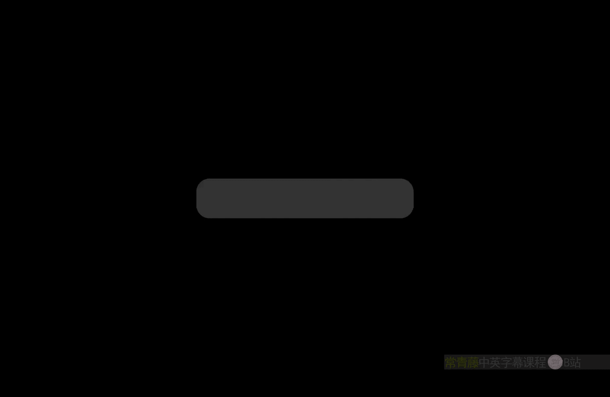
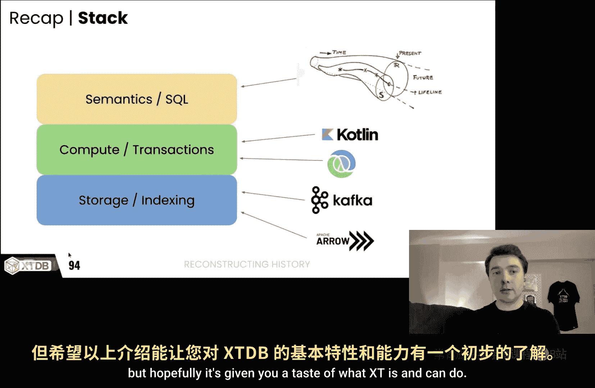
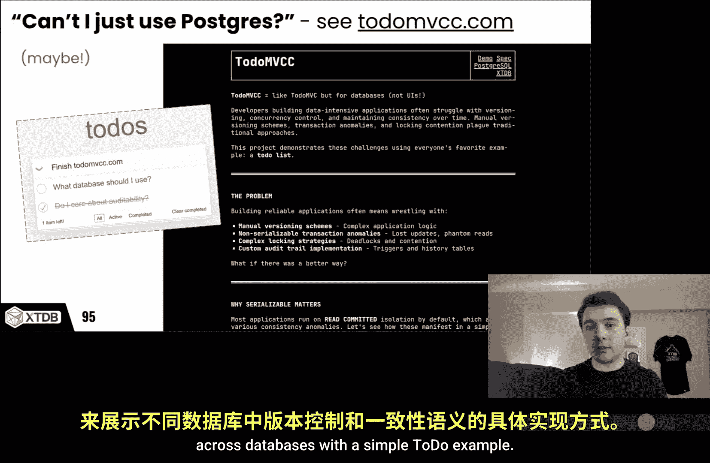
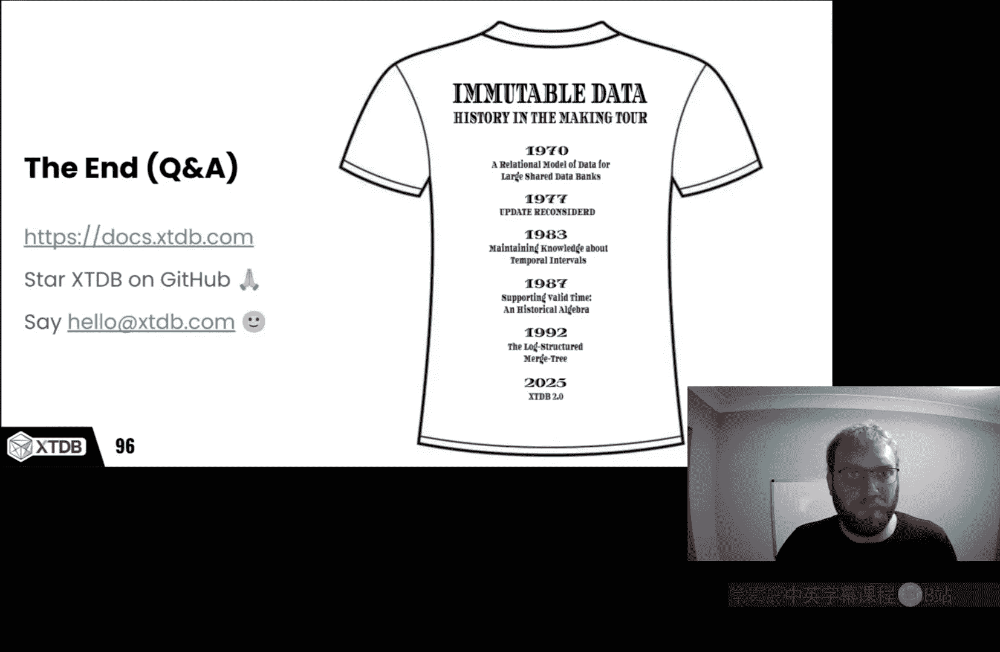

# 卡耐基梅隆【中英⚡未来数据系统研讨会系列｜Fall 2025, Future Data Systems Seminar Series】 p10 P10 Reconstructing History with XTDB (Jeremy Taylor + James Henderson) -BV17pidBkEzr_p10-

But just one for my peaces that pass， God blessedless they friends。

And check it out 9 pound because it's bad bro。Y it's time for Carnegie Mellon University's future data System seminar series This seminar is made possible're excited today have our friends at XTDB James and Jeremy they're calling from the UK Jeremy has a five month at home we appreciate him taking the time out although the asleep so again we're super excited for to us all the way the always a question for and as they're feel free to and at time and that way they're not talking himself for an onoom and again James being here the floor is yours go for。

Thank you， Andy， and thanks everyone for joining。So there's a lot to cover。

 I'm going to go as quickly as I can， but hopefully not too quickly and yeah please do interrupt。😊。

So there's a comment saying that those who don't learn from history are doomed to repeat it and nobody can be totally sure of the origin of the saying。

 but the quote is most accurately attributed to philosopher George Santaana， who in 1905 wrote。

 Those who cannot remember the past are condemned to repeat it， so slightly different。Now。

 I think in an age rife with corruption and hallucinations and just poor decision making in general。

 XTDb equips our users with the full might of SQL and relational theory to take on the challenges of remembering。

😊，So reconstructing history， it's actually a triple andtundra。

 I want to talk to you about why auditing is important。

 what it takes to actually be sort of auditable for assist system to be auditable。

 but I also want to look at why the industry is in its current state because I think the lack of care for how we preserve history has allowed the ecosystem databases to evolve and how they are seen currently but finally we want to of course look at how XT reconstructs history internally so how we accelerate that and make that efficient。

So。James and I have been collaborating on XT for about six years and backed by a consulting firm called Juxt which was founded by a pair of Lis Packers who are writing closuresure in banks。

 a lot of that last six years was actually spent on version one。

 which we're not going to talk about this talk is all about version2 of XT because we needed to build it a SQL API and we wanted object storage。

And this year we released version two in conjunction with a few design partners。

 and this is a ground up really right。Specifically so that we can scale out an object storage and offer a SQL API and build it all in Apachearrow。

So。Lots of databases give you time travel and the ability to create snapshots it's in the system time dimension that you're allowed to do consistent reads so you can take timetamp or a log sequence number and then generate a snapshot。

 maybe you can do this retroactively and you can use that snapshot to run and rerun queries and this is useful but it has limitations and the operational mechanics of how that works can be very gnarly and difficult to predict and to cost。

But this kind of time travel isn't necessarily that interesting。😊。

So the kind of time travel we're interested in is what was the state of the world rather than what was the state of the database so in the world of finance you typically end up with loads and loads of timest data coming from all kinds of sources and what you really need is auditability over everything that you do or that someone else using the system does with that data you want to be able to reconstruct what that person knew at any given point in time。

So the typical approach to solving this is just to keep loads and loads of data immutably and you can be using many different databases or places maybe it's data lakes and things to keep snapshots。

 keep immutable data all nicely structured organized and then on top of that you run reports and then people make decisions based in those reports and then further down the line someone comes in and what they want to audit those decisions and in the background you have all these machine learning people trying to figure out how to improve the processes going on in the organization but this whole image or architecture could be split across many different systems and it's chaotic and requires plumbing many things together but what we really want to do is to solve this in a more unified cohesive model which is what's been has been going on since the 1980s people have been researching this idea of the bitemple model and been trying to apply into databases so Richard Snograss who I don't know if you illustrated this diagram I think it's a great diagram very confusing there so we won't do any more 3D diagrams after this。

He showed that you can look at time using these two time dimensions and make things a lot simpler and he actually wrote a book in 1999。

 published it， Jim Gray wrote the forward for it very Jim Gray thought very highly of the book and its content so big thumbs up from that so the biemple model is rich Nograss outlines is a good thing I assume that and what it does is it's a model of change which accounts for errors and delays so we'll dive into exactly what that means but the short takeaway is all row of versions and your row version can get very complex so what you really want the database to do is to take away that pain of managing the versions。

Implicitly in XTDB， we filter out all those versions by default because that makes the simplest possible user experience for a developer。

 the developers don't to have to think about historical versions they no longer care about just because someone else who needs to audit the system might care about them we just want to be able to just select star and see currently valid versions。

😊，But if you have a need to access those old versions they're always there。😊。

You don't have to build in the auditability or how to analyze history into your schema in advance。

 you just always can feel reassured that the ability to get back in time is there when you need it and so that's kind of the elevator pitch for XT so we take this syntax from the SQL 2011 standard which defines valid time assistant time。

Where we make it orthogonal universal across all the tables and then we've taken this model and applied it so that it's actually efficient to execute all the way through the stack so we've written our own execution engine on top of object storage which is built using Apachearrowarrow with a sort of custom。

Vectctorized engine on the JVM and it's all open source and we're very keen to see what people can do with this。

So you can you walk through that select statement the。

Because it has the four valid all and then four system time as of what's going with that one？Yeah。

 so this particular example， your the four statements are attached to the product table。

 So we' essentially changing this filtering of the product table。

 So Valine all means show me all versions throughout valid time。 So this could be like。

 if we go back a couple of slides to。嗯嗯。This one like it's like showing me all the versions that were ever known and then system time is the state of the database as of month then。

Um it should hopefully become clear or this this model。

 I think it takes every little while to understand exactly what this is showing。

 but hopefully by the end of the talk it' will be much clearer。😊，嗯。But yeah。

 this specific query has show me all versions， but it could be like show me what I thought the price was。

😊，On the first November as of the second transaction I guess so there's like the four valid time and then there's but another four statement that's all in the same query so you should like it's it's almost like reading two tables is that like based on these two times stamps。

 is that the why I should think about this。I would say it's about a filter on a single table。

 so if I go back to this one。嗯。Like there's a single table the rows have many。

 many versions and we are filtering。Normally you just want to filter them to now。

 but you're sort of expanding the filter for that table and these are only the base tables we're filtering so if you have like intermediate relations。

😊，And。You know， they don't have these Valentine columns。

 but we have like these hidden Valentine system time columns throughout。😊，Got it， okay thanks， okay。

 it should should， yeah， I just wanted to make sure can I ask a clarify question？瑞似。

If I there's been mobile since I'd looked at Snotcr's word but from。

My high level understanding of that was the system time is like snapshotty。Like snapshot isolation。

 the time that is recorded when things enter in the database and the valid time was most semantically associated with what the events were。

 is that the high level way to understand those two interpretations of timestamps。

I would say the phrase out of my head is system time is the time that data was entered into the system and valid time is the time that data was actually valid in the real world so it's always like an upstream timet because unless your system itself is generating the data like it's like an internal state within the database most data is modeled from reality and reality is always upstream of the database so valid time is like this accounting for this delay basically and valid time comes from the user semantics right it's the system not generating as opposed to the system time which is kind of what you do when you are entering the data and automatically regarding times timess for doing things like snapshots and versionning and stuff like that right absolutely exactly that so valid time you're also here called application time or business time or domain time I mean because our industry can't ever agree on a single name for these things great Thank you。

 appreciateate that clification。No， I think it's a great segue because semantics is what it's all about。

 right？😊，We wouldn't be giving this talk if we didn't care about the semantics of the way that data mutates like there would be no point building a database if we didn't think that this semantic model was better and for a reason we' going to you know you can't just take the semantics and apply it on other databases and expect it to be efficient。

So just to a run of the talk， then I want to sort of start with the semantics and justify why this is a good idea and explain that the timestamp。

😊，Now they work bit the timestamps work a bit more and then we'll go James will take a tour through the storage and next thing and we'll maybe touch on the computer storage at this time at the end。

 but yeah。😊，The motivation certainly is the semantics。

So our target audience for XT is when there is a user or like an auditor involved。

 so this is very common in regulated industries like finance， but insurance and healthcare。

Where the auditor or the end user wants to be able to run reports and then rerun reports using but correcting the data so they want to be able to see and verify how data changes over time。

And this is like the key buying signal like if this person exists。

 it's like XT is in there because basically most databases fail at allowing you to run reports and make corrections in a semantically generic way and then rerun reports with those corrections in there。

And the other sort of key motivator is that a lot of these problems we're talking about。

 they can be worked out through the schema。But doing that and expanding your schema with all these other considerations and having other timetamp columns is very complicated and as a sort of technical leader in an organization you don't want your developers wasting precious project time on auditing requirements that could be pushed down or pushed out to a database vendor so because there's like loads of work to do it and there's all kinds of room for bugs and no one wants to be responsible for that there is a sweet spot where because of the way XT works we're not focused on like big OAP systems we're looking at。

Where an LTP workload can fit within a single box， basically。

 or at least the transactional right volumes can fit within a single box。

 and where the costs of retention are more important than like having super low latency。

 right we're not a super low latency system， which is worrying about how we correctly store an audit data。

And then of course you have application developers who we also want to appeal to and they view XT slightly differently。

 they will say well I really want things to be mutable and versioned like this feels like Git it's good and people are crying out for other aspects which we'll talk through。

😊，I would say our target audience is growing every year， like as more and more regulations。😊。

Apply it to new industries and existing industries， everyone is asking for more provenance。

 more data integration and more integrity of overall systems that get built。😊。

So I think the sort of compelling reason to care about the bio temporalemple model finally。

 you know after almost 40 years is making sense， I don't think back in the '80s people had the same care about auditing as they do these days。

 but I think it's an important moment。😊，So those are the trends but I think those trends mapped to semantics which I'll simplify as consistent。

 complete and correct and we'll walk through exactly which parts of the budget of our model is allude to。

 but consistency we normally think about in terms of acid and I think in SQL the biggest source of consistency problems is actually how we define update so naively an update is a deletete plus an insert this is how the original SQL spec was defined or how SQL was originally outlined in the original papers where hard drive are very small and you had to make sure you deleted data otherwise you'd run at of disk so it sort of made sense in that time but it's 2025 and this is still the way that people use SQL and that's a problem。

So what do you do if you don't actually want to delete things and if you want to handle appretion of information？

So this has been talked about many times over the years and actually one of the motivating inputs for working on log structure mergetry techniques。

 O'neill Patrick O'neill who was working on that read all about these updating place problems so Jim Gray talked about it I loose a paper by Ben Michael Schuler in 1977 about why updating place is bad and everyone throughout the 80s and 90s was thinking about this a lots of people were thinking about this and it motivated log structure merging as an antidote or a solution to the update place problem。

And if you take this to its logical conclusion to build a database that is just a log structured mergery。

 really get a temporal database。😊，嗯。Yeah and a temporal database is what I think is the logical conclusion to this history of HTap where originally we had OLTP then people decided well that's not fast enough for certain analytics workloads but because OLTP forgetting history OLAP remembers it we need to use OLAP systems to query history and then finally people are like oh well no we still need the transactional support so we can tie decisions together and do the auditing and that's why we have the HTap world it's like people don't need the full scale of the big OLAP systems they don't need the extreme speeds of the OTP they just want one system that can handle quite a few transactions you know a few gigs or terabytes of data happily and is fully auditable and that's our sweet spot but I think this breakdown that Andy you presented a few weeks back。

Of like looking at it through the lens of workload and operational complexity operational complexity is like quite a high level of view and I would actually break this down further and say that at the bottom of all of these divisions or there's biification between LTP and OLAP。

 you have the distinction between current and historical so current data being what LTP systems are built to care about and because they don't care about history like of course you need OLAP right because。

😊，Like by definition， OTP doesn't attempt to keep it and of course there are exceptions to that and we'll touch on how LTP systems have tried to incorporate history。

 but hopefully this gives us a framing for a root cause of the semantic problem here which is that OTP forgetfulness is creating all kinds of issues in the wider the landscape and if only L OLTP systems didn't forget didn't only care about current data we could be much better off and I think it's proven by the way that people write event- drivenriven systems。

 they write events down into Kafka and then put the data into Postgres or on the OLAP side。

 a lot of people spend work a lot of time duplicating schemas from the LTP systems and then running OLAPqueries which really they're not vast OLAPqueries that could have just been run on the OTP system if only the LTP system kept the data properly so OLAP not always the actual like necessary solution it's just and if the scale it's just there because people。

The application guys don't want to have to write the auditing layer。

And I think this temporal database gap was quite clear to Joe Heellerstein when he wrote this paper。

 looking back at Postgres， I took a screenshot of a chat I had with another colleague back in Slack a few years back where in the paper he talks about the notion of versioning and time traveling and database。

 which is being ripe for a comeback and actually Postgres。

Had versioning so everyone knows Pro has an MVCC implementation。

 but originally it didn't actually garbage collect what was the word clean up those old rows it would keep them so you could go back in time and see those old versions of data and like this this would have been great again back in the 80s and 90s。

😊，Disk weren't big enough to make it practical， but now we're in an era of object storage。

 it's plausible， and so we should reconsider the semantics。😊。

And there are all kinds of other systems which touch on this temporal issue and I think。

Maybe the most important way of viewing it is that everyone wants real time and real time is expensive this diagram on the right here shows that if you want things to be as near to real time as possible the costs only go up but very quickly the costs go down and then as you move data into colder and colder storage over time it gets more expensive to retrieve it again and all of these other systems that aren't OTP systems or HTap systems like whether it's streaming or。

Pure warehouses or things like feature stores， they all take in data that's timestamped。

 it's got you know an original event time and they store it and then they have to figure out and join across the different sources to make sense of the world right these are all downstream problems of the LTP systems not keeping history。

That's not to say that these other kinds of systems shouldn't exist。

 it's just like they exist in the context of LTP failing to like expand its own fish。😊。

So let's take a step back and design what we think an LTP system should look like which is temporal。

 so what if it always recorded linear histories of rows and not just single rows but like what if the history of the entire database with linear and then we could integrate the histories of not just rows or records that exist within our database but maybe we get some from other databases right we want to be able to pull the information from any sources and integrate those histories and then we want to be able to run meaningful audit inquiries on top of those。

Many histories that we store in our database and so these three layers again。

 consistent complete and correct， I think build a picture of what's needed， which is the bit model。

Just to go through an order though， so consistency we start with the epocalyptly model。

 which is something we James and I took a lot of inspiration from from Rich Hkey。

 who is the author of closure this program and languagen and he in this talk very clearly outlined what he considered like a very powerful model of time。

 which is taking。😊，Imutable values and then having processes which transform those values in a deterministic or a very regular way so that。

The semantics of observers aren't impeded so everyone can observe many states independently without having to wait or lock for each other right this is like it's not even talking about software。

 this this is more like a model of how reality works like multiple observers can observe the same thing without preventing that thing from changing whereas all the systems traditionally that are place oriented aren't built around this model and so they all suffer from yeah very complex software implementations。

So Rich took this idea and applied it to Datomic， which is not XTDB。

 but it was directly inspired XTDB if it wasn't Datomic XD wouldn't exist， but Datomic took these。

These views of how to think about immutable successions of time and applied it in a global way to this。

Database which had some real success like it got required by Newbank。

 but the fundamental model is the same as what say H storevolTB。

 we're looking along the lines of which is if you have deterministic transactions then that are reads the're noninteractive so you can't do interactive reads during a transaction it's like a simpler way of thinking about the progression of state。

 but it's also potentially much more efficient to execute the speed of a single core is very fast many many LTP workloads can fit in that linear serialized execution order。

But crucially it means everything is immutable and you have this snapshot consistency。

 so this is like the basis of our consistency for XtDB。😊。

And this is how we reify it so we actually use Kafka we use a single partition Kafka topic and we put all of our transaction like payload onto the topic and that becomes the write catalog effectively and obviously the part determines the serialization order and then the nodes and there may be many nodes in XT the nodes race to index that deterministically and do compaction into the object store so we take data that's put into Kafka pop into object store so it's a very stateless system。

 very minimal coordination， the nodes never need to talk to each other because they can all agree on the state of the database at any point in time。

😊，So please go back the architecture。Its supposed to Sre protocol。 I call begin。

 I can I can read some data that hits up what are the current end piece。

 And then when I do my updates， you。You apply the changes to you just buffer the changes in the right set for the transaction。

They call commit and then that gets shoved to Kafka who then goes ahead and implies it and then presumably。

 I mean maybe James can talk about this， but like you have to then coordinate the transactions in the front。

And so you're doing that， you said you're doing that deterministically or how are you guys handling that？

Yeah so the transactions themselves are entirely sort of nonintract as Jimmy says so what happens here is if you do make reads beforehand。

 we then offer an assert primitive which then is optimistic concurrency essentially it then checks when the transaction gets indexed it checks where your preconditions get it all right so dynamicy recurren sense transactions and Calvin Ga it yes exactly it's a very simple model and we don't do anything clever to accelerator at the moment at least there's probably else more tricks we could apply but it's like do the dumb thing and it's literally serialized and。

Daomic implemented this model and I don't know if you saw the Jepsson report on that。

 but like if it couldn't find any flaws in that right like it was it was it was it was perfect。

 you know， didn't he didn't manage to find any bugs so I think it's a testament to simplicity Can you share like what I know what like typical oldbe actually might look like in like web applications and other things。

😊，What do transactions look like in this world， is it like read modify。

 write or like bulk inserts or like like how like are typical transactions inserting 20 things at a time or one thing at a time？

It could be be large。Yeah， the actual limitation， the hard limitation is on the Kafka right head log so Kafka's default measure size is one megabyte。

 so right now we say you know chunk up your transactions so it fits within an a megabyte otherwise you have to use a larger configuration。

😊，Okay。But there are some caveats to this model right。

 so if you have an update statement that actually does a huge change to the database it might be a very small statement。

 but the actual effect might take a long time to apply。

 you're going to be stalling other writers so you want to avoid those sorts of situations where you're you're stalling the progress of the transaction but are you putting is it very headlog are you logging logical level like here's queries that ran or is it like the physical changes。

😊，It's logical logical okay， but but they're more like requests for transactions right at this point。

 so it's not like these are the transactions which have already been applied then they go on the right head log。

😊，Yes， got it， thanks again。It's a very easy model for us to put all the acid work onto doubleub straw in the Kafka like we don't do any distributed systems clever algorithms。

 we don't have to do any that， we'd have to worry about any of the durability like it's all outsourced which has its cost right there's some latency introduced by using Kafka but for us for our purposes。

 it's good。😊，Cool， so I'll proceed。The next sort of problem is that yeah you end up with multiple sources so how do you integrate multiple databases。

 how do you do that in a consistent manner so in order to answer a question like was were we profitable last week。

You need some way to align that。 So this， this is like very simply model as like an extra time stamp on。

You know， in the days， you was the ingested。But what is actually really the hard problem is corrections right because your relevant data set。

 the data in the database and noise all exist in the same。

World and you need to separate these things and make sure that your query can be satisfied but what what's in the database and these circles they may change over time in the ideal case。

 you end up with all of your data that you ever need in the database and no errors but everyone knows that's never you never get things right first time things of evolve the move and actually this was Michael Schuler's 1977 paper where he basically outlines that entry lag obsescence and errors if you model these things as first class aspects of your database。

 you sort of sidestep a whole load of problems to do with how do you manage things over time so he argues that this is like really important and this is before the bi temporalemporal model was coined and I think the bi temporalempl model essentially implements this。

And he would be very disappointed with the current bifurcation where we sort of say。

 oh LTP just cares about this part of the Venn diagram and OLP covers everything。

 but it doesn't really understand the semantics of how these sets move and shift around because we don't have ways of talking about errors and obsceescence in SQL。

So as a consequence in common LTP world， when people build applications that instead of doing updates。

 they'll say no just insert a new row and we'll roll up the versions or insert into history table instead of delete you just update previous row and this means everyone is having to filter。

For timestamps， making sure they're only seen like the latest version or they're moving everything to OLAPB systems。

There are ways of getting history to be modeled in LTP systems right you can use audit tables and soft deletes and you can model your own like bi temporaloral kind of columns like slowly changing dimensions is a common pattern you can denormalize things like if you store the price of a product at a pointed time at the point of checkout like okay that kind of works。

 but then you deormalize the data to record that price as it was at that point， is that a good idea？

Could be but if all else fails， you know the answers always go back to the backups replay from righthead logs or rely on your change data capture so like there's no。

😊，Good answer in most OTP systems。 It's a huge source of bugs to try and。

Mittigate the fact that LP doesn't retain data。So the lightss are so the SCD stuff。

 that's like the Kimball data warehouse stuff in the 90s， like the type one type two thing。Yeah。

 that it's just， it's just a different way of sort。

Describing how data should change or can change or how you represent that， it's a modeling thing。

 but people can apply it to solve the problem of data retention in transactional systems as well。

And it's slow changing data SCD or dimension or one of the two slowly changing dimension is not the application。

Yep，Yeah， so I'll just run through so the price In model is defined in SQL 2011。

 so there's a paper that's written sort of look。Looking at that and I have these definitions as the time when something is committed to the database and then the time when something is regarded as true by the user。

 which is， yeah， it's a user semantic。😊，So if we look at a concrete example now we may want to set the price of this ID to4 so we can run an update statement and now our table has two entries。

 so this is just system time and you notice that we close the。

The period for system two gets closed and then in the first road to T3。

 and then we insert a new road that starts to T3 and goes to infinity and the semantics of that it's closed open periods。

 you' not allowedied overlaps。The system should maintain this like the user shouldn't really think about editing system time。

 it's there when you want to view it， but you just do an update and it ends into the table。😡。

Valt time is of course different right you were able to backd and say ah the price I want to show you that the price from the firsts of November was five so you can do that you're going just get information to the table and say it was valid from first November valid to infinity。

😊，But then if you make a mistake and you realize， there data entry bug or some process or batch job went wrong。

 a program failed it should have been four and you can represent that in the Val time。

View of world by saying it's followed from the first November to infinity。

 And then if you then want to set it to three as as another option operations to three operations here。

 this is how the table would look。 So we say it's followed from the first November to T 3 and then from T 3 to infinity the price is3。

 So this is a slightly more。Simple example， in a sense， it doesn't have any other data。

 It's just one one one item in one column sorry one item in one table。

 but apply this to all tables and many items and you understand that there's a lot of potential。

Complexity in the wave versions Matt managed and indexed。😊，Um。

 and so that now you combine both the Valaline andcyentine dimensions and what we're seeing is like a proliferation of rows。

😊，Again， like no overlaps， you're only appending the only time you ever update any existing rows to say the system2 is closed and then the other interesting thing here is that in the bottom table we end up with an extra row so we're doing these three operations like that we did in the previous slide but we have four rows instead of three and this is because you actually have to split rectangles and this become clear in James discussion as to why you why you need that but basically the implementation for this isn't easy and actually if you try and do this with like TPCH data you end up with like all these join conditions for all the tables like if you assume all tables are bi temporalemp and you want to do an as of now query5 like the query gets really complicated and you have to have a trigger on all of those tables so this is just like one trigger for one table which updates and maintains these rows so when you do an update it has to insert and close the period etc。

So it's quite a hairy thing to implement yourself， which is why we think there's scope to。

Did a good job at it at the biynro model as per SQL 2011 was。

Standardized some databases tried to implement it， I think it's got a lot of problems。

 it's very complex to use the way it defines application time or valid time is ambiguous。

 doesn't address schema migration schema is a huge part of this like when you migrate the schema do you might migrate the history does that break everyone's A of queries like these a big unanswered questions？

And it's it's too vague because I think Valentine should be universal or we think Valine should be universal。

 but various databases have implemented it per the spec， so Terraadata， DB2。

 Hannah Mariaie DB and a few others have all。😊，they have documentation that talks about this。

 but the reality is no one uses it like it's barely used by most users because it's bolted on。

 it has a performance impact which has to be measured and assessed and the UX is just very complex so it's not like on by default and certainly Postgres doesn't have it。

😊，I will just mention briefly time series databases which which are sort of related to this a of snapshoting problem。

 but they're not the same so time series database is a focused on events rather than states which states have durations the thing they give you is the ability to do can as of join which is。

Yeah， it's about lining up different events across tables， but it's something you do at query time。

 it's not about how you maintain state in the database it's not a model of reality。

 it's like assuming you already have some flat event data。

But time series databases do accelerate workloads that have needs for very advanced windowing functions and roll up aggregations。

 etc， so we're not doing that， but Az of joinin is sort of evidence that people need these temporal query abilitiess right snapshots aren't enough they need Az of joins and XT kind of solves this problem in a different way。

 it says if you load your data into the database using Val time than it works。

So XT is by temporal by default， we think this is a much better standard of way to think about time if developers that application developers don't have to think about it。

😊，Until they。Come to like an auditing requirement people will actually use it so when you do an insert it's just an insert and update。

 it's just an update delete is a delete。😊，Because it hides the data if you actually want to delete the data there's an array separation or queries as of now by default and because it's like an HTap system we serve as transactions and we serve as analytics it means that there's no need for ETL right you can still do ETL but there shouldn't be much need unless you have some extreme performance requirements。

😊，And yeah， with that， I wanted to sort of say the other way of framing this as James put on many occasions is that any sufficiently complicated data system contains an aOoc informally specified bugrid and slow implementation of half of a biempal database and for that reason you know you should just use a biterempal database by default fault if you end up in that position so with that I'll hand over to James to whisk you through the story。

😊，Thank you Jeremy， yes， for those of you who do know where this one came from。

 it's Greenssp's 1th rule and there is an of quoted corollary to this。

 which is including common Lisp。And I'll let you decide whether that codary also applies to XtDB as well as we go through。

But yeah， so Jeremy's right here， I mean， what Xtdb has come out of is all like in previous lives before working on Xt。

It's come out of us implementing exactly these systems right ad hoc informally specified bug written by temporal databases。

And it was time it was time by the time that we all got together to make XT。

 it was time to make it and do it once and for all， have it baked into the database from day one。😊。

AndSo what we did one of the first things we did was that we looked at the shapes of bi temporalemporal data。

 like what does temporal data actually look like in practice。

 like what are the data sets that we're working with day in day out that causes the pain that we're trying to avoid by using a database like XT？

I've got a big warning at the top here say there's going to be some sweeping and generalizations in the upcoming slides。

So the assumptions that we're making is that the vast majority of data is inserted where valid time is the same as system time。

This is what's happening day in day。And it's rare that you're or at least relatively rare that you're going to be doing either retroactive or scheduled future updates。

And so there's a few dimensions that I want to consider as we through these as we run through this taxonomy。

 so number one is the cardinality， so how many distinct entities do we have in this given data？

How many updates do we have for each given entity？And what's the sort of bi temporalempal characteristics of these data sets like so when we put a version in。

 what does that validity period look like？And then finally。

 how do we actually end up querying these in practice？

So there's a couple of different query patterns that we're looking at and these are no stranger2 on' with databases likere relatively there's nothing sort of different about XT in this regard。

😊，Like we're looking at filtering by primary key and we might be filtering by it's like a near unique key。

 like an email。We might be looking at like what we call a selective attribute。

 so an individual store of a US chain I did actually look it up but apparently Walmart has 5000 or about 5000 in the States for some reason as a Brit I thought that was a lot more。

😊，But 5000。And we've got unselective attributes and then finally we've got full table scans。

On the temporal selectivity side though， this is where sort of Xt does diverge a little bit here because there's very much an order of priority here。

And if we look at the sorts of queries that people run every day on their databases。

 we would say the vast majority of there's number one here。

 where we query for both valid time and system time as of now。AndIt's a rare requirement that。

 for example， we need to see the whole history of an entity。

And it's an even rarer one that we need to see the history of the entity as it was at a previous time。

So in order priority， valid time system time as of now。

 valid time history and then system time history， so there's an asymmetry here to the two temporal dimensions which if you read the papers and like a lot of the papers don't mention this asymmetry。

 but this is one that has come out of working with temporal data in practice。

So what do you mean by the priority in terms of actually what the application wants or how you're running the query and determining whether something's valid to be shown right now？

And we're talking about what end users care about and hence what we care about in terms of optimizing so if we're going to make trade offs then we're going to trade off having a slower system time history than we are valid time got it。

 thanks。So if we look at some sort of shapes of bi temporalempal data， and one category here。

 the first category is like product pricing or user profiles or employee records。

And here we're looking at quite a moderate， quite a slow growing carbonality， relatively speaking。😊。

And so your cardinalities of products how many products you're going to have in your catalogue is never。

 never truly massive， similarly sort of user profiles or in employee records。

 not at least relative to the ones I'm about to cover at least。

When we look at updates for these things， the vast majority of these updates are for valid time from now until corrected。

 so when I'm updating my product price， I'm going to say want I want this change to take effect immediately and I wanted to take effect until I then correct it later。

So we do have some retroactive and scheduled updates。

 so things like I mean user profiles is a good one for this because you'll get like an HR system where someone will tell you that they moved house last week or they're moving house next week。

But I say they're relatively few and further between。

If we compare that though to sort of trade or order data or social media postser messages。

 these have a massive and very fast growing cardinality。

 so we're getting new trades in all the time and we're getting new social media posts in all the time。

And these form a state machine so what tends to happen here is that your updates to these are very much as say biased towards recently inserted entries。

 so'm if I'm Twitter or whatever it's called these days I might allow an edit window of 15 minutes or whatever it happens to be。

But until at a certain point， people are going to stop editing their posts in theory。

So the Val time is still now until corrected， but when they hit a final state and they tend to hit a final state quite quickly relative again to some of the products or the user profiles。

😊，When they hit that final state， they then remain valid indefinitely。

So category 3 is IoT readings or pricing feed data。

 so I'm differentiating here between sort of product pricing。

 which if you've got a product catalog versus pricing feed data。

 which is like if you've got a market data feed， you've got stock tickers coming in however often they update。

So here we've got a relatively low cardinality， so we don't have a great deal of like let's say we don't have a great deal of sensors。

 for example， if we've got a sensor network relative again， relatively speaking。

 we don't have a great， we don't have a great number of those。😊。

But the difference here is that the update frequency is very high。

 so like one of the clients we're doing some work for at the moment here。😊。

So they're getting sensor readings in every five minutes for each sensor and they've got a decent networking probably into the tens。

 hundreds of thousands of sensors。So there， but say the update frequency is what dominates here。

And what we recommend here is that each version is entered with a very short and bounded valid time period。

And sometimes if it's an event， this may well even be one cron as Richard Edwardnegrass and Christian Jansen call it so that the smallest indivisible unit of time that the system can handle。

And finally and I've left the boring one for last， it's the static reference data。

 so this is your data that's got lots sort of relatively low and static cardinality。

 it's not updated all that often。😊，It's relatively frequently accessed and it's small。

 so it's likely to be completely in cache。So again， not one we had to consider massively。

 but one one in here for completeness。😊，So one of the big things that we have to do is we need to calculate what's visible at any time。

 so of the data that we store， what is it like which rows。

 which versions are visible to the query in question？And we， as Jeremy says here。

 we extend SQL 2011 here with two extra clauses that form part of the fronng clause or for a base table。

So we've got for system time and we've got for valid time here。And again。

 there's a few different filters that you can specify here。But crucially here。

 Xt defaults for system time as of now， which is the SQL standard。But also for valid time as of now。

And the impact of this is that XT behaves like Postgres， the vast majority of the time。

 until you actually need the bi temporalority， you can treat it exactly like Postgres with its inserts。

 its updates and its deletes。But when you need that history， it's there and available。

So what do we do Well we store immutable bi temporalempate events。😊。

And these consist of a system from a valid from and a valid to。

 so note here no system we don't actually store the system two in these events。

So here I've got three updates and again， it's keeping a similar examples to Jeremy's frommelia。😊。

And the you'll notice in the third update the one at system Time T4。

 this is one where we're doing an update back in valid time。

 we're saying that there was a version that we need to sneak in there in between version one and version two。

So if you don't have a biotemple database， what happens？So first time round。

 I'm going to be putting in a version from T1 up until0 infinity。

As Jeremy mentioned his introduction earlier on， then when we get this update through。

 we then have to take control of remembering exactly what to update both on the system time and on the valid time。

So you'll see the new row here in green， but in inserting that new row。

 I either end user then have to remember to make the changes here that are outlined in orange。

And the third one is even more fun。😊，Because what I'm ending up doing by entering entering this red segment in here。

 I'm actually making changes to what's that four rows there out of the six。

And I'm sure you'll believe me when I say it took me an embarrassingly long time to get this right。

 even though I've been working with temporal databases for however long it's been now right this this is this is error pro and it's fiddley。

😊，So keeping that whole by temple state materialized is actually quite expensive as well and like you'll see here if you did need to keep that materialized you've already got a right amplification of 2x there so we we've got three core events。

 we've got three core row versions。😊，But if I'm storing it in a bi temporal way。

 I've got to store sex rows。There's assess， like most common queries don't even care about the thought bi temporal state。

😊，So what we do is we are inherently lazy about what we store。

And the innovation here that comes with XT is that we play it backwards。

So we write novelty to an appendon the event log and so those events there。

 you get the system from valid from and valid to and the version of the documents。And when we query。

 we just play their events in reverse system time order。

And this actually yields a number of interesting properties。

So number one is that if you've got an as of now query。

 which if you'll recall is the what we said is the most common type of query and we terminate as soon as we see the relevant event。

 like don' we don't need to look events earlier in system time because they cannot possibly supersede later events for that valid time period。

If we do go back in time， we can skip over later events。

 so events that are later in system time because they can't possibly affect earlier than their system from like the system from of the query is like a watermark。

 it's an upper bound。You cannot possibly see anything beyond anything later than that point if you choose that as your snapshot time。

And finally， queries that don't project any temporal columns out。

' they only need to ascertain whether each event is visible or not。

 so we don't have to do the full by temporal materialization in that case either。😊。

So doing all of that work ahead of time that we talked about just now by figuring out all of those updates is actually largely unnecessary for the vast majority of queries。

😊，So we'll take an example here。😊，So if I keep both valid time and system time implicit。

 so here we're looking at v and system time as of T5。I play backwards through my events。

I just realize you can't see my cursor because I'm controlling Jeremy's presentation rather than I think but the we'll play back through these events here。

 the T41 we ignore because the valid time here doesn't apply to our query。

 so we can very quickly ignore that one。We valid we then spot an event for T3。

 this event has valid time from T3 to infinity。We spot this matches our query。

 it's an as of query and so we can immediately stop processing for this entity and we don't have to go back through this entity at all。

😊，So we can ignore any history that happened before that green line on the right hand side there。

If we do pick for valid time as of T3， the story is similar。

 so in this case we see that the valid time range of the first event that we're scanning is T2 to T4。

This event matches， so we yield that one to our query engine and we stop processing any further events。

Maybe you're going to get into this， but like the。The。

Your query optimizer has to be obviously aware of。These notion of system time， valid time。

 and then it has to make decisions on whether because you have to presumably have indexes to speed this up。

And then is it going to decide in some cases based on what the semantics are of the the bi templele portion of the lookup。

 like whether it's better to go to like。The Id， you know。

 index first versus the timestamp index or does it always make sense to go。I mean。

 if you have the Ie NIs， that's the primary key， but if you don't have that。

 then you could decide which one of those two you have to look up on。You do yes。

 I'll if it's all right， I've got some slides a bit later on that I can cover yes。

 okay perfect thanks。And so what we do when we play it backwards。

 if we do need that full materialization， you'll see we start the graph from the other end。😊。

And so create this， we create this row first of all。

We then have this concept called a ceiling and what the ceiling says is what's the portion of time that I haven't yet covered with an event？

So in this case， here for my Valentine prior to two， my ceiling is infinite。

 there's events there that cover this there's no events that cover this period of time。

Between Valine T2 and T4， I've got my ceiling as provided by the red event here。

 so the red event here is providing a system time ceiling of T4。

And then similarly from T4 to the end of time， there's no ceiling yet for this。

So when we get our orange event in， we then use that ceiling to create a rows。

And so what we're doing is we're applying the orange event。

 but we're applying it underneath the red one if you think about it in terms of like a type a Z order type thing。

And so when I construct my rows， I can add two rows on here。

Because I'm constructing one row for the segment from T3 to T4 and one row for the segment from T4 up to positive infinity。

We then update our ceiling as we go， so here we've now got a little step in our ceiling。

 it comes down to T3 as a result of the orange event。And then when my final event comes through。

 I've now got three distinct segments to think about， I've got the segment from V1 sorry t1 to T2。

I've got the segment from T2 to T3 and I've got the segment above T3。

And so I add three rows in here at the bottom to cope with those three rectangles。

So the biggest note here is that at no point in this process have we updated or even looked at any rows from previous events。

 like we're not talking about sort of any kind of sort of updating in place of those。

And we've managed to and because we don't have to read them either。

We can yield those rows immediately as to the downstream query engine as soon as we've calculated them。

So I said earlier on， just play the events in reverse order。ははは。😊。

Easier said than done because we obviously don't want to play all the events for every query and we obviously don't want to maintain a fully partition sorted data structure on every update that would be crazy。

😊，So what we do is we've got distributed log structure mergery or LSM tree。

And this works pretty much the same all of the other LSM literature。

 so I won't go into it too much here。But the main thing here to consider。

Is that all of these files are immutable， so they're very amenable for storing in a remote object store and also for caching。

Our second innovation here is a concept called recency。😊，And we define recency for record。

 as it says here， as the maximum timestamp for which the row was believed valid。

For both validine equals T and system time equals T。Why do we do this？

Let's have a look at what it means。😊，So you'll see here some bi temporalempal polygon which will come up from one of those。

 which will be the result of one of those events that we saw earlier on。So we first of all。

 take the Vt equals ST line。And rec is then the point at which this Vt equals ST line leaves the polygon here。

But what this means is that any query that's upwards into the right of that recency has no reason to look at this event。

😊，It cannot possibly affect this query。Which means that when I'm looking for queries as of now。

 I can filter out any events that have a recency less than now。

 which turns out to be your whole historical partition。

So this also applies on a file by file basis as well， so recently being a heuristic。

What I can do is I can say that the recency for a file is the maximum recency of all of the events within it。

And therefore， I can rule out entire files。Based on the recency of the query that I'm looking at。

Another observation， the Ldy effect。So that this helps us out with our storage as well and the Lnda effect comes complete from outside of tech as far as I'm aware。

 is originally to talk about businesses， but the Lnda effect states that the future life expectancy of non perishable things is proportional to the current age。

so I think originally， it was referencing businesses， but books it's true for books as well。

And music， particularly as my my father keeps reminding me that they don't make music like they're used to。

But more closer to home， this is very much the inspiration behind generational garbage collection。😊。

So what Geneal GC says is that when you've got like very recently allocated objects。😊。

Chances are they're going to be used for a short period of time and then discarded。

 so what they will do is they will very much prioritize collection of the most recently allocated objects。

Objects that have survived in a few of these garbage collections are then collected much less frequently。

 so you get your old or your survivor gen， whatever they may be called。Most importantly to us。

 the same is true of data systems， so if we think back to that taxonomy from earlier。

 when you do have newer data， it's much more likely to be very quickly superseded。😊。

tThen data that's remain true for a while， so if you think about like the trades or the social media posts that have been like have been created a long time ago。

 chances are they're not going to get any further updates now。😊。

And we use this as the basis of our LSM compaction。

And so what we do in our LSM compaction is we first of all， when our in memory buffers full。

 we flush out level zero files， so that's a standard LSM tree pattern。

We then apply our compaction process to it。And the compaction process out of these L0 files split us up by recency。

 so if we have a recency that's indefinite， it stays in a current file。😊。

If a recent sea isn't indefinite， so if it's already historical， if it's already been superseded。

 it moves into historical partition， which is separate in the LSM tree。😊。

We then as we get more L zeros in， we can pack them up so we'll take one current file。

And a few more L zeros and we'll create some more historical current files out of that。嗯。

As we go up the tree， we then start to partition like when we get these when we fill up these L1 files。

We then introduce some partitioning on the current side by the ID hash prefix。

And what this does to Andy's question of earlier， when we got questions。

 when we got queries around like searching for primary key。

This very quickly filters out entire files of events that we don't need to look for for。

For this particular query。We do then do sort of standard practices here around bloom filtering and metadata as well and those cover the they generally cover the selective and the near unique pretty well as well。

So one of the things that we notice is that in practice again， thanks to this Ldy effect。

 one of two things happens， exactly one of two things。

So either the historical side of the LSM grows really wide because data as soon as it comes in and becomes historical。

So if you think about reading when it comes in， it's very quick a sense of reading。

 it's very quickly superseded by the next one。😊，And similarly for sort of market pricing feeds。

 so we see in those cases， the historical side grow very wide。Or the current side grows deep。😊。

so then this is looking at the trades or the user profiles。

So what's happening here is that when a trade gets completed and essentially closed。At that point。

 it gets deeper and deeper into the current side of the tree as it gets older and older。

And then we can look at these older parts of the current tree and very quickly filter them out based on the temporal metadata on each file。

So coming back to the shapes of bi temporalempal queries。

And you'll see we've covered these off through the various observations that we've made here。

So the primary key is covered by the ID hash filtering on the LS entry as it gets into the deeper levels。

The files themselves are also then partitioned by ID so we can quickly narrow them down to pages within the file as well。

Unique and near unique keys， metadata and B filters make a great job of these。

 they very quickly identify the files where this particular email is present。

And we are shortly as well going to be adding secondary indices to XT。

 so these will turn sort of emails into entity IDs quite quickly。Selective attributes less so。

 we get quite a lot of sort of bloom filter false positives by by the time it gets to this point。😊。

And then selective and unselective attributes and scans tend to just be scans anyway。

 and because XT is as anarrow database，'s the column either of this is quite fast。And again。

 looking at the temple selectivity here。😊，We' very much prioritized as I say for the first one here。

 so because of the way that the historical tree， the historical events are very quickly filtered out。

We can， I say， hone in on the current time events。I think all of this though has come out from of the practical experience that we've had both working on temple systems before XT。

 but also in conjunction with our design partners。So I'll hand back to Jeremy's talk about that。😔。

Yeah， thanks James， I think it's fair to say that the like we actually spoke to Richard Norcross early in the year and like。

😊，When people approach the design space， they don't。

Like all the other data engines that have implemented bio temporalority like no one's gone。

To the levels we've done to push it all the way into all the scans right to the bottom of all the storage that happens。

 but yeah this design has been proven out with our design partners so we have this energy infrastructure reporting company which has got a very large installation of like solar panels etca。

 lots of sensory rings flooding in and they want auditability so they can report to their regulator like this is what the power levels were what we thought the power levels were and after some delays how they get corrected。

😊，But I just want to finish really quickly with some implications of what those semantics actually mean in the SQL we've seen some snippets of SQL。

 the big one is SQL 2011 but we've taken this and extended a bit。

 we've added lots of Alan period operators which SQL doesn't normally have means you don't have to do lots of less and greater than it's like very simple predicates。

 you can say I want to run this query between these two dates to these sort of sequences Valalan queries。

Everything is sort of a record by default， like whole it could be a whole other talk like how we manage schema。

 but by default everything is kind of schemaless， but it has certain advantages and we are very good at storing very deep nested data。

😊，We can also support blind rights so because of the event model or the way rights are written in。

 we can say well if you know the valor from the valor too we can efficiently store that and then it travels through the ingestion pipeline very quickly so again very good for sort of sensor readings。

 that kind of thing。We reify the transactions， so when you need that auditability of exactly what the transaction time timet was。

 like it's there， it doesn't get garbage collected when the LSN cycles over anything like that it's it first class audit log。

We have the ability to query across multiple databases so you could potentially have like。😊。

Products of one database， prices is another database。

We've mentioned Postgres wire compatibility it's actually been quite a boon for us it's allowed us to support metabas which is being very key with our design partner。

 also 11 languages， I've been able to test all these different drivers and they actually work quite well with XT getting data in and out we just added arrow as a customer ID to send arrow data back as a forwards ever Postgres and if it's well with a transaction semantic so。

😊，Just because you can't do interactive transactions， it actually feels okay at the PCQL console。

We have actually implemented FSQL and we've been hacking on ADBC as well。

 so that's landing and actually works quite well for transactional data sets all surprised by the performance numbers we've seen。

 but yeah， certainly very good for large results sets。😊。

And we have had a couple of side quests as we couldn't resist hacking on things that aren't just the bi temporalempl aspects。

 one is the SQL language we want to make it more template friendly。

 like we know one of the big pains that people have with SQL is that it's hard to write applications against so we have this extension to the grammar it allows many commas and we also have like a pipeing operator but it's not implemented as syntax it's just a sort of flexing of the grammar that means we have relational closure so you can chain operators and compose SQL in a kind of interesting way there's a whole blog based on that。

We also have our own query language which I'm not going to touch in any depth other than it's like it's a list B SQL but you can embedt it in your SQL if you're an experiment。

 it's definitely unstable for the moment so we do recommend people use the SQL if they're building anything think for pro。

😊，So that's the recap yeah， we haven't talked about Koland or closure or how the vectorizing execution works。

 but hopefully it's given you a taste of what XT is and can do。😊。

People are from going to say questions how does this compare to Postgres I have just recently put this to do MVCC site if you know to do MVC the idea is to like can we make a database thing out of this right now it's like XT versus Postgres and now I haven't actually fleshed it out so wash this space if anyone wants to collaborate on this I'll be really interested basically showing how versioning and consistency semantics works across databases with a simple to do example so that is the end of the talk appreciate we're like way of time but' happy to take any questions if there are any thank you。

All right， I applaud about everyone else。 Thank you， James and Jeremy。

 this is some heavy stuff open up to the audience for questions We have time for like maybe one。😊。

Then I would take the time so the data structure and the indexes。

 it's a you guys have it could B plus tree or what's the what are you doing to look up onto the log are you buying the log structure merge tree to do all the filtering for those kind of things？

Yeah， so it's a couple of different levels， so that the first one is the log structure mergetry and so of that gets rid of entire files and within that page within those files。

When you get to the pages within when you get down to the actual page level。

 it's then a hash array map to try down at the bottom。

So what we do is we hash the entity ID and then that allows us to scan through the files or search through them for the relevant attributes。

By the time you get down to there， its in a lot of cases it's actually quicker to scan through those files。

 the pages themselves are about a000 rows apiece。And arrow makes that kind of thing lightning fast。

Got it。 And then your query optimizer is that like it sounds like you're not using any bits and pieces of from Post scratcht。

 So like， your query optimizer is written from scratch。 and then， yeah。Is it cost base And if yes。

 how you doing？I mean， you have the sport joins， right you new joins in XTDB， right？Yeah， so I mean。

 everything about the scan operator is pretty much your traditional database。

 which is why we've not really covered it， to be honest， it's the scan operator that makes XTxT。😊，Um。

 but yeah， above that， we've got we have got a bit more work to do on the on the cost base optimizer。

I' say we've got an algorithm in there that works well enough for now。

 but certainly over the next few， I mean， that's， as you know right that's a sort of database query optimizing is a an indefinite job。

So yeah， we're very much focused on getting this GA out of the door in June。

 with a query engine optimizer that's good enough for now。

 let's say I'm plenty of optimization there to come。Yeah。

 we use simply square for the cardinality reordering。

