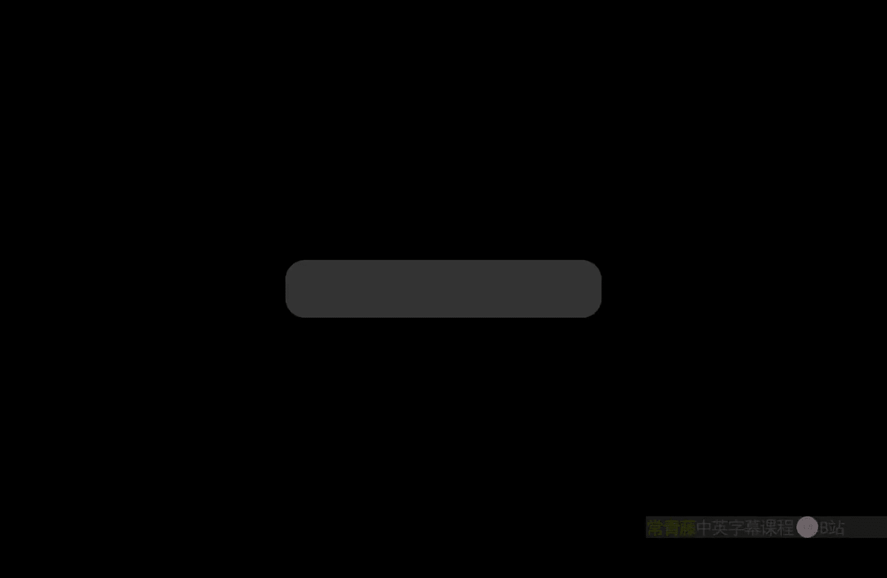
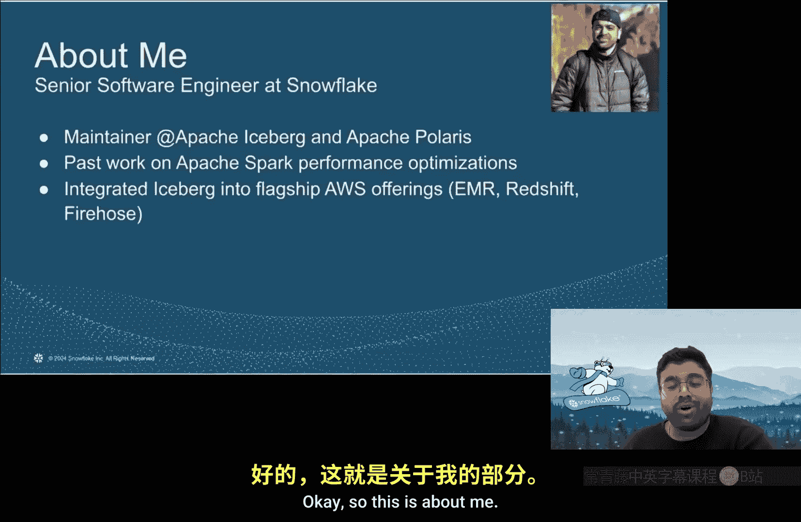
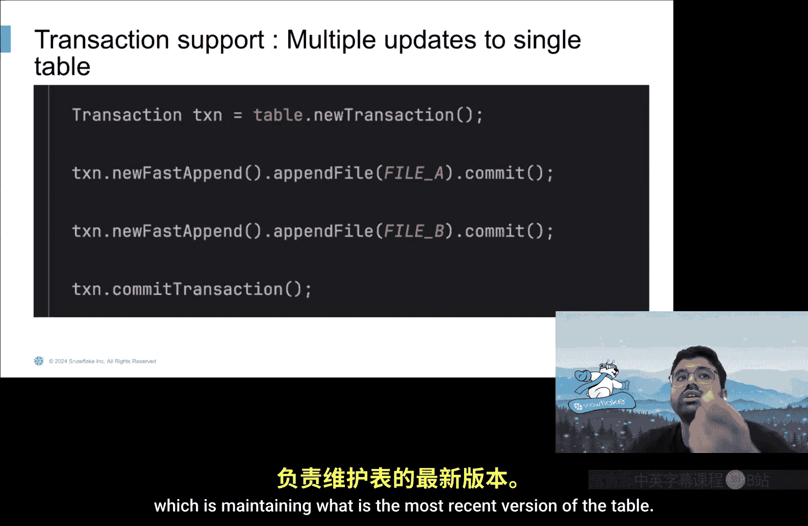
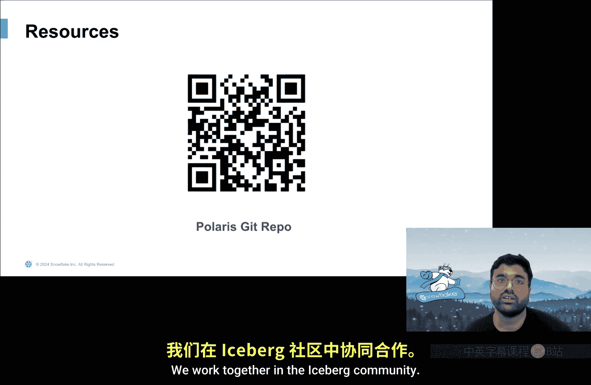

# 卡耐基梅隆【中英⚡未来数据系统研讨会系列｜Fall 2025, Future Data Systems Seminar Series】 p11 P11 From Storage Formats to Open Governance： The Evolution to Apache Polaris (Pr -BV17pidBkEzr_p11-

But just one for my peaces that pass， God blessedless they friends。

And check it out 9 pound because it's bad bro。Y it's time for Carnegie Mellon University's future data System seminar series made possible from Snowflake come talk to us about Ap Pol compatibleflake's。

Thanks Andy， it's great to see you all， let's get started。😊，Okay。

What we'll be talking about today is。Promp storage format。

 did why did we land to Apache Polariis all the journey that the community has taken together and what exactly are the benefits that Apache Polis provides So before that before we go into the details of it。

 I would like to introduce myself I'm a senior software engineer in snownflake I'm a maintainer of both the projects Pache iceberg and Apache Polariis In past I have worked on like optimizing spark performance like teasing through the backque plans optimizing and profiling the execution code that was generated by spark everything and squeezing every bits and tiny bits out of there from TPC TPC benchmarks Another interesting thing that I've done in past is I've integrated iceberg to these flagship payable offeringss。

 namely EMr and Redshift and Firos both three at three different world One is data lakeakes others is data warehouse and is a streaming injectionstion platform。

 So it was a roll coast of the journey that we did。Okay。😊，So this is about me。

 let's talk about what we will be talking today， okay？

We will be mostly talking about why iceberg needs catalog in the first place what is this word rest catalog that we see in the context of iceberg right now what is the rest catalog's current state and what is the future and what is a Paip Polariis taking the gradual journey from where iceberg started okay before we dive deep into that let's first try to understand the icebergs concurrency model okay iceberg supports。

Optimistic concurrency。What this means is that。😊，If my previous version is V1 and if a client wants to update with version V2。

 as long as the V1 is the version， I can update V2 and that's what is' showing here。

 it's a happy part that okay there are two writers。😊，Both working one after the other。

 so client one starts with version v1 updatess the table to version V2 client two starts with version V2 and then updates to V3。

 but again for all practical purposes， this is not a happy case。

So it is what happens when there are two concurrent writers， okay？

The there is bound to be a conflict because the base with which the client one would have started and client two would have started by the time one committed over the other that base would have been changed okay so let's say in this example client one started with version one it updated the table to version two。

But the client2 also started the same time the client one word has started and before it could commit version to dash。

Version2 was actually committed by client1， this means the base is now at V2。

It has now entered into a conflict mode now iceberg client。

 which is the engines which are running with iceberg libraries are now supposed to do the conflict resolution。

Make their updates based on the most recent base that is V2 and then commit V3 this is now used to be a client only thing that iceberg clients or the engines operating with iceberg used to do okay now with this optimistic and currency model iceberg also supported transaction APIs and I'll give you just a brief about iceberg supports to kind of isolation modes by example when is snapshot isolation and there is serializable isolation but this is a very simple transaction update that I will talk you through。

That a， I start a transaction， note that the transaction is table scopeed。

I started transaction given the table object that I had in handle of。

 which is based on a certain base or a version of the table。

And then what I do is that I add a file and I commit it。

 this means that I actually create a new version， but I have actually not updated that version to the actual table tracking pointer。

😊，Okay then I do another another commit to the table and again this is local I have not committed to it。

 but when I do it commit transaction that's where the actual point to swap happens or the optimistic concurrency comes into play with other concurrent writers still now every transaction is being executed locally based on the isolation level there are validations happening in the fly。

😊，Okay， so this was pretty much the state of what you could do with iceberg， okay？😊。

Now as we discussed what are the catalogs， why do we need catalogs I mean obviously we are doing a pointer swap right we are changing the version of the table there needs to be some authority with tracking what is the most recent version of the table to the course of that。

That's where we need a catalog and there are certain types of catalogs that iceberg has used throughout the journey。

So we'll start with one catalog that is actually the catalog which is maintaining what is the most recent version of the table。

And this is a storage catalog。If youll see there is a text file。

 literally a text file which holds which version of the table is the recent version。

And that's pretty much what the catalog is tracking right and every reader who wants to update something to the table has to read this particular file to know what is the most recent version of the table is。

Make their updates on top of this version and then try to commit and their commit has a requirement that as long as my current version of the table is the base with which I started。

😊，Let me commit to the team。And obviously， this is a storage only thing。

 so it has tons of other limitation like。😊，How do I identify where this version hint file lies。

 so it has to be in the namespace s table directory where this version file will lie。

It's hard to have a governance and we'll talk about that hey can everyone write to this particular directory is who is gatekeeping that I am the legitimate client who can actually access this particular value this particular file and muted this file。

😊，And obviously， each and every client is trying to load this file and then load the whole state of the table。

This is humous in a sense that。Everyone needs to create the metadata in their memory from scratch。

 rather than just operating on the parts of the metadata which they are concerned with。

And repeated queries can like。😊，Give you a very big bottleneck from the storage。

Especially in a sense like503s from S3s are very common and this is one of the recipe for getting a503。

😊，Plus there are additional concerns on the storage as well I mean since we are talking of atomic swaps。

 there are additional consideration with a very big cloud provider this cloud provider is Amazon S3 that we were talking about so as you might all be aware till 2020 S3 was not。

Read after write consistent meaning that if I've written something I might get an older version of the file right this was another limitation iceberg has been there for 2070 right and this is something that update came after 2020 in EMR from my EMR days we used to have EMRFS consistent view which essentially used to use have a dynamo Db pack to store okay which object got mutated and that view was what it was represented to the writers and everyone was supposed to connect to that particular EMRFS and the dynamo D Institute to have a consistent read after write consistency。

😊，The second additional thing， and this is where it becomes more tricky is that。😊。

Why can't I have monotonically increasing version numbers and I can say that， hey。

 if version9 is something that I want to commit。If someone has already written version  nine I will fail the request there was no such support from Amazon S3 at that point of times as well I know this is a requirement for Delta as well that we need to have monotonically increasing IDs。

Till 2024 there was no support for conditional right。

 this means that one writer could literally overwrite the other writer's already written version of the file if we were to rely on the version numbers that are specifically monotonically increasing and no writer if they have not successfully committed。

Can produce that particular number。Like Delta， iceberg also used to have like a Dynamo Db as a lock manager for AWS use cases。

This introduce another set of problems which we will deal later。

 but literally we used to have a lock manager so that all rights that are originating from a spark clusters。

Again。Make sure。That everyone gets to the central authority to acquire a lock and while it has acquired the look。

 no one else can take a look and then at the time when it has acquired the lock it does the atomic swap of the pointers。

I producing the object right okay？😊，So this。Was obviously not something that is going to scale and。

It required much more considerations to be thought through and。😊。

KNobs to be configured to make sure we get it right。 And if it the lot the。If we don't get it right。

 it can lead to table corruption and we'll talk about it even later。So what happened now was that。

Cage specific catalogs was something that were not even were not considered as production ready and even at this point of time。

 you'll see there are numerous threads in iceberg， which says that okay Hadoop catalog is not a production recommended catalog from。

A lot of founders are creators of Facebook。The obviously storage catalog。

 then we moved into another catalog， which is like catalogs backed by。

Metastore like a Mysql kind of a metastore or like high catalog such as like HMS fact。

 which is just an abstraction over any MySQqL or the relational database that is running and keeping track of this atomic swap of the。

😊，But。😊，Again， this got rid of the fixed directory name of the。Table location that we talked about。

 which was a pain for this three trotling point of view。It provided basic governance like， okay。

HMS has some basic integration with crros and everything。

 so it provides some basic governance on top of it like who can commit and who cannot not。

 but again it was not very robust， it was not standardized。Again。

Eine was still supposed to produce a version of a table and come to the catalog to make this version as the current version because the catalog is the one who is tracking that pointer to do the atomic soaps。

Okay， now in case of conflicts， again， this's a responsibility with the client to do the conflict detection and then find out what changed and then make their updates on top of what they change。

 your recompute and then commit again。The。Concern of caching that okay。

 once I figure out the what the recent pointer is， let's say if it's like version 1 do Jason。

 I need to reread that Jason recreate the whole table met data state and then come back to the catalog again after persisting that into the object store to make that pointer as the recent pointer。

So again， this has concerned on caching too。Nevertheless， it' required， if you'll see。😊。

Some things like JDBC provided。Sop of the pointer autoomically by in build locking mechanism。

 but things like hive still required something called as lock manager。

This is a standard lock manager interface for iceberg here。

If you see it has a standard acquire release obviously initialize so you have a。

Literally a leasing mechanism of a lock to a table。And if some writer dies。

 it has proper heart beating mechanisms that okay。If someone acquired a lock and it's not cleared for five minutes。

 then obviously no one can commit into that， but that lock is reclaimed and gotten rid of。With time。

 but again， this is very painful one such common case is。

Of a very practical scenario that we saw in customer use cases。😊，A customer had an EMR cluster。

And in that game at Lester， he configured the lock manager and it was very constrained to that particular account。

And in the same and in the same account， but a different EMR cluster he forgot to add dynaote that particular lock manager in the configuration the one writer was unaware that another writer is taking lock and doing everything it just committed on top of that it led to a table corruption like this。

If you'll see what will happen is that this。Literally， the file is missing， so what happened here is。

One writer。So both the writers were not aware of dental locking mechanism。

Or the central lock manager。 So one didn't get the lock and directly went tied to the meta and sort the pointer and。

Since it overwrote the pointer that the other one was taking and writing to write。

 this file was marked as orphan and the garbage collecting process actually reclaimed this file and deleted it。

But now in that client。knowns that it has successfully committed and tries to reread the data from this particular file。

 it says that okay this file is not FAab now what this means is that that process has entire processing that it has done on top of what the base it thought it was has failed。

So this is a very bad situation for a production use case。😊。

Where you have like hours of compute running and you need to make sure you have gotten all your knobs right and one particular thing you will notice is that the lock manager and the central pointing and the pointer that is being track by the catalog。

Are two responsibilities that client expected to be handed over to some another authority， right？

That's when the rest catalog came into play right to to understand this this is like a race condition where someone created this file but then before they updated the catalog and say this file is now whatever the latest version of the metadata file it got clean up by the cover collector that's the issue right and then this only happened because they were not coordinating through a central log manager which was expected to be configured in both the places to have it right for multiwriter scenarios and then if you go back to your diagram the previous slide or one more so you have hi catalog in JWB catalog these should I understand those boxes it like。

Things you could use to implement this or like these like where do those boxes have catalog GBC catalog mean。

 these are alternatives or。These are literally implementation of the catalog interface so catalog interface has a very standard load table update table APIs these are just implementation that are backed by a JDBC relation and implementation that is backed by a HMS implementation yeah so these are just implementation of the standard catalog interface with which the client is interacting to load the table。

So obviously people have implemented lock manager using zookeeper and we all know how painful zookeeper is。

It was very crazy scenario on multiwriter and getting it right and making it consistent so that's when。

😊，Community realized that okay， we need a reliable and a low latency commit。

 we need better conflict resolution。We need an easier client implementation and obviously we'll talk about the awareness like。

I all I need who can just read from the table and who can just read and write both from the table like a simple distinction not an analyst of a company is not allowed not not generally required to read write something to the table it's mostly they will have reading use cases where they will make dashboards out of it and the central table remains protected and they will have read only access and generally the。

Processes which are actually cleaning the data will have the right access to the data。

For these use cases， that's when the rest catalog got implemented and if you see there is a very interesting line that you'll see earlier the metadata layer was in the client world now what happens is。

The file generation， the central pointer or the table Street generation has now become the catalyst of the responsibility。

Essentially what a client is now saying is that hey， I' have generated a snapshot。

 can you include that snapshot into the table's history， that it？嗯。Now。

 this is taking some responsibility of generating this。Make datata pointer。And do。

Its own responsibilities， which is what catalog is taking here。Now， if you see。

 this will enable us our。Lets us get rid of that lock manager requirement because effectively what a client wants is hey I have generated a snapshot can you just include that into your table and it does not have to deal with like。

You know， any other writer is。There or not， it just is concerned that， hey。

 is my update applied to the table？And that's when the iceberggra catalog came into pictures。

 it solved a couple of use cases， if you'll see。😊，Namely， like。

The retry and the commit part of the things now the main con congestion was that two writers have actually produced their versions of the table and they want to make themselves as the current version。

 they need to be aware of other writers， they need to be aware of what if there is a conflict and some writers。

Haveve actually committed before me， how do I resolve the conflicts and based on that it has a very weird retry pattern and things like lock manager。

😊，I did more fire to this problem now these problems are now incorporated inside the catalog world itself。

Now server takes more responsibility pretty server here is a catalog and freeze the responsibility from the client that。

 hey， you just produce a snapshot of the table。If that is something that can be included to the state of the table。

 we will include that and we give you appropriate status quo and。

You just need to act upon the status quo， whether you commit succeeded or not， right？

Now it also enabled one interesting use case， right？

Can I do some commit deconfliction like one very common use cases？Think about compaction。

 compaction is a background process， essentially you wrote some small files。

And you want to compact it to a bigger set of files so that you get optimal split sizes in your spark and you get optimal performance。

Now。Essentially， this is not adding or removing any data its just replacing a data， so let's say。😊。

Have a table。😊，And a compaction job。Committed before my ingestion or a backfi job that is running from ATAs were about to commit。

Now this ingestion job would be writing some deletes based on the files。

 which compaction job rewrote into some other version。

 some other file or a bigger file now this whole processing has gone into ways because。

Positional deletes like basically you have a bitmap of a file of which rows have been deleted and you attach that bitmap to the particular file and maintain an index out of it。

😊，That whole processing has gone in， your eight hours of compute have gone in just because the background process has committed before you。

So this is where rest catalog can chime in and say that， hey， I know。Your base has changed。

 but it has changed because。A compaction or a background job has committed before you。

How about I just roll back the compaction now your base is the base with which you started and I allow you to commit。

And that is the simplest form of deconfiction that we could do， and I will talk about it more later。

 but this can help administrator or the platform owner to have or give priority to the processes accordingly。

 obviously in this particular scenario， compaction is always acting as a low priority process an ingestion as a high priority process if the owner wants to know or has to do some job that is of higher priority and does not want to stop their compaction process for a while。

 until the ingestion job is completed。😊，The other interesting thing that it can do and this is a general use case or the benefit of the catalog is multitable transaction so if you see earlier the iceberg clients or the interactions that we talked about are all tablecentric。

 but a catalog is aware of what mutations are happening of each and every table right？😊。

If I have a standard interface in which I am maintaining the state of each of the table and every client is saying that hey apply this particular update。

 this simplifies the problem of having multitable transactions a lot。😊。

And we'll talk about what API we are specifically talking about from the catalog point of view that will help those client。

And just talking about from the implementation point of view right less number of code written because this I literally don't have to generate this methodization file。

 I don't have to care about the serialization， decilization。

 how to optimally read the selected part of this file because。😊。

One thing about this file is this file bs to hundreds of M and we had one customer right and it was like hitting a。

Ps of roughly 200 and of a file because he was not expiring the snapshot so in this Jason file it carries the pointers or if we just go back to the structure here right it has all the snapshot that it is carrying and then the statistics of each of the snapshots in a very compressed astrona of Jason so it blos a lot and for compliance they were not literally not like cleaning of those snapshot this file size was plotloating they were not expiring those snapshot so now we literally don't expose this JasonN file writing and reading to the clients it's all maintained by the rest catalog themselves and what simplicity it provides this。

The rest catalog is not bound to store this in a JN file actually it can actually have a backing relational database in which it is actually storing those things and if when when client request actually the meta adjacent pointer for let's say sub purpose or let's say4 rewrite purpose it can request that and at that point we will materialize that so it helps in scaling those things as well the other interesting thing that it helps is caching of stuff because remember each and every client was loading that meta adjacent pointer to know what is the current state of the table now it does not need to I can literally have a on top of my backing relational database and I can serve the whole meta adjacent without going to the object store whose P95 can literally go to hundreds of MS in worst case scenario and just stream that data as part of my load table response and then make everything go。

Obviously， it helps in the ecosystem since I talk about the implementation point of view。😊，Yeah。

 that's one interesting aspect of things， though。One of all things we covered is shifting a lot of client responsibility to the server。

Imroved decision making in the commit time and then obviously easier client implementation so I will try to dig more on the conflict resolution part of the things in the multitrial transaction part of the things because these are the USPs that this iceberg risk catalog has provided because of the way and how the iceberg evolved throughout the time。

😊，So this is a feature that I wrote， it is only available in Apache Polariis。

 but it is only possible to have this feature in the first place because Apache Polariis is an icebergre catalog interface implementation。

😊，It is exactly the same feature that I talked about in previous slide that add a background maintenance process who committed before my ingestion process could commit and now I want that my ingesion process should be a higher priority commit and I'm okay in roll backing the compaction because I've spent a lot of computing just computing what I was supposed to and now I'm just not able to compute commit because the underlying base has changed and not only it has changed in in a synthetic way it has also caused logical conflicts like for example。

 if my ingestion job was supposed to write deletes。

Based on the files with which compaction rewrote into new files。

 those leads have now become obsolete and then this means that I need to reprocess that data as well but this。

Change of mind literally did was it。Here is an example of how it actually did。

 but it literally rolled back compaction， let's see what actually happened the。😊。

App client which can be spark in this side right he generated a snapshot S3 and told that hey。

 my base should be S2 as long as my base is S2。I am okay to commit so each date to the table is now broken into two things a requirement and an update requirement is that my base should be at snapshot S2 and given that it is a snapshot S2。

Make。S3 on top of S2 right this request is now sent as part of my load table。sorryrry， updatetable。

Now Polariis is aware right because it's stacking the table state and is very aware of what is happening。

 what all multiwriter commits have already happened or what are like in progress might be。😊，It just。

Pice to see that who， what is the most recent snapshot on top of the table history。

 you can treat of snapshot as like Gi commits， obviously they're not differential each snapshot is。

Efficient enough to describe the whole table state。

 but what time being just think about with them as commits to visualize this better。

But now Polariari sees that the table's current snapshot is now at S3。😊，But what it additionalally。😊。

What it additionally knows is that this snapshot has3 is of type replace。

 meaning that an compaction operation has happened here。

 which has neither added data to the table nor removed any data from the table。😊。

So this qualifies as a snapshot that Polaris can roll back。

The Polariis literally just says that okay， roll back S3 dash until I reach S2。

Given that I reach S2 as a base， apply S3 on top of it and then just track that as the most recent pointer so I have。

Roll it back。The compaction job that has actually committed there and。

Let my ingestion process oit on that。This is a feature that was very much requested by a lot of platform owners。

And this is only possible because of the。Opportunity to do some deconfction as part of the iceberg Ra catalog and Polariis is the only rest catalog that I am aware of the port this kind of deconfiction we'll talk more about Polariis but we'll talk more for Polariis from the angle of governance later。

 but this is the goodies from ISC specific。😊，Advocate curiosity， like like how much。

 how expensive is like the replace operation like it's compaction。

 So you're reading with yourself and writing yourself again like it could be。Could be large right。

 yes， that's true。I mean， we can。It can be huge I mean。

 we even have the statistics of how many files were removed， how many files were added if。

That for now it does a blind rollback of the compaction。

 but we can certainly add heuristics if we were to detect like let's say x number of files were rewritten into y number of files and based on X and y we can define some heuristics and then do the rollback。

 but yes。It can be very large and a compute intensive process in its own。Got it， thanks。Okay。

 so not talking it about from the aspect of multi table transaction。

If you see this is the rest API specification for the multitable transaction。

 what it essentially says is that give me all the updates of the table and the API guarantees that I will atomically apply all those updates to the table in one shot。

Obviously， this is not sufficient for transaction and this is something we are debating upon that there should be something there should be a notion of catalog sequence number where I can at the time when I write begin and when I first time I load the table。

When I am reading the table the first time that's when the catalog version is locked and every time I read the table。

 I need to read the table as of that catalog version。

For all the tables that are participating in a transaction and are part of a single catalog。

 having a RE catalog protocol like this and an API like this。

 which is multi table aware and can have guarantees like this can enable you to have multitable transaction。

 obviously the updates that you need to apply needs to have the validation based on the isolation levels that you want to configure like。

Icebergs are pushed to isolation， as I told before， snapshot or seal liable。😊，Based on that。

 you have to fine tune your client loads of the table as of that particular catalog sequence number or。

If don't if we don't want to go to the sequence number we have to define a notion of through time right catalog table version as of this particular time。

 so this is where we are actually debating on but this API right we run transactions commit。

Is already there which can actually commit those things atically for updates that are spanning multiple tables within the scope of a catalog now。

How to load those table， how to have exact big of semantics and how to have like these validation。

 whether it should be a catalog sequence number， whether it should be a true time that's something that we are debating at this point of time in the community but。

Having a catalog helps us in having fing of the multiple states at the same time in the multi table transaction world。

This is also now possible only because of the rest catalog interface and how we broke things from and how we took on responsibilities from client to the server end and now taking the ownership of how to commit things and how simple the client can be well if it has to implement this。

 obviously there has to be interfaces。In the engines and a lot of things because transaction as an interface is not very well defined from engine point of view。

 So it still requires a lot of testing and adoption。

 but this is possible is what I wanted to convey mostly from the。From the feature point of view okay。

😊，So these are the current features that we talked about of the rest catalog。

What is the future directions of the R Sky if you see？

The catalog can take the metadata reading and the manifestist passing also so literally what we are talking about here is the server site planning here。

What this essentially means is that a client now comes through the catalog with the projections and the predicates and。

😊，Iceberg。Rest catalog is now going to spit out the files or the splits。

 we have a very standard interface to convey back splits to the engines。啊。

I that it can actually give you the data I said you want to read right。

Catalog can take more responsibilities from figuring out which files to read and give them back to the server。

 which we call a server site planning and essentially this would mean that I can keep manifest list also in a table and I can have better indexes at the catalog level to figure out what all。

😊，Puilt what are corresponding data files based on the two level indexes that I have that's basically manifestist in the manifest file that qualifies for the given projection and the predicates that we are looking forward for。

😊，So this is one thing that we are working on， in fact I just raised the PR for this in open sourcebook right away。

 we have open PR for this。😊，The second thing that we are talking about is final grade commit and this is even more interesting in a sense that。

😊，Now a catalog。😡，Now a client will just give back the files it wants to commit to the table。

 not even like generating the snapshot， it will just literally give that， okay。

 commit this particular file。And now catalog's responsibilities to generate the snapshot and include the snapshot into the tables tracking history and everything now this simplifies a lot of use cases for CDC ingestion or like not CDC insion but for streaming ingestion where we are ingesesting like raw records like I haveend only ingestion use case。

And now。If I have like multiwriters who are just trying to add data to the table。

 they can just say that okay I have this particular file。

 I want to include that into the table history， they can literally just give the file to the catalog and that catalog will track the whole table state and include that particular file。

 obviously create a snapshot equivalent into it and then keep track of it in the met data pointer。😊。

The other aspect is the event endpoint， obviously we need to have some audit。

 we need to have some state tracking of how these entities changed over the time。

 so iceberg is introducing the notion of events and especially about the entities that the catalog manager will introduce the events for that。

The other aspect is， again， this is going beyond the storage format。

 but standardization of things that require standardization is UDS。

And this is where it gets very interesting so for now we are talking about standardization of the SQL Uds。

Obviously。UDS have dialect and everything its so the way iceberg works around these things is that UDF just acts as a container each engine can have their own dialect stored in that container so there will literally a dialect for Sp and then this definition of UDF in Sp then there's a dialect for Prino then there is a SQL definition for trino and then so on and so forth and obviously what are the properties of the UDS on how this UDF is supposed to be executed and what are the guarantees that UDF is making can there be overloads of the UDS and everything。

Idm potensency key is another thing， I mean， obviously since we are doing the protocol over the rest。

 item potensency key is very much required because。

There are internal STP rers if they are not properly taed it can lead to table corruption so adding imp intensitytency key to every mutating endpoint is something that we are going to add the other aspect that I'm working on right now is find in access control。

Etentially what it means is。😊，We want to standardize。The projections and the filters。

That needs to be applied。😡，By the reader。Based on the fine grain access control policies defined at the catalog。

 just imagine that。I have a。Against me， so against user pressure。

 there is a column masking policy defined that I am only allowed to see this particular column by stripping some particular。

Stripping first for characters this is a projection for me and I'm not allowed to see USA data so essentially what this means is that when I'm loading a table from the catalog。

😊，I will get back those instructions。So that the reader is aware that I need to apply those。

Instructions while I'm reading and processing and giving the output to the end user obviously this requires a trust relationship because just because I give instruction does not means that the client is going follow this instruction so there needs to be a trust relationship and that's why we need governance layer we will talk about it a little bit later in the when we talk deeper power polaris so given all of this person before you move forward to that and had a quick question you very nicely describe all the painful evolution that you have to go through to make this catalog behave like a catalog in a parallel or distributed traditional database system so now having gone through that evolution does it feel like that whole metadata layer that you have over here。

Needs to be completely rethought because now the client is going to interface with the catalog and the data files。

 a lot of the mess seems to be created from the semantics and the structural definitions of everything in this diagram that you have in the metadata layer。

Does it make sense to rethink this from scratch and try to do both principal design？

Pcisely and that's a very good question actually the community is rethinking about this structure a lot。

 so we have a V4 specification that's coming in which literally eliminates the need for manifestist。

😊，And we are trying to eliminate this redundant structures because you don't need a notion of manifest list a manifest which itself can track another manifest and this way you can simplify the commit process because now if I want to commit something right I literally have to let's say I want to write one file I have to write a manifest file for it then I have to write a manifest list file for it and then I have to write a metadataja file for it there are three set of additional metadata files that I need to write and the community is now literally working on chopping down these additional overr so that we can have literally very fast commits on that front yes we are thinking and making progress on that front eliminating one taking one step at a time So the immediate step that will happen as part of the V4 specification as the elimination of the manifest list what we will have is just one manifest file and metadata file and we will see through how it performs and then make it call accordingly but I'm saying it should not even be file based right if you look at a classical parallel or distributed database system。

😊，That supports updates like Spner is a good example right and there are lots of databases that have been doing this for a while where they natively will support some form of sva evolution where they have to solve these problems and their metadata layer is not file base it's more structured base based on table so should you be getting away from the notion of files itself in that middle layer and be defining it in a more structured really that you or more something because ultimately you're then going to try to put a database to manage that middle layer like should you just cut the middleman out and try to do a native design that's more relational in nature for the metadata layer to begin with。

I mean， definitely there are thoughts on this。 I mean。

 I think Dec Lake is one of the things that say that we want to have metadata like relational back。

These two level indexes， but for now I think it's just like we are just as a community taking one step at a time definitely I think there is a merit to that particular thought and we are working towards that but I think one of the use case from that file point of view is that it's easy to put things from one to other and giving responsibilities of recreating the table structure on their own from the client point of view so I would say yes there is a merit to that cut but are we obviously taking steps towards that I think we will reach there but not immediately so yes there is a merit to that thought but we are not there yet I would say you yeah。

😊，ok。都嗯。Any other questions from that friend？Okay。I'll now go into introducing Apache Polaris。

Catalog， so basically everyone wanted everyone talked about the specification a lot。

 but there was no actually fully operational implementation of a catalog that actually adheres to the spec。

😊，And nevertheless， we required governance on top of this because we are assuming that every client can read and write to this particular storage location。

 but that's not the true and for all production use cases， that's not sufficient。😊。

So that's where Apache polarariis comes in， it's a governance layer and a full fleshed production ready implementation。

😊，Of IRC specification。It is initially like。Developed by snowflake and it has been contributed to Apache one cool thing about this is like Bennobu is the one of our founders。

He' is the one where actually， if you'll see the very first commit of a partialip Polaris。

 you'll see him as an author， it has all the snowflake learnings in a partialip Polaris。😊。

Other things are that it's now maintained by many people of the industry。

Like we have contributors from Google Confluent。PC members from Google， Confluent， AWS。

 and many more。The key features that the Ca provides。

 obviously it's built for IC because all the specification and all the goodies that we talked about。

It is。It is from day one IC compatible the other thing that it provides is the role based access control and credential bendending we'll talk about that more in the later。

Again， it's a catalog for multiple formats。 it's not just focused with iceberg。

 though we started with like。IRC specific but we now have support for Delta and Hoie and again。

 it can act as a catalog of catalog because who has one catalog today？

We can actually fit to another catalog where the catalog will support IC interfaces or the HMSs。

And we'll see from there。So I just wanted to show you the landscape before here was a landscape that we started with that okay。

 there are engines who only support certain metatoes and only certain formats in that particular metao and。

This crisscross and it was a very major concern for interoperability point of view while iceberg rest catalog interface solves major problems for the interoperability point of view。

 for example， the server side commit protocol that sorry server side planning that I talked about you can really expose any table as an iceberg table because in the end。

What all clients？而。Concerned of is that what files I need to read， obviously， there is a。

And learning go on which。今 thatあ。What is the specific scheme of that particular format。

 but again that is something we can work around， but yeah this fragmented landscape is where we started from and。

This is how and what Polaris offers at this point of time。

 this is what we want to propose in the roadmap I'll go through feature by feature and number one is icebergre specification obviously we talked a lot about it so Polariis is iceberg rest compli from T1。

We also added the support for Delta。Which is essentially doing governance of Delta。B Polariis。

 obviously it is not the Dlta commit protocol that we have actually implemented it's just like holding delta objects and then governing based on top of that so that's the support we have at this point of time obviously catalog federation that hey I can be a catalog of catalog I can federate to un I can federate to glue and I can federate to anything。

The third， the fourth one is the roll based access control and I think this is the major one because any organization wants their data to be govern and protected by central like certain rules and everything。

And we'll talk about that later on how polarari Arb solve this problem the credential vending is one critical piece that。

え？Are all the clients？Oposed to read and write and how do clients get the credential to interact with the storage like for example。

 if my admin has told that this particular client is only allowed to read the data from the table。

It should not get a credential to do an S3 port or S3 delete in terms of Rob like in terms of proper like S3 IM policy5 Im talk about the based on what。

Grantants and privileges you have， you get rented credentials accordingly so that you can feed those credentials to the client and interact accordingly。

The other aspect is identity and federation identity federation and SSO so whenever you will join an organization you will get a ad Snowflake account or you will have an Otta account and everything so identity is managed centrally by some admin or the other it's not like you will create a user for Polariis and you will have a corresponding user map to your identity and privileges CPPN for example I am an engineer in snowflake I am auto enrolled into the engineer group into my corresponding Otta account and whatever identity and groups I belong to gets automatically reflected in Polariis when and how I access the table that gets applied automatically at the time of authentication。

And then Polaris acts as a policy tool。😊，Then there are table maintenance policies。

 the catalog migtor。Is another aspect that okay you have a number of catalogs you can just migrate into our catalog。

And go from there。Like migrate to Polis。The other thing is data lineage。

 obviously everyone wants to know and track the history of where the data got region and how it's evolved over time and everything。

So data image is another thing that we are in the proposed roadmap that we are working on。

The other aspect is and row column access controls， obviously we'll talk more deep about it。

 but this is something is an additional governance that we want because this is for all practical purposes。

 this is a requirement for all industry for all industrial purposes。

Tgging is another aspect tagging is like， okay， you have a sensitive data。

 you tag it against that and whenever you want to know。😊。

Policies against that particular sensitive tag data you can just query it so you can just tag an entity inside polarariis and know that so that's something communities are actively working on。

Another is encryption， obviously you want even you can't like these are the scenarios where you can't press the storage。

😊，So you want the data to be encrypted by the。Keys that Polariis manages and whenever you are authorized you get an encrypted keys or you get the credentials that can possibly decrypt if I talk about the proper S3 permissions in terms of what credentials that get rendered to AWS credentials that get rendered to you。

Like all enterprise catalog you need audit and events so that's one other aspect that you need to have instruction data is another thing。

Which which very resonates to volumes that we want and we have we are we have like。

Support for this coming up there are proposals there。

AAC observability hoodie hoody will be another format like what we have support for Delta。

 we can extend that for hoody to just have like basic。

This control on top of it the last aspect is the format conversion because like see we are the ones who is actually giving the metadata about the data。

Can we based on what the client wants to read Hoie or Delta。

 we can do the table conversion or trigger or maintain the converted versions of the table by interacting through a table conversion service and give you back the corresponding。

Aable format that you or the client would be requesting for。

 this is something also that we have active proposal in。With given that， let's deep dive into the。

Roll based access control and the credential vending part of the things before I go to the RrbC where the authorization comes into play。

I will try to explain briefly about authentication。

Authentation is just polar is trying to know who you are， right？

Pulas can have users of its own Polaris can maintain their own user or it can to interact to an external identity provider like Google Octa to know who you are and what groups you belongs to and then authenticate based on that and iceberg Ri only defines authentication so there is a standard worth protocol that's defined against all the SDpis that I showed you to authenticate a call。

Okay， so third third party authentication， third party authentication is one of the most requested feature for all enterprise gear customers that hey。

 I want to maintain all my users and their group membership in a dental place can。

Poariis be one another application that I manage and Polariis can get the user and the group membership from interact interaction with that identity provider this is what Polariis authentication is right now obviously since Polariis has identified who you are and which groups you belong to。

Pariis now wants to authorize let's say you want to update a table it wants to authorize that are you allowed to do what you're trying to do right and that's where authorization comes into play Polaris Arabic model is very similar to what that of snowflake is。

We have principle， we have catalog rule and we have principal rule。

So just think of Alice like me and you will be an employee in a company which will Alice right。

 then there will be a service a which will be a principal role and then there will be a catalog rule which will be a catalog a so。

I say that， okay， I can identify a user with a principle。

I can group the privileges using a catalog rule， and then I can grant those privileges to a principal using the principal rule。

So here the privileges that I am granting via catalog admin role is that anyone who has catalog admin role can read the data。

 write the data， update the table properties， list the tables， list the name， piecess and everything。

And is this is how the ArbAC is defined， so an admin is supposed to grant these privileges to you and once Polaris is identified that okay who you are。

 what groups you belongs to， it will try to find out based on what operation you are trying to do。

 do you have sufficient privileges to do that on if you don't， then you get a straightforward 403。

 otherwise。😊，You're allowed to follow through and you'll get a success。到。As I told before。

 let's say an admin just granted you to read the table， right？

What Polaris will do is that because at the time of loading the table， we don't know the intent。

 whether you will just be reading or reading and writing both。あ。😊。

Poariis will just ven the credentials that are only good for doing S3 getss and not for S3 puts and S3 deletes that's what scoping down the vened credential means and obviously this will be scopeed down to the prefixes with prefixes which this table belongs to in the in the actual object store。

So that you don't get escalation of privileges， like you don't get more privileges than you require only for the directory that you have access to of the table and based on what privileges are defined。

 you'll get the corresponding rendered credentials accordingly。

S3 signing is another use case because not everyone supports STS， things like Apache ozone。

You literally give a signed URL and you expect the client to use the signed URL to do the S3 permissions they want in that case they don't have to present the S credentials they want to。

And obviously。As you can see。This is what was required for the authorization angle of what polaris requires。

The other aspect is the Pi policies。From the Polariis policy point of view。

Plarari can act as a policy store too where you can just。

Arbitrarily define and attach policies to the entities， those are inheritable。

So before we dive into what Polariis policies are trying to solve。

 let's see what exactly was the landscape before。So there is no standardized policy anywhere。

There is no semantics or like let's say if I define a policy in polaris right。

 how will S perspective it， how will snowflake respect it。

 there needs to be standardization of that as well。

While IRC standardized a lot of things it didn't standardize the policy aspect of things then there are other aspect of different aspect not from the authorization point of view but from the maintenance point of view as well like hey I want to run compaction of this table for every four hours right this can be defined as a policy as well so policy just an instruction which is defined in a welldefined object that you want every engine or the executor of that particular operation be aware of so that's what polarari is trying to do is trying to be act as a policy store and at the same time defined standard for the same。

So。There are two engines with which polarari supports custom policies for currently we have。Policies。

 both from。Access control point of view and from the table maintenance point of view。

And policies are version and everything。Here is what a China schema looks like。

If you define a policy， you can roll back to a different version of the policy in case you messed up and everything。

The other aspect is polar are polarariis policies are inheritable like for example。

 you attach policy to a namespace， right？And。😊，Automatically all the tables inside the namespace will inherit those policies that's a very interesting feature that polarariis has so let's say for example I have a namespace and in that namespace I have I want to run。

😊，Table compact I want to run compaction for all the tables in that particular namespace in every four hours。

 you can define that at this point of time by attaching just that policy in that namespace and it will work as it is。

But respect is， obviously， who can read these policies， who can define these policies。

 who can attach these policies， and these are covered in the polarariis privilege model obviously。

Attach， create， delete， these are all privileges inside Polari R model。

 one which administer explicitly grant。To make sure it works and to end。

And once these policies are defined， at least at this point of time。

 two engines that support is sparkar and snowflake。It will work with it。到。

It is protected by the RVC model of Polariis， the policies。And presently， Polaris has just。

Some predefined policies mainly from the compaction because it was very easy to standardize them and it is also openly extensible to any other policy that you want to define。

So this is a standard example of what the policy would look like here is a data of action policy that you're trying to create。

😊，And you can just attach this policy to this particular table inside the namespace。

 so anyone who is trying to get the get applicable policies will get to know that this policy is attached to this particular table。

And there is a Pythency a librarian for this as well。😊，嗯。

You can enable and use as per your convenience and those two engines as I told and we require more engines to adapt to these policies for the whole ecosystem to develop。

 but this effectively helps standardizing and giving a structure that everyone adheres to。

To make a like this policy the like the the scheme and all this this is Polariero specific this is not in the icebergs spec Yeah yeah these are Polarii specific these are not iceberg specs so we have to make integrations to all the clients yeah。

And then does iceberg have its own equivalent of this or they haven any sort of this got it， no。

 there is no standardization of public。Y yeah， obviously as I told about the inheritable policies and the predefined policies。

 those are here and they are available as of SpRC 1。0。😊。

TheAnother aspect that you might be interested is。This is when Polaris is acting as a policy storeer themselves。

 right？Poariis also supports federation to external policy decision points， like for example， OPA。

 we also have something brew with support of Apache ranges which are very well established policy stores。

So。Client makes a request to Polariis and this policies can be anything as I told that table compaction policies are one aspect of policies which we are standardized in Polariis but in general authorization policies are a very well defined objects there right so literally what we can do is that whenever a client makes a request to Polariis。

At the time of authorization when polarari is making authorization decision。

 it delegates to the external policy store that is OPA in this case。

 and now OPA takes the responsibility of giving us the decision whether you were authorized or not and which based on the decision you get a 403 or a 200。

😊，We also support as of Polariis 1。3， we will support。

Pederation to external policy tools too for making the authorization decisions。

The other respect that Polaris wants to solve and hear me are， this is a very interesting。

In this case， that is basically defining ruin column policies and enforcing those。😊。

A policies to those Indians。For example。What are row and column level policies I'm not allowed to see certain columns or MLr to only see certain columns push some transformation and I'm not allowed to see certain rows which match certain filters。

 that's what a finite event policy is with what we discussed earlier。

We can define arbitrary policies， we will standardize this policy。

 masking policies in polarariis as well so someone can define that， hey。

User Psan can't see data from USA。That could be one of the room asking policy。

 but then how will you enforce this policy to the engine， as I said？

You will just say to the engine that hey， you should do this right。

 but what guarantees and especially in terms of security that engine will do it。

So that's when like we need something like that of trusted engine。That actually。

So presently what so far what we have been authenticating is a user right， that hey。

 user is Pant right， but is the user Psant using an engine who is going to enforce the policy or not？

This is something a relation of trust needs to be established between the catalog and the engine for this we require。

😊，Both engine and the users to be authenticated at the same time。

 so in O there is a very useful flow that's called on behalf of that we can use on this front or we can even use MTLS or anything to make sure that along with the user what engine the user is using because what generally happens is that a user starts the Sp session feeds in its credentials and then Spark just percollates those session all the way to Polaris but at this whole time a user is Polaris is not aware that a user is using Sparper is just making a random re。

For that we need a trusted entity because not every spark environment is secure by default。

 so we are working on introducing a notion of trusted engines in Polariis。

And once that's established， what will happen now is that an admin defines a ruin column level access policies。

😊，Poaris evaluates those policies， literally says that， hey。

 these are the projections you need to apply， these are the row filters you need to apply。And。

It will， first of all， it will return those instructions only when the。

It pressed the engines which the user is using。Once。

Those instructions are sent from the catalog to the engine。

The expectation is that engine adds those project node and the filter node in their query plan。

Execute that result and only gives the output of the result to the users。

And that's where the trust relationship， the requirements of trust engines。

 the specification of how and what that structured object is going to look like are in debate there was one such proposal in partialip polars for this is called CTR views it's a very close industry paper that you will read about is data guide from LiedIn essentially it's exploiting one interesting fact that whenever you do a select star from an identifier。

Edine does not know whether that identifier is a table or a view， right？So。

 you can give from the catalog an impression that this identifier is not a table but a view。

 and in that view you can embed your row and column level access policies。

As part of the view definition， it will literally be select。

Project one prompt the table where this filter is through and then return it back and Indian will just execute it as if it's executing a normal security so another aspect is the I re restrict which is just standardizing the view object rather and being a super string a well defined iceberg object so this is a specification we're working on in the community too。

But yeah。This whole thing requires catalog coordination and there are some parts that need to be exclusively built in a partial polaris。

Obviously。When we talk about this there is something there is a notion of context right because when you write a policy you will say that hey current user or current principle here should be presant if the current user case when current principle is persant then do this case when current principle is not presant and something of that sort right so these card text functions need to be part of the definition。

 but what you can do is the catalog side is。You know who the user is right you can actually resolve that context and just with the instruction that is applicable to the user because you already know the user is pressed on and you can evaluate that particular part of the policy and then just say that hey。

For user perant， you are just supposed to see the data from USA and then just send it there and there are a number of context functions that the catalog can support that's current principle。

 current principle role， current catalog role and current IP。For example。

 I already know who the caller's IP is because Polaris has seen an IP of the call of the client and I can literally say that Is from USA are only allowed to see this particular column I can define that and embed that in the policy。

Obviously， we are working on standardizing the JuDF spec in SQL so we can even write complex policies like that requires joints and everything。

And obviously， we have not reached to a conclusion of an intermediate representation yet， but。😊。

With the multi dialect version where every engine is storing its own dialect and that SQL is just acting as a container is something we can leverage for now until we have a consensus on that。

😊，And last but not the least catalog of the catalog federations so I will just jump into the Pols federation this is where Polaris can act catalog of catalogs and again this is a very powerful user feature because you can have like for some of the jobs you might be using some of the platforms and you might need。

😊，Noflake or any other platform to be aware of those catalogs right so for that case you need federation right so polararis can also add like catalog of catalogs。

And if you'll see a very simple and holistic view is that an iceberg user from the Polari server directly feds to the remote catalog。

 Polariis server maintains the connection。Do that remote catalog and just。

Do a pass through of whatever you are and send it to the downstream use a downstream catalog and then get the appropriate response and give it back to you also polararis can act as a governance layer on top of the remote catalogs because generally what happens is that。

The identity used here versus identity used here is not properly propagated because。

The way identity fedederation works， because some people support。

A user in Polaris is only available to or。A user in Polaris is something that only Polariis knows and not the remote catalog。

So there are tons of problems when you do identity federation on how do you federate the identity that is this user is using to the remote catalog how will。

That federated。Identity have privileges on the remote which you want a subcope in the polarari server this is another set of challenges that the fedederation produces。

 but for now it is just a J like just in time and I pass through kind of a scenario where you make a call to us we will just make a call to you our downstream catalog and then just like give you back the responses system。

So we have like both types of federation like Hop fedederation is like we have something called notifications API where we just subscribe to the feed。

 you can literally say that okay， something has changed into that endpoint and we'll create a static forcade of it with whatever metadata you give us as part of that hit。

TheAnother is the pastal Federation， as I talked about， you call me， I'll just forward the call。

Obviously， identity fedederation is a tricky thing to crack because the connection that this server to this remote catalog。

 right？あ is。We will be using our identity different than what is used from here to year because this is like two machine to machine communication。

 this might not be the exact same user that you have。So this is a problem that we need to solve。

 so for now we don't have identity federation， but we have passed through for most of the cases and that's how it will work。

Well， that summarizes my whole talk about governance from the polarariis point of view。😊。

We joined the community， we have like people from snowflake Cri， Google， Microsoft。

 confluent and everyone who is actively contributing and adding code we recently have some gentlemen from Bloomberg who added the external policy decision point or OPA and integration to Polaris。

So whatever you're interested with， please。Beeel free to open a poll request against it H to help in any ways possible。

不。All right， I clap I will clap behalf the audience with little over time。

 so we have time for one question。So。It sounds like okay this is a good overview because this sounds like there's the iceberg stuff happening but then there's also Polariis。

 there's having separate invitation and I understand like the iceberg you're involved in the iceberg so as the spec evolves're adding new things but at the same time Polariis is like prioritizing things that your customers or the community needs and has there ever been in the case where there's something you guys need to add that or you want to do I know you had the menu like the future roadmap。

Where like， that would conflict with。How iceberg spec is being defined or evolving。

 and then how do you then make a decision to proceed with the piece that you guys want to add versus have to follow the iceberg spec？

No precisely I mean one very good example on this is that there's always a race between things that we want to standardize in Polaris versus things we want to definitely standardize in iceberg because if iceberg deviates or takes a different routeut it will be very late for Polaris the one common example is returning the evaluated R and column level access policies back。

In Ps， we were just thinking that hey。We can have a ranger like model where we can just define the policy on our own engine just integrates it and get back。

 but then it was decided that how about we try to standardize this in icebook specification and as part of returning the metadata about the table。

 how about this can be an additional metadata that I can say or return as part of the metadata of the table the restrictions that needs to be applied because when I'm returning the metadata of the table。

I already know who you are。This can be an additional metada you need to apply so obviously there is a trade off I would say and the things which we want to standardize in iceberg we want to standardize on iceberg。

 but there are some things that we will have to standardize in polars， for example。

Attacks and everything。 we， we go for polarari。 obviously。

 it's a trade off and sometimes we hit sometimes we missed。😊，Got it。 All right。

 We have a question in the chat。 I don't know if the person wants to un mutute themselves and go for it。

There's two questions。Adici， you want to go first？Yeah。

 sure what I wanted to ask was from the perspective of external PDps。

 we were looking at it from the perspective of some kind of more robust。

Authorization schemes for the external user question where there is that what kind of features do you expect to be opening up via the external PDpss and what kind of a security thread do you look at it opening as well？

😊，Yeah obviously I mean one interesting aspect is that we are just making an authorization decision of yes or no right other thing would be like can we take authorization predicates or more authorization context and then take a decision finally in polarariis so it can be a mix of both of things in a sense that。

A part of decision or the authorization context has been given from the external policy store。

And now that we have that authorization context rather than just a bullion yes or no。

 whether I'm authorized to do or not。I am making additional calls。

Based on what is additionally additional information there's available level in polaris。

 So that's an additional revenue that can open One common thing I can think of like the row and column level policies defined in rangeangr could be。

Applied via Polis if as part of that external PDP federation I could get back the applicablelic policies。

 I could transform them into iceberg equivalent structure and then send it back so that's definitely one extension I can think of。

From the security point of view， I think one obviously we need to have a trust relationship between the external PDP and the catalog。

 so obviously that trust needs to be there and from the client I think since the expose the underlying user。

That interacts with is polarariis itself， so nothing must changes from that point on the security posture and whatever we are interacting with external PDP that that remains to have a secure communication between two machine to machine。

Does that answer your question？Yeah， it does Pre。 Thank you so much。 Qui an interesting approach。

 things。All right， there's one more question from AD。

Hi Pra thanks this was a very informative talk I was just curious how you see unity playing this like is this just competitors or can you work together。

😊，I was wondering if you had any thoughts on that。In what aspect any particular aspect that I talked about。

 you want to know or are you talking about in general？In general。

 that's because unity also seems to be trying to address many of the same questions。

I see obviously there are some things that has mutual benefits， for example。

 you know everything converges into iceberg World， so unity is now also supporting IRC interface。

So there are things where we are working together in defining that specification。

 obviously the things that we can't agree upon needs to be settled in iceberg world， so I would say。

It's better to like things that we want to be pari specific only like our R back model is something that's very polaris specific and it's very simple and proven。

😊，That's not something I don't know whether unity will integrate to or not。

 but there are things which we can commonly agree upon and strize upon we work together in the iceberg community。

That's how I've seen， and I think that's what is happening us。

