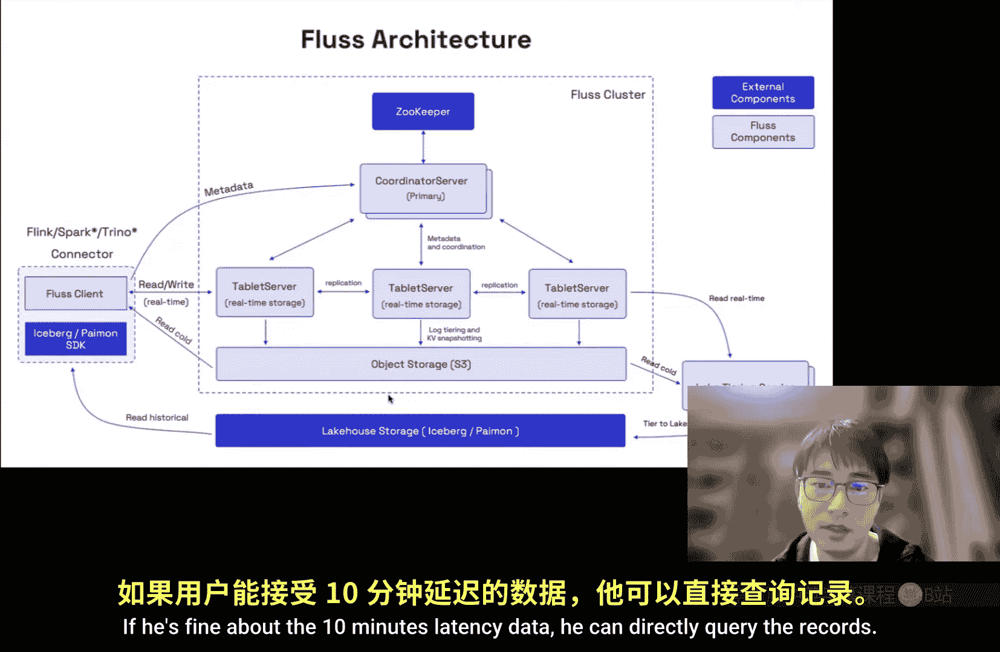

# 卡耐基梅隆大学未来数据系统研讨会系列：P12：Apache Fluss：实时湖仓的流式存储 (Jark Wu)

在本节课中，我们将学习 Apache Fluss，一个专为实时湖仓设计的流式存储系统。我们将从流处理的基本概念入手，探讨 Fluss 的设计动机、核心架构、关键特性，以及它如何与数据湖仓集成，最终实现统一的实时与历史数据视图。

## 流处理与增量物化视图

上一节我们介绍了本次研讨会的背景。本节中，我们来看看流处理的基本概念。

Apache Flink 是一个用于流处理的分布式状态计算框架。它提供 Java 和 Python API 来构建流处理应用。与 Apache Spark 这类处理有界数据的批处理框架不同，Flink 用于持续处理无界的数据流。

批处理中，用户启动一个作业，它处理一个有界数据集，计算完成后作业结束。数据是被动的，查询由用户主动触发。而在流处理中，作业启动后会一直运行，随着新数据的到来持续更新结果。查询是被动的，数据被主动流入查询以触发结果更新。

批处理适用于每日报表和分析，简单高效，但结果在你运行批查询之前是过时的。如果你需要实时、持续更新的结果，这就是流处理的用武之地。流处理无需重新计算所有数据，而是基于到达的变更进行计算，这也被称为增量计算。

一个现实世界的流处理用例是 TikTok 的实时推荐系统。该系统利用 Kafka 和 Flink 等流技术，构建了一个尖端的实时机器学习架构。在 TikTok 上，你看到的下一段视频是根据你最近的互动（如点赞或观看的视频）动态选择的。这种实时数据对其业务至关重要，因此他们采用了“流优先”的数据基础设施策略。

TikTok 的实时推荐系统建立在流式数据架构之上，它利用 Flink 和 Kafka，以流式方式实现从整合用户行为数据到动态特征生成、再到在线模型更新的反馈闭环。这是流处理的用例之一。其他用例还包括欺诈检测、实时监控、告警和实时分析。

Flink 是构建此类数据管道最常用的工具，这在数据库中也被称为增量物化视图。你可以将 Flink 视为增量物化视图的流式计算引擎。

但在实践中，你需要在 Flink SQL 中定义源表和目标表，告诉 Flink 从哪里读取变更以及将变更写入哪里。例如，左边可能有一个交易表，右边有一个收入表，它们可能是 PostgreSQL 表或 Kafka 表。然后，你可以定义一个 `INSERT INTO ... SELECT FROM ...` 查询。这个查询会被翻译成一个 Flink 作业并执行，以消费左表的变更，并将变更写入右表。

这个查询就是一个由 Flink SQL 维护的物化视图。Flink SQL 只是维护物化视图的计算引擎，它本身不持有持久化数据存储。因此，你必须为物化视图提供自己的存储，可能是 PostgreSQL、Iceberg 或 Kafka。

Flink 实际上并不读取表的静态快照，而是持续读取表的变更日志，类似于 MySQL 的 binlog。Flink SQL 的所有算子始终在变更日志上工作，并将结果变更日志发送到结果表。因此，物化视图的计算是基于变更日志的增量计算，而流式变更日志是支持 Flink 和增量物化视图的存储的关键特性。

## 现有存储的挑战与 Fluss 的诞生

上一节我们了解了流处理和增量物化视图。本节中，我们来看看构建此类系统时面临的存储挑战。

这里存在一个挑战：因为实际上没有适合 Flink SQL 在大规模、实时场景下构建增量物化视图的存储。

*   **PostgreSQL** 不适合大数据场景，因为它专为 OLTP 工作负载设计，扩展性或高吞吐能力不足。
*   **Kafka** 不支持更新或生成变更日志，并且通常由于成本原因只保留 7 天的数据。而物化视图可能需要数月甚至数年的历史数据用于回填和早期计算。
*   **Iceberg** 不是一个实时存储系统，它提供的延迟超过 10 分钟，而我们需要毫秒级的延迟。此外，Iceberg 不支持流式读取或低级别的变更日志，而这对于增量物化视图至关重要。

这就是创建 Fluss 项目的原始动机：为 Flink 构建一个流式表存储，并与 Flink SQL 协同工作，为增量物化视图提供更好的性能和体验。

Fluss 提供了先前存储系统所缺失的三个关键特性：
1.  它支持低延迟的流式读写，读写操作的延迟在毫秒级。
2.  它支持多表，并能生成类似 MySQL binlog 或 PostgreSQL 逻辑复制的变更日志流。这些变更日志也可以大规模实时读取。
3.  Fluss 是一个分布式存储系统，可以通过添加分片或服务器进行扩展。
4.  它使用数据湖仓作为历史存储，使其能够保留数月甚至数年的长期数据。

因此，Fluss 与 Flink 结合，可以构建一个低延迟的增量物化视图。

## Fluss 的定位与架构概览

上一节我们探讨了 Fluss 的诞生背景。本节中，我们来看看 Fluss 在整个数据系统生态中的定位。

考虑一个存储矩阵：左侧代表事务处理系统，右侧代表分析系统；底部是批处理系统，顶部是流处理系统。
*   对于需要批查询的事务工作负载，你有 MySQL 和 PostgreSQL 等 OLTP 数据库。
*   对于需要流处理的事务工作负载，你有 Kafka 和 Pulsar 等消息队列。
*   对于需要批处理的分析工作负载，你有 Iceberg 和 Snowflake 等数据仓库。
*   但对于需要流处理的分析工作负载（如增量物化视图），业界一直没有存储解决方案。Fluss 填补了这一空白，成为一个专为分析工作负载设计的流式存储系统。

此外，我们可以观察到左侧的事务处理系统都是行式存储。相比之下，Iceberg、Hudi 等分析存储是列式存储。分析查询偏好列式格式，这对于流式分析也是如此。因此，Fluss 被定义为一个列式流存储。

下图是 Fluss 的架构概览。Fluss 是一个分布式存储系统，数据在 Fluss 服务中被复制和持久化，同时使用对象存储进行数据分层以降低本地存储成本。Fluss 可以独立使用，也可以与数据湖仓集成，将湖仓作为其历史数据存储。该系统使 Fluss 成为湖仓之上的实时数据层，从而将湖仓转变为实时湖仓，在统一的表视图中同时提供历史数据和实时数据。

接下来，我们将深入探讨 Fluss 的概念和架构，然后讨论它如何与湖仓集成。

## Fluss 核心概念与架构

上一节我们概述了 Fluss 的定位。本节中，我们来深入了解其核心概念和架构。

在逻辑模型层面，Fluss 提供两种表类型：日志表和主键表。
*   **日志表** 是没有主键的表，它只支持仅追加插入操作，并产生一个仅追加的日志流。
*   **主键表** 是设置了主键的表，它支持按键进行更新和删除。对该表的所有插入、更新、删除操作都会生成一个仅追加的变更日志流，其中包含 `INSERT`、`UPDATE_BEFORE`、`UPDATE_AFTER` 等事件。

仅追加的日志和变更日志是 Fluss 中的基础模型和关键特性，为所有表提供流式读取能力。

以下是 Fluss 集群的详细架构。Fluss 集群有两个主要组件：协调器服务器和表服务器。协调器服务器充当协调层，并将元数据存储到 ZooKeeper。表服务器是实时存储组件，将冷数据分层到 S3 等对象存储以降低本地存储成本，同时也将对象存储用作检查点快照的持久化存储。

右侧的湖仓分层服务不是集群的必需部分，但仍是一项 Fluss 服务。它像一个独立的压缩服务，将数据从 Fluss 移出，并转换为 Iceberg 格式和 Parquet 文件等湖仓存储格式。

左侧的 Fluss 客户端为 Spark 和 Flink 等计算引擎提供读写 API，并处理历史数据和实时数据的统一。客户端与 Fluss 协调器、表服务器交互，同时也直接从对象存储读取数据。

Fluss 是一个分布式存储系统，因此表被划分为分片并均匀分布在集群服务器中。在顶层，表按分区列划分为多个分区。分区是 Iceberg 中的类似概念，分区列可以是表中的日期、国家或业务单位列，但分区对表来说是可选的。在分区内，数据进一步划分为表桶。
*   对于主键表，数据通过主键哈希分配到桶中。
*   对于日志表，数据均匀或随机分布在桶中。

表桶是读写的数据单元，也是数据迁移和备份的最小单位。

对于日志表，每个桶在 Fluss 集群中物理存储为一个日志片。对于主键表，每个桶有两个片：一个日志片和一个键值片。日志片充当变更日志流，同时也作为键值片的预写日志用于恢复。每个日志片由一系列日志段组成，日志段是磁盘或对象存储上的日志文件。每个键值片是一个 RocksDB 实例，支持高性能的实时更新和查找。

## 读写路径与持久化

上一节我们介绍了 Fluss 的架构组件。本节中，我们来看看数据的读写路径和持久化机制。

首先，我们看看日志表的写入路径和持久性。对于日志表，数据被划分为日志片。在物理层面，默认情况下，每个日志片有三个副本：一个领导者和两个追随者。客户端将日志追加到领导者，领导者将日志持久化到磁盘上的本地日志段。同时，它将数据复制到两个追随者。一旦大多数副本完成复制，领导者就向客户端发送确认，表示追加成功。同时，领导者还会定期将本地日志段分层到远程对象存储，以降低本地存储成本。

分层后的日志段也可以由客户端直接使用 S3 API 获取。当 Fluss 客户端从给定偏移量读取流时，如果偏移量仍在本地磁盘上，表服务器将从本地磁盘返回日志批次；如果偏移量已被分层到对象存储，表服务器将返回相应分层日志段的元数据，从而允许 Fluss 客户端直接从 S3 读取这些段。这种设计特别适用于在追赶读取期间卸载 Fluss 服务器的读取负载，这在回填或重新计算物化视图时非常常见。

接下来是主键表的写入路径。因为主键表具有不同的 API，它是一个可变表，所以写入支持通过 `putKV` API 进行更新或删除，读取支持表的变更日志扫描或键值查找。`putKV` API 接受一个包含一组键值记录的批次，请求被发送到键值片的领导者。我们可以看到，主键表的每个桶中，键值片的领导者和日志片的领导者是共置的，以避免分布式事务，因为我们必须保证日志片和键值片之间的一致性。

对于 KV 批次中的每条记录，它首先从 RocksDB 读取以生成变更日志，因为变更日志必须包含更新的前像。然后，它将变更日志应用到其日志片，并等待日志被复制。一旦日志被复制，就意味着事务已提交，此时表服务器使变更日志和 KV 记录对用户可见。最后，它向客户端发送确认，表示 `putKV` 操作成功。

关于持久性，键值片会定期且增量地将 RocksDB 快照文件上传到对象存储。变更日志充当键值片的预写日志。因此，如果服务器崩溃，可以通过下载最新的快照并从相应的下一个偏移量重放变更日志来恢复状态。当下日志片执行快照时，下一个偏移量与 KV 快照一起存储。

这些键值片领导者可以有零个、一个或两个追随者，这可以在表级别进行配置。如果存在追随者，它会维护一个热的 RocksDB 实例，当原始领导者故障时，可以快速接管领导权，而无需等待下载快照文件和重新初始化 RocksDB。

对于读取，主键表的 KV 查找请求被发送到 KV 片的领导者，然后被转换为 RocksDB 查找，因此对主键表进行 KV 查找非常高效。也可以扫描主键表的变更日志，但在大多数情况下，用户希望先扫描表的最新快照，然后切换到从变更日志中读取，并保证一致性。

在这种情况下，Fluss 客户端会向协调器服务器请求 KV 快照文件以及对应的变更日志。然后，Fluss 客户端将下载日志片快照文件，并从这些文件初始化 RocksDB 实例后读取快照记录。最后，Fluss 客户端将切换到直接从日志片读取，从快照的偏移量开始。变更日志的读取遵循我们之前提到的从日志片读取的相同模式。

## 列式存储与性能优势

上一节我们完成了读写路径的介绍。本节中，我们来看看 Fluss 的列式存储设计及其带来的性能优势。

分析工作负载偏好列式格式，实际上流式分析也是如此。因此，Fluss 从设计之初就被设计为列式流存储，这使得流式分析非常高效。Fluss 以列式格式存储日志表批次，以在文件系统级别实现投影下推。你可以看到日志表变成了一个实时的列式流。

Fluss 客户端首先将记录累积成批次，并使用 Arrow IPC 流格式将每个批次汇总为 Arrow 向量。然后将这些 Arrow 批次发送到日志表，日志表以零拷贝的方式将这些 Arrow 批次从网络追加到磁盘上的日志段文件中。这些 Arrow 批次自带 Arrow 元数据头，允许文件读取器仅从磁盘获取请求的列。Arrow 是一种列式格式，按列存储数据。

例如，考虑一个包含从 A 到 Z 多列的表，数据在文件系统中按列存储。现在假设我们有一个聚合查询，按 A 列分组并计算 B 列的和与 C 列的最大值，这意味着查询只需要读取 A、B、C 三列。

物化视图会向服务器发送日志读取请求，请求中包含一个列投影，以告知服务器它只需要读取 A、B、C 列。这个投影一直被下推到文件系统级别。因此，所有不需要的列在磁盘读取时都会被跳过，从而节省了不必要的网络 I/O 和内存。

此外，Fluss 客户端在客户端侧解码所需的列，这将提高吞吐量并降低 CPU 成本。我们对许多生产工作负载进行了基准测试，如果你的物化视图只读取 10% 的列，你可以实现 10 倍更高的吞吐量，并减少 90% 的网络流量。同时，你仍然拥有毫秒级的读取延迟。

列投影下推并不是使用 Arrow IPC 格式作为日志格式的唯一好处。我们还在开发谓词下推，以利用每个 Arrow 批次中的列统计信息，根据查询谓词过滤批次。更重要的是，使用 Arrow 作为数据交换协议将极大地增强 Fluss 与查询引擎的集成，因为 Fluss 只是一个文件存储，不提供计算能力，需要查询引擎进行计算。这使得查询引擎能够直接在列式流上进行一些分析，这个能力是接下来要讨论的实时湖仓的构建块。

## 流式统一与实时湖仓

上一节我们探讨了列式存储的优势。本节中，我们来看看 Fluss 如何实现流式统一，构建实时湖仓。

Fluss 引入了流式统一的概念。这是流存储和湖仓存储的统一，其中 Fluss 作为湖仓之上的实时数据层。如前所述，Fluss 包含一个湖仓分层服务，会定期将 Fluss 数据转换为湖仓格式，并且只保留 Fluss 数据很短一段时间。然后，湖仓充当流存储的历史数据层，负责存储具有分钟级延迟的长期数据。另一方面，流存储充当湖仓的实时数据层，存储具有秒级/毫秒级延迟的短期数据。这两层彼此共享数据，但在执行流式读取时，作为一个统一的表视图暴露。

湖仓为高效的追赶读取提供历史数据，并降低了存储此类长期数据的成本。当运行批查询时，流存储会在几分钟内将数据桥接到湖仓，从而将传统的批分析转变为实时洞察。我们称这种能力为“统一读取”。

在用户 API 层面，Fluss 表和湖仓表作为一个统一的表视图暴露。所有的读、写和更新操作都在同一个表对象上执行。Fluss 表在本地磁盘存储热数据，在 S3 存储冷数据，而长期历史数据则由湖仓表存储在 S3 中。统一表会将来自不同存储层和不同存储格式的数据拼接在一起，在一个简单抽象的单一表下透明地暴露给用户。这就像一个具有多个数据层（热层、温层、冷层）的数据库系统，每层驻留在不同的存储介质上，使用不同的格式，数据库系统确保所有层之间的数据集成，并向用户呈现一个单一的表。因此，用户无需担心底层存储细节。

## 统一表视图与湖仓分层

上一节我们介绍了流式统一的概念。本节中，我们深入探讨实现存储统一的关键：湖仓分层和统一表视图。

Fluss 客户端是拼接这些表的关键组件，它提供了实时和历史数据的统一视图。Fluss 客户端将读取操作转换为统一读取，结合历史读取结果和实时读取结果。我们在客户端侧而非服务器侧实现统一读取，是为了获得最佳性能，因为它可以充分利用湖仓 API（如并行读取和投影/谓词下推），而不会给 Fluss 服务器增加任何开销。我们稍后会深入探讨统一读取。

除了统一读取，湖仓表驻留在用户的湖仓系统中，它不是 Fluss 的内部格式，因此也可以被 Trino 或 Snowflake 等湖仓查询引擎直接访问。

但写入操作更为复杂。Fluss 客户端会将所有写入和更新路由到 Fluss 表。然而，不允许直接写入湖仓表，因为这会破坏数据一致性保证。因此，Fluss 表是统一存储的单一写入入口点，分层服务会持续将数据从 Fluss 表移动并转换到湖仓表。

未来，我们计划限制只有最新的分区可以通过 Fluss 表写入，同时允许旧分区直接写入湖仓表。这将支持像覆盖 Iceberg 历史数据这样的用例。

湖仓分层服务是一组执行分层任务的无状态工作节点。它们部署在 Fluss 集群外部，以避免影响 Fluss 服务器，因为它们执行一些繁重的工作。这些工作节点被设计为无状态的，可以水平和垂直扩展，使得分层服务易于操作，并且可以在流量变化时进行扩展。

当分层服务启动时，它会向 Fluss 服务器请求一个分层任务。分层任务指定了需要分层的表以及该表的起始日志偏移量。然后，执行器将任务拆分为每个桶的分层单元，并将它们分派给分层写入器。每个分层写入器将从起始日志偏移量读取 Arrow 批次，并使用 Arrow 原生库将它们转换为 Parquet 文件，因此这是从 Arrow 到 Parquet 的直接转换，非常高效。如果 Arrow 批次包含删除记录，这也可能生成一些删除文件。

一旦所有分层写入器完成，提交器将创建一个 Iceberg 快照，并将日志偏移量作为快照属性提交到 Iceberg 目录。这个快照属性中的日志偏移量非常重要，因为它是实时数据和历史数据之间的分界点，客户端将使用这个点将它们拼接在一起。最后，提交器还会将快照和结束偏移量提交给 Fluss 协调器，让系统知道下一个分层偏移量。监控器也会将分层偏移量信息通知给表服务器，表服务器随后可以删除该偏移量之前的数据，以在实时层中保持较小的数据集。

## 统一读取详解

上一节我们介绍了统一表视图的构建。本节中，我们重点探讨其核心：统一读取。

统一读取是实时湖仓的关键，它提供了实时和历史数据的统一视图。有两种统一读取：用于流查询的统一读取和用于批查询的统一读取。
*   对于流查询，统一读取支持高效的回填，因为它使用湖仓作为历史数据源。这为用户提供了长期存储和高效的下推优化，以剪裁不必要的数据，减少网络 I/O。
*   对于批查询，统一读取为所有湖上分析提供实时洞察，因为它使用 Fluss 实时层作为湖仓的实时数据。传统的湖仓分析通常处理延迟 10 分钟或数小时的数据，但通过批统一读取，你可以获得秒级的新鲜度。

以下是流式统一读取的工作流程。想象你正在构建一个实时物化视图，比如计算实时用户指标，你需要从历史数据开始，然后持续处理新事件。首先，Fluss 客户端获取最新的 Iceberg 快照及其存储在快照属性中的日志偏移量。这个日志偏移量告诉我们从哪里开始消费 Fluss 的数据。其次，它直接从 S3 读取 Iceberg 快照，利用投影/谓词下推和文件级并行实现高效读取。这为我们提供了最高的吞吐量，且不会中断 Fluss 服务器，同时可以访问长期的周期数据。然后，它将切换到读取 Fluss 日志或变更日志，从 Iceberg 快照中存储的那个日志偏移量开始。这样，你就可以获得一个完整且恰好一次的历史数据和实时数据视图，没有重复，也没有丢失数据。

这对于流查询工作得很好，因为增量物化视图基于变更日志工作，我们只需要将变更日志发送给下游引擎。然而，批查询期望数据的静态快照，我们需要为批查询将变更日志与历史数据合并。但这会使事情变得非常复杂。

如果是日志表，没有变更日志，无需合并，批统一读取的工作方式与流统一读取相同。但主键表会生成变更日志，而所有批查询引擎都不期望变更日志，因此我们需要将变更日志与历史表合并。

有两种方法：第一种是读时合并。读时合并是 OAP 系统中广泛使用的方法，在读取时合并基础文件和增量文件，以避免在更新期间重写整个文件。我们使用这种方法与 Paimon 数据格式一起，提供高效的批统一读取。第二种方法是基于删除向量，但这仍在进行中。

在介绍读时合并方法之前，我想简要介绍一下 Apache Paimon。Apache Paimon 是另一个类似于 Iceberg 的开放表格式，但针对流式更新进行了优化。它采用 LSM 树架构，对于高吞吐更新非常高效，并广泛用于许多 KV 存储。

在 Paimon 中，所有数据文件都按主键排序，并组织成 LSM 树，从 L0 到 L5 进行分层压缩。这使得 Paimon 上的读时合并超级高效，并且读取的记录输出已经按主键排序。

下图是批统一读取的读时合并模式。左侧是 Paimon 中的历史数据，在最新快照中包含 Jack 和 Judy 的记录，该快照中的日志偏移量指向 Fluss 流中的一个位置。在偏移量 5 之后，有两个变更日志条目：Timor 的插入和 Judy 的删除。当批查询运行时，引擎从 Paimon 快照读取基础数据，并从该偏移量开始从 Fluss 读取变更日志。然后，它在内存中执行排序合并。历史数据在 Paimon 中已经按主键排序，所以我们只需要在内存中按主键对变更日志进行排序。由于变更日志只覆盖几分钟的数据，它通常可以放入内存。现在我们有了两个排序列表，我们可以高效地工作并输出最终结果。

但是，读时合并对于批查询存在性能限制，因此许多数据湖格式和分析系统引入了删除向量作为更高效的批查询方式。Iceberg 不提供主键排序的读时合并，因此支持 Iceberg 上批统一读取的唯一可行方法是利用删除向量。

我将从高层次介绍这种方法以分享核心思想，但这仍在进行中，未来设计可能会改变。在 Fluss 中，删除向量是一个紧凑的位图，用于标记数据文件中哪些行在逻辑上被删除，允许查询在读取时跳过它们，而不是合并变更日志。

在这个模式中，我们有三个删除向量：
*   **Iceberg DV**（灰色）存储在 Iceberg 中，标记基础数据文件上的删除。
*   **日志 DV**（粉色）存储在 Fluss 中，标记实时变更日志流中的删除。
*   **湖仓 DV**（黄色）也存储在 Fluss 中，标记应用于最新 Iceberg 快照的基础数据文件的删除。

日志 DV 和湖仓 DV 在 Fluss 中为每个表更新实时维护。Fluss 在 Fluss KV 存储中构建一个将主键映射到 Iceberg 文件位置的索引，并使用该索引实时更新湖仓 DV。因此，当生成新的 Iceberg 快照时，湖仓 DV 也会被刷新到 Iceberg DV 中。

现在考虑这个例子：你在 Iceberg 中有历史数据，在最新快照中包含 Alex、Judy 和 Jack 的记录，Alex 在 Iceberg DV 中被标记为已删除。然后，一个 Timor 的插入和一个 Judy 的删除到达。Fluss 会记录变更日志，并在日志 DV 中将 Judy 标记为在变更日志中删除，同时也在湖仓 DV 中将 Iceberg 数据文件中的 Judy 标记为删除。当批查询运行时，引擎从 Iceberg 快照读取基础数据文件，并从偏移量开始从 Fluss 读取变更日志。引擎还会读取三个删除向量，将日志 DV 应用于变更日志，将湖仓 DV 和 Iceberg DV 应用于基础文件，然后我们可以得到最终结果，无需排序和合并。

## 元数据同步与未来展望

上一节我们深入探讨了统一读取的机制。本节中，我们来看看实现统一存储的最后一个挑战：元数据同步。

Fluss 和 Iceberg 仍然是两个独立的系统，它们有自己的元数据存储，因此最后的挑战是如何保持它们之间的元数据同步。我们不使用分布式事务来更新元数据以避免冲突。相反，我们使用一种简单的阻塞方法。例如，当添加列时，我们首先将更改应用到 Iceberg 目录。如果成功，我们再更新 Fluss 的元数据。如果这也成功了，我们就通知 Fluss 协调器和表服务器；否则，我们将回滚 Iceberg 目录的更改。这有点棘手，因为该过程不是原子性和事务性的。但由于元数据更新非常不频繁，这种方法在实践中效果很好，我们未来可能会改进它。

实时湖仓的愿景实际上依赖于由各种查询引擎（包括 Spark、Trino、DuckDB、StarRocks 等）支持的统一读取。我们还在开发统一读取的删除向量模式，以期为批统一读取提供更好的性能。最后，我们希望更好地统一元数据，以允许统一读取直接在 Iceberg 或 Paimon 目录上工作。

Fluss 在半年多前捐赠给了 Apache 软件基金会，目前正在 Apache 孵化器中孵化，因此它是一个开源项目。如果你想探索这项技术，可以从 GitHub 获取源代码。

## 总结

本节课中，我们一起学习了 Apache Fluss，一个专为实时湖仓设计的流式存储系统。我们从流处理和增量物化视图的挑战出发，了解了 Fluss 如何填补分析型流存储的空白。我们深入探讨了其列式存储架构、读写路径、以及与数据湖仓集成实现统一表视图的机制。Fluss 通过将实时数据层与历史湖仓层结合，并利用统一读取，为流处理和批处理查询提供了低延迟、高效率的数据访问能力，是构建下一代实时数据基础设施的重要组件。