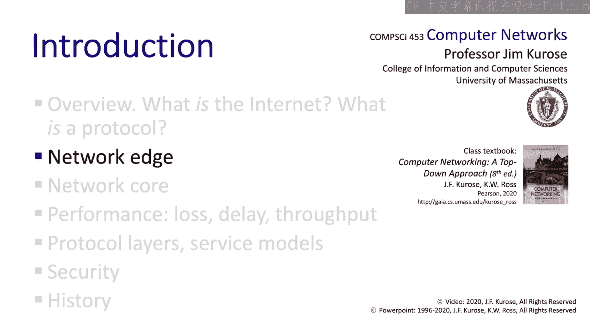

计算机网络：自顶向下的方法：P02-02：网络边缘

## 概述
在本节课中，我们将学习计算机网络中的“网络边缘”。我们将探讨连接终端设备到互联网的“接入网络”，以及用于传输比特的“物理介质”。理解这些概念是理解整个网络如何工作的基础。

---

## 网络边缘回顾
上一节视频中，我们介绍了网络边缘的各种设备，如计算机、智能手机和家用设备。这些设备有时被称为“主机”，因为它们承载或运行网络应用程序。主机可以是请求服务的“客户端”，也可以是提供服务的“服务器”。在第二章中，我们将看到客户端和服务器在网络上下文中的精确定义。

上一节我们还简要提到了接入网络和物理介质，这正是本节要重点讨论的内容。此外，我们也谈到了由互连路由器构成的“网络核心”，以及这些独立的、有管理范围的网络如何互连形成“互联网”。以上就是我们开始讨论的大背景。

---

## 接入网络
本节中，我们来看看接入网络。接入网络是将终端系统（主机或设备）连接到更大的全球互联网的网络。它本质上是将设备连接到从源到目的路径上的“第一跳路由器”的网络。接入网络主要有三种类型：
*   **住宅接入网络**：连接家庭到互联网。
*   **机构接入网络**：由公司、教育机构或市政当局运营。
*   **移动接入网络**：由蜂窝网络运营商和Wi-Fi网络运营。

在讨论这三种接入网络时，你可以关注两个关键点：
1.  该接入网络的比特传输速率是多少？（即网络速度有多快？）
2.  用户需要在多大程度上与其他用户共享该网络？

---

## 住宅接入网络：有线电视网络
让我们从最贴近生活的住宅接入网络开始讨论，首先看看**有线电视网络**。

如下图所示，在有线电视接入网络中，一条物理电缆将多个家庭连接到一个位于右侧的“电缆头端”。进出这些家庭的信号以不同频率在电缆上发送。以不同频率发送的信号不会相互干扰，这类似于FM广播电台在不同频率上发射信号，我们则调谐到想要的频率。有线电视接入网络基于相同的方法，称为**频分复用**。

但频率资源是有限的，因此有线电视用户通常需要与邻居共享一个频率。我们将在第6章详细讨论有线电视接入网络及其DOCSIS标准。现在，请先理解这个核心概念，细节留待以后学习。

有线电视网络通常是**不对称的**，这意味着它们被设计为在“下行”（到家庭）方向传输数据比“上行”（从家庭）方向更快。这种不对称性反映了我们往往是数据的消费者多于生产者的事实。

典型的有线电视传输速率在下行方向为40 Mbps至1.2 Gbps，上行方向为30至100 Mbps。当然，实际速率可能因情况而异，你的调制解调器通常会根据你购买的服务套餐进行速率限制。

再次注意，有线电视网络是一个**共享网络**。它本质上就是一根共享的线缆（通常架设在电线杆上）。这意味着如果你和你的邻居共享一根电缆上的一个频率，而你的邻居正在大量收发数据，这可能会影响你能够发送和接收的数据量。

---

## 住宅接入网络：数字用户线路
第二种主要的住宅接入类型是**数字用户线路**。

DSL网络使用现有的电话线（有时称为“双绞线”，因为有两根铜线缠绕在一起）将你直接连接到所谓的“中心局”。因此，在你和中心局之间，你**不**与邻居共享传输容量或带宽。

与有线电视网络一样，DSL线路也是**不对称的**，下行传输速率为24至52 Mbps，上行传输速率为3.5至16 Mbps。这些传输速率在很大程度上取决于中心局与你家之间的距离。事实上，如果距离太远（通常超过约3英里），就无法使用DSL连接到中心局。

---

## 家庭网络内部
现在让我们看看家庭内部。一个典型的家庭网络可能如下图所示。

来自本地电话公司或有线电视网络的DSL或有线电视链路进入家庭。在链路家庭端有一个电缆或DSL调制解调器，它连接到一个兼具有线和无线功能的路由器。路由器通过有线以太网（通常运行在100 Mbps或1 Gbps）和Wi-Fi（运行在数十或数百Mbps）与家庭内的设备连接。通常，路由器、调制解调器、Wi-Fi和以太网功能都集成在一个设备中。当然，还有我们之前讨论的家庭设备本身，即主机和终端系统。

---

## 无线网络
既然我们已经在家庭网络的背景下提到了Wi-Fi网络，让我们先来看看无线网络。整个第7章都将专门讨论无线网络，所以这里我们只了解其概貌。

一种思考方式是，无线网络基本上分为两大类：
1.  **本地无线网络**，例如Wi-Fi。
2.  **广域网络**，对应于3G、4G以及即将到来的5G蜂窝网络。

对于本地无线网络和数字蜂窝网络，都有一个实体——**基站**或**接入点**，终端设备通过它发送和接收数据。

以下是两种主要无线网络的对比：

*   **Wi-Fi网络**：
    *   也称为无线局域网。
    *   不仅用于家庭，也广泛部署于市政、公司和其他机构。
    *   覆盖范围约10至100米。
    *   运行速度从11、54到450 Mbps不等。
    *   由IEEE在802.11协议族下标准化。

*   **蜂窝网络**：
    *   指3G、4G和即将到来的5G网络。
    *   由移动蜂窝运营商运营。
    *   覆盖范围可达数十公里。
    *   每个用户的传输速率从1-10 Mbps到数十Mbps不等。

---

## 企业网络
最后，还有企业网络。我们可以把一些企业网络看作是“加强版”的家庭网络。企业网络可能混合使用有线以太网和无线Wi-Fi链路。与家庭网络的一个不同之处是，企业网络通常有多个交换机和路由器来处理连接到该网络的大量设备。

另一种完全不像家庭网络的企业网络是**数据中心网络**，它以数百Gbps的速度将大量服务器相互连接并连接到互联网。我们将在第6章详细讨论数据中心网络。

关于接入网络，我们就先讲到这里。我们将在第6章和第7章中再回来详细讨论。现在，你可能想思考一下我们一直在谈论的物理介质——铜线、光纤和无线电链路。我们马上就会讲到这些。

---

## 数据包的概念
但首先，我想简单说一下“数据包”。我使用了“数据包”这个短语，我们也讨论了发送方如何将数据包发送到接入网络。这到底是什么意思？

让我们看看这里的主机，它正在向这里的第一个交换机发送数据。考虑它的发送操作：在最高层面，主机有一些想要发送的数据，比如一个大文件。主机会怎么做？

主机会将要发送的数据分割成更小的数据块，称为**数据包**。除了数据本身，它还会在每个数据块上添加一些额外信息，称为**数据包首部**。协议会明确规定在这个首部中添加什么信息。一个数据包（数据加首部）的长度为L比特，L的典型值可能是1500字节。

然后，主机以某个传输速率R（以比特/秒为单位）将这个L比特的数据包发送到接入网络中。正如我们已经看到的，R因接入网络类型而异。我们看到，使用有线以太网，主机可以以1 Gbps的速度发送，但在3G或4G网络上，它可能被限制在几Mbps或更低。R最好被视为链路传输速率，但有时更非正式地称为链路容量或链路带宽。

如果要以传输速率R向链路发送一个L比特的数据包，那么将这些比特发送到链路中所花费的时间就是**发送的比特数L除以传输速率R**。我们稍后会再回到这个概念。

---

## 物理介质
我们将通过快速了解不同传输介质的物理特性来结束本节。但在这样做之前，我想简单说明一下我们在这里的覆盖深度。

关于调制、编码以及与比特物理传输相关的内容，有很多有趣的话题可以讨论，但一门课程能容纳的内容有限。因此，在这里我们将相当简要地介绍。如果这类内容让你非常兴奋，想了解更多，你绝对应该选修另一门课程或阅读另一本相关的书籍。

我们将从一个相当高的层面来看待不同传输介质的物理特性。我们将关注比特丢失特性、信号如何干扰、传播延迟是怎样的，但不会深入探讨不同物理传输介质的工作原理细节。如果你想深入了解，请查阅更多资料。这当然是一个关于网络的问题，我们将从这里开始，逐步深入。

以下是一些关于物理介质的基本事实。记住，我们想要做的是通过某种物理介质从发送方到接收方发送数字比特。

物理介质可以是**导引型介质**，即某种物理电线或电缆（可能由铜或光纤制成）；也可以是**非导引型介质**，信号在其中自由传播，如无线电波或声波。

以下是几种常见物理介质的对比：

*   **双绞线**：
    *   过去指真正缠绕在一起、为你祖父母家传送电话信号的电线。
    *   现在也指以太网或ADSL，运行在数百Mbps，有时可达Gbps。
    *   可能易受电磁噪声干扰。
    *   你可能在家、办公室或学校见过这样的以太网电缆。

*   **同轴电缆**：
    *   过去用于将有线电视网络接入你家，运行在数百Mbps。
    *   老式以太网实际上曾使用这样的电缆运行，但至少20年前就不再使用了。

*   **光纤**：
    *   传输光脉冲，运行在数百Gbps或更高速度。
    *   误码率非常低，因此在某种意义上，它们是通信的理想选择。
    *   但发射和接收组件往往比传统铜线的更昂贵。

*   **无线链路**：
    *   比特被调制到电磁频谱某个频段承载的信号上。
    *   没有物理电线，传输往往是**广播**的，意味着发射设备附近的任何设备都可能接收到发射的信号。这显然引发了窃听和干扰问题。
    *   无线环境对传输无线电信号来说 notoriously harsh：信号随距离衰减；根据频率不同，信号可能被物体反射或阻挡，或者在其他频率下直接穿透墙壁等物体。
    *   它们容易受到电机、微波炉和其他发射RF信号的设备产生的噪声影响。
    *   因此，通过无线传输比特需要在物理层做大量工作，这就是为什么有整门课程专门讨论这个主题。

你可能熟悉多种类型的无线链路。我们已经讨论过Wi-Fi网络，它可以以高达数百Mbps的速度传输，距离可能为数十米。4G蜂窝网络以数十Mbps的速率传输数据，距离可达约10英里。你们中的许多人可能使用蓝牙，它被用作电缆替代技术，以相对较低的数据速率（例如最大1或2 Mbps）运行，覆盖范围相对较短，通常不超过5或10米。

还有其他形式的无线网络，例如地面微波，以数十Mbps的点对点方式运行。卫星的传输速率大致相同。对于卫星，存在明显的**传播延迟**（即比特从发送方发送到接收方接收的时间）。在发送方/接收方与地球同步卫星之间，有明显的270毫秒传播延迟。

---

## 总结
本节课我们一起学习了网络边缘的核心组成部分。我们探讨了连接终端设备到互联网的三种主要接入网络（住宅、机构和移动），并了解了数据包的基本概念。我们还简要介绍了各种物理传输介质（双绞线、同轴电缆、光纤和无线链路）的特性及其典型应用场景。这些知识为我们理解数据如何从网络边缘开始其旅程奠定了基础。接下来，我们将深入**网络核心**，探索数据在互联网主干中是如何被路由和转发的。