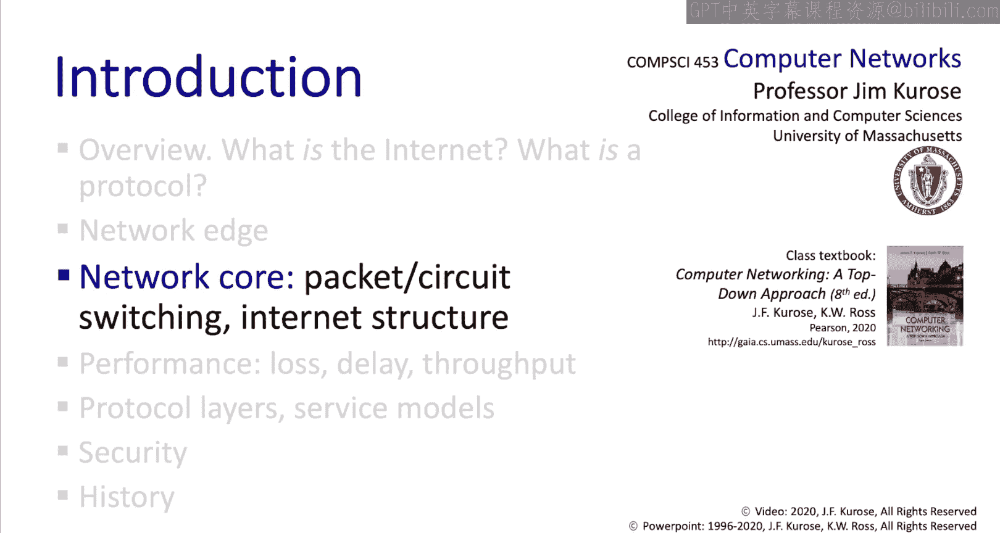

# Jim Kurose《计算机网络：自顶向下的方法｜Computer Networking： A Top-Down Approach》中英（deepseek p03 -03-1.3 The network core.zh_en -BV1UMtueiEaA_p3-

。

In this section we're going to overview the network core。

 we're going to see what happens inside the network core and we're going to introduce a number of important topics。

 we'll talk about packet forwarding， packet queuing delays and packet loss。

 we'll talk about an alternative to packet switching known as circuit switching and we'll talk about the structure of the internet we'll see what we mean when we say the internet is a network of networks。

The network core consists simply of a set of routers that are interconnected by a set of communication links。

 and the Internet's core operation is based on a principle known as packet switching。

 which is really relatively simple。 The idea is the following。

 What happens is that the end hostss that we talked about earlier take application level messages D those messages into chunks of data。

 Put those chunks of data inside packets and send those packets into the Internet。 Now。

 those packets are then forwarded along a path from a source node to a destination node for example。

 from a web server， maybe to your laptop that's running a web browser that made a request from that web server。

 So let's unpack that last statement just a little bit because we actually heard a lot of important words there。

 We talked about forwarding。 We talked about a path from source to destination。

 and we talked about a source and a destination。 There are two key functions。

Formed inside the network core， forwarding， sometimes also known as switching and routing。

 Let's take a look inside a router so we can see what these functions are。

Forwarding is a local action。 It's about moving an arriving packet from the routers's input link to the appropriate router outputlink。

 forwardings controlled by a forwarding table that we see here。

 And there's a forwarding table inside each and every of the millions of routers in the Internet。

 When a packet arrives， a router will look inside the packet for a destination address and then look up the destination address in its forwarding table。

 as we see here。 And then transmit that incoming packet on the output link that leads to that destination。

 Well， that's pretty simple conceptually。 Look up and forwarding。 But you might be wondering， well。

 how are the contents of that forwarding table created in the first place。

 And that's where we encounter the second key function of the network core， and that's routing。😊。

Routing is the global action of determining the source to destination of paths taken by packets。

 as we'll see， routing algorithms compute these paths and compute the local per router forwarding tables needed to realize this end to end forwarding path。

A good analogy for understanding the difference between forwarding and routing is to think about taking a trip in a car。

 I recently drove from San Jose。 California all the way to the east Coast to Northampton。

 Massachusetts， it was a long trip。 Well， I decided to take this upper route here。

 rather than this lower route here。 And that's the routing decision that's made the path that's taken from the source。

 San Jose， California to the destination， Northampton， Massachusetts。 Now。

 when I get to an interchan， say in Sacramento， California。

 I'm coming into the city on one of the input roads。

 and I need to be forwarded out of the city on an output road in Cleveland here and really at all intersections along the way。

 that switching from an input road to an output road is the local forwarding function with the global routing function determining which of the output roads Im actually forwarded onto。

 You might want to think just a bit about this relationship between the local。😊。

Forwarding function in the global routing function。 Can you think of other analogies。

Let's next focus on the transmission of packet bits at a router in the network core。

 In this figure here， we're illustrating the bits in a packet being transmitted from one router to the next。

 You'll hopefully recall that we said that if a packet's L bits long and the link transmission rate is R bits per second。

 that it's going to take L divided by R seconds to transmit the packet into the link。

Transmitted bits will be received and gathered up at the receiving end of a link until the full packet has been received。

 You can see the bits in the packets being gathered up here。 Once the packet's been fully received。

 it can then be forwarded on the next hop and so on。

 This is what's known as the store and forward operation of a packet switch network。 Now。

 let's take a closer look at what happens as packet arrive to a router for forwarding。😊。

In this figure here， we see a router with three links。

 Let's assume that host A is sending packets to host C and host B is sending packets to host E。

 And now let's take a close look at the input link rates。

 The transmission rate R of the link from a to the first hop routers，100 M per second。

 as is the second link from B to the first hop router。

 But the transmission rate of the link from the first hop router to the second hop router is only 1。

5 M per second。 It's almost 100 times slower。 And this isn't far from the case in a home network where the home network router may have attached ethernets in the home running at a gigabbit per second or wfi at 54 Mbit per second。

 but the access link to the cable head in is much slower。 perhaps only 5 or 10 Mbit per second。

 And so here's the question。 What happens as packets arrive to this first hop router。Well。

 the router in this example can only transmit it 1。5 megabit per second。

 and certainly packets can arrive a lot faster than 1。

5 mebits per second if A and B are both transmitting a lot of packets at the same time。

If too many packets arrive at too faster rate， then a queue of packets will form in that first hop router as shown in the figure。

Quuing happens whenever work arrives faster than some service facility can actually serve that work。

 and， of course， we're all familiar with queuees。 Here's a queue of cars waiting to get service at a toll booth。

 We wait in lines and stores at the checkout counter。

 and I imagine many of you have been waiting at lines in the Bursar's office to pay your bills。

Here's a group of people queuing to get in a building and here's a group of folks in the UK waiting if you've been in the UK you probably know thatqueuing is actually the word that Brits used to say when you're waiting in line that Brits are really good at queuing check out this video This is the awfully thorough guide to being British Governor called Blyy。

In this episode，queuing。If killing were an Olympic event， then Great Britain would win gold。

Then if you wait for an hour， take a ticket， and win silver and bronze。

🎼No one cues better than the British， and if you want to fit in， you need to know the rules。😡，Well。

 to get back to networking， packet queuees are going to form at a router's outbound link whenever the arrival rate in bits per second on the input link exceeds the transmission rate。

 Bis per second of that output link for some period of time。

 When there are packet queuees theyre going to be queuing delays。

 packets are going to have to wait in routers rather than being forwarded on their way to their destination。

 And because there's only so much memory to store queued packets in a router。

 the queue becomes too long and a router's memory exhausted and arriving packet may arrive to a router and find no memory in which to be stored。

 in such cases， a packet's going to be dropped or lost at that router。 And as we'll see。

 the fact that packets can be delayed and or lost is going to be a major source of headaches for a lot of network protocols。

Well， so far we've been talking about packet switching and we've just seen that packet queuing delays and packet loss can happen because the network doesn't always control senders carefully enough to ensure that largequeuing delays and packet loss doesn't happen Now。

 packet switching is not the only way to build a network and indeed long before the internet was around and long before packet switching telephone networks employed a different form of technology known as circuit switching。

 let's take a look at circuit switching。In circuit switching。

 theres a notion of a call rather than a notion of packets that flow from source to destination before a call starts all of the resources within the network that are going to be needed for that call are allocated to that call from source to destination。

 So once the call begins， the call will have reserved enough transmission capacity for itself to ensure that queuing will never occur。

 There's no delay other than propagation delay， and no loss of data within the network because link capacity has been reserved for the exclusive use of this call。

 In this diagram here， each link has four circuits。

 The call from the top left to the bottom right is allocated。

 The second circuit on the top link and the first circuit on the right link。

The circuits are dedicated resources。 They're not shared with any other users。

 It's really like there's a wire from source to destination。 So all this sounds pretty good。

 no delays， no loss doesn't get any better than that。

 until you start to think about the fact that since resources are reserved for the exclusive use of a call。

 But the circuits can go idle。 if there's no data to on that call。 and there's the rub。

 If the bandwidth isn't used by the call， it's lost， no one else， no other calls can use it。

 And so a circuit switch network can be inefficient， as we'll see in a second。

Circuit switching is done in one of two ways。 either frequency division multiplexing FDM or time division multiplexing TDM in FDM。

 the electromagnetic or optical spectrum is divided into narrow frequency bands。

 and each call is allocated one of those narrow bands and can transmit at the full rate allowed by that band。

 In TDM time is divided into slots， and each call is allocated a periodic set of slots。

A source can transmit only during its allocated time slots。

 but can do so at the higher maximum rate of that wider frequency band。

So now that we've been introduced to the notion of both circuit switching and packet switching。

 let's take a look at a numerical example to look at the numbers of users that are supportable in a specific networking scenario。

 Here's a scenario we want to look at。 Let's assume that we've got a gigabit per second link。

 There are end users and each of these end users behaves as follows。 when they have data descend。

 they need to send at 100 mebit per second。 That's one10th of the overall link bandwidth。 However。

 users are only going to be busy10% of the time。 That means 90% of the time。

 they have no data descent。 Let's take a look at a numerical example about how many packet switch users and how many circuit switch users can be supported in this network setting。

Let's suppose that N is 35 users for the case of circuit switching， the calculations easy。

 each user needs 100 mebits per second under circuit switching。

 and so a circuit switch network can support at most 10 users at a time。

Now let's take a look at packet switching。Remember。

 each user needs 100 mebits per second so we can support 10 packet switch users。

 just like we can support 10 circuit switch users。 No problem。 But remember。

 each user's only busy 10% of the time。 What happens if we allow all 35 users into the system。

 What's the probability that more than 10 of these are active at a given time。

 with more than 10 active users， that's the only time queuees are going to form and grow。

 One can show with some basic probability in combinatorics， which are not required for this class。

 and so we won't go into this calculation here that the fraction of time that more than 10 of the 35 users are active is 0。

0004 That is if we let all 35 users into the system under packet switching。

 then the percentage of time when queuees will start to grow is less than 4100ths of 1% of the time。

 That's a pretty small number。Maybe we're willing to put up with some very occasional delay in loss in order to allow all 35 rather than just 10 users into the system。

 This performance gain under packet switching is known as the statistical multiplexing gain of packet switching。

 and it was a key argument for using packet switching when packet switching was invented 60 years ago。

Well， it may seem to you now that packet switching is just about the best thing since slice bread。

 is it a slam dunk winner， it might seem so and even today's telephone networks actually carry data in packets these days。

 so in some sense we could declare packet switching a winner。

Packet switching is particularly great for bursty data when a source only occasionally has data to send。

Simple， there's no call setup， there's no resource for reservation。

A host just starts sending data that it has to send。

 We've seen that congestion packet delay and loss can happen。

 but we'll also see that Internet protocols， TC P in particular will react to congestion by decreasing the sender's sending rate in the face of congestion。

 So congestion and loss can， in some sense， be avoided or at least mitigated。

 Is it possible to provide circuit light behavior with packet switching。 Well， as the saying goes。

 it's complicated， but will study various techniques that try to be as circuit like as possible。Well。

 let's wrap up our introduction to the network core by coming back to a phrase that I've mentioned a couple of times when I've said the internet is a network of networks。

 what does that really mean and how is that actually reflected in the structure of the internet？

Yikes， it's like I'm stuck inside the internet here。

Well what we've seen so far is that the users at the edge of the network are attached to access networks。

 whether that be home networks， mobile networks， institutional networks。

 and some way we need a way to connect these millions of access networks together to each other to get end to end paths between users。

 how might we do that？Well， we could connect that is wire each access ISP to every other access ISP。

 but this would require order n squared connections and when in as many millions。

 this approach isn't going to scale。So given the millions of access ISPs。

 we might create one global transit ISP， each ISP at the edge would then connect to the global transit network。

 a backbone network， if you will， and one access ISP would reach another access ISP through this backbone network and in the early days of computer networking。

 this was indeed how edge networks were interconnected to each other。But， of course。

 if one global ISP is a viable business， there'll be competitors for backbone network service。

 and these global backbone networks will need to be interconnected to each other。

 We say that a network peers with another network when they are directly interconnected。

 The locations at which multiple networks can peer with each other are sometimes called Internet exchange points or peering points。

Regional networks might form interconnect access network closer to home and also connect to the global backbone in the state of New York Nisernet。

 the New York State Education and Research Network is an example of a regional network that provides internet access to universities。

 colleges， museums， healthcare facilities and K through 12 schools。

 and then content providers like Google or Microsoft， Amazon。

 Akamai might want to run their own global networks， which in fact。

 they do to bring their services and content close to the end users。

 And this picture that we see here is pretty close to the structure of today's internet。

We said that the Internet is a network of networks。

 and now you've got a sense of what that really means。At the center of the internet。

 we have a relatively small number of well-conned large networks。

 These are sometimes called Tier 1 commercial ISps， such as level 3 Sprint。

 AT and T NtT that have national and international coverage moving closer to the edge。

 theyre the regional networks， all of which interconnect。

 that's to say peerer with each other and with Tier1 providers and at the very edge of the network then are the access networks themselves。

 and then， of course， they are the content provider networks like Google and Facebook。

 the private networks that connect their data centers and services to the Internet and sometimes bypassing tier 1 and regional ISps。

And just to give you an idea of what a Tier1 ISP actually looks like。

 here's a recent map of Sprint's US network。You can see the various international connections around the edge。

 each of these sprint nodes shown here is actually a collection of routers that together form a so called point of presence or a pop。

 Here's a blow up of a pop where you can see a set of links that connect pop routers down to customer networks。

 another set of links that connect to other sprint pops and finally。

 a set of routers that connect to appearing networks。 For example， other tier 1 networks。

Well that concludes our overview of the network core and we've introduced a number of really important concepts here。

 we talked about the packet forwarding process， we talked about storeing forward networks。

 we talked about queuing delays， the possibility for packet loss and we distinguished between packet forwarding and packet routing We also talked about an alternative to packet switch networks known as circuit switch networks and we talked about the pros and cons of each and we finished up by talking about。

 well what we mean by that concept of the internet being a network of networks Com up next。

 we're going to take a look at network performance。

