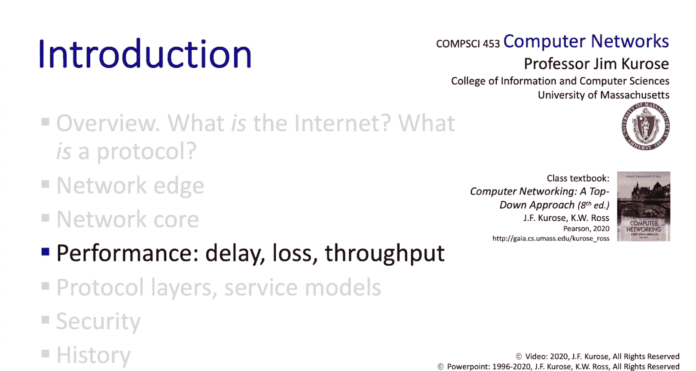

# 计算机网络：自顶向下方法：1.4：网络性能 🚀


在本节课程中，我们将深入学习计算机网络的两个核心性能指标：**延迟**和**吞吐量**。我们将详细拆解延迟的各个组成部分，学习使用`traceroute`工具测量实际网络延迟，并理解吞吐量如何受网络链路容量的限制。

---

## 延迟的四个组成部分 ⏱️

上一节我们讨论了网络核心中数据包的排队与丢失。本节中，我们将更深入地探讨性能问题，首先从延迟开始。

数据包在路由器中可能经历四种延迟：

1.  **处理延迟**
    这是路由器检查数据包首部、决定其转发方向以及进行完整性检查所花费的时间。这些操作通常在微秒或更短时间内完成。

2.  **排队延迟**
    这是数据包在输出链路的缓冲区中等待传输所花费的时间。排队延迟的长短取决于该链路的拥塞程度。

3.  **传输延迟**
    这是将数据包的所有比特推送到链路上所需的时间。它取决于数据包的长度和链路的传输速率。其计算公式为：
    **传输延迟 = L / R**
    其中，`L`是数据包长度（比特），`R`是链路传输速率（比特/秒）。

4.  **传播延迟**
    这是一个比特从链路起点传播到终点所需的时间。它取决于物理介质的长度和信号传播速度（接近光速）。对于长距离链路（如跨洋光缆或卫星链路），传播延迟会非常显著。

---

## 传输延迟 vs. 传播延迟 🚗

初学者有时会混淆传输延迟和传播延迟。让我们通过一个类比来区分它们。

想象一个由10辆车组成的车队（数据包）通过两个相距100公里的收费站（路由器）。
*   **传输延迟**：类似于收费站为每辆车服务所需的时间。假设每辆车需要12秒，那么整个车队通过第一个收费站需要 `10 * 12秒 = 120秒`。
*   **传播延迟**：类似于车辆在高速公路上行驶100公里所需的时间。假设车速为100公里/小时，那么最后一辆车从第一个收费站行驶到第二个收费站需要 `100公里 / 100公里/小时 = 1小时`。

因此，整个车队在第二个收费站前集结完毕的总时间是 **传输延迟（2分钟） + 传播延迟（60分钟） = 62分钟**。

---

## 深入理解排队延迟 📊

了解了传播延迟后，我们再来定量地分析排队延迟。

定义：
*   `a` = 数据包平均到达速率（包/秒）
*   `L` = 数据包长度（比特/包）
*   `R` = 链路传输速率（比特/秒）

那么，到达链路的比特率为 `L * a`。我们引入一个关键指标——**流量强度**：
**流量强度 = (L * a) / R**

流量强度直观地反映了系统负载：
*   当 **流量强度 → 0** 时，排队很少发生。
*   当 **流量强度 → 1** 时，平均到达的工作量接近系统处理能力，排队延迟会急剧增加。
*   当 **流量强度 > 1** 时，到达的工作量持续超过处理能力，队列将无限增长，延迟趋于无穷大。

这类似于道路拥堵：当车流量接近道路容量时，通行时间会迅速增加。

---

## 使用 Traceroute 测量实际延迟 🔍

本课程中，我们将使用真实的互联网来阐释所学原理。`traceroute` 就是一个可以测量从源主机到目的主机路径上各节点延迟的工具。

`traceroute` 的工作原理如下：
1.  首先向路径上的第一跳路由器发送三个探测数据包。
2.  该路由器回复响应消息。
3.  发送端测量从发出探测包到收到回复的**往返时间**，并显示这三个RTT值。
4.  接着向第二跳路由器发送三个探测包，测量并显示RTT。
5.  重复此过程，直到到达最终目的地。

以下是一个从美国马萨诸塞州到法国服务器的 `traceroute` 输出示例片段：
```
1   cs-gw (128.119.240.254)  1 ms  1 ms  2 ms
2   * * *
3   dc-rtr (192.168.1.1)      22 ms 22 ms 22 ms
4   fr-rtr (193.55.144.1)     105 ms 106 ms 105 ms
```
*   第1跳在本地网络，延迟约1-2毫秒。
*   第3跳到达华盛顿特区，延迟约22毫秒。
*   第4跳进入法国，延迟跃升至105毫秒，这体现了横跨大西洋的**传播延迟**。
*   有时会出现 `*`，表示该路由器未回复探测包。
*   RTT可能因网络拥塞（排队延迟）变化而波动，即使数据包传得更远，延迟也可能降低。

---

## 数据包丢失 📦

除了延迟，我们还需记住，在高拥塞情况下，当路由器缓冲区被填满时，会发生**数据包丢失**。丢失率有时可能高达10%-20%。在后续第3章，我们将学习主机如何检测和从丢包中恢复，以及如何控制发送速率以管理拥塞。

---

## 吞吐量 🌊

我们要讨论的最后一个性能指标是**吞吐量**，即从发送方到接收方传输数据的速率（比特/秒）。

理解吞吐量时，一个有用的类比是水流过一系列管道：
*   发送方以某种速率向管道注入流体（数据）。
*   路径上的每条传输链路就像一根有特定容量的管道（有的粗，有的细）。

关键问题是：当端到端流经过一系列串联的管道时，整体吞吐量受限于哪根管道？

请看以下两个场景：
1.  **场景一**：一个细管道（容量 `R_s`）后接一个粗管道（容量 `R_c`，且 `R_c > R_s`）。
    *   端到端吞吐量受限于细管道的容量 **`R_s`**。
2.  **场景二**：一个粗管道（容量 `R_s`）后接一个细管道（容量 `R_c`，且 `R_c < R_s`）。
    *   端到端吞吐量受限于细管道的容量 **`R_c`**。

**结论**：端到端路径的吞吐量受限于路径上**容量最小的链路**，即**瓶颈链路**。

---

## 多流共享与吞吐量 🤝

最后，我们需要考虑网络中多个数据流如何交互并影响各自的吞吐量。

假设有10台服务器和10台客户端，每对之间建立一个连接。网络边缘的链路是专用的，但网络中心有一条共享链路，容量为 `R`，并且该链路能公平地在10个流之间分配带宽。

那么，每个连接将经过三段“管道”：容量为 `R_s` 的接入链路、共享的 `R/10` 核心链路、容量为 `R_c` 的接入链路。

因此，**每个连接的端到端吞吐量将是这三个值中的最小值：`min(R_s, R_c, R/10)`**。在实践中，通常 `R_s` 或 `R_c`（边缘链路）会小于 `R/10`，这意味着瓶颈链路往往位于网络边缘。

---

## 总结 📝

本节课中，我们一起深入学习了网络性能的两个关键方面：延迟和吞吐量。

*   在延迟部分，我们明确了其四个组成部分：**处理延迟**、**排队延迟**、**传输延迟**和**传播延迟**，并使用 `traceroute` 工具观察了互联网中的实际延迟。
*   在吞吐量部分，我们借助流体与管道的类比，理解了端到端吞吐量受限于路径上的**瓶颈链路**，并探讨了多流共享场景下的吞吐量计算。



希望这些知识能帮助你更好地理解和分析网络性能。