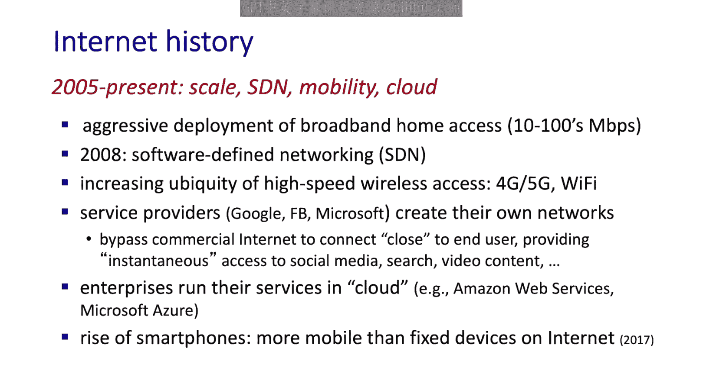
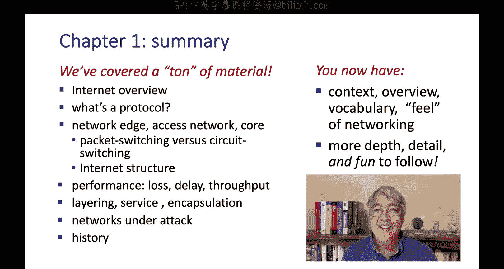
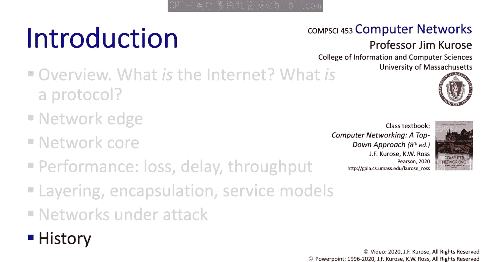

# Jim Kurose《计算机网络：自顶向下的方法｜Computer Networking： A Top-Down Approach》中英（deepseek p07 -07-1.7 History of Computer Networking, and Chapter 1 -BV1UMtueiEaA_p7-

In this section we'll cover the history of computer networking now our course is about principles and practice and in this history overview you'll see that some of the principles and practices are relatively new but others have their foundations in research that was done 60 years ago。

 30 years before the birth of the internet， if you're a college a student now even more than 30 years before your birth。

And some networking ideas are even older。 The telephone network， for example。

 is more than 100 years old。 They had to deal with issues like switching and routing。

 Here's a picture of the first switch that was installed in the Paris Central office for their telephone network in 1879。

 And here's an even older picture of another network， a Semaphore Signing network。

 This is a Semaphore relay node that was used to relay encrypted and and encrypted messages from source to destination。

 Both the switch and this example of the Semapho node are an an amazing museum called the Arts and Metier Museum in Paris。

 So if you make it to Paris。 Forge the Louvre， Forge the Muier ds， go to the Arts and Mitier Museum。

 especially if you like network。 But let's get back to the history of computer networking。

 And there are a lot of great resources online documentary's websites books that people have written。

 and our coverage here is going to be。😊，And what we want to do is we're going to break the history of computer networking into five epics。

 so why don't we get started in 1961 and look at the early days of packet switching。

Let's start in 1961。 The telephone network at the time was the world's dominant communication network。

 Now， remember that the telephone network uses circuit switching。

 which we looked at earlier to transmit information from send to receiver。

 and this was probably an appropriate choice， given that voice is generated and transmitted at a constant rate。

 But given the increasing importance of computers， including timeshaed computers。

 the 1960s was probably natural to consider how should we hook computers together so that they could be shared among geographically distributed users。

 the traffic generated by such computer users was likely to be bursty with periods of activity followed by period of inactivity。

 Well， the first paper published on packet switching was by Lyn Kleinro who is a graduate student at MIT a professor at UCLA still。

 he used queuing theory to show the effectiveness of packet switch networks for handling burstty traffic。

By 1964， Paul Barron at the RAand Institute had begun investigating the use of packet switching in military networks。

 and at the National Physical Laboratory in England。

 researchers were also developing their ideas on packet switching。

It prettyty amazing that these three research groups around the world。

 each unaware of each other's work at the time， were to become the inventors of packet switching。

 there must have been something in the air at the time。In 1967。

 the Advanced Research Projects Agency also known as ARPA published a plan for a network known as ARPE。

 which would become the world's first packet switchitch computer network。

 and the oldest direct ancestor of what we know today of as the Internet in 1972。

 the first hostto hostt Pro known as the network control protocol andCP was completed。

 its the direct ancestor of TCP and IP， Ray Tommlinson wrote the first email program and the ARPE had already grown to 15 nodes。

The initial aRPpanet was just a single standalone network and in the early to mid-1970s。

 several other standalone packet switch networks were coming into existence。

 Aloonenet was a microwave network linking universities on the Hawaiian Islands together DARPA was building a second packet switch network。

 a packet satellite network as well as a packet radio network that's essentially the ancestor of today's cellular data networks。

 CCluds was a French packet switching network the number of networks was growing and with perfect hindsight you can look back and see that the time was ripe for developing some kind of all encompasscomping architecture for connecting networks together The first work on interconnecting networks together was again undertaken by DARPA Viitz Surf and Bob Khn published a paper in 1974。

 laying out the principles of what they called interneting how to build a network of networks。

Interneting principles that will come to understand really deeply in this course have essentially defined today's internet architecture and you can see the four points here。

 minimalism and autonomy， the ability to easily interconnect networks with no internal changes。

 the notion of a best effort service model， knowing that packets could be lost or delayed within the network。

 what's known as stateless routing and an overall decentralized approach towards how networks should be controlled。

In 1976， Ethernet was invented by Bob Metcalf in his PhD thesis and there were proprietary commercial networks being built at the end of the decade。

 Apant has 200 nodes。The 1980s were marked by the standardization of a suite of apannet protocols that we're still using today and in the continued explosive growth in networks in the ARPpanet community。

 many of the final pieces that form the foundation of today's Internet architecture were falling into place。

 TCP and I were standardized in the early 1980s。 The SMmtp email protocol was developed in 1982 and SMmTP is still the defining protocol for email。

 The domain name system， which is used to map between a human readable internet name for example。

 Gaia。 cs。 umass。edu and a 32 B IP address was developed。 That was 1983。 SMTP and DNS。

 the domain name system are application layer protocols。

 and so we'll study them in a lot of detail when we get to the next chapter。In the late 1980s。

 important extensions were made to TCP to implement hostbased congestion control that is to allow a host to decrease its sending rate when it notices packetet Los or packetet Delay due to congestion in the 1980s。

 there were also a number of new computer networks that were created to link universities together there was a network called Binet that provided email and file transfers among universities in the Northeast。

 there was a network called CSNe， the Computer Science Network。

 that was formed to link university researchers who didn't have access to ARPnet。

 which was still running， and in 1986， the National Science Foundation created NSFnet to provide access to NSF sponsored supercomputing centers and by the end of the decade。

 the role of NSF expanded and it was now serving as a primary backbone linking regional networks and interconnecting with other networks。

And by the end of the 1980s， the number of hosts that were connected to this network of networks。

 something looking a lot like today's internet would reach 100，000 hosts。So now' the 1990s。

 the early 1990s saw a number of events that symbolized the continued evolution of the network and the soon to arrive commercialization of the Internet。

 ARPnet， the progenitor of the Internet that we looked at earlier was decommissioned in 1991 NSFnet lifted its restrictions on the use of NSF for commercial purposes。

 I can still remember the day when I received my first email advertising。

 up until then the acceptable use policy for these networks was that they were not to be used for commercial purposes。

 No advertising。 Can you imagine NSFnet was decommissioned in 1995 and new businesses。

 Internet service providers like the Tier1 providers we discussed earlier。

 sprung up to carry backbone traffic。 And， of course。

 the main event for the 1990s from a networking point of view， was the birth of the World wide Web。

 The Web was invented at Cern by Tim Burnerss Lee。Early 1990s。

 based on ideas that originated in earlier work on hypertext back in the 1940s。

Berns Lee and his colleagues developed initial versions of HTML。

 that's the markup language for writing web documents， HTTP。

 the application layerer protocol for the web that we study earlier， a web server and a browser。

 the four key components of the web。In the late 1990s， the use of the web exploded。

 network security became a critical issue， and there were somewhere around 50 million hosts on the Internet。

So in the 10 years between 1989 and 1999， the number of hosts grew from 100，000 to 50 million。

 and backbone speeds changed from a few megabits per second to gigabits per second。

And so what have we seen from 20002005 until the present？ Well。

 we've seen the aggressive deployment of broadband into the home running out of tens to hundreds of mebit per second in 2008 software defined networking was defined。

 We're going take a very close look at that。 when we get to Chapt 5。

 We've seen the increasing ubiquity of high speed wireless access。

 First Wifi and increasing 4G and soon 5G networks。 We've also seen service providers。

 content providers like Google Facebook and Microsoft creating their own global backbone networks by passing the commercial Internet Tier 1 ISps to connect close to the end users。

 This is so that they can provide close to instantaneous access to social media， search。

 video content。 And then we've seen enterprises running their services in the cloud through Amazon Web services and Microsoft Azure。

 We'll look at data center networks， for example， when we get to。5。And lastly。

 we've seen the rise of smartphones and an increased emphasis on mobility。

 since 2017 there are actually more mobile devices than fixed devices connected to the internet。

In this section， we've gone through a brief overview of the history of computer networking。

 but hopefully you've already seen the emergence of some of the ideas that we'll be studying in this course and with this section we conclude the broader overview of all of computer networking。

Well， in this broad overview of computer networking， we've covered a ton of material。 remember。

 we started by asking the basic questions what's the internet and what's a protocol。

 Then we started at the network edge， We talked about the devices， the hosts。

 the servers at the network edge。 we talked about access networks。

 and we dove down deep into the core， and we talked about the techniques of packet switching and circuit switching。

 and we talked about the structure of the internet as a network of networks。

 Then we moved on to network performance。 We talked about the issues of packet loss。

 packet delay and throughput。 We then took a more abstract view of things and we talked about architecture。

 We talked about layered architecture， the notionsha of encapsulation of data as protocol data units flow up and down the protocol stack。

 and then talked about networks under attack。And wrapped up our discussion with a quick overview of the history of networking and so here we are。

 I hope you found this broad introduction interesting and hopefully not too overwhelming。 remember。

 the idea here was to get the big picture view to learn the vocabulary to see the force from the trees I can promise you than in the upcoming chapters in the upcoming classes we're going to dive down into these topics in a lot more detail。

 a lot more to learn， a lot more fun to have。

